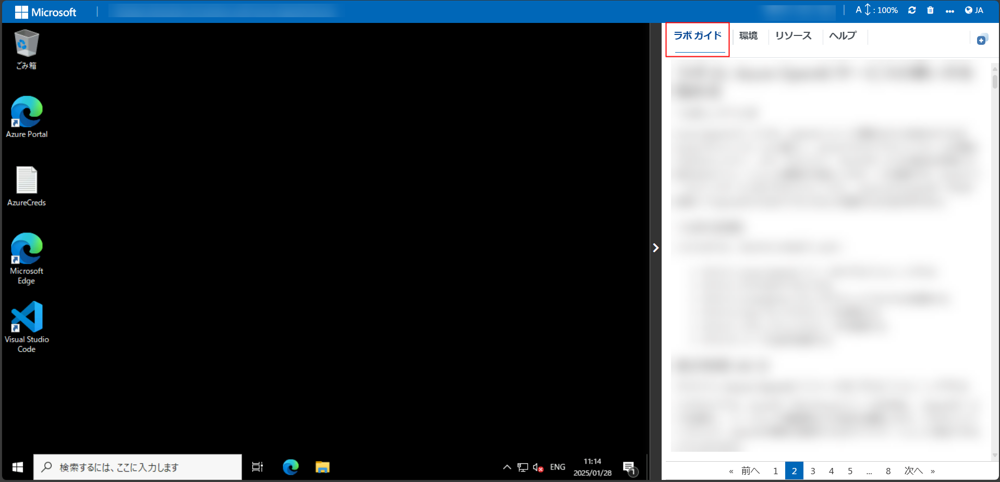
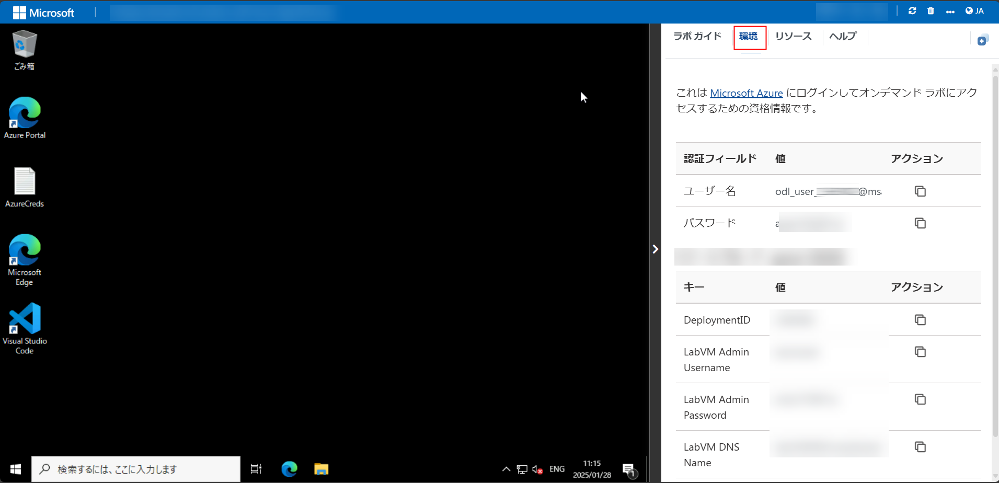
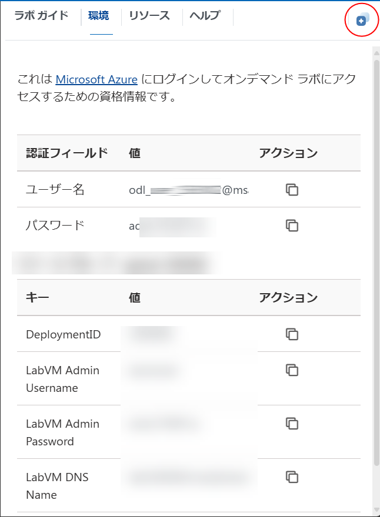
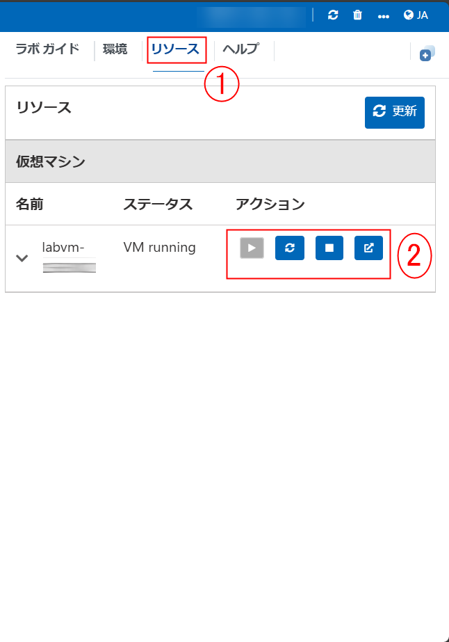
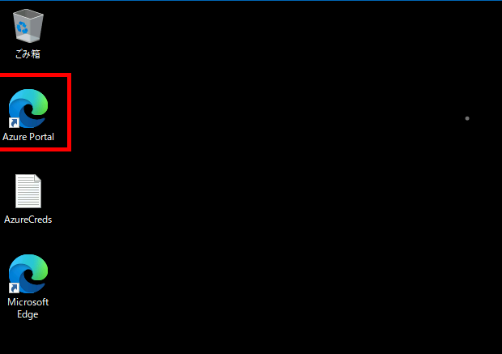
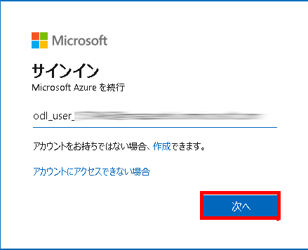
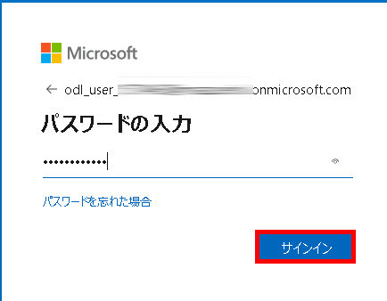
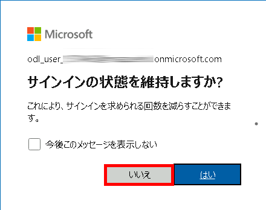

# Microsoft Azure Cosmos DB を使用したクラウドネイティブアプリケーションの開発

### 全体の推定所要時間: 30分

## 概要

このラボでは、Azure Cosmos DB をプロビジョニングし、非リレーショナルデータを保存する方法を学びます。Cosmos DB アカウントの作成、サンプルデータベースのセットアップ、アイテムの表示や作成によるデータ操作、クエリの実行を通じて、その機能を探索します。

## 目的

非リレーショナルデータを保存するための Azure Cosmos DB データベースをプロビジョニングおよび管理するスキルを習得します。このラボの終了時には、以下ができるようになります：

- **Azure Cosmos DB の探索:** このラボの目的は、Azure Cosmos DB データベースのプロビジョニングと管理、非リレーショナルデータの保存、およびサンプルデータベースの作成・管理・クエリを通じてその機能を探索できるようになることです。

## 前提条件

参加者には以下が求められます：

- **Azure プラットフォームの理解:** Azure Cosmos DB を含む Azure サービスの基本的な知識。

## アーキテクチャ

このアーキテクチャは、非リレーショナルデータを管理するために Azure Cosmos DB をプロビジョニングして使用するプロセスを示しています。このラボでは、Cosmos DB アカウントの作成、サンプルデータベースのセットアップ、アイテムの表示や作成によるデータ操作、クエリの実行を通じてその機能を探索します。このラボを通じて、Azure Cosmos DB を使用して非リレーショナルデータを効率的に保存・管理するための基礎的な理解を得ることができます。

## アーキテクチャ図

## コンポーネントの説明

- **Azure Cosmos DB:** MongoDB API をサポートし、シームレスな統合を可能にする、グローバルに分散されたマルチモデルデータベースサービスです。Cosmos DB は、スケーラビリティ、高可用性、低レイテンシを提供します。

## ラボの始め方

Microsoft Azure Cosmos DB を使用したクラウドネイティブアプリケーションの開発ワークショップへようこそ！クラウドネイティブアプリケーションを構築するための Microsoft Azure Cosmos DB を実践的に学び、探索できるシームレスな環境を用意しました。この体験を最大限に活用するために始めましょう：

## ラボ環境へのアクセス

準備が整ったら、ブラウザ内で仮想マシンとラボガイドに簡単にアクセスできます。

   

### 仮想マシンとラボガイド

仮想マシンはワークショップ全体での作業の要です。ラボガイドは成功への道しるべです。

## ラボリソースの探索

ラボリソースとアカウント情報を確認するために、**「Environment Details」** タブに移動します。

   

## 分割ウィンドウ機能の利用

便利なように、右上隅の **「Split Window」** ボタンを選択して、ラボガイドを別のウィンドウで開くことができます。

   

## 仮想マシンの管理

必要に応じて、**「Resources」** タブから仮想マシンを開始、停止、または再起動できます。体験はあなたの手の中にあります！

   

## ラボガイドのズームイン/ズームアウト

1. 環境ページのズームレベルを調整するには、ラボ環境内のタイマーの横にある **A↕ : 100%** アイコンをクリックしてください。

   

## Azure ポータルにアクセスする

1. 仮想マシン上で、以下のように Azure Portal アイコンをクリックします。

   

1. Azure ポータルにサインインします。

1. **「Sign into Microsoft Azure」** タブが表示されたら、以下の情報を入力します。

   - **メール/ユーザー名:** <inject key="AzureAdUserEmail"></inject>

     

1. 次に、パスワードを入力します。

   - **パスワード:** <inject key="AzureAdUserPassword"></inject>

     

1. ポップアップ「**サインイン状態を維持しますか？**」が表示されたら **「いいえ」** を選択します。

   

1. 「**Microsoft Azureへようこそ**」が表示された場合は「**後で行う**」をクリックしてツアーをスキップします。

## サポート連絡先

クラウドラボサポートチームは、24時間365日対応しており、メールやライブチャットでサポートを提供します。学習者とインストラクターの両方に対応した専用のサポートチャネルを用意しており、あらゆるニーズに迅速かつ効率的に対応します。

### サポート連絡先

- **メールサポート:** [cloudlabs-support@spektrasystems.com](mailto:cloudlabs-support@spektrasystems.com)

- **ライブチャットサポート:** [CloudLabs サポート](https://cloudlabs.ai/labs-support)

次のページに進むには、右下の「Next」をクリックしてください！

### ハッピーラーニング！🎉