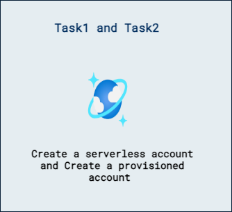

# Lab 02a - Azure Cosmos DB for NoSQL の計画と実装

## ラボ シナリオ

理解しておくべき最も重要な点のひとつは、Azure Cosmos DB for NoSQL におけるスループットの構成です。Azure Cosmos DB for NoSQL のコンテナーを作成するには、まずアカウントを作成し、その後にデータベースを作成する必要があります。
このラボでは、Data Explorer でさまざまな方法を使ってスループットをプロビジョニングします。データベース レベルとコンテナー レベルで、手動またはオートスケールを使用してスループットをプロビジョニングします。

## ラボ シナリオ

考えをまとめる上で最も重要な点のひとつは、Azure Cosmos DB for NoSQL におけるスループットの構成です。Azure Cosmos DB for NoSQL のコンテナーを作成するには、まずアカウントを作成し、その後にデータベースを作成する必要があります。
このラボでは、Data Explorer を使用してさまざまな方法でスループットをプロビジョニングします。データベース レベルとコンテナー レベルの両方で、手動またはオートスケールを使用してスループットをプロビジョニングします。

## ラボの目的

このラボで完了するタスク:
- タスク 1: サーバーレス アカウントを作成する。
- タスク 2: プロビジョニング アカウントを作成する。

## 推定所要時間: 30 分

## アーキテクチャ図

## 演習 1: Azure ポータルを使用して Azure Cosmos DB for NoSQL のスループットを構成する

### タスク 1: サーバーレス アカウントを作成する

まずはシンプルにサーバーレス アカウントを作成します。すべてがサーバーレスであるため、ここで構成する項目はほとんどありません。データベースとコンテナーを作成する際に、スループットをプロビジョニングする必要はありません。このアカウントの作成手順を進める中で、その点を確認できます。

1. 新しい Web ブラウザーのウィンドウまたはタブで、Azure ポータル (``portal.azure.com``) に移動します。

1. サブスクリプションに関連付けられた Microsoft の資格情報を使用してポータルにサインインします。

1. **Azure services** カテゴリで **Create a resource** を選択し、次に **Azure Cosmos DB** を選択します。

    > &#128161; 代替手順: **&#8801;** メニューを展開し **All Services** を選択、**Databases** カテゴリで **Azure Cosmos DB** を選択してから **Create** を選びます。

1. **Select API option** ウィンドウで、**Azure Cosmos DB for NoSQL** セクション内の **Create** オプションを選択します。

1. **Create Azure Cosmos DB Account** ウィンドウの **Basics** タブを確認します。

1. **Basics** タブで、各設定に対して次の値を入力します:

    | **Setting** | **Value** |
    | --- | --- |
    | **Subscription** | *既存の Azure サブスクリプション* |
    | **Resource Group** | *既存のリソース グループを選択* |
    | **Account Name** | *グローバルに一意の名前を入力* |
    | **Location** | *利用可能なリージョンを選択* |
    | **Capacity mode** | *Serverless を選択* |

1. **Review + Create** を選択して **Review + Create** タブに移動し、続けて **Create** を選択します。

    > &#128221; Azure Cosmos DB for NoSQL アカウントが使用可能になるまでに 10～15 分かかることがあります。

1. **Deployment** ペインを確認します。デプロイが完了すると、ペインに **Deployment successful** のメッセージが表示されます。

1. 引き続き **Deployment** ペイン内で、**Go to resource** を選択します。

1. **Azure Cosmos DB account** ペイン内のリソース メニューから **Data Explorer** を選択します。

1. **Data Explorer** ペインで **New Container** を展開し、**New Database** を選択します。

1. **New Database** ポップアップで、各設定に対して次の値を入力し、**OK** を選択します:

    | **Setting** | **Value** |
    | --- | --- |
    | **Database id** | *`cosmicworks`* |

1. **Data Explorer** ペインに戻り、階層内の **cosmicworks** データベース ノードを確認します。

1. **Data Explorer** ペインで **New Container** を選択します。

1. **New Container** ポップアップで、各設定に対して次の値を入力し、**OK** を選択します:

    | **Setting** | **Value** |
    | --- | --- |
    | **Database id** | *既存を使用* | *cosmicworks* |
    | **Container id** | *`products`* |
    | **Partition key** | *`/categoryId`* |

1. **Data Explorer** ペインに戻り、**cosmicworks** データベース ノードを展開して、階層内の **products** コンテナー ノードを確認します。

1. Azure ポータルの **Home** に戻ります。

### タスク 2: プロビジョニング アカウントを作成する

次に、より従来型の構成オプションを含むプロビジョニング スループット アカウントを作成します。この種類のアカウントでは多くの構成オプションが利用可能になり、やや複雑になることがあります。ここではデータベースとコンテナーのいくつかの組み合わせ例を示します。

1. **Azure services** カテゴリで **Create a resource** を選択し、次に **Azure Cosmos DB** を選択します。

    > &#128161; 代替手順: **&#8801;** メニューを展開し **All Services** を選択、**Databases** カテゴリで **Azure Cosmos DB** を選択してから **Create** を選びます。

1. **Select API option** ウィンドウで、**Azure Cosmos DB for NoSQL** セクション内の **Create** オプションを選択します。

1. **Create Azure Cosmos DB Account** ウィンドウの **Basics** タブを確認します。

1. **Basics** タブで、各設定に対して次の値を入力します:

    | **Setting** | **Value** |
    | --- | --- |
    | **Subscription** | *既存の Azure サブスクリプション* |
    | **Resource Group** | *既存のリソース グループを選択* |
    | **Account Name** | *cosmosdb420-XXXXXX* |
    | **Location** | *利用可能なリージョンを選択* |
    | **Capacity mode** | *プロビジョニング済みスループットを選択* |
    | **Apply Free Tier Discount** | *適用しない* |
    | **Limit the total amount of throughput that can be provisioned on this account** | *Unchecked* |

    >**注**: XXXXXX を環境の詳細ページに記載された DeploymentID 値に置き換えてください。

1. **Review + Create** を選択して **Review + Create** タブに移動し、続けて **Create** を選択します。

    > &#128221; Azure Cosmos DB for NoSQL アカウントが使用可能になるまでに 10～15 分かかることがあります。

1. **Deployment** ペインを確認します。デプロイが完了すると、ペインに **Deployment successful** のメッセージが表示されます。

1. 引き続き **Deployment** ペイン内で、**Go to resource** を選択します。

1. **Azure Cosmos DB account** ペイン内のリソース メニューから **Data Explorer** を選択します。

1. **Data Explorer** ペインで **New Container** を展開し、**New Database** を選択します。

1. **New Database** ポップアップで、各設定に対して次の値を入力し、**OK** を選択します:

    | **Setting** | **Value** |
    | --- | --- |
    | **Database id** | *`nothroughputdb`* |
    | **Provision throughput** | *Do not select* |

1. **Data Explorer** ペインに戻り、階層内の **nothroughputdb** データベース ノードを確認します。

1. **Data Explorer** ペインで **New Container** を選択します。

1. **New Container** ポップアップで、各設定に対して次の値を入力し、**OK** を選択します:

    | **Setting** | **Value** |
    | --- | --- |
    | **Database id** | *既存を使用* | *nothroughputdb* |
    | **Container id** | *`requiredthroughputcontainer`* |
    | **Partition key** | *`/primarykey`* |

