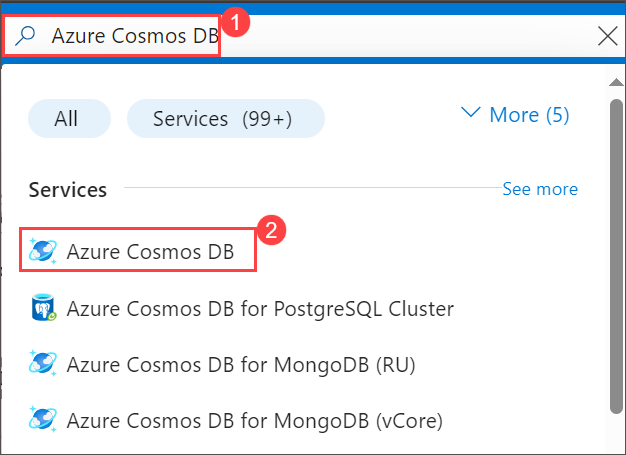
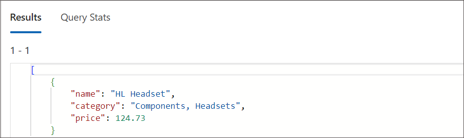

# Migrate existing data using Azure Data Factory

## Lab scenario

In Azure Data Factory, Azure Cosmos DB is supported as a source of data ingest and as a target (sink) of data output.
In this lab, we will populate Azure Cosmos DB using a helpful command-line utility and then use Azure Data Factory to move a subset of data from one container to another.

## Lab objectives

In this lab, you will complete the following tasks:
- Task 1: Create and seed your Azure Cosmos DB SQL API account.
- Task 2: Create Azure Data Factory resource.

### Estimated Timing: 30 minutes

## Architecture Diagram


### Task 1: Create and seed your Azure Cosmos DB for NoSQL account

In this task, you'll create and configure an Azure Cosmos DB for NoSQL account, followed by seeding it with a database and container using a command-line utility.

You will use a command-line utility that creates a **cosmicworks** database and a **products** container at **4,000** request units per second (RU/s). Once created, you will adjust the throughput down to 400 RU/s.

To accompany the products container, you will create a **flatproducts** container manually that will be the target of the ETL transformation and load operation at the end of this lab.

1. On Azure Portal page, in Search resources, services and docs (G+/) box at the top of the portal, enter **Azure Cosmos DB**, and then select **Azure Cosmos DB** under services.

   
   
1. Select **+ Create** under **Azure Cosmos DB for NoSQL** click on **Create** to create  **Azure Cosmos DB for NoSQL** account.

    

    

1. Specify the following settings, leaving all remaining settings to their default values, and select **Review + create**:

    | **Setting**         | **Value** |
    | --------------------|--------------------------------------------------- |
    | **Subscription**    | *Your existing Azure subscription* |
    | **Resource group**  | *Select an existing Cosmosdb-<inject key="DeploymentID" enableCopy="false"/>* |
    | **Account Name**    | *sql-<inject key="DeploymentID" enableCopy="false"/>* |
    | **Location**        | *Choose any available region* |
    | **Capacity mode**   | *Provisioned throughput* |
    | **Apply Free Tier Discount** | *Do Not Apply* |
    | **Limit the total amount of throughput that can be provisioned on this account** | *Unchecked* |

     

1. Click on **Create**.

    

1. Wait for the deployment task to complete before continuing with this task.

1. Once deployemet is completed select **Go to resources**. On the newly created **Azure Cosmos DB** account under **Settings** navigate to the **Keys** pane.

    

1. On the newly created **Azure Cosmos DB** account under **Settings** navigate to the **Keys** pane.

    

1. This pane contains the connection details and credentials necessary to connect to the account from the SDK. Specifically:

    1. Notice the **URI** field. Copy the value you will use this **endpoint** value later in this exercise.

    1. Notice the **PRIMARY KEY** field. Copy the value uou will use this **key** value later in this exercise.

        

1. Keep the browser tab open, as we will return to it later.

1. On the LabVM select the **Visual Studio Code** shortcut.

    

1. In **Visual Studio Code**, open the **Terminal** menu by selecting **... (ellipses) (1)** > **Terminal (2)** > **New Terminal (3)** to open a new terminal with your 
   existing instance.

    

1. In the terminal run the following commad to install the [cosmicworks][nuget.org/packages/cosmicworks] command-line tool for global use on your machine.

    ```
    dotnet tool install cosmicworks --global --version 1.*
    ```

    > **Note:** This command may take a couple of minutes to complete. This command will output the warning message (*Tool 'cosmicworks' is already installed') if you have already installed the latest version of this tool in the past.

1. Once the Installation is completed, make sure to close the **Visual Studio Code** and re-open to perform the below command.

1. Run the following command cosmicworks to seed your Azure Cosmos DB account with the following command-line options:

    | **Option**       | **Value** |
    | ---------------- | ----------|
    | **--endpoint**   | *The endpoint value you copied earlier in this lab* |
    | **--key**        | *The key value you coped earlier in this lab* |
    | **--datasets**   | *product* |

    ```
    cosmicworks --endpoint <cosmos-endpoint> --key <cosmos-key> --datasets product
    ```

    > &#128221; For example, if your endpoint is: **https&shy;://dp420.documents.azure.com:443/** and your key is: **fDR2ci9QgkdkvERTQ==**, then the command would be:
    > ``cosmicworks --endpoint https://dp420.documents.azure.com:443/ --key fDR2ci9QgkdkvERTQ== --datasets product``
    > **Note:** If you get an error while running the above command, close the visual studio code and re-open to run the above command.

1. Wait for the **cosmicworks** command to finish populating the account with a database, container, and items.

1. Close the integrated terminal.

1. Close **Visual Studio Code**.

1. Navigate to the **Azure portal**.

1. On Azure Portal page, in Search resources, services and docs (G+/) box at the top of the portal, enter **Azure Cosmos DB**, and then select **Azure Cosmos DB** under 
   services.

   

1. Select **sql-<inject key="DeploymentID" enableCopy="false"/>**.

     

1. Within the **Azure Cosmos DB** account resource, navigate to the **Data Explorer** pane. In the **Data Explorer**, expand the **cosmicworks** database node, expand the **products** container node, and then select **Items**.

    

1. Observe and select the various JSON items in the **products** container. These are the items created by the command-line tool used in previous steps.

   

1. Select the **Scale & Settings** node. In the **Scale & Settings** tab, select **Manual**, update the **required throughput** setting from **4000 RU/s** to **400 RU/s** and then **Save** your changes**.

    

1. In the **Data Explorer** pane, select **+ New Container** > **+ New Container**.

    

1. In the **New Container** popup, enter the following values for each setting.

    | **Setting**   | **Value** |
    | ------------- | --------- |
    | **Database id** | *Use existing* &vert; *cosmicworks* |
    | **Container id** | *`flatproducts`* |
    | **Partition key** | *`/category`* |
    | **Container throughput (autoscale)** | *Manual* |
    | **RU/s** | *`400`* |
    
    

1. Scroll down and click on **OK**.

   

1. Back in the **Data Explorer** pane, expand the **cosmicworks** database node and then observe the **flatproducts** container node within the hierarchy.

     
   
1. Return to the **Home** of the Azure portal.

    > **Congratulations** on completing the lab! Now, it's time to validate it. Here are the steps:
    > - Hit the Validate button for the corresponding task. If you receive a success message, you have successfully validated the lab. 
    > - If not, carefully read the error message and retry the step, following the instructions in the lab guide.
    > - If you need any assistance, please contact us at labs-support@spektrasystems.com. 

    <validation step="4f0ebcc4-a71c-450a-b7e0-5099feed58d5" />

### Task 2: Create Azure Data Factory resource

In this task, you will create an Azure Data Factory resource and configure it to perform a one-time ETL (Extract, Transform, Load) operation. The goal is to move data from one Azure Cosmos DB NoSQL container (products) to another container (flatproducts), applying a transformation during the process.

Now that the Azure Cosmos DB for NoSQL resources are in place, you will create an Azure Data Factory resource and configure all of the necessary components and connections to perform a one-time data movement from one NoSQL API container to another to extract data, transform it, and load it to another NoSQL API container

1. On Azure portal home page select **+ Create a resource**.
  
     
   
1. On **Create a resource** page search and select **Azure Data Factory**, and then create a new **Azure Data Factory** resource with the following settings, leaving

    

1. On **Data Factory** select **Create** > **Data Factory**.

    

1. Specify the following settings, leaving all remaining settings to their default values. Click on **Next: Git configuration**.

    | **Setting** | **Value** |
    | --- | --- |
    | **Subscription** | *Your existing Azure subscription* |
    | **Resource group** | *Cosmosdb-<inject key="DeploymentID" enableCopy="false"/>* |
    | **Name** | *datafactory-<inject key="DeploymentID" enableCopy="false"/>* |
    | **Region** | *Choose any available region* |
    | **Version** | *V2* |

    

1. In **Git configuration** blade select the checkbox for **Configure Git later** and click on  **Review + Create** > **Create**.
    

1. Once resource deployement is completed click on **Go to resource** and select **Launch studio** under **Azure Data Factory Studio**.

    

    
   
    > &#128161; Alternatively, you can navigate to (``adf.azure.com/home``), select your newly created Data Factory resource, and then select the home icon.

1. From the **Home** screen. Select the **Ingest** option to begin the quick wizard to perform a one-time copy data at scale operation and move to the **Properties** step of the wizard.

   

1. Starting with the **Properties** step of the wizard, in the **Task type** section, select **Built-in copy task**. In the **Task cadence or task schedule** section, select **Run once now** and then select **Next** to move to the **Source** step of the wizard.

    
   
1. In the **Source** step of the wizard, in the **Source type** list, select **Azure Cosmos DB NoSQL** and in  the **Connection** section, select **+ New connection**.

    

1. In the **New connection (Azure Cosmos DB for NoSQL)** popup, configure the new connection with the following values, and then select **Create**:

    | **Setting** | **Value** |
    | --- | --- |
    | **Name** | *`CosmosSqlConn`* |
    | **Connect via integration runtime** | *AutoResolveIntegrationRuntime* |
    | **Authentication method** | *Account key* &vert; *Connection string* |
    | **Account selection method** | *From Azure subscription* |
    | **Azure subscription** | *Your existing Azure subscription* |
    | **Azure Cosmos DB account name** | *Your existing Azure Cosmos DB account name you chose earlier in this lab* |
    | **Database name** | *cosmicworks* |

    

1. Back in the **Source data store** section, within the **Source tables** section, select **Query** and in the **Table name** list, select **products**.

    

1. In the **Query** editor, delete the existing content and enter the following query:

    ```
    SELECT 
        p.name, 
        p.categoryName as category, 
        p.price 
    FROM 
        products p
    ```

1. Select **Preview data** to test the query's validity. Select **Next** to move to the **Destination** step of the wizard.

    
   
1. In the **Destination** step of the wizard, in the **Destination type** list, select **Azure Cosmos DB for NoSQL** and in the **Connection** list, select 
   **CosmosSqlConn** then in **Custom query** choose **flatproducts** and then select **Next** to move to the **Settings** step of the wizard.

   
   
1. In the **Settings** step of the wizard, in the **Task name** field, enter **`FlattenAndMoveData`**.

    

1. Leave all remaining fields to their default blank values and then select **Next** to move to the final step of the wizard.

    

1. Review the **Summary** of the steps you have selected in the wizard and then select **Next**.

    

1. Observe the various steps in the deployment. When the deployment has finished, select **Finish**.

1. Close your web browser window or tab.

1. Navigate to the **Azure portal**.

1. On Azure Portal page, in Search resources, services and docs (G+/) box at the top of the portal, enter **Azure Cosmos DB**, and then select **Azure Cosmos DB** under 
   services.

   

1. Select **sql-<inject key="DeploymentID" enableCopy="false"/>**.

1. Within the **Azure Cosmos DB** account resource, navigate to the **Data Explorer** pane. In the **Data Explorer**, expand the **cosmicworks** database node, select 
   the **flatproducts** container node, and then select **New SQL Query**.

    

1. Delete the contents of the editor area.

1. Create a new SQL query that will return all documents where the **name** is equivalent to **HL Headset** and select **Execute Query**.

    ```
    SELECT 
        p.name, 
        p.category, 
        p.price 
    FROM
        products p
    WHERE
        p.name = 'HL Headset'
    ```

    

1. Observe the results of the query.

    

1. Close your web browser window or tab.

    > **Congratulations** on completing the lab! Now, it's time to validate it. Here are the steps:
    > - Hit the Validate button for the corresponding task. If you receive a success message, you have successfully validated the lab. 
    > - If not, carefully read the error message and retry the step, following the instructions in the lab guide.
    > - If you need any assistance, please contact us at labs-support@spektrasystems.com.

   <validation step="e513aa34-ca14-4de5-a2f3-139f051e5c35" />

### Summary 

This lab focuses on migrating data between two Azure Cosmos DB containers using Azure Data Factory. You will first set up an Azure Cosmos DB for NoSQL account and populate it with sample data. Then, you'll create an Azure Data Factory resource to perform a one-time ETL operation, extracting data from one container, transforming it, and loading it into another container. The lab demonstrates how to integrate Azure services for efficient data movement and transformation.
 
### Review

In this lab, you have completed:

- Created and seeded your Azure Cosmos DB NoSQL API account.
- Created Azure Data Factory resource.

### You have successfully completed the lab.
