# SDK を使って Azure Cosmos DB for NoSQL に接続する

### 推定所要時間: 60 分

## ラボ シナリオ

.NET 用 Azure SDK は、Azure サービスとやり取りするための一貫した開発者体験を提供するライブラリ群です。.NET Standard 2.0 上に構築されており、.NET Framework 4.6.1 以降、.NET Core 2.1 以降、および .NET 5 以降と互換性があります。

このラボでは、Azure SDK for .NET を使用して Azure Cosmos DB SQL API アカウントに接続します。

## ラボの目的

このラボで完了するタスク:
- タスク 1: 開発環境の準備。
- タスク 2: Azure Cosmos DB SQL API アカウントの作成。
- タスク 3: NuGet 上の Microsoft.Azure.Cosmos ライブラリを確認。
- タスク 4: Microsoft.Azure.Cosmos ライブラリを .NET プロジェクトに追加。
- タスク 5: Microsoft.Azure.Cosmos ライブラリを使用する。
- タスク 6: スクリプトのテスト。

### タスク 1: 開発環境の準備

このタスクでは、Visual Studio Code を設定して Azure Cosmos DB を扱うための開発環境を準備します。

1. デスクトップから Visual Studio Code を開きます。

    

1. 左ペインから **Extensions (1)** ブレードを選択します。**C# (2)** で検索し、**Install (3)** を選択して拡張機能をインストールします。

   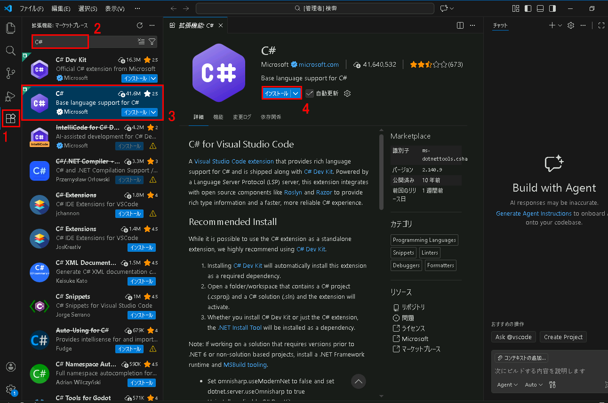

1. 画面左上の **file (1)** オプションを選択し、ペインのオプションから **Open Folder (2)** を選択します。**C:\AllFiles\dp-420-cosmos-db-dev** に移動します。

    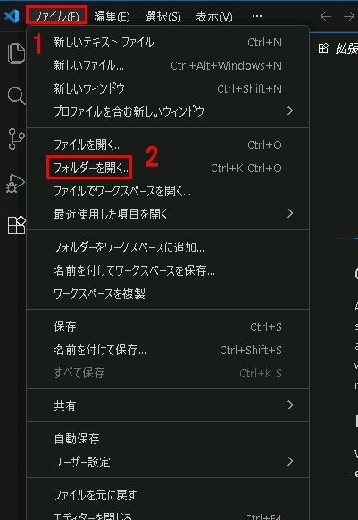

1. **C:\AllFiles\dp-420-cosmos-db-dev** に移動し、**dp-420-cosmos-db-dev** を選択して **Select Folder** をクリックします。

   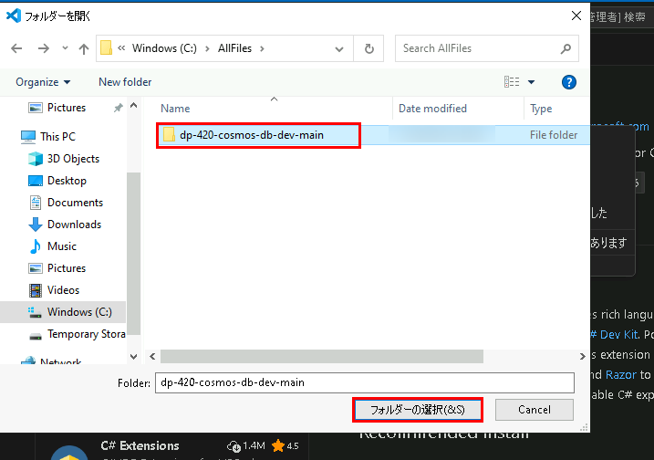

1. 「このフォルダー内のファイルの作成者を信頼しますか（Do you trust the author of the files in this folder）」と表示された場合は **Yes, I trust the authors** をクリックします。

   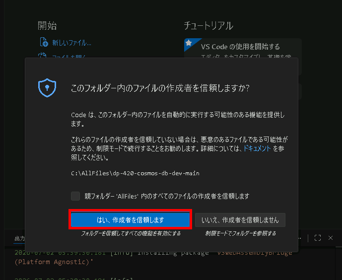

### タスク 2: Azure Cosmos DB SQL API アカウントの作成

このタスクでは、Azure Cosmos DB SQL API アカウントをプロビジョニングし、今後の開発で使用するために必要な接続情報を取得します。

Azure Cosmos DB は複数の API をサポートするクラウドベースの NoSQL データベース サービスです。初めてアカウントをプロビジョニングする際に、アカウントでサポートする API（例: **Mongo API** や **NoSQL API**）を選択します。Azure Cosmos DB SQL API アカウントのプロビジョニングが完了したら、エンドポイントとキーを取得して、Azure SDK for .NET または任意の SDK を使って接続できます。

1. Azure ポータルの上部にある「Search resources, services and docs (G+/)」ボックスに **Azure Cosmos DB (1)** と入力し、サービス一覧から **Azure Cosmos DB (2)** を選択します。

   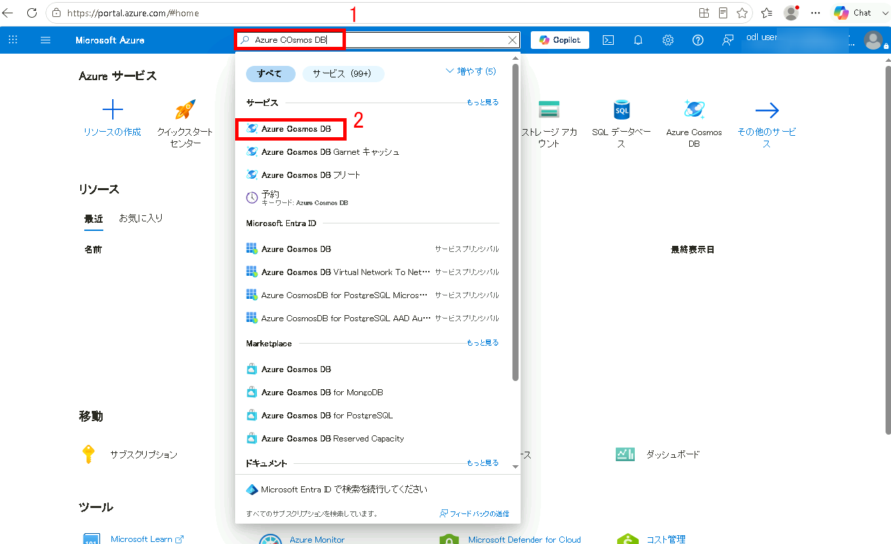
   
1. **Azure Cosmos DB for NoSQL** の下で **+ Create (1)** を選択し、**Create (2)** をクリックして **Azure Cosmos DB for NoSQL** アカウントを作成します。

   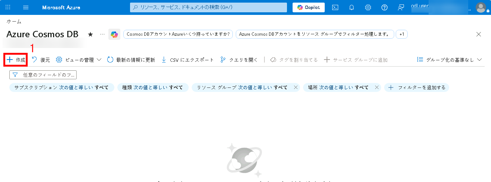

   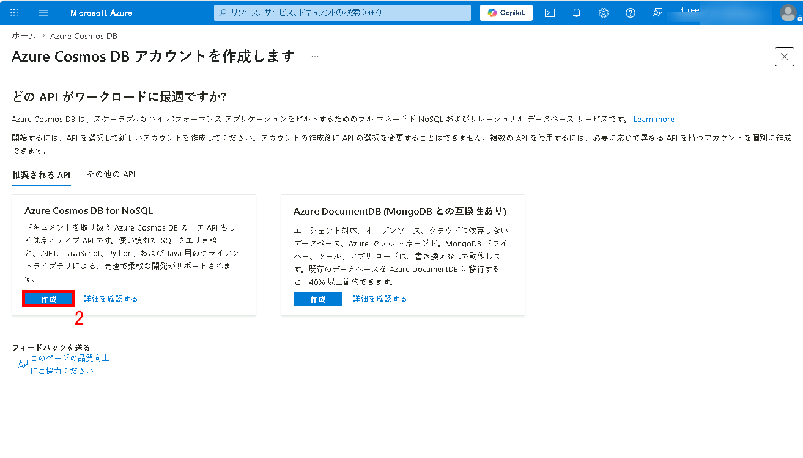

1. 以下の設定を指定し、残りはすべてデフォルトのままにして **Review + create (10)** を選択します:

    | **Setting**         | **Value** |
    | --------------------|--------------------------------------------------- |
   | **Workload Type**   | *Production* (1) |
   | **Subscription**    | *既存の Azure サブスクリプション* (2) |
   | **Resource group**  | *既存の Cosmosdb-<inject key="DeploymentID" enableCopy="false"/> を選択* (3) |
   | **Account Name**    | *sql-<inject key="DeploymentID" enableCopy="false"/>* (4) |
   | **Location**        | *デフォルトのリージョンを選択* (5) |
   | **Capacity mode**   | *Provisioned throughput* (6) |
   | **Apply Free Tier Discount** | *Do Not Apply* (7) |
   | **Limit the total amount of throughput that can be provisioned on this account** | *Unchecked* (8) |

    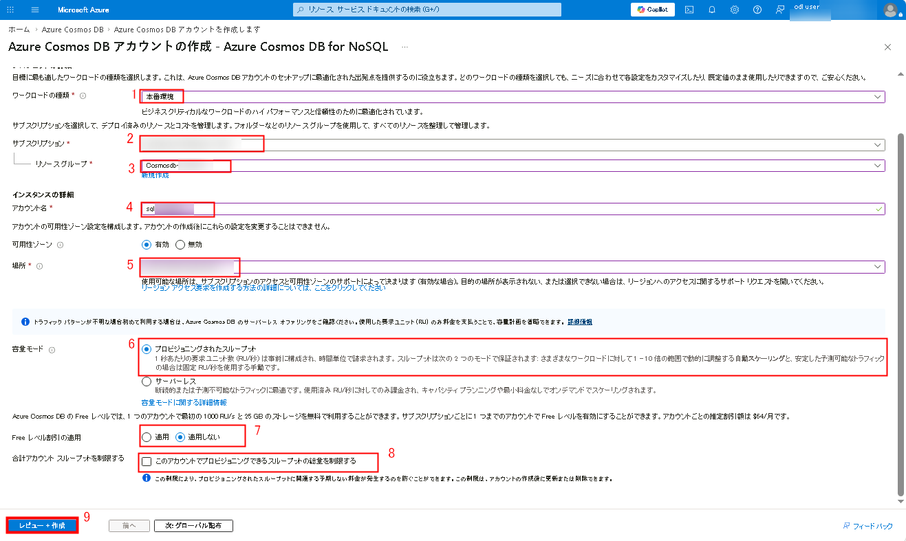

1. **Create** をクリックします。

   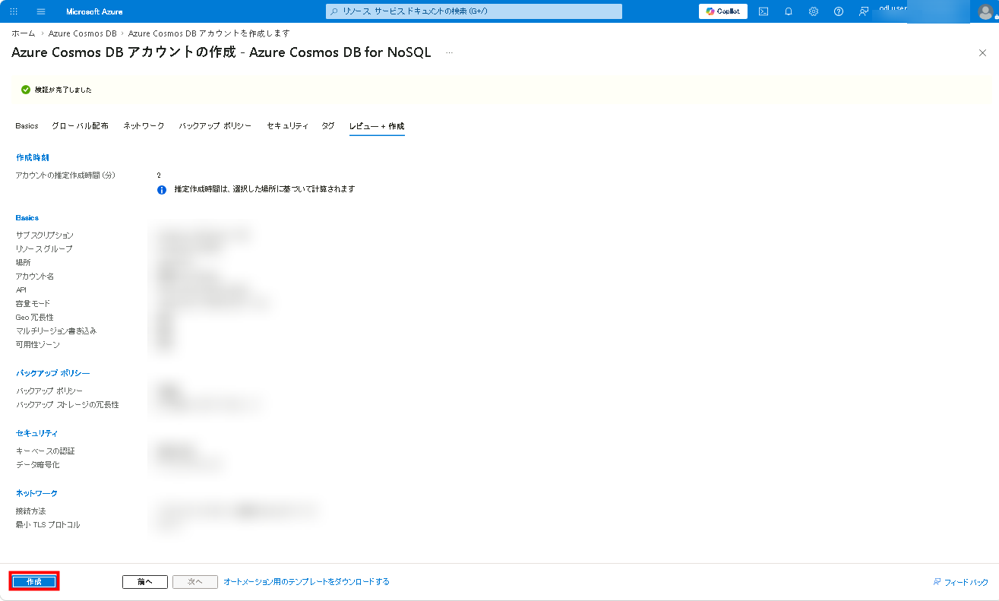

1. デプロイが完了するまで待ちます。

1. デプロイが完了したら **Go to resources** を選択します。

   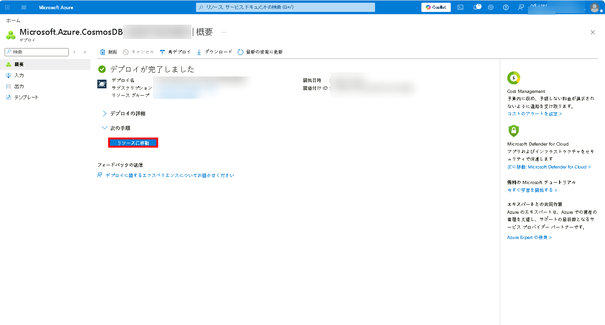

1. **Azure Cosmos DB アカウント** で左メニューの **Settings (1)** を展開し、**Keys (2)** を選択します。

   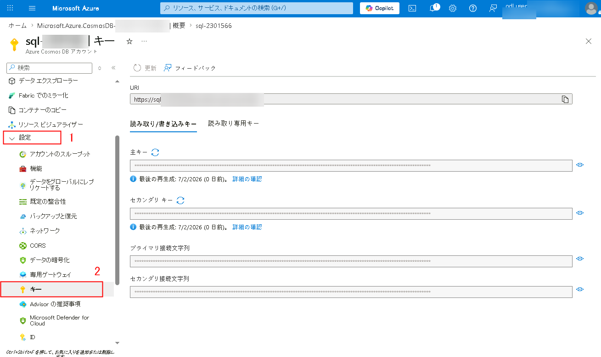

1. このペインには、SDK からアカウントに接続するために必要な接続情報と資格情報が含まれています。具体的には:

   1. **URI (1)** フィールドの値を記録します。後でこの **endpoint** 値を使用します。

   1. **PRIMARY KEY (2)** フィールドの値を記録します。後でこの **key** 値を使用します。

      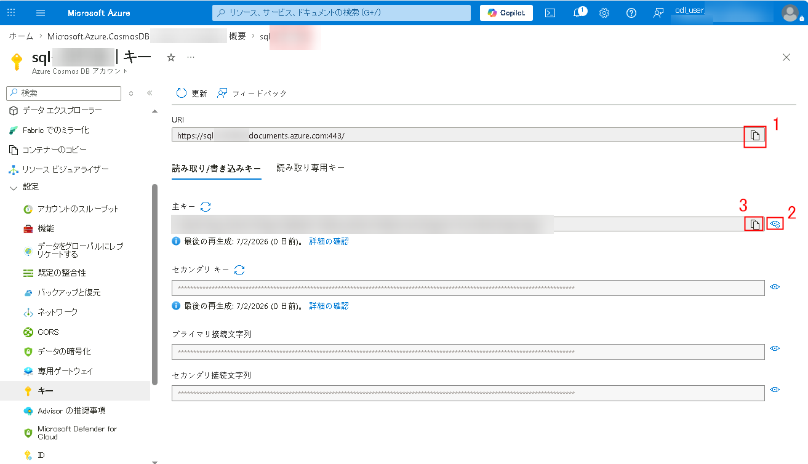
       
   > **おめでとうございます** — ラボを完了しました！ 検証手順は次のとおりです:
   > - 対応するタスクの検証ボタンをクリックします。成功メッセージが表示されれば、ラボの検証に成功しています。
   > - そうでない場合は、エラーメッセージを注意深く読み、ラボ ガイドの指示に従って手順を再実行してください。
   > - サポートが必要な場合は、cloudlabs-support@spektrasystems.com までお問い合わせください。24時間対応でサポートを提供しています。
 
   <validation step="ade422fd-22ef-466a-80b1-bd33186d9b51" />
    
### タスク 3: NuGet 上の Microsoft.Azure.Cosmos ライブラリを確認
このタスクでは、NuGet のウェブサイトを調べて Microsoft.Azure.Cosmos ライブラリの情報を確認します。NuGet の基本機能を学び、該当ライブラリを検索して、.NET プロジェクトにインポートするためのコマンドを確認します。これは後続の手順でライブラリを取得するための準備となります。

NuGet のサイトには、.NET アプリケーションにインポート可能なパッケージの検索インデックスが含まれています。**Microsoft.Azure.Cosmos** のようなプレリリースパッケージをインポートする場合も、NuGet サイトで適切なバージョンとインポートコマンドを確認できます。

1. ブラウザーを開き、**nuget.org (1)** に移動して利用可能な .NET パッケージを表示します。

   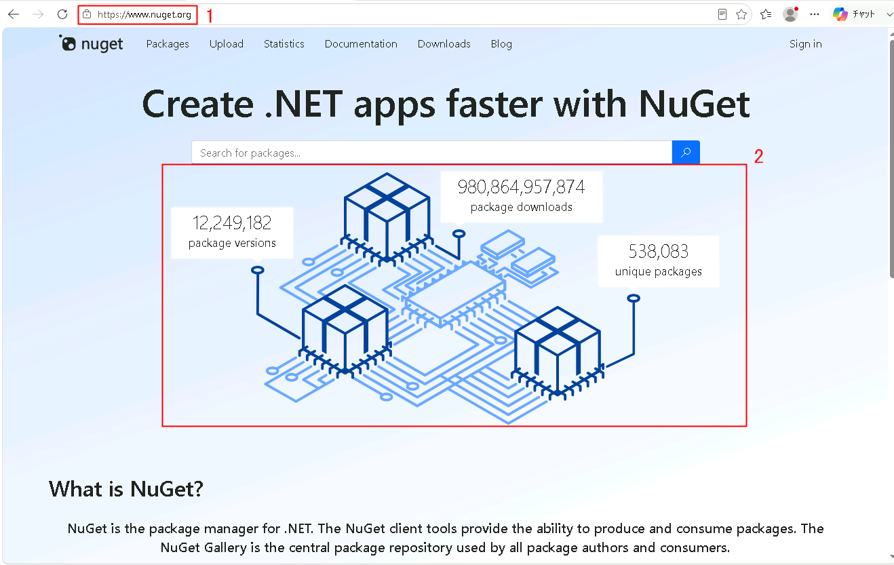

2. **NuGet** ページで **Packages (1)** を選択し、**Microsoft.Azure.Cosmos (2)** を検索して **.NET Standard (3)** を展開し、**netstandard2.0 (4)** を選択します。

   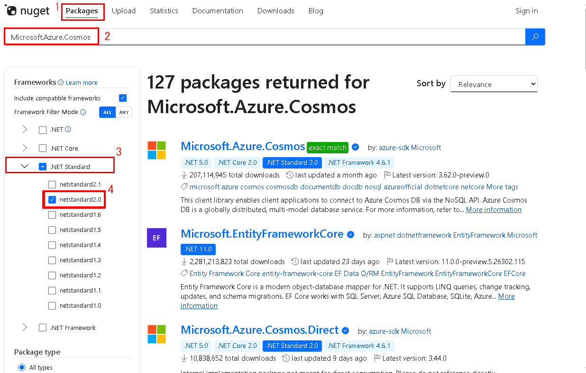

3. **.NET CLI** タブを選択して、このライブラリを .NET プロジェクトにインポートするために必要なコマンドを確認します。
   
     >**注意**: このコマンドを記録する必要はありません。後の手順で特定のバージョンを使用します。
     
4. ブラウザーのウィンドウまたはタブを閉じます。

### タスク 4: Microsoft.Azure.Cosmos ライブラリを .NET プロジェクトに追加
このタスクでは、Visual Studio Code を開いてプロジェクト ディレクトリに移動し、統合ターミナルでコマンドを実行して Microsoft.Azure.Cosmos ライブラリをプロジェクトに追加します。このライブラリを使って Azure Cosmos DB とやり取りできます。

.NET CLI には、事前に構成されたパッケージフィードからパッケージをインポートするための `dotnet add package` コマンドが含まれています。.NET のインストールは NuGet をデフォルトのパッケージフィードとして使用します。
     
1. Visual Studio Code を開きます。

   

1. **Visual Studio Code** で、**04-sdk-connect (1)** フォルダーを右クリックし、**Open in Integrated Terminal (2)** を選択して新しいターミナル インスタンスを開きます。

    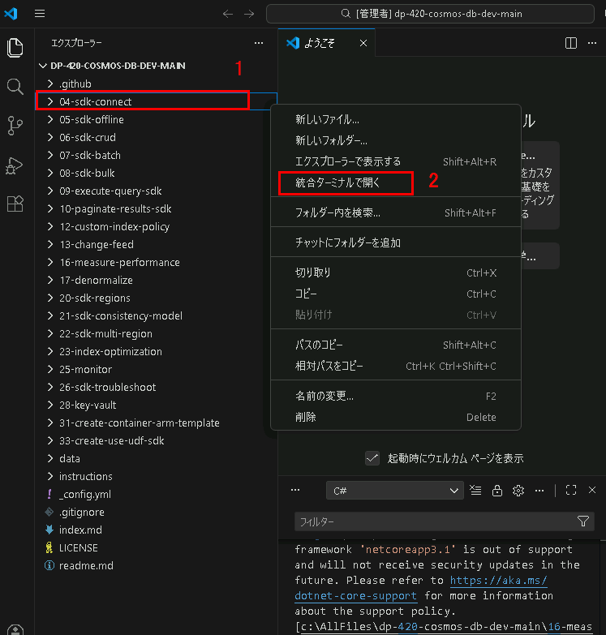

    >**注意**: この操作により、ターミナルの開始ディレクトリが **04-sdk-connect** フォルダーに設定された状態で開きます。

1. 次のコマンドを使って、NuGet から Microsoft.Azure.Cosmos パッケージを追加します。

   ```
   dotnet add package Microsoft.Azure.Cosmos --version 3.*
   ```     
1. 統合ターミナルを閉じます。

### タスク 5: Microsoft.Azure.Cosmos ライブラリを使用する

このタスクでは、`Microsoft.Azure.Cosmos` ライブラリを使用して Azure Cosmos DB アカウントに接続します。Visual Studio Code で `script.cs` ファイルを開き、アカウントのエンドポイントとキーを表す変数を定義して `CosmosClient` インスタンスを作成します。その後、アカウント名とプライマリリージョンを取得してコンソールに表示し、ファイルを保存します。

.NET 用 Azure SDK の Azure Cosmos DB ライブラリをインポートすると、`Microsoft.Azure.Cosmos` 名前空間内のクラスをすぐに使用して Azure Cosmos DB SQL API アカウントに接続できます。`CosmosClient` クラスは、Azure Cosmos DB SQL API アカウントへの初期接続を行うための中核クラスです。

1. **Visual Studio Code** で `04-sdk-connect (1)` フォルダー内の空の `script.cs (2)` コード ファイルを開きます。

    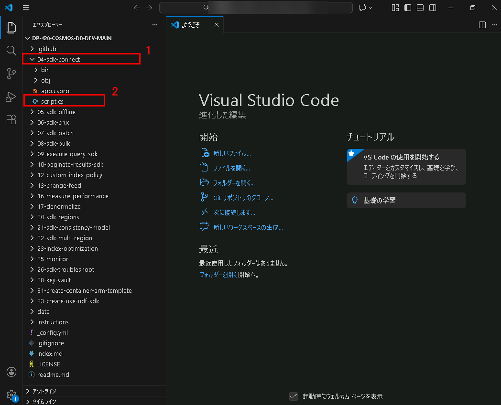

1. 組み込みの `System` と `System.Linq` 名前空間の using ブロックを追加します:
   
   ```
   using System;
   using System.Linq;
   ```
1. `Microsoft.Azure.Cosmos` 名前空間の using ブロックを追加します:
   
   ```
   using Microsoft.Azure.Cosmos;
   ```
1. 以前に作成した Azure Cosmos DB アカウントのエンドポイントを値として持つ `string` 型の変数 `endpoint` を追加します。
   
   ```
   string endpoint = "<cosmos-endpoint>";
   ```
   > **注意**: 例えばエンドポイントが `https://dp420.documents.azure.com:443/` の場合、C# の文は `string endpoint = "https://dp420.documents.azure.com:443/";` となります。

1. 以前に作成した Azure Cosmos DB アカウントのキーを値として持つ `string` 型の変数 `key` を追加します。
   
   ```
   string key = "<cosmos-key>";
   ```
   > **注意**: 例えばキーが `fDR2ci9QgkdkvERTQ==` の場合、C# の文は `string key = "fDR2ci9QgkdkvERTQ==";` となります。

1. `endpoint` と `key` をコンストラクターに渡して、`CosmosClient` 型の新しい変数 `client` を追加します:
   
   ```
   CosmosClient client = new (endpoint, key);
   ```
1. `client` の `ReadAccountAsync` メソッドを呼び出した非同期結果から、`AccountProperties` 型の変数 `account` を取得します:
   
   ```
   AccountProperties account = await client.ReadAccountAsync();
   ```
1. 組み込みの `Console.WriteLine` を使用して、`AccountProperties` クラスの `Id` プロパティを **Account Name** ヘッダー付きで出力します:

   ```
   Console.WriteLine($"Account Name:\t{account.Id}");
   ```
   
1. `AccountProperties` の `WritableRegions` プロパティを参照して最初の要素の `Name` を取得し、**Primary Region** ヘッダー付きで出力します:
    
      ```
      Console.WriteLine($"Primary Region:\t{account.WritableRegions.FirstOrDefault()?.Name}");
      ```     
1. ここまでの内容をまとめると、ファイルは次のようになります:
   
    ```
    using System;
    using System.Linq;
    
    using Microsoft.Azure.Cosmos;

    string endpoint = "<cosmos-endpoint>";
    string key = "<cosmos-key>";

    CosmosClient client = new (endpoint, key);

    AccountProperties account = await client.ReadAccountAsync();

    Console.WriteLine($"Account Name:\t{account.Id}");
    Console.WriteLine($"Primary Region:\t{account.WritableRegions.FirstOrDefault()?.Name}");
    ```
1. `script.cs` コード ファイルを **保存** します。

    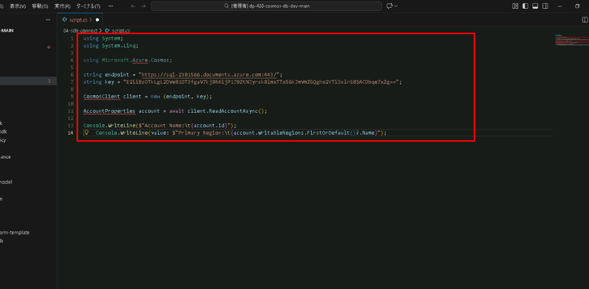

   ### タスク 6: スクリプトのテスト
   このタスクでは、Visual Studio Code の統合ターミナルを開いてプロジェクトを `dotnet run` コマンドで実行し、スクリプトをテストします。出力にはアカウント名と最初の書き込み可能リージョンが表示されます。

   .NET コードによる Azure Cosmos DB SQL API アカウントへの接続処理が完成したので、スクリプトを実行して検証します。スクリプトはアカウント名と最初の書き込み可能リージョン名を出力します。アカウント作成時に指定したリージョン名が表示されるはずです。

   1. **Visual Studio Code** で `04-sdk-connect (1)` フォルダーを右クリックし、**Open in Integrated Terminal (2)** を選択して新しいターミナルを開きます。

        

   2. 次のコマンドで `Newtonsoft.Json` パッケージを追加します。

      ```
      dotnet add package Newtonsoft.Json --version 13.0.3
      ```

   3. プロジェクトをビルドして実行します:

      ```
      dotnet run
      ```
   4. スクリプトはアカウント名と最初の書き込み可能リージョンを出力します。例えば、アカウント名が `sql-<inject key="DeploymentID" enableCopy="false"/>` で、最初の書き込み可能リージョンが `West US 3` の場合、そのように表示されます。

   5. 統合ターミナルを閉じます。

        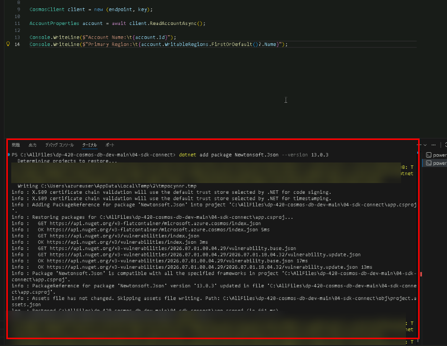

   6. **Visual Studio Code** を閉じます。

   ### 要約

   このラボでは、Azure SDK for .NET を使用して Azure Cosmos DB SQL API アカウントに接続する方法を学びました。手順は Visual Studio Code のセットアップ、Cosmos DB アカウントのプロビジョニング（エンドポイントとキーの取得）、NuGet での Microsoft.Azure.Cosmos ライブラリの確認、ライブラリのプロジェクトへの追加、スクリプト作成（アカウント名とプライマリ書き込みリージョンの取得）、そしてスクリプトの実行による検証です。
 
   ### レビュー

   このラボで完了した項目:

   - 開発環境の準備。
   - Azure Cosmos DB NoSQL API アカウントの作成。
   - NuGet 上で Microsoft.Azure.Cosmos ライブラリを確認。
   - Microsoft.Azure.Cosmos ライブラリを .NET プロジェクトに追加。
   - Microsoft.Azure.Cosmos ライブラリを使用して接続を確認。
   - スクリプトのテスト。
