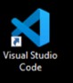
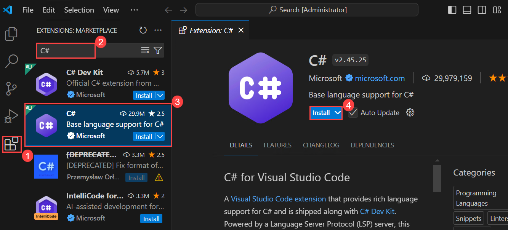
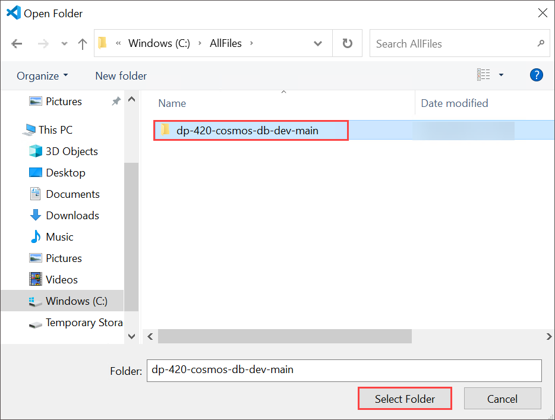
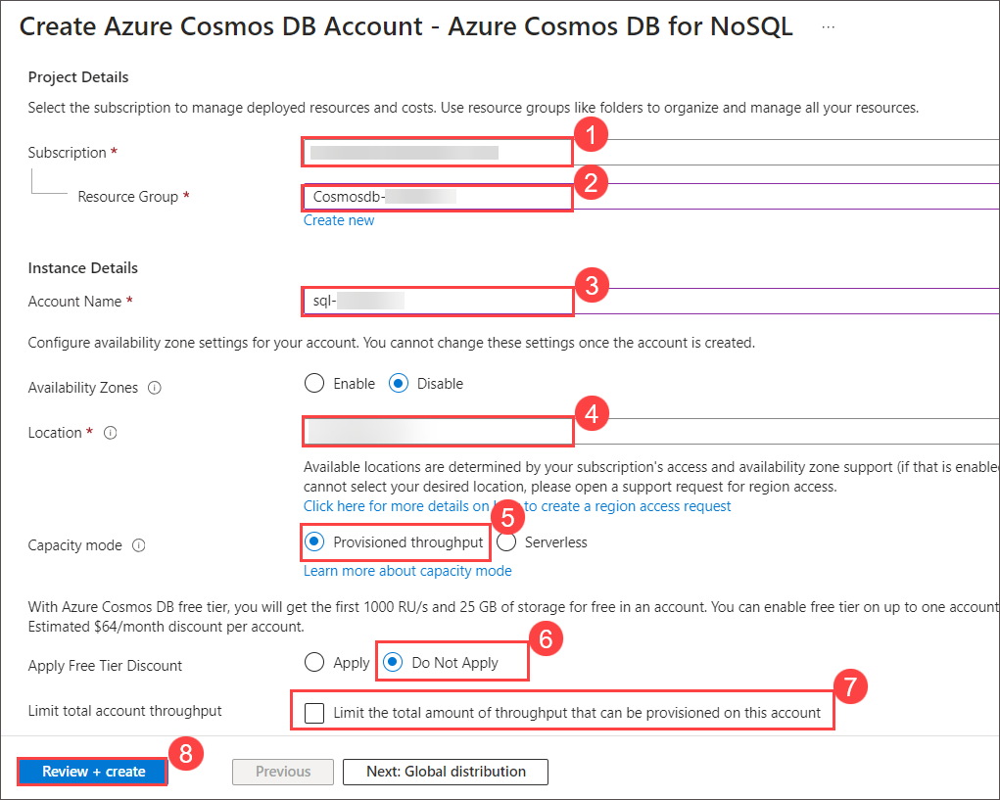
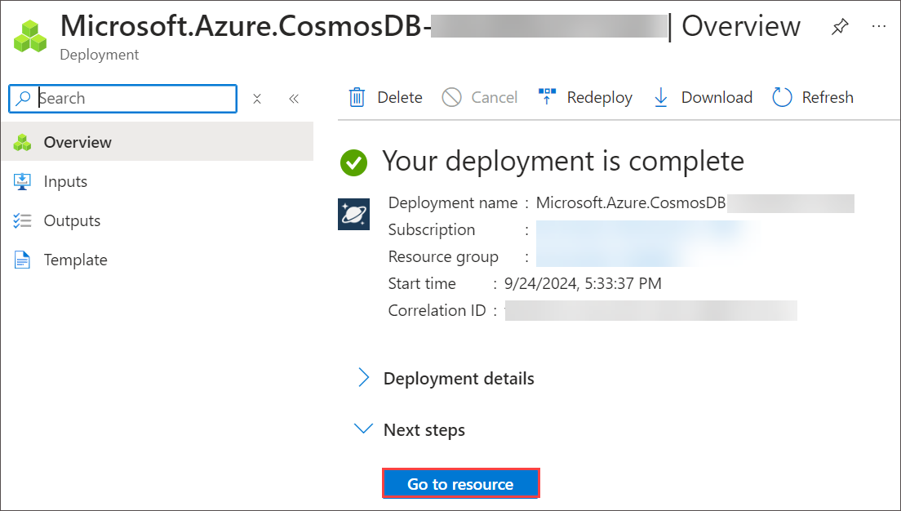
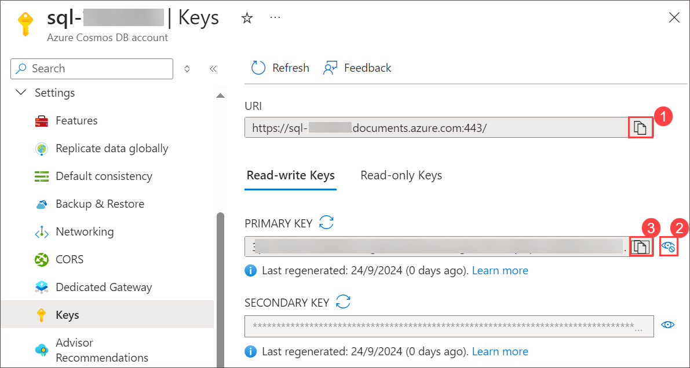

# Connect to Azure Cosmos DB for NoSQL with the SDK

### Estimated Duration: 60 Minutes

## Lab scenario

The Azure SDK for .NET is a suite of libraries that provides a consistent developer interface to interact with many Azure services. The Azure SDK for .NET is built to the .NET Standard 2.0 specification ensuring that it can be used in .NET Framework (4.6.1 or above), .NET Core (2.1 or above), and .NET (5 or above) applications. <br>
In this lab, you'll connect to an Azure Cosmos DB SQL API account using the Azure SDK for .NET.

## Lab objectives

In this lab, you will complete the following tasks:
- Task 1: Prepare your development environment.
- Task 2: Create an Azure Cosmos DB SQL API account.
- Task 3: View the Microsoft.Azure.Cosmos library on NuGet.
- Task 4: Import the Microsoft.Azure.Cosmos library into a .NET project.
- Task 5: Use the Microsoft.Azure.Cosmos library.
- Task 6: Test the script.

### Task 1: Prepare your development environment

In this task, you will prepare your development environment for working with Azure Cosmos DB by setting up Visual Studio Code.

1. Start Visual Studio Code from the desktop.

     

2. Select the **Extensions** blade from the left panel. Search with **C#** and select **Install** to install the extension.

    

3. Select the **file** option on the top left of the screen, from the pane options, select **Open Folder**. navigate to **C:\AllFiles\dp-420-cosmos-db-dev**.

     

4. Navigate to **C:\AllFiles\dp-420-cosmos-db-dev** select **dp-420-cosmos-db-dev** and click on **Select Folder**.

    

5. If when **Do you trust the author of the files in this folder** click on **Yes, I trust the authors**.

### Task 2: Create an Azure Cosmos DB SQL API account

In this task, you will provision an Azure Cosmos DB SQL API account, configuring essential settings and retrieving the necessary connection details for future development.

Azure Cosmos DB is a cloud-based NoSQL database service that supports multiple APIs. When provisioning an Azure Cosmos DB account for the first time, you will select which of the APIs you want the account to support (for example, **Mongo API** or **NoSQL API**). Once the Azure Cosmos DB SQL API account is done provisioning, you can retrieve the endpoint and key and use them to connect to the Azure Cosmos DB NoSQL API account using the Azure SDK for .NET or any other SDK of your choice.

1. Navigate back to  Azure Portal page, in Search resources, services and docs (G+/) box at the top of the portal, enter **Azure Cosmos DB**, and then select **Azure Cosmos DB** under services.

   
   
1. Select **+ Create** under **Azure Cosmos DB for NoSQL** click on **Create** to create **Azure Cosmos DB for NoSQL** account.

    

    

1. Specify the following settings, leaving all remaining settings to their default values, and select **Review + create**:
  
    | **Setting** | **Value** |
    | --- | --- |
    | **Subscription** | *Your existing Azure subscription* |
    | **Resource group** | *Cosmosdb-<inject key="DeploymentID" enableCopy="false"/>* |
    | **Account Name** | *sql-<inject key="DeploymentID" enableCopy="false"/>* |
    | **Location** | *Choose any available region* |
    | **Capacity mode** | *Provisioned throughput* |
    | **Apply Free Tier Discount** | *Do Not Apply* |
    | **Limit the total amount of throughput that can be provisioned on this account** | *Unchecked* |

     

1. Once after validation passed click on **Create**.

1. Wait for the deployment task to complete before continuing with this task.

1. Select **Go to resources**. On the newly created **Azure Cosmos DB** account under **Settings** navigate to the **Keys** pane.

    

    

1. This pane contains the connection details and credentials necessary to connect to the account from the SDK. Specifically:

    1. Record the value of the **URI** field. You will use this **endpoint** value later in this exercise.

    1. Record the value of the **PRIMARY KEY** field. You will use this **key** value later in this exercise.

        
       
    > **Congratulations** on completing the lab! Now, it's time to validate it. Here are the steps:
    > - Hit the Validate button for the corresponding task. If you receive a success message, you have successfully validated the lab. 
    > - If not, carefully read the error message and retry the step, following the instructions in the lab guide.
    > - If you need any assistance, please contact us at cloudlabs-support@spektrasystems.com. We are available 24/7 to help you out. 
 
    <validation step="ade422fd-22ef-466a-80b1-bd33186d9b51" />
    
### Task 3: View the Microsoft.Azure.Cosmos library on NuGet
In this task, you will explore the NuGet website to review the Microsoft.Azure.Cosmos library, which is essential for working with Azure Cosmos DB in .NET applications. You'll learn about the capabilities of NuGet as a package manager, search for the specific library, and observe the command needed to import it into a .NET project. This task sets the stage for later steps in your development process by familiarizing you with accessing and managing library packages.

The NuGet website contains a searchable index of packages that are available to import into your .NET applications. To import prerelease packages such as **Microsoft.Azure.Cosmos**, you can use the NuGet website to get the appropriate versions and commands to import the package into your applications.

1. In a web browser, navigate to the NuGet website (``nuget.org``).

2. Review the description of NuGet, the package manager for .NET, and its capabilities.

3. Search for the **Microsoft.Azure.Cosmos** library on NuGet.org.

4. Click on the link **.Net Standard 2.0**.

5. Select the **.NET CLI** tab to observe the command required to import the latest version of this library into a .NET project.
   
      >**Note**: No need to record this command. You will use a specific version of the library later in this exercise.
     
6. Close your web browser window or tab.

### Task 4: Import the Microsoft.Azure.Cosmos library into a .NET project
In this task, you will open Visual Studio Code and navigate to your project directory. Then, you will access the integrated terminal and execute a command to import the Microsoft.Azure.Cosmos library into your .NET project. This library will allow you to interact with Azure Cosmos DB.

The .NET CLI includes an [add package][docs.microsoft.com/dotnet/core/tools/dotnet-add-package] command to import packages from a pre-configured package feed. A .NET installation uses NuGet as its default package feed.
     
1. Open the **Visual Studio Code**.

2. In **Visual Studio Code**, right-click on the **04-sdk-connect** folder and then select **Open in Integrated Terminal** to open a new terminal instance.

     

     >**Note**: This command will open the terminal with the starting directory already set to the **04-sdk-connect** folder.

3. Add the [Microsoft.Azure.Cosmos][nuget.org/packages/microsoft.azure.cosmos/3.22.1] package from NuGet using the following command:

   ```
   dotnet add package Microsoft.Azure.Cosmos --version 3.*
   ```     
4. Close the integrated terminal.

### Task 5: Use the Microsoft.Azure.Cosmos library

In this task, you will connect to your Azure Cosmos DB account using the Microsoft.Azure.Cosmos library. You'll open the script.cs file in Visual Studio Code, define variables for the account's endpoint and key, and create a CosmosClient instance. Then, you'll retrieve and print the account name and primary region to the console, before saving the file.

Once the Azure Cosmos DB library from the Azure SDK for .NET has been imported, you can immediately use its classes within the [Microsoft.Azure.Cosmos][docs.microsoft.com/dotnet/api/microsoft.azure.cosmos] namespace to connect to an Azure Cosmos DB SQL API account. The [CosmosClient][docs.microsoft.com/dotnet/api/microsoft.azure.cosmos.cosmosclient] class is the core class that is used to make the initial connection to an Azure Cosmos DB SQL API account.

1. In **Visual Studio Code**, in the **Explorer** pane, browse to the **04-sdk-connect** folder.

2. Open the empty **script.cs** code file.

3. Add using blocks for the built-in **System** and **System.Linq** namespaces:
   
   ```
   using System;
   using System.Linq;
   ```
4. Add a using block for the [Microsoft.Azure.Cosmos][docs.microsoft.com/dotnet/api/microsoft.azure.cosmos] namespace:
   
   ```
   using Microsoft.Azure.Cosmos;
   ```
5. Add a **string** variable named **endpoint** with its value set to the **endpoint** of the Azure Cosmos DB account you created earlier.
   
   ```
   string endpoint = "<cosmos-endpoint>";
   ```
   >**Note**: For example, if your endpoint is: **https&shy;://dp420.documents.azure.com:443/**, then the C# statement would be: **string endpoint = 
   "https&shy;://dp420.documents.azure.com:443/";**.

6. Add a **string** variable named **key** with its value set to the **key** of the Azure Cosmos DB account you created earlier.
   
   ```
   string key = "<cosmos-key>";
   ```
   >**Note**: For example, if your key is: **fDR2ci9QgkdkvERTQ==**, then the C# statement would be: **string key = "fDR2ci9QgkdkvERTQ==";**.

7. Add a new variable named **client** of type [CosmosClient][docs.microsoft.com/dotnet/api/microsoft.azure.cosmos.cosmosclient] using the **endpoint** and **key** 
   variables in the constructor:
   
   ```
   CosmosClient client = new (endpoint, key);
   ```
8. Add a new variable named **account** of type [AccountProperties][docs.microsoft.com/dotnet/api/microsoft.azure.cosmos.accountproperties] using the asynchronous result 
   of invoking the [ReadAccountAsync][docs.microsoft.com/dotnet/api/microsoft.azure.cosmos.cosmosclient.readaccountasync] method of the **client** variable:
   
   ```
   AccountProperties account = await client.ReadAccountAsync();
   ```
9. Use the built-in **Console.WriteLine** static method to print the [Id][docs.microsoft.com/dotnet/api/microsoft.azure.cosmos.accountproperties.id] property of the 
   AccountProperties class with a header titled **Account Name**:

   ```
   Console.WriteLine($"Account Name:\t{account.Id}");
   ```
   
10. Use the built-in **Console.WriteLine** static method to query the [WritableRegions] 
    [docs.microsoft.com/dotnet/api/microsoft.azure.cosmos.accountproperties.writableregions] property of the AccountProperties class and then print the [Name] 
    [docs.microsoft.com/dotnet/api/microsoft.azure.cosmos.accountregion.name] property of the first result with a header titled **Primary Region**:
    
      ```
      Console.WriteLine($"Primary Region:\t{account.WritableRegions.FirstOrDefault()?.Name}");
      ```     
11. Once you are done, your code file should now include:
   
    ```
    using System;
    using System.Linq;
    
    using Microsoft.Azure.Cosmos;

    string endpoint = "<cosmos-endpoint>";
    string key = "<cosmos-key>";

    CosmosClient client = new (endpoint, key);

    AccountProperties account = await client.ReadAccountAsync();

    Console.WriteLine($"Account Name:\t{account.Id}");
    Console.WriteLine($"Primary Region:\t{account.WritableRegions.FirstOrDefault()?.Name}");
    ```
12. **Save** the **script.cs** code file.

### Task 6: Test the script
In this task, you'll test your script by opening the integrated terminal in Visual Studio Code and running the project with the dotnet run command. The output will display the account name and the first writable region.

Now that the .NET code to connect to the Azure Cosmos DB SQL API account is complete, you can test the script. This script will print the name of the account, and the name of the first writable region. When you created the account, you specified a location and you should expect to see that same location value printed as the result of this script.

1. In **Visual Studio Code**, right-click on the **04-sdk-connect** folder and then select **Open in Integrated Terminal** to open a new terminal instance.

2. Install Newtonsoft.JSON package using the below command.

   ```
   dotnet add package Newtonsoft.Json --version 13.0.3
   ```

2. Build and run the project using the [dotnet run][docs.microsoft.com/dotnet/core/tools/dotnet-run] command:

   ```
   dotnet run
   ```
3. The script will now output the name of the account, and the first writable region. For example, if you named the account **sql-<inject key="DeploymentID" enableCopy="false"/>**, and the first writable region was **West US 3**.

4. Close the integrated terminal.

5. Close **Visual Studio Code**.

### Summary 

In this lab you have learned how to connect to an Azure Cosmos DB SQL API account using the Azure SDK for .NET. It begined with setting up Visual Studio Code, then provisioning a Cosmos DB account to obtain the endpoint and key. Participants explore the Microsoft.Azure.Cosmos library on NuGet and learn to import it into their .NET project. They write a script to connect to the Cosmos DB, retrieve the account name and primary writable region, and test the script to ensure it works.

### Review

In this lab, you have completed:

- Prepared your development environment.
- Created an Azure Cosmos DB NoSQL API account.
- Viewed the Microsoft.Azure.Cosmos library on NuGet.
- Imported the Microsoft.Azure.Cosmos library into a .NET project.
- Used the Microsoft.Azure.Cosmos library.
- Tested the script.
