# オフライン開発のための Azure Cosmos DB NoSQL API SDK の構成

### 推定所要時間: 60 分

## ラボ シナリオ

Azure Cosmos DB Emulator は、開発とテストのために Azure Cosmos DB サービスをローカルでシミュレートするツールです。NoSQL API をサポートしており、クラウド サービスを使用せずにアプリケーションの構築とテストを行えます。

このラボでは、Azure SDK for .NET を使用して Azure Cosmos DB Emulator に接続します。

## ラボの目的

このラボで完了するタスク:

- タスク 1: Azure Cosmos DB Emulator の起動。
- タスク 2: SDK からエミュレーターへ接続。
- タスク 3: エミュレーター内の変更を確認。
- タスク 4: 新しいコンテナーを作成して表示。

### タスク 1: Azure Cosmos DB Emulator の起動
このタスクでは、Azure Cosmos DB 環境をローカルでシミュレートする Azure Cosmos DB Emulator を起動します。エミュレーターから接続文字列を取得し、エミュレーターが実行中であることと Data Explorer の初期状態を確認します。

環境にエミュレーターが事前インストールされていることを想定しています。インストールされていない場合は、[インストール手順][docs.microsoft.com/azure/cosmos-db/local-emulator] を参照して Azure Cosmos DB Emulator をインストールしてください。エミュレーターが起動したら、接続文字列を取得して Azure SDK for .NET や任意の SDK からエミュレーターに接続できます。

1. スタートメニューから **Azure Cosmos DB Emulator** を検索して起動します。
   
    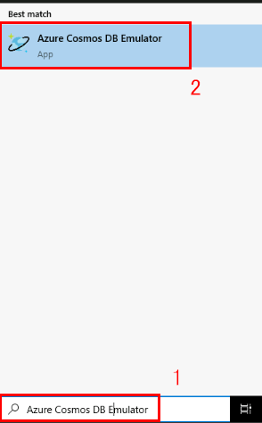

1. **3〜4分待ちます**。エミュレーターが起動すると既定のブラウザーが自動的に開き、**localhost:8081/_explorer/index.html** のランディングページに移動します。

1. **Azure Cosmos DB Emulator** のランディングページで **Quickstart** ペインに移動します。

1. このペインには、SDK からアカウントに接続するための接続情報と資格情報が表示されます。具体的には:

    1. **Primary Connection String** フィールドの値を記録します。後でこの **connection string** を使用します。

        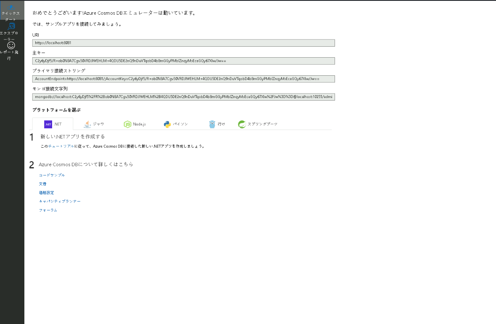

1. **Explorer** ペインに移動します。**Data Explorer** で **NoSQL API** ナビゲーション ツリーにノードが存在しないことを確認します。

   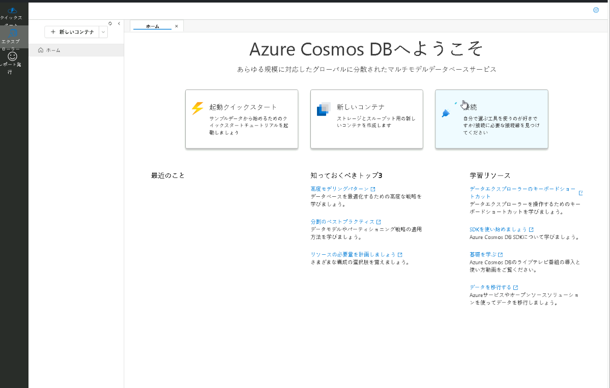

1. ブラウザーのウィンドウまたはタブを閉じます。

### タスク 2: SDK からエミュレーターへ接続
このタスクでは、`Microsoft.Azure.Cosmos` SDK を使用して Azure Cosmos DB Emulator に接続します。提供されているスクリプトの接続文字列を更新し、エミュレーター内に新しいデータベースを作成するコードを記述して、スクリプトを実行して接続をテストします。

`Microsoft.Azure.Cosmos` ライブラリは、今回使用する .NET スクリプトに事前インストールされています。また、いくつかのボイラープレートコードは既に用意されています。接続文字列の値を更新し、数行のコードを追加するだけで完了します。

1. デスクトップから Visual Studio Code に戻ります。

    

1. 画面左上の **file (1)** オプションを選択し、ペインのオプションから **Open Folder (2)** を選択して **C:\AllFiles\dp-420-cosmos-db-dev** に移動します。

     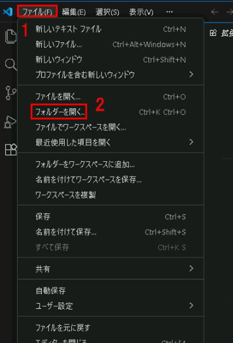

1. **C:\AllFiles\dp-420-cosmos-db-dev** に移動し、**dp-420-cosmos-db-dev** を選択して **Select Folder** をクリックします。

    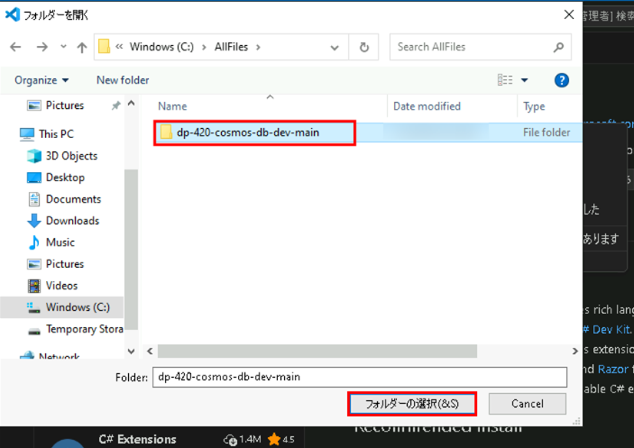

1. **05-sdk-offline** フォルダーを選択し、**Select Folder** をクリックします。

1. **Visual Studio Code** で、**05-sdk-offline (1)** フォルダー内の空の **script.cs (2)** コード ファイルを開きます。

    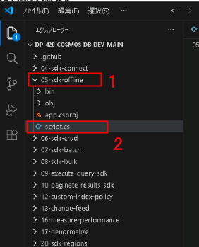

1. 既存の `connectionString` 変数を Azure Cosmos DB Emulator の接続文字列に更新します。
  
    ```
    string connectionString = "AccountEndpoint=https://localhost:8081/;AccountKey=C2y6yDjf5/R+ob0N8A7Cgv30VRDJIWEHLM+4QDU5DE2nQ9nDuVTqobD4b8mGGyPMbIZnqyMsEcaGQy67XIw/Jw==";
    ```

    > **注意**: エミュレーターの URI は通常 SSL を使用し、デフォルトのポート **8081** で `localhost:[port]` になります。

     > **注意**: `C2y6yDjf5/R+ob0N8A7Cgv30VRDJIWEHLM+4QDU5DE2nQ9nDuVTqobD4b8mGGyPMbIZnqyMsEcaGQy67XIw/Jw==` はエミュレーターのすべてのインストールで共通のデフォルトキーです。このキーはコマンドライン オプションで変更できます。

1. `client` 変数の `CreateDatabaseIfNotExistsAsync` メソッドを非同期で呼び出し、エミュレーター内に作成する新しいデータベース名 (**cosmicworks**) を渡して、その結果を `Database` 型の変数に格納します:

    ```
    Database database = await client.CreateDatabaseIfNotExistsAsync("cosmicworks");
    ```

1. 組み込みの `Console.WriteLine` メソッドを使用して、`Database` クラスの `Id` プロパティを **New Database** ヘッダー付きで表示します:

    ```
    Console.WriteLine($"New Database:\tId: {database.Id}");
    ```

1. 完了したら、コード ファイルは次のようになっているはずです:
  
    ```
    using System;
    using Microsoft.Azure.Cosmos;
    
    string connectionString = "AccountEndpoint=https://localhost:8081/;AccountKey=C2y6yDjf5/R+ob0N8A7Cgv30VRDJIWEHLM+4QDU5DE2nQ9nDuVTqobD4b8mGGyPMbIZnqyMsEcaGQy67XIw/Jw==";
    
    CosmosClient client = new (connectionString);
    
    Database database = await client.CreateDatabaseIfNotExistsAsync("cosmicworks");
    Console.WriteLine($"New Database:\tId: {database.Id}");
    ```

1. **script.cs** コード ファイルを **保存** します。

    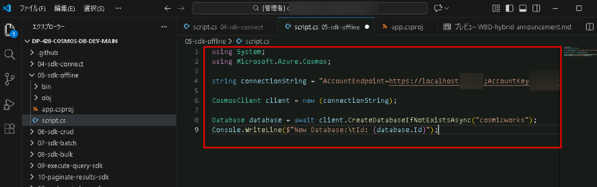

1. **Visual Studio Code** で **05-sdk-offline (1)** フォルダーを右クリックし、**Open in Integrated Terminal (2)** を選択して新しいターミナルを開きます。
    
    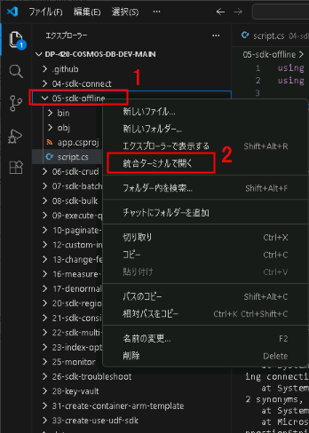
    
    > **注意**: この操作により、開始ディレクトリが **05-sdk-offline** フォルダーに設定された状態でターミナルが開きます。

1. 次のコマンドを使用して、NuGet から `Microsoft.Azure.Cosmos` パッケージを追加します:

    ```
    dotnet add package Microsoft.Azure.Cosmos --version 3.22.1
    ```

1. `dotnet run` コマンドを使用してプロジェクトをビルドおよび実行します:

    ```
    dotnet run
    ```

    > **注意:** アプリケーションの実行中に VS Code がクラッシュした場合は、すべてのアプリを閉じてから再度実行してください。

    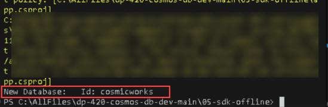

1. 統合ターミナルを閉じます。

    > **おめでとうございます** — ラボを完了しました！ 検証手順は次のとおりです:
    > - 対応するタスクの検証ボタンをクリックします。成功メッセージが表示されれば、ラボの検証に成功しています。
    > - そうでない場合は、エラーメッセージを注意深く読み、ラボ ガイドの指示に従って手順を再実行してください。
    > - サポートが必要な場合は、cloudlabs-support@spektrasystems.com までお問い合わせください。24時間体制でサポートを提供しています。

    <validation step="1e23a88b-ed78-4557-8384-97cc0833dcbb" />

### タスク 3: エミュレーターの変更を確認する

このタスクでは、Azure Cosmos DB Emulator の Data Explorer を使用して、作成した新しい NoSQL データベースを表示します。ブラウザー経由でエミュレーターにアクセスすると、SQL API ナビゲーション ツリーに新しい "cosmicworks" データベースが表示されることを確認できます。

Azure Cosmos DB Emulator 内に新しいデータベースを作成したので、オンラインの **Data Explorer** を使用してエミュレーター内の新しい NoSQL API データベースを確認します。

1. Windows のシステム トレイにあるエミュレーター アイコンに移動し、コンテキスト メニューを開いて **Open Data Explorer...** を選択します。既定のブラウザーで **localhost:8081/_explorer/** ランディング ページが開きます。

1. **Azure Cosmos DB Emulator** のランディング ページで **Explorer** ペインに移動します。

1. **Data Explorer** で **SQL API** ナビゲーション ツリー内の新しい **cosmicworks** データベース ノードを確認します。

    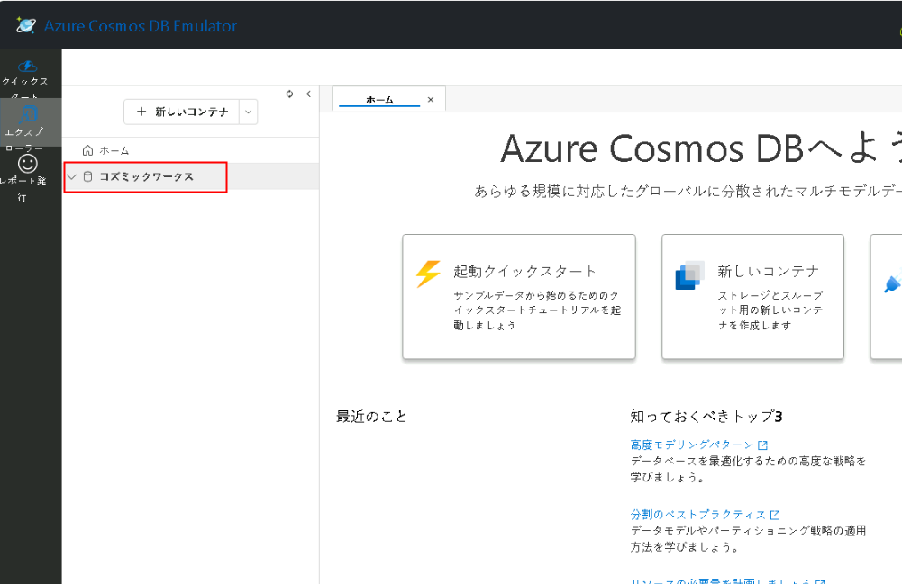

1. ブラウザーのウィンドウまたはタブを閉じます。

### タスク 4: 新しいコンテナーの作成と表示

このタスクでは、前のスクリプトを拡張して、"cosmicworks" データベース内に "products" という新しいコンテナーを作成します。スクリプトを実行した後、Azure Cosmos DB Emulator の Data Explorer でコンテナーの作成を確認します。このプロセスはデータベースの作成と似ており、クラウド環境でもエミュレーター環境でも接続文字列を変更するだけで同じコードを再利用できます。

新しいコンテナーの作成は、データベースの作成と同じパターンです。ここで学ぶコードは、クラウド内にリソースを作成する場合でもエミュレーター内に作成する場合でも有効であり、接続文字列を切り替えるだけで使い分けられます。スクリプト ファイルをさらに拡張して、データベースとともに新しいコンテナーを作成します。

1. **Visual Studio Code** で、**05-sdk-offline (1)** フォルダー内の空の **script.cs (2)** コード ファイルを開きます。

    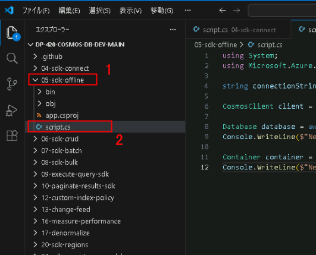

1. **database** 変数の `CreateContainerIfNotExistsAsync` メソッドを非同期で呼び出し、新しいコンテナー名 (**products**)、パーティション キー パス (**/categoryId**)、およびスループット (**400**) を渡して、結果を [Container] 型の変数に格納します:

    ```
    Container container = await database.CreateContainerIfNotExistsAsync("products", "/categoryId", 400);
    ```

1. 組み込みの **Console.WriteLine** メソッドを使用して、`Container` クラスの `Id` プロパティを **New Container** 見出し付きで表示します:

    ```
    Console.WriteLine($"New Container:\tId: {container.Id}");
    ```

1. 完了したら、コード ファイルは次のようになっているはずです:
  
    ```
    using System;
    using Microsoft.Azure.Cosmos;;
    
    string connectionString = "AccountEndpoint=https://localhost:8081/;AccountKey=C2y6yDjf5/R+ob0N8A7Cgv30VRDJIWEHLM+4QDU5DE2nQ9nDuVTqobD4b8mGGyPMbIZnqyMsEcaGQy67XIw/Jw==";
    
    CosmosClient client = new (connectionString);
    
    Database database = await client.CreateDatabaseIfNotExistsAsync("cosmicworks");
    Console.WriteLine($"New Database:\tId: {database.Id}");
    
    Container container = await database.CreateContainerIfNotExistsAsync("products", "/categoryId", 400);
    Console.WriteLine($"New Container:\tId: {container.Id}");
    ```

1. **script.cs** コード ファイルを **保存** します。

     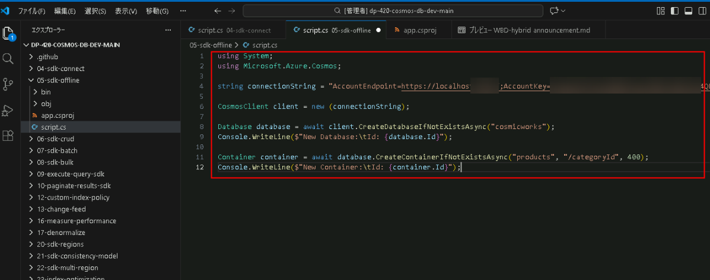

1. **Visual Studio Code** で **05-sdk-offline** フォルダーを右クリックし、**Open in Integrated Terminal** を選択して新しいターミナルを開きます。
    
    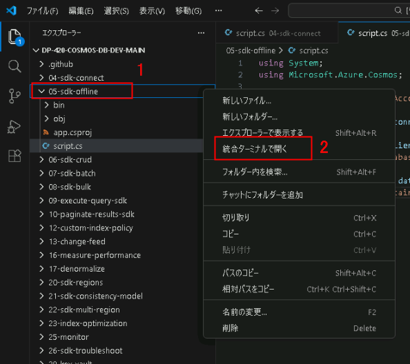

1. 次の [dotnet run][docs.microsoft.com/dotnet/core/tools/dotnet-run] コマンドを使用してプロジェクトをビルドおよび実行します:

    ```
    dotnet run
    ```

    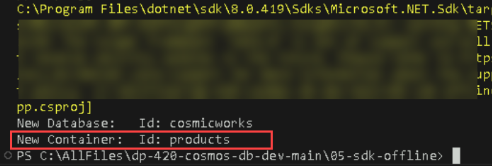

1. 統合ターミナルを閉じます。

1. **Visual Studio Code** を閉じます。

1. Windows のシステム トレイにあるエミュレーター アイコンに移動し、コンテキスト メニューを開いて **Open Data Explorer...** を選択します。既定のブラウザーで **localhost:8081/_explorer/index.html** のランディング ページが開きます。

1. **Azure Cosmos DB Emulator** のランディング ページで **Explorer** ペインに移動します。

1. **Data Explorer** で **cosmicworks** データベース ノードを展開し、**NoSQL API** ナビゲーション ツリー内に新しい **products** コンテナー ノードが表示されていることを確認します。

    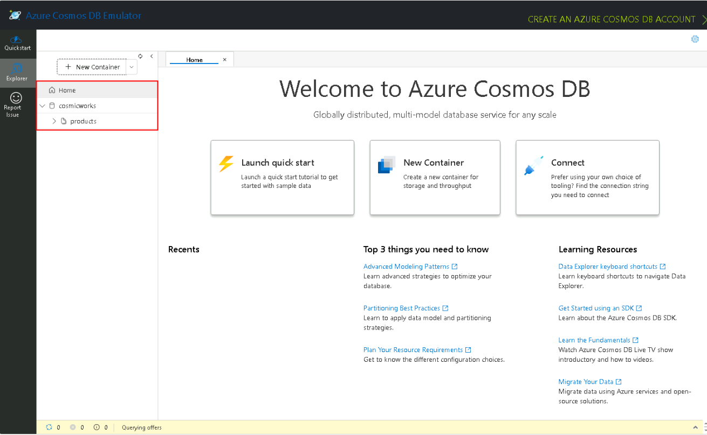
   
1. ブラウザーのウィンドウまたはタブを閉じます。3

    > **おめでとうございます** — ラボを完了しました！ 検証手順は次のとおりです:
    > - 対応するタスクの検証ボタンをクリックします。成功メッセージが表示されれば、ラボの検証に成功しています。
    > - そうでない場合は、エラーメッセージを注意深く読み、ラボ ガイドの指示に従って手順を再実行してください。
    > - サポートが必要な場合は、cloudlabs-support@spektrasystems.com までお問い合わせください。24時間体制でサポートを提供しています。

    <validation step="d95b17d3-9a2e-4a03-adde-9ad042168bea" />

### Summary

このラボでは、NoSQL API を使用したオフライン開発向けに Azure Cosmos DB Emulator を構成しました。主なタスクは、エミュレーターの起動、Azure SDK for .NET を使用した接続、新しいデータベース "cosmicworks" の作成、そして "products" というコンテナーの追加です。最後に、エミュレーター内の Data Explorer を使って変更内容を確認し、Cosmos DB 開発環境の操作を実践的に学習しました。

### Review

このラボでは次の項目を完了しました:

- Task 1: Azure Cosmos DB Emulator を起動しました。
- Task 2: SDK からエミュレーターに接続しました。
- Task 3: エミュレーターの変更を確認しました。
- Task 4: 新しいコンテナーを作成して表示しました。

### You have successfully completed the lab
