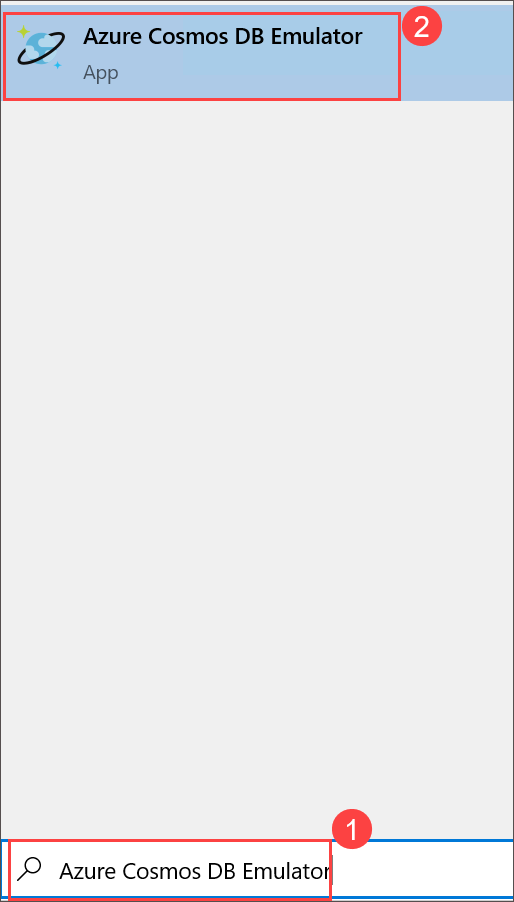
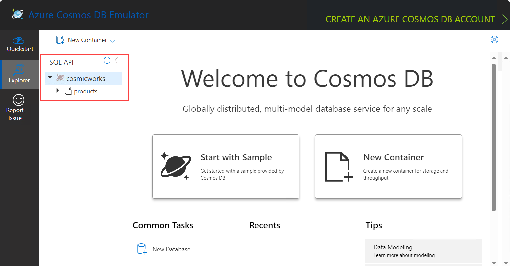

# Configure the Azure Cosmos DB NoSQL API SDK for offline development

## Lab scenario

The Azure Cosmos DB Emulator is a local tool that emulates the Azure Cosmos DB service for development and testing. The emulator supports the NoSQL API and can be used in place of the cloud service when developing code using the Azure SDK for .NET.
In this lab, you'll connect to the Azure Cosmos DB Emulator from the Azure SDK for .NET.

## Lab objectives

In this lab, you will complete the following tasks:

- Task 1: Start the Azure Cosmos DB Emulator.
- Task 2: Connect to the emulator from the SDK.
- Task 3: View the changes in the emulator.
- Task 4: Create and view a new container.

## Estimated Timing: 30 minutes

## Architecture Diagram


### Task 1: Start the Azure Cosmos DB Emulator
In this task, you will launch the Azure Cosmos DB Emulator, a local tool that simulates the Azure Cosmos DB environment. You'll retrieve the connection string from the emulator. The task involves verifying that the emulator is running and checking the initial state of the Data Explorer.

Your environment should already have the emulator pre-installed. If not, refer to the [installation instructions][docs.microsoft.com/azure/cosmos-db/local-emulator] to install the Azure Cosmos DB Emulator. Once the emulator has started, you can retrieve the connection string and use it to connect to the emulator using the Azure SDK for .NET or any other SDK of your choice.

1. Search and Start the **Azure Cosmos DB Emulator** from Start Menu of window.
     

1. Wait for 3 to 4 minutes to get started the emulator to automatically open your default browser and navigate to the **localhost:8081/_explorer/index.html** landing page.

1. In the **Azure Cosmos DB Emulator** landing page, navigate to the **Quickstart** pane.

1. This pane contains the connection details and credentials necessary to connect to the account from the SDK. Specifically:

    1. Record the value of the **Primary Connection String** field. You will use this **connection string** value later in this exercise.

         

1. Navigate to the **Explorer** pane. In the **Data Explorer**, observe that there are no nodes within the **SQL API** navigation tree.

   

1. Close your web browser window or tab.

###  Task 2: Connect to the emulator from the SDK
In this task, you'll connect to the Azure Cosmos DB Emulator using the Microsoft.Azure.Cosmos SDK. You'll update the connection string in the provided script and write code to create a new database within the emulator, then test the connection by running the script.

The **Microsoft.Azure.Cosmos** library has already been pre-installed in the .NET script you will use in this exercise. Further, some of the boilerplate code has already been written to save you time. You will need to update the boilerplate connection string value and write a couple of lines of code to complete the script.

1. In **Visual Studio Code**, Select the file option on the top left of the screen, from the pane options, select **Open Folder** and navigate to **C:\AllFiles\dp-420-cosmos-db-dev**

1. Select the folder **05-sdk-offline** and click on Select Folder.

1. Open the **script.cs** code file within the **05-sdk-offline** folder.

1. Update the existing variable named **connectionString** with its value set to the **connection string** of the Azure Cosmos DB Emulator.
  
    ```
    string connectionString = "AccountEndpoint=https://localhost:8081/;AccountKey=C2y6yDjf5/R+ob0N8A7Cgv30VRDJIWEHLM+4QDU5DE2nQ9nDuVTqobD4b8mGGyPMbIZnqyMsEcaGQy67XIw/Jw==";
    ```

    >**Note**: The URI for the emulator is typically ***localhost:[port]*** using SSL with the default port set to **8081**.

     >**Note**: *C2y6yDjf5/R+ob0N8A7Cgv30VRDJIWEHLM+4QDU5DE2nQ9nDuVTqobD4b8mGGyPMbIZnqyMsEcaGQy67XIw/Jw==* is the default key for all installations of the emulator. This key can be changed using command line options.

1. Asynchronously invoke the [CreateDatabaseIfNotExistsAsync][docs.microsoft.com/dotnet/api/microsoft.azure.cosmos.cosmosclient.createdatabaseifnotexistsasync] method of the **client** variable passing in the name of the new database (**cosmicworks**) you would like to create within the emulator and storing the result in a variable of type [Database][docs.microsoft.com/dotnet/api/microsoft.azure.cosmos.database]:

    ```
    Database database = await client.CreateDatabaseIfNotExistsAsync("cosmicworks");
    ```

1. Use the built-in **Console.WriteLine** static method to print the [Id][docs.microsoft.com/dotnet/api/microsoft.azure.cosmos.database.id] property of the Database class with a header titled **New Database**:

    ```
    Console.WriteLine($"New Database:\tId: {database.Id}");
    ```

1. Once you are done, your code file should now include:
  
    ```
    using System;
    using Microsoft.Azure.Cosmos;
    
    string connectionString = "AccountEndpoint=https://localhost:8081/;AccountKey=C2y6yDjf5/R+ob0N8A7Cgv30VRDJIWEHLM+4QDU5DE2nQ9nDuVTqobD4b8mGGyPMbIZnqyMsEcaGQy67XIw/Jw==";
    
    CosmosClient client = new (connectionString);
    
    Database database = await client.CreateDatabaseIfNotExistsAsync("cosmicworks");
    Console.WriteLine($"New Database:\tId: {database.Id}");
    ```

1. **Save** the **script.cs** code file.

1. In **Visual Studio Code**, right-click on **05-sdk-offline** folder and then select **Open in Integrated Terminal** to open a new terminal instance.
    
    
    
    >**Note**: This command will open the terminal with the starting directory already set to the **05-sdk-offline** folder.

1. Add the [Microsoft.Azure.Cosmos][nuget.org/packages/microsoft.azure.cosmos/3.22.1] package from NuGet using the following command:

    ```
    dotnet add package Microsoft.Azure.Cosmos --version 3.22.1
    ```

1. Build and run the project using the [dotnet run][docs.microsoft.com/dotnet/core/tools/dotnet-run] command:

    ```
    dotnet run
    ```

1. Close the integrated terminal.

    > **Congratulations** on completing the lab! Now, it's time to validate it. Here are the steps:
    > - Hit the Validate button for the corresponding task. If you receive a success message, you have successfully validated the lab. 
    > - If not, carefully read the error message and retry the step, following the instructions in the lab guide.
    > - If you need any assistance, please contact us at cloudlabs-support@spektrasystems.com. We are available 24/7 to help you out. 

    <validation step="1e23a88b-ed78-4557-8384-97cc0833dcbb" />

###  Task 3: View the changes in the emulator

In this task, you'll use the Data Explorer in the Azure Cosmos DB Emulator to view the new NoSQL database you created. By accessing the emulator through your browser, you can observe the new "cosmicworks" database in the SQL API navigation tree.

Now that you have created a new database in the Azure Cosmos DB emulator, you will use the online **Data Explorer** to observe the new NoSQL API database within the emulator.

1. Navigate to the emulator icon in the Windows system tray, open the context menu, and then select **Open Data Explorer...** to navigate to the **localhost:8081/_explorer/** landing page using your default browser.

1. In the **Azure Cosmos DB Emulator** landing page, navigate to the **Explorer** pane.

1. In the **Data Explorer**, observe the new **cosmicworks** database node within the **SQL API** navigation tree.

1. Close your web browser window or tab.

###  Task 4: Create and view a new container

In this task, you will expand the previous script to create a new container called "products" in the "cosmicworks" database. After running the script, you'll verify the creation by viewing the container in the Azure Cosmos DB Emulator's Data Explorer. This process is similar to creating a database, and the code can be reused for both cloud and emulator environments by changing the connection string.

Creating a new container is similar to the pattern used to create a new database. The code you learn here will be relevant whether or not you create resources in the cloud or in the emulator, you simply need to change the connection string. You will expand the script file further to create a new container along with the database.

1. In **Visual Studio Code**, in the **Explorer** pane, browse to the **05-sdk-offline** folder.

1. Open the **script.cs** code file within the **05-sdk-offline** folder again.

1. Asynchronously invoke the [CreateContainerIfNotExistsAsync][docs.microsoft.com/dotnet/api/microsoft.azure.cosmos.database.createcontainerifnotexistsasync] method of the **database** variable passing in the name of the new container (**products**), the partition key path (**/categoryId**), and the throughput (**400**) you would like to create within the **cosmicworks** database and storing the result in a variable of type [Container][docs.microsoft.com/dotnet/api/microsoft.azure.cosmos.container]:

    ```
    Container container = await database.CreateContainerIfNotExistsAsync("products", "/categoryId", 400);
    ```

1. Use the built-in **Console.WriteLine** static method to print the [Id][docs.microsoft.com/dotnet/api/microsoft.azure.cosmos.container.id] property of the Container class with a header titled **New Container**:

    ```
    Console.WriteLine($"New Container:\tId: {container.Id}");
    ```

1. Once you are done, your code file should now include:
  
    ```
    using System;
    using Microsoft.Azure.Cosmos;;
    
    string connectionString = "AccountEndpoint=https://localhost:8081/;AccountKey=C2y6yDjf5/R+ob0N8A7Cgv30VRDJIWEHLM+4QDU5DE2nQ9nDuVTqobD4b8mGGyPMbIZnqyMsEcaGQy67XIw/Jw==";
    
    CosmosClient client = new (connectionString);
    
    Database database = await client.CreateDatabaseIfNotExistsAsync("cosmicworks");
    Console.WriteLine($"New Database:\tId: {database.Id}");
    
    Container container = await database.CreateContainerIfNotExistsAsync("products", "/categoryId", 400);
    Console.WriteLine($"New Container:\tId: {container.Id}");
    ```

1. **Save** the **script.cs** code file.

1. In **Visual Studio Code**, open the context menu for the **05-sdk-offline** folder and then select **Open in Integrated Terminal** to open a new terminal instance.

1. Build and run the project using the [dotnet run][docs.microsoft.com/dotnet/core/tools/dotnet-run] command:

    ```
    dotnet run
    ```

1. Close the integrated terminal.

1. Close **Visual Studio Code**.

1. Navigate to the emulator icon in the Windows system tray, open the context menu, and then select **Open Data Explorer...** to navigate to the **localhost:8081/_explorer/index.html** landing page using your default browser.

1. In the **Azure Cosmos DB Emulator** landing page, navigate to the **Explorer** pane.

1. In the **Data Explorer**, expand the **cosmicworks** database node, then observe the new **products** container node within the **SQL API** navigation tree.

    
   
1. Close your web browser window or tab.

    > **Congratulations** on completing the lab! Now, it's time to validate it. Here are the steps:
    > - Hit the Validate button for the corresponding task. If you receive a success message, you have successfully validated the lab. 
    > - If not, carefully read the error message and retry the step, following the instructions in the lab guide.
    > - If you need any assistance, please contact us at cloudlabs-support@spektrasystems.com. We are available 24/7 to help you out.

    <validation step="d95b17d3-9a2e-4a03-adde-9ad042168bea" />

### Summary

In this lab, you have configured the Azure Cosmos DB Emulator for offline development with the NoSQL API. Key tasks include starting the emulator, connecting to it via the Azure SDK for .NET, creating a new database named "cosmicworks," and adding a container called "products." Finally, users will verify their changes using the Data Explorer within the emulator, providing hands-on experience with the Cosmos DB development environment.

### Review

In this lab, you have completed:

- Task 1: Started the Azure Cosmos DB Emulator.
- Task 2: Connected to the emulator from the SDK.
- Task 3: Viewed the changes in the emulator.
- Task 4: Created and viewed a new container.

### You have successfully completed the lab
