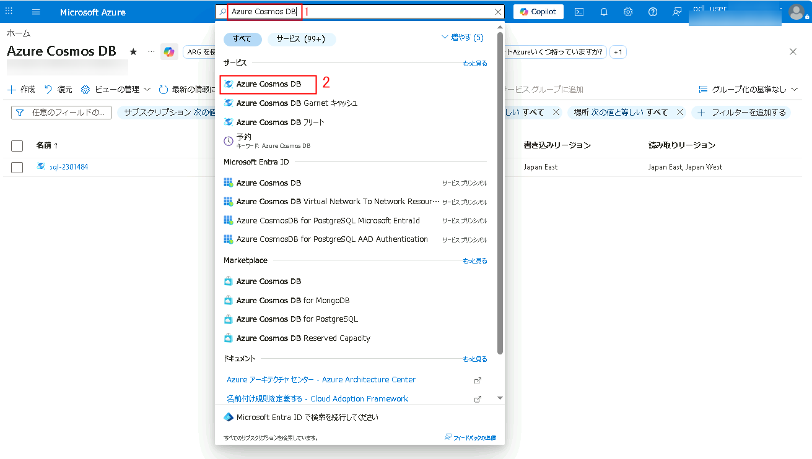
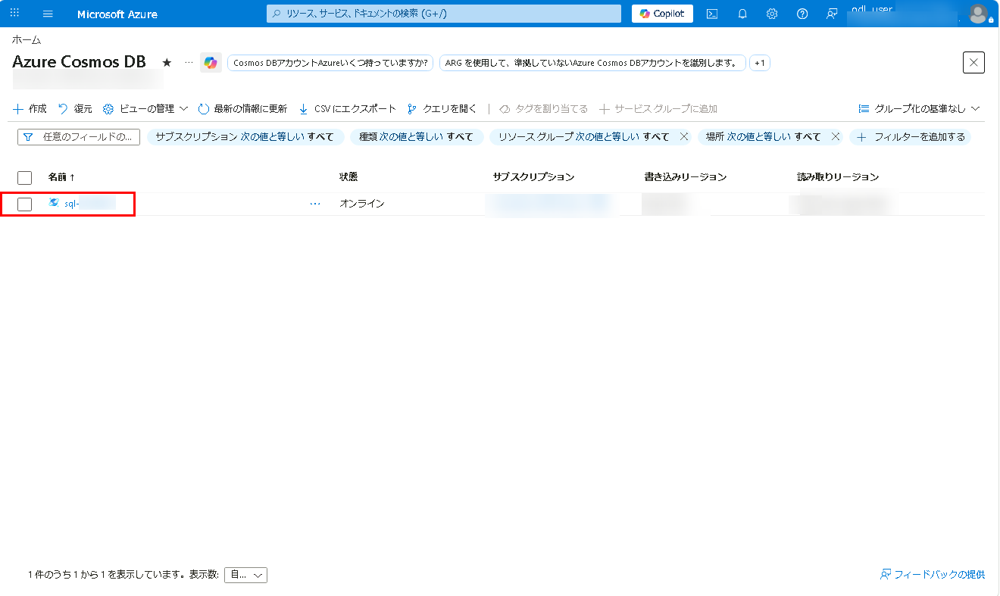
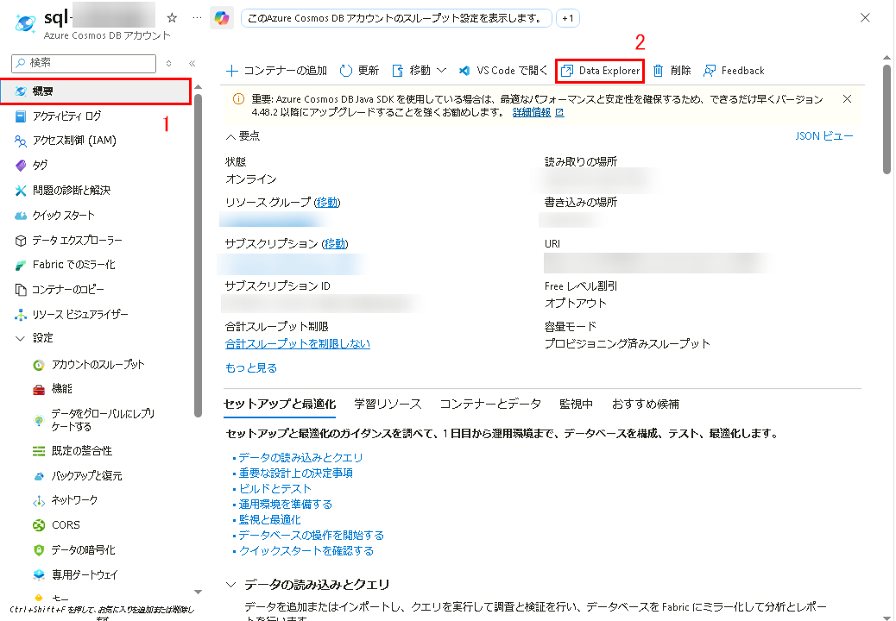

# Azure Cosmos DB for NoSQL SDK を使ってドキュメントを作成および更新する

## ラボ シナリオ

[Microsoft.Azure.Cosmos.Container][docs.microsoft.com/dotnet/api/microsoft.azure.cosmos.container] クラスには、Azure Cosmos DB for NoSQL コンテナー内のアイテムを作成、取得、更新、削除するためのメンバー メソッドが含まれています。これらのメソッドは、API for NoSQL コンテナー内のさまざまなアイテムに対する一般的な CRUD 操作を実行します。

このラボでは、SDK を使用して Azure Cosmos DB for NoSQL コンテナー内の項目に対する日常的な CRUD 操作を実行します。

## ラボの目的

このラボでは、以下のタスクを完了します:
- タスク 1: Azure Cosmos DB for NoSQL アカウントを作成する。
- タスク 2: SDK から Azure Cosmos DB for NoSQL アカウントに接続する。
- タスク 3: SDK を使ってアイテムの作成と読み取りポイント操作を実行する。
- タスク 4: SDK を使ってアイテムの更新と削除ポイント操作を実行する。

## 推定所要時間: 60 分

## アーキテクチャ図


## 開発環境を準備する

1. デスクトップから Visual Studio Code を開いてください。

     

1. 左側のパネルで **Extensions (1)** を選択してください。**C# (2)** を検索し、**Install (3)** を選択して拡張機能をインストールしてください。

    


1. 画面左上の **file (1)** を選択し、メニューから **Open Folder (2)** を選択してください。**C:\AllFiles\dp-420-cosmos-db-dev** に移動してください。

     

1. **C:\AllFiles\dp-420-cosmos-db-dev** に移動し、**dp-420-cosmos-db-dev** を選択して **Select Folder** をクリックしてください。

    

1. **Do you trust the author of the files in this folder** と表示された場合は、**Yes, I trust the authors** をクリックしてください。

   

### タスク 1: Azure Cosmos DB for NoSQL アカウントの作成

このタスクでは、API for NoSQL を使用して Azure Cosmos DB アカウントを作成します。アカウントのプロビジョニング後、エンドポイント (URI) とプライマリキーなどの接続情報を取得します。これらの資格情報を使用して、Azure SDK またはその他の SDK から Cosmos DB アカウントに接続できます。

Azure Cosmos DB は、複数の API をサポートするクラウドベースの NoSQL データベース サービスです。Azure Cosmos DB アカウントを初めてプロビジョニングする際には、サポートする API を選択します（たとえば、**API for MongoDB** や **API for NoSQL**）。Azure Cosmos DB for NoSQL アカウントのプロビジョニングが完了したら、エンドポイントとキーを取得し、Azure SDK for .NET や任意の SDK を使って接続できます。

1. Azure Portal ページに戻り、ポータル上部の Search resources, services and docs (G+/) ボックスに **Azure Cosmos DB (1)** と入力し、services の下にある **Azure Cosmos DB (2)** を選択してください。

   
   
1. **Azure Cosmos DB for NoSQL** の下で **+ Create (1)** を選択し、**Create (2)** をクリックして **Azure Cosmos DB for NoSQL** アカウントを作成してください。

    

    

1. 次の設定を指定し、他の設定は既定値のままにして **Next: Global Distribution (9)** を選択してください。

    | Setting | Value |
    |----------|----------|
    | **Workload Type** | *Production* **(1)** |
    | **Subscription** | *Your existing Azure subscription* **(2)** |
    | **Resource group** | *Select an existing Cosmosdb-<inject key="DeploymentID" enableCopy="false"/>* **(3)** |
    | **Account Name** | *sql-<inject key="DeploymentID" enableCopy="false"/>* **(4)** |
    | **Availability Zones** | *Disabled* **(5)** |
    | **Location** | *Select any available location* **(6)** |
    | **Capacity mode** | *Provisioned throughput* **(7)** |
    | **Limit the total amount of throughput that can be provisioned on this account** | *Leave unchecked* **(8)** |

     

1. Global Distribution ページで **Next: Networking** をクリックしてください。**Connectivity method** で **All networks (1)** を選択し、**Review + Create (2)** をクリックしてください。

     

1. **Create** をクリックしてください。

    

1. このタスクを続行する前に、デプロイが完了するまで待機してください。

1. デプロイ完了後、**Go to resources** を選択してください。

    

1. **Azure Cosmos DB account** で、左側メニューの **Settings (1)** を展開し、**Keys (2)** を選択してください。

    

1. このペインには、SDK からアカウントに接続するために必要な接続情報と資格情報が含まれています。具体的には次のとおりです。

    1. **URI** フィールドの値を記録してください。この演習の後半でこの **endpoint** 値を使用します。

    1. **PRIMARY KEY** フィールドの値を記録してください。この演習の後半でこの **key** 値を使用します。

        
       
1. **Visual Studio Code** に戻ってください。

    > ラボ完了おめでとうございます。次は検証です。手順は次のとおりです。
    > - 対応するタスクの Validate ボタンを押してください。成功メッセージが表示された場合、ラボは正常に検証されています。
    > - 表示されない場合は、エラーメッセージをよく確認し、ラボ ガイドの手順に従って再試行してください。
    > - サポートが必要な場合は cloudlabs-support@spektrasystems.com までご連絡ください。24 時間 365 日対応しています。
    
<validation step="185fcc24-d57e-4db3-a26d-1b9d4b61dbf2" />

### タスク 2: SDK から Azure Cosmos DB for NoSQL アカウントに接続する

このタスクでは、Azure SDK for .NET を使用して Azure Cosmos DB for NoSQL アカウントに接続します。Visual Studio Code を使い、Cosmos DB アカウント内に新しいデータベースとコンテナーを作成するスクリプトを実行します。データベースとコンテナーが作成されたら、Azure ポータルの Data Explorer を使って存在を確認します。

1. **Visual Studio Code** の **Explorer** ペインで、**06-sdk-crud** フォルダーに移動してください。

1. **06-sdk-crud (1)** フォルダーのコンテキスト メニューを開き、**Open in Integrated Terminal (2)** を選択して新しいターミナルを開いてください。

     
        
    >**Note**: このコマンドでは、開始ディレクトリがすでに **06-sdk-crud** フォルダーに設定された状態でターミナルが開きます。

1. 次のコマンドを使用して、NuGet から [Microsoft.Azure.Cosmos][nuget.org/packages/microsoft.azure.cosmos/3.22.1] パッケージを追加してください。

    ```
    dotnet add package Microsoft.Azure.Cosmos --version 3.22.1
    ```

1. [dotnet build][docs.microsoft.com/dotnet/core/tools/dotnet-build] コマンドを使用してプロジェクトをビルドしてください。

    ```
    dotnet build
    ```

1. 統合ターミナルを閉じてください。

1. **Visual Studio Code** の **06-sdk-crud (1)** フォルダーで、空の **script.cs (2)** コード ファイルを開いてください。

    

    >**Note**: **[Microsoft.Azure.Cosmos][nuget.org/packages/microsoft.azure.cosmos/3.22.1]** ライブラリは NuGet からすでに事前にインポートされています。

1. **endpoint** という名前の **string** 変数を見つけてください。前のラボで作成した Azure Cosmos DB アカウントの **endpoint** 値を設定してください。

    ```
    string endpoint = "<cosmos-endpoint>";
    ```
      
     

    >**Note**: たとえば endpoint が **https&shy;://dp420.documents.azure.com:443/** の場合、C# ステートメントは **string endpoint = "https&shy;://dp420.documents.azure.com:443/";** になります。

1. **key** という名前の **string** 変数を見つけてください。前のラボで作成した Azure Cosmos DB アカウントの **key** 値を設定してください。

    ```
    string key = "<cosmos-key>";
    ```
    
    

    >**Note**: たとえば key が **fDR2ci9QgkdkvERTQ==** の場合、C# ステートメントは **string key = "fDR2ci9QgkdkvERTQ==";** になります。

1. 次のコマンドを追加し、**client** 変数の CreateDatabaseIfNotExistsAsync メソッドを非同期で呼び出して、作成する新しいデータベース名（**cosmicworks**）を渡し、結果を **Database** 型の変数に格納してください。

    ```
    Database database = await client.CreateDatabaseIfNotExistsAsync("cosmicworks");
    ```

1. 次のコマンドを追加し、**database** 変数の **CreateContainerIfNotExistsAsync** メソッドを非同期で呼び出して、新しいコンテナー名（**products**）、パーティション キー パス（**/categoryId**）、スループット（**400**）を渡し、**cosmicworks** データベース内に作成して、結果を **Container** 型の変数に格納してください。
  
    ```
    Container container = await database.CreateContainerIfNotExistsAsync("products", "/categoryId", 400);    
    ```

1. 完了後、コード ファイルに次の内容が含まれていることを確認してください。
  
    ```
    using System;
    using Microsoft.Azure.Cosmos;

    string endpoint = "<cosmos-endpoint>";
    string key = "<cosmos-key>";

    CosmosClient client = new CosmosClient(endpoint, key);
    
    Database database = await client.CreateDatabaseIfNotExistsAsync("cosmicworks");
    
    Container container = await database.CreateContainerIfNotExistsAsync("products", "/categoryId", 400);
    ```

1. **script.cs** コード ファイルを **Save** してください。

    

1. **Visual Studio Code** で **06-sdk-crud (1)** フォルダーのコンテキスト メニューを開き、**Open in Integrated Terminal (2)** を選択して新しいターミナルを開いてください。

    
     
1. [dotnet run][docs.microsoft.com/dotnet/core/tools/dotnet-run] コマンドを使用してプロジェクトをビルドおよび実行してください。

    ```
    dotnet run
    ```
   

1. 統合ターミナルを閉じてください。

1. Azure Portal ページに戻り、ポータル上部の Search resources, services and docs (G+/) ボックスに **Azure Cosmos DB (1)** と入力し、services の下にある **Azure Cosmos DB (2)** を選択してください。

   

1. **sql-<inject key="DeploymentID" enableCopy="false"/>** を選択してください。

     

1. **Azure Cosmos DB** アカウント リソースの **overview page (1)** で、**Data Explorer (2)** ペインに移動してください。

    

1. **Data Explorer** で、**cosmicworks (2)** データベース ノードを展開し、**products (3)** コンテナー ノードを展開してください。

    
   
    > ラボ完了おめでとうございます。次は検証です。手順は次のとおりです。
    > - 対応するタスクの Validate ボタンを押してください。成功メッセージが表示された場合、ラボは正常に検証されています。
    > - 表示されない場合は、エラーメッセージをよく確認し、ラボ ガイドの手順に従って再試行してください。
    > - サポートが必要な場合は cloudlabs-support@spektrasystems.com までご連絡ください。24 時間 365 日対応しています。

<validation step="efd4c72c-608a-423e-97eb-a3700baca703" />

### タスク 3: SDK を使用して項目に対する作成および読み取りのポイント操作を実行する

このタスクでは、`Microsoft.Azure.Cosmos.Container` クラスの一連の非同期メソッドを使用して、API for NoSQL コンテナー内のアイテムに対する一般的な操作を実行します。これらの操作はすべて、C# のタスク非同期プログラミング モデルを使用して実行されます。

1. **Visual Studio Code** に戻り、**06-sdk-crud** フォルダー内の **product.cs** コード ファイルを開いてください。

    >**Note**: **script.cs** ファイルのエディターは閉じないでください。

1. このコード ファイル内の **Product** クラスを確認してください。このクラスは、このコンテナーに保存および操作される製品項目を表します。

1. **script.cs** コード ファイルのエディター タブに戻ってください。

1. 次のコマンドを実行して、**saddle** という名前の **Product** 型の新しいオブジェクトを作成してください。

    | Property | Value |
    | --- | --- |
    | **id** | *706cd7c6-db8b-41f9-aea2-0e0c7e8eb009* |
    | **categoryId** | *9603ca6c-9e28-4a02-9194-51cdb7fea816* |
    | **name** | *Road Saddle* |
    | **price** | *45.99d* |
    | **tags** | *{ tan, new, crisp }* |

    ```
    Product saddle = new()
    {
        id = "706cd7c6-db8b-41f9-aea2-0e0c7e8eb009",
        categoryId = "9603ca6c-9e28-4a02-9194-51cdb7fea816",
        name = "Road Saddle",
        price = 45.99d,
        tags = new string[]
        {
            "tan",
            "new",
            "crisp"
        }
    };
    ```

1. 次のコマンドを追加し、**container** 変数のジェネリック [CreateItemAsync<>][docs.microsoft.com/dotnet/api/microsoft.azure.cosmos.container.createitemasync] メソッドを非同期で呼び出して、メソッド パラメーターとして **saddle** 変数を渡し、ジェネリック型として **Product** を指定してください。

    ```
    await container.CreateItemAsync<Product>(saddle);
    ```

1. 完了後、コード ファイルに次の内容が含まれていることを確認してください。
  
    ```
    using System;
    using Microsoft.Azure.Cosmos;

    string endpoint = "<cosmos-endpoint>";
    string key = "<cosmos-key>";

    CosmosClient client = new CosmosClient(endpoint, key);
    
    Database database = await client.CreateDatabaseIfNotExistsAsync("cosmicworks");
    
    Container container = await database.CreateContainerIfNotExistsAsync("products", "/categoryId", 400);

    Product saddle = new()
    {
        id = "706cd7c6-db8b-41f9-aea2-0e0c7e8eb009",
        categoryId = "9603ca6c-9e28-4a02-9194-51cdb7fea816",
        name = "Road Saddle",
        price = 45.99d,
        tags = new string[]
        {
            "tan",
            "new",
            "crisp"
        }
    };

    await container.CreateItemAsync<Product>(saddle);
    ```

1. **script.cs** コード ファイルを **Save** してください。

1. **Visual Studio Code** で **06-sdk-crud** フォルダーのコンテキスト メニューを開き、**Open in Integrated Terminal** を選択して新しいターミナルを開いてください。

1. **[dotnet run][docs.microsoft.com/dotnet/core/tools/dotnet-run]** コマンドを使用してプロジェクトをビルドおよび実行してください。

    ```
    dotnet run
    ```

1. 統合ターミナルを閉じてください。

1. **script.cs** コード ファイルのエディター タブに戻ってください。

1. 次のコード行を削除してください。

    ```
    Product saddle = new()
    {
        id = "706cd7c6-db8b-41f9-aea2-0e0c7e8eb009",
        categoryId = "9603ca6c-9e28-4a02-9194-51cdb7fea816",
        name = "Road Saddle",
        price = 45.99d,
        tags = new string[]
        {
            "tan",
            "new",
            "crisp"
        }
    };

    await container.CreateItemAsync<Product>(saddle);
    ```

1. 次のコマンドを追加し、値 **706cd7c6-db8b-41f9-aea2-0e0c7e8eb009** を持つ **id** という名前の string 変数を作成してください。

    ```
    string id = "706cd7c6-db8b-41f9-aea2-0e0c7e8eb009";
    ```

1. 次のコマンドを追加し、値 **9603ca6c-9e28-4a02-9194-51cdb7fea816** を持つ **categoryId** という名前の string 変数を作成してください。

    ```
    string categoryId = "9603ca6c-9e28-4a02-9194-51cdb7fea816";
    ```

1. 次のコマンドを追加し、**categoryId** 変数をコンストラクター パラメーターとして渡して、**partitionKey** という名前の [PartitionKey][docs.microsoft.com/dotnet/api/microsoft.azure.cosmos.partitionkey] 型の変数を作成してください。

    ```
    PartitionKey partitionKey = new (categoryId);
    ```

1. 次のコマンドを追加し、**container** 変数のジェネリック [ReadItemAsync<>][docs.microsoft.com/dotnet/api/microsoft.azure.cosmos.container.readitemasync] メソッドを非同期で呼び出して、メソッド パラメーターとして **id** と **partitionkey** 変数を渡し、ジェネリック型として **Product** を指定し、結果を **Product** 型の **saddle** という名前の変数に格納してください。

    ```
    Product saddle = await container.ReadItemAsync<Product>(id, partitionKey);
    ```

1. 次のコマンドを追加し、静的 **Console.WriteLine** メソッドを呼び出して、整形済み出力文字列で saddle オブジェクトを出力してください。

    ```
    Console.WriteLine($"[{saddle.id}]\t{saddle.name} ({saddle.price:C})");
    ```

1. 完了後、コード ファイルに次の内容が含まれていることを確認してください。
  
    ```
    using System;
    using Microsoft.Azure.Cosmos;

    string endpoint = "<cosmos-endpoint>";
    string key = "<cosmos-key>";

    CosmosClient client = new CosmosClient(endpoint, key);
    
    Database database = await client.CreateDatabaseIfNotExistsAsync("cosmicworks");
    
    Container container = await database.CreateContainerIfNotExistsAsync("products", "/categoryId", 400);

    string id = "706cd7c6-db8b-41f9-aea2-0e0c7e8eb009";

    string categoryId = "9603ca6c-9e28-4a02-9194-51cdb7fea816";
    PartitionKey partitionKey = new (categoryId);

    Product saddle = await container.ReadItemAsync<Product>(id, partitionKey);

    Console.WriteLine($"[{saddle.id}]\t{saddle.name} ({saddle.price:C})");
    ```

1. **script.cs** コード ファイルを **Save** してください。

1. **Visual Studio Code** で **06-sdk-crud (1)** フォルダーのコンテキスト メニューを開き、**Open in Integrated Terminal (2)** を選択して新しいターミナルを開いてください。

    

1. **[dotnet run][docs.microsoft.com/dotnet/core/tools/dotnet-run]** コマンドを使用してプロジェクトをビルドおよび実行してください。

    ```
    dotnet run
    ```

1. ターミナルの出力を確認してください。特に、項目の ID、名前、価格が整形された出力テキストを確認してください。

    
   
1. 統合ターミナルを閉じてください。

### タスク 4: SDK を使用して更新および削除のポイント操作を実行する

このタスクでは、UpsertItemAsync メソッドを使用して製品の価格と名前を更新し、Azure portal で変更を確認します。更新の確認後、DeleteItemAsync メソッドで項目を削除し、Data Explorer で項目が削除されたことを確認します。

SDK 学習時には、オンラインの Azure Cosmos DB SDK アカウントまたはエミュレーターを使用して項目を更新し、操作後に変更が適用されたかを確認するために Data Explorer と IDE を行き来することがよくあります。ここでは、SDK を使って項目を更新および削除しながら、その流れを実践します。

1. Azure Portal ページで、ポータル上部の Search resources, services and docs (G+/) ボックスに **Azure Cosmos DB (1)** と入力し、services の下にある **Azure Cosmos DB (2)** を選択してください。

   

1. **sql-<inject key="DeploymentID" enableCopy="false"/>** を選択してください。

     

1. **Azure Cosmos DB** アカウント リソースの **overview page (1)** で、**Data Explorer (2)** ペインに移動してください。

    

1. **Data Explorer** で **cosmicworks (2)** データベース ノードを展開し、**products (3)** コンテナー ノードを展開して、**Items (4)** を選択してください。その後、項目の **name** と **price** プロパティの値を確認してください。

    

    | **Property** | **Value** |
    | :--- | :--- |
    | **Name** | *Road Saddle* |
    | **Price** | *$45.99* |

    

    >**Note**: この時点では、項目を作成してからこれらの値は変更されていないはずです。この演習でこれらの値を変更します。

1. **Visual Studio Code** に戻り、**script.cs** コード ファイルのエディター タブに戻ってください。

1. 次のコード行を削除してください。

    ```
    Console.WriteLine($"[{saddle.id}]\t{saddle.name} ({saddle.price:C})");
    ```

1. 次のコマンドを追加し、**saddle** 変数の price プロパティを **32.55** に変更してください。

    ```
    saddle.price = 32.55d;
    ```

1. 次のコマンドを追加し、**saddle** 変数の **name** プロパティを **Road LL Saddle** に変更してください。

    ```
    saddle.name = "Road LL Saddle";
    ```

1. 次のコマンドを追加し、**container** 変数のジェネリック [UpsertItemAsync<>][docs.microsoft.com/dotnet/api/microsoft.azure.cosmos.container.upsertitemasync] メソッドを非同期で呼び出して、メソッド パラメーターとして **saddle** 変数を渡し、ジェネリック型として **Product** を指定してください。

    ```
    await container.UpsertItemAsync<Product>(saddle);
    ```

1. 完了後、コード ファイルに次の内容が含まれていることを確認してください。
  
    ```
    using System;
    using Microsoft.Azure.Cosmos;

    string endpoint = "<cosmos-endpoint>";
    string key = "<cosmos-key>";

    CosmosClient client = new CosmosClient(endpoint, key);
    
    Database database = await client.CreateDatabaseIfNotExistsAsync("cosmicworks");
    
    Container container = await database.CreateContainerIfNotExistsAsync("products", "/categoryId", 400);

    string id = "706cd7c6-db8b-41f9-aea2-0e0c7e8eb009";

    string categoryId = "9603ca6c-9e28-4a02-9194-51cdb7fea816";
    PartitionKey partitionKey = new (categoryId);

    Product saddle = await container.ReadItemAsync<Product>(id, partitionKey);

    saddle.price = 32.55d;
    saddle.name = "Road LL Saddle";
    
    await container.UpsertItemAsync<Product>(saddle);
    ```

1. **script.cs** コード ファイルを **Save** してください。

1. **Visual Studio Code** で **06-sdk-crud (1)** フォルダーのコンテキスト メニューを開き、**Open in Integrated Terminal (2)** を選択して新しいターミナルを開いてください。

    

1. **[dotnet run][docs.microsoft.com/dotnet/core/tools/dotnet-run]** コマンドを使用してプロジェクトをビルドおよび実行してください。

    ```
    dotnet run
    ```

1. 統合ターミナルを閉じてください。

1. Azure Portal ページに戻り、ポータル上部の Search resources, services and docs (G+/) ボックスに **Azure Cosmos DB (1)** と入力し、services の下にある **Azure Cosmos DB (2)** を選択してください。

   

1. **sql-<inject key="DeploymentID" enableCopy="false"/>** を選択してください。

     

1. **Azure Cosmos DB** アカウント リソースの **overview page (1)** で、**Data Explorer (2)** ペインに移動し、項目の **name** と **price** プロパティの値を確認してください。

    

    | **Property** | **Value** |
    | --- | --- |
    | **Name** | *Road LL Saddle* |
    | **Price** | *$32.55* |

    

    >**Note**: この時点では、項目を確認した結果として、これらの値が変更されているはずです。

1. **Visual Studio Code** に戻り、**script.cs** コード ファイルのエディター タブに戻ってください。

1. 次のコード行を削除してください。

    ```
    Product saddle = await container.ReadItemAsync<Product>(id, partitionKey);

    saddle.price = 32.55d;
    saddle.name = "Road LL Saddle";
    
    await container.UpsertItemAsync<Product>(saddle);
    ```

1. 次のコマンドを追加し、**container** 変数のジェネリック [DeleteItemAsync<>][docs.microsoft.com/dotnet/api/microsoft.azure.cosmos.container.deleteitemasync] メソッドを非同期で呼び出して、メソッド パラメーターとして **id** と **partitionkey** 変数を渡し、ジェネリック型として **Product** を指定してください。

    ```
    await container.DeleteItemAsync<Product>(id, partitionKey);
    ```

1. **script.cs** コード ファイルを **Save** してください。

1. **Visual Studio Code** で **06-sdk-crud (1)** フォルダーのコンテキスト メニューを開き、**Open in Integrated Terminal (2)** を選択して新しいターミナルを開いてください。

    

1. **[dotnet run][docs.microsoft.com/dotnet/core/tools/dotnet-run]** コマンドを使用してプロジェクトをビルドおよび実行してください。

    ```
    dotnet run
    ```

1. 統合ターミナルを閉じてください。

1. Azure Portal ページで、ポータル上部の Search resources, services and docs (G+/) ボックスに **Azure Cosmos DB (1)** と入力し、services の下にある **Azure Cosmos DB (2)** を選択してください。

   

1. **sql-<inject key="DeploymentID" enableCopy="false"/>** を選択してください。

     

1. **Azure Cosmos DB** アカウント リソースの **overview page (1)** で、**Data Explorer (2)** ペインに移動してください。

    

1. **Items** ノードを選択してください。項目一覧が空になっていることを確認してください。

     
    
1. Web ブラウザーのウィンドウまたはタブを閉じてください。

1. **Visual Studio Code** を閉じてください。

### まとめ

このラボでは、Azure Cosmos DB for NoSQL SDK を使用して基本的な CRUD 操作を実行する方法を学習しました。まず Azure Cosmos DB for NoSQL アカウントを作成し、次に SDK を使用してアカウントに接続し、データベースとコンテナーを作成しました。続いてコンテナー内のアイテムに対して作成と読み取り操作を実行し、データの管理を実践的に体験しました。最後に、アイテムを更新および削除し、Cosmos DB におけるデータ操作の理解を深めました。ラボの終了時には、プログラムによる CRUD 操作の統合により、NoSQL 環境での効率的なデータ管理が可能になることを理解しました。

### レビュー

このラボでは、次を完了しました。

- Azure Cosmos DB for NoSQL アカウントを作成した。
- SDK から Azure Cosmos DB for NoSQL アカウントに接続した。
- SDK を使用して項目に対する作成および読み取りのポイント操作を実行した。
- SDK を使用して更新および削除のポイント操作を実行した。

### ラボは正常に完了しました
