# Azure Cosmos DB NoSQL API SDK を使ってドキュメントを作成および更新する

## ラボ シナリオ

[Microsoft.Azure.Cosmos.Container][docs.microsoft.com/dotnet/api/microsoft.azure.cosmos.container] クラスには、Azure Cosmos DB の NoSQL コンテナー内のアイテムを作成、取得、更新、削除するためのメンバー メソッドが含まれています。これらのメソッドは、NoSQL API コンテナー内のさまざまなアイテムに対する一般的な CRUD 操作を実行します。

このラボでは、SDK を使って Azure Cosmos DB の NoSQL コンテナー内のアイテムに対して日常的な CRUD 操作を実行します。

## ラボの目的

このラボでは、以下のタスクを完了します:
- タスク 1: Azure Cosmos DB NoSQL API アカウントを作成する。
- タスク 2: SDK から Azure Cosmos DB NoSQL API アカウントに接続する。
- タスク 3: SDK を使ってアイテムの作成と読み取りポイント操作を実行する。
- タスク 4: SDK を使ってアイテムの更新と削除ポイント操作を実行する。

## 推定所要時間: 60 分

## アーキテクチャ図

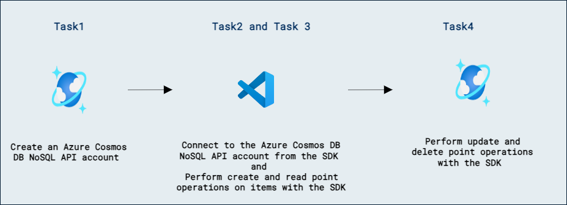

## 開発環境の準備

1. デスクトップから Visual Studio Code を開きます。

     

1. 左側のパネルから **Extensions (1)** を選択します。**C# (2)** を検索し、**Install (3)** を選択して拡張機能をインストールします。

    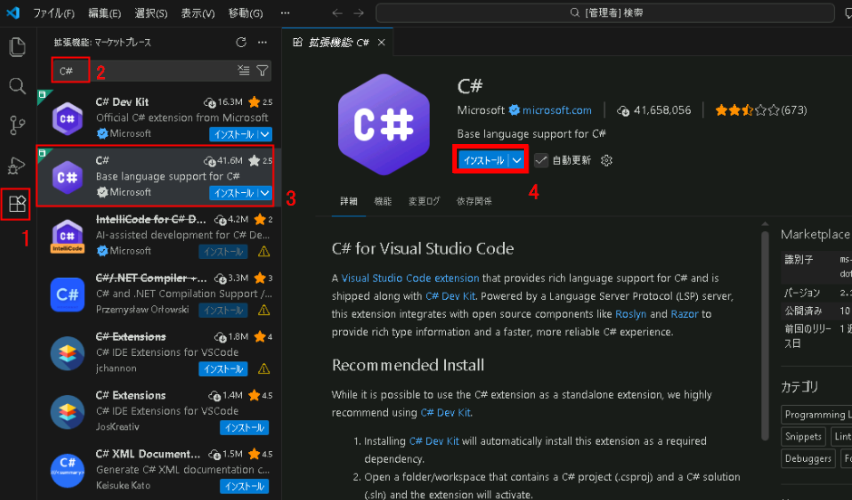


1. 画面左上の **file (1)** オプションを選択し、ペインのオプションから **Open Folder (2)** を選択します。**C:\AllFiles\dp-420-cosmos-db-dev** に移動します。

     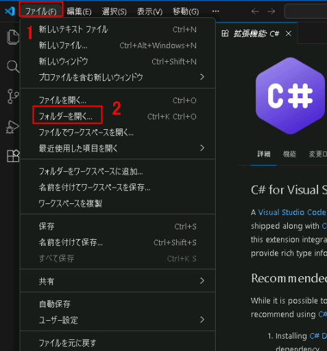

1. **C:\AllFiles\dp-420-cosmos-db-dev** に移動し、**dp-420-cosmos-db-dev** を選択して **Select Folder** をクリックします。

    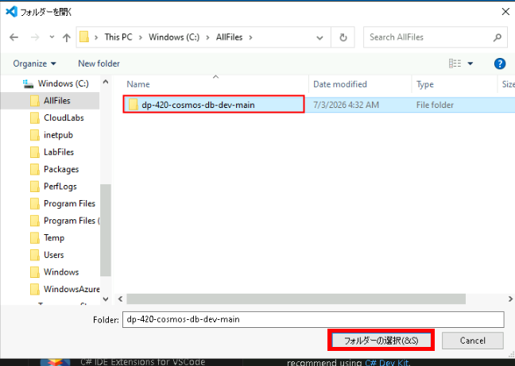

1. **このフォルダー内のファイルの作成者を信頼しますか** と表示された場合は、**Yes, I trust the authors** をクリックします。

   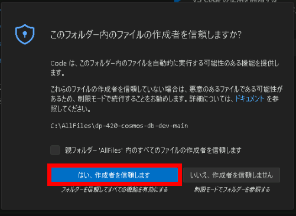

### タスク 1: Azure Cosmos DB NoSQL API アカウントの作成

このタスクでは、NoSQL API を使用して Azure Cosmos DB アカウントを作成します。アカウントのプロビジョニング後、エンドポイント (URI) とプライマリキーなどの接続情報を取得します。これらの資格情報を使用して、Azure SDK またはその他の SDK から Cosmos DB アカウントに接続できます。

Azure Cosmos DB は、複数の API をサポートするクラウドベースの NoSQL データベース サービスです。Azure Cosmos DB アカウントを初めてプロビジョニングする際には、サポートする API を選択します（たとえば、**Mongo API** や **SQL API**）。Azure Cosmos DB SQL API アカウントのプロビジョニングが完了したら、エンドポイントとキーを取得し、Azure SDK for .NET や任意の SDK を使って接続できます。

1. Azure ポータル ページに戻り、ポータル上部の [Search resources, services and docs (G+/)] ボックスに **Azure Cosmos DB (1)** と入力し、サービスとして表示される **Azure Cosmos DB (2)** を選択します。

   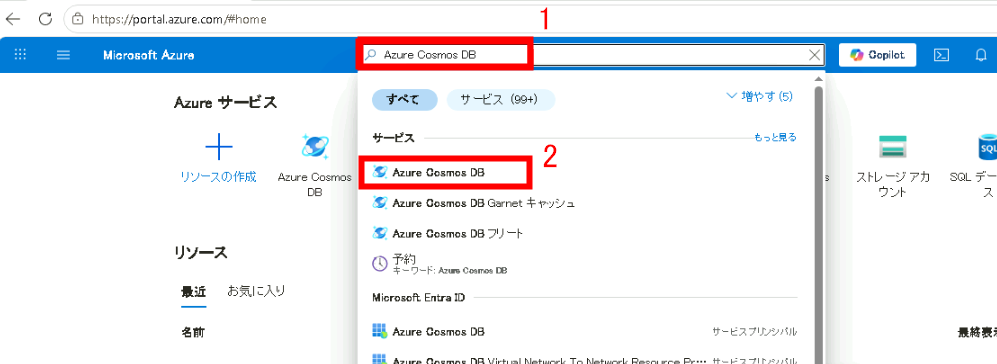
   
1. **Azure Cosmos DB for NoSQL** の下にある **+ Create (1)** を選択し、**Create (2)** をクリックして Azure Cosmos DB for NoSQL アカウントを作成します。

    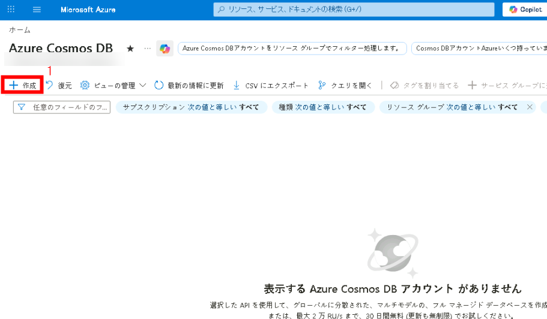

    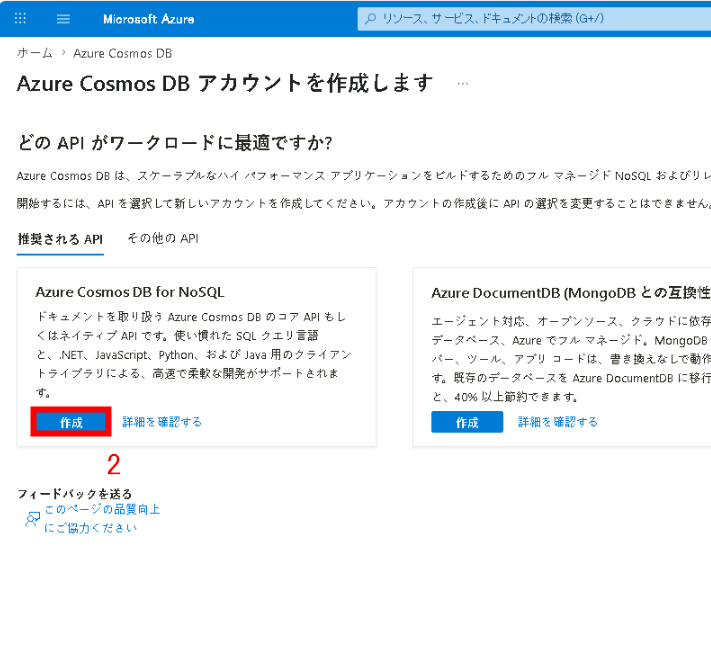

1. 以下の設定を指定し、それ以外の設定はすべて既定値のままにして、**Next: Global Distribution (9)** を選択します:

    | **設定** | **値** |
    | --------------------|--------------------------------------------------- |
    | **Workload Type** | *Production* (1) |
    | **Subscription** | *Your existing Azure subscription* (2) |
    | **Resource group** | *Select an existing Cosmosdb-<inject key="DeploymentID" enableCopy="false"/>* (3) |
    | **Account Name** | *sql-<inject key="DeploymentID" enableCopy="false"/>* (4) |
    | **Location** | *Choose the default region* (5) |
    | **Capacity mode** | *Provisioned throughput* (6) |
    | **Apply Free Tier Discount** | *Do Not Apply* (7) |
    | **Limit the total amount of throughput that can be provisioned on this account** | *Unchecked* (8) |

     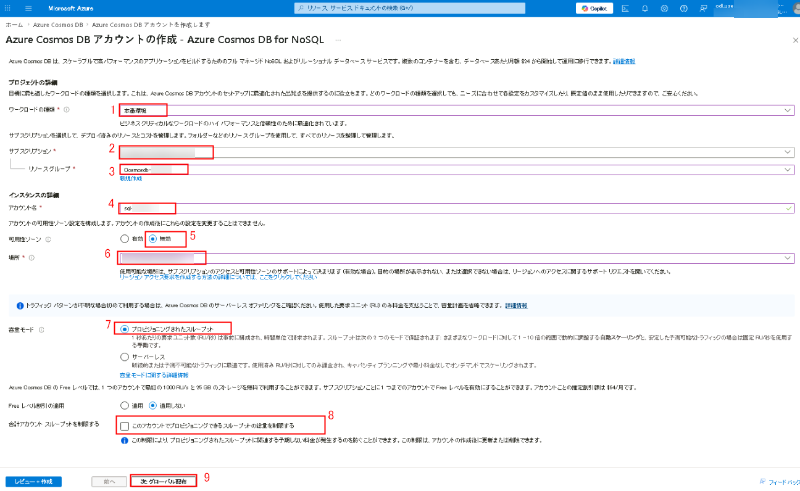

1. Global Distribution ページで **Next: Networking** をクリックします。**Connectivity method** に **All networks (1)** を選択し、**Review + Create (2)** をクリックします。

     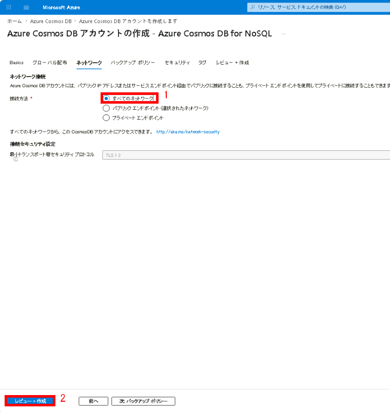

1. **Create** をクリックします。

    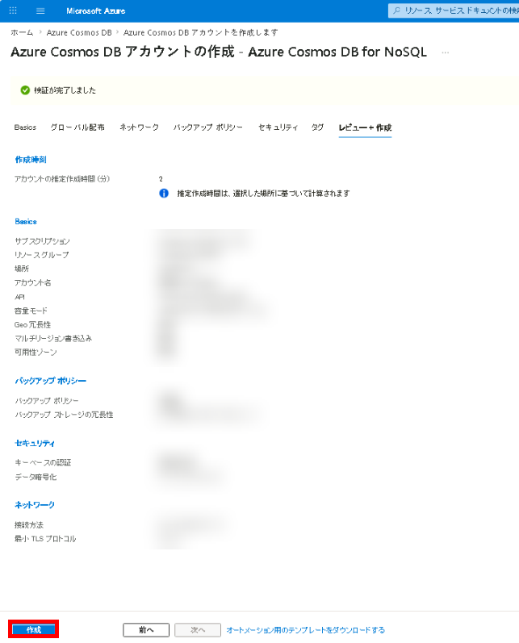

1. このタスクを続行する前に、デプロイメント タスクが完了するまで待ちます。

1. デプロイメントが完了したら、**Go to resources** を選択します。

    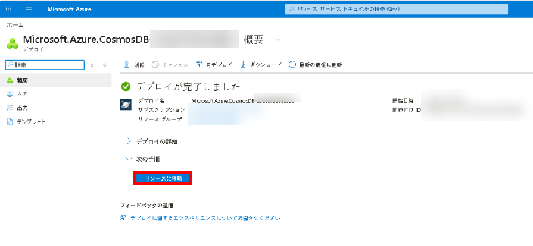

1. **Azure Cosmos DB アカウント** で、左側メニューの **Settings (1)** を展開し、**Keys (2)** を選択します。

    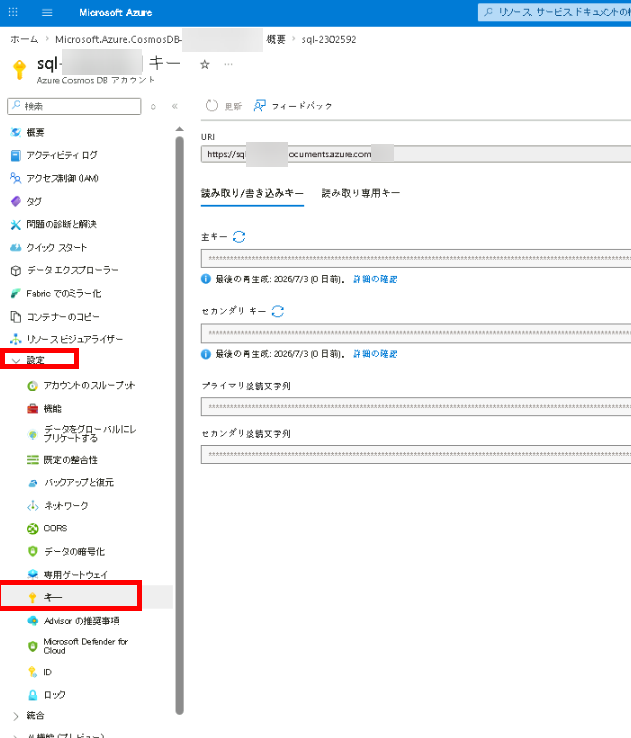

1. このペインには、SDK からアカウントに接続するために必要な接続情報と資格情報が表示されます。具体的には:

    1. **URI** フィールドの値を記録します。この **endpoint** 値は後ほど本演習で使用します。

    1. **PRIMARY KEY** フィールドの値を記録します。この **key** 値は後ほど本演習で使用します。

        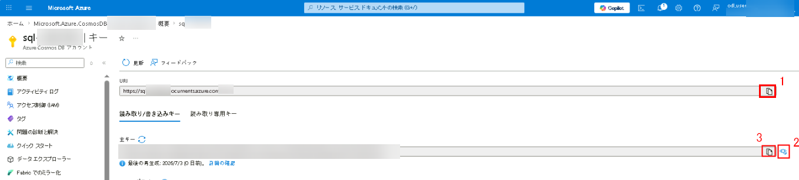
       
1. **Visual Studio Code** に戻ります。

    > **おめでとうございます**、ラボを完了しました！次は検証です。手順は次のとおりです:
    > - 該当タスクの検証ボタンをクリックします。成功メッセージが表示された場合、ラボの検証に成功しています。
    > - そうでない場合は、エラーメッセージを注意深く読み、ラボ ガイドの指示に従って手順を再実行してください。
    > - サポートが必要な場合は、cloudlabs-support@spektrasystems.com までお問い合わせください。24時間体制でサポートしています。
    
<validation step="185fcc24-d57e-4db3-a26d-1b9d4b61dbf2" />

### タスク 2: SDK から Azure Cosmos DB NoSQL API アカウントに接続する

このタスクでは、Azure SDK for .NET を使用して Azure Cosmos DB NoSQL API アカウントに接続します。Visual Studio Code を使い、Cosmos DB アカウント内に新しいデータベースとコンテナーを作成するスクリプトを実行します。データベースとコンテナーが作成されたら、Azure ポータルの Data Explorer を使って存在を確認します。

1. **Visual Studio Code** の **Explorer** ペインで、**06-sdk-crud** フォルダーに移動します。

1. **06-sdk-crud (1)** フォルダーのコンテキスト メニューを開き、**Open in Integrated Terminal (2)** を選択して新しいターミナルを開きます。

     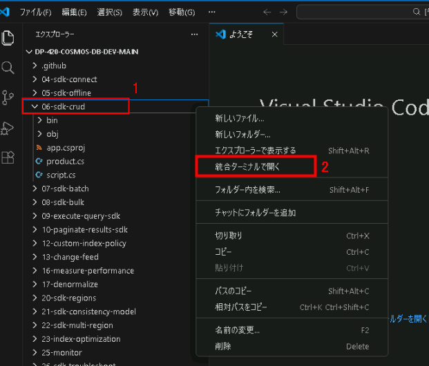
        
    >**補足**: このコマンドは、開始ディレクトリが **06-sdk-crud** フォルダーに設定された状態でターミナルを開きます。

1. 次のコマンドを使用して、NuGet から [Microsoft.Azure.Cosmos][nuget.org/packages/microsoft.azure.cosmos/3.22.1] パッケージを追加します:

    ```
    dotnet add package Microsoft.Azure.Cosmos --version 3.22.1
    ```

1. 次のコマンドを使用してプロジェクトをビルドします:

    ```
    dotnet build
    ```

1. 統合ターミナルを閉じます。

1. **Visual Studio Code** で、**06-sdk-crud (1)** フォルダーの空の **script.cs (2)** コード ファイルを開きます。

    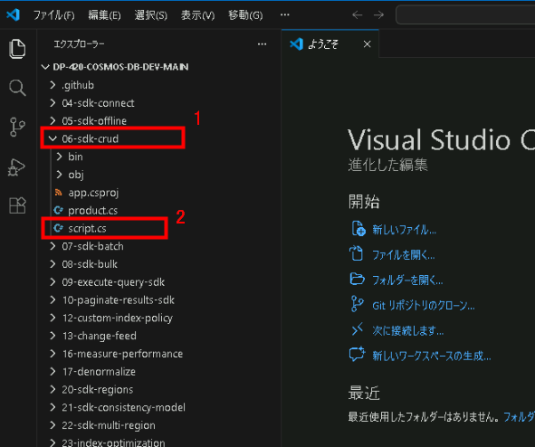

    >**補足**: **[Microsoft.Azure.Cosmos][nuget.org/packages/microsoft.azure.cosmos/3.22.1]** ライブラリは既に NuGet からインポートされています。

1. **endpoint** という名前の **string** 変数を探します。前のラボで作成した Azure Cosmos DB アカウントの **endpoint** をその値に設定します。

    ```
    string endpoint = "<cosmos-endpoint>";
    ```
      
     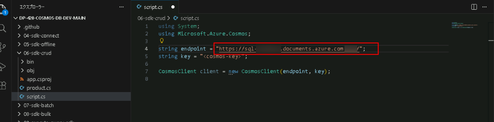

    >**補足**: 例えば、エンドポイントが **https&shy;://dp420.documents.azure.com:443/** の場合、C# の文は **string endpoint = "https&shy;://dp420.documents.azure.com:443/";** になります。

1. **key** という名前の **string** 変数を探します。前のラボで作成した Azure Cosmos DB アカウントの **key** をその値に設定します。

    ```
    string key = "<cosmos-key>";
    ```
    
    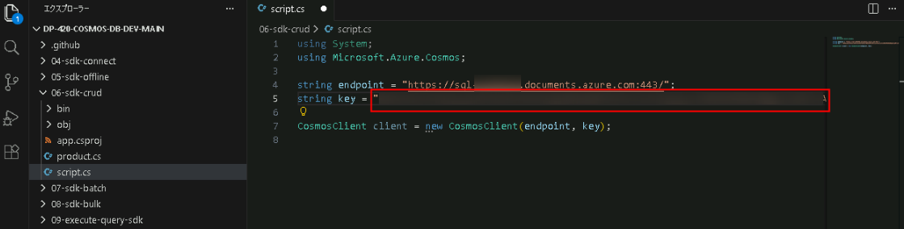

    >**補足**: 例えば、キーが **fDR2ci9QgkdkvERTQ==** の場合、C# の文は **string key = "fDR2ci9QgkdkvERTQ==";** になります。

1. 次のコマンドを追加し、**client** 変数の `CreateDatabaseIfNotExistsAsync` メソッドを非同期で呼び出して、新しいデータベース名 (**cosmicworks**) を渡し、結果を **Database** 型の変数に格納します:

    ```
    Database database = await client.CreateDatabaseIfNotExistsAsync("cosmicworks");
    ```

1. 次のコマンドを追加し、**database** 変数の `CreateContainerIfNotExistsAsync` メソッドを非同期で呼び出して、新しいコンテナー名 (**products**)、パーティション キー パス (**/categoryId**)、スループット (**400**) を渡し、結果を **Container** 型の変数に格納します:
  
    ```
    Container container = await database.CreateContainerIfNotExistsAsync("products", "/categoryId", 400);    
    ```

1. 完了すると、コード ファイルには次の内容が含まれているはずです:
  
    ```
    using System;
    using Microsoft.Azure.Cosmos;

    string endpoint = "<cosmos-endpoint>";
    string key = "<cosmos-key>";

    CosmosClient client = new CosmosClient(endpoint, key);
    
    Database database = await client.CreateDatabaseIfNotExistsAsync("cosmicworks");
    
    Container container = await database.CreateContainerIfNotExistsAsync("products", "/categoryId", 400);
    ```

1. **script.cs** コード ファイルを **保存** します。

    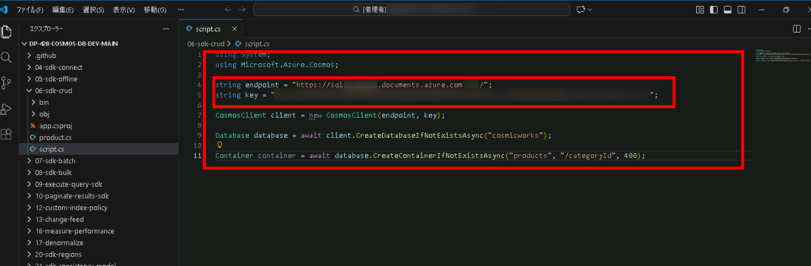

1. **Visual Studio Code** で **06-sdk-crud (1)** フォルダーのコンテキスト メニューを開き、**Open in Integrated Terminal (2)** を選択して新しいターミナルを開きます。

    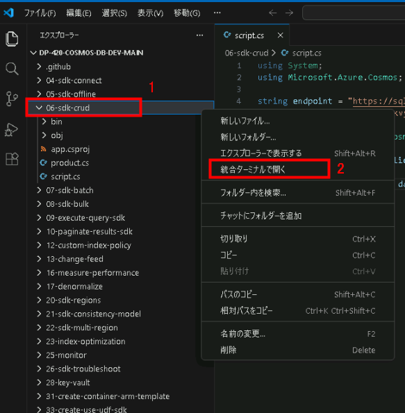
     
1. 次のコマンドを使用してプロジェクトをビルドおよび実行します:

    ```
    dotnet run
    ```
   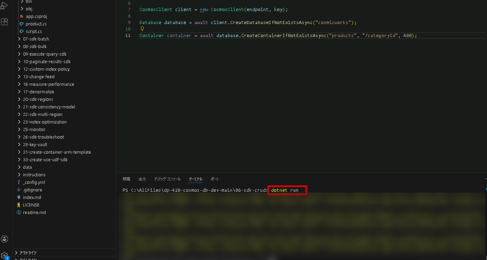

1. 統合ターミナルを閉じます。

1. Azure ポータル ページに戻り、ポータル上部の [Search resources, services and docs (G+/)] ボックスに **Azure Cosmos DB (1)** と入力し、サービスとして表示される **Azure Cosmos DB (2)** を選択します。

   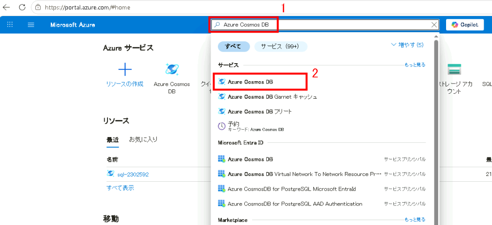

1. **sql-<inject key="DeploymentID" enableCopy="false"/>** を選択します。

     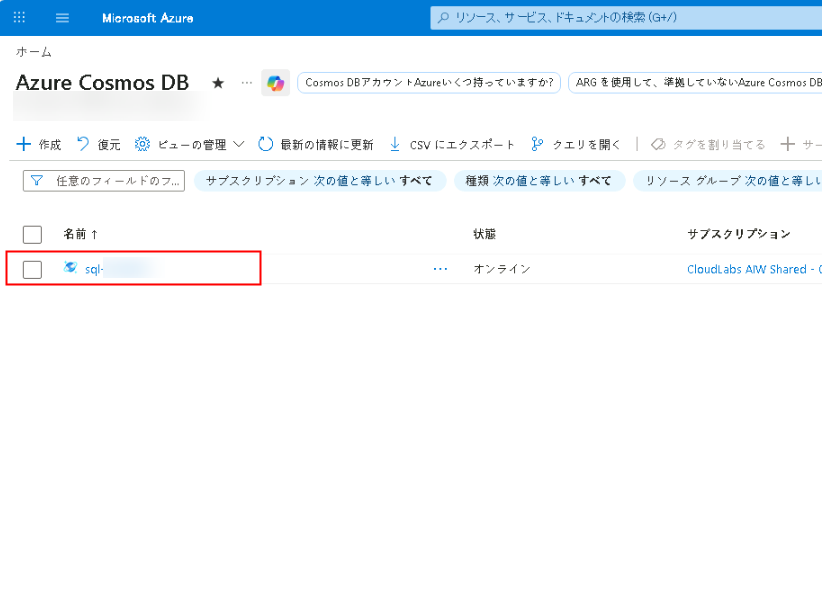

1. **Azure Cosmos DB** アカウント リソースの **overview page (1)** で、**Data Explorer (2)** ペインに移動します。

    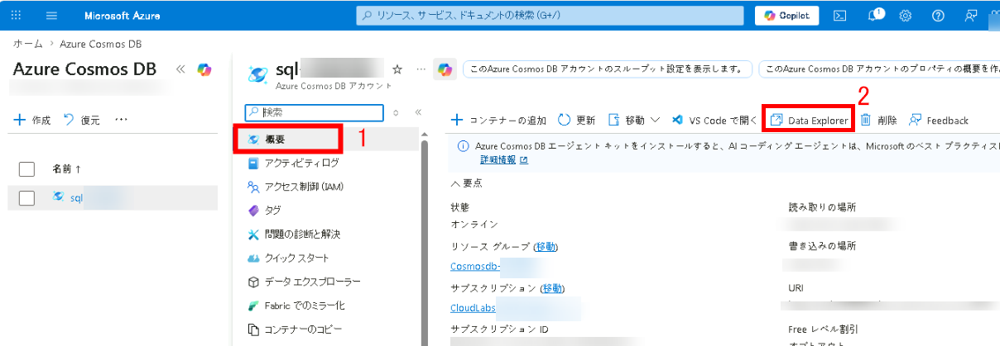

1. **Data Explorer** で **cosmicworks (2)** データベース ノードを展開し、**products (3)** コンテナー ノードを展開します。

    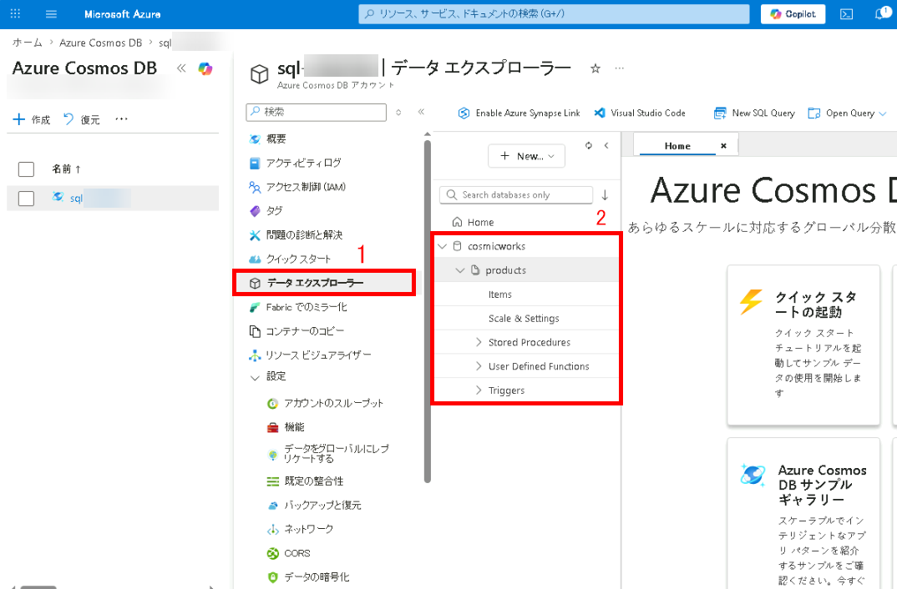
   
    > **おめでとうございます**、ラボを完了しました！次は検証です。手順は次のとおりです:
    > - 対応するタスクの検証ボタンをクリックします。成功メッセージが表示された場合、ラボの検証に成功しています。
    > - そうでない場合は、エラーメッセージを注意深く読み、ラボ ガイドの指示に従って手順を再実行してください。
    > - サポートが必要な場合は、cloudlabs-support@spektrasystems.com までお問い合わせください。24時間体制でサポートしています。

<validation step="efd4c72c-608a-423e-97eb-a3700baca703" />

### タスク 3: SDK を使用したアイテムの作成と読み取りポイント操作

このタスクでは、`Microsoft.Azure.Cosmos.Container` クラスの一連の非同期メソッドを使用して、NoSQL API コンテナー内のアイテムに対する一般的な操作を実行します。これらの操作はすべて、C# のタスク非同期プログラミング モデルを使用して実行されます。

1. **Visual Studio Code** に戻ります。**06-sdk-crud** フォルダー内の **product.cs** コード ファイルを開きます。

    >**補足**: **script.cs** ファイルのエディターは閉じないでください。

1. このコード ファイル内の **Product** クラスを確認します。このクラスは、このコンテナー内に格納および操作される製品アイテムを表します。

1. **script.cs** コード ファイルのエディター タブに戻ります。

1. 次のコマンドを実行して、**Product** 型の新しいオブジェクト **saddle** を作成します:

    | Property | Value |
    | --- | --- |
    | **id** | *706cd7c6-db8b-41f9-aea2-0e0c7e8eb009* |
    | **categoryId** | *9603ca6c-9e28-4a02-9194-51cdb7fea816* |
    | **name** | *Road Saddle* |
    | **price** | *45.99d* |
    | **tags** | *{ tan, new, crisp }* |

    ```
    Product saddle = new()
    {
        id = "706cd7c6-db8b-41f9-aea2-0e0c7e8eb009",
        categoryId = "9603ca6c-9e28-4a02-9194-51cdb7fea816",
        name = "Road Saddle",
        price = 45.99d,
        tags = new string[]
        {
            "tan",
            "new",
            "crisp"
        }
    };
    ```

1. 次のコマンドを追加し、**container** 変数のジェネリック メソッド `CreateItemAsync<>` を非同期で呼び出して、**saddle** 変数を渡します。ジェネリック型には **Product** を指定します:

    ```
    await container.CreateItemAsync<Product>(saddle);
    ```

1. 完了すると、コード ファイルには次の内容が含まれているはずです:
  
    ```
    using System;
    using Microsoft.Azure.Cosmos;

    string endpoint = "<cosmos-endpoint>";
    string key = "<cosmos-key>";

    CosmosClient client = new CosmosClient(endpoint, key);
    
    Database database = await client.CreateDatabaseIfNotExistsAsync("cosmicworks");
    
    Container container = await database.CreateContainerIfNotExistsAsync("products", "/categoryId", 400);

    Product saddle = new()
    {
        id = "706cd7c6-db8b-41f9-aea2-0e0c7e8eb009",
        categoryId = "9603ca6c-9e28-4a02-9194-51cdb7fea816",
        name = "Road Saddle",
        price = 45.99d,
        tags = new string[]
        {
            "tan",
            "new",
            "crisp"
        }
    };

    await container.CreateItemAsync<Product>(saddle);
    ```

1. **script.cs** コード ファイルを **保存** します。

1. **Visual Studio Code** で **06-sdk-crud** フォルダーのコンテキスト メニューを開き、**Open in Integrated Terminal** を選択して新しいターミナルを開きます。

1. 次のコマンドを使用してプロジェクトをビルドおよび実行します:

    ```
    dotnet run
    ```

1. 統合ターミナルを閉じます。

1. **script.cs** コード ファイルのエディター タブに戻ります。

1. 次のコード行を削除します:

    ```
    Product saddle = new()
    {
        id = "706cd7c6-db8b-41f9-aea2-0e0c7e8eb009",
        categoryId = "9603ca6c-9e28-4a02-9194-51cdb7fea816",
        name = "Road Saddle",
        price = 45.99d,
        tags = new string[]
        {
            "tan",
            "new",
            "crisp"
        }
    };

    await container.CreateItemAsync<Product>(saddle);
    ```

1. 次のコマンドを追加し、**id** という名前の文字列変数を作成します。値は **706cd7c6-db8b-41f9-aea2-0e0c7e8eb009** です:

    ```
    string id = "706cd7c6-db8b-41f9-aea2-0e0c7e8eb009";
    ```

1. 次のコマンドを追加し、**categoryId** という名前の文字列変数を作成します。値は **9603ca6c-9e28-4a02-9194-51cdb7fea816** です:

    ```
    string categoryId = "9603ca6c-9e28-4a02-9194-51cdb7fea816";
    ```

1. 次のコマンドを追加し、**categoryId** 変数をコンストラクター引数として渡して、[PartitionKey][docs.microsoft.com/dotnet/api/microsoft.azure.cosmos.partitionkey] 型の変数 **partitionKey** を作成します:

    ```
    PartitionKey partitionKey = new (categoryId);
    ```

1. 次のコマンドを追加し、**container** 変数のジェネリック メソッド `ReadItemAsync<>` を非同期で呼び出します。`id` と `partitionKey` 変数を渡し、ジェネリック型には **Product** を指定して、結果を **Product** 型の **saddle** という変数に格納します:

    ```
    Product saddle = await container.ReadItemAsync<Product>(id, partitionKey);
    ```

1. 次のコマンドを追加し、静的メソッド **Console.WriteLine** を呼び出して、整形された出力文字列で `saddle` オブジェクトを表示します:

    ```
    Console.WriteLine($"[{saddle.id}]\t{saddle.name} ({saddle.price:C})");
    ```

1. 完了すると、コード ファイルには次の内容が含まれているはずです:
  
    ```
    using System;
    using Microsoft.Azure.Cosmos;

    string endpoint = "<cosmos-endpoint>";
    string key = "<cosmos-key>";

    CosmosClient client = new CosmosClient(endpoint, key);
    
    Database database = await client.CreateDatabaseIfNotExistsAsync("cosmicworks");
    
    Container container = await database.CreateContainerIfNotExistsAsync("products", "/categoryId", 400);

    string id = "706cd7c6-db8b-41f9-aea2-0e0c7e8eb009";

    string categoryId = "9603ca6c-9e28-4a02-9194-51cdb7fea816";
    PartitionKey partitionKey = new (categoryId);

    Product saddle = await container.ReadItemAsync<Product>(id, partitionKey);

    Console.WriteLine($"[{saddle.id}]\t{saddle.name} ({saddle.price:C})");
    ```

1. **script.cs** コード ファイルを **保存** します。

1. **Visual Studio Code** で **06-sdk-crud (1)** フォルダーのコンテキスト メニューを開き、**Open in Integrated Terminal (2)** を選択して新しいターミナルを開きます。

    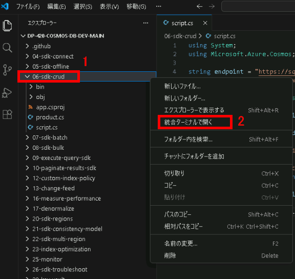

1. **[dotnet run][docs.microsoft.com/dotnet/core/tools/dotnet-run]** コマンドを使用してプロジェクトをビルドおよび実行します:

    ```
    dotnet run
    ```

1. ターミナルの出力を確認します。特に、アイテムの ID、名前、価格が整形されたテキストとして表示されていることを確認します。

    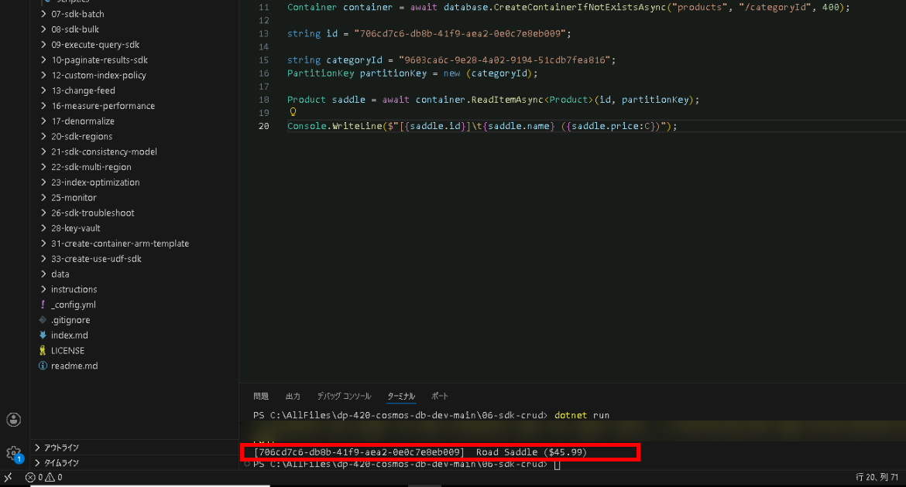
   
1. 統合ターミナルを閉じます。

### タスク 4: SDK を使用した更新と削除のポイント操作

このタスクでは、`UpsertItemAsync` メソッドを使用して製品の価格と名前を更新し、Azure ポータルで変更を確認します。更新が確認できたら、`DeleteItemAsync` メソッドでアイテムを削除し、Data Explorer でアイテムが削除されたことを確認します。

SDK を学習する際には、オンラインの Azure Cosmos DB SDK アカウントやエミュレーターを使用してアイテムを更新し、操作の結果を確認するために Data Explorer と IDE を行き来することがよくあります。ここでは、SDK を使ってアイテムを更新および削除する際にそのような手順を実行します。

1. Azure ポータル ページで、ポータル上部の [Search resources, services and docs (G+/)] ボックスに **Azure Cosmos DB (1)** と入力し、サービスとして表示される **Azure Cosmos DB (2)** を選択します。

   

1. **sql-<inject key="DeploymentID" enableCopy="false"/>** を選択します。

     

1. **Azure Cosmos DB** アカウント リソースの **overview page (1)** で、**Data Explorer (2)** ペインに移動します。

    

1. **Data Explorer** で **cosmicworks (2)** データベース ノードを展開し、**products (3)** コンテナー ノードを展開してから **Items (4)** を選択します。続いて、アイテムの **name** と **price** プロパティの値を確認します。

    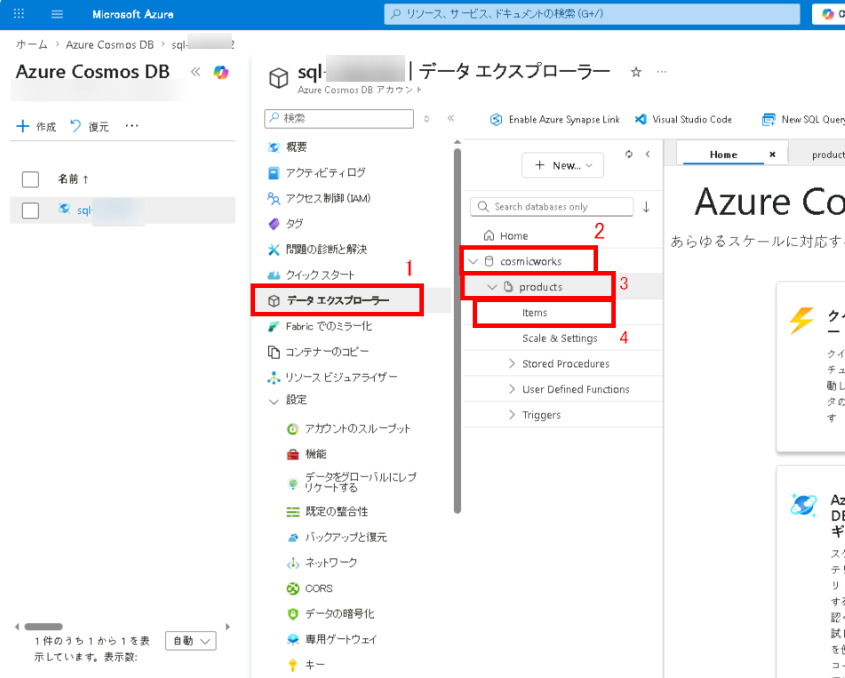

    | **Property** | **Value** |
    | :--- | :--- |
    | **Name** | *Road Saddle* |
    | **Price** | *$45.99* |

    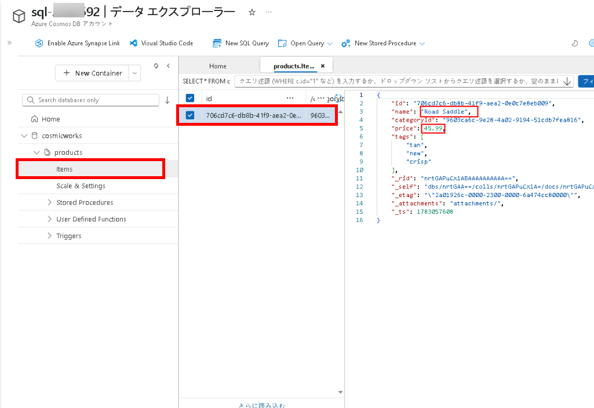

    >**補足**: この時点では、これらの値はアイテムを作成したときから変更されていないはずです。この演習でこれらの値を変更します。

1. **Visual Studio Code** に戻り、**script.cs** コード ファイルのエディター タブに戻ります。

1. 次のコード行を削除します:

    ```
    Console.WriteLine($"[{saddle.id}]\t{saddle.name} ({saddle.price:C})");
    ```

1. 次のコマンドを追加して、**saddle** 変数の `price` プロパティの値を **32.55** に変更します:

    ```
    saddle.price = 32.55d;
    ```

1. 次のコマンドを追加して、**saddle** 変数の `name` プロパティの値を **Road LL Saddle** に変更します:

    ```
    saddle.name = "Road LL Saddle";
    ```

1. 次のコマンドを追加し、**container** 変数のジェネリック メソッド `UpsertItemAsync<>` を非同期で呼び出して、**saddle** 変数を渡します。ジェネリック型には **Product** を指定します:

    ```
    await container.UpsertItemAsync<Product>(saddle);
    ```

1. 完了すると、コード ファイルには次の内容が含まれているはずです:
  
    ```
    using System;
    using Microsoft.Azure.Cosmos;

    string endpoint = "<cosmos-endpoint>";
    string key = "<cosmos-key>";

    CosmosClient client = new CosmosClient(endpoint, key);
    
    Database database = await client.CreateDatabaseIfNotExistsAsync("cosmicworks");
    
    Container container = await database.CreateContainerIfNotExistsAsync("products", "/categoryId", 400);

    string id = "706cd7c6-db8b-41f9-aea2-0e0c7e8eb009";

    string categoryId = "9603ca6c-9e28-4a02-9194-51cdb7fea816";
    PartitionKey partitionKey = new (categoryId);

    Product saddle = await container.ReadItemAsync<Product>(id, partitionKey);

    saddle.price = 32.55d;
    saddle.name = "Road LL Saddle";
    
    await container.UpsertItemAsync<Product>(saddle);
    ```

1. **script.cs** コード ファイルを **保存** します。

1. **Visual Studio Code** で **06-sdk-crud (1)** フォルダーのコンテキスト メニューを開き、**Open in Integrated Terminal (2)** を選択して新しいターミナルを開きます。

    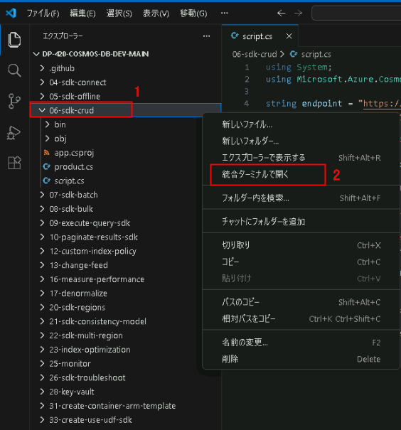

1. **[dotnet run][docs.microsoft.com/dotnet/core/tools/dotnet-run]** コマンドを使用してプロジェクトをビルドおよび実行します:

    ```
    dotnet run
    ```

1. 統合ターミナルを閉じます。

1. Azure ポータル ページに戻り、ポータル上部の [Search resources, services and docs (G+/)] ボックスに **Azure Cosmos DB (1)** と入力し、サービスとして表示される **Azure Cosmos DB (2)** を選択します。

   

1. **sql-<inject key="DeploymentID" enableCopy="false"/>** を選択します。

     

1. **Azure Cosmos DB** アカウント リソースの **overview page (1)** で、**Data Explorer (2)** ペインに移動します。

    

1. **Data Explorer** で **cosmicworks (2)** データベース ノードを展開し、**products (3)** コンテナー ノードを展開してから **Items (4)** を選択します。アイテムの **name** と **price** プロパティの値を確認します。

    | **Property** | **Value** |
    | --- | --- |
    | **Name** | *Road LL Saddle* |
    | **Price** | *$32.55* |

    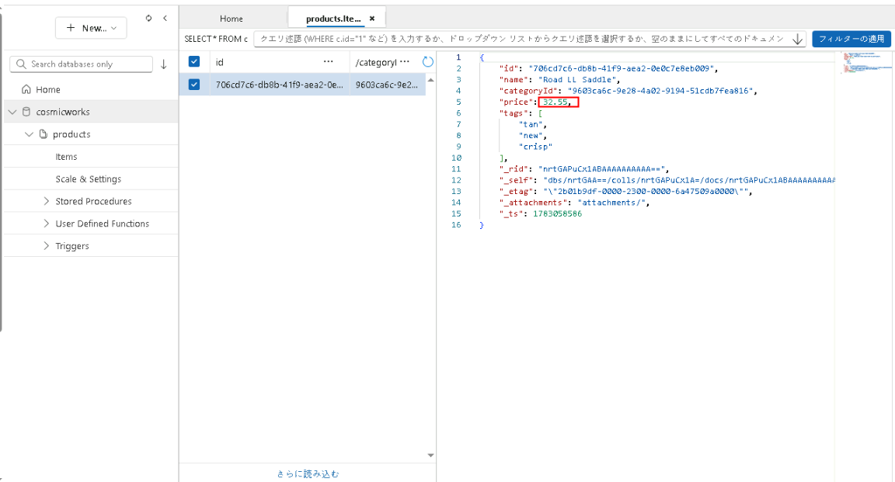

    >**補足**: この時点では、これらの値が変更されているはずです。

1. **Visual Studio Code** に戻り、**script.cs** コード ファイルのエディター タブに戻ります。

1. 次のコード行を削除します:

    ```
    Product saddle = await container.ReadItemAsync<Product>(id, partitionKey);

    saddle.price = 32.55d;
    saddle.name = "Road LL Saddle";
    
    await container.UpsertItemAsync<Product>(saddle);
    ```

1. 次のコマンドを追加し、**container** 変数のジェネリック メソッド `DeleteItemAsync<>` を非同期で呼び出します。**id** と **partitionKey** 変数を渡し、ジェネリック型には **Product** を指定します:

    ```
    await container.DeleteItemAsync<Product>(id, partitionKey);
    ```

1. **script.cs** コード ファイルを **保存** します。

1. **Visual Studio Code** で **06-sdk-crud (1)** フォルダーのコンテキスト メニューを開き、**Open in Integrated Terminal (2)** を選択して新しいターミナルを開きます。

    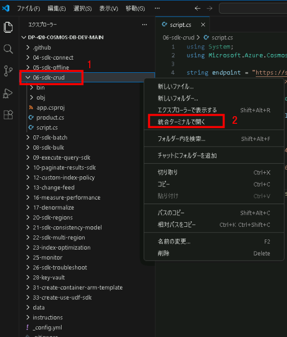

1. **[dotnet run][docs.microsoft.com/dotnet/core/tools/dotnet-run]** コマンドを使用してプロジェクトをビルドおよび実行します:

    ```
    dotnet run
    ```

1. 統合ターミナルを閉じます。

1. Azure ポータル ページに戻り、ポータル上部の [Search resources, services and docs (G+/)] ボックスに **Azure Cosmos DB (1)** と入力し、サービスとして表示される **Azure Cosmos DB (2)** を選択します。

   

1. **sql-<inject key="DeploymentID" enableCopy="false"/>** を選択します。

     

1. **Azure Cosmos DB** アカウント リソースの **overview page (1)** で、**Data Explorer (2)** ペインに移動します。

    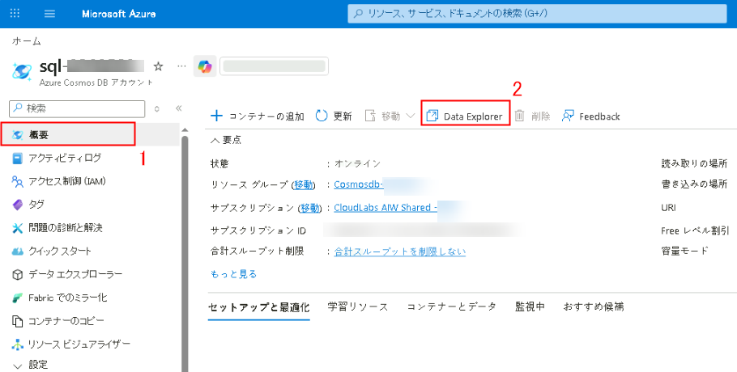

1. **Items** ノードを選択します。アイテム一覧が空であることを確認します。

     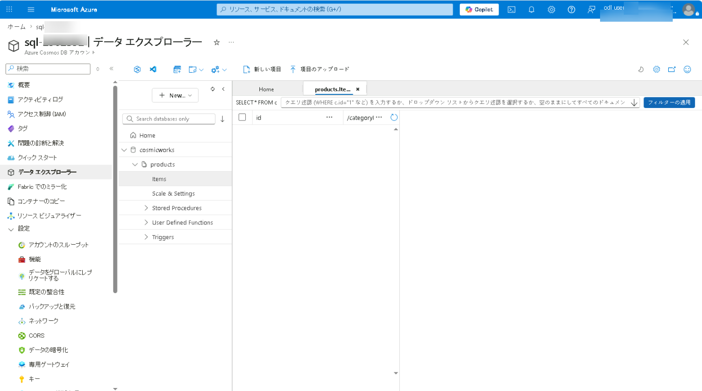
    
1. ブラウザーのウィンドウまたはタブを閉じます。

1. **Visual Studio Code** を閉じます。

### 要約

このラボでは、Azure Cosmos DB NoSQL API SDK を使用して基本的な CRUD 操作を実行する方法を学習しました。まず Azure Cosmos DB NoSQL API アカウントを作成し、次に SDK を使用してアカウントに接続し、データベースとコンテナーを作成しました。続いてコンテナー内のアイテムに対して作成と読み取り操作を実行し、データの管理を実践的に体験しました。最後に、アイテムを更新および削除し、Cosmos DB におけるデータ操作の理解を深めました。ラボの終了時には、プログラムによる CRUD 操作の統合により、NoSQL 環境での効率的なデータ管理が可能になることを理解しました。

### レビュー

このラボで完了した項目:

- Azure Cosmos DB NoSQL API アカウントを作成しました。
- SDK から Azure Cosmos DB NoSQL API アカウントに接続しました。
- SDK を使用してアイテムの作成および読み取りポイント操作を実行しました。
- SDK を使用してアイテムの更新および削除ポイント操作を実行しました。

### ラボを正常に完了しました
