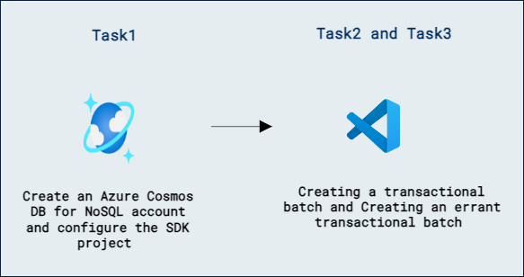
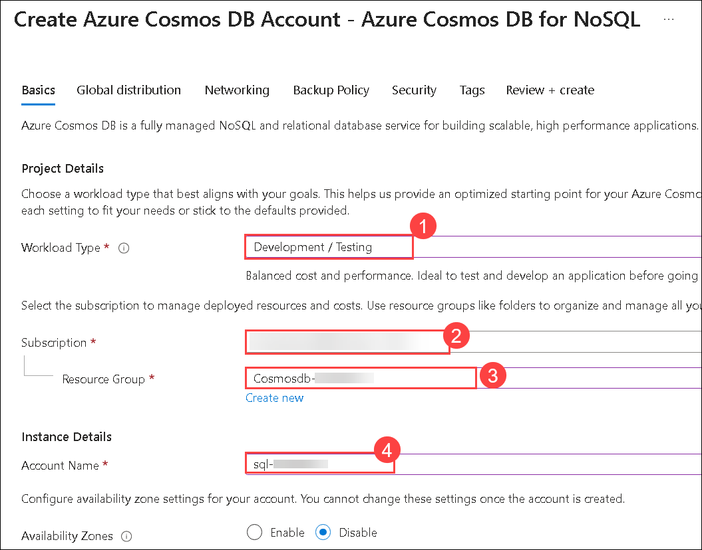
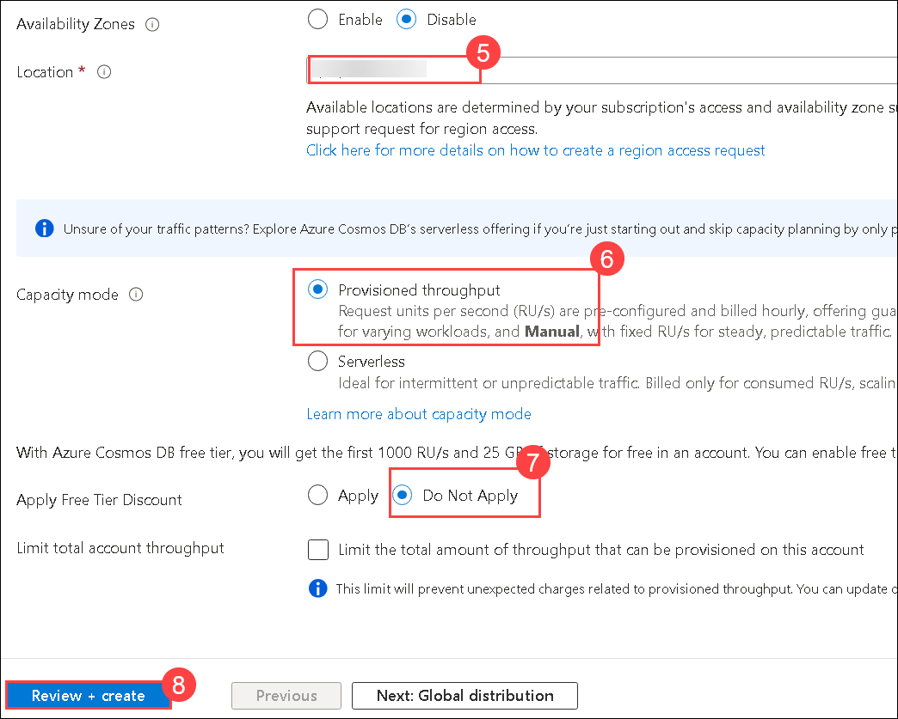
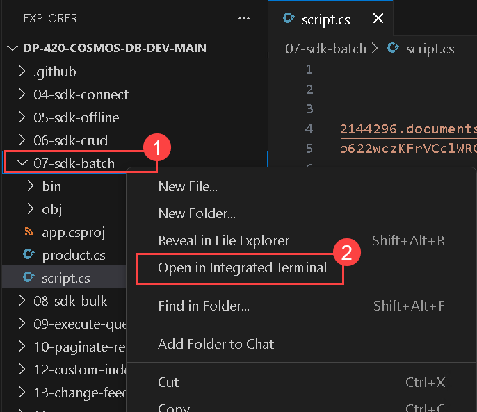
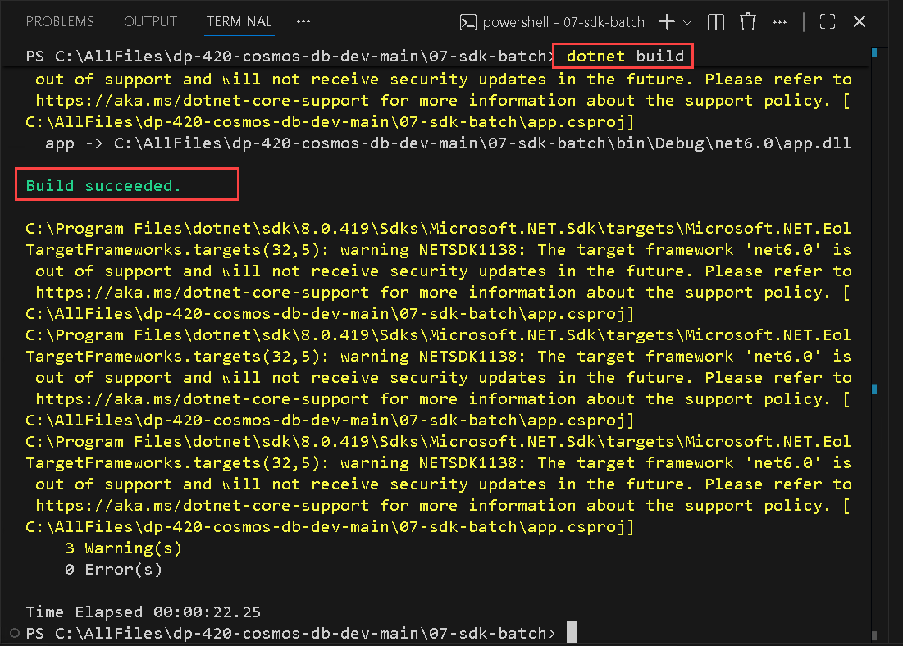
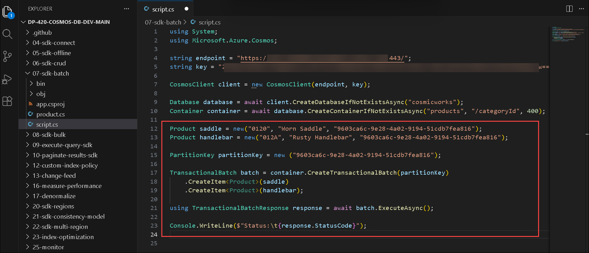
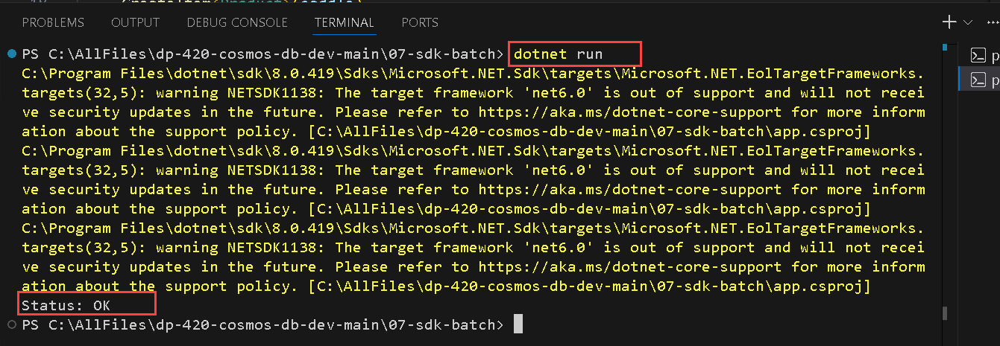
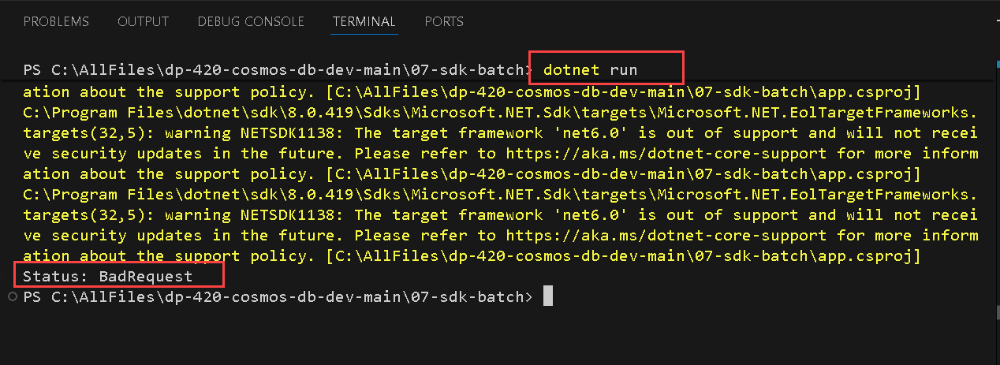

# 複数のポイント操作をバッチ処理する（Azure Cosmos DB NoSQL API SDK）

## ラボ シナリオ

[TransactionalBatch][docs.microsoft.com/dotnet/api/microsoft.azure.cosmos.transactionalbatch] と [TransactionalBatchResponse][docs.microsoft.com/dotnet/api/microsoft.azure.cosmos.transactionalbatchresponse] のクラスは、複数の操作を単一の論理ステップとして合成・分解するための要です。これらのクラスを使用すると、複数の操作を実行するコードを書き、サーバー側でそれらが正常に完了したかどうかを判定できます。

このラボでは、SDK を使用して、2 件のアイテムを単一の論理ユニットとして作成しようとする2つの双方向アイテム操作を実行します。

## ラボの目的

このラボでは、以下のタスクを完了します:
- タスク 1: Azure Cosmos DB for NoSQL アカウントを作成し、SDK プロジェクトを構成する
- タスク 2: トランザクショナル バッチを作成する
- タスク 3: エラーが発生するトランザクショナル バッチを作成する

## 推定所要時間: 30 分

## アーキテクチャ図



## 開発環境の準備

このタスクでは、Visual Studio Code をセットアップして Azure Cosmos DB を使った開発環境を準備します。

1. デスクトップから **Visual Studio Code** を起動します。

     

2. 左側のパネルから **Extensions (1)** を選択します。**C# (2)** を検索し、**Install (3)** を選択して拡張機能をインストールします。インストールが完了するまで待ちます。

    

3. 画面左上の **File (1)** オプションを選択し、ペインのオプションから **Open Folder (2)** を選択します。

    

4. **C:\AllFiles (1)** に移動し、**dp-420-cosmos-db-dev-main (2)** を選択して **Select Folder (3)** をクリックします。

    

5. 「このフォルダー内のファイルの作成者を信頼しますか」と表示された場合は、**Yes, I trust the authors** をクリックします。

## タスク 1: Azure Cosmos DB for NoSQL アカウントの作成と SDK プロジェクトの構成

このタスクでは、Azure Cosmos DB SQL アカウントをプロビジョニングし、今後の開発に必要な接続情報を取得します。

1. Azure ポータル ページに戻り、ポータル上部の [Search resources, services and docs (G+/)] ボックスに **Azure Cosmos DB (1)** と入力し、サービス一覧に表示される **Azure Cosmos DB (2)** を選択します。

   
   
1. **Azure Cosmos DB for NoSQL** の下にある **+ Create (1)** を選択します。

    

    - **Create (2)** をクリックして Azure Cosmos DB for NoSQL アカウントを作成します。

      
   
1. 以下の設定を指定し、それ以外の設定はすべて既定値のままにして、**Review + create (8)** を選択します:

    | **設定** | **値** |
    | ---------------- |---------------------------------- |
    | **Workload Type** | *Development/Testing* **(1)** |    
    | **Subscription** | *Your existing Azure subscription* **(2)** |
    | **Resource group** | *Select an existing Cosmosdb-<inject key="DeploymentID" enableCopy="false"/>* **(3)** |
    | **Account Name** | *sql-<inject key="DeploymentID" enableCopy="false"/>* **(4)** |
    | **Location** | *Choose any available region* **(5)** |
    | **Capacity mode** | *Provisioned throughput* **(6)** |
    | **Apply Free Tier Discount** | *Do Not Apply* **(7)** |

     
            

1. バリデーションが通ったら **Create** をクリックします。

1. このタスクを続行する前に、デプロイが完了するまで待ちます。

1. **script.cs** コード ファイルを **保存** します。

1. **07-sdk-batch** フォルダーのコンテキスト メニューを開き、右クリック **(1)** して **Open in Integrated Terminal (2)** を選択し、新しい統合ターミナルを開きます。

    

     >**補足**: このコマンドは、開始ディレクトリが既に **07-sdk-batch** フォルダーに設定された状態でターミナルを開きます。

1. 次のコマンドを使用して NuGet から `Microsoft.Azure.Cosmos` パッケージを追加します:

    ```
    dotnet add package Microsoft.Azure.Cosmos --version 3.22.1
    ```

1. 次のコマンドを使用してプロジェクトをビルドします:

    ```
    dotnet build
    ```

        

1. 統合ターミナルを閉じます。

    > **おめでとうございます**、ラボを完了しました！次は検証です。手順は次のとおりです:
    > - 該当タスクの検証ボタンをクリックします。成功メッセージが表示された場合、ラボの検証に成功しています。 
    > - そうでない場合は、エラーメッセージを注意深く読み、ラボ ガイドの指示に従って手順を再実行してください。
    > - サポートが必要な場合は、cloudlabs-support@spektrasystems.com までお問い合わせください。24時間体制でサポートを提供しています。
    
<validation step="9388db32-62bd-416d-a11e-beba00d5bd19" />

### タスク 2: トランザクショナル バッチの作成

このタスクでは、同一のパーティションに対して 2 つの製品（"Worn Saddle" と "Rusty Handlebar"）を挿入するトランザクショナル バッチを作成します。バッチは両方の挿入を原子的に実行するため、両方とも成功するか、いずれも適用されません。バッチを作成・実行した後は、ステータス コードを確認して結果を検証します。

まず、簡単なトランザクショナル バッチを作成して、2 つの架空の製品を追加します。このバッチは "used accessories" カテゴリ識別子を持つコンテナーに、Worn Saddle と Rusty Handlebar を挿入します。両アイテムは同じ論理パーティション キーを持つため、バッチ操作は成功するはずです。

1. **script.cs** のエディタ タブに戻り、既存コードの下に以下のコードを順に追加します。

1. 一意の識別子 **0120**、名前 **Worn Saddle**、カテゴリ識別子 **9603ca6c-9e28-4a02-9194-51cdb7fea816** を持つ `Product` 変数 **saddle** を作成します:

    ```
    Product saddle = new("0120", "Worn Saddle", "9603ca6c-9e28-4a02-9194-51cdb7fea816");
    ```

1. 一意の識別子 **012A**、名前 **Rusty Handlebar**、カテゴリ識別子 **9603ca6c-9e28-4a02-9194-51cdb7fea816** を持つ `Product` 変数 **handlebar** を作成します:

    ```
    Product handlebar = new("012A", "Rusty Handlebar", "9603ca6c-9e28-4a02-9194-51cdb7fea816");
    ```

1. **9603ca6c-9e28-4a02-9194-51cdb7fea816** をコンストラクター引数に渡して、`PartitionKey` 型の変数 **partitionKey** を作成します:

    ```
    PartitionKey partitionKey = new ("9603ca6c-9e28-4a02-9194-51cdb7fea816");
    ```

1. `container` 変数の `CreateTransactionalBatch` メソッドを呼び出し、フルエント構文で `CreateItem<>` ジェネリック メソッドを連鎖して **saddle** と **handlebar** を作成する操作を追加し、結果を `TransactionalBatch` 型の **batch** に格納します:

    ```
    TransactionalBatch batch = container.CreateTransactionalBatch(partitionKey)
        .CreateItem<Product>(saddle)
        .CreateItem<Product>(handlebar);
    ```

1. `using` ステートメント内で、**batch** の `ExecuteAsync` メソッドを非同期に呼び出し、`TransactionalBatchResponse` 型の **response** に結果を格納します:

    ```
    using TransactionalBatchResponse response = await batch.ExecuteAsync();
    ```

1. 静的メソッド `Console.WriteLine` を呼び出して、`response.StatusCode` の値を出力します:

    ```
    Console.WriteLine($"Status:\t{response.StatusCode}");
    ```
    ```

1. `container` 変数の `CreateTransactionalBatch` メソッドを呼び出し、フルエント構文で `CreateItem<>` ジェネリック メソッドを連鎖して **saddle** と **handlebar** を作成する操作を追加し、結果を `TransactionalBatch` 型の **batch** に格納します:

    ```
    TransactionalBatch batch = container.CreateTransactionalBatch(partitionKey)
        .CreateItem<Product>(saddle)
        .CreateItem<Product>(handlebar);
    ```

1. `using` ステートメント内で、**batch** の `ExecuteAsync` メソッドを非同期に呼び出し、`TransactionalBatchResponse` 型の **response** に結果を格納します:

    ```
    using TransactionalBatchResponse response = await batch.ExecuteAsync();
    ```

1. 静的メソッド `Console.WriteLine` を呼び出して、`response.StatusCode` の値を出力します:

    ```
    Console.WriteLine($"Status:\t{response.StatusCode}");
    ```

1. 完了すると、コード ファイルには次の内容が含まれているはずです:
  
    ```
    using System;
    using Microsoft.Azure.Cosmos;
    
    string endpoint = "<cosmos-endpoint>";
    string key = "<cosmos-key>";
    
    CosmosClient client = new CosmosClient(endpoint, key);
        
    Database database = await client.CreateDatabaseIfNotExistsAsync("cosmicworks");
    Container container = await database.CreateContainerIfNotExistsAsync("products", "/categoryId", 400);

    Product saddle = new("0120", "Worn Saddle", "9603ca6c-9e28-4a02-9194-51cdb7fea816");
    Product handlebar = new("012A", "Rusty Handlebar", "9603ca6c-9e28-4a02-9194-51cdb7fea816");
    
    PartitionKey partitionKey = new ("9603ca6c-9e28-4a02-9194-51cdb7fea816");
    
    TransactionalBatch batch = container.CreateTransactionalBatch(partitionKey)
        .CreateItem<Product>(saddle)
        .CreateItem<Product>(handlebar);
    
    using TransactionalBatchResponse response = await batch.ExecuteAsync();
    
    Console.WriteLine($"Status:\t{response.StatusCode}");
    ```

    

1. **script.cs** コード ファイルを **保存** します。

1. **07-sdk-batch** フォルダーのコンテキスト メニューを開き、**Open in Integrated Terminal** を選択して新しいターミナルを開きます。

1. 次のコマンドを使用してプロジェクトをビルドおよび実行します:

    ```
    dotnet run
    ```

1. ターミナルの出力を確認します。ステータス コードは HTTP 200 **OK** であるはずです。

    

1. これでアプリケーションの動作を確認できます。

1. 次のコマンドを使用してプロジェクトをビルドおよび実行します:

    ```
    dotnet run
    ```

1. ターミナルの出力を確認します。ステータス コードは HTTP 200 **OK** であるはずです。

    

1. これでアプリケーションの動作を確認できます。

### タスク 3: エラーを発生させるトランザクショナル バッチの作成

このタスクでは、異なるパーティション キーを持つ 2 つのアイテム（"Flickering Strobe Light" と "New Helmet"）を同一バッチで挿入しようとすることで、意図的にエラーを発生させます。Cosmos DB では同一バッチ内のすべてのアイテムが同じパーティション キーを共有する必要があるため、この操作はエラー（HTTP 400 Bad Request）になります。

まず、意図的にエラーになるトランザクショナル バッチを作成します。このバッチは、"used accessories" カテゴリのフリッカリングライトと、"pristine accessories" カテゴリの新しいヘルメットを挿入しようとします。定義上、これは不正なリクエストとなり、トランザクション実行時にエラーが返されます。

1. **script.cs** のエディタ タブに戻ります。

1. 次のコード行を削除します:

    ```
    Product saddle = new("0120", "Worn Saddle", "9603ca6c-9e28-4a02-9194-51cdb7fea816");
    Product handlebar = new("012A", "Rusty Handlebar", "9603ca6c-9e28-4a02-9194-51cdb7fea816");
                             
    PartitionKey partitionKey = new ("9603ca6c-9e28-4a02-9194-51cdb7fea816");
                             
    TransactionalBatch batch = container.CreateTransactionalBatch(partitionKey)
         .CreateItem<Product>(saddle)
         .CreateItem<Product>(handlebar);
                             
    using TransactionalBatchResponse response = await batch.ExecuteAsync();
                             
    Console.WriteLine($"Status:\t{response.StatusCode}");
    ```     

1. 一意の識別子 **012B**、名前 **Flickering Strobe Light**、カテゴリ識別子 **9603ca6c-9e28-4a02-9194-51cdb7fea816** を持つ `Product` 変数 **light** を作成します:

    ```
    Product light = new("012B", "Flickering Strobe Light", "9603ca6c-9e28-4a02-9194-51cdb7fea816");
    ```

1. 一意の識別子 **012C**、名前 **New Helmet**、カテゴリ識別子 **0feee2e4-687a-4d69-b64e-be36afc33e74** を持つ `Product` 変数 **helmet** を作成します:

    ```
    Product helmet = new("012C", "New Helmet", "0feee2e4-687a-4d69-b64e-be36afc33e74");
    ```

1. **9603ca6c-9e28-4a02-9194-51cdb7fea816** をコンストラクター引数に渡して、`PartitionKey` 型の変数 **partitionKey** を作成します:

    ```
    PartitionKey partitionKey = new ("9603ca6c-9e28-4a02-9194-51cdb7fea816");
    ```

1. `container` 変数の `CreateTransactionalBatch` メソッドを呼び出し、フルエント構文で `CreateItem<>` ジェネリック メソッドを連鎖して **light** と **helmet** を作成する操作を追加し、結果を `TransactionalBatch` 型の **batch** に格納します:

    ```
    TransactionalBatch batch = container.CreateTransactionalBatch(partitionKey)
         .CreateItem<Product>(light)
         .CreateItem<Product>(helmet);
    ```

1. `using` ステートメント内で、**batch** の `ExecuteAsync` メソッドを非同期に呼び出し、`TransactionalBatchResponse` 型の **response** に結果を格納します:

    ```
    using TransactionalBatchResponse response = await batch.ExecuteAsync();
    ```

1. 静的メソッド `Console.WriteLine` を呼び出して、`response.StatusCode` の値を出力します:

    ```
    Console.WriteLine($"Status:\t{response.StatusCode}");
    ```

1. 完了すると、コード ファイルには次の内容が含まれているはずです:
  
    ```
    using System;
    using Microsoft.Azure.Cosmos;
    
    string endpoint = "<cosmos-endpoint>";
    string key = "<cosmos-key>";
    
    CosmosClient client = new CosmosClient(endpoint, key);
        
    Database database = await client.CreateDatabaseIfNotExistsAsync("cosmicworks");
    Container container = await database.CreateContainerIfNotExistsAsync("products", "/categoryId", 400);

    Product light = new("012B", "Flickering Strobe Light", "9603ca6c-9e28-4a02-9194-51cdb7fea816");
    Product helmet = new("012C", "New Helmet", "0feee2e4-687a-4d69-b64e-be36afc33e74");
    
    PartitionKey partitionKey = new ("9603ca6c-9e28-4a02-9194-51cdb7fea816");
    
    TransactionalBatch batch = container.CreateTransactionalBatch(partitionKey)
        .CreateItem<Product>(light)
        .CreateItem<Product>(helmet);
    
    using TransactionalBatchResponse response = await batch.ExecuteAsync();
    
    Console.WriteLine($"Status:\t{response.StatusCode}");
    ```

1. **script.cs** コード ファイルを **保存** します。

1. **07-sdk-batch** フォルダーのコンテキスト メニューを開き、**Open in Integrated Terminal** を選択して新しいターミナルを開きます。

1. 次のコマンドを使用してプロジェクトをビルドおよび実行します:

    ```
    dotnet run
    ```

1. ターミナルの出力を確認します。ステータス コードは HTTP 400 **Bad Request** または 409 **Conflict** のいずれかになるはずです。これは、トランザクショナル バッチ内のすべてのアイテムが同じパーティション キー値を共有していなかったために発生します。

    

1. 統合ターミナルを閉じます。

1. **Visual Studio Code** を閉じます。

### 要約 

このラボでは、単一のトランザクショナル ユニット内で複数の操作をバッチ処理する方法を実践的に学習しました。`TransactionalBatch` と `TransactionalBatchResponse` クラスを活用することで、複数のポイント操作をグループ化し、すべての操作がまとめて成功するか失敗するかを保証する方法を理解しました。また、バッチ操作ではパーティション キーの扱いが重要であり、同一トランザクション内のアイテムは同じパーティション キーを共有する必要があることを強調しました。
    

### ラボを正常に完了しました

1. **script.cs** コード ファイルを **保存** します。

1. **07-sdk-batch** フォルダーのコンテキスト メニューを開き、右クリック **(1)** して **Open in Integrated Terminal (2)** を選択し、新しい統合ターミナルを開きます。

    

     >**補足**: このコマンドは、開始ディレクトリが既に **07-sdk-batch** フォルダーに設定された状態でターミナルを開きます。

1. 次のコマンドを使用して NuGet から `Microsoft.Azure.Cosmos` パッケージを追加します:

    ```
    dotnet add package Microsoft.Azure.Cosmos --version 3.22.1
    ```

1. 次のコマンドを使用してプロジェクトをビルドします:

    ```
    dotnet build
    ```

        

1. 統合ターミナルを閉じます。

    > **おめでとうございます**、ラボを完了しました！次は検証です。手順は次のとおりです:
    > - 該当タスクの検証ボタンをクリックします。成功メッセージが表示された場合、ラボの検証に成功しています。 
    > - そうでない場合は、エラーメッセージを注意深く読み、ラボ ガイドの指示に従って手順を再実行してください。
    > - サポートが必要な場合は、cloudlabs-support@spektrasystems.com までお問い合わせください。24時間体制でサポートを提供しています。
    
<validation step="9388db32-62bd-416d-a11e-beba00d5bd19" />

### タスク 2: トランザクショナル バッチの作成

このタスクでは、同一のパーティションに対して 2 つの製品（"Worn Saddle" と "Rusty Handlebar"）を挿入するトランザクショナル バッチを作成します。バッチは両方の挿入を原子的に実行するため、両方とも成功するか、いずれも適用されません。バッチを作成・実行した後は、ステータス コードを確認して結果を検証します。

まず、簡単なトランザクショナル バッチを作成して、2 つの架空の製品を追加します。このバッチは "used accessories" カテゴリ識別子を持つコンテナーに、Worn Saddle と Rusty Handlebar を挿入します。両アイテムは同じ論理パーティション キーを持つため、バッチ操作は成功するはずです。

1. **script.cs** のエディタ タブに戻り、既存コードの下に以下のコードを順に追加します。

1. 一意の識別子 **0120**、名前 **Worn Saddle**、カテゴリ識別子 **9603ca6c-9e28-4a02-9194-51cdb7fea816** を持つ `Product` 変数 **saddle** を作成します:

    ```
    Product saddle = new("0120", "Worn Saddle", "9603ca6c-9e28-4a02-9194-51cdb7fea816");
    ```

1. 一意の識別子 **012A**、名前 **Rusty Handlebar**、カテゴリ識別子 **9603ca6c-9e28-4a02-9194-51cdb7fea816** を持つ `Product` 変数 **handlebar** を作成します:

    ```
    Product handlebar = new("012A", "Rusty Handlebar", "9603ca6c-9e28-4a02-9194-51cdb7fea816");
    ```

1. **9603ca6c-9e28-4a02-9194-51cdb7fea816** をコンストラクター引数に渡して、`PartitionKey` 型の変数 **partitionKey** を作成します:

    ```
    PartitionKey partitionKey = new ("9603ca6c-9e28-4a02-9194-51cdb7fea816");
    ```

1. `container` 変数の `CreateTransactionalBatch` メソッドを呼び出し、フルエント構文で `CreateItem<>` ジェネリック メソッドを連鎖して **saddle** と **handlebar** を作成する操作を追加し、結果を `TransactionalBatch` 型の **batch** に格納します:

    ```
    TransactionalBatch batch = container.CreateTransactionalBatch(partitionKey)
        .CreateItem<Product>(saddle)
        .CreateItem<Product>(handlebar);
    ```

1. `using` ステートメント内で、**batch** の `ExecuteAsync` メソッドを非同期に呼び出し、`TransactionalBatchResponse` 型の **response** に結果を格納します:

    ```
    using TransactionalBatchResponse response = await batch.ExecuteAsync();
    ```

1. 静的メソッド `Console.WriteLine` を呼び出して、`response.StatusCode` の値を出力します:

    ```
    Console.WriteLine($"Status:\t{response.StatusCode}");
    ```


1. 完了すると、コード ファイルには次の内容が含まれているはずです:
  
    ```
    using System;
    using Microsoft.Azure.Cosmos;
    
    string endpoint = "<cosmos-endpoint>";
    string key = "<cosmos-key>";
    
    CosmosClient client = new CosmosClient(endpoint, key);
        
    Database database = await client.CreateDatabaseIfNotExistsAsync("cosmicworks");
    Container container = await database.CreateContainerIfNotExistsAsync("products", "/categoryId", 400);

    Product saddle = new("0120", "Worn Saddle", "9603ca6c-9e28-4a02-9194-51cdb7fea816");
    Product handlebar = new("012A", "Rusty Handlebar", "9603ca6c-9e28-4a02-9194-51cdb7fea816");
    
    PartitionKey partitionKey = new ("9603ca6c-9e28-4a02-9194-51cdb7fea816");
    
    TransactionalBatch batch = container.CreateTransactionalBatch(partitionKey)
        .CreateItem<Product>(saddle)
        .CreateItem<Product>(handlebar);
    
    using TransactionalBatchResponse response = await batch.ExecuteAsync();
    
    Console.WriteLine($"Status:\t{response.StatusCode}");
    ```

    

1. **script.cs** コード ファイルを **保存** します。

1. **Visual Studio Code** で **07-sdk-batch** フォルダーのコンテキスト メニューを開き、**Open in Integrated Terminal** を選択して新しいターミナルを開きます。

1. 次のコマンドでプロジェクトをビルドして実行します:

    ```
    dotnet run
    ```

1. ターミナルの出力を確認します。ステータス コードは HTTP 200 **OK** であるはずです。

    

1. これでアプリケーションの動作を確認できます。
   
### タスク 3: エラーを発生させるトランザクショナル バッチの作成

このタスクでは、異なるパーティション キーを持つ 2 つのアイテム（"Flickering Strobe Light" と "New Helmet"）を同一バッチで挿入しようとすることで、意図的にエラーを発生させます。Cosmos DB では同一バッチ内のすべてのアイテムが同じパーティション キーを共有する必要があるため、この操作はエラー（HTTP 400 Bad Request）になります。

ここでは意図的にエラーとなるトランザクショナル バッチを作成します。このバッチは、"used accessories" カテゴリのフリッカリングライトと、"pristine accessories" カテゴリの新しいヘルメットを挿入しようとします。定義上、不正なリクエストとなり、トランザクション実行時にエラーが返されます。

1. **script.cs** のエディタ タブに戻ります。

1. 次のコード行を削除します:

    ```
    Product saddle = new("0120", "Worn Saddle", "9603ca6c-9e28-4a02-9194-51cdb7fea816");
    Product handlebar = new("012A", "Rusty Handlebar", "9603ca6c-9e28-4a02-9194-51cdb7fea816");
                             
    PartitionKey partitionKey = new ("9603ca6c-9e28-4a02-9194-51cdb7fea816");
                             
    TransactionalBatch batch = container.CreateTransactionalBatch(partitionKey)
         .CreateItem<Product>(saddle)
         .CreateItem<Product>(handlebar);
                             
    using TransactionalBatchResponse response = await batch.ExecuteAsync();
                             
    Console.WriteLine($"Status:\t{response.StatusCode}");
    ```     

1. 一意の識別子 **012B**、名前 **Flickering Strobe Light**、カテゴリ識別子 **9603ca6c-9e28-4a02-9194-51cdb7fea816** を持つ `Product` 変数 **light** を作成します:

    ```
    Product light = new("012B", "Flickering Strobe Light", "9603ca6c-9e28-4a02-9194-51cdb7fea816");
    ```

1. 一意の識別子 **012C**、名前 **New Helmet**、カテゴリ識別子 **0feee2e4-687a-4d69-b64e-be36afc33e74** を持つ `Product` 変数 **helmet** を作成します:

    ```
    Product helmet = new("012C", "New Helmet", "0feee2e4-687a-4d69-b64e-be36afc33e74");
    ```

1. **9603ca6c-9e28-4a02-9194-51cdb7fea816** をコンストラクター引数に渡して、`PartitionKey` 型の変数 **partitionKey** を作成します:

    ```
    PartitionKey partitionKey = new ("9603ca6c-9e28-4a02-9194-51cdb7fea816");
    ```

1. `container` 変数の `CreateTransactionalBatch` メソッドを呼び出し、フルエント構文で `CreateItem<>` ジェネリック メソッドを連鎖して **light** と **helmet** を作成する操作を追加し、結果を `TransactionalBatch` 型の **batch** に格納します:

    ```
    TransactionalBatch batch = container.CreateTransactionalBatch(partitionKey)
         .CreateItem<Product>(light)
         .CreateItem<Product>(helmet);
    ```

1. `using` ステートメント内で、**batch** の `ExecuteAsync` メソッドを非同期に呼び出し、`TransactionalBatchResponse` 型の **response** に結果を格納します:

    ```
    using TransactionalBatchResponse response = await batch.ExecuteAsync();
    ```

1. 静的メソッド `Console.WriteLine` を呼び出して、`response.StatusCode` の値を出力します:

    ```
    Console.WriteLine($"Status:\t{response.StatusCode}");
    ```

1. 完了すると、コード ファイルには次の内容が含まれているはずです:
  
    ```
    using System;
    using Microsoft.Azure.Cosmos;
    
    string endpoint = "<cosmos-endpoint>";
    string key = "<cosmos-key>";
    
    CosmosClient client = new CosmosClient(endpoint, key);
        
    Database database = await client.CreateDatabaseIfNotExistsAsync("cosmicworks");
    Container container = await database.CreateContainerIfNotExistsAsync("products", "/categoryId", 400);

    Product light = new("012B", "Flickering Strobe Light", "9603ca6c-9e28-4a02-9194-51cdb7fea816");
    Product helmet = new("012C", "New Helmet", "0feee2e4-687a-4d69-b64e-be36afc33e74");
    
    PartitionKey partitionKey = new ("9603ca6c-9e28-4a02-9194-51cdb7fea816");
    
    TransactionalBatch batch = container.CreateTransactionalBatch(partitionKey)
        .CreateItem<Product>(light)
        .CreateItem<Product>(helmet);
    
    using TransactionalBatchResponse response = await batch.ExecuteAsync();
    
    Console.WriteLine($"Status:\t{response.StatusCode}");
    ```

1. **script.cs** コード ファイルを **保存** します。

1. **Visual Studio Code** で **07-sdk-batch** フォルダーのコンテキスト メニューを開き、**Open in Integrated Terminal** を選択して新しいターミナルを開きます。

1. 次のコマンドでプロジェクトをビルドして実行します:

    ```
    dotnet run
    ```

1. ターミナルの出力を確認します。ステータス コードは HTTP 400 **Bad Request** または 409 **Conflict** のいずれかになります。これはトランザクショナル バッチ内のアイテムが同じパーティション キーを共有していなかったために発生します。

    

1. 統合ターミナルを閉じます。

1. **Visual Studio Code** を閉じます。

1. ターミナルの出力を確認します。ステータス コードは HTTP 400 **Bad Request** または 409 **Conflict** のいずれかになるはずです。これは、トランザクショナル バッチ内のすべてのアイテムが同じパーティション キー値を共有していなかったために発生しました。

    

1. 統合ターミナルを閉じます。

1. **Visual Studio Code** を閉じます。

### 要約

このラボでは、Azure Cosmos DB NoSQL API SDK を使用して複数の操作を単一のトランザクション単位でバッチ処理する実践的な経験を得ました。`TransactionalBatch` と `TransactionalBatchResponse` の各クラスを活用することで、複数のポイント操作をグループ化してアトミック性（すべての操作がまとめて成功するか失敗するか）を確保する方法を学びました。Cosmos DB ではトランザクション内のアイテムが同じパーティション キーを共有する必要があるため、バッチ操作におけるパーティション キーの扱いが重要であることも強調しました。

### ラボを正常に完了しました
