# Azure Cosmos DB for NoSQL SDK を使用して複数のドキュメントを一括移動する

## ラボシナリオ

バルク操作のやり方を学ぶ最も簡単な方法は、多数のドキュメントをクラウド上の Azure Cosmos DB for NoSQL アカウントにプッシュしてみることです。SDK のバルク機能を使用すると、[System.Threading.Tasks][docs.microsoft.com/dotnet/api/system.threading.tasks] 名前空間の助けを少し借りてこれを実行できます。

このラボでは、NuGet から [Bogus][nuget.org/packages/bogus/33.1.1] ライブラリを使用して架空のデータを生成し、それを Azure Cosmos DB アカウントに配置します。

## ラボの目的

このラボでは、次のタスクを完了します。
- タスク 1: Azure Cosmos DB for NoSQL アカウントを作成し、SDK プロジェクトを構成する。
- タスク 2: 25,000 件のドキュメントを一括挿入する。
- タスク 3: 結果を確認する。

## 推定所要時間: 30 分

## アーキテクチャ図

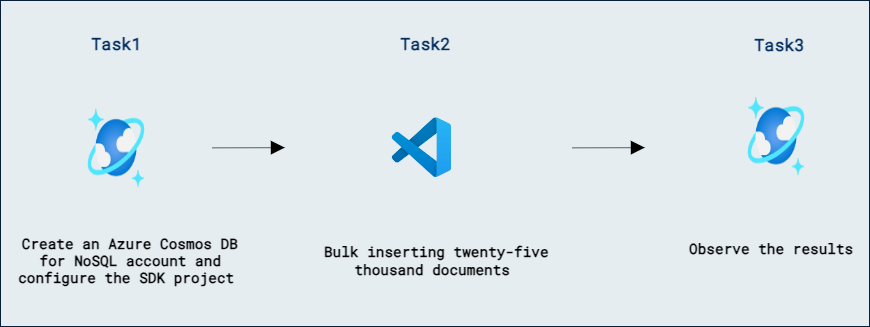

## 開発環境の準備

1. Visual Studio Code を起動します（プログラムアイコンはデスクトップにピン留めされています）。

   

3. 左側ペインの **拡張機能 (1)** アイコンを選択します。検索バーに **C# (2)** と入力し、表示された **拡張機能 (3)** を選択して、最後に **インストール (4)** をクリックします。

    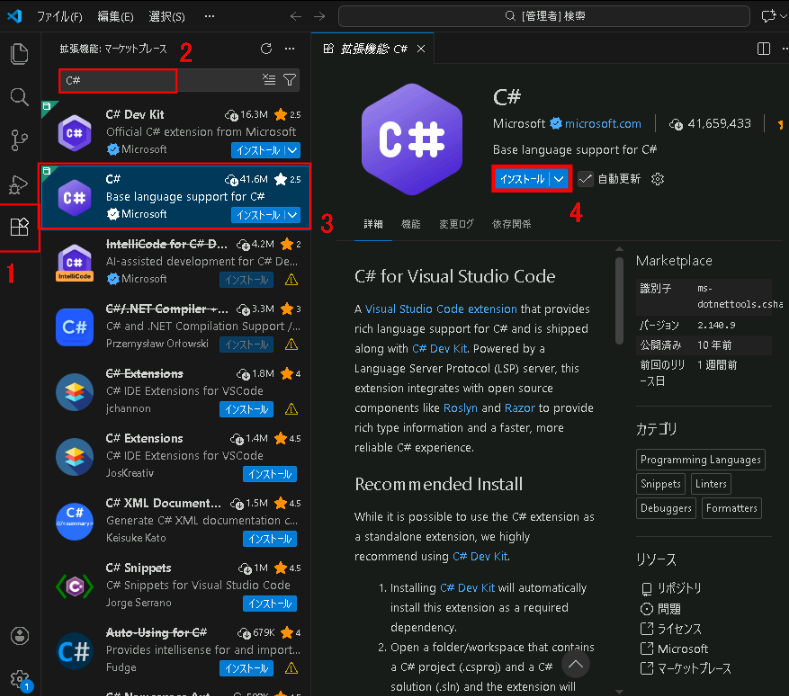

4. 画面左上の **ファイル** オプションを選択し、ペインのオプションから **フォルダーを開く** を選択して **C:\AllFiles** に移動します。

5. **dp-420-cosmos-db-dev-main** フォルダーを選択し、**フォルダーの選択** をクリックします。

   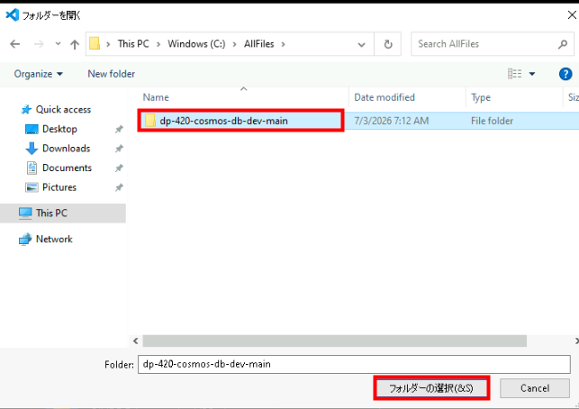

   >**注意:** **このフォルダー内のファイルの作成者を信頼しますか？** のポップアップでは、**はい、作成者を信頼します** を選択します。

    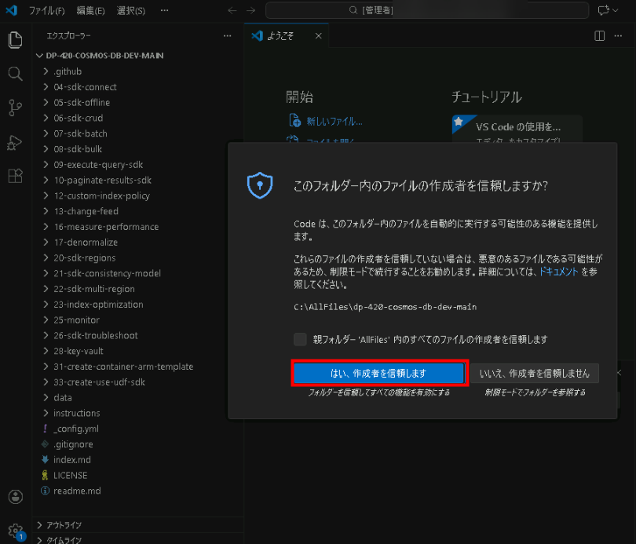

### タスク 1: Azure Cosmos DB for NoSQL アカウントを作成し、SDK プロジェクトを構成する

このタスクでは、Azure Cosmos DB for NoSQL アカウントを作成し、必要な設定を構成し、新しく作成したデータベースと対話する SDK プロジェクトを Visual Studio Code で準備します。

1. Azure ポータルページで、ポータル上部の **リソース、サービス、ドキュメントを検索 (G+/)** ボックスに **Azure Cosmos DB (1)** と入力し、サービスの下に表示される **Azure Cosmos DB (2)** を選択します。

   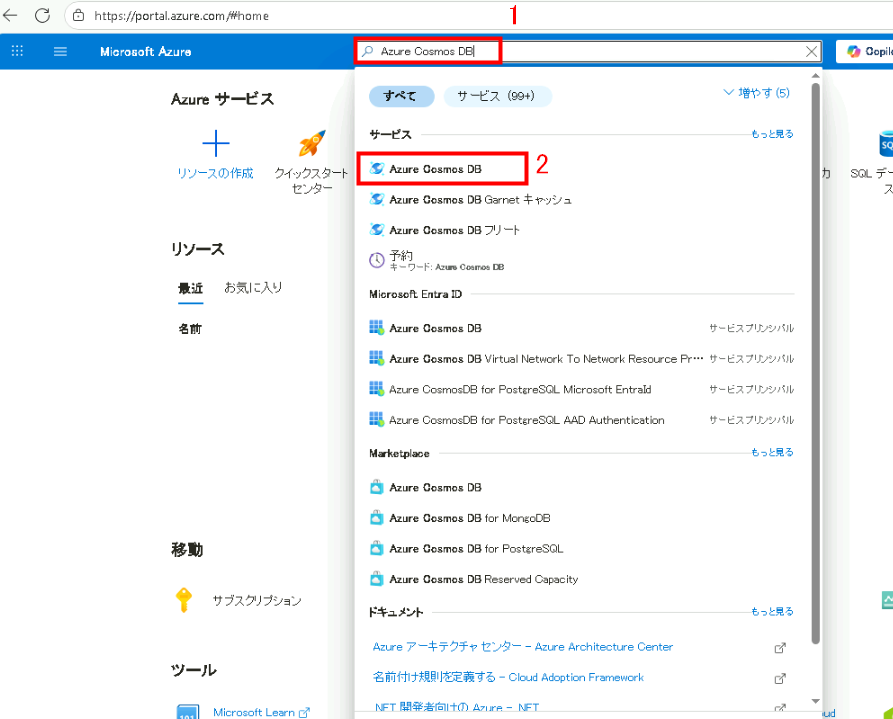
   
1. **Azure Cosmos DB for NoSQL** の下で **+ 作成 (1)** を選択し、**作成 (2)** をクリックして **Azure Cosmos DB for NoSQL** アカウントを作成します。

    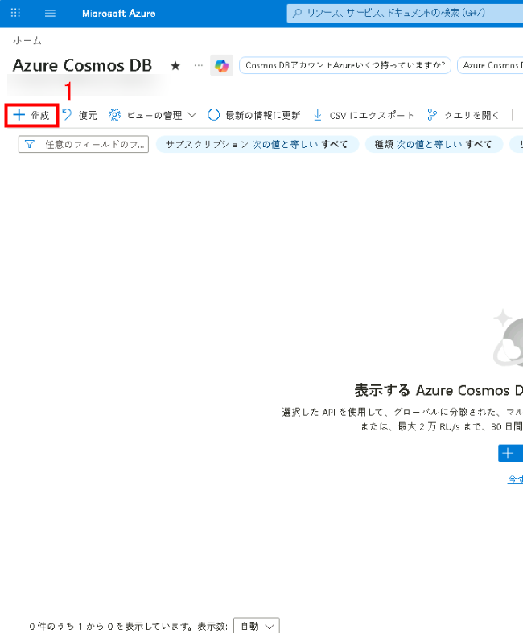

    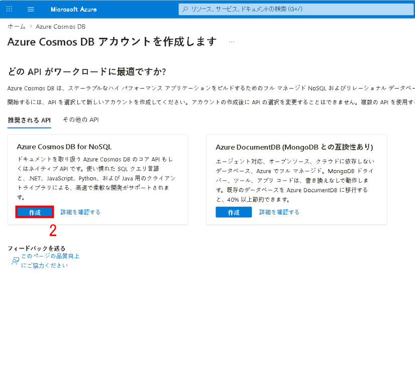

1. 次の設定を指定し、残りの設定はデフォルトのままにして、**確認および作成 (10)** を選択します。

    | **設定** | **値** |
    | :--- | :--- |
    | **Workload Type** | *Production* (1) |
    | **Subscription** | *Your existing Azure subscription* (2) |
    | **Resource group** | *Select an existing Cosmosdb-<inject key="DeploymentID" enableCopy="false"/>* (3) |
    | **Account Name** | *sql-<inject key="DeploymentID" enableCopy="false"/>* (4) |
    | **Location** | *Choose the default region* (5) |
    | **Capacity mode** | *Provisioned throughput* (6) |
    | **Apply Free Tier Discount** | *Do Not Apply* (7) |
    | **Limit the total amount of throughput that can be provisioned on this account** | *Unchecked* (8) |

     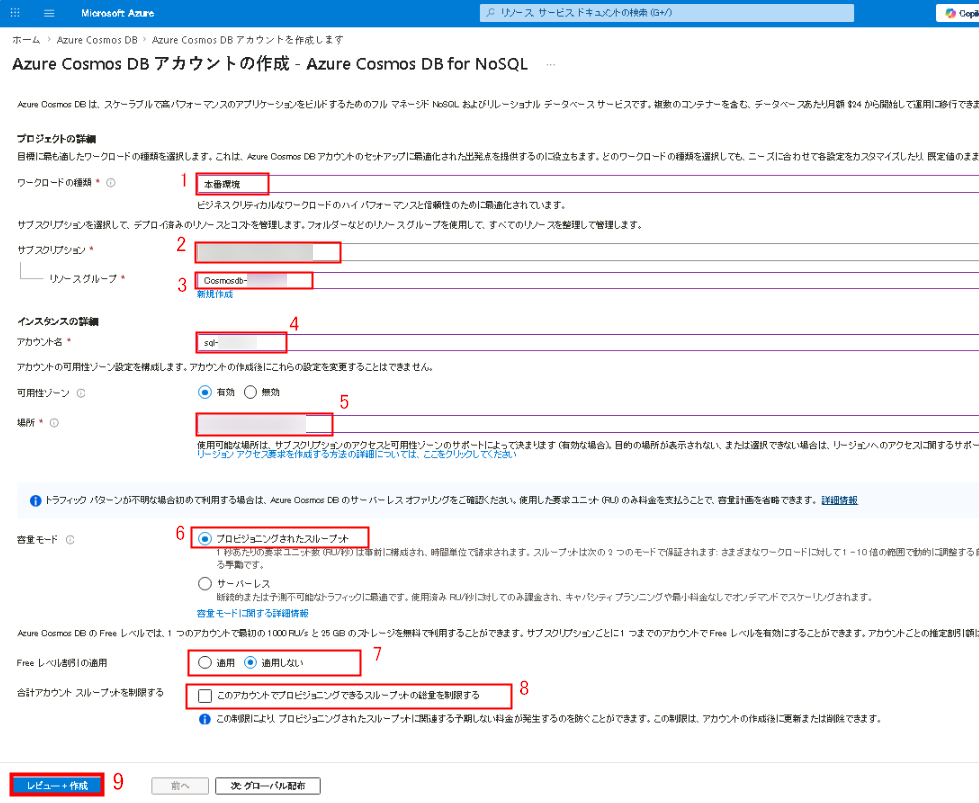

1. **作成** をクリックします。

    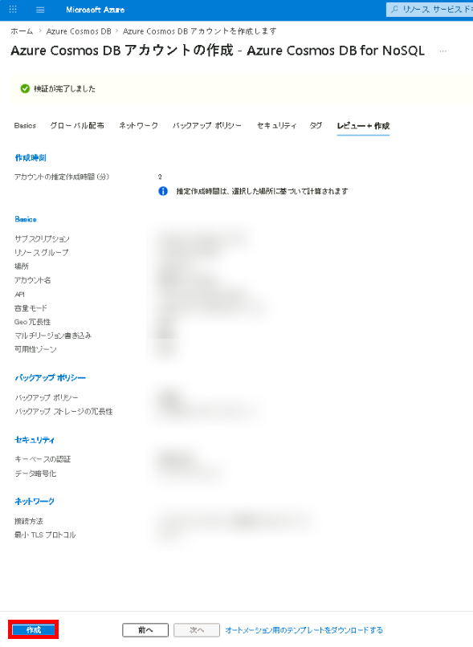

1. 展開タスクが完了するまで、このタスクを続行せずに待ちます。

1. 展開が完了したら、**リソースに移動** を選択します。

    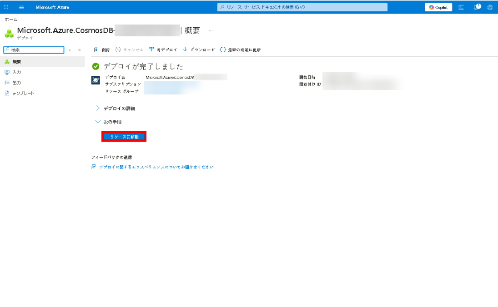

1. **Azure Cosmos DB アカウント** で左側のメニューから **設定 (1)** を展開し、**キー (2)** を選択します。

    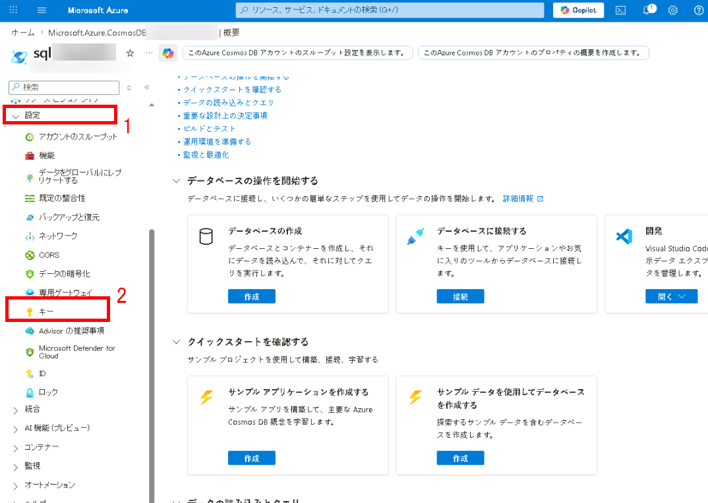

1. このペインには、SDK からアカウントに接続するための接続情報と資格情報が含まれています。具体的には:

   - **URI** フィールドをコピーします。この **endpoint** 値は後で使用します。

   - **PRIMARY KEY** フィールドをコピーします。この **key** 値は後で使用します。

       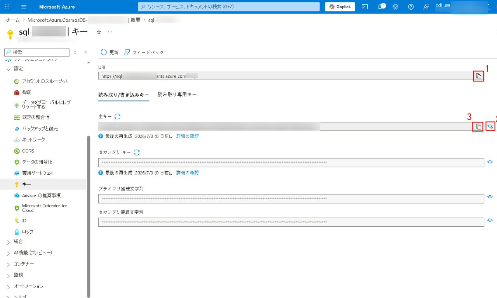

1. **Azure Cosmos DB** アカウントのリソース概要ページ (1) で、**Data Explorer (2)** ペインに移動します。

    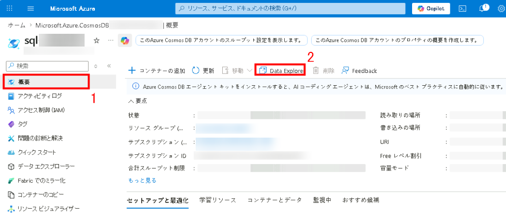

1. **Data Explorer (1)** ページで **新規 (2)** をクリックし、**新しいコンテナー (3)** を選択します。

     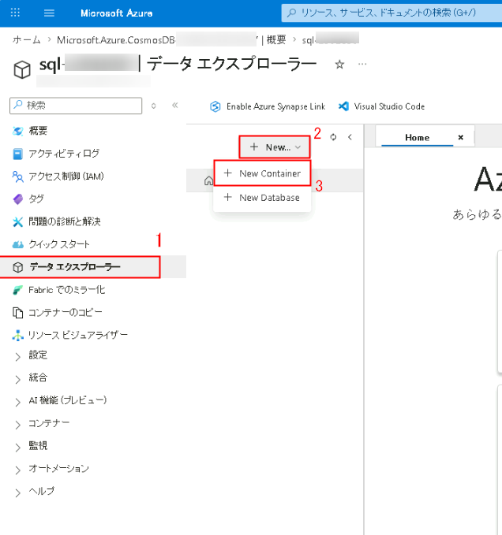

1. **新しいコンテナー** ペインで次の詳細を入力し、**OK (6)** をクリックします。

    | **設定** | **値** |
    | :--- | :--- |
    | **Database id** | Create new \| `cosmicworks` **(1)** |
    | **Share throughput across containers** | Unchecked **(2)** |
    | **Container id** | `products` **(3)** |
    | **Partition key** | `/categoryId` **(4)** |
    | **Container throughput** | Autoscale \| `4000` **(5)** |

    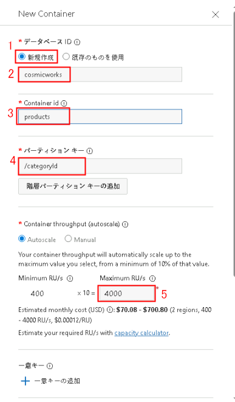
    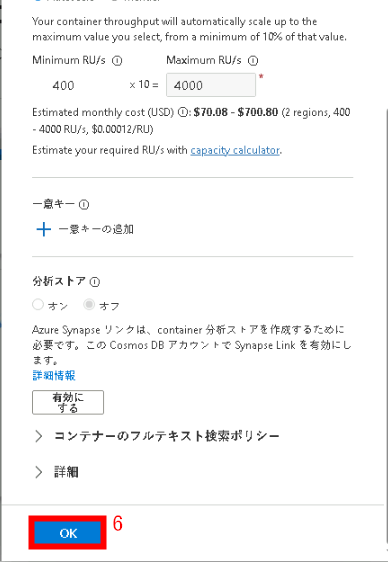

1. **Visual Studio Code** に戻ります。

1. **Visual Studio Code** の **エクスプローラー** ペインで、**08-sdk-bulk** フォルダーに移動します。

1. **Visual Studio Code** の **06-sdk-crud (1)** フォルダー内で空の **script.cs (2)** コードファイルを開きます。

    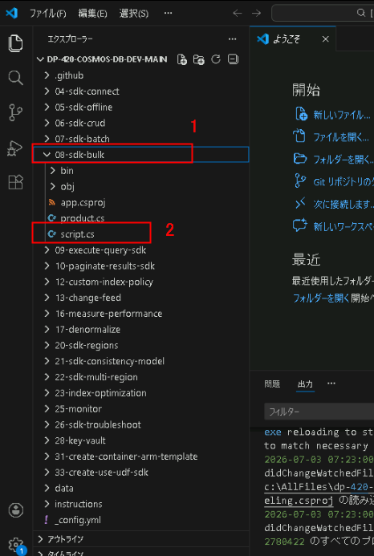

    >**注意**: **[Microsoft.Azure.Cosmos][nuget.org/packages/microsoft.azure.cosmos/3.22.1]** ライブラリは NuGet から既に事前にインポートされています。

1. **endpoint** という名前の **string** 変数を探します。前のラボで作成した Azure Cosmos DB アカウントの **endpoint** を値として設定します。
  
    ```
    string endpoint = "<cosmos-endpoint>";
    ```

    >**注意**: 例えば、endpoint が **https&shy;://dp420.documents.azure.com:443/** の場合、C# 文は **string endpoint = "https&shy;://dp420.documents.azure.com:443/";** になります。

1. **key** という名前の **string** 変数を探します。前のラボで作成した Azure Cosmos DB アカウントの **key** を値として設定します。

    ```
    string key = "<cosmos-key>";
    ```

    >**注意**: 例えば、key が **fDR2ci9QgkdkvERTQ==** の場合、C# 文は **string key = "fDR2ci9QgkdkvERTQ==";** になります。

1. **Ctrl+S** を押して、script.cs コードファイルを保存します。

1. **08-sdk-bulk (1)** フォルダーのコンテキストメニューを開き、**統合ターミナルで開く (2)** を選択して新しいターミナルを開きます。
 
    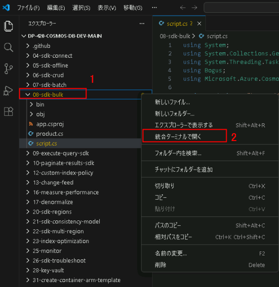

   >**注意**: このコマンドは、開始ディレクトリが **08-sdk-bulk** フォルダーに設定された状態でターミナルを開きます。

1. 次のコマンドを使用して、NuGet から [Microsoft.Azure.Cosmos][nuget.org/packages/microsoft.azure.cosmos/3.22.1] パッケージを追加します。

    ```
    dotnet add package Microsoft.Azure.Cosmos --version 3.22.1
    ```

1. [dotnet build][docs.microsoft.com/dotnet/core/tools/dotnet-build] コマンドを使用してプロジェクトをビルドします。

    ```
    dotnet build
    ```

1. 統合ターミナルを閉じます。

    > **タスクの完了おめでとうございます！** ここで検証を行います。手順は次のとおりです:
    > - 対応するタスクの検証ボタンを押します。成功メッセージが表示された場合は、次のタスクに進めます。
    > - そうでない場合は、エラーメッセージをよく読み、ラボガイドの指示に従って手順を再試行します。
    > - サポートが必要な場合は、cloudlabs-support@spektrasystems.com までご連絡ください。24時間年中無休で対応しています。

    <validation step="8b577a01-0d31-4606-8273-71efbf77241f" />

### タスク 2: 25,000 件のドキュメントを一括挿入する

このタスクでは、大量のドキュメントを挿入して動作を確認します。内部テストでは、ラボの仮想マシンと Azure Cosmos DB NoSQL API アカウントが地理的に比較的近い場合、約 1～2 分かかることがあります。

1. **script.cs** コードファイルのエディタータブに戻ります。

1. [CosmosClientOptions][docs.microsoft.com/dotnet/api/microsoft.azure.cosmos.cosmosclientoptions] の新しいインスタンスを **options** という名前で作成し、**AllowBulkExecution** プロパティを **true** に設定します。

    ```
    CosmosClientOptions options = new () 
    { 
        AllowBulkExecution = true 
    };
    ```

1. **endpoint**、**key**、および **options** 変数をコンストラクター引数として渡し、**CosmosClient** クラスの新しいインスタンスを **client** という名前で作成します。

    ```
    CosmosClient client = new (endpoint, key, options); 
    ```

1. **client** 変数の [GetContainer][docs.microsoft.com/dotnet/api/microsoft.azure.cosmos.cosmosclient.getcontainer] メソッドを使用して、データベース名 (*cosmicworks*) とコンテナー名 (*products*) を指定して既存のコンテナーを取得します。

    ```
    Container container = client.GetContainer("cosmicworks", "products");
    ```

1. 次のサンプルコードを使用して、NuGet からインポートした Bogus ライブラリの **Faker** クラスを使って **25,000** 件の架空の製品を生成します。

    ```
    List<Product> productsToInsert = new Faker<Product>()
        .StrictMode(true)
        .RuleFor(o => o.id, f => Guid.NewGuid().ToString())
        .RuleFor(o => o.name, f => f.Commerce.ProductName())
        .RuleFor(o => o.price, f => Convert.ToDouble(f.Commerce.Price(max: 1000, min: 10, decimals: 2)))
        .RuleFor(o => o.categoryId, f => f.Commerce.Department(1))
        .Generate(25000);
    ```

    >**注意**: [Bogus][nuget.org/packages/bogus/33.1.1] ライブラリは、ユーザーインターフェイスアプリケーションのテスト用に架空のデータを作成するためのオープンソースライブラリであり、バルクのインポート/エクスポート アプリケーションの学習に最適です。

1. **Task** 型のジェネリック **List<>** を **concurrentTasks** という名前で作成します。

    ```
    List<Task> concurrentTasks = new List<Task>();
    ```

1. このアプリケーションで前に生成した製品の一覧を反復処理する for-each ループを作成します。

    ```
    foreach(Product product in productsToInsert)
    {
    }
    ```

1. for-each ループ内で、パーティションキーを明示的に指定して Azure Cosmos DB NoSQL API に製品を非同期で挿入する **Task** を作成し、そのタスクを **concurrentTasks** というタスクリストに追加します。

    ```
    concurrentTasks.Add(
        container.CreateItemAsync(product, new PartitionKey(product.categoryId))
    );   
    ```

1. foreach ループの後で、**concurrentTasks** 変数に対して **Task.WhenAll** の結果を非同期に待機します。

    ```
    await Task.WhenAll(concurrentTasks);
    ```

1. 組み込みの **Console.WriteLine** 静的メソッドを使用して、コンソールに **Bulk tasks complete** という静的メッセージを出力します。

    ```
    Console.WriteLine("Bulk tasks complete");
    ```

1. 作業が完了したら、コードファイルは次の内容を含んでいるはずです。
  
    ```
    using System;
    using System.Collections.Generic;
    using System.Threading.Tasks;
    using Bogus;
    using Microsoft.Azure.Cosmos;
    
    string endpoint = "<cosmos-endpoint>";
    string key = "<cosmos-key>";
    
    CosmosClientOptions options = new () 
    { 
        AllowBulkExecution = true 
    };
    
    CosmosClient client = new (endpoint, key, options);  
    
    Container container = client.GetContainer("cosmicworks", "products");
    
    List<Product> productsToInsert = new Faker<Product>()
        .StrictMode(true)
        .RuleFor(o => o.id, f => Guid.NewGuid().ToString())
        .RuleFor(o => o.name, f => f.Commerce.ProductName())
        .RuleFor(o => o.price, f => Convert.ToDouble(f.Commerce.Price(max: 1000, min: 10, decimals: 2)))
        .RuleFor(o => o.categoryId, f => f.Commerce.Department(1))
        .Generate(25000);
        
    List<Task> concurrentTasks = new List<Task>();
    
    foreach(Product product in productsToInsert)
    {    
        concurrentTasks.Add(
            container.CreateItemAsync(product, new PartitionKey(product.categoryId))
        );
    }
    
    await Task.WhenAll(concurrentTasks);   

    Console.WriteLine("Bulk tasks complete");
    ```

1. **Ctrl+S** を押して、script.cs コードファイルを保存します。

1. **08-sdk-bulk (1)** フォルダーのコンテキストメニューを開き、**統合ターミナルで開く (2)** を選択して新しいターミナルを開きます。
 
    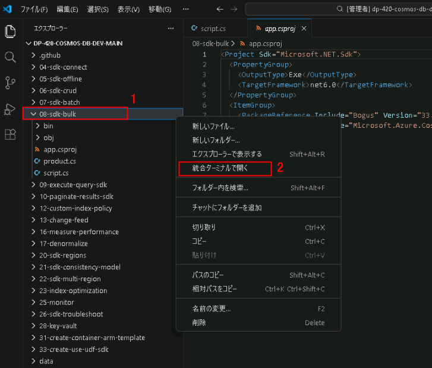

1. **[dotnet run][docs.microsoft.com/dotnet/core/tools/dotnet-run]** コマンドを使用してプロジェクトをビルドして実行します。

    ```
    dotnet run
    ```

1. アプリケーションはサイレントに実行されるはずです。実行が完了するまでに約 1～2 分かかる場合があります。

    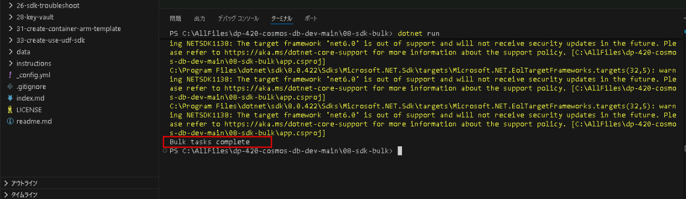

1. 統合ターミナルを閉じます。

1. **Visual Studio Code** を閉じます。

    > **タスクの完了おめでとうございます！** ここで検証を行います。手順は次のとおりです:
    > - 対応するタスクの検証ボタンを押します。成功メッセージが表示された場合は、次のタスクに進めます。
    > - そうでない場合は、エラーメッセージをよく読み、ラボガイドの指示に従って手順を再試行します。
    > - サポートが必要な場合は、cloudlabs-support@spektrasystems.com までご連絡ください。24 時間 365 日対応しています。

    <validation step="5bf085fc-efec-4bde-9f59-38074db269a2" />

### タスク 3: 結果を確認する

25,000 件のアイテムを Azure Cosmos DB に送信したので、Data Explorer を確認します。

1. ブラウザーウィンドウで Azure ポータル (``portal.azure.com``) に戻り、このラボで作成した **Azure Cosmos DB アカウント** リソースを選択します。

1. **Azure Cosmos DB** アカウントのリソース概要ページ (1) で、**Data Explorer (2)** ペインに移動します。

    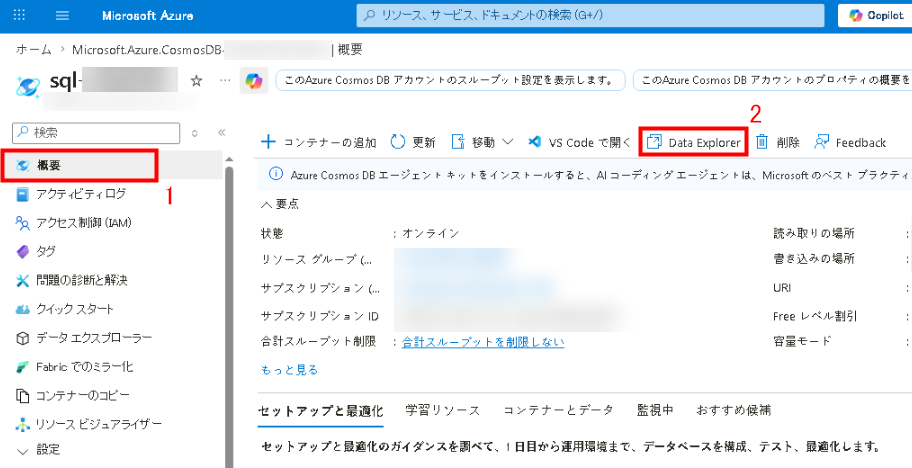

1. **Data Explorer** で **cosmicworks (2)** データベースノードを展開し、**products (3)** コンテナノードを展開します。

    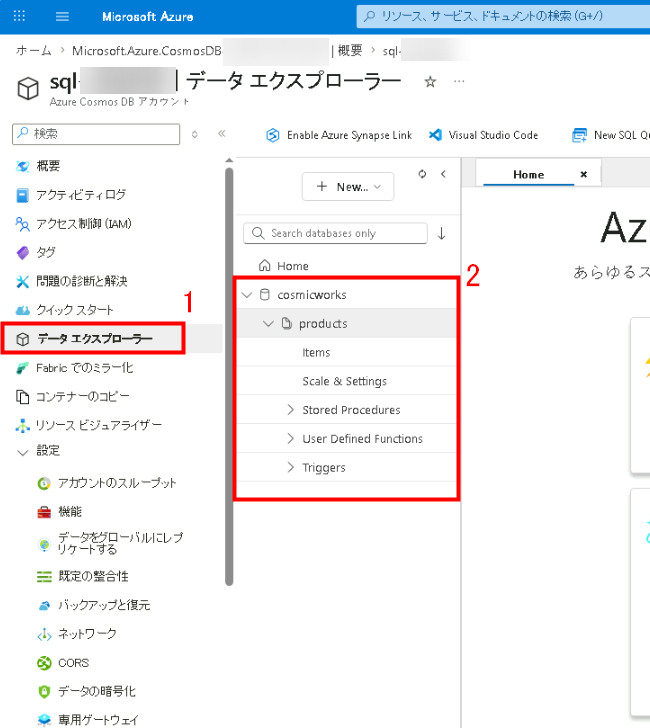

1. **NoSQL API** ナビゲーションツリー内の **products** コンテナノードを選択し、**... (1)** をクリックして **新しい SQL クエリ (2)** を選択します。

   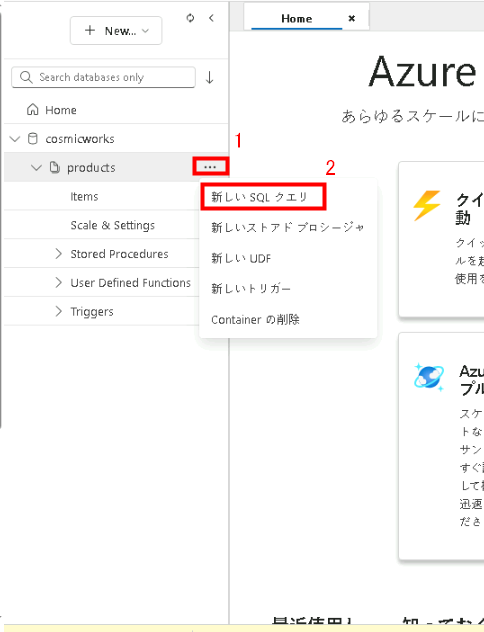

1. エディター領域の内容を削除します。

1. 以下に示すクエリを入力し、**クエリの実行 (2)** をクリックします。

    ```
    SELECT COUNT(1) FROM items
    ```

     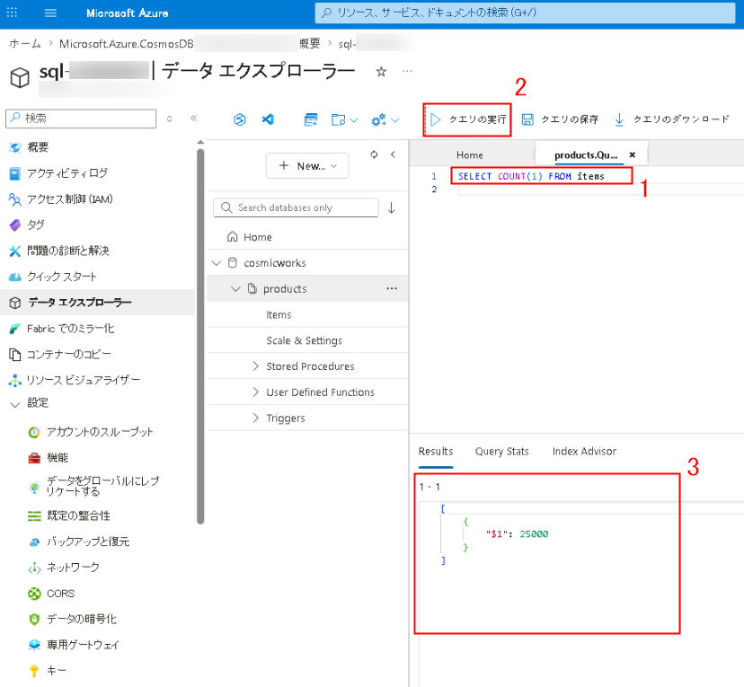

1. **結果 (3)** を確認し、コンテナー内のアイテム数を確認します。

### レビュー

このラボでは、次の作業を完了しました:

- Azure Cosmos DB for NoSQL アカウントを作成し、SDK プロジェクトを構成しました
- 25,000 件のドキュメントを一括挿入しました
- 結果を確認しました

### まとめ
このラボでは、Azure Cosmos DB SDK と Bogus ライブラリを使用して Azure Cosmos DB for NoSQL アカウントに 25,000 件の架空のドキュメントを一括挿入する方法を学び、必要な環境を構成して結果を確認しました。

### ラボを正常に完了しました
