# Move multiple documents in bulk with the Azure Cosmos DB for NoSQL SDK

## Lab scenario

The easiest way to learn how to perform a bulk operation is to attempt to push many documents to an Azure Cosmos DB for NoSQL account in the cloud. Using the bulk features of the SDK, this can be done with some minor help from the [`System.Threading.Tasks`](https://docs.microsoft.com/dotnet/api/system.threading.tasks) namespace.

In this lab, you'll use the **[`Bogus`](https://www.nuget.org/packages/bogus/33.1.1)** library from NuGet to generate fictional data and place that into an Azure Cosmos DB account.

## Lab objectives

In this lab, you will complete the following tasks:
- Task 1: Create an Azure Cosmos DB for NoSQL account and configure the SDK project.
- Task 2: Bulk inserting twenty-five thousand documents.
- Task 3: Observe the results.

## Estimated Timing: 30 Minutes

## Architecture Diagram


## Prepare your development environment

1. Start Visual Studio Code (the program icon is pinned to the Desktop).

   

1. Click on the **Extensions** view icon on the left sidebar **(1)**, type `C#` in the search bar **(2)**, select the **C# extension by Microsoft** **(3)**, and click **Install (4)** to add language support for C# in Visual Studio Code.

    

1. Click **File (1)** on the top left of Visual Studio Code, then choose **Open Folder... (2)**.

    

1.  Navigate to **C:\AllFiles**, select **dp-420-cosmos-db-dev-main**, and click on **Select Folder**.

    

1. When **Do you trust the author of the files in this folder**, click on **Yes, I trust the authors**.

   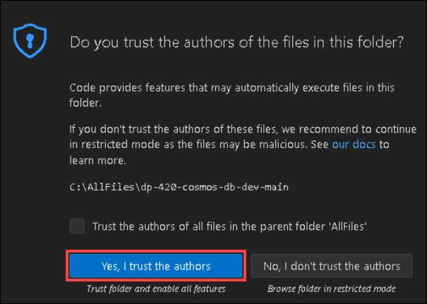
   
### Task 1: Create an Azure Cosmos DB for NoSQL account and configure the SDK project

In this task, you will create an Azure Cosmos DB for NoSQL account, configure it with essential settings, and prepare the SDK project in Visual Studio Code to interact with your newly established database.

1. Navigate back to the Azure Portal page, in the **Search resources, services and docs (G+/)** box at the top of the portal, enter **Azure Cosmos DB (1)**, and then select **Azure Cosmos DB (2)** under services.

   
   
1. Select **+ Create** under **Azure Cosmos DB for NoSQL** click on **Create** to create **Azure Cosmos DB for NoSQL** account.

    

    
   
1.  Specify the following settings, leaving all remaining settings to their default values, and select **Next: Global Distribution (9)**:
  
    | **Setting**         | **Value** |
    | --------------------|--------------------------------------------------- |
    | **Workload Type**   | *Production* (1) |
    | **Subscription**    | *Your existing Azure subscription* (2) |
    | **Resource group**  | *Select an existing Cosmosdb-<inject key="DeploymentID" enableCopy="false"/>* (3) |
    | **Account Name**    | *sql-<inject key="DeploymentID" enableCopy="false"/>* (4) |
    | **Location**        | *Choose the default region* (6) |
    | **Capacity mode**   | *Provisioned throughput* (7) |
    | **Apply Free Tier Discount** | *Do Not Apply* (8) |
    | **Limit the total amount of throughput that can be provisioned on this account** | *Unchecked* |

     

     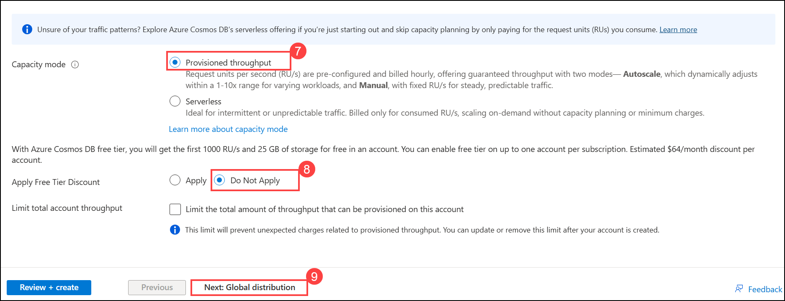

1. Click on **Next: Networking** on the Global Distribution page. Select **All networks (1)** for the **Connectivity method** and click on **Review + Create (2)**. 

   
   
1. Once validation passed, click on **Create**.

   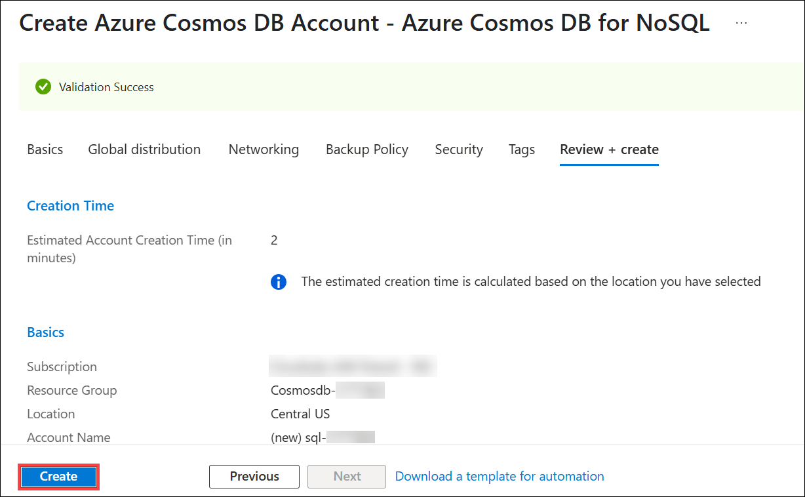
      
1. Wait for the deployment task to complete before continuing with this task.

1.  Select **Go to resources**. On the newly created **Azure Cosmos DB** account under **Settings (1)**, navigate to the **Keys (2)** pane.

    

    

1. This pane contains the connection details and credentials necessary to connect to the account from the SDK. Specifically:

   - Copy the **URI** field. You will use this **endpoint (1)** value later in this exercise.

   - Copy the **PRIMARY KEY** field. You will use this **key (2)** value later in this exercise.

     

1. On the **Azure Cosmos DB** account resource, click on **Overview** from the left navigation pane  and click on  the **Data Explorer** option from the top navigation pane.

    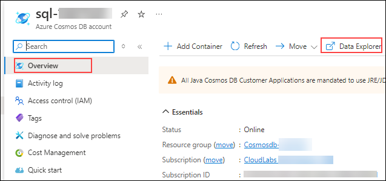

1. In the **Data Explorer** pane, select **+ New Container (1)** > **+ New Container (2)**.

    

1. In the **New Container** popup, enter the following values for each setting and leaving all remaining settings to their default values.

    | **Setting** | **Value** |
    | :--- | :--- |
    | **Database id** | **Create new (1)** &vert; **cosmicworks (2)** |
    | **Share throughput across containers** | **Unchecked (3)** |
    | **Container id** | **products (4)** |
    | **Partition key** | **/categoryId` (5)** |
    | **Container throughput** | **Autoscale (6)** &vert; **`4000` (7)** |
       
     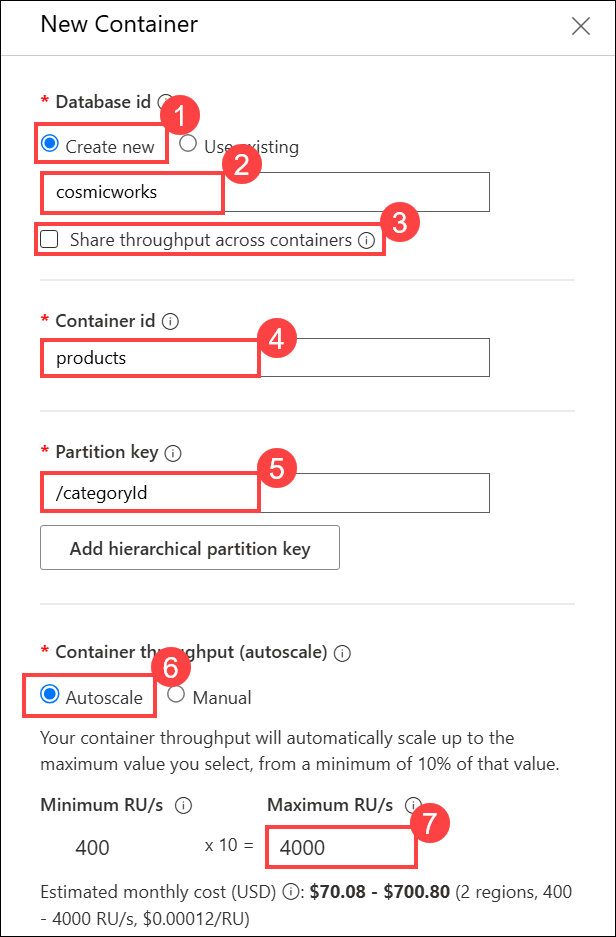

1. Scroll down and click on **OK**.

   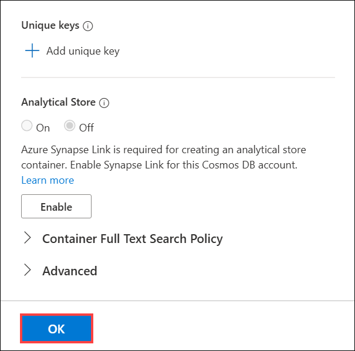
   
1. Return to **Visual Studio Code**.. 

1. In **Visual Studio Code**, in the **Explorer** pane, browse to the **08-sdk-bulk (1)** folder.

1. Open the **script.cs (2)** code file within the **08-sdk-bulk** folder.

   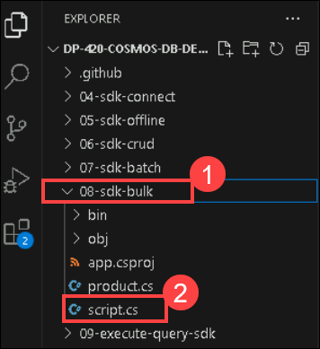

   > **Note**: The **[`Microsoft.Azure.Cosmos`](https://www.nuget.org/packages/microsoft.azure.cosmos/3.22.1)** library has already been pre-imported from NuGet.

1. Locate the **string** variable named **endpoint**. Set its value to the **endpoint** of the Azure Cosmos DB account you created in the previous lab.
  
    ```
    string endpoint = "<cosmos-endpoint>";
    ```

    >**Note**: For example, if your endpoint is: **https&shy;://dp420.documents.azure.com:443/**, then the C# statement would be: **string endpoint = "https&shy;://dp420.documents.azure.com:443/";**.

1. Locate the **string** variable named **key**. Set its value to the **key** of the Azure Cosmos DB account you created in the previous lab.

    ```
    string key = "<cosmos-key>";
    ```

    >**Note**: For example, if your key is: **fDR2ci9QgkdkvERTQ==**, then the C# statement would be: **string key = "fDR2ci9QgkdkvERTQ==";**.

1. Press **Ctrl+S** to **Save** the script.cs code file.

1. Open the context menu for the **08-sdk-bulk** folder and then select **Open in Integrated Terminal** to open a new terminal instance.
 
    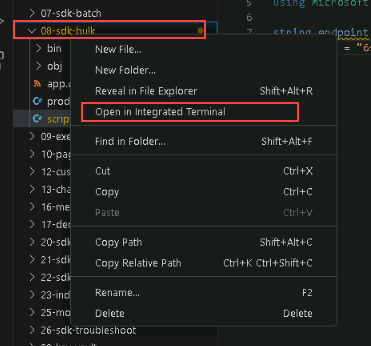

   >**Note**: This command will open the terminal with the starting directory already set to the **08-sdk-bulk** folder.

1. Add the [`Microsoft.Azure.Cosmos`](https://www.nuget.org/packages/microsoft.azure.cosmos/3.22.1) package from NuGet using the following command:

    ```
    dotnet add package Microsoft.Azure.Cosmos --version 3.22.1
    ```

1. Build the project using the [`dotnet build`](https://docs.microsoft.com/dotnet/core/tools/dotnet-build) command:

    ```
    dotnet build
    ```

1. Close the integrated terminal.

    > **Congratulations** on completing the task! Now, it's time to validate it. Here are the steps:
    > - Hit the Validate button for the corresponding task. If you receive a success message, you can proceed to the next task. 
    > - If not, carefully read the error message and retry the step, following the instructions in the lab guide.
    > - If you need any assistance, please contact us at cloudlabs-support@spektrasystems.com. We are available 24/7 to help you out.

    <validation step="8b577a01-0d31-4606-8273-71efbf77241f" />

### Task 2: Bulk inserting twenty-five thousand documents

In this task, we will try to insert a lot of documents to see how this works. In our internal testing, this can take approximately 1-2 minutes if the lab virtual machine and Azure Cosmos DB NoSQL API account are relatively close to each other geographically speaking.

1. Return to the editor tab for the **script.cs** code file.

1. Create a new instance of the [`CosmosClientOptions`](https://docs.microsoft.com/dotnet/api/microsoft.azure.cosmos.cosmosclientoptions) named `options` with the `AllowBulkExecution` property set to `true`:

    ```
    CosmosClientOptions options = new () 
    { 
        AllowBulkExecution = true 
    };
    ```

1. Create a new instance of the **CosmosClient** class named **client** passing in the **endpoint**, **key**, and **options** variables as constructor parameters:

    ```
    CosmosClient client = new (endpoint, key, options); 
    ```

1. Use the [`GetContainer`](https://docs.microsoft.com/dotnet/api/microsoft.azure.cosmos.cosmosclient.getcontainer) method of the **client** variable to retrieve the existing container using the name of the database (*cosmicworks*) and the name of the container (*products*):

    ```
    Container container = client.GetContainer("cosmicworks", "products");
    ```

1. Use this special sample code to generate **25,000** fictitious products using the **Faker** class from the Bogus library imported from NuGet.

    ```
    List<Product> productsToInsert = new Faker<Product>()
        .StrictMode(true)
        .RuleFor(o => o.id, f => Guid.NewGuid().ToString())
        .RuleFor(o => o.name, f => f.Commerce.ProductName())
        .RuleFor(o => o.price, f => Convert.ToDouble(f.Commerce.Price(max: 1000, min: 10, decimals: 2)))
        .RuleFor(o => o.categoryId, f => f.Commerce.Department(1))
        .Generate(25000);
    ```

    >**Note**: The [Bogus](https://www.nuget.org/packages/bogus/33.1.1) library is an open-source library used to design fictitious data to test user interface applications and is great for learning how to develop bulk import/export applications.

1. Create a new generic **List<>** of type **Task** named **concurrentTasks**:

    ```
    List<Task> concurrentTasks = new List<Task>();
    ```

1. Create a for-each loop that will iterate over the list of products that was generated earlier in this application:

    ```
    foreach(Product product in productsToInsert)
    {
    }
    ```

1. Within the for-each loop, create a **Task** to asynchronously insert a product into Azure Cosmos DB NoSQL API being sure to explicitly specify the partition key and to add the task to a list of tasks named **concurrentTasks**:

    ```
    concurrentTasks.Add(
        container.CreateItemAsync(product, new PartitionKey(product.categoryId))
    );   
    ```

1. After the foreach loop, asynchronously await the result of **Task.WhenAll** on the **concurrentTasks** variable:

    ```
    await Task.WhenAll(concurrentTasks);
    ```

1. Use the built-in **Console.WriteLine** static method to print a static message of **Bulk tasks complete** to the console:

    ```
    Console.WriteLine("Bulk tasks complete");
    ```

1. Once you are done, your code file should now include:
  
    ```
    using System;
    using System.Collections.Generic;
    using System.Threading.Tasks;
    using Bogus;
    using Microsoft.Azure.Cosmos;
    
    string endpoint = "<cosmos-endpoint>";
    string key = "<cosmos-key>";
    
    CosmosClientOptions options = new () 
    { 
        AllowBulkExecution = true 
    };
    
    CosmosClient client = new (endpoint, key, options);  
    
    Container container = client.GetContainer("cosmicworks", "products");
    
    List<Product> productsToInsert = new Faker<Product>()
        .StrictMode(true)
        .RuleFor(o => o.id, f => Guid.NewGuid().ToString())
        .RuleFor(o => o.name, f => f.Commerce.ProductName())
        .RuleFor(o => o.price, f => Convert.ToDouble(f.Commerce.Price(max: 1000, min: 10, decimals: 2)))
        .RuleFor(o => o.categoryId, f => f.Commerce.Department(1))
        .Generate(25000);
        
    List<Task> concurrentTasks = new List<Task>();
    
    foreach(Product product in productsToInsert)
    {    
        concurrentTasks.Add(
            container.CreateItemAsync(product, new PartitionKey(product.categoryId))
        );
    }
    
    await Task.WhenAll(concurrentTasks);   

    Console.WriteLine("Bulk tasks complete");
    ```

1. Press **Ctrl+S** to **Save** the script.cs code file.

1. In **Visual Studio Code**, open the context menu for the **08-sdk-bulk** folder and then select **Open in Integrated Terminal** to open a new terminal instance.

   

1. Build and run the project using the **[dotnet run](https://docs.microsoft.com/dotnet/core/tools/dotnet-run)** command:

    ```
    dotnet run
    ```

1. The application should run silently, it should take approximately one to two minutes to run before completing silently.

1. Close the integrated terminal.

1. Close **Visual Studio Code**.

    > **Congratulations** on completing the task! Now, it's time to validate it. Here are the steps:
    > - Hit the Validate button for the corresponding task. If you receive a success message, you can proceed to the next task. 
    > - If not, carefully read the error message and retry the step, following the instructions in the lab guide.
    > - If you need any assistance, please contact us at cloudlabs-support@spektrasystems.com. We are available 24/7 to help you out.

    <validation step="5bf085fc-efec-4bde-9f59-38074db269a2" />

### Task 3: Observe the results

Now that you have sent 25,000 items to Azure Cosmos DB let’s go and look at the Data Explorer.

1. Navigate to the **Azure portal**.

1. On the Azure Portal page, in the **Search resources, services and docs (G+/)** box at the top of the portal, enter **Azure Cosmos DB (1)**, and then select **Azure Cosmos DB (2)** under 
   services.

   

1. Select **sql-<inject key="DeploymentID" enableCopy="false"/>**.

     

1. Within the **Azure Cosmos DB** account resource, navigate to the **Data Explorer (1)** pane.

1. In the **Data Explorer**, expand the **cosmicworks (2)** database node, then observe the **products (3)** container node within the **NoSQL API** navigation tree.

   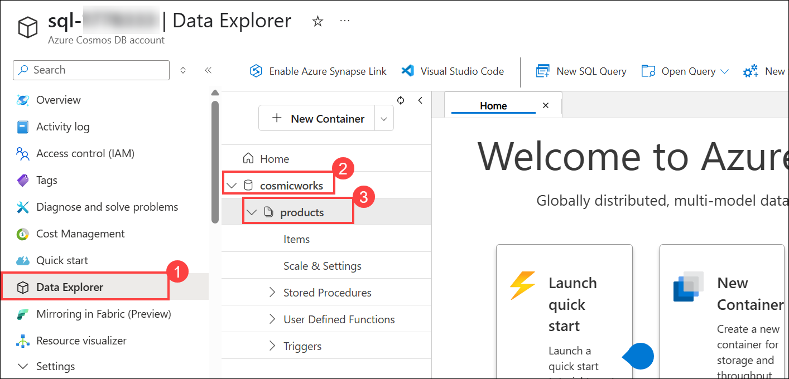


1. Expand the **products** node, and then select the **Items** node. Observe the list of items within your container.

   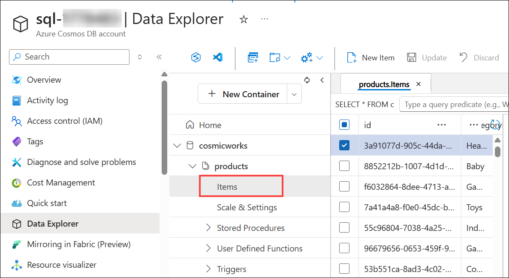

1. Select the **products** container node within the **NoSQL API** navigation tree, and click on **...** then select **New SQL Query**.

   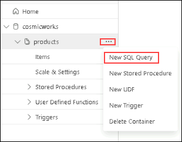

1. Delete the contents of the editor area.

1. Create a new SQL query that will return a count of all documents created using the bulk operation:

    ```
    SELECT COUNT(1) FROM items
    ```

1. Select **Execute Query (2)**.

1. Observe the count of the items in your container.

   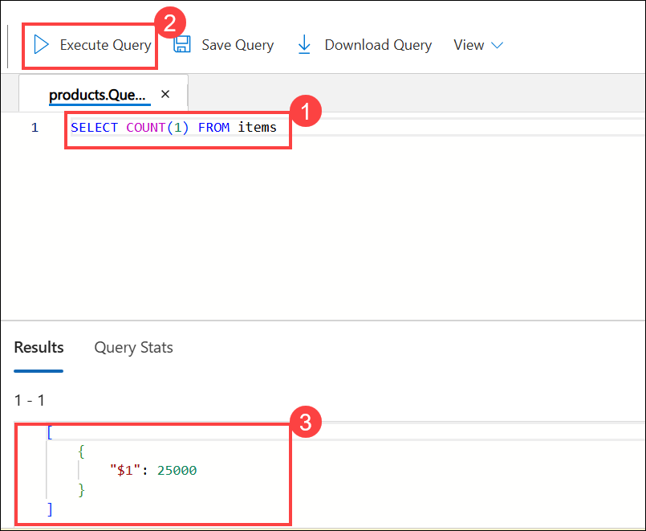

1. Close your web browser window or tab.

### Review

In this lab, you have completed:

- Create an Azure Cosmos DB for NoSQL account and configure the SDK project
- Bulk inserted twenty-five thousand documents.
- Observed the results.

### Summary
In this lab, you have learnt to bulk insert 25,000 fictional documents into an Azure Cosmos DB for NoSQL account using the Azure Cosmos DB SDK and the Bogus library, while also configuring the necessary environment and observing the results

### You have successfully completed the lab
