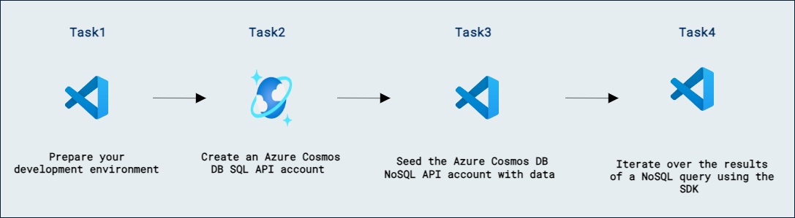
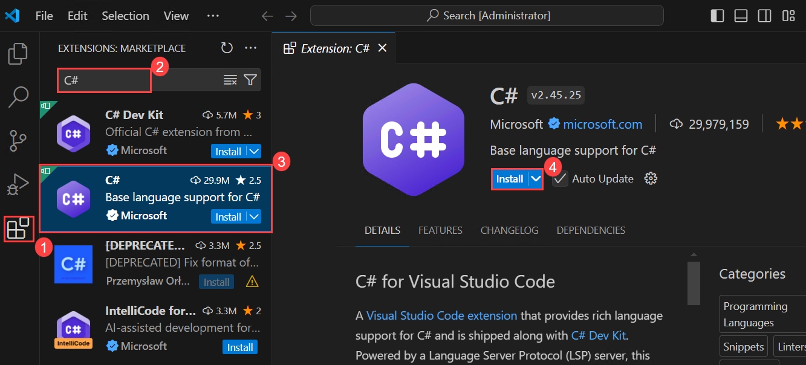
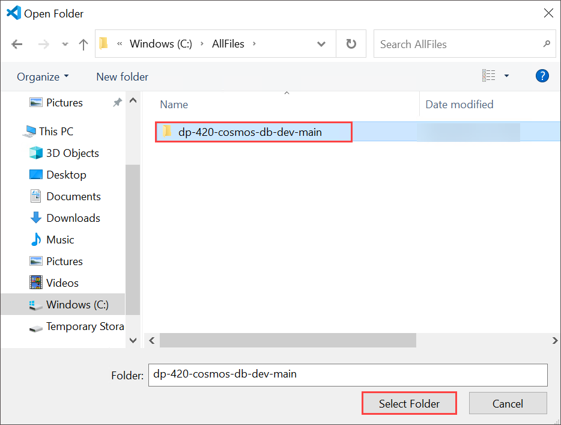
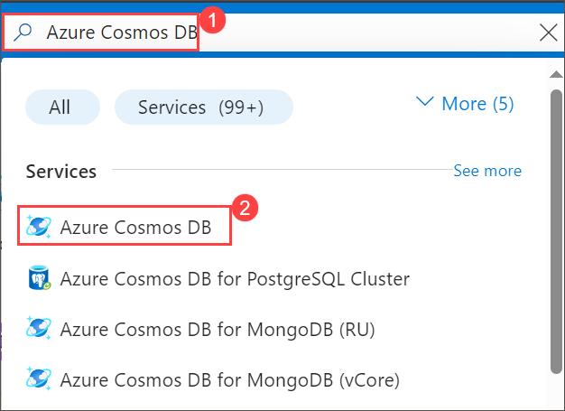
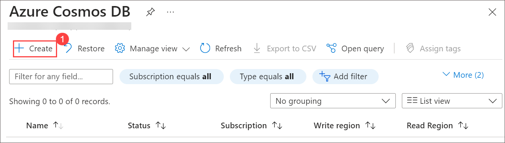
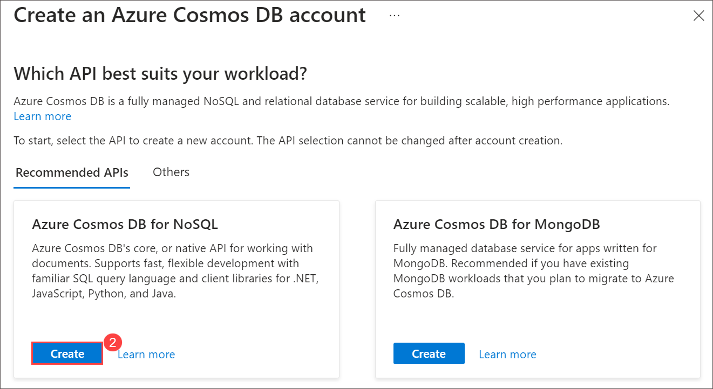
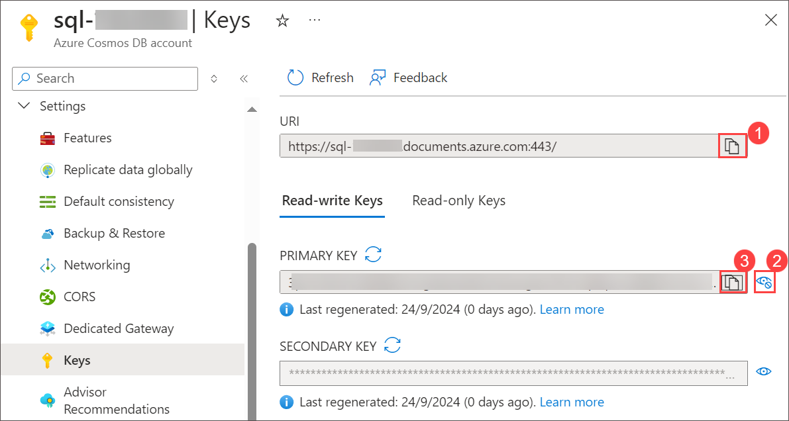
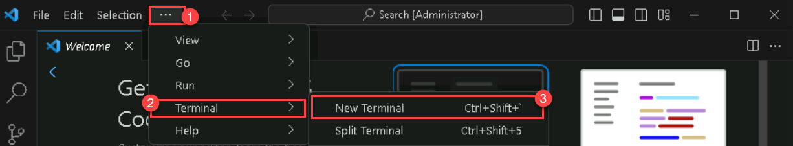

# Execute a query with the Azure Cosmos DB for NoSQL SDK

## Lab scenario

The latest version of the .NET SDK for Azure Cosmos DB for NoSQL makes it easier than ever to query a container and asynchronously iterate over result sets using the latest best practices and language features from C#.

This library has special functionality to make it easier to query Azure Cosmos DB using [https://learn.microsoft.com/en-us/dotnet/api/microsoft.azure.cosmos.feediterator?view=azure-dotnet].

In this lab, you'll use an asynchronous stream to iterate over a large result set returned from Azure Cosmos DB for NoSQL. You will use the .NET SDK to query and iterate over results.

## Lab objectives

In this lab, you will complete the following tasks:
- Task 1: Prepare your development environment.
- Task 2: Create an Azure Cosmos DB NoSQL API account.
- Task 3: Seed the Azure Cosmos DB NoSQL API account with data.
- Task 4: Iterate over the results of a SQL query using the SDK.

## Estimated Timing: 30 minutes

## Architecture Diagram



### Task 1: Prepare your development environment

1. Start Visual Studio Code (the program icon is pinned to the Desktop).

   

2. Select the **Extensions** blade from the left panel. Search with **C#** and select **Install** to install the extension.

    

3. Select the **file** option on the top left of the screen, from the pane options, select **Open Folder**. 

4. Navigate to **C:\AllFiles\dp-420-cosmos-db-dev** select **dp-420-cosmos-db-dev** and click on **Select Folder**.

    

5. If when **Do you trust the author of the files in this folder** click on **Yes, I trust the authors**.

### Task 2: Create an Azure Cosmos DB NoSQL API account

Azure Cosmos DB is a cloud-based NoSQL database service that supports multiple APIs. When provisioning an Azure Cosmos DB account for the first time, you will select which of the APIs you want the account to support (for example, **Mongo API** or **SQL API**). Once the Azure Cosmos DB SQL API account is done provisioning, you can retrieve the endpoint and key and use them to connect to the Azure Cosmos DB SQL API account using the Azure SDK for .NET or any other SDK of your choice.

1. Navigate back to  Azure Portal page, in Search resources, services and docs (G+/) box at the top of the portal, enter **Azure Cosmos DB**, and then select **Azure Cosmos DB** under services.

   
   
1. Select **create** under **Azure Cosmos DB for NoSQL** click on **Create** to create **Azure Cosmos DB for NoSQL** account.

    

    

1. Specify the following settings, leaving all remaining settings to their default values, and select **Review + create**:

    | **Setting** | **Value** |
    | --- | --- |
    | **Subscription** | *Your existing Azure subscription* |
    | **Resource group** | *Select an existing Cosmosdb-<inject key="DeploymentID" enableCopy="false"/>* |
    | **Account Name** | *sql-<inject key="DeploymentID" enableCopy="false"/>* |
    | **Location** | *Choose any available region* |
    | **Capacity mode** | *Provisioned throughput* |
    | **Apply Free Tier Discount** | *Do Not Apply* |
    | **Limit the total amount of throughput that can be provisioned on this account** | *Unchecked* |

1. Once after validation passed click on **Create**.

1. Wait for the deployment task to complete before continuing with this task.

1. Select **Go to resources**. On the newly created **Azure Cosmos DB** account under **Settings** navigate to the **Keys** pane.

    

1. This pane contains the connection details and credentials necessary to connect to the account from the SDK. Specifically:

    1. Record the value of the **URI** field. You will use this **endpoint** value later in this exercise.

    1. Record the value of the **PRIMARY KEY** field. You will use this **key** value later in this exercise.

        
       
1. Switch back to **Visual Studio Code**.

    > **Congratulations** on completing the lab! Now, it's time to validate it. Here are the steps:
    > - Hit the Validate button for the corresponding task. If you receive a success message, you have successfully validated the lab. 
    > - If not, carefully read the error message and retry the step, following the instructions in the lab guide.
    > - If you need any assistance, please contact us at labs-support@spektrasystems.com.

    <validation step="1365501c-f12d-434e-9c4f-6262ecb20955" />

### Task 3: Seed the Azure Cosmos DB NoSQL API account with data

The [cosmicworks][nuget.org/packages/cosmicworks] command-line tool deploys sample data to any Azure Cosmos DB SQL API account. The tool is open-source and available through NuGet. You will install this tool to the Azure Cloud Shell and then use it to seed your database.

1. In **Visual Studio Code**, open the **Terminal** menu by selecting **... (ellipses) (1)** > **Terminal (2)** > **New Terminal (3)** to open a new terminal with your existing instance.

    

1. Install the [cosmicworks][nuget.org/packages/cosmicworks] command-line tool for global use on your machine.

    ```
    dotnet tool install cosmicworks --global --version 1.*
    ```

    >**Note**: This command may take a couple of minutes to complete. This command will output the warning message (*Tool 'cosmicworks' is already installed) if you have already installed the latest version of this tool in the past.

1. Once the Installation is completed, make sure to close the **Visual Studio Code** and re-open it to perform the below command.

1. Run cosmicworks to seed your Azure Cosmos DB account with the following command-line options:

    | **Option** | **Value** |
    | --- | --- |
    | **--endpoint** | *The endpoint value you copied earlier in this lab* |
    | **--key** | *The key value you coped earlier in this lab* |
    | **--datasets** | *product* |

    ```
    cosmicworks --endpoint <cosmos-endpoint> --key <cosmos-key> --datasets product
    ```

    >**Note**: For example, if your endpoint is: **https&shy;://dp420.documents.azure.com:443/** and your key is: **fDR2ci9QgkdkvERTQ==**, then the command would be:
    > ``cosmicworks --endpoint https://dp420.documents.azure.com:443/ --key fDR2ci9QgkdkvERTQ== --datasets product``

1. Wait for the **cosmicworks** command to finish populating the account with a database, container, and items.
   
   >**Note**: If you're getting an error, close the visual studio code reopen it and try to run the command once again.

1. Close the integrated terminal.

### Task 4: Iterate over the results of a NoSQL query using the SDK

You will now use an asynchronous stream to create a simple-to-understand for-each loop over paginated results from Azure Cosmos DB. Behind the scenes, the SDK will manage the feed iterator and make sure subsequent requests are invoked correctly.

1. In **Visual Studio Code**, in the **Explorer** pane, browse to the **09-execute-query-sdk** folder.

1. Open the **product.cs** code file.

1. Observe the **Product** class and its corresponding properties. Specifically, this lab will use the **id**, **name**, and **price** properties.

1. Back in the **Explorer** pane of **Visual Studio Code**, open the **script.cs** code file.

1. Update the existing variable named **endpoint** with its value set to the **endpoint** of the Azure Cosmos DB account you created earlier.
  
    ```
    string endpoint = "<cosmos-endpoint>";
    ```

    >**Note**: For example, if your endpoint is: **https&shy;://dp420.documents.azure.com:443/**, then the C# statement would be: **string endpoint = "https&shy;://dp420.documents.azure.com:443/";**.

1. Update the existing variable named **key** with its value set to the **key** of the Azure Cosmos DB account you created earlier.

    ```
    string key = "<cosmos-key>";
    ```

    >**Note**: For example, if your key is: **fDR2ci9QgkdkvERTQ==**, then the C# statement would be: **string key = "fDR2ci9QgkdkvERTQ==";**.

1. Create a new variable named **sql** of type *string* with a value of **SELECT * FROM products p**:

    ```
    string sql = "SELECT * FROM products p";
    ```

1. Create a new variable of type [QueryDefinition][docs.microsoft.com/dotnet/api/azure.cosmos.querydefinition] passing in the **sql** variable as a parameter to the constructor:

    ```
    QueryDefinition query = new (sql);
    ```

1. Create a new **await foreach** loop by invoking the generic [GetItemQueryIterator][docs.microsoft.com/dotnet/api/azure.cosmos.cosmoscontainer.getitemqueryiterator] method of the [CosmosContainer][docs.microsoft.com/dotnet/api/azure.cosmos.cosmoscontainer] class passing in the **query** variable as a parameter, and then asynchronously iterating over the results using the variable **product** to represent an instance of type **Product**:

    ```
    await foreach (Product product in container.GetItemQueryIterator<Product>(query))
    {
    }
    ```

1. Within the **await foreach** loop, use the built-in **Console.WriteLine** static method to format and print the **id**, **name**, and **price** properties of the **product** variable:

    ```
    Console.WriteLine($"[{product.id}]\t{product.name,35}\t{product.price,15:C}");
    ```

1. Once you are done, your code file should now include:
  
    ```
    using System;
    using Azure.Cosmos;

    string endpoint = "<cosmos-endpoint>";

    string key = "<cosmos-key>";

    CosmosClient client = new CosmosClient(endpoint, key);

    CosmosDatabase database = await client.CreateDatabaseIfNotExistsAsync("cosmicworks");

    CosmosContainer container = await database.CreateContainerIfNotExistsAsync("products", "/categoryId");

    string sql = "SELECT * FROM products p";
    QueryDefinition query = new (sql);

    await foreach (Product product in container.GetItemQueryIterator<Product>(query))
    {
        Console.WriteLine($"[{product.id}]\t{product.name,35}\t{product.price,15:C}");
    }
    ```

1. Press **Ctrl+S** to **Save** the script.cs file.

1. In **Visual Studio Code**, open the context menu for the **09-execute-query-sdk** folder and then select **Open in Integrated Terminal** to open a new terminal instance.

1. Build and run the project using the [dotnet run][docs.microsoft.com/dotnet/core/tools/dotnet-run] command:

    ```
    dotnet run
    ```

1. The script will now output every product in the container

1. Close the integrated terminal.

1. Close **Visual Studio Code**.

    > **Congratulations** on completing the task! Now, it's time to validate it. Here are the steps:
    > - Navigate to the Lab Validation Page, from the upper right corner in the lab guide section.
    > - Hit the Validate button for the corresponding task. If you receive a success message, you can proceed to the next task. 
    > - If not, carefully read the error message and retry the step, following the instructions in the lab guide.
    > - If you need any assistance, please contact us at labs-support@spektrasystems.com. We are available 24/7 to help.

    <validation step="88a70215-bb54-497c-aa33-c02d56cf91d6" />

### Review

In this lab, you have completed:

- Prepared your development environment.
- Created an Azure Cosmos DB NoSQL API account.
- Seeded the Azure Cosmos DB NoSQL API account with data.
- Iterated over the results of a NoSQL query using the SDK.

### You have successfully completed the lab
