# Azure Cosmos DB for NoSQL SDK でクエリを実行する

## ラボシナリオ

Azure Cosmos DB for NoSQL 用の .NET SDK の最新バージョンは、コンテナーのクエリ実行と結果セットの非同期反復処理を、C# の最新のベストプラクティスと言語機能を使ってこれまで以上に簡単にします。

このライブラリは、[https://learn.microsoft.com/en-us/dotnet/api/microsoft.azure.cosmos.feediterator?view=azure-dotnet] を使用して Azure Cosmos DB のクエリを簡単にする特別な機能を備えています。

このラボでは、Azure Cosmos DB for NoSQL から返される大きな結果セットを非同期ストリームで反復処理します。.NET SDK を使用してクエリを実行し、結果を反復処理します。

## ラボの目的

このラボでは、次のタスクを完了します:
- タスク 1: 開発環境を準備する。
- タスク 2: Azure Cosmos DB for NoSQL アカウントを作成する。
- タスク 3: Azure Cosmos DB for NoSQL アカウントにデータをシードする。
- タスク 4: SDK を使用して SQL クエリの結果を反復処理する。

## 推定所要時間: 30 分

## アーキテクチャ図

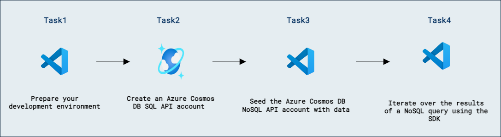

### タスク 1: 開発環境を準備する

このタスクでは、Visual Studio Code をセットアップして Azure Cosmos DB の作業のための開発環境を準備します。

1. デスクトップから **Visual Studio Code** を起動します。

     

2. 左側のパネルから **拡張機能 (1)** ブレードを選択します。**C# (2)** で検索し、**インストール (3)** を選択して拡張機能をインストールします。インストールが完了するまで待ちます。

    

3. 画面左上の **ファイル (1)** オプションを選択し、ペインのオプションから **フォルダーを開く (2)** を選択します。

    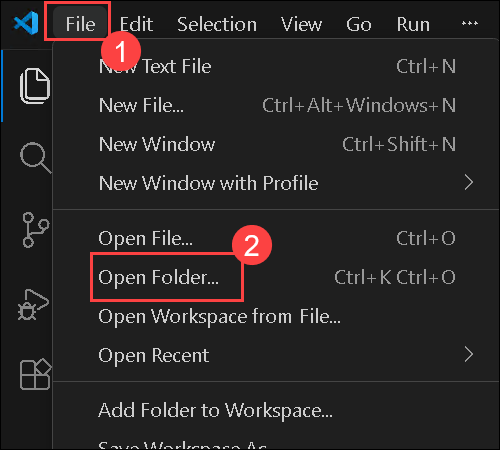

4. **C:\AllFiles (1)** に移動し、**dp-420-cosmos-db-dev-main (2)** を選択して **フォルダーの選択 (3)** をクリックします。

    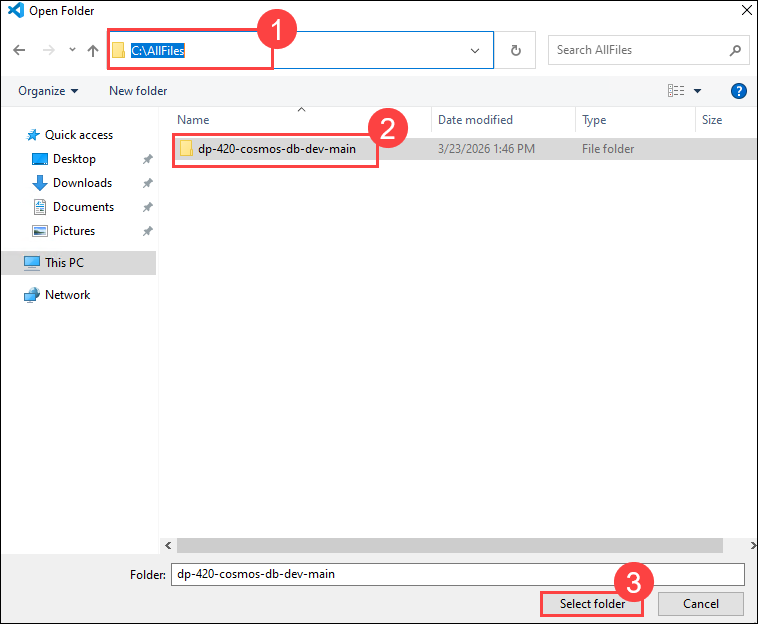

5. **このフォルダー内のファイルの作成者を信頼しますか** のメッセージが表示された場合は、**はい、作成者を信頼します** をクリックします。

### タスク 2: Azure Cosmos DB for NoSQL アカウントを作成する

このタスクでは、API for NoSQL を使用して Azure Cosmos DB アカウントを作成します。アカウントのプロビジョニングが完了したら、エンドポイント (URI) とプライマリキーなど、必要な接続情報を取得します。これらの資格情報を使用して、Azure SDK または他の SDK で Cosmos DB アカウントに接続できます。

Azure Cosmos DB は、複数の API をサポートするクラウドベースの NoSQL データベースサービスです。Azure Cosmos DB アカウントを初めてプロビジョニングするときは、サポートする API を選択します（例: **API for MongoDB** や **API for NoSQL**）。Azure Cosmos DB for NoSQL アカウントのプロビジョニングが完了したら、エンドポイントとキーを取得し、.NET 用 Azure SDK やその他の SDK を使用して Azure Cosmos DB for NoSQL アカウントに接続できます。

1. Azure ポータルページに戻り、ポータル上部の **リソース、サービス、ドキュメントを検索 (G+/)** ボックスに **Azure Cosmos DB (1)** と入力し、サービスの下に表示される **Azure Cosmos DB (2)** を選択します。

   
   
1. **Azure Cosmos DB for NoSQL** の下で **+ 作成 (1)** を選択します。

    

    - **Azure Cosmos DB for NoSQL** アカウントを作成するには、**作成 (2)** をクリックします。

      

1. 次の設定を指定し、残りの設定はすべて既定値のままにして、**次へ: グローバル分散 (9)** を選択します。

    | **設定** | **値** |
    | --------------------|--------------------------------------------------- |
    | **Workload Type** | *Production* (1) |
    | **Subscription** | *Your existing Azure subscription* (2) |
    | **Resource group** | *Select an existing Cosmosdb-<inject key="DeploymentID" enableCopy="false"/>* (3) |
    | **Account Name** | *sql-<inject key="DeploymentID" enableCopy="false"/>* (4) |
    | **Location** | *Choose the default region* (5) |
    | **Capacity mode** | *Provisioned throughput* (6) |
    | **Apply Free Tier Discount** | *Do Not Apply* (7) |
    | **Limit the total amount of throughput that can be provisioned on this account** | *Unchecked* (8) |

     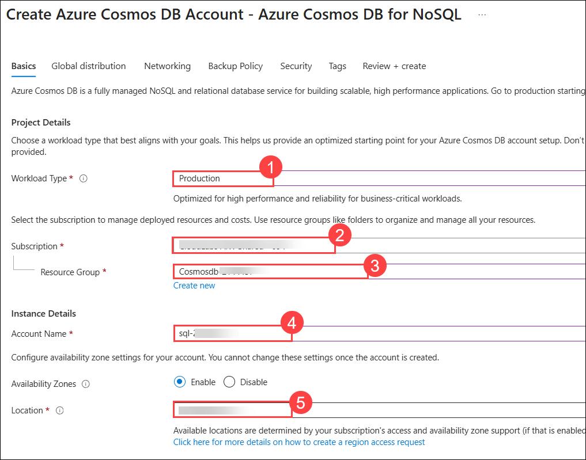

     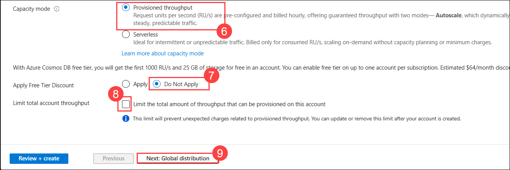

1. グローバル分散ページで **次へ: ネットワーク** をクリックします。**接続方法** で **すべてのネットワーク (1)** を選択し、**確認および作成 (2)** をクリックします。

    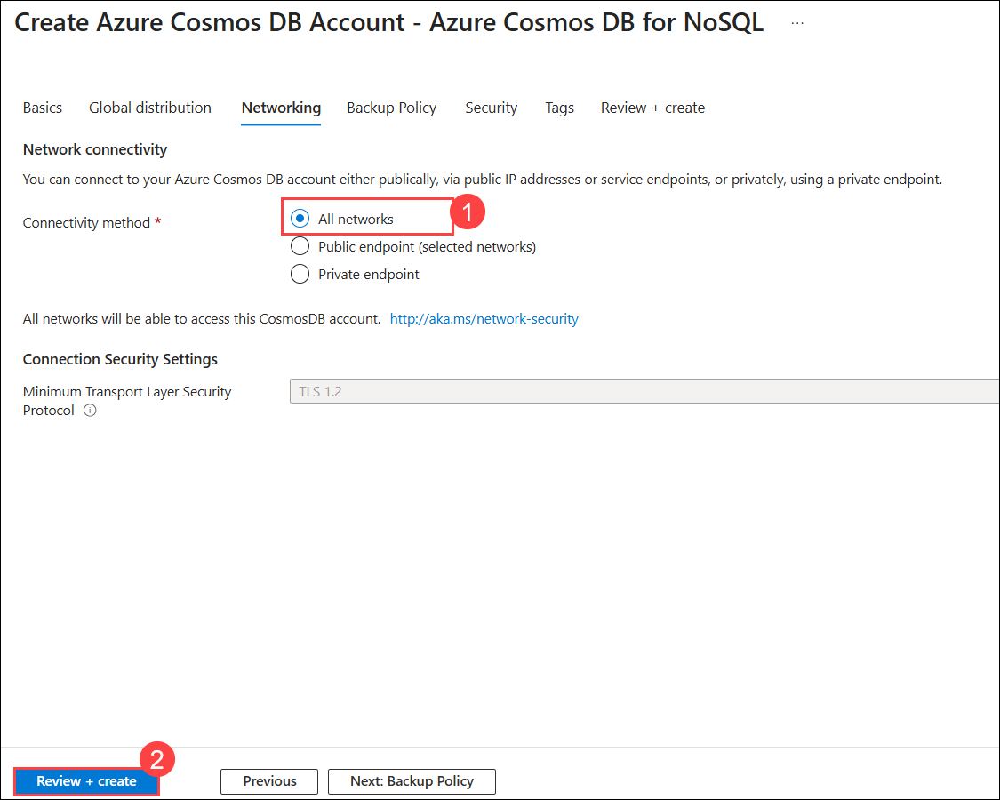

1. 検証が完了したら、**作成** をクリックします。

1. 展開タスクが完了するまで、このタスクを続行せずに待ちます。

1. **リソースに移動** を選択します。

    

1. 新しく作成された **Azure Cosmos DB** アカウントで、**設定** の **キー (1)** ペインに移動します。このペインには、SDK からアカウントに接続するための接続情報と資格情報が含まれています。具体的には:

    - **URI (2)** フィールドの値を記録します。この **endpoint** 値はこの演習で後ほど使用します。

        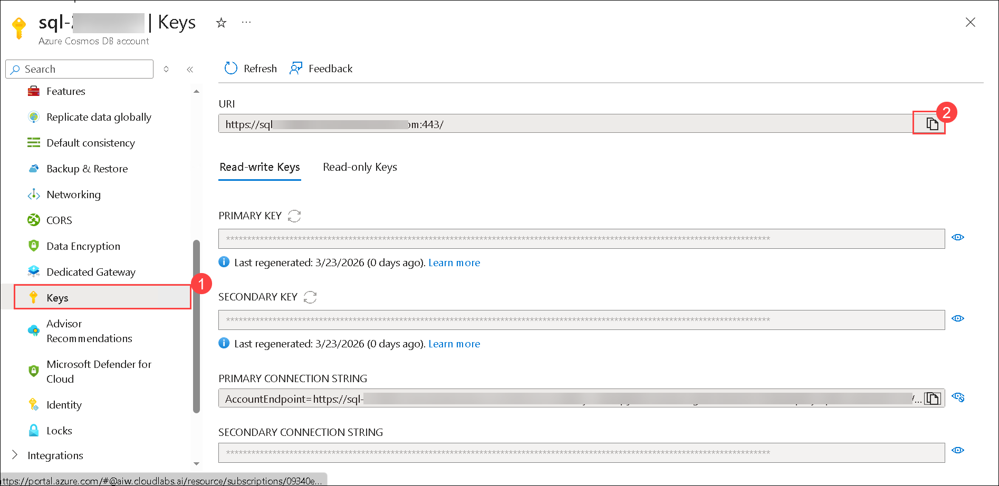

    - **Primary Connection String** フィールドを確認します。**目のアイコン (1)** をクリックします。後でこの演習で使用する **connection string** の値をコピーします **(2)**。

      - PRIMARY KEY の横にある **目のアイコン (3)** をクリックします。**PRIMARY KEY (4)** フィールドの値を記録します。この **key** 値は後で使用します。

        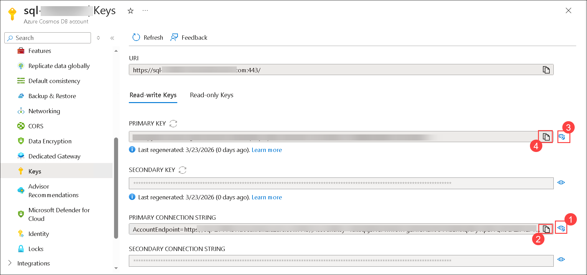    
        
1. **Visual Studio Code** に戻ります。

    > **ラボの完了おめでとうございます！** ここから検証を行います。手順は次のとおりです:
    > - 対応するタスクの検証ボタンを押します。成功メッセージが表示された場合、ラボの検証が完了しています。
    > - そうでない場合は、エラーメッセージを注意深く読み、ラボガイドの指示に従って手順を再試行します。
    > - サポートが必要な場合は、cloudlabs-support@spektrasystems.com までご連絡ください。24 時間 365 日対応しています。

    <validation step="1365501c-f12d-434e-9c4f-6262ecb20955" />

### タスク 3: Azure Cosmos DB for NoSQL アカウントにデータをシードする

このタスクでは、cosmicworks コマンドライン ツールをインストールして、アカウントのエンドポイントとキーを含むコマンドを実行することで、Azure Cosmos DB for NoSQL アカウントにサンプル製品データをシードします。

[cosmicworks][nuget.org/packages/cosmicworks] コマンドライン ツールは、任意の Azure Cosmos DB for NoSQL アカウントにサンプルデータをデプロイします。このツールはオープンソースで NuGet で提供されています。Azure Cloud Shell にこのツールをインストールし、その後データベースをシードするために使用します。

1. **Visual Studio Code** で、**... (省略記号) (1)** > **ターミナル (2)** > **新しいターミナル (3)** を選択して、既存のインスタンスで新しいターミナルを開きます。

    

1. マシンでグローバルに使用するために [cosmicworks][nuget.org/packages/cosmicworks] コマンドライン ツールをインストールします。

    ```
    dotnet tool install cosmicworks --global --version 2.*
    ```

    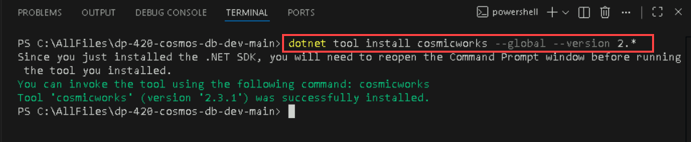    

     >**注意**: このコマンドの完了には数分かかる場合があります。すでに最新バージョンをインストールしている場合は、(*Tool 'cosmicworks' is already installed*) という警告メッセージが表示されることがあります。

1. インストールが完了したら、以下のコマンドを実行する前に **Visual Studio Code** を閉じて再起動してください。

1. 次のコマンドを実行して、前のラボでコピーした値を使用して Azure Cosmos DB アカウントをシードします。

    | **オプション** | **値** |
    | ---------------- | ----------|
    | **CONNECTION STRING** | *このラボで先ほどコピーした Primary Connection String の値* |

    ```
    cosmicworks --connection-string "<CONNECTION_STRING>" --disable-hierarchical-partition-keys 
    ```

    > **注意:** 上記のコマンド実行中にエラーが発生した場合は、**Visual Studio Code を閉じて再起動**し、再度コマンドを実行してください。

1. **cosmicworks** コマンドがデータベース、コンテナー、およびアイテムの作成を完了するまで待ちます。

   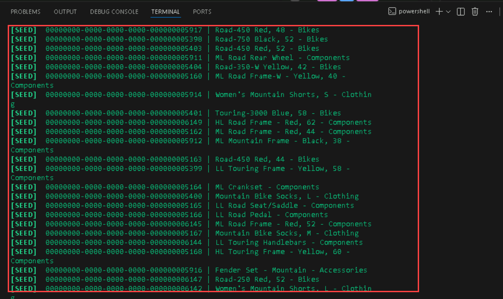
   
    >**注意**: エラーが発生した場合は、Visual Studio Code を閉じて再起動し、再度コマンドを実行してください。

1. 統合ターミナルを閉じます。

### タスク 4: SDK を使用して NoSQL クエリの結果を反復処理する

このタスクでは、C# スクリプトを変更して Cosmos DB に接続し、すべての製品を取得する SQL クエリを実行し、非同期ループを使用して各製品の ID、名前、および価格を表示します。このタスクは、Azure Cosmos DB SDK を使用した NoSQL 環境でのクエリとデータ処理の理解を深めます。

これから、Azure Cosmos DB からのページ分割された結果の上を走るシンプルな for-each ループを非同期ストリームで作成します。内部では、SDK がフィード イテレータを管理し、後続のリクエストが正しく呼び出されるようにします。

1. **Visual Studio Code** の **エクスプローラー** ペインで **09-execute-query-sdk (1)** フォルダーに移動します。

    - **product.cs (2)** コードファイルを開きます。
    - **Product** クラスとそのプロパティを確認します。このラボでは、特に **id**、**name**、**price** プロパティを使用します。

      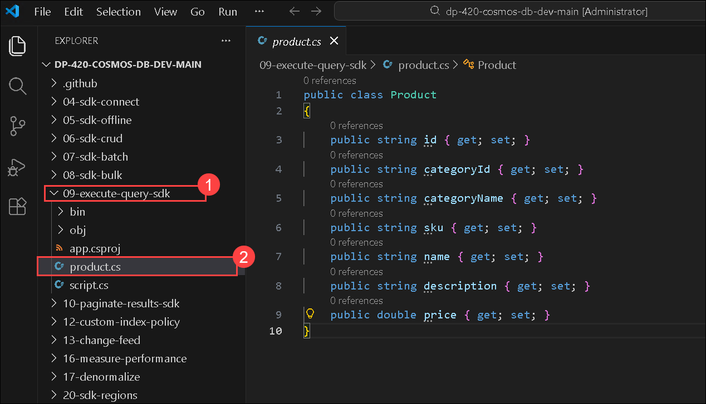    

1. **Visual Studio Code** の **エクスプローラー** ペインに戻り、**script.cs** コードファイルを開きます。

1. 既存の **endpoint** 変数を、前に作成した Azure Cosmos DB アカウントの **endpoint** に設定します。
  
    ```
    string endpoint = "<cosmos-endpoint>";
    ```

    >**注意**: 例えば、endpoint が **https&shy;://dp420.documents.azure.com:443/** の場合、C# 文は **string endpoint = "https&shy;://dp420.documents.azure.com:443/";** になります。

1. 既存の **key** 変数を、前に作成した Azure Cosmos DB アカウントの **key** に設定します。

    ```
    string key = "<cosmos-key>";
    ```

    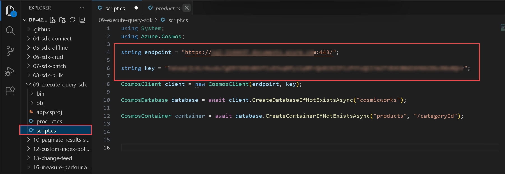     

     >**注意**: 例えば、key が **fDR2ci9QgkdkvERTQ==** の場合、C# 文は **string key = "fDR2ci9QgkdkvERTQ==";** になります。

1. 12 行目の `CosmosContainer container = await database.CreateContainerIfNotExistsAsync("products", "/categoryId");` を削除します。

    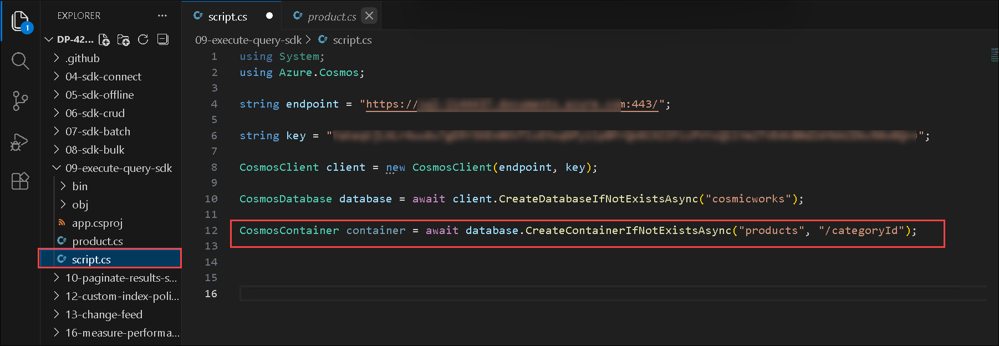 

1. 以下の文を追加します。

    ```
    CosmosContainer container = database.GetContainer("products");
    ```

    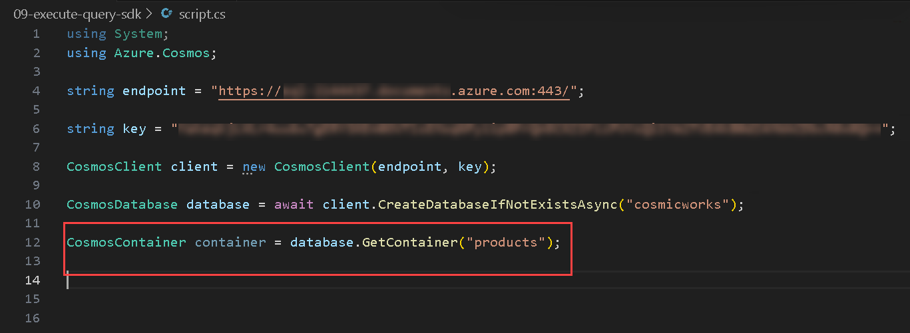 

1. スクリプトの末尾に、値が **SELECT * FROM products p** の *string* 型の新しい変数 **sql** を作成する以下のコマンドを追加します。

    ```
    string sql = "SELECT * FROM products p";
    ```

1. **sql** 変数をコンストラクターに渡して [QueryDefinition][docs.microsoft.com/dotnet/api/azure.cosmos.querydefinition] 型の新しい変数を作成します。

    ```
    QueryDefinition query = new (sql);
    ```

1. [CosmosContainer][docs.microsoft.com/dotnet/api/azure.cosmos.cosmoscontainer] クラスのジェネリック [GetItemQueryIterator][docs.microsoft.com/dotnet/api/azure.cosmos.cosmoscontainer.getitemqueryiterator] メソッドを呼び出し、**query** 変数を渡して、**Product** 型のインスタンスを表す変数 **product** を使用して結果を非同期に反復処理する新しい **await foreach** ループを作成します:

    ```
    await foreach (Product product in container.GetItemQueryIterator<Product>(query))
    {
    }
    ```

1. **await foreach** ループ内で、組み込みの **Console.WriteLine** 静的メソッドを使用して、**product** 変数の **id**、**name**、**price** プロパティを整形して出力します:

    ```
    Console.WriteLine($"[{product.id}]\t{product.name,35}\t{product.price,15:C}");
    ```

1. 作業が完了したら、コードファイルには次の内容が含まれているはずです:
  
    ```
    using System;
    using Azure.Cosmos;

    string endpoint = "<cosmos-endpoint>";

    string key = "<cosmos-key>";

    CosmosClient client = new CosmosClient(endpoint, key);

    CosmosDatabase database = await client.CreateDatabaseIfNotExistsAsync("cosmicworks");

    CosmosContainer container = await database.CreateContainerIfNotExistsAsync("products", "/categoryId");

    string sql = "SELECT * FROM products p";
    QueryDefinition query = new (sql);

    await foreach (Product product in container.GetItemQueryIterator<Product>(query))
    {
        Console.WriteLine($"[{product.id}]\t{product.name,35}\t{product.price,15:C}");
    }
    ```

    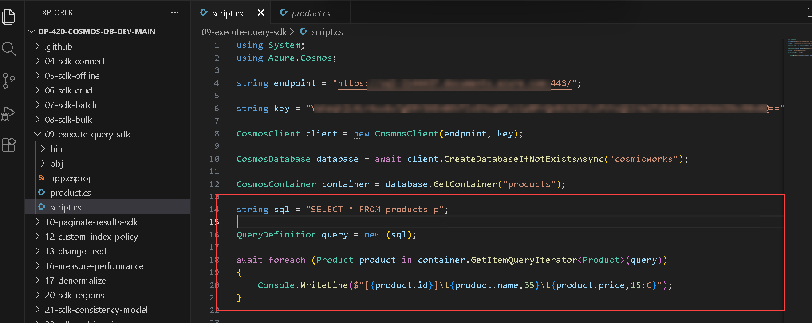    

1. **Ctrl+S** を押して、script.cs ファイルを保存します。

1. **Visual Studio Code** で **09-execute-query-sdk** フォルダーのコンテキストメニューを開き、フォルダー **(1)** を右クリックして **統合ターミナルで開く (2)** を選択し、新しいターミナルを開きます。

    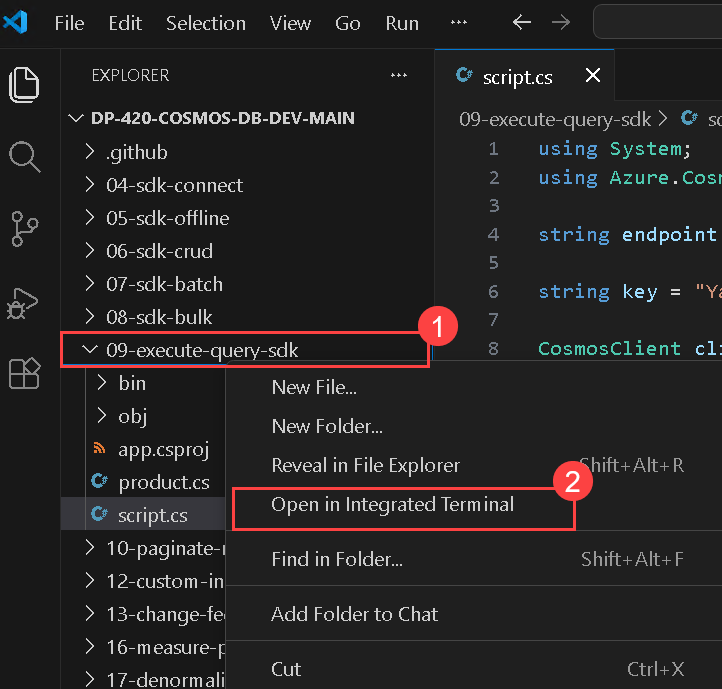

1. [dotnet run][docs.microsoft.com/dotnet/core/tools/dotnet-run] コマンドを使用してプロジェクトをビルドおよび実行します:

    ```
    dotnet run
    ```

1. スクリプトは、コンテナー内のすべての製品を出力します。

    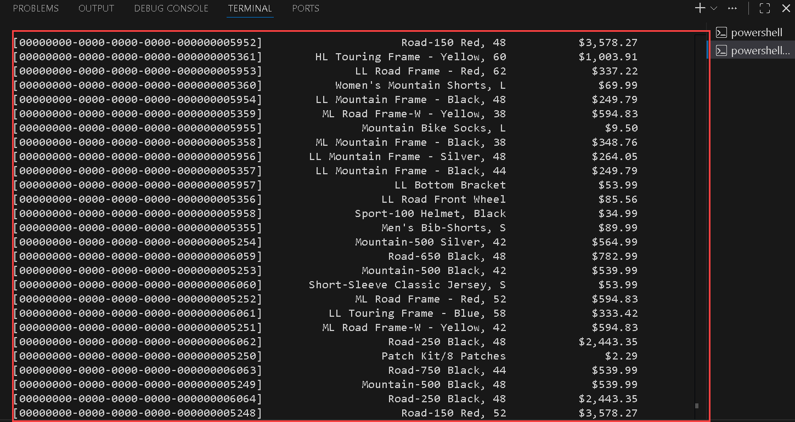

1. 統合ターミナルを閉じます。

1. **Visual Studio Code** を閉じます。


### まとめ 

このラボでは、Visual Studio Code をセットアップし、Azure Cosmos DB for NoSQL アカウントを作成しました。cosmicworks ツールを使用して製品データでデータベースにシードした後、C# スクリプトを変更してデータベースを非同期的にクエリしました。Cosmos DB SDK を使用して SQL クエリを実行し、非同期ループで結果を反復処理し、製品情報を効率的に表示しました。このラボでは、.NET SDK と C# を使用して Azure Cosmos DB のデータをクエリし、処理する実践的な経験が得られました。


### ラボを正常に完了しました
