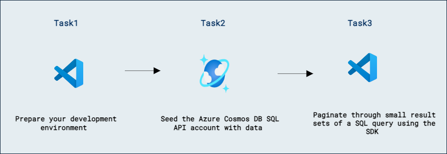

# Lab 05b - Azure Cosmos DB SQL API でクエリを実行する

## ラボシナリオ

Azure Cosmos DB のクエリは通常、複数ページの結果になります。Azure Cosmos DB が単一の実行で全クエリ結果を返せない場合、ページネーションはサーバー側で自動的に行われます。多くのアプリケーションでは、SDK を使用してクエリ結果をバッチ単位で効率的に処理するコードを書く必要があります。

このラボでは、一連の結果セット全体をループで反復処理するために使用できるフィード イテレータを作成します。

## ラボの目的

このラボでは、次のタスクを完了します:
- タスク 1: 開発環境を準備する。
- タスク 2: Azure Cosmos DB SQL API アカウントにデータをシードする。
- タスク 3: SDK を使用して SQL クエリの小さな結果セットをページネーションする。

## 推定所要時間: 30 分

## アーキテクチャ図



## 演習 1: Azure Cosmos DB SQL API SDK でクロスプロダクト クエリ結果をページネーションする

### タスク 1: 開発環境を準備する

1. Visual Studio Code を起動します（プログラムアイコンはデスクトップにピン留めされています）。

2. 左ペインから **拡張機能 (1)** アイコンを選択します。検索バーに **C# (2)** と入力し、表示された **拡張機能 (3)** を選択して、最後に **インストール (4)** をクリックします。

    

3. 画面左上の **ファイル** オプションを選択し、ペインのオプションから **フォルダーを開く** を選択し、**C:\AllFiles** に移動します。

4. **dp-420-cosmos-db-dev** フォルダーを選択し、**フォルダーの選択** をクリックします。

### タスク 2: Azure Cosmos DB SQL API アカウントにデータをシードする

[cosmicworks][nuget.org/packages/cosmicworks] コマンドライン ツールは、任意の Azure Cosmos DB SQL API アカウントにサンプルデータをデプロイします。このツールはオープンソースで NuGet で提供されています。このツールを Azure Cloud Shell にインストールし、データベースへのシードに使用します。

1. **Visual Studio Code** で、**ターミナル** メニューを開き、**新しいターミナル** を選択して新しいターミナル インスタンスを開きます。

1. マシンでグローバルに使用するために [cosmicworks][nuget.org/packages/cosmicworks] コマンドライン ツールをインストールします。

    ```
    dotnet tool install --global cosmicworks
    ```

    >**注意**: このコマンドの完了には数分かかる場合があります。すでに最新バージョンをインストールしている場合は、(*Tool 'cosmicworks' is already installed*) という警告メッセージが表示されることがあります。

1. 次のコマンドライン オプションで cosmicworks を実行し、Azure Cosmos DB アカウントにデータをシードします:

    | **オプション** | **値** |
    | --- | --- |
    | **--endpoint** | *このラボで先ほどコピーした endpoint の値* |
    | **--key** | *このラボで先ほどコピーした key の値* |
    | **--datasets** | *product* |

    ```
    cosmicworks --endpoint <cosmos-endpoint> --key <cosmos-key> --datasets product
    ```

    >**注意**: たとえば、endpoint が **https&shy;://dp420.documents.azure.com:443/** で、key が **fDR2ci9QgkdkvERTQ==** の場合、コマンドは次のようになります:
    > ``cosmicworks --endpoint https://dp420.documents.azure.com:443/ --key fDR2ci9QgkdkvERTQ== --datasets product``

1. **cosmicworks** コマンドがアカウントにデータベース、コンテナー、およびアイテムを作成し終えるまで待ちます。

1. 統合ターミナルを閉じます。

### タスク 3: SDK を使用して SQL クエリの小さな結果セットをページネーションする

クエリ結果を処理する際は、すべてのページを順に進み、次のリクエストを行う前に追加のページが残っているかを確認する必要があります。

1. **Visual Studio Code** の **エクスプローラー** ペインで、**10-paginate-results-sdk** フォルダーに移動します。

1. **product.cs** コードファイルを開きます。

1. **Product** クラスとそのプロパティを確認します。このラボでは、特に **id**、**name**、**price** プロパティを使用します。

1. **Visual Studio Code** の **エクスプローラー** ペインに戻り、**script.cs** コードファイルを開きます。

1. 既存の **endpoint** という名前の変数を、前のラボで作成した Azure Cosmos DB アカウントの **endpoint** に設定します。
  
    ```
    string endpoint = "<cosmos-endpoint>";
    ```

    >**注意**: たとえば、endpoint が **https&shy;://dp420.documents.azure.com:443/** の場合、C# 文は **string endpoint = "https&shy;://dp420.documents.azure.com:443/";** になります。

1. 既存の **key** という名前の変数を、前のラボで作成した Azure Cosmos DB アカウントの **key** に設定します。

    ```
    string key = "<cosmos-key>";
    ```

    >**注意**: たとえば、key が **fDR2ci9QgkdkvERTQ==** の場合、C# 文は **string key = "fDR2ci9QgkdkvERTQ==";** になります。

1. 値が **SELECT p.id, p.name, p.price FROM products p** の *string* 型の新しい変数 **sql** を作成します。

    ```
    string sql = "SELECT p.id, p.name, p.price FROM products p ";
    ```

1. **sql** 変数をコンストラクターに渡して、[QueryDefinition][docs.microsoft.com/dotnet/api/microsoft.azure.cosmos.querydefinition] 型の新しい変数を作成します。

    ```
    QueryDefinition query = new (sql);
    ```

1. 既定の空コンストラクターを使って、[QueryRequestOptions][docs.microsoft.com/dotnet/api/microsoft.azure.cosmos.queryrequestoptions] 型の新しい変数 **options** を作成します。

    ```
    QueryRequestOptions options = new ();
    ```

1. **options** 変数の [MaxItemCount][docs.microsoft.com/dotnet/api/microsoft.azure.cosmos.queryrequestoptions.maxitemcount] プロパティを **50** に設定します。

    ```
    options.MaxItemCount = 50;
    ```

1. [Container][docs.microsoft.com/dotnet/api/microsoft.azure.cosmos.container] クラスのジェネリック [GetItemQueryIterator][docs.microsoft.com/dotnet/api/microsoft.azure.cosmos.container.getitemqueryiterator] メソッドを呼び出し、**query** と **options** 変数を渡して、[FeedIterator<>][docs.microsoft.com/dotnet/api/microsoft.azure.cosmos.feediterator-1] 型の新しい変数 **iterator** を作成します。

    ```
    FeedIterator<Product> iterator = container.GetItemQueryIterator<Product>(query, requestOptions: options);
    ```

1. **iterator** 変数の [HasMoreResults][docs.microsoft.com/dotnet/api/microsoft.azure.cosmos.feediterator-1.hasmoreresults] プロパティをチェックする **while** ループを作成します。

    ```
    while (iterator.HasMoreResults)
    {
        
    }
    ```

1. **while** ループ内で、**iterator** 変数の [ReadNextAsync][docs.microsoft.com/dotnet/api/microsoft.azure.cosmos.feediterator-1.readnextasync] メソッドを非同期に呼び出し、結果を **Product** クラスのジェネリック型 [FeedResponse][docs.microsoft.com/dotnet/api/microsoft.azure.cosmos.feedresponse-1] の **products** 変数に格納します。

    ```
    FeedResponse<Product> products = await iterator.ReadNextAsync();
    ```

1. 引き続き **while** ループ内で、**products** 変数を反復処理する新しい **foreach** ループを作成し、**Product** 型のインスタンスを表す **product** 変数を使用します。

    ```
    foreach (Product product in products)
    {

    }
    ```

1. **foreach** ループ内で、組み込みの **Console.WriteLine** 静的メソッドを使用して、**product** 変数の **id**、**name**、**price** プロパティを整形して出力します。

    ```
    Console.WriteLine($"[{product.id}]\t[{product.name,40}]\t[{product.price,10}]");
    ```

1. **while** ループ内に戻り、組み込みの **Console.WriteLine** 静的メソッドを使用して *Press any key to get more results* というメッセージを出力します。

    ```
    Console.WriteLine("Press any key to get more results");
    ```

1. **while** ループ内で、組み込みの **Console.ReadKey** 静的メソッドを使用して次のキー入力を待ちます。

    ```
    Console.ReadKey();
    ```

1. 作業が完了したら、コードファイルには次の内容が含まれているはずです:
  
    ```
    using System;
    using Microsoft.Azure.Cosmos;

    string endpoint = "<cosmos-endpoint>";

    string key = "<cosmos-key>";

    CosmosClient client = new CosmosClient(endpoint, key);

    Database database = await client.CreateDatabaseIfNotExistsAsync("cosmicworks");

    Container container = await database.CreateContainerIfNotExistsAsync("products", "/categoryId");

    string sql = "SELECT p.id, p.name, p.price FROM products p ";
    QueryDefinition query = new (sql);

    QueryRequestOptions options = new ();
    options.MaxItemCount = 50;

    FeedIterator<Product> iterator = container.GetItemQueryIterator<Product>(query, requestOptions: options);

    while (iterator.HasMoreResults)
    {
        FeedResponse<Product> products = await iterator.ReadNextAsync();
        foreach (Product product in products)
        {
            Console.WriteLine($"[{product.id}]\t[{product.name,40}]\t[{product.price,10}]");
        }

        Console.WriteLine("Press any key for next page of results");
        Console.ReadKey();        
    }
    ```

1. **script.cs** ファイルを保存します。

1. **Visual Studio Code** で **10-paginate-results-sdk** フォルダーのコンテキスト メニューを開き、**統合ターミナルで開く** を選択して新しいターミナル インスタンスを開きます。

1. [dotnet run][docs.microsoft.com/dotnet/core/tools/dotnet-run] コマンドを使用してプロジェクトをビルドして実行します。

    ```
    dotnet run
    ```

1. スクリプトは、クエリに一致する最初の 50 件のアイテムを出力します。次の 50 件を取得するには任意のキーを押し、すべての一致アイテムを反復処理するまで繰り返します。

    >**注意**: このクエリは、products コンテナー内の何百件ものアイテムに一致します。

1. 統合ターミナルを閉じます。

1. **Visual Studio Code** を閉じます。

[code.visualstudio.com/docs/getstarted]: https://code.visualstudio.com/docs/getstarted/tips-and-tricks
[docs.microsoft.com/dotnet/api/microsoft.azure.cosmos.container]: https://docs.microsoft.com/dotnet/api/microsoft.azure.cosmos.container
[docs.microsoft.com/dotnet/api/microsoft.azure.cosmos.container.getitemqueryiterator]: https://docs.microsoft.com/dotnet/api/microsoft.azure.cosmos.container.getitemqueryiterator
[docs.microsoft.com/dotnet/api/microsoft.azure.cosmos.feediterator-1]: https://docs.microsoft.com/dotnet/api/microsoft.azure.cosmos.feediterator-1
[docs.microsoft.com/dotnet/api/microsoft.azure.cosmos.feediterator-1.hasmoreresults]: https://docs.microsoft.com/dotnet/api/microsoft.azure.cosmos.feediterator-1.hasmoreresults
[docs.microsoft.com/dotnet/api/microsoft.azure.cosmos.feediterator-1.readnextasync]: https://docs.microsoft.com/dotnet/api/microsoft.azure.cosmos.feediterator-1.readnextasync
[docs.microsoft.com/dotnet/api/microsoft.azure.cosmos.feedresponse-1]: https://docs.microsoft.com/dotnet/api/microsoft.azure.cosmos.feedresponse-1
[docs.microsoft.com/dotnet/api/microsoft.azure.cosmos.querydefinition]: https://docs.microsoft.com/dotnet/api/microsoft.azure.cosmos.querydefinition
[docs.microsoft.com/dotnet/api/microsoft.azure.cosmos.queryrequestoptions]: https://docs.microsoft.com/dotnet/api/microsoft.azure.cosmos.queryrequestoptions
[docs.microsoft.com/dotnet/api/microsoft.azure.cosmos.queryrequestoptions.maxitemcount]: https://docs.microsoft.com/dotnet/api/microsoft.azure.cosmos.queryrequestoptions.maxitemcount
[docs.microsoft.com/dotnet/core/tools/dotnet-run]: https://docs.microsoft.com/dotnet/core/tools/dotnet-run
[nuget.org/packages/cosmicworks]: https://www.nuget.org/packages/cosmicworks/

### レビュー

このラボでは、次の作業を完了しました:

- 開発環境を準備しました。
- Azure Cosmos DB SQL API アカウントにデータをシードしました。
- SDK を使用して SQL クエリの小さな結果セットをページネーションしました。

### ラボを正常に完了しました
