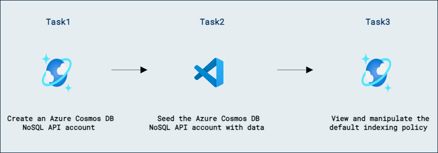
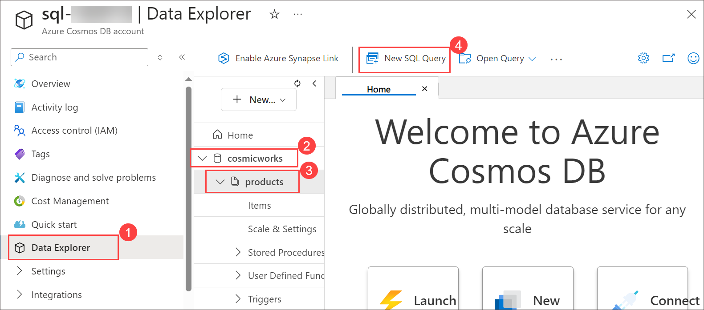
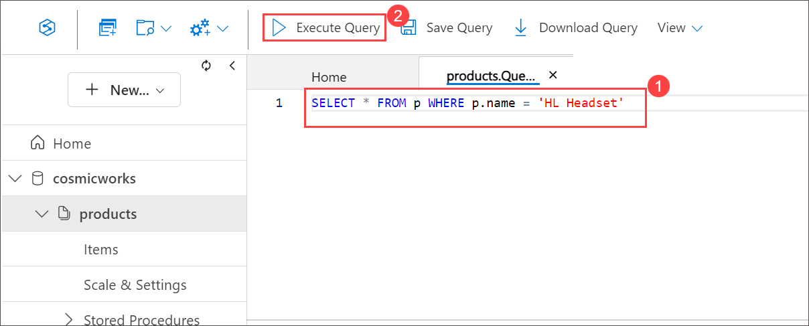
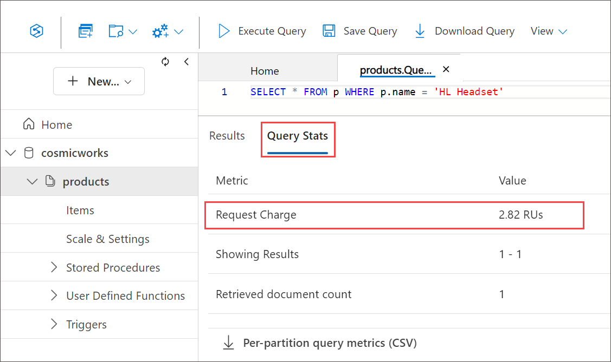
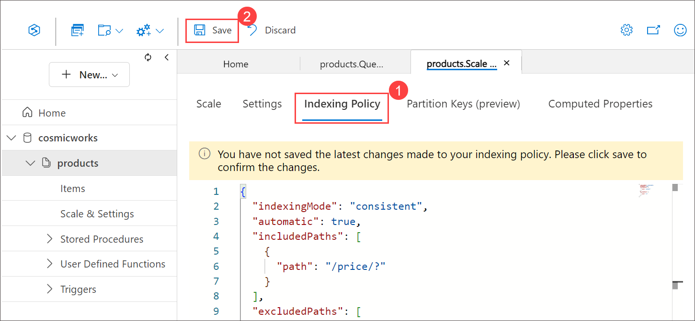
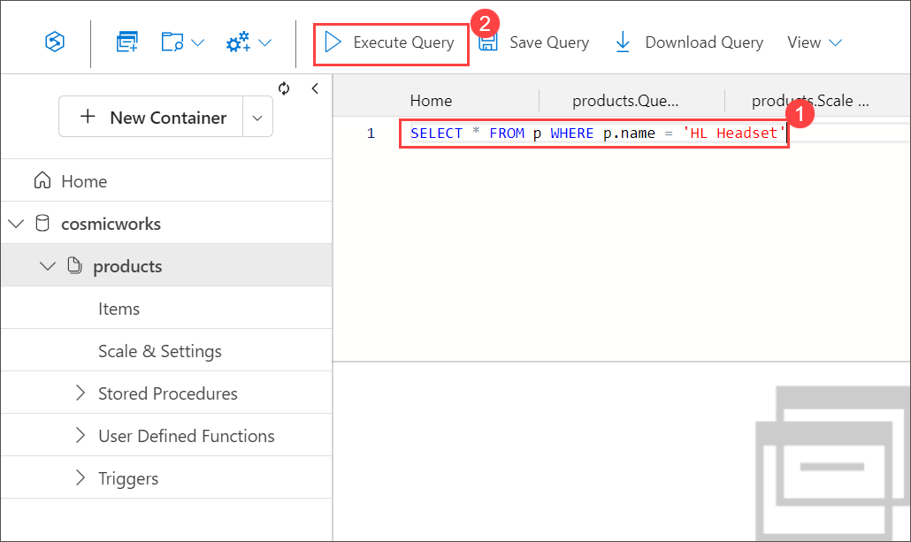
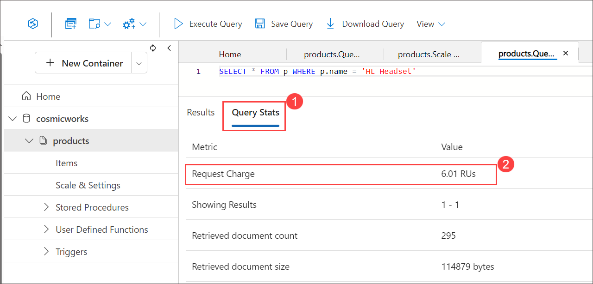

# ポータルを使って Azure Cosmos DB for NoSQL コンテナーの既定のインデックス ポリシーを確認する

## ラボのシナリオ

Azure Cosmos DB の各コンテナーには、そのコンテナー内のアイテムをどのようにインデックスするかをサービスに指示するインデックス ポリシーがあります。既定では、このインデックス ポリシーはすべてのアイテムのすべてのプロパティをインデックスします。既定のインデックス ポリシーは、プロジェクトの開始時にインデックス、パフォーマンス、管理について考える必要がないため、Azure Cosmos DB をすばやく使い始めるのに役立ちます。

このラボでは、Data Explorer を使っていくつかのコンテナーの既定のインデックス ポリシーを確認し、操作します。

## ラボの目的

このラボでは、次のタスクを完了します:
- タスク 1: Azure Cosmos DB NoSQL API アカウントを作成する。
- タスク 2: Azure Cosmos DB NoSQL API アカウントにデータをシードする。
- タスク 3: 既定のインデックス ポリシーを表示して操作する。

## 推定所要時間: 30 分

## アーキテクチャ図



## タスク 1: ポータルで Azure Cosmos DB SQL API コンテナーの既定のインデックス ポリシーを確認する

このタスクでは、Azure Cosmos DB SQL アカウントをプロビジョニングし、必要な基本設定を構成し、今後の開発で使用する接続情報を取得します。

Azure Cosmos DB は複数の API をサポートするクラウドベースの NoSQL データベース サービスです。Azure Cosmos DB アカウントを初めてプロビジョニングする際には、アカウントでサポートする API を選択します（例: Mongo API や NoSQL API）。Azure Cosmos DB for NoSQL アカウントのプロビジョニングが完了したら、エンドポイントとキーを取得し、Azure SDK for .NET やその他の SDK を使用してそのアカウントに接続できます。

1. Azure ポータルのページで、ポータル上部の「Search resources, services and docs (G+/)」ボックスに **Azure Cosmos DB (1)** と入力し、サービスの一覧から **Azure Cosmos DB (2)** を選択します。

   
   
1. **Azure Cosmos DB for NoSQL** の下で **+ Create (1)** を選択し、**Create (2)** をクリックして **Azure Cosmos DB for NoSQL** アカウントを作成します。

    

    

1. 次の設定を指定し、その他の設定はすべて既定値のままにして **Review + create (10)** を選択します:

    | **設定** | **値** |
    | --------------------|--------------------------------------------------- |
    | **Workload Type** | *Production* (1) |
    | **Subscription** | *Your existing Azure subscription* (2) |
    | **Resource group** | *Select an existing Cosmosdb-<inject key="DeploymentID" enableCopy="false"/>* (3) |
    | **Account Name** | *sql-<inject key="DeploymentID" enableCopy="false"/>* (4) |
    | **Location** | *Choose the default region* (5) |
    | **Capacity mode** | *Provisioned throughput* (6) |
    | **Apply Free Tier Discount** | *Do Not Apply* (7) |
    | **Limit the total amount of throughput that can be provisioned on this account** | *Unchecked* (8) |

     

1. **Create** をクリックします。

    

1. デプロイが完了するまで待ちます。

1. デプロイが完了したら、**Go to resources** を選択します。

    

1. **Azure Cosmos DB アカウント** で、左側のメニューから **Settings (1)** を展開し、**Keys (2)** を選択します。

    


1. このペインには、SDK からアカウントに接続するために必要な接続情報と資格情報が含まれています。具体的には:

    1. **URI (1)** フィールドの値を記録します。この **endpoint** 値は、この演習で後ほど使用します。

    1. **PRIMARY KEY (2)** フィールドの値を記録します。この **key** 値は、この演習で後ほど使用します。

        

1. Web ブラウザーのウィンドウまたはタブを開いたままにしておきます。

    > **おめでとうございます**、タスクが完了しました。次に検証を行います。手順は次のとおりです:
    > - 対応するタスクの検証ボタンを押します。成功メッセージが表示された場合は、次のタスクに進みます。
    > - 表示されない場合は、エラーメッセージを注意深く読み、ラボ ガイドの手順に従ってもう一度試してください。
    > - サポートが必要な場合は、cloudlabs-support@spektrasystems.com までご連絡ください。24時間年中無休で対応しています。

    <validation step="140fa89d-d46a-4ae0-a198-9c51019a9b40" />

### タスク 2: Azure Cosmos DB NoSQL API アカウントにデータをシードする

このタスクでは、CosmicWorks ツールを使用して Azure Cosmos DB NoSQL アカウントにサンプルの製品データをシードします。Visual Studio Code のターミナルにツールをインストールした後、Cosmos DB のエンドポイントとキーを入力してシード コマンドを実行します。ツールはデータベース、コンテナーを作成し、アカウントに製品データを挿入します。

[cosmicworks][nuget.org/packages/cosmicworks] コマンドライン ツールは、任意の Azure Cosmos DB SQL API アカウントにサンプル データを展開します。このツールはオープンソースで NuGet から入手できます。Azure Cloud Shell にこのツールをインストールし、データベースにシードします。

1. Visual Studio Code を起動します（プログラム アイコンがデスクトップにピン留めされています）。

   

1. **Visual Studio Code** で、**Terminal** メニューを開き、**... (省略記号) (1)** を選択して **Terminal (2)** を選び、既存のインスタンスで **New Terminal (3)** を開きます。

    

1. [cosmicworks][nuget.org/packages/cosmicworks] コマンドライン ツールをグローバルに使用できるようにインストールします。

    ```
    dotnet tool install cosmicworks --global --version 1.*
    ```
  
    

    > 💡 このコマンドは完了するまで数分かかる場合があります。最新バージョンのツールが以前にインストールされている場合は、(*Tool 'cosmicworks' is already installed*) という警告メッセージが表示されます。
    
1. インストールが完了したら、以下のコマンドを実行するために **Visual Studio Code** を閉じて再度開いてください。

1. 次のコマンドライン オプションを使用して、Azure Cosmos DB アカウントにデータをシードするために cosmicworks を実行します:

    | **オプション** | **値** |
    | --- | --- |
    | **--endpoint** | *このラボで先ほどコピーしたエンドポイント値* |
    | **--key** | *このラボで先ほどコピーしたキー値* |
    | **--datasets** | *product* |

    ```
    cosmicworks --endpoint <cosmos-endpoint> --key <cosmos-key> --datasets product
    ```

    > &#128221; 例として、エンドポイントが **https://dp420.documents.azure.com:443/** でキーが **fDR2ci9QgkdkvERTQ==** の場合、コマンドは次のようになります:
    > ``cosmicworks --endpoint https://dp420.documents.azure.com:443/ --key fDR2ci9QgkdkvERTQ== --datasets product``

    >**注意**: エラーが発生した場合は、Visual Studio Code を閉じて再度開き、もう一度コマンドを実行してみてください。

1. **cosmicworks** コマンドがデータベース、コンテナー、アイテムをアカウントに追加し終えるまで待ちます。

1. 統合ターミナルを閉じます。

1. **Visual Studio Code** を閉じます。

    > **おめでとうございます**、タスクが完了しました。次に検証を行います。手順は次のとおりです:
    > - 対応するタスクの検証ボタンを押します。成功メッセージが表示された場合は、次のタスクに進みます。
    > - 表示されない場合は、エラーメッセージを注意深く読み、ラボ ガイドの手順に従ってもう一度試してください。
    > - サポートが必要な場合は、cloudlabs-support@spektrasystems.com までご連絡ください。24時間年中無休で対応しています。

    <validation step="eb8c6d06-bc6e-4170-a124-a95072d907a0" />

### タスク 3: 既定のインデックス ポリシーを表示して操作する

このタスクでは、Cosmos DB コンテナーの既定のインデックス ポリシーを表示し、変更します。Azure ポータルで Azure Cosmos DB に移動した後、_etag を除くすべてのパスをインデックスする既定のインデックス ポリシーを確認します。その後、/price パスのみをインデックスするようにポリシーを変更します。変更後、SQL クエリを実行して、インデックスの変更前後の要求量を比較し、どのフィールドがインデックスされているかによってクエリの効率がどのように変わるかを確認します。

コード、ポータル、またはツールでコンテナーが作成された場合、特にポリシーを指定しなければ、インデックス ポリシーはインテリジェントな既定値に設定されます。この既定のインデックス ポリシーを確認し、ポリシーを変更します。

1. **Azure portal** に移動します。

1. Azure ポータルのページで、ポータル上部の「Search resources, services and docs (G+/)」ボックスに **Azure Cosmos DB** と入力し、サービスの一覧から **Azure Cosmos DB** を選択します。

   

1. **sql-<inject key="DeploymentID" enableCopy="false"/>** を選択します。

     
   
1. **Azure Cosmos DB** アカウント リソース内で、**Data Explorer** ペインに移動します。

1. **Data Explorer** で **cosmicworks** データベース ノードを展開し、ナビゲーション ツリー内の新しい **products** コンテナー ノードを確認してから、**New SQL Query** を選択します。

     

1. エディター領域の内容を削除します。

1. **name** が **HL Headset** と等しいすべてのドキュメントを返す新しい SQL クエリを作成し、**Execute Query** を選択します。

    ```
    SELECT * FROM p WHERE p.name = 'HL Headset'
    ```

   

1. クエリの結果を確認します。

1. **Query Stats** を選択します。**Query Statistics** セクションの **Request Charge** フィールドの値を確認します。

     
   
    > &#128221; すべてのパスが現在インデックスされているため、このクエリは比較的効率的であるはずです。

1. **products** コンテナー ノード内で **Scale & Settings** を選択します。

1. **Indexing Policy** セクションで既定のインデックス ポリシーを確認します:

    ```
    {
      "indexingMode": "consistent",
      "automatic": true,
      "includedPaths": [
        {
          "path": "/*"
        }
      ],
      "excludedPaths": [
        {
          "path": "/\"_etag\"/?"
        }
      ]
    }
    ```

    > &#128221; この既定のポリシーは、**_etag** を除くすべてのパスをインデックスします。

1. エディター内でインデックス ポリシーの内容を **/price** パスのみをインデックスするように置き換え、**Save** を選択して変更を保存します。

    ```
    {
      "indexingMode": "consistent",
      "automatic": true,
      "includedPaths": [
        {
          "path": "/price/?"
        }
      ],
      "excludedPaths": [
        {
          "path": "/*"
        }
      ]
    }
    ```

   

1. **New SQL Query** を選択します。
  
1. エディター領域の内容を削除します。

1. **name** が **HL Headset** と等しいすべてのドキュメントを返す新しい SQL クエリを作成し、**Execute Query** を選択します。

    ```
    SELECT * FROM p WHERE p.name = 'HL Headset'
    ```

   
    
1. クエリの結果を確認します。

1. **Query Stats** を選択し、**Query Statistics** セクションの **Request Charge** フィールドの値を確認します。
     
    > &#128221; **name** プロパティがインデックスされていないため、要求量が増加しています。
    
    

1. エディター領域の内容を削除します。

1. **price** が **$3,000** より大きいすべてのドキュメントを返す新しい SQL クエリを作成します:

    ```
    SELECT * FROM p WHERE p.price > 3000
    ```

1. **Execute Query** を選択します。

1. クエリの結果を確認します。

1. **Query Stats** を選択し、**Query Statistics** セクションの **Request Charge** フィールドの値を確認します。

## まとめ

このラボでは、Azure Cosmos DB のインデックス ポリシーを調査しました。インデックス ポリシーは、コンテナー内のアイテムをどのようにインデックスするかを制御します。既定では、すべてのプロパティがインデックスされるため、手動のインデックス管理を必要とせずに効率的なクエリが可能になります。このラボでは、Cosmos DB NoSQL アカウントのプロビジョニング、サンプル データのシード、既定のインデックス ポリシーの確認を行いました。その後、ポリシーを /price パスのみをインデックスするように変更し、クエリ効率と要求量への影響を観察しました。この演習により、インデックス ポリシーのカスタマイズが Cosmos DB のパフォーマンスとクエリ コストに及ぼす影響を実感できました。

### レビュー

このラボでは、次の作業を完了しました:

- Azure Cosmos DB for NoSQL アカウントを作成しました。
- Azure Cosmos DB for NoSQL アカウントにデータをシードしました。
- 既定のインデックス ポリシーを確認し、操作しました。

### このラボを正常に完了しました
