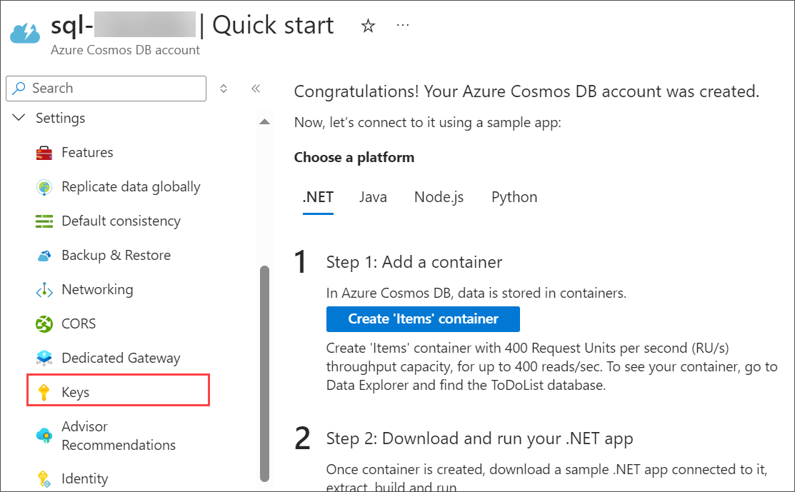
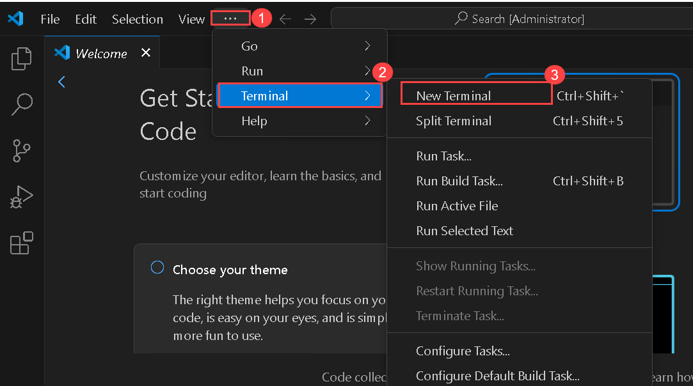
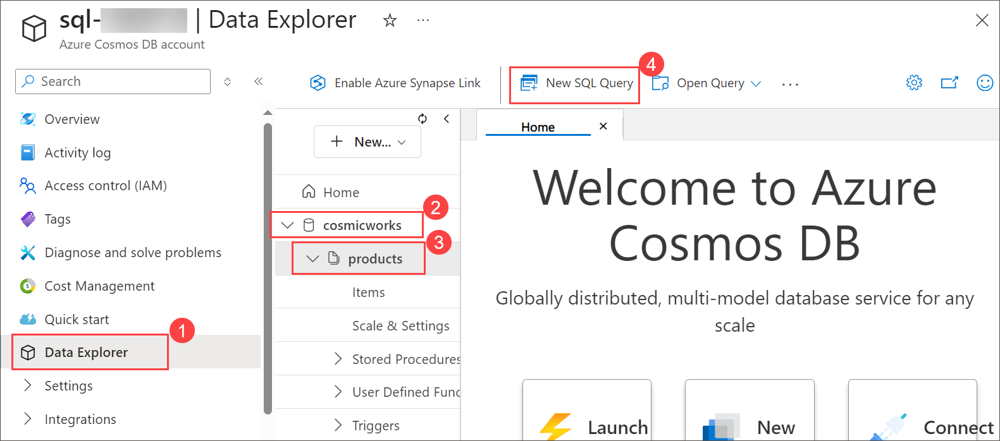
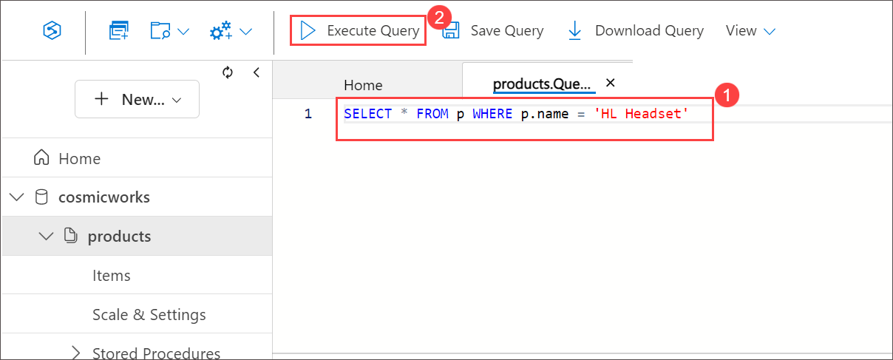
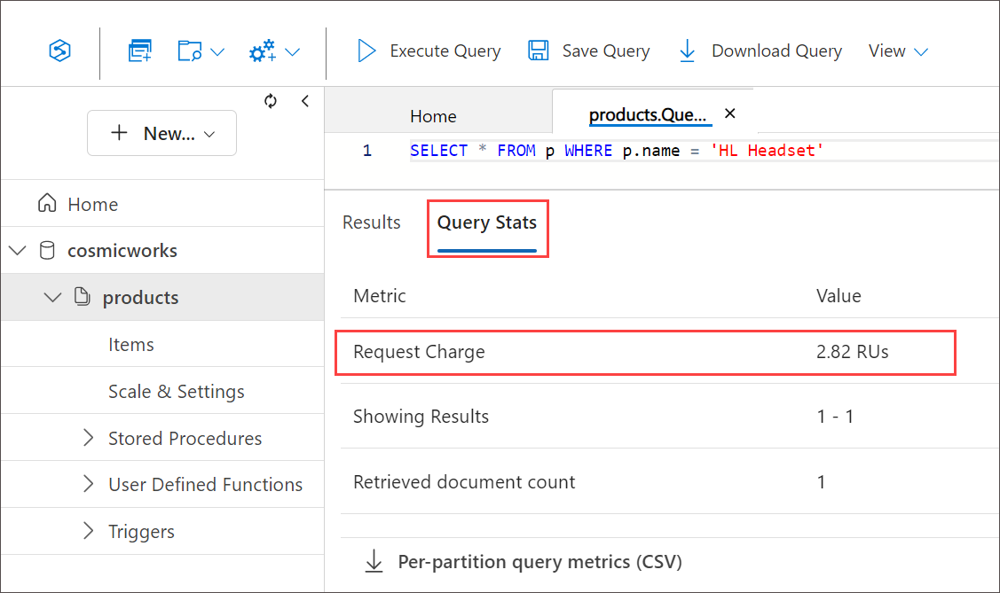
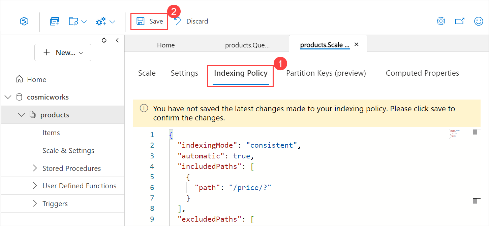
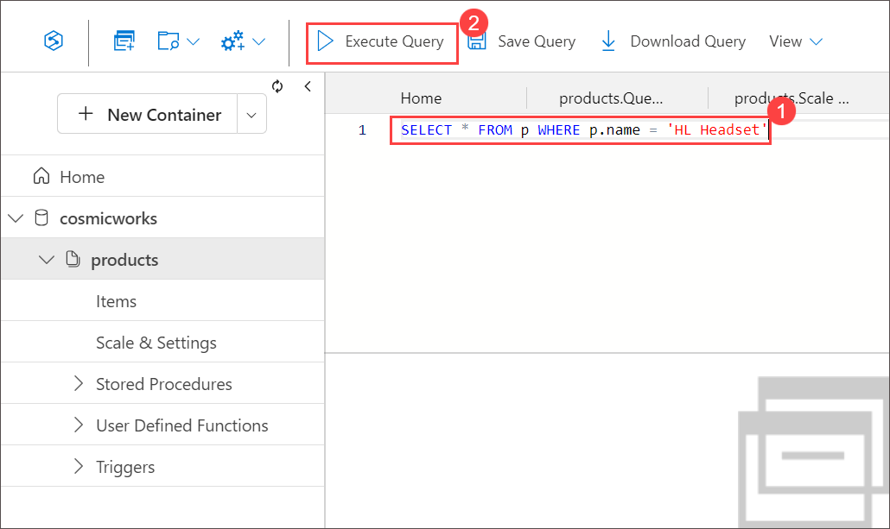
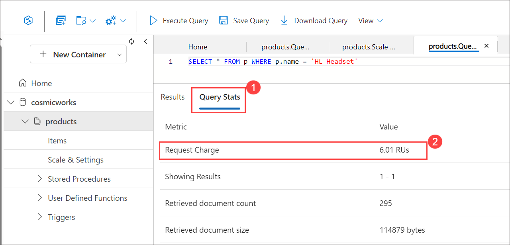

# Review the default index policy for an Azure Cosmos DB for NoSQL container with the portal

### Estimated Duration: 30 minutes

## Lab scenario

Every container in Azure Cosmos DB has an indexing policy that directs the service on how to index items within the container. By default, this indexing policy indexes every property of every item. The default indexing policy makes it easy to get started with Azure Cosmos DB quickly as you don't have to think about indexing, performance, and management at the start of a project.

In this lab, you'll observe and manipulate the default index policy for a few containers using the Data Explorer.

## Lab objectives

In this lab, you will complete the following tasks:
- Task 1: Create an Azure Cosmos DB NoSQL API account.
- Task 2: Seed the Azure Cosmos DB NoSQL API account with data.
- Task 3: View and manipulate the default indexing policy.

## Task 1: Review the default index policy for an Azure Cosmos DB SQL API container with the portal

In this task, you will provision an Azure Cosmos DB SQL account, configuring essential settings and retrieving the necessary connection details for future development.

Azure Cosmos DB is a cloud-based NoSQL database service that supports multiple APIs. When provisioning an Azure Cosmos DB account for the first time, you will select which of the APIs you want the account to support (for example, Mongo API or NoSQL API). Once the Azure Cosmos DB for NoSQL account is done provisioning, you can retrieve the endpoint and key and use them to connect to the Azure Cosmos DB for NoSQL account using the Azure SDK for .NET or any other SDK of your choice.

1. On **Azure Portal** page, in Search resources, services and docs (G+/) box at the top of the portal, enter **Azure Cosmos DB**, and then select **Azure Cosmos DB** under services.

   
   
1. Select **+ Create** under **Azure Cosmos DB for NoSQL** click on **Create** to create **Azure Cosmos DB for NoSQL** account.

    

    
   
1. Specify the following settings, leaving all remaining settings to their default values, and select **Review + create**:

    | **Setting** | **Value** |
    | --- | --- |
    | **Subscription** | *Your existing Azure subscription* |
    | **Resource group** | *Select an existing Cosmosdb-<inject key="DeploymentID" enableCopy="false"/>* |
    | **Account Name** | *sql-<inject key="DeploymentID" enableCopy="false"/>* |
    | **Location** | *Choose any available region* |
    | **Capacity mode** | *Provisioned throughput* |
    | **Apply Free Tier Discount** | *Do Not Apply* |
    | **Limit the total amount of throughput that can be provisioned on this account** | *Unchecked* |

     

1. Once after validation passed click on **Create**.

1. Wait for the deployment task to complete before continuing with this task.

1. Select **Go to resources**. On the newly created **Azure Cosmos DB** account under **Settings** navigate to the **Keys** pane.

    

    

1. This pane contains the connection details and credentials necessary to connect to the account from the SDK. Specifically:

    1. Record the value of the **URI** field. You will use this **endpoint** value later in this exercise.

    1. Record the value of the **PRIMARY KEY** field. You will use this **key** value later in this exercise.

        

1. Keep your web browser window or tab open.

    > **Congratulations** on completing the task! Now, it's time to validate it. Here are the steps:
    > - Hit the Validate button for the corresponding task. If you receive a success message, you can proceed to the next task. 
    > - If not, carefully read the error message and retry the step, following the instructions in the lab guide.
    > - If you need any assistance, please contact us at cloudlabs-support@spektrasystems.com. We are available 24/7 to help you out.

    <validation step="140fa89d-d46a-4ae0-a198-9c51019a9b40" />

### Task 2: Seed the Azure Cosmos DB NoSQL API account with data

In this task, you'll use the CosmicWorks tool to seed your Azure Cosmos DB NoSQL account with sample product data. After installing the tool in Visual Studio Code's terminal, you'll provide your Cosmos DB endpoint and key to run the seeding command. The tool will create a database, container, and insert product data into your account.

The [cosmicworks][nuget.org/packages/cosmicworks] command-line tool deploys sample data to any Azure Cosmos DB SQL API account. The tool is open-source and available through NuGet. You will install this tool to the Azure Cloud Shell and then use it to seed your database.

1. Start Visual Studio Code (the program icon is pinned to the Desktop).

   

1. In **Visual Studio Code**, open the **Terminal** menu by selecting **... (ellipses) (1)** > **Terminal (2)** > **New Terminal (3)** to open a new terminal with your 
   existing instance.

    

1. Install the [cosmicworks][nuget.org/packages/cosmicworks] command-line tool for global use on your machine.

    ```
    dotnet tool install cosmicworks --global --version 1.*
    ```
  
    > &#128161; This command may take a couple of minutes to complete. This command will output the warning message (*Tool 'cosmicworks' is already installed') if you have already installed the latest version of this tool in the past.
    
1. Once the Installation is completed, make sure to close the **Visual Studio Code** and re-open it to perform the below command.

1. Run cosmicworks to seed your Azure Cosmos DB account with the following command-line options:

    | **Option** | **Value** |
    | --- | --- |
    | **--endpoint** | *The endpoint value you copied earlier in this lab* |
    | **--key** | *The key value you coped earlier in this lab* |
    | **--datasets** | *product* |

    ```
    cosmicworks --endpoint <cosmos-endpoint> --key <cosmos-key> --datasets product
    ```

    > &#128221; For example, if your endpoint is: **https&shy;://dp420.documents.azure.com:443/** and your key is: **fDR2ci9QgkdkvERTQ==**, then the command would be:
    > ``cosmicworks --endpoint https://dp420.documents.azure.com:443/ --key fDR2ci9QgkdkvERTQ== --datasets product``

    >**Note**: If you're getting an error, close the Visual Studio code reopen it and try to run the command once again.

1. Wait for the **cosmicworks** command to finish populating the account with a database, container, and items.

1. Close the integrated terminal.

1. Close **Visual Studio Code**.

    > **Congratulations** on completing the task! Now, it's time to validate it. Here are the steps:
    > - Hit the Validate button for the corresponding task. If you receive a success message, you can proceed to the next task. 
    > - If not, carefully read the error message and retry the step, following the instructions in the lab guide.
    > - If you need any assistance, please contact us at cloudlabs-support@spektrasystems.com. We are available 24/7 to help you out.

    <validation step="eb8c6d06-bc6e-4170-a124-a95072d907a0" />

### Task 3: View and manipulate the default indexing policy

In this task, you'll view and modify the default indexing policy of a Cosmos DB container. After navigating to the Azure Cosmos DB in the Azure portal, you'll observe the default indexing policy, which indexes all paths except _etag. You'll then modify the policy to only index the /price path. After making the changes, you'll run SQL queries to compare the request charge before and after the indexing change, noting how the efficiency of queries changes based on which fields are indexed.

When a container is created by code, portal, or a tool; the indexing policy is set to an intelligent default if you do not specify it otherwise. You will observe that default indexing policy and make a change to the policy.

1. Navigate to the **Azure portal**.

1. On Azure Portal page, in Search resources, services and docs (G+/) box at the top of the portal, enter **Azure Cosmos DB**, and then select **Azure Cosmos DB** under 
   services.

   

1. Select **sql-<inject key="DeploymentID" enableCopy="false"/>**.

     
   
1. Within the **Azure Cosmos DB** account resource, navigate to the **Data Explorer** pane.

1. In the **Data Explorer**, expand the **cosmicworks** database node, then observe the new **products** container node within navigation tree and then select **New SQL Query**.

     

1. Delete the contents of the editor area.

1. Create a new SQL query that will return all documents where the **name** is equivalent to **HL Headset** and select Select **Execute Query**.

    ```
    SELECT * FROM p WHERE p.name = 'HL Headset'
    ```

   

1. Observe the results of the query.

1. Select **Query Stats**. observe the value of the **Request Charge** field within the **Query Statistics** section.

     
   
    > &#128221; All paths are currently indexed, so this query should be relatively efficient.

1. Within the **products** container node, select **Scale & Settings**.

1. Observe the default indexing policy within the **Indexing Policy** section:

    ```
    {
      "indexingMode": "consistent",
      "automatic": true,
      "includedPaths": [
        {
          "path": "/*"
        }
      ],
      "excludedPaths": [
        {
          "path": "/\"_etag\"/?"
        }
      ]
    }
    ```

    > &#128221; This default policy will index all possible paths with the exception of **_etag**.

1. Within the editor, replace the content of the indexing policy to only index the **/price** path and select **Save** to persist your changes.

    ```
    {
      "indexingMode": "consistent",
      "automatic": true,
      "includedPaths": [
        {
          "path": "/price/?"
        }
      ],
      "excludedPaths": [
        {
          "path": "/*"
        }
      ]
    }
    ```

   

1. Select **New SQL Query**.
  
1. Delete the contents of the editor area.

1. Create a new SQL query that will return all documents where the **name** is equivalent to **HL Headset** then select **Execute Query**.

    ```
    SELECT * FROM p WHERE p.name = 'HL Headset'
    ```

   
    
1. Observe the results of the query.

1. Select **Query Stats**, observe the value of the **Request Charge** field within the **Query Statistics** section.
     
    > &#128221; Now that the **name** property is not indexed, the request charge has increased.
    
    

1. Delete the contents of the editor area.

1. Create a new SQL query that will return all documents where the **price** is greater than **$3,000**:

    ```
    SELECT * FROM p WHERE p.price > 3000
    ```

1. Select **Execute Query**.

1. Observe the results of the query.

1. Select **Query Stats**, observe the value of the **Request Charge** field within the **Query Statistics** section.

## Summary

In this lab, you explored the indexing policy in Azure Cosmos DB, which controls how items in a container are indexed. By default, every property is indexed, providing efficient queries without requiring manual index management. The lab guided you through provisioning a Cosmos DB NoSQL account, seeding it with sample data, and reviewing the default indexing policy. You then modified the policy to index only the /price path and observed the effect on query efficiency and request charge. This exercise demonstrated the impact of customizing indexing policies on performance and query costs in Cosmos DB.

### Review

In this lab, you have completed:

- Create an Azure Cosmos DB for NoSQL account.
- Seed the Azure Cosmos DB for NoSQL account with data.
- Viewed and manipulated the default indexing policy.

### You have successfully completed the lab
