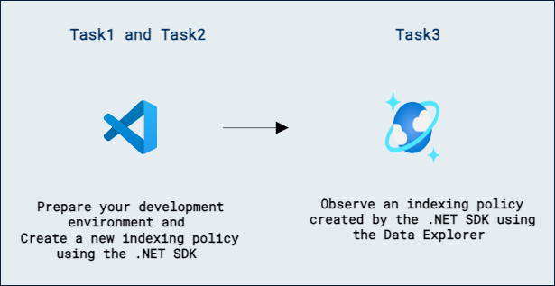

# Lab 06b - Azure Cosmos DB for NoSQL のインデックス戦略を定義して実装する

## ラボのシナリオ

インデックス ポリシーは、Azure Cosmos DB の SDK から管理できます。.NET SDK には、Azure Cosmos DB for NoSQL のコンテナーに新しいインデックス ポリシーを設計して適用するために使用できる一連のクラスが含まれています。

このラボでは、.NET SDK を使用してコンテナーのカスタム インデックス ポリシーを作成します。

## ラボの目的

このラボでは、次のタスクを完了します:
- タスク 1: 開発環境を準備する。
- タスク 2: .NET SDK を使用して新しいインデックス ポリシーを作成する。
- タスク 3: Data Explorer を使用して .NET SDK で作成したインデックス ポリシーを確認する。

## 推定所要時間: 30 分

## アーキテクチャ図




## 演習 1: ポータルで Azure Cosmos DB for NoSQL コンテナーのインデックス ポリシーを構成する

### タスク 1: 開発環境を準備する

このラボ用に **DP-420** のラボ コード リポジトリをまだ作業環境にクローンしていない場合は、次の手順に従ってください。既にクローン済みの場合は、**Visual Studio Code** で以前にクローンしたフォルダーを開きます。

1. **Visual Studio Code** を起動します（プログラム アイコンがデスクトップにピン留めされています）。

    > &#128221; Visual Studio Code のインターフェイスに不慣れな場合は、[Visual Studio Code の開始ガイド][code.visualstudio.com/docs/getstarted]を参照してください。

1. 左側のペインから **Extension (1)** アイコンを選択します。検索バーに **C# (2)** と入力し、表示された **extension (3)** を選択して、最後に **Install (4)** をクリックします。

    

1.  画面左上のオプションから **file->Open Folder** をクリックし、**C:\AllFiles** に移動します。

1.  フォルダー **dp-420-cosmos-db-dev-stage** を選択し、**Select Folder** をクリックします。

### タスク 2: .NET SDK を使用して新しいインデックス ポリシーを作成する

.NET SDK には、親クラス [Microsoft.Azure.Cosmos.IndexingPolicy][docs.microsoft.com/dotnet/api/microsoft.azure.cosmos.indexingpolicy] に関連するクラス群が含まれており、コード内で新しいインデックス ポリシーを構築できます。

1. **Visual Studio Code** の **Explorer** ペインで、**12-custom-index-policy** フォルダーに移動します。

1. **script.cs** コード ファイルを開きます。

1. 既存の **endpoint** 変数を、前のラボで作成した Azure Cosmos DB アカウントの **endpoint** 値に更新します。
  
    ```
    string endpoint = "<cosmos-endpoint>";
    ```

    > &#128221; たとえばエンドポイントが **https://dp420.documents.azure.com:443/** の場合、C# の文は **string endpoint = "https://dp420.documents.azure.com:443/";** になります。

1. 既存の **key** 変数を、前のラボで作成した Azure Cosmos DB アカウントの **key** 値に更新します。

    ```
    string key = "<cosmos-key>";
    ```

    > &#128221; たとえばキーが **fDR2ci9QgkdkvERTQ==** の場合、C# の文は **string key = "fDR2ci9QgkdkvERTQ==";** になります。

1. [IndexingPolicy][docs.microsoft.com/dotnet/api/microsoft.azure.cosmos.indexingpolicy] 型の新しい変数 **policy** を、デフォルトの空のコンストラクターを使用して作成します。

    ```
    IndexingPolicy policy = new ();
    ```

1. **policy** 変数の [IndexingMode][docs.microsoft.com/dotnet/api/microsoft.azure.cosmos.indexingpolicy.indexingmode] プロパティを [IndexingMode.Consistent][docs.microsoft.com/dotnet/api/microsoft.azure.cosmos.indexingmode#fields] の値に設定します。

    ```
    policy.IndexingMode = IndexingMode.Consistent;
    ```

1. [ExcludedPath][docs.microsoft.com/dotnet/api/microsoft.azure.cosmos.excludedpath] 型の新しいオブジェクトを、[ExcludedPaths][docs.microsoft.com/dotnet/api/microsoft.azure.cosmos.indexingpolicy.excludedpaths] コレクション プロパティに追加します。オブジェクトの [Path][docs.microsoft.com/dotnet/api/microsoft.azure.cosmos.excludedpath.path] プロパティには **/*** を設定します。

    ```
    policy.ExcludedPaths.Add(
        new ExcludedPath{ Path = "/*" }
    );
    ```

1. [IncludedPath][docs.microsoft.com/dotnet/api/microsoft.azure.cosmos.includedpath] 型の新しいオブジェクトを、[IncludedPaths][docs.microsoft.com/dotnet/api/microsoft.azure.cosmos.indexingpolicy.includedpaths] コレクション プロパティに追加します。オブジェクトの [Path][docs.microsoft.com/dotnet/api/microsoft.azure.cosmos.includedpath.path] プロパティには **/name/?** を設定します。

    ```
    policy.IncludedPaths.Add(
        new IncludedPath{ Path = "/name/?" }
    );
    ```

1. [ContainerProperties][docs.microsoft.com/dotnet/api/microsoft.azure.cosmos.containerproperties] 型の新しい変数 **options** を作成し、コンストラクター パラメーターに ``products`` と ``/categoryId`` を渡します。

    ```
    ContainerProperties options = new ("products", "/categoryId");
    ```

1. **options** 変数の [IndexingPolicy][docs.microsoft.com/dotnet/api/microsoft.azure.cosmos.containerproperties.indexingpolicy] プロパティに **policy** 変数を割り当てます。

    ```
    options.IndexingPolicy = policy;
    ```

1. **database** 変数の [CreateContainerIfNotExistsAsync][docs.microsoft.com/dotnet/api/microsoft.azure.cosmos.database.createcontainerifnotexistsasync] メソッドを非同期に呼び出し、**options** 変数を渡して結果を [Container][docs.microsoft.com/dotnet/api/microsoft.azure.cosmos.container] 型の **container** 変数に格納します。

    ```
    Container container = await database.CreateContainerIfNotExistsAsync(options);
    ```

1. 組み込みの **Console.WriteLine** 静的メソッドを使用して、コンテナー クラスの [Id][docs.microsoft.com/dotnet/api/microsoft.azure.cosmos.container.id] プロパティを **Container Created** というヘッダー付きで出力します:

    ```
    Console.WriteLine($"Container Created [{container.Id}]");
    ```

1. 作業が完了したら、コード ファイルには次の内容が含まれているはずです:
  
    ```
    using System;
    using Microsoft.Azure.Cosmos;

    string endpoint = "<cosmos-endpoint>";

    string key = "<cosmos-key>";

    CosmosClient client = new CosmosClient(endpoint, key);

    Database database = await client.CreateDatabaseIfNotExistsAsync("cosmicworks");
    
    IndexingPolicy policy = new ();
    policy.IndexingMode = IndexingMode.Consistent;
    policy.ExcludedPaths.Add(
        new ExcludedPath{ Path = "/*" }
    );
    policy.IncludedPaths.Add(
        new IncludedPath{ Path = "/name/?" }
    );

    ContainerProperties options = new ("products", "/categoryId");
    options.IndexingPolicy = policy;

    Container container = await database.CreateContainerIfNotExistsAsync(options);
    Console.WriteLine($"Container Created [{container.Id}]");
    ```

1. **script.cs** ファイルを **保存** します。

1. **Visual Studio Code** で **12-custom-index-policy** フォルダーのコンテキスト メニューを開き、**Open in Integrated Terminal** を選択して新しいターミナル インスタンスを開きます。

1. [dotnet run][docs.microsoft.com/dotnet/core/tools/dotnet-run] コマンドを使用してプロジェクトをビルドおよび実行します:

    ```
    dotnet run
    ```

1. スクリプトは、作成されたコンテナーの名前を次のように出力します:

    ```
    Container Created [products]
    ```

1. 統合ターミナルを閉じます。

1. **Visual Studio Code** を閉じます。

### タスク 3: Data Explorer を使用して .NET SDK で作成したインデックス ポリシーを確認する

他のインデックス ポリシーと同様に、Data Explorer を使用して .NET SDK で適用したポリシーを表示できます。ここでは、ポータルを使用して、コードからこのラボで作成したポリシーを確認します。

1. Web ブラウザーで Azure ポータル (``portal.azure.com``) に移動します。

1. **Resource groups** を選択し、このラボで作成または表示したリソース グループを選択し、このラボで作成した **Azure Cosmos DB アカウント** リソースを選択します。

1. **Azure Cosmos DB** アカウント リソース内で、**Data Explorer** ペインに移動します。

1. **Data Explorer** で **cosmicworks** データベース ノードを展開し、**API for NoSQL** ナビゲーション ツリー内の新しい **products** コンテナー ノードを確認します。

1. **API for NoSQL** ナビゲーション ツリーの **products** コンテナー ノード内で、**Scale & Settings** を選択します。

1. **Indexing Policy** セクションでインデックス ポリシーを確認します:

    ```
    {
      "indexingMode": "consistent",
      "automatic": true,
      "includedPaths": [
        {
          "path": "/name/?"
        }
      ],
      "excludedPaths": [
        {
          "path": "/*"
        },
        {
          "path": "/\"_etag\"/?"
        }
      ]
    }
    ```

    > &#128221; これは、このラボで .NET SDK を使用して作成したインデックス ポリシーの JSON 表現です。

1. Web ブラウザーのウィンドウまたはタブを閉じます。

### レビュー

このラボでは、次の作業を完了しました:

- 開発環境を準備しました。
- .NET SDK を使用して新しいインデックス ポリシーを作成しました。
- Data Explorer を使用して .NET SDK で作成したインデックス ポリシーを確認しました。

### このラボを正常に完了しました
