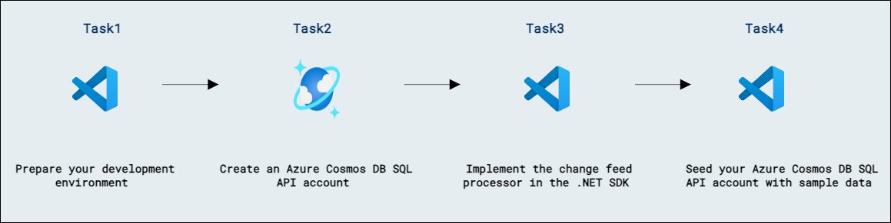

# Lab 07a - Azure Cosmos DB SQL API を Azure サービスと統合する

## ラボのシナリオ

Azure Cosmos DB SQL API の change feed は、プラットフォームのイベントによって駆動される補助アプリケーションを作成するための鍵です。Azure Cosmos DB SQL API の .NET SDK には、change feed と統合し、コンテナー内の操作に関する通知を受け取るアプリケーションを構築するための一連のクラスが含まれています。

このラボでは、.NET SDK の change feed processor 機能を使用して、指定したコンテナー内のアイテムに対して作成または更新操作が行われたときに通知されるアプリケーションを作成します。

## ラボの目的

このラボでは、次のタスクを完了します:
- タスク 1: 開発環境を準備する。
- タスク 2: Azure Cosmos DB SQL API アカウントを作成する。
- タスク 3: .NET SDK で change feed processor を実装する。
- タスク 4: Azure Cosmos DB SQL API アカウントにサンプル データをシードする。

## 推定所要時間: 60 分

## アーキテクチャ図



## 演習 1: Azure Cosmos DB SQL API SDK を使用して change feed イベントを処理する

### タスク 1: 開発環境を準備する

このラボ用に **DP-420** のラボ コード リポジトリをまだ作業環境にクローンしていない場合は、次の手順に従ってください。既にクローン済みの場合は、**Visual Studio Code** で以前にクローンしたフォルダーを開きます。

1. Visual Studio Code を起動します（プログラム アイコンがデスクトップにピン留めされています）。

1. 左側のペインから **Extension (1)** アイコンを選択します。検索バーに **C# (2)** と入力し、表示された **extension (3)** を選択し、最後に **Install (4)** をクリックします。

    

1.  画面左上のオプションから **file->Open Folder** をクリックし、**C:\AllFiles** に移動します。

1.  フォルダー **dp-420-cosmos-db-dev-stage** を選択し、**Select Folder** をクリックします。

### タスク 2: Azure Cosmos DB SQL API アカウントを作成する

Azure Cosmos DB は、複数の API をサポートするクラウドベースの NoSQL データベース サービスです。Azure Cosmos DB アカウントを初めてプロビジョニングする際には、アカウントでサポートする API を選択します（たとえば **Mongo API** や **SQL API**）。Azure Cosmos DB SQL API アカウントのプロビジョニングが完了したら、エンドポイントとキーを取得し、Azure SDK for .NET やその他の SDK を使用してそのアカウントに接続できます。

1. 新しい Web ブラウザーのウィンドウまたはタブで、Azure ポータル (``portal.azure.com``) に移動します。

1. サブスクリプションに関連付けられた Microsoft 資格情報を使用してポータルにサインインします。

1. **Azure services** カテゴリで **Create a resource** を選択し、次に **Azure Cosmos DB** を選択します。

    > &#128161; 代替手順として、**&#8801;** メニューを展開し、**All Services** を選択し、**Databases** カテゴリで **Azure Cosmos DB** を選択し、次に **Create** を選択します。

1. **Select API option** ペインで、**Azure Cosmos DB for NoSQL** セクションの **Create** オプションを選択します。

1. **Create Azure Cosmos DB Account** ペインで、**Basics** タブを確認します。

    | **Setting** | **Value** |
    | --- | --- |
    | **Subscription** | *既存の Azure サブスクリプション* |
    | **Resource group** | *既存のリソース グループを選択* |
    | **Account Name** | *グローバルに一意の名前を入力* |
    | **Location** | *利用可能なリージョンを選択* |
    | **Capacity mode** | *Serverless* |

    > &#128221; ラボ環境によっては、新しいリソース グループを作成できない制限がある場合があります。その場合は、既存の事前作成済みリソース グループを使用してください。

1. **Review + Create** をクリックし、検証が成功したら **Create** をクリックします。

1. デプロイが完了するまで待ちます。

1. 新しく作成した **Azure Cosmos DB** アカウント リソースに移動し、**Keys** ペインに移動します。

1. このペインには、SDK からアカウントに接続するために必要な接続情報と資格情報が含まれています。具体的には:

    1. **URI** フィールドの値を記録します。この **endpoint** 値は、この演習で後ほど使用します。

    1. **PRIMARY KEY** フィールドの値を記録します。この **key** 値は、この演習で後ほど使用します。

1. リソース メニューから **Data Explorer** を選択します。

1. **Data Explorer** ペインで **New Container** を展開し、**New Database** を選択します。

1. **New Database** ポップアップで、各設定に次の値を入力し、**OK** を選択します:

    | **Setting** | **Value** |
    | --- | --- |
    | **Database id** | *cosmicworks* |

1. **Data Explorer** ペインに戻り、階層内の **cosmicworks** データベース ノードを確認します。

1. **Data Explorer** ペインで **New Container** を選択します。

1. **New Container** ポップアップで、各設定に次の値を入力し、**OK** を選択します:

    | **Setting** | **Value** |
    | --- | --- |
    | **Database id** | *Use existing* &vert; *cosmicworks* |
    | **Container id** | *products* |
    | **Partition key** | */categoryId* |

1. **Data Explorer** ペインに戻り、**cosmicworks** データベース ノードを展開し、階層内の **products** コンテナー ノードを確認します。

1. **Data Explorer** ペインで再度 **New Container** を選択します。

1. **New Container** ポップアップで、各設定に次の値を入力し、**OK** を選択します:

    | **Setting** | **Value** |
    | --- | --- |
    | **Database id** | *Use existing* &vert; *cosmicworks* |
    | **Container id** | *productslease* |
    | **Partition key** | */partitionKey* |

1. **Data Explorer** ペインに戻り、**cosmicworks** データベース ノードを展開し、階層内の **productslease** コンテナー ノードを確認します。

1. Web ブラウザーのウィンドウまたはタブを閉じます。

### タスク 3: .NET SDK で change feed processor を実装する

**Microsoft.Azure.Cosmos.Container** クラスには、change feed processor をフルーエントに構築するための一連のメソッドが含まれています。開始するには、監視対象コンテナー、リース コンテナー、および各変更バッチを処理するための C# のデリゲートが必要です。

1. **Visual Studio Code** の **Explorer** ペインで **13-change-feed** フォルダーに移動します。

1. **product.cs** コード ファイルを開きます。

1. **Product** クラスとその対応するプロパティを確認します。特に、このラボでは **id** と **name** のプロパティを使用します。

1. **Visual Studio Code** の **Explorer** ペインに戻り、**script.cs** コード ファイルを開きます。

1. 既存の **endpoint** 変数を、先ほど作成した Azure Cosmos DB アカウントの **endpoint** 値に更新します。
  
    ```
    string endpoint = "<cosmos-endpoint>";
    ```

    > &#128221; たとえば、エンドポイントが **https://dp420.documents.azure.com:443/** の場合、C# 文は **string endpoint = "https://dp420.documents.azure.com:443/";** になります。

1. 既存の **key** という名前の変数を、先ほど作成した Azure Cosmos DB アカウントの **key** 値に更新します。

    ```
    string key = "<cosmos-key>";
    ```

    > &#128221; たとえばキーが **fDR2ci9QgkdkvERTQ==** の場合、C# 文は **string key = "fDR2ci9QgkdkvERTQ==";** になります。

1. **client** 変数の **GetContainer** メソッドを使用して、データベース名 (*cosmicworks*) とコンテナー名 (*products*) を使って既存のコンテナーを取得し、結果を **Container** 型の **sourceContainer** という名前の変数に格納します:

    ```
    Container sourceContainer = client.GetContainer("cosmicworks", "products");
    ```

1. **client** 変数の **GetContainer** メソッドを使用して、データベース名 (*cosmicworks*) とコンテナー名 (*productslease*) を使って既存のコンテナーを取得し、結果を **Container** 型の **leaseContainer** という名前の変数に格納します:

    ```
    Container leaseContainer = client.GetContainer("cosmicworks", "productslease");
    ```

1. [ChangesHandler<>][docs.microsoft.com/dotnet/api/microsoft.azure.cosmos.container.changefeedhandler-1] 型の新しいデリゲート変数 **handleChanges** を、2 つの入力パラメーターを持つ空の非同期匿名関数として作成します:

    1. **IReadOnlyCollection\<Product\>** 型の **changes** という名前のパラメーター。

    1. **CancellationToken** 型の **cancellationToken** という名前のパラメーター。

    ```
    ChangesHandler<Product> handleChanges = async (
        IReadOnlyCollection<Product> changes, 
        CancellationToken cancellationToken
    ) => {
    };
    ```

1. 匿名関数内で、組み込みの **Console.WriteLine** 静的メソッドを使用して、生の文字列 **START\tHandling batch of changes...** を出力します:

    ```
    Console.WriteLine($"START\tHandling batch of changes...");
    ```

1. 引き続き匿名関数内で、**changes** 変数を反復処理する foreach ループを作成し、**Product** 型のインスタンスを表す変数 **product** を使用します:

    ```
    foreach(Product product in changes)
    {
    }
    ```

1. 匿名関数の foreach ループ内で、組み込みの非同期 **Console.WriteLineAsync** 静的メソッドを使用して、**product** 変数の **id** と **name** プロパティを出力します:

    ```
    await Console.Out.WriteLineAsync($"Detected Operation:\t[{product.id}]\t{product.name}");
    ```

1. foreach ループと匿名関数の外部で、**sourceContainer** 変数の [GetChangeFeedProcessorBuilder<>][docs.microsoft.com/dotnet/api/microsoft.azure.cosmos.container.getchangefeedprocessorbuilder] を呼び出した結果を格納する新しい変数 **builder** を作成します。次のパラメーターを使用します:

    | **Parameter** | **Value** |
    | --- | --- |
    | **processorName** | *productsProcessor* |
    | **onChangesDelegate** | *handleChanges* |

    ```
    var builder = sourceContainer.GetChangeFeedProcessorBuilder<Product>(
        processorName: "productsProcessor",
        onChangesDelegate: handleChanges
    );
    ```

1. [WithInstanceName][docs.microsoft.com/dotnet/api/microsoft.azure.cosmos.changefeedprocessorbuilder.withinstancename] メソッドに **consoleApp** を、[WithLeaseContainer][docs.microsoft.com/dotnet/api/microsoft.azure.cosmos.changefeedprocessorbuilder.withleasecontainer] メソッドに **leaseContainer** を渡し、[Build][docs.microsoft.com/dotnet/api/microsoft.azure.cosmos.changefeedprocessorbuilder.build] メソッドをフルーエントに呼び出して、結果を [ChangeFeedProcessor][docs.microsoft.com/dotnet/api/microsoft.azure.cosmos.changefeedprocessor] 型の **processor** という名前の変数に格納します:

    ```
    ChangeFeedProcessor processor = builder
        .WithInstanceName("consoleApp")
        .WithLeaseContainer(leaseContainer)
        .Build();
    ```

1. **processor** 変数の [StartAsync][docs.microsoft.com/dotnet/api/microsoft.azure.cosmos.changefeedprocessor.startasync] を非同期に呼び出します:

    ```
    await processor.StartAsync();
    ```

1. 組み込みの **Console.WriteLine** と **Console.ReadKey** 静的メソッドを使用して、コンソールに出力を表示し、キー押下を待機します:

    ```
    Console.WriteLine($"RUN\tListening for changes...");
    Console.WriteLine("Press any key to stop");
    Console.ReadKey();  
    ```

1. **processor** 変数の [StopAsync][docs.microsoft.com/dotnet/api/microsoft.azure.cosmos.changefeedprocessor.stopasync] を非同期に呼び出します:

    ```
    await processor.StopAsync();
    ```

1. 作業が完了したら、コード ファイルには次の内容が含まれているはずです:
  
    ```
    using Microsoft.Azure.Cosmos;
    using static Microsoft.Azure.Cosmos.Container;

    string endpoint = "<cosmos-endpoint>";
    string key = "<cosmos-key>";

    CosmosClient client = new CosmosClient(endpoint, key);
    
    Container sourceContainer = client.GetContainer("cosmicworks", "products");
    Container leaseContainer = client.GetContainer("cosmicworks", "productslease");
    
    ChangesHandler<Product> handleChanges = async (
        IReadOnlyCollection<Product> changes, 
        CancellationToken cancellationToken
    ) => {
        Console.WriteLine($"START\tHandling batch of changes...");
        foreach(Product product in changes)
        {
            await Console.Out.WriteLineAsync($"Detected Operation:\t[{product.id}]\t{product.name}");
        }
    };
    
    var builder = sourceContainer.GetChangeFeedProcessorBuilder<Product>(
            processorName: "productsProcessor",
            onChangesDelegate: handleChanges
        );
    
    ChangeFeedProcessor processor = builder
        .WithInstanceName("consoleApp")
        .WithLeaseContainer(leaseContainer)
        .Build();
    
    await processor.StartAsync();
    
    Console.WriteLine($"RUN\tListening for changes...");
    Console.WriteLine("Press any key to stop");
    Console.ReadKey();
    
    await processor.StopAsync();
    ```

1. **script.cs** ファイルを **保存** します。

1. **Visual Studio Code** で **13-change-feed** フォルダーのコンテキスト メニューを開き、**Open in Integrated Terminal** を選択して新しいターミナル インスタンスを開きます。

1. [dotnet run][docs.microsoft.com/dotnet/core/tools/dotnet-run] コマンドを使用してプロジェクトをビルドおよび実行します:

    ```
    dotnet run
    ```

1. **Visual Studio Code** とターミナルの両方を開いたままにします。

    > &#128221; Azure Cosmos DB SQL API コンテナーにアイテムを生成するために別のツールを使用します。アイテムを生成したら、このターミナルに戻って出力を確認します。ターミナルを早期に閉じないでください。

### タスク 4: Azure Cosmos DB SQL API アカウントにサンプル データをシードする

このラボでは、**cosmicworks** データベースと **products** コンテナーを作成するコマンドライン ユーティリティを使用します。その後、ツールは一連のアイテムを作成し、ターミナル ウィンドウで実行中の change feed processor でそれらを観察します。

1. **Visual Studio Code** で **Terminal** メニューを開き、**Split Terminal** を選択して、新しいターミナルを既存のインスタンスと並べて開きます。

1. マシンでグローバルに使用するために [cosmicworks][nuget.org/packages/cosmicworks] コマンドライン ツールをインストールします。

    ```
    dotnet tool install --global cosmicworks
    ```

    > &#128161; このコマンドは完了するまで数分かかる場合があります。最新バージョンのツールが以前にインストールされている場合は、(*Tool 'cosmicworks' is already installed*) という警告メッセージが表示されます。

1. 次のコマンドライン オプションを使用して、cosmicworks を実行し、Azure Cosmos DB アカウントにデータをシードします:

    | **Option** | **Value** |
    | --- | --- |
    | **--endpoint** | *The endpoint value you copied earlier in this lab* |
    | **--key** | *The key value you coped earlier in this lab* |
    | **--datasets** | *product* |

    ```
    cosmicworks --endpoint <cosmos-endpoint> --key <cosmos-key> --datasets product
    ```

    > &#128221; たとえばエンドポイントが **https://dp420.documents.azure.com:443/** でキーが **fDR2ci9QgkdkvERTQ==** の場合、コマンドは次のようになります:
    > ``cosmicworks --endpoint https://dp420.documents.azure.com:443/ --key fDR2ci9QgkdkvERTQ== --datasets product```
    
    >**注意**: エラーが発生した場合は、Visual Studio Code を閉じて再度開き、もう一度コマンドを実行してみてください。

1. **cosmicworks** コマンドがアカウントにデータベース、コンテナー、アイテムを作成し終えるまで待ちます。

1. .NET アプリケーションのターミナル出力を確認します。change feed で送信された各変更について、ターミナルに **Detected Operation** メッセージが出力されます。

1. 両方の統合ターミナルを閉じます。

1. **Visual Studio Code** を閉じます。

### レビュー

このラボでは、次の作業を完了しました:

- 開発環境を準備しました。
- Azure Cosmos DB SQL API アカウントを作成しました。
- .NET SDK で change feed processor を実装しました。
- Azure Cosmos DB SQL API アカウントにサンプル データをシードしました。

### このラボを正常に完了しました
