# Azure Functions を使用して Azure Cosmos DB for NoSQL データを処理する

## ラボのシナリオ

Azure Functions の Azure Cosmos DB トリガーは change feed processor を使用して実装されています。この知識を使って、Azure Cosmos DB for NoSQL コンテナーの作成および更新操作に応答する関数を作成できます。change feed processor を手動で実装したことがある場合、Azure Functions のセットアップは似ています。

## ラボの目的

このラボでは、次のタスクを完了します:
- タスク 1: Azure Cosmos DB for NoSQL アカウントを作成する
- タスク 2: Application Insight を作成する
- タスク 3: Azure Function アプリと Azure Cosmos DB トリガー関数を作成する
- タスク 4: .NET で関数コードを実装する
- タスク 5: Azure Cosmos DB for NoSQL アカウントにサンプル データをシードする

## 推定所要時間: 60 分

## アーキテクチャ図

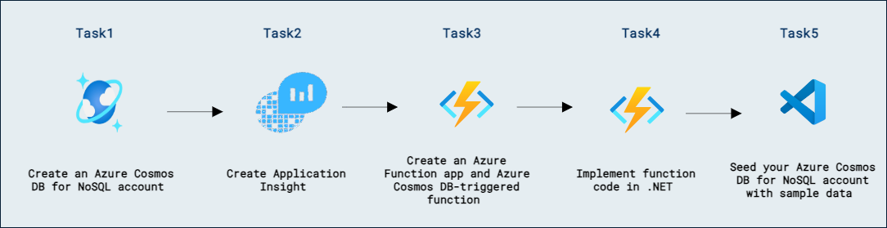

## タスク 1: Azure Cosmos DB for NoSQL アカウントを作成する

このタスクでは、Azure Cosmos DB SQL アカウントをプロビジョニングし、重要な設定を構成し、今後の開発に必要な接続情報を取得します。

Azure Cosmos DB は複数の API をサポートするクラウドベースの NoSQL データベース サービスです。Azure Cosmos DB アカウントを初めてプロビジョニングする際には、アカウントでサポートする API を選択します（たとえば **API for MongoDB** や **API for NoSQL**）。Azure Cosmos DB for NoSQL アカウントのプロビジョニングが完了したら、エンドポイントとキーを取得し、Azure SDK for .NET やその他の SDK を使用してそのアカウントに接続できます。

1. **Azure Portal** ページで、ポータル上部の「Search resources, services and docs (G+/)」ボックスに **Azure Cosmos DB (1)** と入力し、サービスの一覧から **Azure Cosmos DB (2)** を選択します。

   
   
1. **Azure Cosmos DB for NoSQL** の下で **+ Create (1)** を選択します。

    

    - **Create (2)** をクリックして **Azure Cosmos DB for NoSQL** アカウントを作成します。

      

1. 次の設定を指定し、残りの設定はすべて既定値のままにして **Review + create (9)** を選択します:

    | **設定** | **値** |
    | :--- | :--- |
    | **Workload Type** | *Learning* **(1)** |    
    | **Subscription** | *Your existing Azure subscription* **(2)** |
    | **Resource group** | *Select an existing Cosmosdb-<inject key="DeploymentID" enableCopy="false"/>* **(3)** |
    | **Account Name** | *sql-<inject key="DeploymentID" enableCopy="false"/>* **(4)** |
    | **Location** | *Choose any available region* **(5)** |
    | **Capacity mode** | *Provisioned throughput* **(6)** |
    | **Apply Free Tier Discount** | *Do Not Apply* **(7)** |
    | **Limit total account throughput** | *Disable* **(8)** |        

    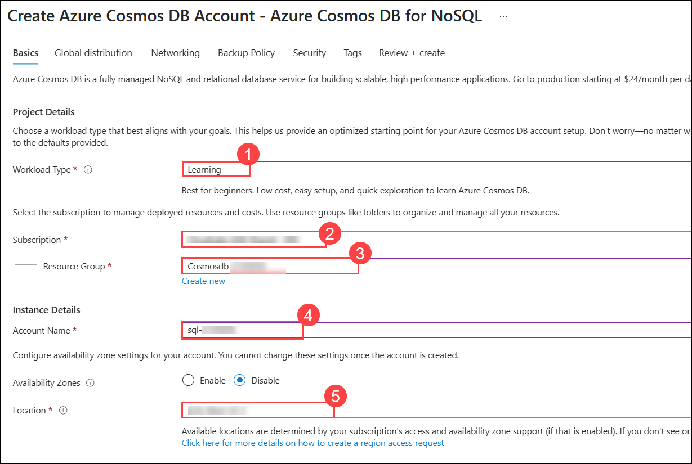 
    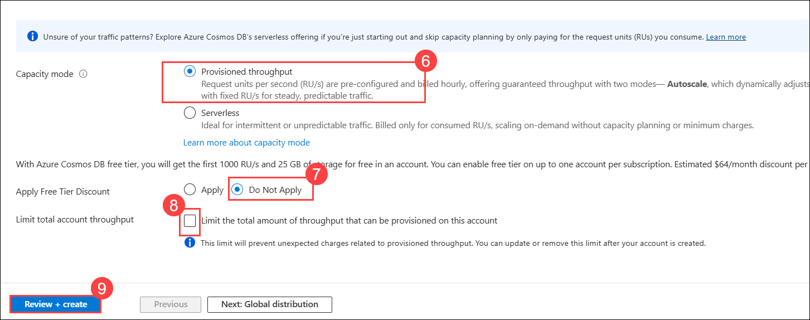        
   
1. 検証が完了したら **Create** をクリックします。

1. デプロイが完了するまで待ちます。

1. **Go to resources** を選択します。新しく作成した **Azure Cosmos DB** アカウントで、**Settings** の下にある **Keys** ペインに移動します。

    

    

1. このペインには、SDK からアカウントに接続するために必要な接続情報と資格情報が含まれています。具体的には:

    - **URI (1)** フィールドの値を記録します。この **endpoint** 値は、この演習で後ほど使用します。

    - **PRIMARY KEY (2)** フィールドの値を記録します。この **key** 値は、この演習で後ほど使用します。

      

1. リソース メニューから **Data Explorer** を選択します。

     >**注意**: ポップアップの右上にある「X」ボタンをクリックします。

1. **Data Explorer** ペインで **+ New Container (1)** を展開し、ドロップダウンから **+ New Database (2)** を選択します。

    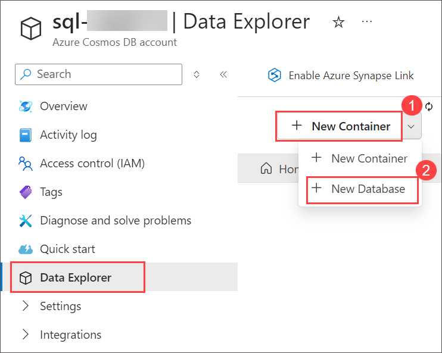
      
1. **New Database** ポップアップで、各設定に次の値を入力し、**OK (5)** を選択します:

    | **設定** | **値** |
    | --: | :-- |
    | **Database id** | *``cosmicworks``* **(1)** |
    | **Provision throughput** | enabled **(2)** |
    | **Database throughput** | **Manual (3)** |
    | **Database Required RU/s** | ``1000`` **(4)** |

    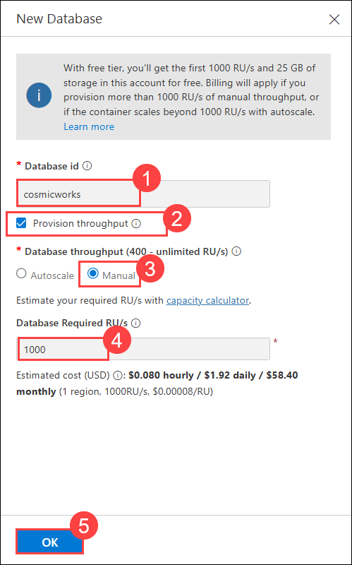

1. **Data Explorer** ペインに戻り、階層内の **cosmicworks** データベース ノードを確認します。

      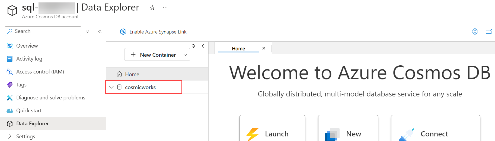
   
1. **Data Explorer** ペインで **+ New Container (1)** > **+ New Container (2)** を選択します。

     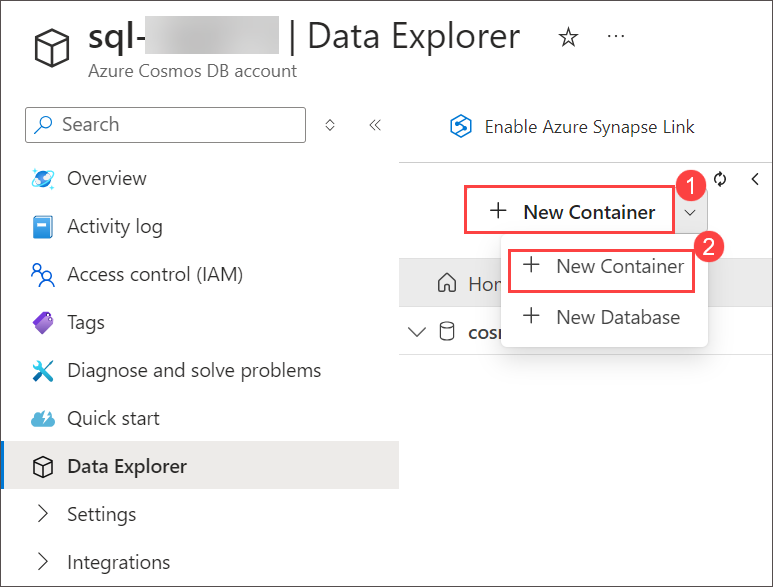

1. **New Container** ポップアップで、各設定に次の値を入力し、**OK (5)** を選択します:

    | **設定** | **値** |
    | :-- | :-- |
    | **Database id** | *Use existing (1)* &vert; *cosmicworks (2)* |
    | **Container id** | *``products`` (3)* |
    | **Partition key** | *``/category/name`` (4)* |

    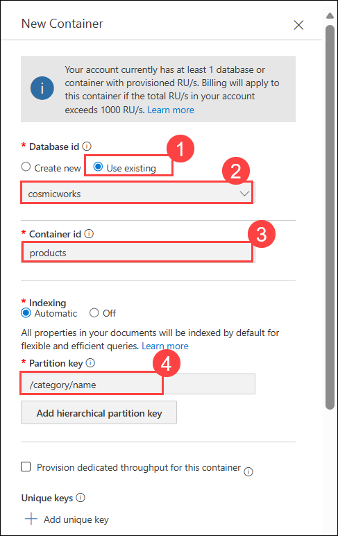
    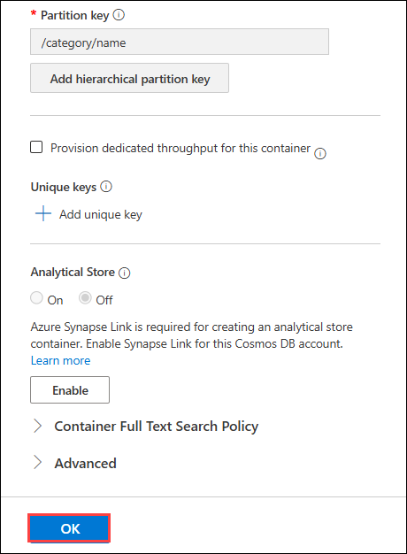    

1. **Data Explorer** ペインに戻り、**cosmicworks** データベース ノードを展開して、階層内に **products** コンテナー ノードが表示されていることを確認します。

1. **Data Explorer** ペインで、再度 **+ New Container (1)** > **+ New Container (2)** を選択します。

    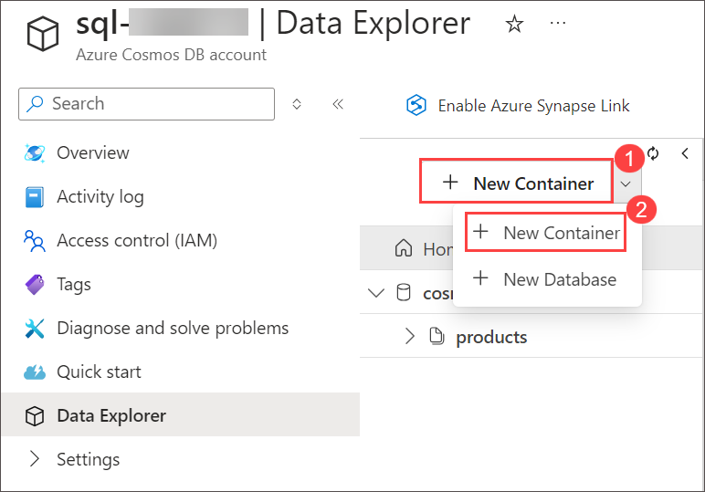

1. **New Container** ポップアップで、各設定に次の値を入力し、**OK** を選択します:

    | **設定** | **値** |
    | :-- | :-- |
    | **Database id** | *Use existing* &vert; *cosmicworks* |
    | **Container id** | *``productslease``* |
    | **Partition key** | *``/id``* |

      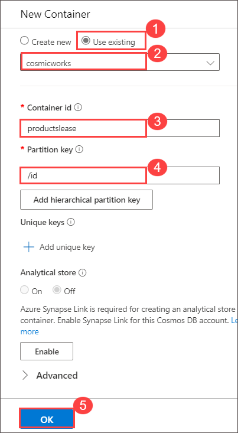
   
1. **Data Explorer** ペインに戻り、**cosmicworks** データベース ノードを展開して、階層内に **productslease** コンテナー ノードが表示されていることを確認します。

     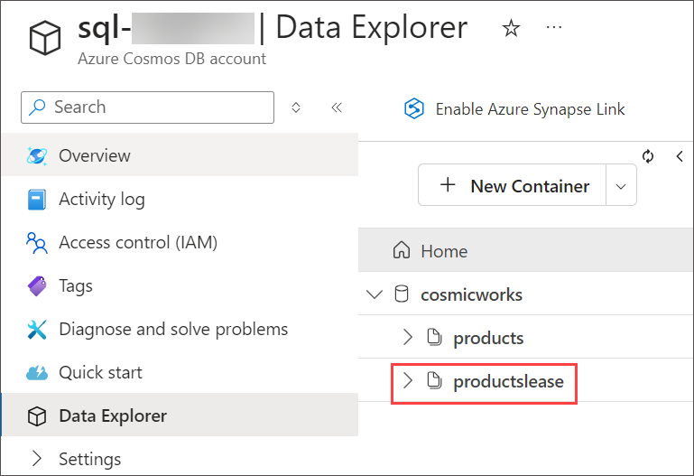
   
1. Azure ポータルの **Home** に戻ります。

    > **おめでとうございます**。タスクが完了しました！次に検証を行います。手順は次のとおりです:
    > - 対応するタスクの **Validate** ボタンを押します。成功メッセージが表示された場合は次のタスクに進みます。
    > - そうでない場合は、エラーメッセージをよく読み、ラボ ガイドの指示に従って手順をやり直します。
    > - サポートが必要な場合は cloudlabs-support@spektrasystems.com までご連絡ください。24 時間 365 日対応しています。
    
    <validation step="8ec90c15-4d62-42be-8eff-76a215f8689b" />

## タスク 2: Application Insight を作成する

このタスクでは、Azure Function アプリケーションを監視するための Azure Application Insights を設定します。まず、監視データを保存する Log Analytics ワークスペースを作成します。次に、Application Insights インスタンスを作成して Log Analytics ワークスペースにリンクし、アプリケーションのパフォーマンスとアクティビティを追跡できるようにします。

1. **Azure Portal** のページで、ポータル上部の「Search resources, services and docs (G+/)」ボックスに **Log Analytics workspaces (1)** と入力し、サービス一覧から **Log Analytics workspaces (2)** を選択します。

    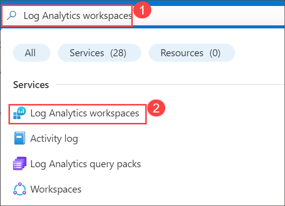
        
1. **+ Create** を選択して、新しい *Log Analytics* ワークスペースを作成します。

    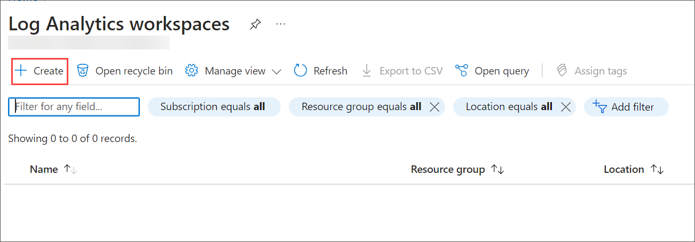

1. **Log Analytics workspace** ダイアログで、各設定に次の値を入力し、**Review + Create (5)** を選択します:

    | **設定** | **値** |
    | :--- | :--- |
    | **Subscription** | *Your existing Azure subscription* **(1)** |
    | **Resource group** | *Select an existing or create a new resource group* **(2)** |
    | **Name** | *``lab14laworkspace``* **(3)** |
    | **Location** | *Choose any available region* **(4)** |

     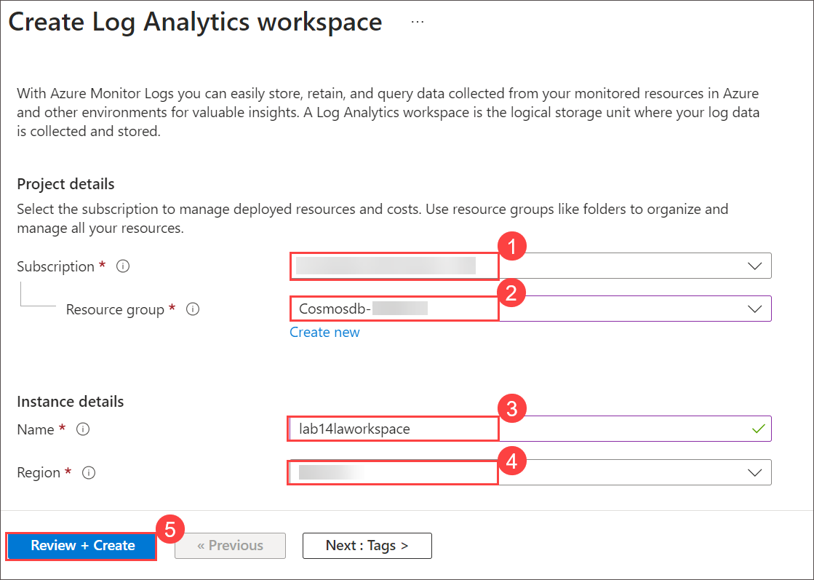

1. その後、**Create** を選択します。
   
1. *Log Analytics workspace* が作成されたら、検索ボックスで **Application Insights** を検索します。

    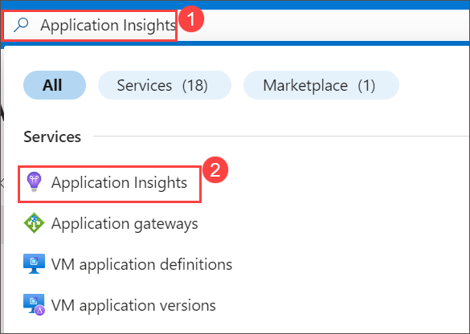

1. **+ Create** を選択して、新しい *Application Insights* を作成します。

1. **Application Insights** ダイアログで、各設定に次の値を入力し、**Review + Create (5)** を選択します:

    | **設定** | **値** |
    | :--- | :--- |
    | **Subscription (both entries)** | *Your existing Azure subscription* **(1)** |
    | **Resource group** | *Select an existing Cosmosdb-<inject key="DeploymentID" enableCopy="false"/>* **(2)** |
    | **Name** | **``lab14appinsight`` (3)** |
    | **Location** | **Choose any available region (4)** |
    | **Log Analytics Workspace** | **lab14laworkspace (5)** |

     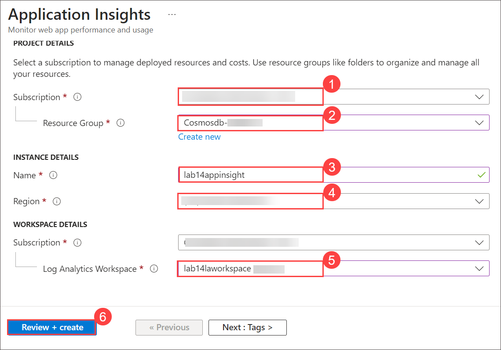

1. その後、**Create** を選択します。
     
1. これでアプリケーション関数を監視できるようになります。

    > **おめでとうございます**。タスクが完了しました！次に検証を行います。手順は次のとおりです:
    > - 対応するタスクの **Validate** ボタンを押します。成功メッセージが表示された場合は次のタスクに進みます。
    > - そうでない場合は、エラーメッセージをよく読み、ラボ ガイドの指示に従って手順をやり直します。
    > - サポートが必要な場合は cloudlabs-support@spektrasystems.com までご連絡ください。24 時間 365 日対応しています。
    
    <validation step="d6eb6de3-1d82-40ff-a083-c08a5887fd64" />

## タスク 3: Azure Function アプリと Azure Cosmos DB トリガー関数を作成する

このタスクでは、Cosmos DB トリガー関数を持つ Azure Function アプリを作成します。最初に Azure Portal で Function アプリをセットアップし、必要な構成を指定します。デプロイが完了したら、Azure Cosmos DB トリガーテンプレートを使用して新しい関数を作成し、以前に作成した Cosmos DB アカウントに接続し、データベースとコンテナーの詳細を指定します。これにより、コンテナー内の変更に応じて関数が実行されます。

1. Azure ポータルのホームページで **+ Create a resource** を選択します。

     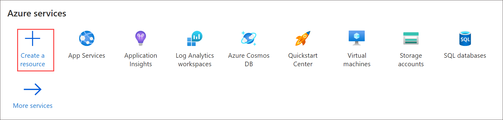
   
1. **Functions** を検索し、**Function app** を選択します。その後、マーケットプレース ページで **Function app** を選択します。

    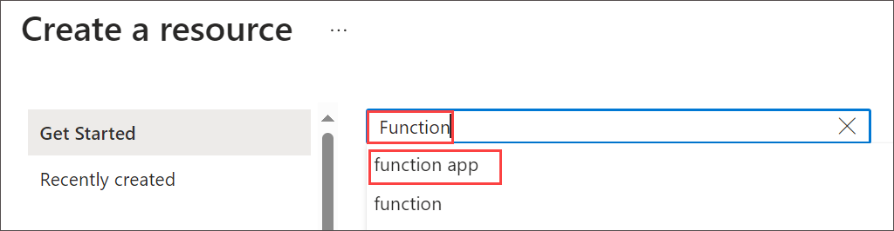

    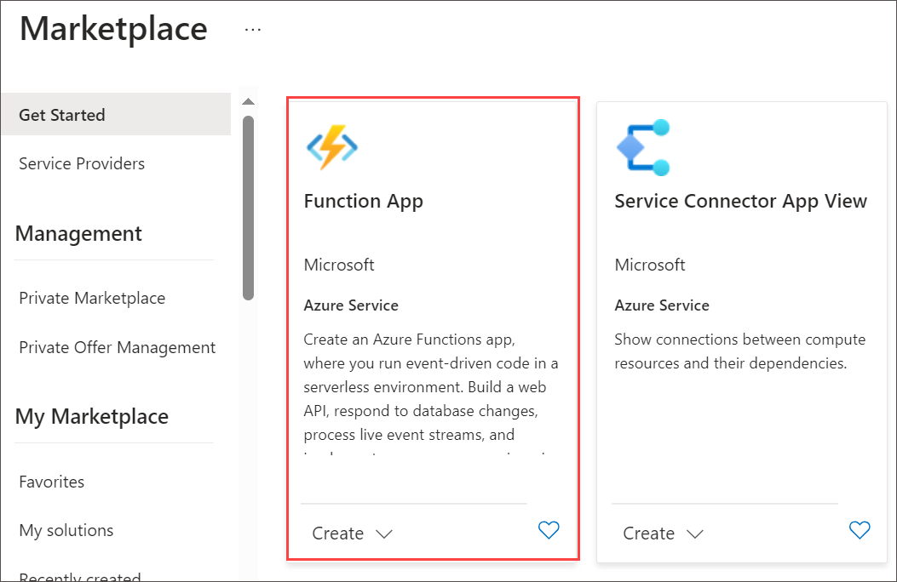

1. **Function App** ページで **Create** をクリックします。

    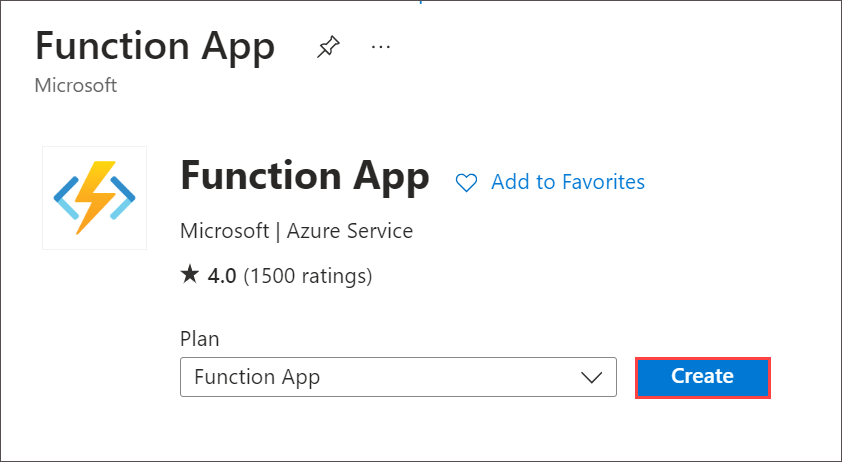

1. **Select a hosting option** ページで **App service (1)** を選択し、次に **Select (2)** を選択します。    

    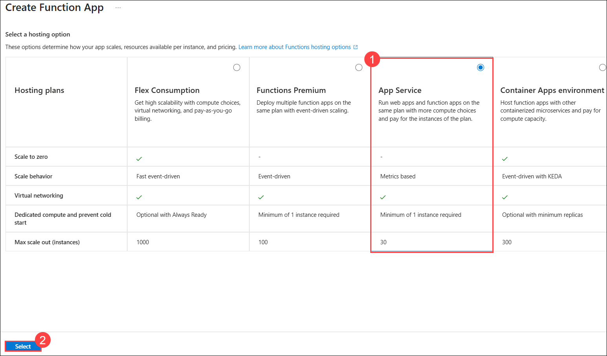
   
1. 次の設定を指定し、残りの設定はすべて既定値のままにして **Review + Create (8)** を選択します。

    | **設定** | **値** |
    | :--- | :--- |
    | **Subscription** | *Your existing Azure subscription* **(1)** |
    | **Resource group** | *Select an existing or create a new resource group* **(2)** |
    | **Name** | **functionapp-<inject key="DeploymentID" enableCopy="false"/> (3)** |
    | **Publish** | **Code (4)** |
    | **Runtime stack** | **.NET (5)** |
    | **Version** | **8 (LTS) in-process model (6)** |
    | **Region** | *Choose any available region* **(7)** |

    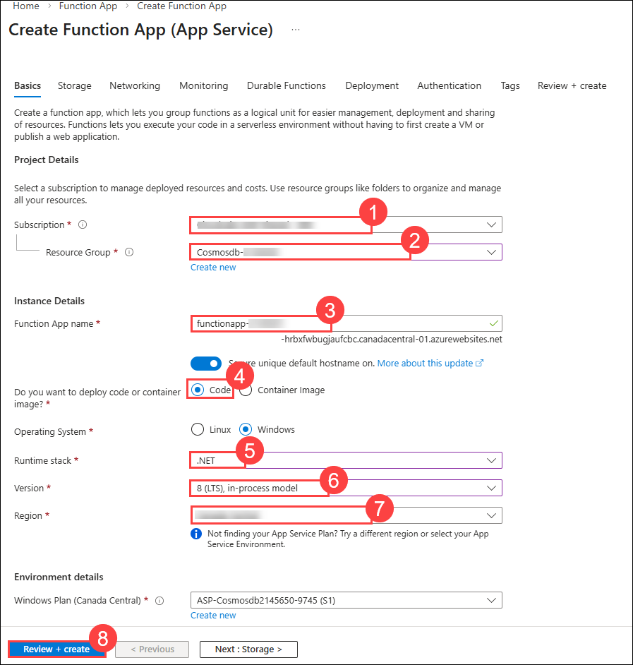

1. その後、**Create** を選択します。    

1. このタスクを続行する前に、デプロイが完了するまで待ちます。

1. **Go to resource** を選択して、作成した **Azure Functions** リソースに移動します。

1. **Functions (1)** ペインに移動します。**Functions** ペインで **Create in Azure Portal (2)** を選択します。

    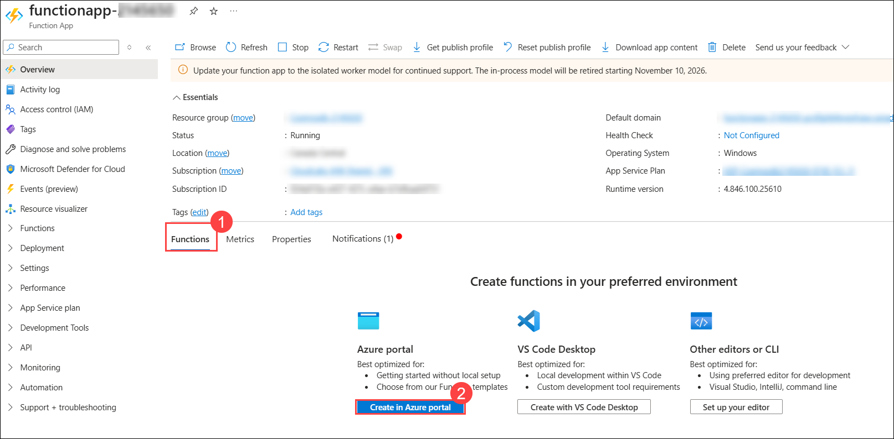

1. **Create function** ポップアップの **Select a template** タブで **Azure Cosmos DB trigger (1)** を選択し、**Next (2)** をクリックします。

    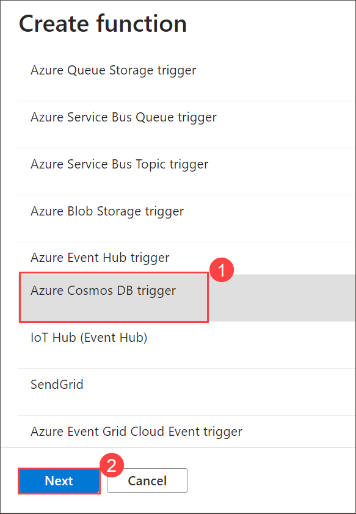
   
1. **Create function** ポップアップの **Template details** タブで、次の設定を使用して新しい関数を作成し、残りの設定はすべて既定値のままにして **Create (11)** を選択します:

    | **設定** | **値** |
    | :--- | :--- |
    | **Select a template** | *Azure Cosmos DB trigger* **(1)** |
    | **Function Name** | *``ItemsListener``* **(2)** |
    | **Cosmos DB account connection** | Select **New (3)** &vert; Select **Azure Cosmos DB Account (4)** &vert; Select the Azure Cosmos DB account you created earlier **(5)** |
    | **Database name** | *``cosmicworks``* **(7)** |
    | **Container name** | *``products``* **(8)** |
    | **Container name for leases** | *``productslease``* **(9)** |
    | **Create lease container if it does not exist** | *No* **(10)** |

    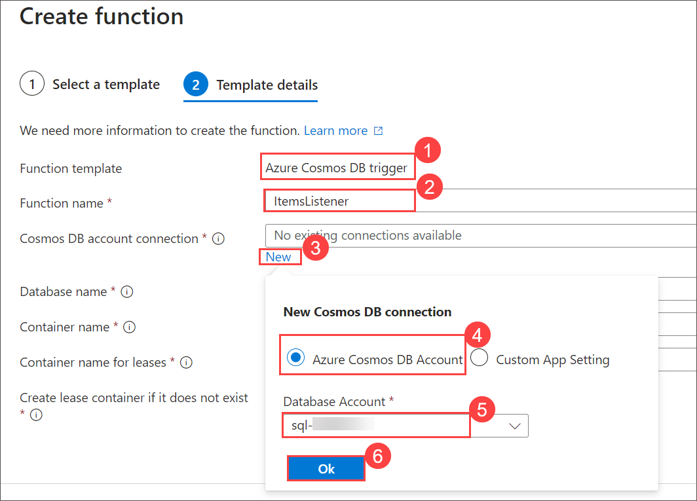

    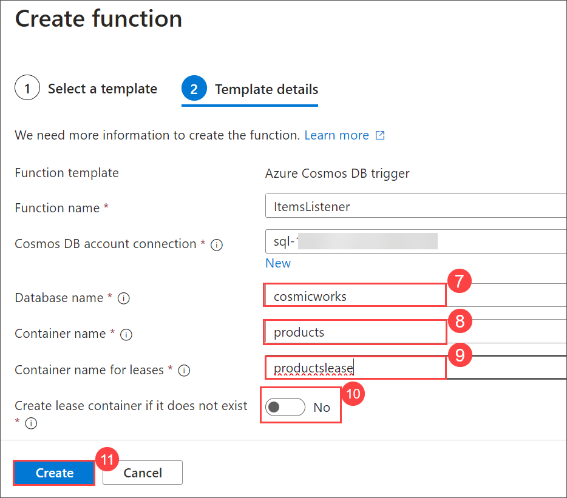
   
    > **おめでとうございます**。タスクが完了しました！次に検証を行います。手順は次のとおりです:
    > - 対応するタスクの **Validate** ボタンを押します。成功メッセージが表示された場合は次のタスクに進みます。
    > - そうでない場合は、エラーメッセージをよく読み、ラボ ガイドの指示に従って手順をやり直します。
    > - サポートが必要な場合は cloudlabs-support@spektrasystems.com までご連絡ください。24 時間 365 日対応しています。
    
    <validation step="3d866562-569f-41c5-8f1c-286e16e92767" />

## Task 4: Implement function code in .NET

このタスクでは、Azure ポータルで `run.csx` スクリプトを編集して、Azure Cosmos DB トリガー関数を実装します。必要なライブラリを参照し、変更されたアイテム数をログに記録する `Run` メソッドを作成し、各アイテムの一意の識別子をログに出力するためにアイテムを反復処理します。コードを保存した後、ストリーミングログに接続して、Cosmos DB コンテナー内でアイテムが生成されたときの出力を確認します。

以前に作成した関数は、ポータル内で編集する C# スクリプトです。ここでは、コンテナーに挿入または更新されたアイテムの一意の識別子を出力する短い関数を書きます。

1. **ItemsListener** | **Function** ペインで、**Code + Test** ペインに移動します。

1. **run.csx** スクリプトのエディターで、エディター領域の内容を削除します。

1. エディター領域で、**Microsoft.Azure.DocumentDB.Core** ライブラリを参照します:

    ```
    #r "Microsoft.Azure.DocumentDB.Core"
    ```

1. **System**、**System.Collections.Generic**、および [Microsoft.Azure.Documents][docs.microsoft.com/dotnet/api/microsoft.azure.documents] 名前空間の using ブロックを追加します:

    ```
    using System;
    using System.Collections.Generic;
    using Microsoft.Azure.Documents;
    ```

1. 2 つのパラメーターを持つ `Run` という名前の新しい static メソッドを作成します:

    1. ジェネリック型が [Document][docs.microsoft.com/dotnet/api/microsoft.azure.documents.document] の `IReadOnlyList<>` 型の **input** という名前のパラメーター。

    1. **ILogger** 型の **log** という名前のパラメーター。

    ```
    public static void Run(IReadOnlyList<Document> input, ILogger log)
    {
    }
    ```

1. `Run` メソッド内で、現在のバッチに含まれるアイテム数を計算する文字列を渡し、**log** 変数の `LogInformation` メソッドを呼び出します:

    ```
    log.LogInformation($"# Modified Items:\t{input?.Count ?? 0}");
    ```

1. 依然として `Run` メソッド内で、`input` 変数を反復処理する `foreach` ループを作成し、`item` 変数を `Document` 型のインスタンスとして使用します:

    ```
    foreach(Document item in input)
    {
    }
    ```

1. `Run` メソッドの `foreach` ループ内で、`item` 変数の [Id][docs.microsoft.com/dotnet/api/microsoft.azure.documents.resource.id] プロパティを出力する文字列を渡し、**log** 変数の `LogInformation` メソッドを呼び出します:

    ```
    log.LogInformation($"Detected Operation:\t{item.Id}");
    ```

1. 完了すると、コード ファイルは次のようになります:
  
    ```
    #r "Microsoft.Azure.DocumentDB.Core"
    
    using System;
    using System.Collections.Generic;
    using Microsoft.Azure.Documents;
    
    public static void Run(IReadOnlyList<Document> input, ILogger log)
    {
        log.LogInformation($"# Modified Items:\t{input?.Count ?? 0}");
    
        foreach(Document item in input)
        {
            log.LogInformation($"Detected Operation:\t{item.Id}");
        }
    }
    ```

    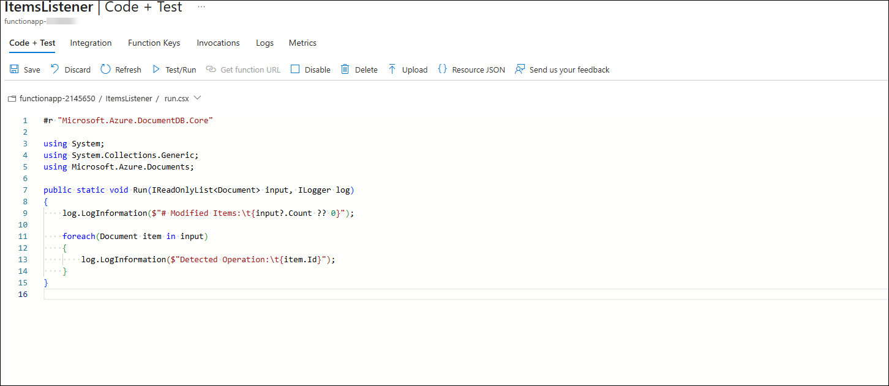    

1. **Logs** セクションを展開して、現在の関数のストリーミングログに接続します。

    > &#128161; ストリーミング ログ サービスへの接続には数秒かかる場合があります。接続されるとログ出力にメッセージが表示されます。

1. 現在の関数コードを **Save** します。

1. C# コードのコンパイル結果を確認します。ログ出力の最後に **Compilation succeeded** メッセージが表示されるはずです。

    > &#128221; ログ出力に警告メッセージが表示される場合があります。これらの警告は本ラボには影響しません。

1. ログ セクションを **Maximize** して、出力ウィンドウを最大化します。

    > &#128221; この後、別のツールを使用して Azure Cosmos DB for NoSQL コンテナーにアイテムを生成します。アイテムを生成したら、このブラウザー ウィンドウに戻り、出力を確認してください。ブラウザー ウィンドウを早期に閉じないでください。

## タスク 5: Azure Cosmos DB for NoSQL アカウントにサンプル データをシードする

このタスクでは、**cosmicworks** データベースと **products** コンテナーを作成するコマンドライン ユーティリティを使用します。ツールは、その後、ターミナル ウィンドウで change feed processor を使用して観察するアイテムのセットを作成します。

1. Visual Studio Code を起動します（プログラム アイコンはデスクトップにピン留めされています）。

   

1. **Visual Studio Code** で、**... (ellipses) (1)** > **Terminal (2)** > **New Terminal (3)** を選択し、既存のインスタンスで新しいターミナルを開きます。

    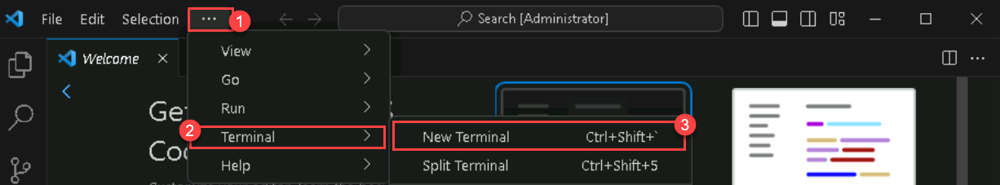

1. グローバルに使用するための [cosmicworks][nuget.org/packages/cosmicworks] コマンドライン ツールをインストールします。

    ```
    dotnet tool install cosmicworks --global --version 1.*
    ```

    > &#128161; このコマンドは数分かかる場合があります。すでに最新バージョンがインストールされている場合、(*Tool 'cosmicworks' is already installed*) という警告メッセージが出力されます。

1. インストールが完了したら、以下のコマンドを実行するために **Visual Studio Code** を閉じて再起動してください。

1. 次のコマンドライン オプションを使用して、Azure Cosmos DB アカウントにデータをシードします:

    | **Option** | **Value** |
    | :--- | :--- |
    | **--endpoint** | *The endpoint value you copied earlier in this lab* |
    | **--key** | *The key value you coped earlier in this lab* |
    | **--datasets** | *product* |

    ```
    cosmicworks --endpoint <cosmos-endpoint> --key <cosmos-key> --datasets product
    ```

    > &#128221; たとえば、エンドポイントが **https&shy;://dp420.documents.azure.com:443/** でキーが **fDR2ci9QgkdkvERTQ==** の場合、コマンドは次のようになります:
    > ``cosmicworks --endpoint https://dp420.documents.azure.com:443/ --key fDR2ci9QgkdkvERTQ== --datasets product``

    - dotnet の互換性に関連するエラーが発生した場合は、次のコマンドを実行してください: `choco install dotnet-6.0-runtime dotnet-7.0-runtime -y`

1. **Connection String** の入力を求められた場合は、CosmosDB の **Keys (1)** に移動します。**eye (2)** アイコンを選択し、値 **(3)** をコピーします。

    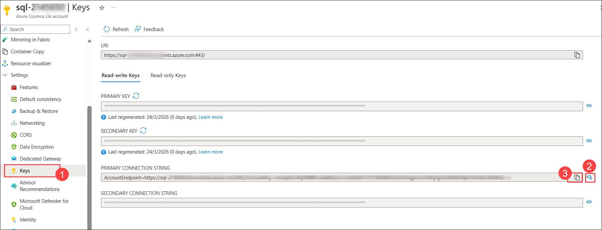

1. ターミナルにその値を貼り付けます。

    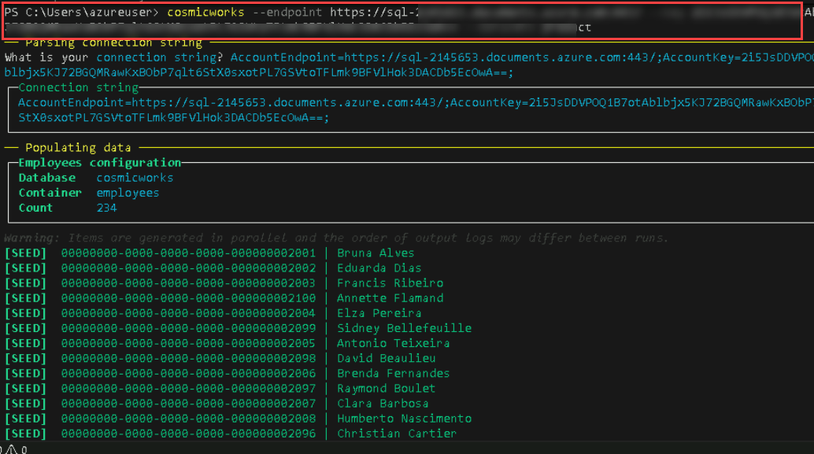

    > **Note:** このコマンドの実行中にパーティション キー エラーが発生する場合があります。これは通常、products コンテナーが異なるパーティション キー構成で既に存在するためです。

    - このエラーが発生した場合は無視できます。ただし、完全に解決するには、既存の products コンテナーを削除してコマンドを再実行してください。コンテナーを削除した後、コマンドはエラーなく正常に実行されます。

1. **cosmicworks** コマンドがデータベース、コンテナー、およびアイテムの作成を完了するまで待ちます。

1. 統合ターミナルを閉じます。

1. Web ブラウザーのウィンドウまたはタブを閉じます。

### サマリー 

このラボを完了することで、Azure Cosmos DB のセットアップ、Azure Functions の作成、およびデータ変更を処理する change feed processor の実装に関する実践的な経験を得られます。この知識を活用すると、Azure のサーバーレス アーキテクチャと NoSQL 機能を効果的に活用した応答型アプリケーションを構築できます。


### ラボを正常に完了しました
