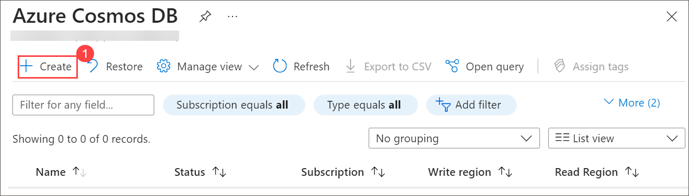
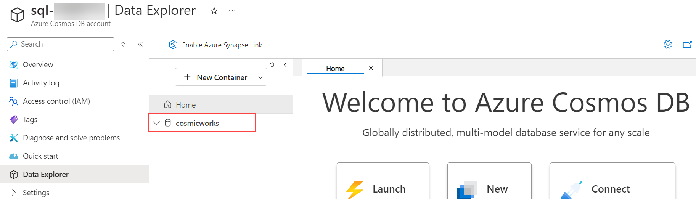
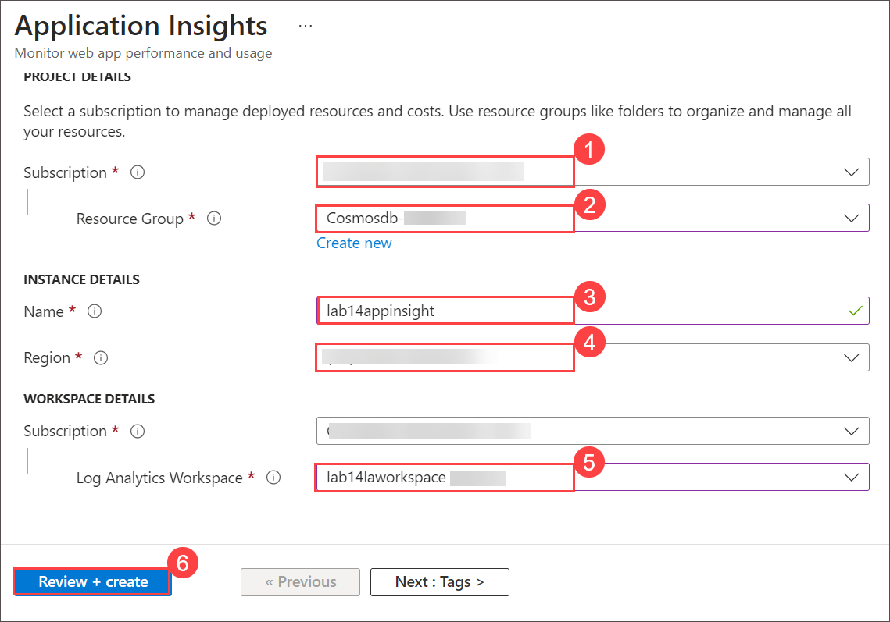
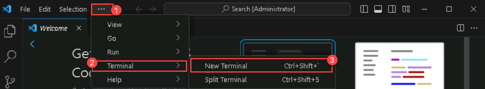

# Process Azure Cosmos DB for NoSQL data using Azure Functions

## Lab scenario

The Azure Cosmos DB trigger for Azure Functions is implemented using a change feed processor. You can create functions that respond to create and update operations in your Azure Cosmos DB for NoSQL container with this knowledge. If you have implemented a change feed processor manually, the setup for Azure Functions is similar.

## Lab objectives

In this lab, you will complete the following tasks:
- Task 1: Create an Azure Cosmos DB for NoSQL account
- Task 2: Create Application Insight
- Task 3: Create an Azure Function app and Azure Cosmos DB-triggered function
- Task 4: Implement function code in .NET
- Task 5: Seed your Azure Cosmos DB for NoSQL account with sample data

## Estimated Timing: 60 minutes

## Architecture Diagram


## Task 1: Create an Azure Cosmos DB for NoSQL account

In this task, you will provision an Azure Cosmos DB SQL account, configuring essential settings and retrieving the necessary connection details for future development.

Azure Cosmos DB is a cloud-based NoSQL database service that supports multiple APIs. When provisioning an Azure Cosmos DB account for the first time, you will select which of the APIs you want the account to support (for example, **Mongo API** or **NoSQL API**). Once the Azure Cosmos DB for NoSQL account is done provisioning, you can retrieve the endpoint and key and use them to connect to the Azure Cosmos DB for NoSQL account using the Azure SDK for .NET or any other SDK of your choice.

1. On **Azure Portal** page, in Search resources, services and docs (G+/) box at the top of the portal, enter **Azure Cosmos DB**, and then select **Azure Cosmos DB** under services.

   
   
1. Select **+ Create** under **Azure Cosmos DB for NoSQL** click on **Create** to create **Azure Cosmos DB for NoSQL** account.

    

    

1. Specify the following settings, leaving all remaining settings to their default values, and select **Review + create**:

    | **Setting** | **Value** |
    | :--- | :--- |
    | **Subscription** | *Your existing Azure subscription* |
    | **Resource group** | *Select an existing Cosmosdb-<inject key="DeploymentID" enableCopy="false"/>* |
    | **Account Name** | *sql-<inject key="DeploymentID" enableCopy="false"/>* |
    | **Location** | *Choose any available region* |
    | **Capacity mode** | *Serverless* |
   
1. Once after validation passed click on **Create**.

1. Wait for the deployment task to complete before continuing with this task.

1. Select **Go to resources**. On the newly created **Azure Cosmos DB** account under **Settings** navigate to the **Keys** pane.

    

1. This pane contains the connection details and credentials necessary to connect to the account from the SDK. Specifically:

    1. Record the value of the **URI** field. You will use this **endpoint** value later in this exercise.

    1. Record the value of the **PRIMARY KEY** field. You will use this **key** value later in this exercise.

        

1. Select **Data Explorer** from the resource menu.

     >**Note**: Click the "X" button on the pop-up, which is commonly located at the top right corner.

1. In the **Data Explorer** pane, expand **+ New Container** and then select **+ New Database** from the drop down.

    
      
1. In the **New Database** popup, enter the following values for each setting, and then select **OK**:

    | **Setting** | **Value** |
    | :-- | :-- |
    | **Database id** | *``cosmicworks``* |

    

1. Back in the **Data Explorer** pane, observe the **cosmicworks** database node within the hierarchy.

      
   
1. In the **Data Explorer** pane, select **+ New Container** > **+ New Container**.

     

1. In the **New Container** popup, enter the following values for each setting, and then select **OK**:

    | **Setting** | **Value** |
    | :-- | :-- |
    | **Database id** | *Use existing* &vert; *cosmicworks* |
    | **Container id** | *``products``* |
    | **Partition key** | *``/categoryId``* |

     

1. Back in the **Data Explorer** pane, expand the **cosmicworks** database node and then observe the **products** container node within the hierarchy.

1. In the **Data Explorer** pane, select **+ New Container** > **+ New Container** again.

    

1. In the **New Container** popup, enter the following values for each setting, and then select **OK**:

    | **Setting** | **Value** |
    | :-- | :-- |
    | **Database id** | *Use existing* &vert; *cosmicworks* |
    | **Container id** | *``productslease``* |
    | **Partition key** | *``/id``* |

      
   
1. Back in the **Data Explorer** pane, expand the **cosmicworks** database node and then observe the **productslease** container node within the hierarchy.

     
   
1. Return to the **Home** of the Azure portal.

    > **Congratulations** on completing the task! Now, it's time to validate it. Here are the steps:
    > - Hit the Validate button for the corresponding task. If you receive a success message, you can proceed to the next task. 
    > - If not, carefully read the error message and retry the step, following the instructions in the lab guide.
    > - If you need any assistance, please contact us at labs-support@spektrasystems.com. We are available 24/7 to help.
    
    <validation step="8ec90c15-4d62-42be-8eff-76a215f8689b" />

## Task 2: Create Application Insight

In this task, you'll set up Azure Application Insights to monitor your Azure Function application. First, you'll create a Log Analytics workspace, which will store monitoring data. Then, you'll create an Application Insights instance and link it to the Log Analytics workspace, enabling you to track the performance and activity of your application.

1. On **Azure Portal** page, in Search resources, services and docs (G+/) box at the top of the portal, enter **Log Analytics workspaces**, and then select **Log Analytics workspaces** under services.

    
        
1. Select to **+ Create** a new *Log Analytics* workspace.

    

1. In the **Log Analytics workspace** dialog, enter the following values for each setting, and then select **Review + Create** and then select **Create**:

    | **Setting** | **Value** |
    | :--- | :--- |
    | **Subscription** | *Your existing Azure subscription* |
    | **Resource group** | *Select an existing or create a new resource group* |
    | **Name** | *``lab14laworkspace``* |
    | **Location** | *Choose any available region* |

     
   
1. Once your *Log Analytics workspace* is created, in the search box search for **Application Insights**.

    

1. Select to **+ Create** a new *Application Insight*.

1. In the **Application Insights** dialog, enter the following values for each setting, and then select **Review + Create** and then select **Create**:

    | **Setting** | **Value** |
    | :--- | :--- |
    | **Subscription (both entries)** | *Your existing Azure subscription* |
    | **Resource group** | *Select an existing Cosmosdb-<inject key="DeploymentID" enableCopy="false"/>* |
    | **Name** | *``lab14appinsight``* |
    | **Location** | *Choose any available region* |
    | **Log Analytics Workspace** | *lab14laworkspace* |

     
     
1. You should now be able to monitor your application function.

    > **Congratulations** on completing the task! Now, it's time to validate it. Here are the steps:
    > - Hit the Validate button for the corresponding task. If you receive a success message, you can proceed to the next task. 
    > - If not, carefully read the error message and retry the step, following the instructions in the lab guide.
    > - If you need any assistance, please contact us at labs-support@spektrasystems.com. We are available 24/7 to help.
    
    <validation step="d6eb6de3-1d82-40ff-a083-c08a5887fd64" />

## Task 3: Create an Azure Function app and Azure Cosmos DB-triggered function

In this task, you'll create an Azure Function app with a Cosmos DB-triggered function. First, you'll set up the Function app in the Azure portal by specifying necessary configurations. After deployment, you'll create a new function using the Azure Cosmos DB trigger template, linking it to your Cosmos DB account and specifying the database and container details. This allows the function to respond to changes in the Cosmos DB container.

1. Select **+ Create a resource** on Azure portal home page.

     
   
1. Search for **Functions** and select **Function app**. then select a **Function app** on market place page.

    

    

1. On the **Function App** page click on **Create**.

    
   
1. Specify the following settings, leaving all remaining settings to their default values and then select **Review + Create** and then select **Create**:

    | **Setting** | **Value** |
    | :--- | :--- |
    | **Subscription** | *Your existing Azure subscription* |
    | **Resource group** | *Select an existing or create a new resource group* |
    | **Name** | *functionapp-<inject key="DeploymentID" enableCopy="false"/>* |
    | **Publish** | *Code* |
    | **Runtime stack** | *.NET* |
    | **Version** | *6 (LTS) in-process model* |
    | **Region** | *Choose any available region* |

    

1. Wait for the deployment task to complete before continuing with this task.

1. Go to the newly created **Azure Functions** account resource and navigate to the **Functions** pane.

1. In the **Functions** pane, select **Create function**.

    

1. In the **Create function** popup on the **Select a template** tab choose **Azure Cosmos DB trigger** and click on **Next**

    
   
1. In the **Create function** popup, on the **Template details** tab create a new function with the following settings, leaving all remaining settings to their default values and select **Create**:

    | **Setting** | **Value** |
    | :--- | :--- |
    | **Select a template** | *Azure Cosmos DB trigger* |
    | **Function Name** | *``ItemsListener``* |
    | **Cosmos DB account connection** | *Select New* &vert; *Select Azure Cosmos DB Account* &vert; *Select the Azure Cosmos DB account you created earlier* |
    | **Database name** | *``cosmicworks``* |
    | **Container name** | *``products``* |
    | **Container name for leases** | *``productslease``* |
    | **Create lease container if it does not exist** | *No* |

    

    
   
    > **Congratulations** on completing the task! Now, it's time to validate it. Here are the steps:
    > - Hit the Validate button for the corresponding task. If you receive a success message, you can proceed to the next task. 
    > - If not, carefully read the error message and retry the step, following the instructions in the lab guide.
    > - If you need any assistance, please contact us at labs-support@spektrasystems.com. We are available 24/7 to help.
    
    <validation step="3d866562-569f-41c5-8f1c-286e16e92767" />

## Task 4: Implement function code in .NET

In this task, you'll implement the Azure Cosmos DB-triggered function by editing the run.csx script in the Azure portal. You'll reference necessary libraries, create a Run method to log the count of modified items, and iterate through each item to log its unique identifier. After saving the code, you'll connect to the streaming logs to observe the output when items are generated in the Cosmos DB container.

The function you created earlier is a C# script that is edited in-portal. You will now use the portal to write a short function to output the unique identifier of any item inserted or updated in the container.

1. In the **ItemsListener** &vert; **Function** pane, navigate to the **Code + Test** pane.

1. In the editor for the **run.csx** script, delete the contents of the editor area.

1. In the editor area, reference the **Microsoft.Azure.DocumentDB.Core** library:

    ```
    #r "Microsoft.Azure.DocumentDB.Core"
    ```

1. Add using blocks for the **System**, **System.Collections.Generic**, and [Microsoft.Azure.Documents][docs.microsoft.com/dotnet/api/microsoft.azure.documents] namespaces:

    ```
    using System;
    using System.Collections.Generic;
    using Microsoft.Azure.Documents;
    ```

1. Create a new static method named **Run** that has two parameters:

    1. A parameter named **input** of type **IReadOnlyList\<\>** with a generic type of [Document][docs.microsoft.com/dotnet/api/microsoft.azure.documents.document].

    1. A parameter named **log** of type **ILogger**.

    ```
    public static void Run(IReadOnlyList<Document> input, ILogger log)
    {
    }
    ```

1. Within the **Run** method, invoke the **LogInformation** method of the **log** variable passing in a string that calculates the count of items in the current batch:

    ```
    log.LogInformation($"# Modified Items:\t{input?.Count ?? 0}"); 
    ```

1. Still within the **Run** method, create a foreach loop that iterates over the **input** variable using the variable **item** to represent an instance of type **Document**:

    ```
    foreach(Document item in input)
    {
    }
    ```

1. Within the foreach loop of the **Run** method, invoke the **LogInformation** method of the **log** variable passing in a string that prints the [Id][docs.microsoft.com/dotnet/api/microsoft.azure.documents.resource.id] property of the **item** variable:

    ```
    log.LogInformation($"Detected Operation:\t{item.Id}");
    ```

1. Once you are done, your code file should now include:
  
    ```
    #r "Microsoft.Azure.DocumentDB.Core"
    
    using System;
    using System.Collections.Generic;
    using Microsoft.Azure.Documents;
    
    public static void Run(IReadOnlyList<Document> input, ILogger log)
    {
        log.LogInformation($"# Modified Items:\t{input?.Count ?? 0}");
    
        foreach(Document item in input)
        {
            log.LogInformation($"Detected Operation:\t{item.Id}");
        }
    }
    ```

1. Expand the **Logs** section to connect to the streaming logs for the current function.

    > &#128161; It can take a couple of seconds to connect to the streaming log service. You will see a message in the log output once you are connected.

1. **Save** the current function code.

1. Observe the result of the C# code compilation. You should expect to see a **Compilation succeeded** message at the end of the log output.

    > &#128221; You may see warning messages in the log output. These warnings will not impact this lab.

1. **Maximize** the log section to expand the output window to fill the maximum available space.

    > &#128221; You will use another tool to generate items in your Azure Cosmos DB for NoSQL container. Once you generate the items, you will return to this browser window to observe the output. Do not close the browser window prematurely.

## Task 5: Seed your Azure Cosmos DB for NoSQL account with sample data

In this task, You will use a command-line utility that creates a **cosmicworks** database and a **products** container. The tool will then create a set of items that you will observe using the change feed processor running in your terminal window.

1. Start Visual Studio Code (the program icon is pinned to the Desktop).

   

1. In **Visual Studio Code**, open the **Terminal** menu by selecting **... (ellipses) (1)** > **Terminal (2)** > **New Terminal (3)** to open a new terminal with your existing instance.

    

1. Install the [cosmicworks][nuget.org/packages/cosmicworks] command-line tool for global use on your machine.

    ```
    dotnet tool install cosmicworks --global --version 1.*
    ```

    > &#128161; This command may take a couple of minutes to complete. This command will output the warning message (*Tool 'cosmicworks' is already installed') if you have already installed the latest version of this tool in the past.

1. Once the Installation is completed, make sure to close the **Visual Studio Code** and re-open it to perform the below command.

1. Run cosmicworks to seed your Azure Cosmos DB account with the following command-line options:

    | **Option** | **Value** |
    | :--- | :--- |
    | **--endpoint** | *The endpoint value you copied earlier in this lab* |
    | **--key** | *The key value you coped earlier in this lab* |
    | **--datasets** | *product* |

    ```
    cosmicworks --endpoint <cosmos-endpoint> --key <cosmos-key> --datasets product
    ```

    > &#128221; For example, if your endpoint is: **https&shy;://dp420.documents.azure.com:443/** and your key is: **fDR2ci9QgkdkvERTQ==**, then the command would be:
    > ``cosmicworks --endpoint https://dp420.documents.azure.com:443/ --key fDR2ci9QgkdkvERTQ== --datasets product``

1. Wait for the **cosmicworks** command to finish populating the account with a database, container, and items.

1. Close the integrated terminal.

1. Close your web browser window or tab.

### Summary 

By completing this lab, you gained practical experience in setting up Azure Cosmos DB, creating Azure Functions, and implementing a change feed processor to handle data changes. This knowledge equips you to build responsive applications that leverage Azure's serverless architecture and NoSQL capabilities effectively.

### Review

In this lab, you have completed the following topics:

- Create an Azure Cosmos DB for NoSQL account
- Create Application Insight
- Create an Azure Function app and Azure Cosmos DB-triggered function
- Implement function code in .NET
- Seed your Azure Cosmos DB for NoSQL account with sample data

### You have successfully completed the lab
