# Lab 09: Search data using Azure AI Search and Azure Cosmos DB for NoSQL

## Estimated Timing: 30 minutes

## Lab Scenario

Azure AI Search combines a search engine as a service with deep integration with AI capabilities to enrich the information in the search index.

In this lab, you will build an Azure AI Search index that automatically indexes data in an Azure Cosmos DB for NoSQL container and enriches the data using the Azure AI Translator functionality.

## Lab Objectives

In this lab, you will complete the following tasks:
- Task 1: Create an Azure Cosmos DB for NoSQL account.
- Task 2: Send your Azure Cosmos DB for NoSQL account with sample data.
- Task 3: Create an Azure AI Search resource.
- Task 4: Build indexer and index for Azure Cosmos DB for NoSQL data.
- Task 5: Validate the index with example search queries.

## Architecture Diagram


## Task 1: Create an Azure Cosmos DB for NoSQL account

Azure Cosmos DB is a cloud-based NoSQL database service that supports multiple APIs. When provisioning an Azure Cosmos DB account for the first time, you will select which of the APIs you want the account to support (for example, **API for MongoDB** or **API for NoSQL**). Once the Azure Cosmos DB for NoSQL account is done provisioning, you can retrieve the endpoint and key and use them to connect to the Azure Cosmos DB for NoSQL account using the Azure SDK for .NET or any other SDK of your choice.

1. Navigate back to  Azure Portal page, in Search resources, services and docs (G+/) box at the top of the portal, enter **Azure Cosmos DB (1)**, and then select **Azure Cosmos DB (2)** under services.

    
   
1. Select **+ Create** under **Azure Cosmos DB for NoSQL** click on **Create** to create **Azure Cosmos DB for NoSQL** account.

    

    

1. Specify the following settings, leaving all remaining settings to their default values, and select **Review + create (9)**:

    | **Setting** | **Value** |
    | :--- | :--- |
    | **Workload Type** | *Learning* **(1)** |    
    | **Subscription** | *Your existing Azure subscription* **(2)** |
    | **Resource group** | *Select an existing Cosmosdb-<inject key="DeploymentID" enableCopy="false"/>* **(3)** |
    | **Account Name** | *sql-<inject key="DeploymentID" enableCopy="false"/>* **(4)** |
    | **Location** | *Choose any available region* **(5)** |
    | **Capacity mode** | *Provisioned throughput* **(6)** |
    | **Apply Free Tier Discount** | *Do Not Apply* **(7)** |
    | **Limit total account throughput** | *Disable* **(8)** |        

    

         

1. Once after validation passed click on **Create**.

    

1. Wait for the deployment task to complete before continuing with this task.

1. Select **Go to resources**. On the newly created **Azure Cosmos DB** account under **Settings (1)** navigate to the **Keys (2)** pane.

    

    

1. This pane contains the connection details and credentials necessary to connect to the account from the SDK. Specifically:

    - Record the value of the **URI (1)** field. You will use this **endpoint** value later in this exercise.

    - Record the value of the **PRIMARY KEY (2)** field. You will use this **key** value later in this exercise.

        

    - Notice the **Primary Connection String** field on the same page **(1)**. Click in the **eye** icon **(2)**. Copy the value you will use this **connection string** value later in this exercise **(3)**.

        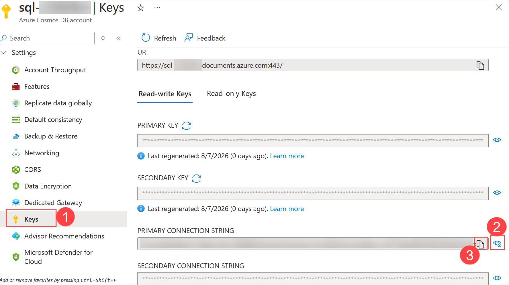    

> **Congratulations** on completing the task! Now, it's time to validate it. Here are the steps:
> - Hit the Validate button for the corresponding task. If you receive a success message, you can proceed to the next task. 
> - If not, carefully read the error message and retry the step, following the instructions in the lab guide.
> - If you need any assistance, please contact us at cloudlabs-support@spektrasystems.com. We are available 24/7 to help you out.
    
<validation step="527d4167-c9f9-49aa-9489-c384ed66b37f" />

## Task 2: Send your Azure Cosmos DB for NoSQL account with sample data

You will use a command-line utility that creates a **cosmicworks** database and a **products** container. The tool will then create a set of items that you will observe using the change feed processor running in your terminal window.

1. Start Visual Studio Code (the program icon is pinned to the Desktop).

    

1. In **Visual Studio Code**, open the **Terminal** menu by selecting **... (ellipses) (1)** then select **Terminal (2)** and choose **New Terminal (3)** to open a new terminal with your existing instance.

    

1. Install the [cosmicworks][nuget.org/packages/cosmicworks] command-line tool for global use on your machine.

    ```
    dotnet tool install cosmicworks --global --version 1.*
    ```

    

    >**Note:** This command may take a couple of minutes to complete. This command will output the warning message (*Tool 'cosmicworks' is already installed') if you have already installed the latest version of this tool in the past.

1. Once the Installation is completed, make sure to close the **Visual Studio Code** and re-open it to perform the below command.

1. Run cosmicworks to seed your Azure Cosmos DB account with the following command-line options:

    | **Option** | **Value** |
    | :--- | :--- |
    | **--endpoint** | *The endpoint value you copied earlier in this lab* |
    | **--key** | *The key value you coped earlier in this lab* |
    | **--datasets** | *product* |

    ```
    cosmicworks --endpoint <cosmos-endpoint> --key <cosmos-key> --datasets product
    ```

    > **For example:** if your endpoint is: **https&shy;://dp420.documents.azure.com:443/** and your key is: **fDR2ci9QgkdkvERTQ==**, then the command would be:
    > ``cosmicworks --endpoint https://dp420.documents.azure.com:443/ --key fDR2ci9QgkdkvERTQ== --datasets product``

    >**Note**: If you're getting an error, close the visual studio code reopen it and try to run the command once again.

    > **Note:** If the error still occurs, perform the following steps and run the command again.
    >
    > -  In the Azure portal, open your **Cosmos DB account**, expand **Settings (1)**, and select **Networking (2)**.
    >
    > -  Under **Firewall**, click **Add your current IP (3)** or enter the IP address manually.
    >
    >    
    >
    >-  Click **Save (4)** to apply the changes.
    >
    >    
    >
    >-  Wait a few minutes for the firewall rule to take effect.
    >
    >- You will be prompted for placing the **Parsing Connection String**, place the copied value from the previous task.
    >
    >   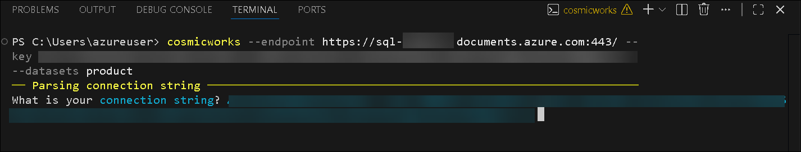

    > **Note:** If the error still occurs, perform the following steps and run the below command, replace the connection string with the value you have copied in Task 1.
    > 
    >    ```
    >    cosmicworks --connection-string "<your-connection-string>" --datasets product
    >    ```

1. Wait for the **cosmicworks** command to finish populating the account with a database, container, and items.

1. Close the integrated terminal. And close **Visual Studio Code**.

## Task 3: Create an Azure AI Search resource

Before continuing with this exercise, you must first create a new Azure AI Search instance.

1. Navigate back to Azure portal, click **Create a resource**.

    

1. Search for **Azure AI Search (1)**, then select **Create (2)** and choose **Azure AI Search (3)**.

    

1. Enter the following details:

    | **Setting** | **Value** |
    | :--- | :--- |
    | **Subscription** | Select your Azure subscription **(1)** |
    | **Resource group** | Select **cosmosdb-<inject key="DeploymentID" enableCopy="false"/>** **(2)** |
    | **Service name** | Enter **aisearch-<inject key="DeploymentID" enableCopy="false"/>** **(3)** |
    | **Location** | Use the default location **(4)** |

1. Click **Review + create (5)**.

    
    
    >**Note:** If it shows any subscriptions errors, select **Next: Scale**, and select **Previous**.

1. After validation is successful, review the configuration and click **Create**.

    

4. Wait for the deployment to complete, then click **Go to resource** to the newly created **Azure AI Search** account resource.

    

> **Congratulations** on completing the task! Now, it's time to validate it. Here are the steps:
> - Hit the Validate button for the corresponding task. If you receive a success message, you can proceed to the next task. 
> - If not, carefully read the error message and retry the step, following the instructions in the lab guide.
> - If you need any assistance, please contact us at cloudlabs-support@spektrasystems.com. We are available 24/7 to help you out.
    
<validation step="6dc66a44-b1ce-4dc5-91f8-35180452aaaa" />

## Task 4: Build indexer and index for Azure Cosmos DB for NoSQL data

You will create an indexer that indexes a subset of data in a specific Azure Cosmos DB for NoSQL container on an hourly basis.

1. On the **Azure AI Search** service Overview page, click **Import data** to begin creating a search index from Azure Cosmos DB.

    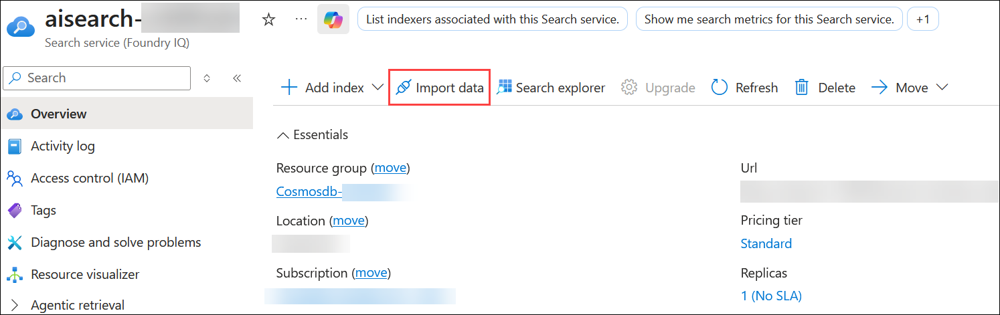

1. On the **Choose a data source** page, select **Azure Cosmos DB** as the data source for the search index.

    

1. On the **What scenario are you targeting?** page, select **Keyword search** to configure a keyword-based search experience.

    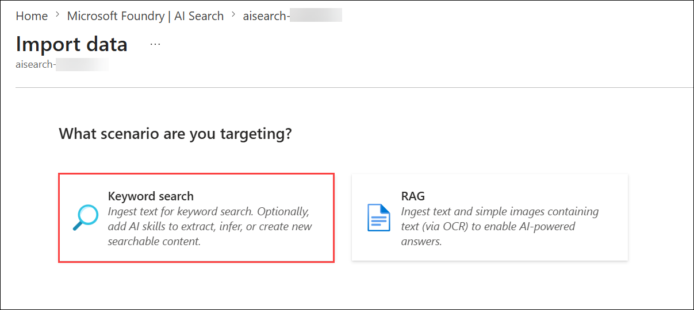

1. On the **Configure your Azure Cosmos DB** page, configure the following settings and then click **Next (6)**.

    | Setting | Value |
    |----------|----------|
    | **Subscription** | Select your Azure subscription **(1)** |
    | **Cosmos DB account** | Select the Cosmos DB account created earlier **(2)** |
    | **Database** | `cosmicworks` **(3)** |
    | **Collection** | `products` **(4)** |
    | **Query** | Paste the query below **(5)** |
    
    ```SQL
    SELECT 
        p.id, 
        p.categoryId, 
        p.name, 
        p.price,
        p._ts
    FROM 
        products p 
    WHERE 
        p._ts > @HighWaterMark 
    ORDER BY 
        p._ts
    ```

    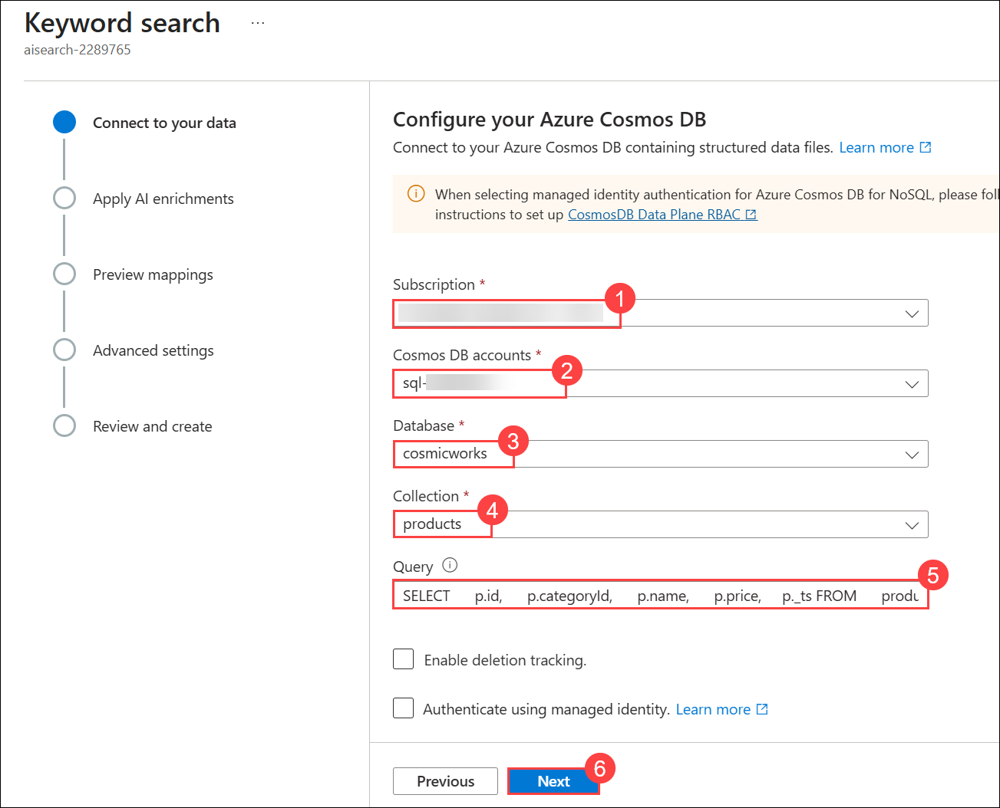

1. On the **Apply AI enrichments** page, no configuration is required for this lab. Leave the default settings unchanged and click **Next** to continue.

1. On the **Preview index fields** page, click **Add field (1)**. In the new row, enter **id** in the **Source column (2)**, enter **categoryId** in the **Target index field name (3)**, select **Edm.String** as the **Target index field type (4)**, and then proceed to configure the field.

    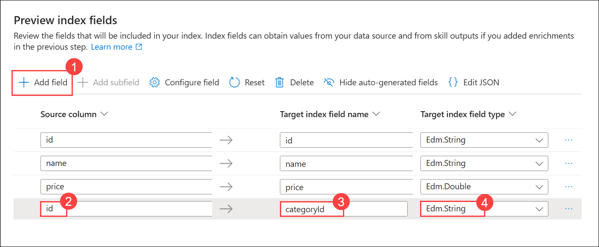

1. In the **Preview index fields** page, click the ellipsis (**...**) for the **categoryid** field **(1)** and select **Configure field (2)**.

    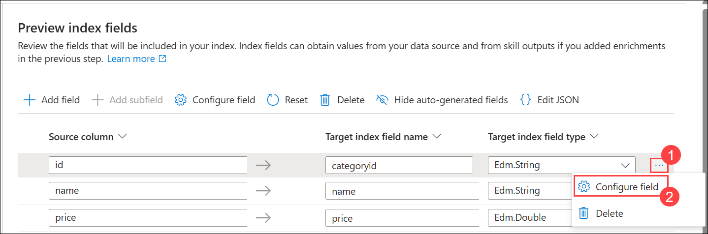

1. In the **Configure field** pane, select **Key (1)** and then click **Save (2)**.

    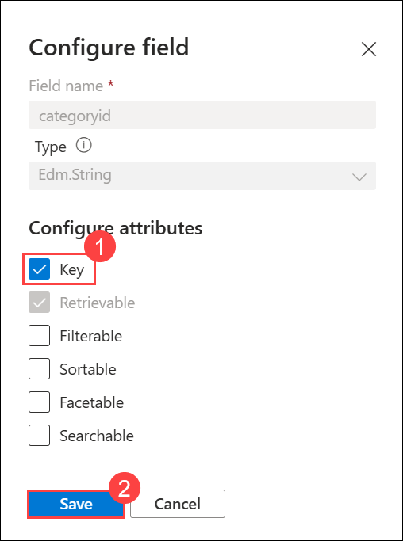

1. Review the index field mappings to ensure the **id**, **name**, **price**, and **categoryid** fields are configured as shown, and then click **Next**.

    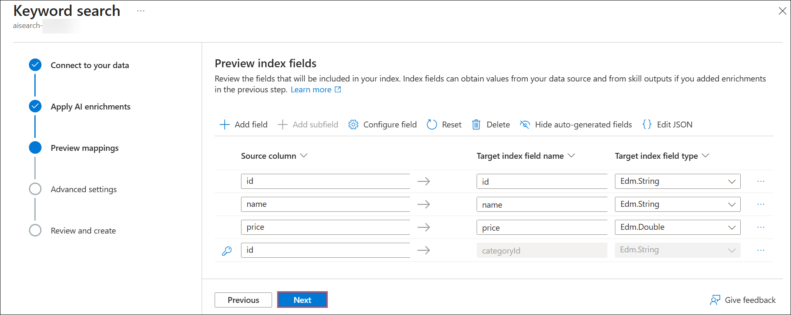

1. On the **Advanced settings** page, verify that the indexing **Schedule (1)** is set to **Hourly**, and then click **Next (2)**.

    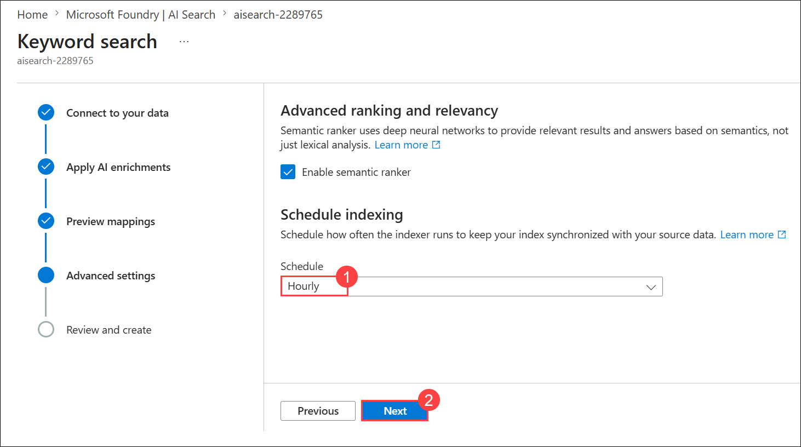

1. On the **Review and create** page, review the configuration settings and click **Create** to create the data source, indexer, and search index.

    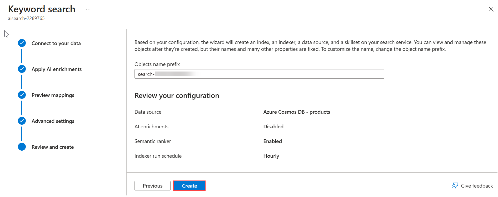

1. In the **Create succeeded** confirmation dialog, click **Go to Search explorer** to open the search index and begin exploring the indexed data.

    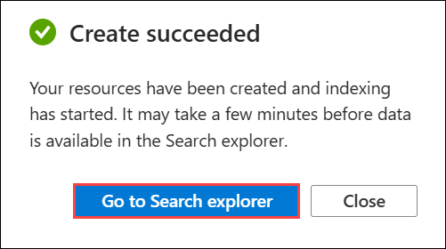

1. From the **AI Search** resource blade, from the left navigation menu, select the **Indexers (1)** under **Search Management** tab to observe the result of your first indexing operation.

1. Wait for the **products-cosmosdb-indexer** indexer to have a status of **Success (2)** before continuing with this task.

    >**Note:** You may need to use the **Refresh** option to update the blade if it does not update automatically.

    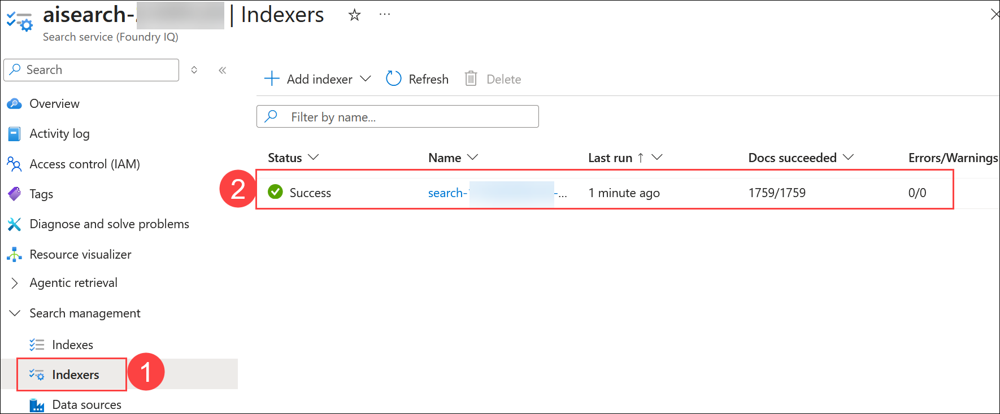

1. Navigate to the **Indexes** tab under **Search Management** in the left navigation pane and then select the **products-index** index.

> **Congratulations** on completing the task! Now, it's time to validate it. Here are the steps:
> - Hit the Validate button for the corresponding task. If you receive a success message, you can proceed to the next task. 
> - If not, carefully read the error message and retry the step, following the instructions in the lab guide.
> - If you need any assistance, please contact us at cloudlabs-support@spektrasystems.com. We are available 24/7 to help you out.
    
<validation step="0e28166a-b18c-4b9b-8f4b-0b4d113890bc" />

## Task 5: Validate index with example search queries

Now that your materialized view of the Azure Cosmos DB for NoSQL data is in the search index, you can perform a few basic queries that take advantage of the features in Azure AI Search.

> **Note:** This lab is not intended to teach the Azure AI Search syntax. These queries were curated to showcase some of the features available in the search index and engine.

1. In the **Search explorer** tab, select the **View** pulldown and then select the **JSON view**.

1. Notice in the **JSON query editor** the syntax of the default JSON search query that returns all possible results using a **\*** (wildcard) operator.

    ```json
    {
        "search": "*"
    }
    ```

1. Select the **Search** button to perform the search.

1. Observe that this search query returns all possible results.

1. In the **JSON query editor**, enter the following query and then select **Search**:

    ```json
    {
        "search": "touring 3000"
    }
    ```

1. Observe that this search query returns results that contain either the terms **touring** or **3000** giving a higher score to results that contain both terms. The results are then sorted in descending order by the **@search.score** field.

1. In the **JSON query editor**, enter the following query and then select **Search**:

    ```json
    {
        "search": "red"
        , "count": true
    }
    ```

1. Observe that this search query returns results with the term **red**, but also now includes a metadata field indicating the total count of results even if they are not all included in the same page.

1. In the **JSON query editor**, enter the following query and then select **Search**:

    ```json
    {
        "search": "blue"
        , "count": true
        , "top": 6
    }
    ```

1. Observe that this search query only returns a set of six results at a time even though there are more matches server-side.

1. In the **JSON query editor**, enter the following query and then select **Search**:

    ```json
    {
        "search": "mountain"
        , "count": true
        , "top": 25
        , "skip": 50
    }
    ```

1. Observe that this search query skips the first 50 results and returns a set of 25 results. If this was a paginated view in a client-side application, you could infer that this would be the third "page" of results.

1. In the **JSON query editor**, enter the following query and then select **Search**:

    ```json
    {
        "search": "touring"
        , "count": true
        , "filter": "price lt 500"
    }
    ```

1. Observe that this search query only returns results where the value of the numeric price field is less than 500.

1. In the **JSON query editor**, enter the following query and then select **Search**:

    ```json
    {
        "search": "road"
        , "count": true
        , "top": 15
        , "facets": ["price,interval:500"]
    }
    ```

1. Observe that this search query returns a collection of facet data that indicates how many items belong to each category even if they are not all present in the current page of results. In this example, the matching items are broken down into numeric price categories in intervals of 500. This is typically used to populate filters and navigation aids in client-side applications.

    

1. Close your web browser window or tab.

## Summary

This lab guides you through integrating Azure AI Search with Azure Cosmos DB for NoSQL, where you'll create a Cosmos DB account, populate it with sample data, set up an Azure AI Search resource, and build an indexer. 

## Review

In this lab, you have completed:

- Created an Azure Cosmos DB for NoSQL account.
- Send your Azure Cosmos DB for NoSQL account with sample data.
- Created an Azure AI Search resource.
- Built indexer and index for Azure Cosmos DB for NoSQL data.
- Validated index with example search queries.

## You have successfully completed the lab.