# Azure AI Search と Azure Cosmos DB for NoSQL を使ってデータを検索する

## ラボのシナリオ

Azure Cognitive Search は、サービスとしての検索エンジンと AI 機能の深い統合を組み合わせ、検索インデックス内の情報を強化します。

このラボでは、Azure Cosmos DB SQL API コンテナー内のデータを自動的にインデックス化し、Azure Cognitive Services Translator 機能を使用してデータを強化する Azure Cognitive Search インデックスを作成します。

## ラボの目的

このラボでは、次のタスクを完了します:
- タスク 1: Azure Cosmos DB for NoSQL アカウントを作成する
- タスク 2: Azure Cosmos DB for NoSQL アカウントにサンプルデータを送信する
- タスク 3: Azure AI Search リソースを作成する
- タスク 4: Azure Cosmos DB for NoSQL データ用のインデクサーとインデックスを構築する
- タスク 5: サンプル検索クエリでインデックスを検証する

## 推定所要時間: 30 分

## アーキテクチャ図

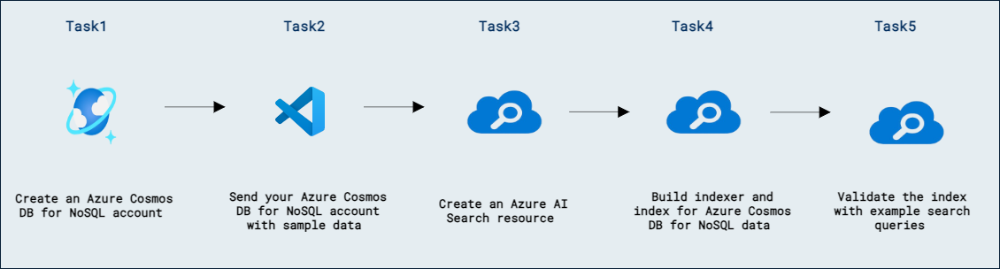

### タスク 1: Azure Cosmos DB for NoSQL アカウントを作成する

Azure Cosmos DB は複数の API をサポートするクラウドベースの NoSQL データベース サービスです。Azure Cosmos DB アカウントを初めてプロビジョニングする際には、アカウントでサポートする API を選択します（たとえば **Mongo API** や **NoSQL API**）。Azure Cosmos DB for NoSQL アカウントのプロビジョニングが完了したら、エンドポイントとキーを取得し、Azure SDK for .NET やその他の SDK を使用してそのアカウントに接続できます。

1. Azure Portal ページに戻り、ポータル上部の「Search resources, services and docs (G+/)」ボックスに **Azure Cosmos DB** と入力し、サービス一覧から **Azure Cosmos DB** を選択します。

   
   
1. **Azure Cosmos DB for NoSQL** の下で **+ Create** を選択し、**Create** をクリックして **Azure Cosmos DB for NoSQL** アカウントを作成します。

    

    


1. 次の設定を指定し、残りの設定はすべて既定値のままにして **Review + create** **(7)** を選択します:

    | **設定** | **値** |
    | :--- | :--- |
    | **Workload Type** | Production **(1)** |
    | **Subscription** | Azure サブスクリプションを選択 **(2)** |
    | **Resource Group** | 既存のリソース グループ **Cosmosdb-<inject key="DeploymentID" enableCopy="false"/> (3)** を選択 |
    | **Account Name** | **sql-<inject key="DeploymentID" enableCopy="false"/> (4)** を入力 |
    | **Location** | 利用可能な任意のロケーションを選択 **(5)** |
    | **Capacity mode** | Serverless **(6)** |

    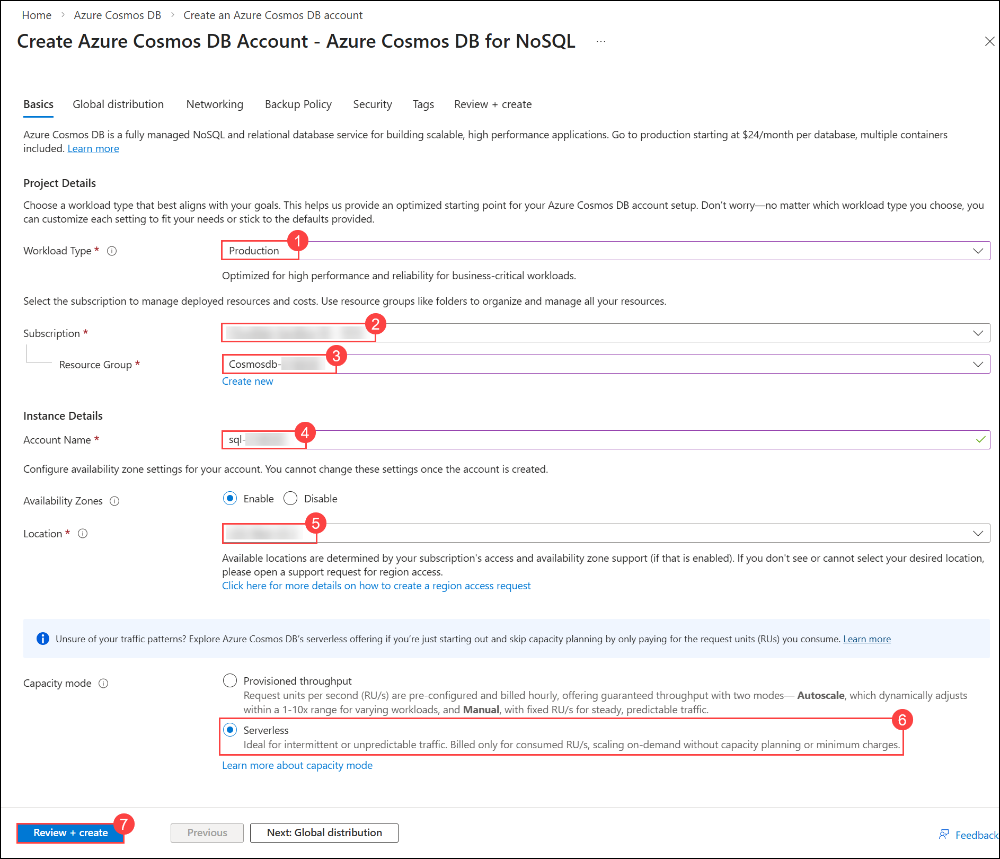

1. 構成を確認し、**Create** をクリックします。

     

1. このタスクを続行する前に、デプロイが完了するまで待ちます。

1. **Go to resources** を選択します。新しく作成した **Azure Cosmos DB** アカウントの **Settings** で **Keys** ペインに移動します。

    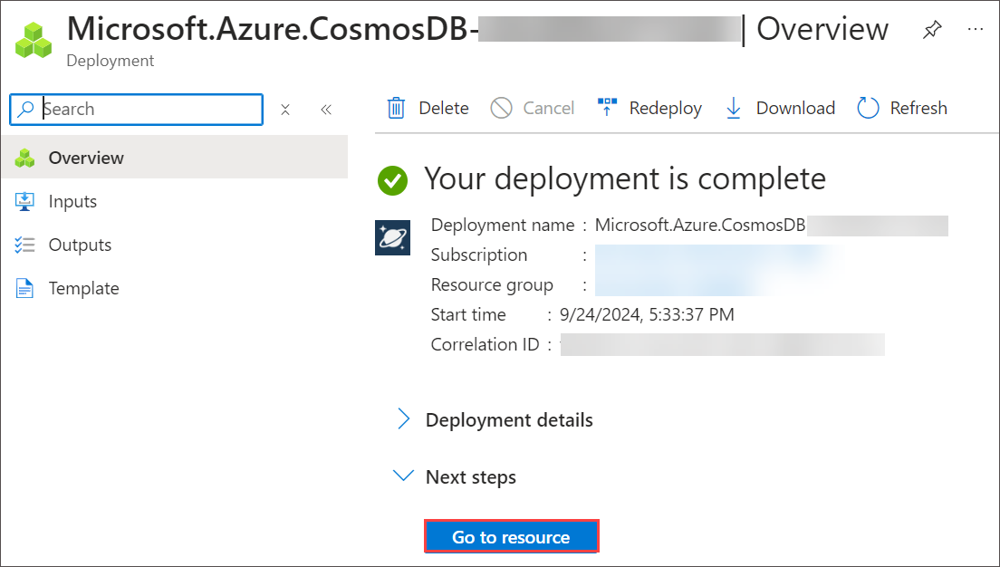

    

1. このペインには、SDK からアカウントに接続するために必要な接続情報と資格情報が含まれています。具体的には:

    - **URI (1)** フィールドの値を記録します。この **endpoint** 値は本演習の後半で使用します。

    - **PRIMARY KEY (2)** フィールドの値を記録します。この **key** 値は本演習の後半で使用します。

        

1. **Azure Cosmos DB** アカウントの **overview page (1)** から **Data Explorer (2)** ペインに移動します。

    

1. **Data Explorer (1)** ページで **New (2)** をクリックし、**New Container (3)** を選択します。

     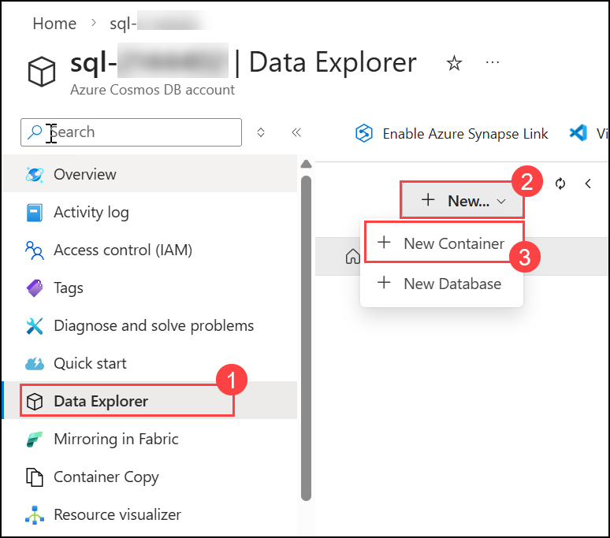

1. **New Container** ペインで次の詳細を入力します:

    | **設定** | **値** |
    | :--- | :--- |
    | **Database id** | `cosmicworks` **(1)** |
    | **Container id** | `products` **(2)** |
    | **Partition key** | `/categoryId` **(3)** |

    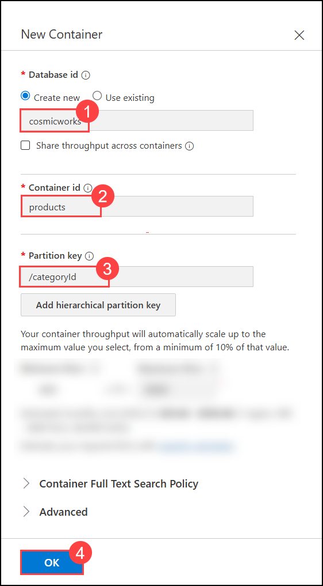

1. **OK (4)** をクリックします。

1. **Data Explorer** ペインに戻り、**cosmicworks** データベース ノードを展開して、階層内に **products** コンテナー ノードが表示されていることを確認します。

    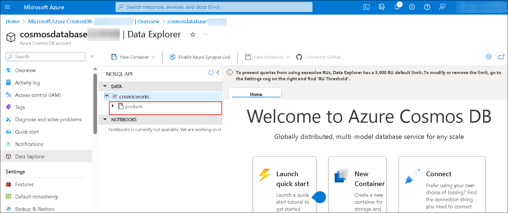

    > **おめでとうございます**。タスクは完了しました。次に検証を行います。手順は次のとおりです:
    > - 対応するタスクの **Validate** ボタンを押します。成功メッセージが表示された場合は次のタスクに進みます。
    > - そうでない場合は、エラーメッセージをよく読み、ラボ ガイドの指示に従って手順をやり直します。
    > - サポートが必要な場合は cloudlabs-support@spektrasystems.com までご連絡ください。24 時間 365 日対応しています。
    
    <validation step="527d4167-c9f9-49aa-9489-c384ed66b37f" />

### タスク 2: Azure Cosmos DB for NoSQL アカウントにサンプルデータを送信する

**cosmicworks** データベースと **products** コンテナーを作成するコマンドライン ユーティリティを使用します。ツールは、その後、ターミナル ウィンドウで実行している change feed processor で観察するアイテムのセットを作成します。

1. Visual Studio Code を起動します（プログラム アイコンはデスクトップにピン留めされています）。

   

1. **Visual Studio Code** で、**... (ellipses) (1)** を選択し、**Terminal (2)** を選択して **New Terminal (3)** を選び、既存のインスタンスで新しいターミナルを開きます。

    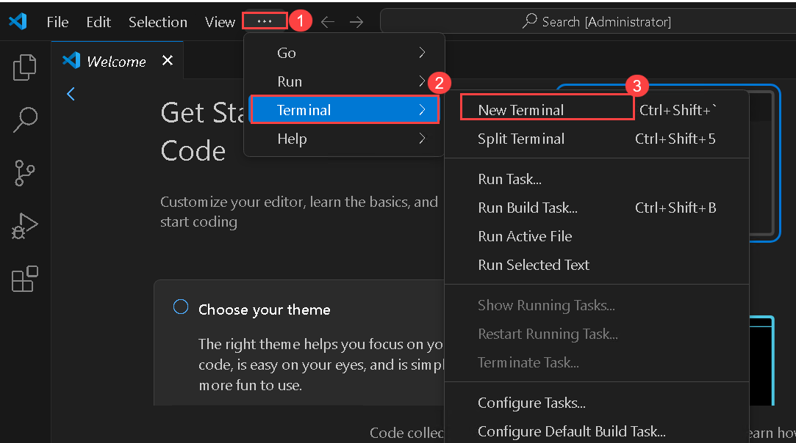

1. [cosmicworks][nuget.org/packages/cosmicworks] コマンドライン ツールをグローバルにインストールします。

    ```
    dotnet tool install cosmicworks --global --version 1.*
    ```

    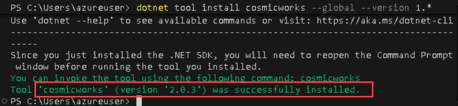

    > **注意:** このコマンドは数分かかる場合があります。すでに最新バージョンのツールがインストールされている場合は、(*Tool 'cosmicworks' is already installed*) という警告メッセージが出力されます。

1. インストールが完了したら、以下のコマンドを実行するために **Visual Studio Code** を閉じて再起動してください。

1. 次のコマンドライン オプションを使用して、Azure Cosmos DB アカウントにデータをシードします:

    | **Option** | **Value** |
    | :--- | :--- |
    | **--endpoint** | *このラボで以前にコピーした endpoint の値* |
    | **--key** | *このラボで以前にコピーした key の値* |
    | **--datasets** | *product* |

    ```
    cosmicworks --endpoint <cosmos-endpoint> --key <cosmos-key> --datasets product
    ```

    > **例:** エンドポイントが **https&shy;://dp420.documents.azure.com:443/**、キーが **fDR2ci9QgkdkvERTQ==** の場合、コマンドは次のようになります:
    > ``cosmicworks --endpoint https://dp420.documents.azure.com:443/ --key fDR2ci9QgkdkvERTQ== --datasets product``

    > **注意:** エラーが発生する場合は、Visual Studio Code を閉じて再起動し、もう一度コマンドを実行してください。

    > **注意:** それでもエラーが発生する場合は、以下の手順を実行してから再度コマンドを実行してください。

    1. Azure ポータルで **Cosmos DB アカウント** を開き、**Settings (1)** を展開して **Networking (2)** を選択します。

    1. **Firewall** の下で **Add your current IP (3)** をクリックするか、IP アドレスを手動で入力します。

        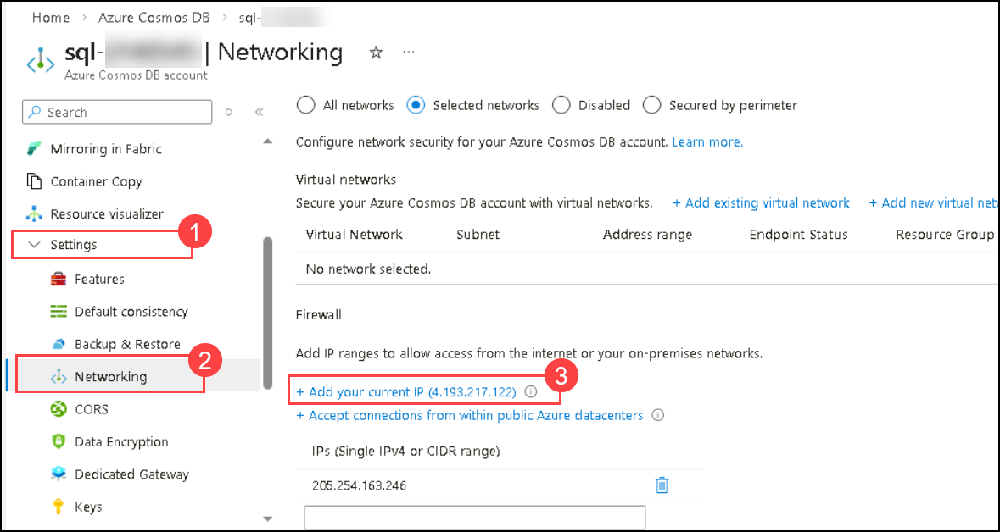

    1. **Save (4)** をクリックして変更を適用します。

        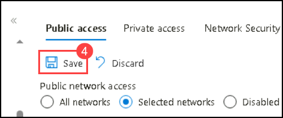

    1. ファイアウォール ルールが有効になるまで数分待ちます。

    1. **Cosmos DB アカウント** で **Settings (1)** を展開し、**Keys (2)** を選択します。

    1. **Primary Connection String (4)** をコピーし、必要に応じて **Show/Hide (3)** オプションを使用して値を表示します。

     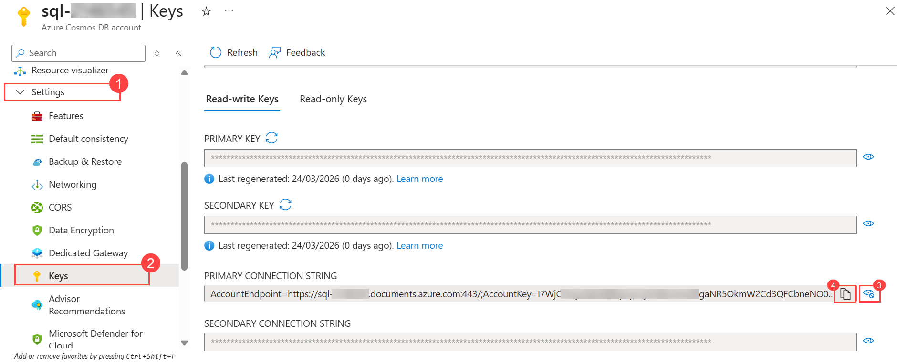

    ```
    cosmicworks --connection-string "<your-connection-string>" --datasets product
    ```

1. **cosmicworks** コマンドがデータベース、コンテナー、およびアイテムの作成を完了するまで待ちます。

1. 統合ターミナルを閉じます。**Visual Studio Code** も閉じます。

### タスク 3: Azure AI Search リソースを作成する

この演習を続行する前に、まず新しい Azure Cognitive Search インスタンスを作成する必要があります。

1. Azure ポータルに戻り、**Create a resource** をクリックします。

     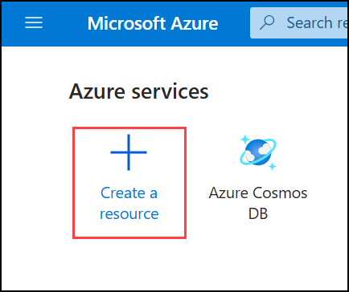

1. **Azure AI Search (1)** を検索し、**Create (2)** を選択して **Azure AI Search (3)** を選びます。

    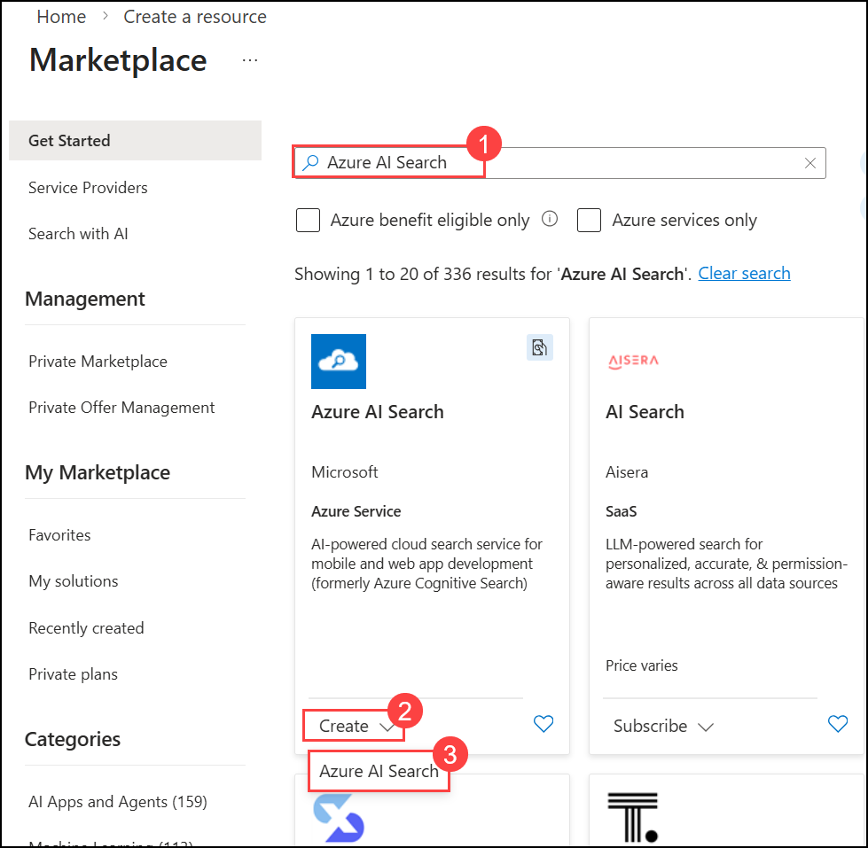

1. 次の詳細を入力します:

    | **設定** | **値** |
    | :--- | :--- |
    | **Subscription** | Azure サブスクリプションを選択 **(1)** |
    | **Resource group** | **cosmosdb-<inject key="DeploymentID" enableCopy="false"/>** を選択 **(2)** |
    | **Service name** | **aisearch-<inject key="DeploymentID" enableCopy="false"/>** を入力 **(3)** |
    | **Location** | 既定のロケーションを使用 **(4)** |

1. **Review + create (5)** をクリックします。

    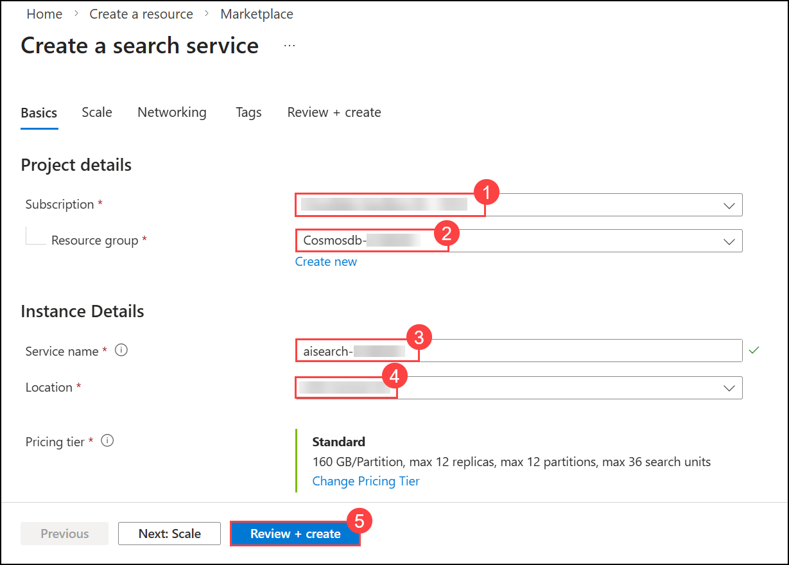
    
    > **注意:** サブスクリプションに関するエラーが表示される場合は、**Next: Scale** を選択し、次に **Previous** を選択します。

1. 検証が成功したら、構成を確認して **Create** をクリックします。

    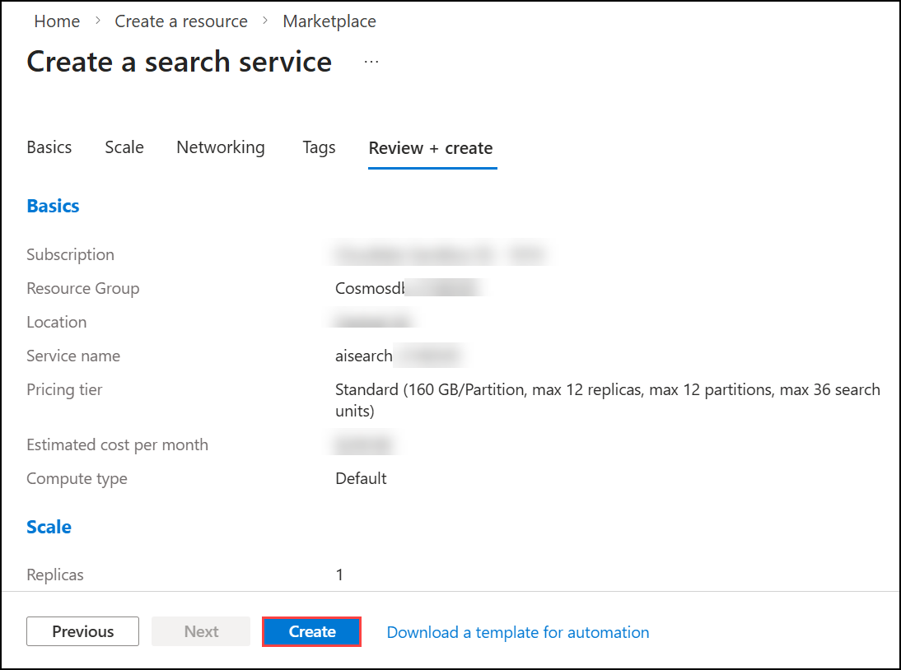

1. デプロイが完了するまで待ち、次に **Go to resource** をクリックして新しく作成した **Azure AI Search** アカウント リソースに移動します。

    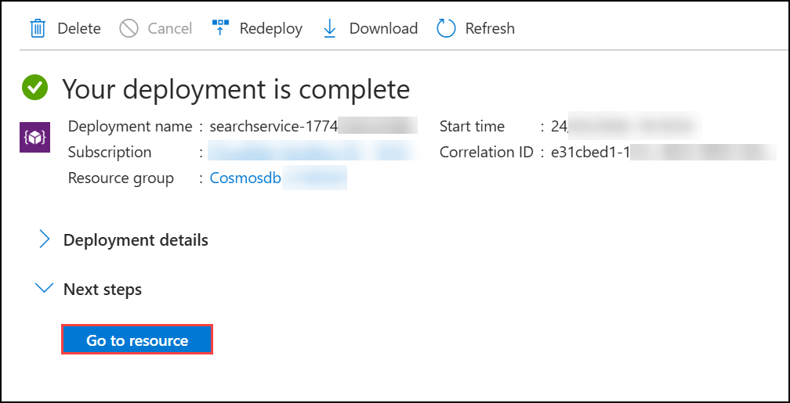

> **おめでとうございます**。タスクが完了しました。次に検証を行います。手順は次のとおりです:
> - 対応するタスクの **Validate** ボタンを押します。成功メッセージが表示された場合は次のタスクに進みます。
> - そうでない場合は、エラーメッセージをよく読み、ラボ ガイドの指示に従って手順をやり直します。
> - サポートが必要な場合は cloudlabs-support@spektrasystems.com までご連絡ください。24 時間 365 日対応しています。
    
<validation step="6dc66a44-b1ce-4dc5-91f8-35180452aaaa" />

### タスク 4: Azure Cosmos DB for NoSQL データ用のインデクサーとインデックスを構築する

特定の Azure Cosmos DB for NoSQL コンテナー内のデータのサブセットを、時間単位でインデックス化するインデクサーを作成します。

1. **AI Search** リソース ブレードで **Import data** を選択します。

    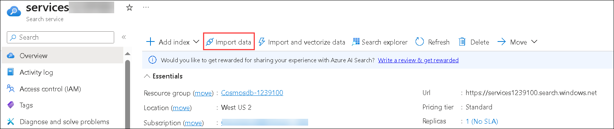

1. **Import data** ウィザードの **Data Source** リストで **Azure Cosmos DB** を選択します。

    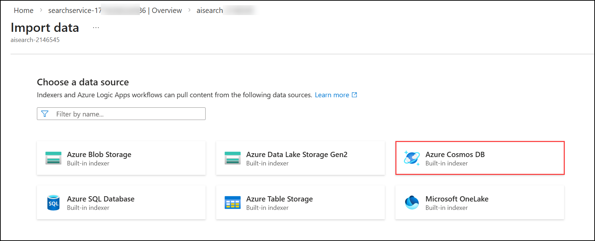

1. 残りの設定はすべて既定値のままにして、次の設定でデータ ソースを構成します:

    | **設定** | **値** |
    | :--- | :--- |
    | **Data source name** | **products-cosmossql-source (2)** |
    | **Connection string** | **以前に作成した Azure Cosmos DB for NoSQL アカウントの既存接続を選択 (3)** |
    | **Database** | **cosmicworks (4)** |
    | **Collection** | **products (5)** |

    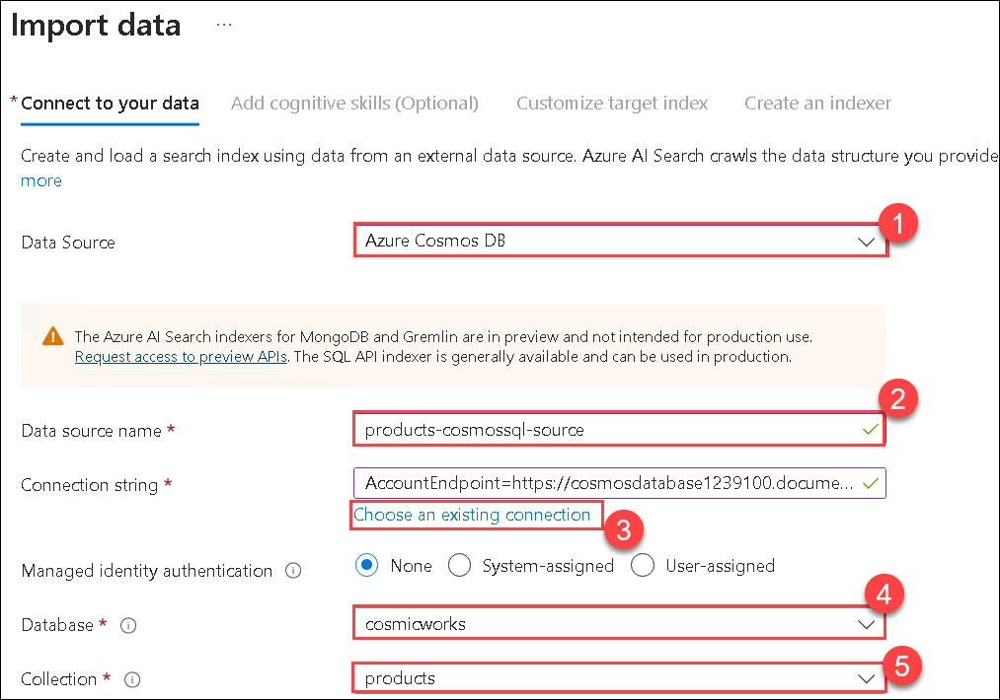

1. **query** フィールドに、コンテナー内のデータのサブセットのマテリアライズド ビューを作成するために次の SQL クエリを入力します:

    ```SQL
    SELECT 
        p.id, 
        p.categoryId, 
        p.name, 
        p.price,
        p._ts
    FROM 
        products p 
    WHERE 
        p._ts > @HighWaterMark 
    ORDER BY 
        p._ts
    ```

1. **Query results ordered by _ts** チェックボックスを選択します。

    > **注意:** このチェックボックスは、クエリが **_ts** フィールドで結果をソートすることを Azure AI Search に知らせます。この種のソートは増分進行追跡を可能にします。インデクサーが失敗した場合でも、結果がタイムスタンプ順に並んでいるので、同じ **_ts** 値から再開できます。

1. **Next: Add cognitive skills** を選択します。

1. **Skip to: Customize target index** を選択します。

1. ウィザードの **Customize target index** ステップで、残りの設定をすべて既定値のままにして次の設定でインデックスを構成します:

    | **設定** | **値** |
    | :--- | :--- |
    | **Index name** | *``products-index``* |
    | **Key** | *id* |

1. フィールド テーブルで、次の表に従って各フィールドの **Retrievable**、**Filterable**、**Sortable**、**Facetable**、および **Searchable** オプションを構成します:

    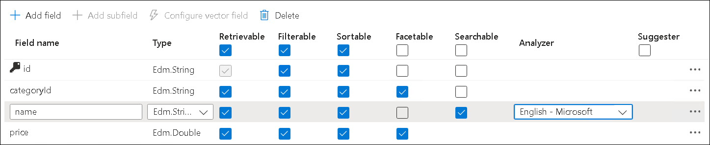

1. **Next: Create an indexer** を選択します。

1. ウィザードの **Create an indexer** ステップで、残りの設定をすべて既定値のままにして次の設定でインデクサーを構成します:

    | **設定** | **値** |
    | :--- | :--- |
    | **Name** | *``products-cosmosdb-indexer``* |
    | **Schedule** | *Hourly* |

1. **Submit** を選択して、データ ソース、インデックス、およびインデクサーを作成します。

    >**Note:** 最初のインデクサーを作成した後、アンケートポップアップを閉じる必要がある場合があります。

1. **AI Search** リソース ブレードで、左側のナビゲーション メニューから **Search Management** の **Indexers (1)** を選択し、最初のインデックス処理の結果を確認します。

1. **products-cosmosdb-indexer** インデクサーのステータスが **Success (2)** になるまで待ってから、このタスクを続行します。

    >**Note:** ブレードが自動的に更新されない場合は、**Refresh** オプションを使用して更新する必要があります。

    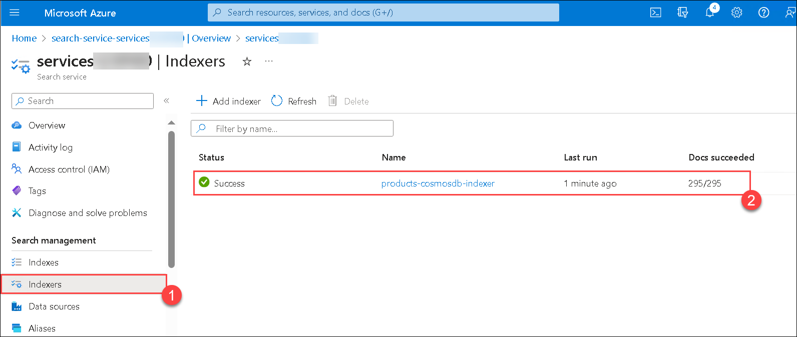

1. 左側のナビゲーション ペインで **Search Management** の **Indexes** タブに移動し、**products-index** インデックスを選択します。

> **おめでとうございます**。タスクは完了しました。次に検証を行います。手順は次のとおりです:
> - 対応するタスクの **Validate** ボタンを押します。成功メッセージが表示された場合は次のタスクに進みます。
> - そうでない場合は、エラーメッセージをよく読み、ラボ ガイドの指示に従って手順をやり直します。
> - サポートが必要な場合は cloudlabs-support@spektrasystems.com までご連絡ください。24 時間 365 日対応しています。
    
<validation step="0e28166a-b18c-4b9b-8f4b-0b4d113890bc" />

### タスク 5: 例示的な検索クエリでインデックスを検証する

Azure Cosmos DB for NoSQL データのマテリアライズド ビューが検索インデックスに作成されたので、Azure AI Search の機能を活用した基本的なクエリをいくつか実行できます。

> **Note:** このラボは Azure AI Search の構文を学習するためのものではありません。これらのクエリは、検索インデックスとエンジンで利用できるいくつかの機能を紹介するために選ばれています。

1. **Search explorer** タブで、**View** プルダウンを選択し、**JSON view** を選びます。

1. **JSON query editor** で、ワイルドカード演算子 **\*** を使用してすべての結果を返すデフォルトの JSON 検索クエリの構文を確認します。

   ```json
   {
       "search": "*"
   }
   ```

1. **Search** ボタンを選択して検索を実行します。

1. この検索クエリがすべての可能な結果を返すことを確認します。

1. **JSON query editor** に次のクエリを入力し、**Search** を選択します:

    ```json
    {
        "search": "touring 3000"
    }
    ```

1. この検索クエリは、**touring** または **3000** のいずれかの用語を含む結果を返し、両方の用語を含む結果にはより高いスコアが付与されます。結果は **@search.score** フィールドの降順でソートされます。

1. **JSON query editor** に次のクエリを入力し、**Search** を選択します:

    ```json
    {
        "search": "red"
        , "count": true
    }
    ```

1. この検索クエリは **red** という用語を含む結果を返すだけでなく、同じページにすべて含まれていない場合でも結果の総数を示すメタデータ フィールドが含まれます。

1. **JSON query editor** に次のクエリを入力し、**Search** を選択します:

    ```json
    {
        "search": "blue"
        , "count": true
        , "top": 6
    }
    ```

1. この検索クエリは、サーバー側により多くの一致が存在する場合でも、1 回に 6 件の結果のみを返します。

1. **JSON query editor** に次のクエリを入力し、**Search** を選択します:

    ```json
    {
        "search": "mountain"
        , "count": true
        , "top": 25
        , "skip": 50
    }
    ```

1. この検索クエリは最初の 50 件の結果をスキップし、25 件の結果を返します。クライアント側のアプリケーションでページ分割されたビューの場合、これは 3 ページ目に相当すると推測できます。

1. **JSON query editor** に次のクエリを入力し、**Search** を選択します:

    ```json
    {
        "search": "touring"
        , "count": true
        , "filter": "price lt 500"
    }
    ```

1. この検索クエリは、数値フィールド **price** の値が 500 未満の結果のみを返します。

1. **JSON query editor** に次のクエリを入力し、**Search** を選択します:

    ```json
    {
        "search": "road"
        , "count": true
        , "top": 15
        , "facets": ["price,interval:500"]
    }
    ```

1. この検索クエリは、現在のページにすべて含まれていない場合でも、各カテゴリに属するアイテム数を示すファセット データのコレクションを返します。この例では、一致するアイテムが 500 間隔の数値 price カテゴリに分類されます。これは通常、クライアント側アプリケーションのフィルターやナビゲーション補助に使用されます。

    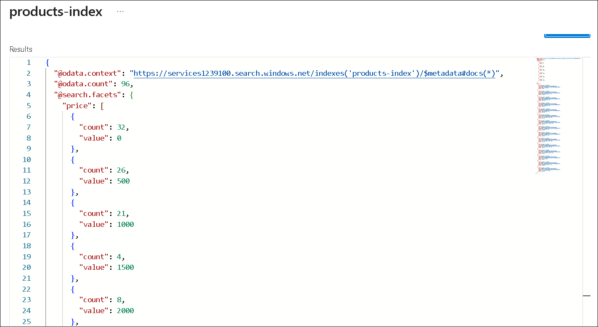

1. Web ブラウザーのウィンドウまたはタブを閉じます。

### レビュー

このラボで完了した内容:

- Azure Cosmos DB for NoSQL アカウントを作成しました。
- Azure Cosmos DB for NoSQL アカウントにサンプルデータを送信しました。
- Azure AI Search リソースを作成しました。
- Azure Cosmos DB for NoSQL データ用のインデクサーとインデックスを構築しました。
- 例示的な検索クエリでインデックスを検証しました。

### サマリー

このラボでは、Azure AI Search と Azure Cosmos DB for NoSQL の統合手順を案内します。Cosmos DB アカウントを作成し、サンプルデータを投入し、Azure Cognitive Search リソースをセットアップして、インデクサーを構築します。

### ラボを正常に完了しました
