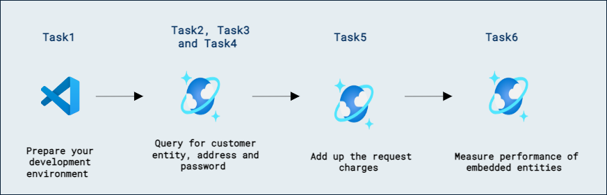
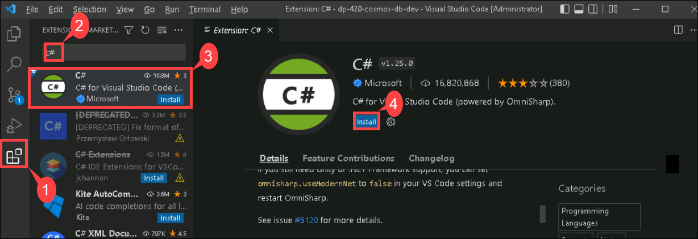
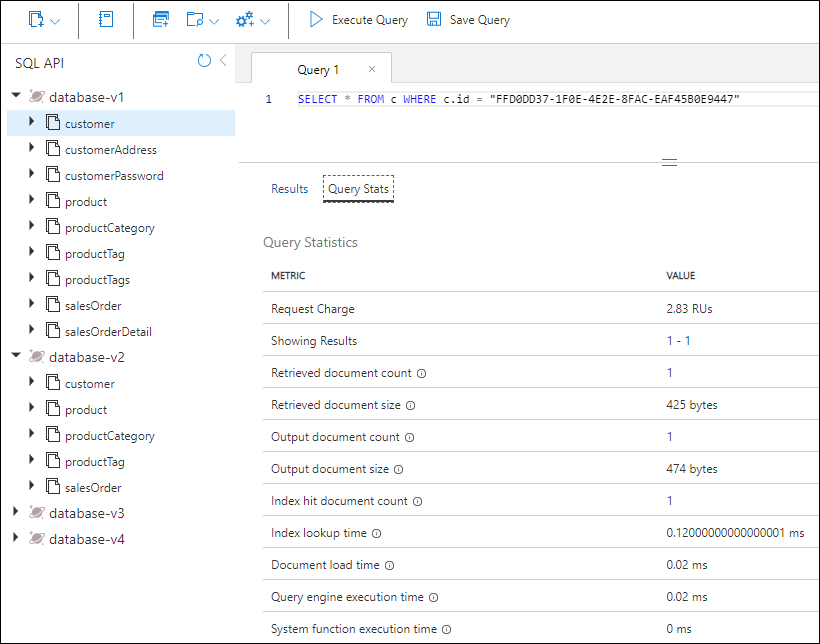
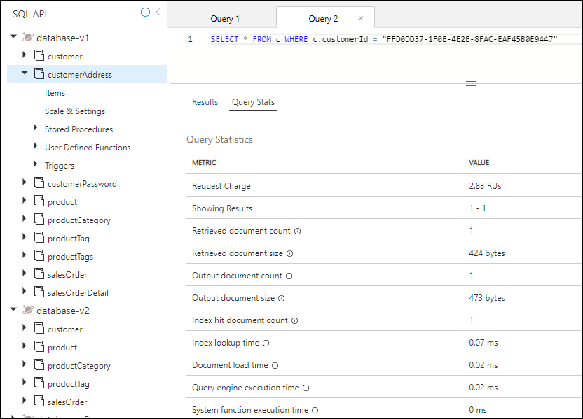
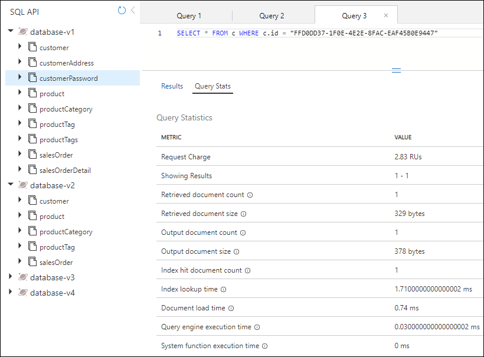
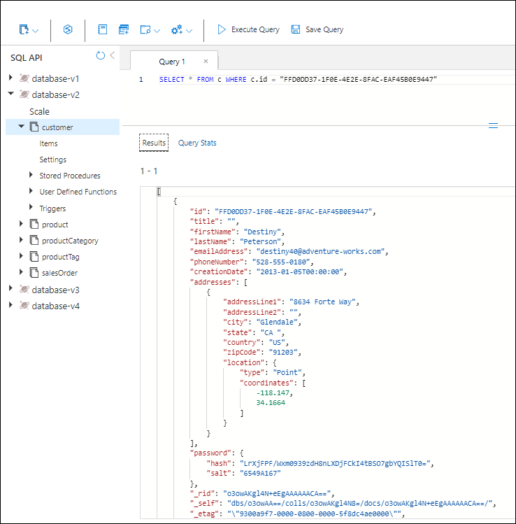

# Lab 08a - Azure Cosmos DB for NoSQL に対するデータ モデリングとパーティション戦略を実装する

## ラボのシナリオ

このラボでは、エンティティを個別のコンテナーとしてモデル化した場合と、NoSQL データベース向けにエンティティを単一ドキュメントに埋め込んでモデル化した場合で、顧客エンティティの差異を測定します。

## ラボの目的:

このラボでは、次のタスクを完了します:
- タスク 1: 開発環境を準備する。
- タスク 2: 顧客エンティティをクエリする。
- タスク 3: 顧客住所をクエリする。
- タスク 4: 顧客パスワードをクエリする。
- タスク 5: リクエスト料金を合計する。
- タスク 6: 埋め込みエンティティのパフォーマンスを測定する。

## 推定所要時間: 30 分

## アーキテクチャ図



## 演習 1: 個別コンテナーと埋め込みコンテナーのエンティティのパフォーマンスを測定する

### タスク 1: 開発環境を準備する

このラボで作業している環境にまだ **DP-420** のラボコード リポジトリをクローンしていない場合は、次の手順に従ってください。すでにクローン済みのフォルダーがある場合は、そのフォルダーを **Visual Studio Code** で開きます。

1. **Visual Studio Code** を起動します。

    > &#128221; Visual Studio Code のインターフェースに不慣れな場合は、[Visual Studio Code の入門ガイド][code.visualstudio.com/docs/getstarted] を参照してください。

1. Visual Studio Code を起動します（プログラム アイコンがデスクトップにピン留めされています）。

1. 左側のペインから **Extension (1)** アイコンを選択します。検索バーに **C# (2)** と入力し、表示された **extension (3)** を選択して、最後に **Install (4)** をクリックします。

    

1. ファイルを開くには、左上のオプションから **file->Open Folder** をクリックし、**C:\AllFiles** に移動します。

1. **dp-420-cosmos-db-dev-stage** フォルダーを選択し、**Select Folder** をクリックします。

1. **Visual Studio Code** の **Explorer** ペインで、**16-measure-performance** フォルダーに移動します。

1. **16-measure-performance** フォルダーのコンテキスト メニューを開き、**Open in Integrated Terminal** を選択して新しいターミナル インスタンスを開きます。

1. ターミナルが **Windows Powershell** ターミナルとして開いた場合は、新しい **Git Bash** ターミナルを開きます。

    > &#128161; **Git Bash** ターミナルを開くには、ターミナル メニューの右側、**+** 記号の横にあるプルダウンをクリックし、*Git Bash* を選択します。

1. **Git Bash ターミナル** で次のコマンドを実行します。これらのコマンドは、ブラウザー ウィンドウを開いて Azure ポータルに接続し、ラボで提供された資格情報を使用して新しい Azure Cosmos DB アカウントを作成するスクリプトを実行し、データベースを投入して演習を完了するためのアプリケーションをビルドおよび起動します。*スクリプトが Azure アカウント用の提供された資格情報を要求した後、ビルドには 15～20 分かかる場合があります。コーヒーやお茶を用意するのにちょうどよい時間です。*

    ```
    az login
    cd 16-measure-performance
    bash init.sh
    dotnet add package Microsoft.Azure.Cosmos --version 3.22.1
    dotnet build
    dotnet run --load-data

    ```

1. 統合ターミナルを閉じます。

## 個別コンテナー内のエンティティのパフォーマンスを測定する

Database-v1 では、データは個別のコンテナーに格納されます。このデータベースで、顧客、顧客住所、および顧客パスワードを取得するクエリを実行します。各クエリの要求料金を確認します。

### タスク 2: 顧客エンティティをクエリする

Database-v1 で、顧客エンティティを取得するクエリを実行し、要求料金を確認します。

1. 新しい Web ブラウザー ウィンドウまたはタブで、Azure ポータル (``portal.azure.com``) にアクセスします。

1. サブスクリプションに関連付けられた Microsoft 資格情報を使用してポータルにサインインします。

1. Azure ポータル メニュー、または **Home** ページから、**Azure Cosmos DB** を選択します。
1. 名前が **cosmicworks** で始まる Azure Cosmos DB アカウントを選択します。
1. 左側で **Data Explorer** を選択します。
1. **Database-v1** を展開します。
1. **Customer** コンテナーを選択します。
1. 画面上部で **New SQL Query** を選択します。
1. 次の SQL テキストをコピーして貼り付け、**Execute Query** を選択します。

    ```
    SELECT * FROM c WHERE c.id = "FFD0DD37-1F0E-4E2E-8FAC-EAF45B0E9447"
    ```

1. **Query Stats** タブを選択し、要求料金が 2.83 であることを確認します。

    

### タスク 3: 顧客住所をクエリする

顧客住所エンティティを取得するクエリを実行し、要求料金を確認します。

1. **CustomerAddress** コンテナーを選択します。
1. 画面上部で **New SQL Query** を選択します。
1. 次の SQL テキストをコピーして貼り付け、**Execute Query** を選択します。

    ```
    SELECT * FROM c WHERE c.customerId = "FFD0DD37-1F0E-4E2E-8FAC-EAF45B0E9447"
    ```

1. **Query Stats** タブを選択し、要求料金が 2.83 であることを確認します。

    

### タスク 4: 顧客パスワードをクエリする

顧客パスワードエンティティを取得するクエリを実行し、要求料金を確認します。

1. **CustomerPassword** コンテナーを選択します。
1. 画面上部で **New SQL Query** を選択します。
1. 次の SQL テキストをコピーして貼り付け、**Execute Query** を選択します。

    ```
    SELECT * FROM c WHERE c.id = "FFD0DD37-1F0E-4E2E-8FAC-EAF45B0E9447"
    ```

1. **Query Stats** タブを選択し、要求料金が 2.83 であることを確認します。

    

### タスク 5: 要求料金を合計する

すべてのクエリを実行したので、これらの Request Unit コストを合計します。

|**Query**|**RU/s cost**|
| --- | --- |
|Customer|2.83|
|Customer Address|2.83|
|Customer Password|2.83|
|**Total RU/s**|**8.49**|

### タスク 6: 埋め込みエンティティのパフォーマンスを測定する

同じ情報を、エンティティを単一のドキュメントに埋め込んだ状態でクエリします。

1. **Database-v2** データベースを選択します。
1. **Customer** コンテナーを選択します。
1. 次のクエリを実行します。

    ```
    SELECT * FROM c WHERE c.id = "FFD0DD37-1F0E-4E2E-8FAC-EAF45B0E9447"
    ```

1. 返されるデータが、顧客、住所、パスワードの階層構造になっていることを確認します。

    

1. **Query Stats** を選択します。要求料金が 2.83 で、以前に実行した 3 つのクエリの合計 8.49 RU/s と比べて低いことを確認します。

## 2 つのモデルのパフォーマンスを比較する

実行した各クエリの RU/s を比較すると、顧客エンティティが単一ドキュメントにある最後のクエリは、3 つのクエリを個別に実行した合計コストよりもはるかに低コストであることがわかります。データが 1 つの操作で返されるため、このデータを返すレイテンシーも低くなります。

単一の項目を検索し、データのパーティションキーと ID がわかっている場合は、Azure Cosmos DB SDK の `ReadItemAsync()` を呼び出して *point-read* でこのデータを取得できます。point-read はクエリよりもさらに高速です。同じ顧客データの場合、コストは 1 RU/s で、ほぼ 3 倍の改善になります。

### レビュー

このラボで完了した内容:

- 開発環境を準備しました。
- 顧客エンティティをクエリしました。
- 顧客住所をクエリしました。
- 顧客パスワードをクエリしました。
- 要求料金を合計しました。
- 埋め込みエンティティのパフォーマンスを測定しました。

### ラボを正常に完了しました
