# Lab 08b - Azure Cosmos DB for NoSQL に対するデータ モデリングとパーティション戦略を実装する

## ラボのシナリオ

リレーショナル モデルでは、異なるエンティティをそれぞれ別のコンテナーに配置できます。しかし、NoSQL データベースにはコンテナー間の *join* がないため、*join* の使用を排除するためにデータの非正規化を開始する必要があります。さらに、NoSQL では、アプリケーションができるだけ少ないリクエストでデータを取得できるようにデータをモデリングすることで、リクエストの数を削減します。データを非正規化すると、エンティティ間の参照整合性が問題になる場合がありますが、これを同期状態に保つために変更フィードを使用できます。グループ化の集計カウントのような集計を非正規化することも、リクエストの削減に役立ちます。

このラボでは、データと集計を非正規化することでコストを削減できる利点、および変更フィードを使用して非正規化されたデータの参照整合性を維持する方法を確認します。

## ラボの目的

このラボでは、次の演習を完了します:
- 演習 1: データを非正規化した場合のパフォーマンス コストを測定する。
- 演習 2: 変更フィードを使用して参照整合性を管理する。
- 演習 3: 集計を非正規化する。

## 推定所要時間: 30 分

## アーキテクチャ図

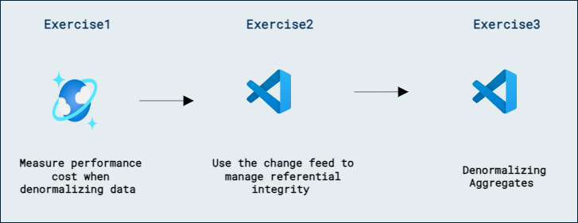

## ラボ: データと集計の非正規化のコスト、および参照整合性のために変更フィードを使用する

## 開発環境を準備する

このラボを作業している環境にまだ **DP-420** のラボコード リポジトリをクローンしていない場合は、次の手順に従ってください。すでにクローン済みのフォルダーがある場合は、そのフォルダーを **Visual Studio Code** で開きます。

1. **Visual Studio Code** を起動します。

    > &#128221; Visual Studio Code のインターフェースに不慣れな場合は、[Visual Studio Code の入門ガイド][code.visualstudio.com/docs/getstarted] を参照してください。

1. コマンド パレットを開き、**Git: Clone** を実行して、``https://github.com/microsoftlearning/dp-420-cosmos-db-dev`` GitHub リポジトリを任意のローカル フォルダーにクローンします。

    > &#128161; コマンド パレットを開くには、**CTRL+SHIFT+P** のキーボード ショートカットを使用できます。

1. リポジトリがクローンされたら、選択したローカル フォルダーを **Visual Studio Code** で開きます。

1. **Visual Studio Code** の **Explorer** ペインで、**17-denormalize** フォルダーに移動します。

1. **17-denormalize** フォルダーのコンテキスト メニューを開き、**Open in Integrated Terminal** を選択して新しいターミナル インスタンスを開きます。

1. ターミナルが **Windows Powershell** ターミナルとして開いた場合は、新しい **Git Bash** ターミナルを開きます。

    > &#128161; **Git Bash** ターミナルを開くには、ターミナル メニューの右側、**+** 記号の横にあるプルダウンをクリックし、*Git Bash* を選択します。

1. **Git Bash ターミナル** で次のコマンドを実行します。これらのコマンドは、ブラウザー ウィンドウを開いて Azure ポータルに接続し、提供されたラボ資格情報を使用して新しい Azure Cosmos DB アカウントを作成するスクリプトを実行し、データベースを投入して演習を完了するためのアプリケーションをビルドおよび起動します。*スクリプトが Azure アカウント用の提供された資格情報を要求した後、ビルドには 15～20 分かかる場合があります。コーヒーやお茶を用意するとよいでしょう。*

    ```
    az login
    cd 17-denormalize
    bash init.sh
    dotnet add package Microsoft.Azure.Cosmos --version 3.22.1
    dotnet build
    dotnet run --load-data

    ```

1. 統合ターミナルを閉じます。

## 演習 1: データを非正規化した場合のパフォーマンス コストを測定する

### タスク 1: 製品カテゴリ名を照会する

データが個別のコンテナーに格納されている **database-v2** コンテナーで、製品カテゴリ名を取得するクエリを実行し、そのクエリの要求料金を確認します。

1. 新しい Web ブラウザー ウィンドウまたはタブで Azure ポータル (``portal.azure.com``) にアクセスします。

1. サブスクリプションに関連付けられた Microsoft 資格情報を使用してポータルにサインインします。

1. 左側のペインで **Azure Cosmos DB** を選択します。
1. 名前が **cosmicworks** で始まる Azure Cosmos DB アカウントを選択します。
1. 左側のペインで **Data Explorer** を選択します。
1. **database-v2** を展開します。
1. **productCategory** コンテナーを選択します。
1. ページ上部で **New SQL Query** を選択します。
1. **Query 1** ペインに次の SQL コードを貼り付け、**Execute Query** を選択します。

    ```
    SELECT * FROM c where c.type = 'category' and c.id = "AB952F9F-5ABA-4251-BC2D-AFF8DF412A4A"
    ```

1. **Results** タブを選択して結果を確認します。このクエリは製品カテゴリ名 "Components, Headsets." を返します。

    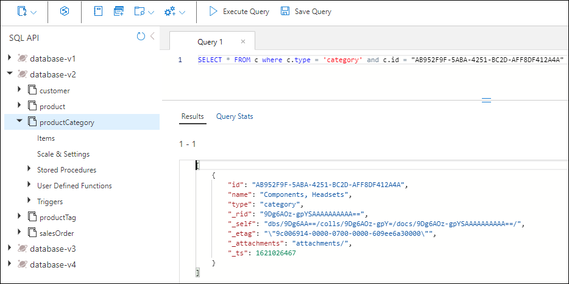

1. **Query Stats** タブを選択し、要求料金が 2.93 RU (request units) であることを確認します。

    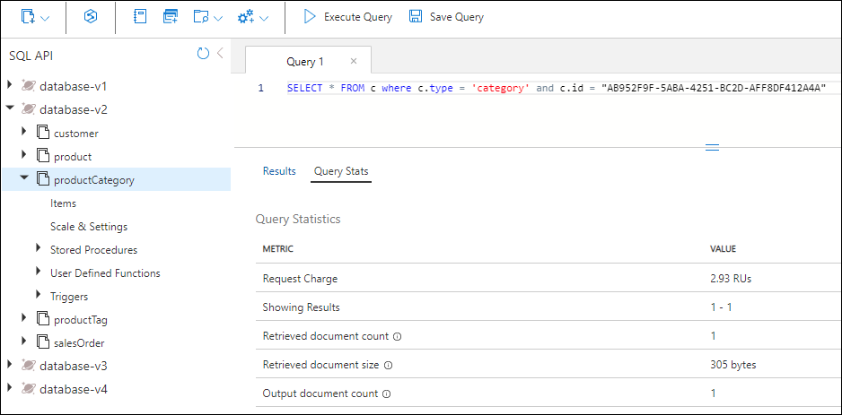

### タスク 2: カテゴリ内の製品を照会する

次に、製品コンテナーをクエリして「Components, Headsets」カテゴリ内のすべての製品を取得します。

1. **product** コンテナーを選択します。
1. ページ上部で **New SQL Query** を選択します。
1. **Query 2** ペインに次の SQL コードを貼り付け、**Execute Query** を選択します。

    ```
    SELECT * FROM c where c.categoryId = "AB952F9F-5ABA-4251-BC2D-AFF8DF412A4A"
    ```

1. **Results** タブを選択して結果を確認します。HL Headset、LL Headset、および ML Headset の 3 つの製品が返されます。各製品には SKU、名前、価格、および製品タグの配列が含まれます。

1. **Query Stats** タブを選択し、要求料金が 2.9 RU であることを確認します。

    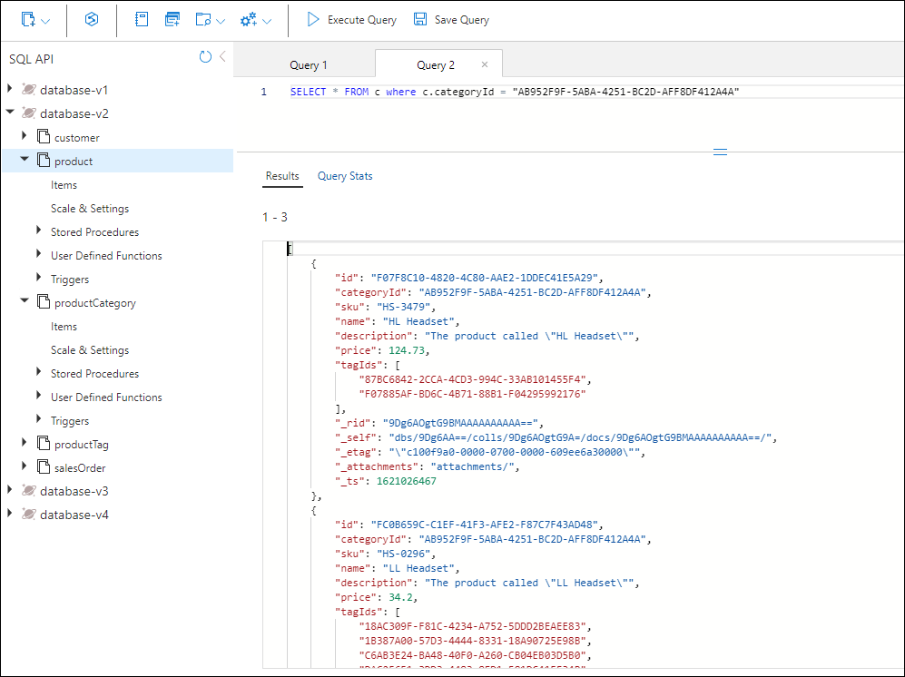

### タスク 3: 各製品のタグを照会する

次に、productTag コンテナーを 3 回クエリします。対象は HL Headset、LL Headset、および ML Headset の 3 つの製品です。

#### HL ヘッドセットのタグ

まず、HL Headset のタグを返すクエリを実行します。

1. **productTag** コンテナーを選択します。
1. ページ上部で **New SQL Query** を選択します。
1. **Query 3** ペインに次の SQL コードを貼り付け、**Execute Query** を選択します。

    ```
    SELECT * FROM c where c.type = 'tag' and c.id IN ('87BC6842-2CCA-4CD3-994C-33AB101455F4', 'F07885AF-BD6C-4B71-88B1-F04295992176')
    ```

    このクエリは HL Headset 製品の 2 つのタグを返します。

1. **Query Stats** タブを選択し、要求料金が 3.06 RU であることを確認します。

    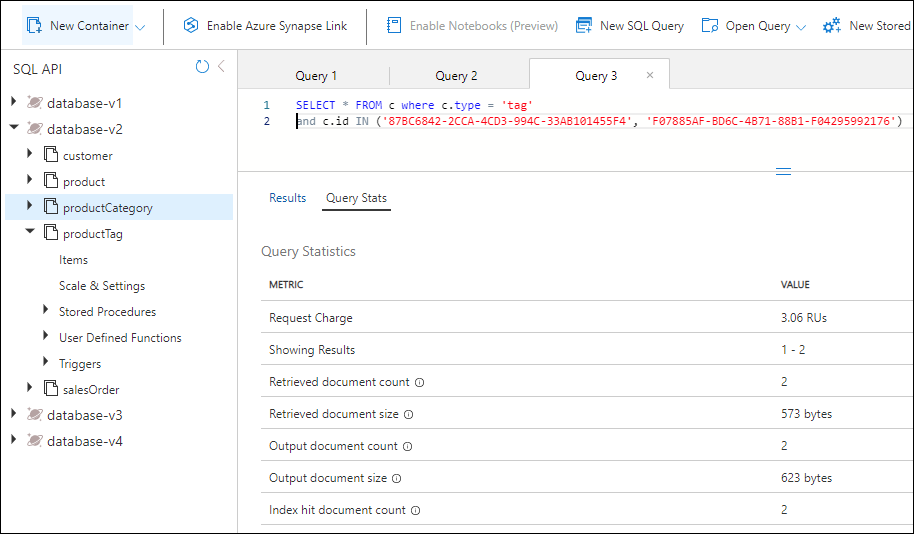

#### LL ヘッドセットのタグ

次に、LL Headset のタグを返すクエリを実行します。

1. **productTag** コンテナーを選択します。
1. ページ上部で **New SQL Query** を選択します。
1. **Query 4** ペインに次の SQL コードを貼り付け、**Execute Query** を選択します。

    ```
    SELECT * FROM c where c.type = 'tag' and c.id IN ('18AC309F-F81C-4234-A752-5DDD2BEAEE83', '1B387A00-57D3-4444-8331-18A90725E98B', 'C6AB3E24-BA48-40F0-A260-CB04EB03D5B0', 'DAC25651-3DD3-4483-8FD1-581DC41EF34B', 'E6D5275B-8C42-47AE-BDEC-FC708DB3E0AC')
    ```

    このクエリは LL Headset 製品の 5 つのタグを返します。

1. **Query Stats** タブを選択し、要求料金が 3.47 RU であることを確認します。

    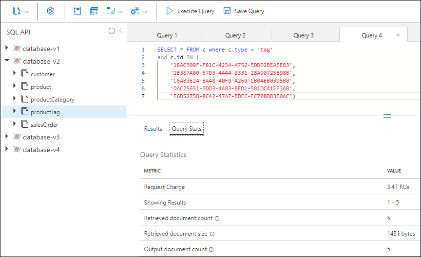

#### ML ヘッドセットのタグ

最後に、ML Headset のタグを返すクエリを実行します。

1. **productTag** コンテナーを選択します。
1. ページ上部で **New SQL Query** を選択します。
1. **Query 5** ペインに次の SQL コードを貼り付け、**Execute Query** を選択します。

    ```
    SELECT * FROM c where c.type = 'tag' and c.id IN ('A34D34F7-3286-4FA4-B4B0-5E61CCEEE197', 'BA4D7ABD-2E82-4DC2-ACF2-5D3B0DEAE1C1', 'D69B1B6C-4963-4E85-8FA5-6A3E1CD1C83B')
    ```

    このクエリは ML Headset 製品の 3 つのタグを返します。

1. **Query Stats** タブを選択し、要求料金が 3.2 RU であることを確認します。

    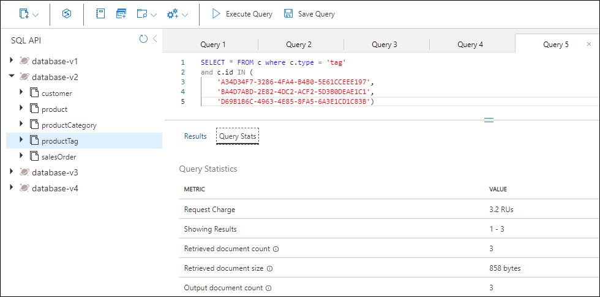

### RU 料金を合計する

ここまで実行した各クエリの RU コストを合計します。

|**Query**|**RU/s cost**|
|---------|---------|
|Category name|2.93|
|Product|2.9|
|HL product tags|3.06|
|LL product tags|3.47|
|ML product tags|3.2|
|**Total RU cost**|**15.56**|

### NoSQL 設計でも同じクエリを実行する

同じ情報を非正規化されたデータベースでクエリします。

1. Data Explorer で **database-v3** を選択します。
1. **product** コンテナーを選択します。
1. ページ上部で **New SQL Query** を選択します。
1. **Query 6** ペインに次の SQL コードを貼り付け、**Execute Query** を選択します。

    ```
   SELECT * FROM c where c.categoryId = "AB952F9F-5ABA-4251-BC2D-AFF8DF412A4A"
   ```

    結果は次のようになります。

    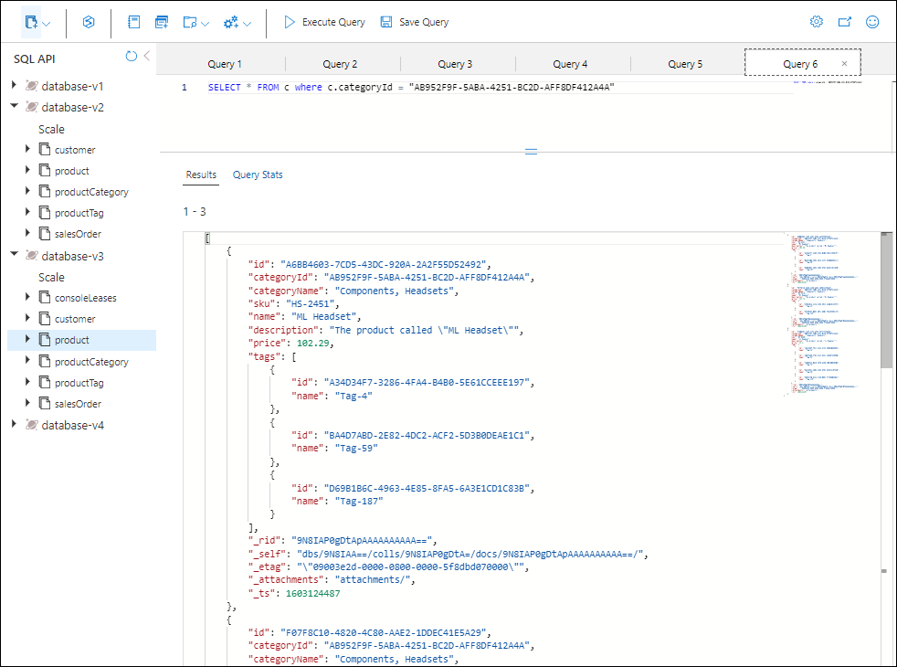

1. このクエリで返されるデータを確認します。カテゴリ名と 3 つの製品それぞれのタグ名を含み、このカテゴリの製品をレンダリングするために必要なすべての情報が含まれています。

1. **Query Stats** タブを選択し、要求料金が 2.9 RU であることを確認します。

### 2 つのモデルのパフォーマンスを比較する

個別のコンテナーにデータを格納するリレーショナル モデルでは、カテゴリの名前、このカテゴリのすべての製品、および各製品のタグを取得するために 5 つのクエリを実行しました。5 つのクエリの要求料金の合計は 15.56 RU でした。

同じ情報を NoSQL モデルで取得するには、1 つのクエリを実行し、要求料金は 2.9 RU でした。

このモデルの利点は、低コストであるだけではありません。このような設計は 1 つの要求で済むため高速でもあります。さらに、データ自体が Web ページで表示される可能性の高い形で提供されるため、e コマース アプリケーションの下流で記述および保守するコードも少なくて済みます。

データを非正規化すると、e コマース アプリケーションにとってよりシンプルで効率的なクエリが可能になります。必要なすべてのデータを単一のコンテナーに格納し、単一のクエリで取得できます。高同時実行クエリを扱う場合、この種のデータ モデリングは単純さ、速度、およびコストの面で大きなメリットを提供します。

---

## 演習 2: 変更フィードを使用して参照整合性を管理する

このユニットでは、変更フィードが Azure Cosmos DB の 2 つのコンテナー間の参照整合性を維持するのにどのように役立つかを確認します。このシナリオでは、productCategory コンテナーを監視するために変更フィードを使用します。製品カテゴリ名を更新すると、変更フィードが更新された名前をキャプチャし、そのカテゴリ内のすべての製品を新しい名前で更新します。

この演習では、次の手順を完了します:

- 理解を深めるための C# コードを完成させます。
- 変更フィード プロセッサーを開始し、productCategory コンテナーの監視を開始します。
- 名前を変更するカテゴリの製品コンテナーをクエリし、そのカテゴリ内の製品数を確認します。
- カテゴリ名を更新し、変更フィードが製品コンテナーに変更を伝播するのを確認します。
- 新しいカテゴリ名で新しい製品コンテナーをクエリし、すべての製品が更新されていることを確認するために製品数を数えます。
- 名前を元の値に戻し、変更フィードが再度変更を伝播するのを確認します。

### Azure Cloud Shell を起動し、Visual Studio Code を開く

変更フィード用に更新するコードに移動するには、次の手順を実行します。

1. まだ開かれていない場合は Visual Studio Code を開き、*17-denormalize* フォルダー内の *Program.cs* ファイルを開きます。

### タスク 1: 変更フィード用のコードを完成する

delegate に渡される変更を処理し、そのカテゴリの各製品をループして更新するコードを追加します。

1. 変更フィード プロセッサーを開始する関数に移動します。

1. Ctrl+G を選択し、**603** と入力してその行に移動します。

1. 次のコードが表示されます:

    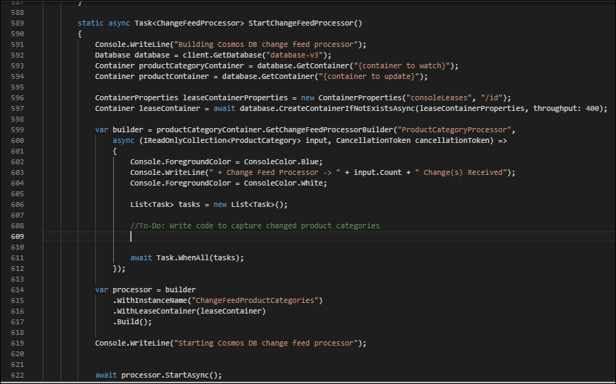

   588 行と 589 行には 2 つのコンテナー参照があります。これらを正しいコンテナー名に更新する必要があります。変更フィードはコンテナー参照上で変更フィード プロセッサーのインスタンスを作成することで動作します。この場合、productCategory コンテナーの変更を監視しています。

1. 588 行で **{container to watch}** を `productCategory` に置き換えます。

1. 589 行で **{container to update}** を `product` に置き換えます。製品カテゴリ名が更新されると、そのカテゴリ内のすべての製品を新しい製品カテゴリ名で更新する必要があります。

    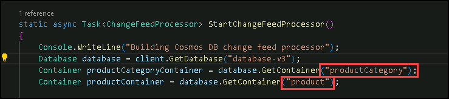

1. *container to watch* と *container to update* の下にある *leaseContainer* 行を確認します。leaseContainer はコンテナー上のチェックポイントのように機能します。変更フィード プロセッサーが最後にチェックした以降に何が更新されたかを把握します。
  
   変更フィードが新しい変更を検出すると、delegate を呼び出し、変更を読み取り専用コレクションとして渡します。

1. 603 行で、変更フィードに新しい変更が発生したときに呼び出されるコードを追加します。**//To-Do:** で始まる行の下に次のコード スニペットをコピーして貼り付けます。

    ```
    //Fetch each change to productCategory container
    foreach (ProductCategory item in input)
    {
        string categoryId = item.id;
        string categoryName = item.name;
    
        tasks.Add(UpdateProductCategoryName(productContainer, categoryId, categoryName));
    }
    ```

1. コードは次の画像のようになります:

    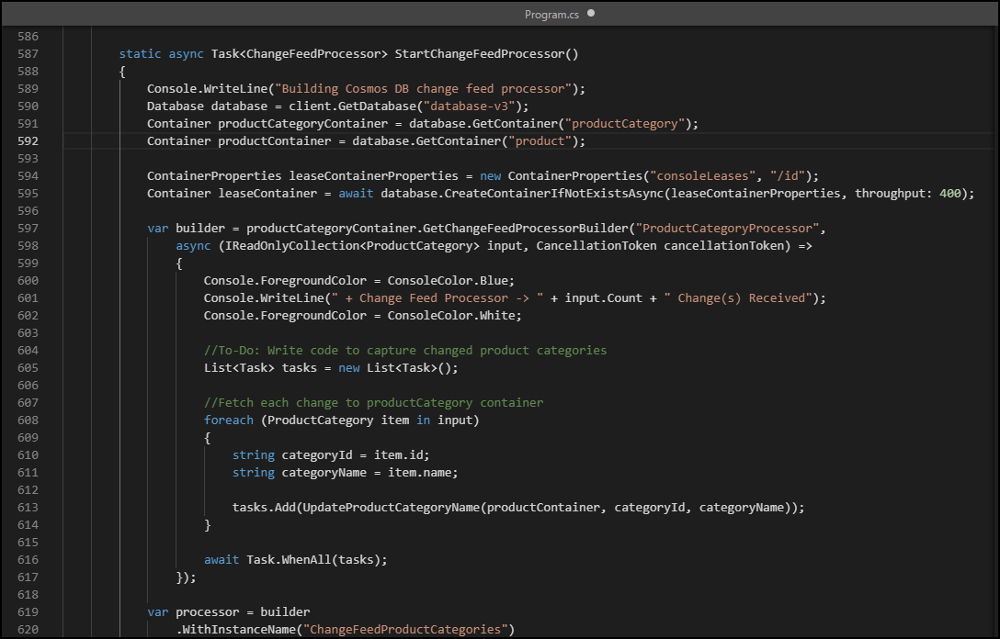

    既定では、変更フィードは 1 秒ごとに実行されます。監視対象コンテナーへの挿入や更新が多いシナリオでは、delegate に複数の変更が含まれる場合があります。このため、delegate **input** の型は **IReadOnlyCollection** にします。

    このコード スニペットは delegate **input** のすべての変更をループし、**categoryId** と **categoryName** を文字列として保存します。その後、更新されたカテゴリ名で製品コンテナーを更新する別の関数を呼び出すタスクをタスクリストに追加します。

1. Ctrl+G を選択し、**647** を入力して **UpdateProductCategoryName()** 関数を検索します。ここで、変更フィードがキャプチャした新しいカテゴリ名で製品コンテナー内の各製品を更新するコードを記述します。

1. 次のコード スニペットをコピーし、**//To-Do:** で始まる行の下に貼り付けます。この関数は 2 つの処理を行います。まず、渡された **categoryId** に基づいて product コンテナーのすべての製品をクエリします。次に、各製品を新しい製品カテゴリ名で更新します。

    ```
    //Loop through all products
    foreach (Product product in response)
    {
        productCount++;
        //update category name for product
        product.categoryName = categoryName;
    
        //write the update back to product container
        await productContainer.ReplaceItemAsync(
            partitionKey: new PartitionKey(categoryId),
            id: product.id,
            item: product);
    }
    ```

    コードはクエリの response オブジェクトから行を読み取り、返されたすべての製品で製品コンテナーを更新します。

    **foreach()** ループを使用して、返された各製品を処理しています。各行について、更新された製品数を把握するためにカウンターを増やし、製品のカテゴリ名を新しい **categoryName** に更新します。最後に **ReplaceItemAsync()** を呼び出して、更新された製品を製品コンテナーに書き戻します。

1. Ctrl+S を選択して変更を保存します。

1. まだ開かれていない場合は Git Bash 統合ターミナルを開き、*17-denormalize* フォルダーに移動していることを確認します。

1. プロジェクトをコンパイルして実行するには、次のコマンドを実行します:

    ```
    dotnet build
    dotnet run
    ```

1. 画面にアプリケーションのメイン メニューが表示されます。

    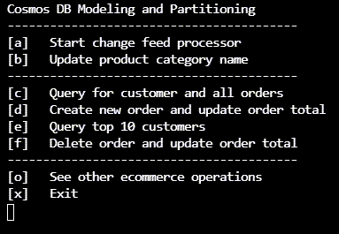

### タスク 2: 変更フィードのサンプルを実行する

変更フィードのコードが完了したので、実際に動作させてみましょう。

1. メイン メニューで **a** を選択し、変更フィード プロセッサーを開始します。画面に進行状況が表示されます。

    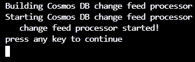

1. 任意のキーを押してメイン メニューに戻ります。

1. メイン メニューで **b** を選択し、製品カテゴリ名を更新します。次の手順が実行されます:

    a. **Accessories, Tires, and Tubes** カテゴリの製品コンテナーをクエリし、そのカテゴリ内の製品数を数えます。  
    b. カテゴリ名を更新し、「and」をアンパサンド (&) に置き換えます。  
    c. 変更フィードがその変更を検出し、作成したコードを使用してそのカテゴリのすべての製品を更新します。  
    d. 変更フィードが名前の変更を元に戻し、カテゴリ名を元の「and」に戻します。  
    e. 変更フィードがその変更を検出し、すべての製品を元の製品カテゴリ名に戻します。

1. メイン メニューで **b** を選択し、変更フィードが 2 回目に実行されるまでプロンプトに従います。結果は次のようになります:

    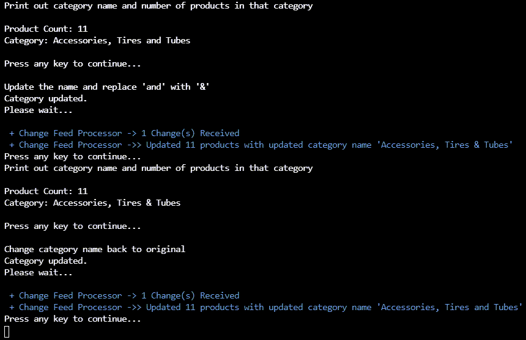

1. クリックしすぎてメイン メニューに戻ってしまった場合は、再度 **b** を選択して変更を確認します。

1. 終了するには **x** を入力して Cloud Shell に戻ります。

---

## 演習 3: 集計の非正規化

このユニットでは、e コマース サイトの上位 10 人の顧客クエリを作成するために集計を非正規化する方法を確認します。Azure Cosmos DB .NET SDK の transactional batch 機能を使用して、新しい販売注文を同時に挿入し、同じ論理パーティション内の顧客の **salesOrderCount** プロパティを更新します。

この演習では、次の手順を完了します:

- 新しい販売注文を作成するコードを確認します。
- 顧客の *salesOrderCount* をインクリメントする C# コードを完成させます。
- 新しい販売注文を挿入し、transactional batch を使用して顧客レコードを更新するトランザクションを実装する C# コードを完成させます。
- 特定の顧客のクエリを実行し、顧客レコードと顧客のすべての注文を表示します。
- その顧客の新しい販売注文を作成し、**salesOrderCount** プロパティを更新します。
- 上位 10 人の顧客クエリを実行し、現在の結果を確認します。
- 顧客が注文をキャンセルした場合に transaction batch をどのように使用できるかを確認します。

## Visual Studio Code を開く

このユニットで使用するコードに移動するには、次の手順を実行します。

1. まだ開かれていない場合は Visual Studio Code を開き、*17-denormalize* フォルダー内の *Program.cs* ファイルを開きます。

### タスク 1: 総販売注文数を更新するコードを完成する

1. 新しい販売注文を作成する関数に移動します。

1. Ctrl+G を選択し、**483** と入力してその行に移動します。

1. 次のコードが表示されます:

    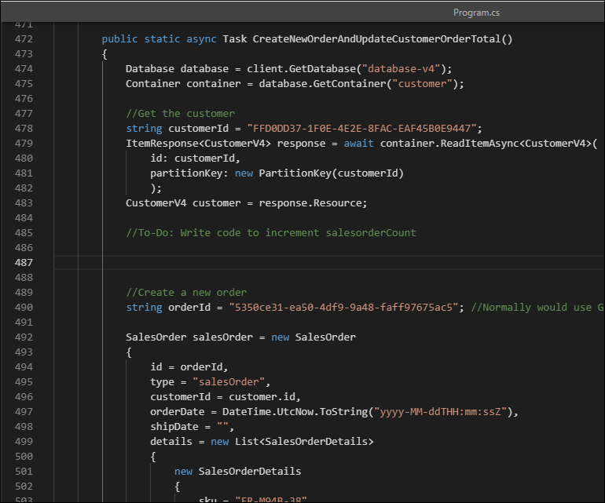

    この関数は、新しい販売注文を作成し、transactional batch を使用して顧客レコードを更新します。

    まず、**ReadItemAsync()** を呼び出し、**customerId** をパーティション キーおよび ID として渡して顧客レコードを取得します。

1. 483 行目の **//To-Do:** コメントの下に、次のコード スニペットを貼り付けて **salesOrderCount** の値をインクリメントします:

    ```
    //Increment the salesOrderTotal property
    customer.salesOrderCount++;
    ```

    画面は次のようになります:

    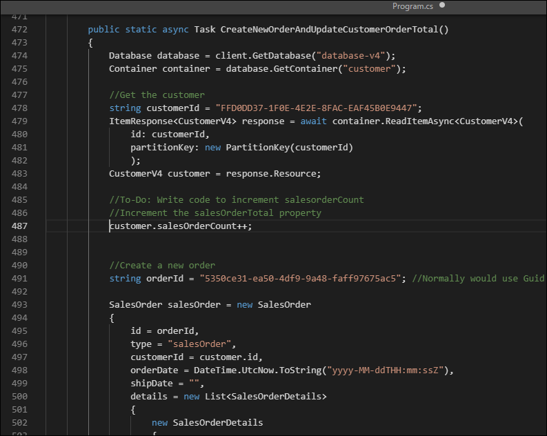

### タスク 2: transactional batch を実装するコードを完成する

1. 数行下にスクロールして、顧客のために作成する新しい販売注文のデータを確認します。

    新しい販売注文オブジェクトには、e コマース アプリケーションの販売注文に典型的なヘッダーと明細の構造があります。

    販売注文ヘッダーには、**orderId**、**customerId**、**orderDate**、および **shipDate** があり、これらは空白のままにします。

    顧客コンテナーには顧客と販売注文の両方のエンティティが含まれるため、販売注文オブジェクトには識別プロパティ **type** も含まれ、その値は **salesOrder** です。これにより、顧客コンテナー内の顧客オブジェクトと販売注文オブジェクトを区別できます。

    さらに下にスクロールすると、注文の明細セクションを構成する 2 つの製品も表示されます。

1. さらに少しスクロールして別の **//To-Do:** コメントを見つけます。ここに、新しい販売注文を挿入し、transactional batch を使用して顧客レコードを更新するコードを追加します。

1. 次のコード スニペットをコピーし、**//To-Do:** コメントの下の行に貼り付けます:

    ```
    TransactionalBatchResponse txBatchResponse = await container.CreateTransactionalBatch(
        new PartitionKey(salesOrder.customerId))
        .CreateItem<SalesOrder>(salesOrder)
        .ReplaceItem<CustomerV4>(customer.id, customer)
        .ExecuteAsync();
    
    if (txBatchResponse.IsSuccessStatusCode)
        Console.WriteLine("Order created successfully");
    ```

    このコードは、container オブジェクトで **CreateTransactionalBatch()** を呼び出します。すべてのトランザクションは単一の論理パーティションにスコープされるため、パーティション キーの値が必須パラメーターとして渡されます。**CreateItem()** で新しい販売注文を渡し、**ReplaceItem()** で更新された顧客オブジェクトを渡します。その後、**ExecuteAsync()** を呼び出してトランザクションを実行します。

    最後に、応答オブジェクトを確認してトランザクションが成功したかどうかを確認します。

    画面は次のようになります:

    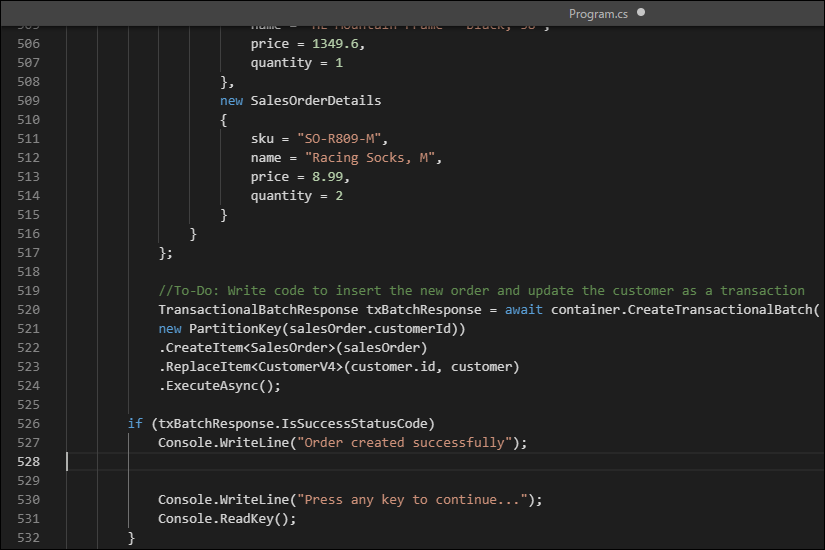

1. Ctrl+S を選択して変更を保存します。

1. まだ開かれていない場合は Git Bash 統合ターミナルを開き、*17-denormalize* フォルダーに移動していることを確認します。

1. プロジェクトをコンパイルして実行するには、次のコマンドを実行します:

    ```
    dotnet build
    dotnet run
    ```

1. アプリケーションのメイン メニューが次のように表示されます:

    

### タスク 3: 顧客とその販売注文をクエリする

顧客コンテナーに **customerId** をパーティション キーとして使用することで、顧客とその販売注文の両方を同じコンテナーに格納するようにデータベースを設計したため、顧客コンテナーをクエリして顧客のレコードと顧客のすべての販売注文を単一の操作で返すことができます。

1. メイン メニューで **c** を選択し、**Query for customer and all orders** のメニュー項目を実行します。このクエリは顧客レコードを返し、その後に顧客のすべての販売注文を表示します。画面にすべての販売注文が出力されるはずです。

   最後の注文は **Road-650 Red, 58** で $782.99 でした。

1. **Print out customer record and all their orders** までスクロールします。

   **salesOrderCount** プロパティが 2 つの販売注文を示していることを確認します。

   画面は次のようになります:

    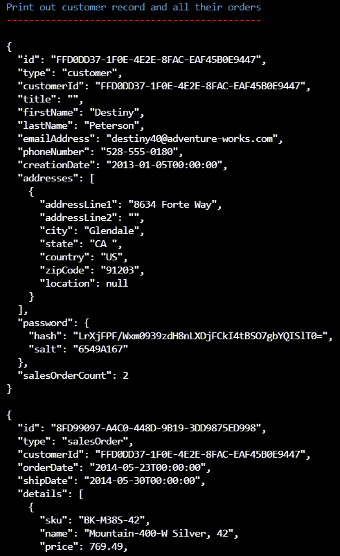

### タスク 4: 新しい販売注文を作成し、トランザクションで総販売注文数を更新する

同じ顧客の新しい販売注文を作成し、顧客レコードに保存されている総販売注文数を更新します。

1. 任意のキーを押してメイン メニューに戻ります。
1. **d** を選択して **Create new order and update order total** のメニュー項目を実行します。
1. 任意のキーを押してメイン メニューに戻ります。
1. **c** を選択して同じクエリを再度実行します。

   新しい販売注文に **HL Mountain Frame - Black, 38** と **Racing Socks, M** が表示されます。

1. **Print out customer record and all their orders** までスクロールします。

   **salesOrderCount** プロパティが 3 つの販売注文を示していることを確認します。

1. 画面は次のようになります:

    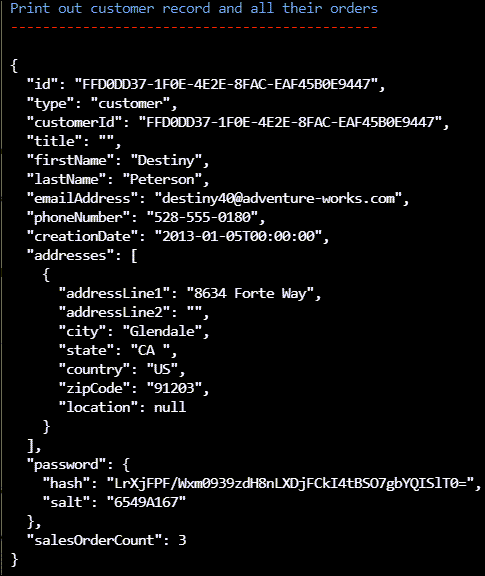

### タスク 5: transactional batch を使って注文を削除する

あらゆる e コマース アプリケーションと同様に、顧客は注文をキャンセルすることもできます。ここでも同じことができます。

1. 任意のキーを押してメイン メニューに戻ります。

1. **f** を選択して **Delete order and update order total** のメニュー項目を実行します。

1. 任意のキーを押してメイン メニューに戻ります。
1. **c** を選択して同じクエリを再度実行し、顧客レコードが更新されていることを確認します。

   新しい注文がもう返されないことに注意してください。上にスクロールすると **salesOrderCount** の値が **2** に戻っていることが確認できます。

1. 任意のキーを押してメイン メニューに戻ります。

### タスク 6: 販売注文を削除するコードを確認する

販売注文の削除は、作成とまったく同じ方法で行われます。両方の操作はトランザクションでラップされ、同じ論理パーティション内で実行されます。そのコードを確認しましょう。

1. アプリケーションを終了するには **x** を入力します。
1. まだ開かれていない場合は Visual Studio Code を開き、*17-denormalize* フォルダー内の *Program.cs* ファイルを開きます。

1. Ctrl+G を選択し、**529** と入力します。

    この関数は、新しい販売注文を削除し、顧客レコードを更新します。

    ここでは、まず顧客レコードを取得し、**salesOrderCount** を 1 減らすことがわかります。

    次に **CreateTransactionalBatch()** の呼び出しがあります。再び論理パーティション キーの値が渡されますが、今回は **DeleteItem()** が注文 ID で呼び出され、更新された顧客レコードに対して **ReplaceItem()** が呼び出されます。

### タスク 7: 上位 10 人の顧客クエリのコードを確認する

上位 10 人の顧客に対するクエリを確認します。

1. Ctrl+G を選択し、**566** と入力します。

    クエリの定義が上部付近にあります。

    ```
    SELECT TOP 10 c.firstName, c.lastName, c.salesOrderCount
        FROM c WHERE c.type = 'customer'
        ORDER BY c.salesOrderCount DESC
    ```

    このクエリは比較的簡単で、**TOP** 句により返されるレコード数を制限し、**salesOrderCount** プロパティを降順で **ORDER BY** しています。

    また、識別子プロパティ **type** の値が **customer** になっていることにも注意してください。customer コンテナーには顧客と販売注文の両方が含まれているため、これにより顧客のみが返されます。

1. アプリケーションがまだ実行されていない場合は、次のコマンドを実行して再起動します:

    ```
    dotnet run
    ```

1. 最後に、**e** を入力してクエリを実行します。

    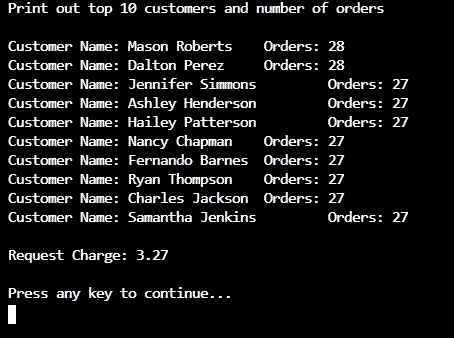

    上位 10 人の顧客クエリは、コンテナー内のすべてのパーティションにファンアウトするクロスパーティション クエリであることに気付かない場合があります。

    このラボの別の演習では、クロスパーティション クエリを避けるべきだと説明されています。ただし、実際にはコンテナーがまだ小さい場合やクエリの実行頻度が低い場合には、このようなクエリでも問題ないことがあります。クエリが頻繁に実行されるかコンテナーが非常に大きい場合は、このデータを別のコンテナーにマテリアライズし、そのコンテナーからクエリを提供するコストを検討する価値があります。

### Review

このラボで完了したこと:

- データを非正規化したときのパフォーマンス コストを測定しました。
- 変更フィードを使用して参照整合性を管理しました。
- 集計を非正規化しました。

### ラボを正常に完了しました
