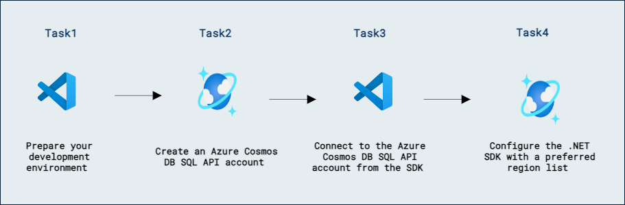

# Lab 09a - Azure Cosmos DB for NoSQL のレプリケーション戦略を設計・実装する

## ラボのシナリオ

このラボでは、エンティティを別々のコンテナーとしてモデル化した場合と、NoSQL データベース向けにエンティティを単一ドキュメントに埋め込んでモデル化した場合の顧客エンティティの違いを測定します。

## ラボの目的:

このラボでは、次のタスクを完了します:
- タスク 1: 開発環境を準備する。
- タスク 2: Azure Cosmos DB for NoSQL アカウントを作成する。
- タスク 3: SDK から Azure Cosmos DB for NoSQL アカウントに接続する。
- タスク 4: .NET SDK を優先リージョン リストで構成する。

## 推定所要時間: 60 分

## アーキテクチャ図



## 演習 1: Azure Cosmos DB for NoSQL SDK で異なるリージョンに接続する

Azure Cosmos DB for NoSQL アカウントでジオ冗長性を有効にすると、SDK を使用して構成した任意の順序でリージョンからデータを読み取ることができます。この手法は、利用可能な読み取りリージョン全体に読み取りリクエストを分散させるときに有効です。

このラボでは、CosmosClient クラスを手動で構成したフォールバック順序で読み取りリージョンに接続するように設定します。

### タスク 1: 開発環境を準備する

1. Visual Studio Code を起動します（プログラムのアイコンはデスクトップにピン留めされています）。

2. 左側のペインから **Extension (1)** アイコンを選択します。検索バーに **C# (2)** と入力し、表示された **extension (3)** を選択して最後に **Install (4)** をクリックします。

    

3. 画面左上の **file** オプションを選択し、ペインオプションから **Open Folder** を選択して **C:\AllFiles** に移動します。

4. フォルダー **dp-420-cosmos-db-dev** を選択し、**Select Folder** をクリックします。

### タスク 2: Azure Cosmos DB for NoSQL アカウントを作成する

Azure Cosmos DB は複数の API をサポートするクラウドベースの NoSQL データベース サービスです。Azure Cosmos DB アカウントを初めてプロビジョニングするときは、アカウントでサポートする API を選択します（たとえば **API for MongoDB** や **API for NoSQL**）。Azure Cosmos DB for NoSQL アカウントのプロビジョニングが完了したら、エンドポイントとキーを取得して、Azure SDK for .NET やその他の SDK を使用して接続できます。

1. 新しい Web ブラウザー ウィンドウまたはタブで Azure ポータル（``portal.azure.com``）に移動します。

1. サブスクリプションに関連付けられた Microsoft 資格情報でポータルにサインインします。
1. **Azure services** カテゴリで **Create a resource** を選択し、次に **Azure Cosmos DB** を選択します。

    > 💡 代わりに、**≡** メニューを展開し、**All Services** を選択し、**Databases** カテゴリで **Azure Cosmos DB** を選択して **Create** をクリックしてもかまいません。

1. **Select API option** ペインで、**Azure Cosmos DB for NoSQL** セクションの **Create** オプションを選択します。

1. **Create Azure Cosmos DB Account** ペインで、**Basics** タブを確認します。

    | **設定** | **値** |
    | --- | --- |
    | **Subscription** | *既存の Azure サブスクリプション* |
    | **Resource group** | *DP-420-DeploymentID* |
    | **Account Name** | *グローバルに一意の名前を入力* |
    | **Location** | *利用可能なリージョンを選択* |
    | **Capacity mode** | *Provisioned throughput* |
    | **Apply Free Tier Discount** | *Do Not Apply* |


      > **注意**: DeploymentID は各環境に関連付けられた一意の ID です。環境の詳細ページで値を確認できます。

1. **Review + Create** をクリックし、検証が成功したら **Create** をクリックします。

1. このタスクを続行する前に、デプロイメント タスクが完了するまで待ちます。

1. 新しく作成した **Azure Cosmos DB** アカウント リソースに移動し、**Replicate data globally** ペインに移動します。

1. **Replicate data globally** ペインで、アカウントに追加の 2 つの読み取りリージョンを追加し、変更を **Save** します。

1. このタスクを続行する前に、レプリケーション タスクが完了するまで待ちます。

    > **注意:** この操作には約 5〜10 分かかる場合があります。

1. **Write**（プライマリ）リージョンと 2 つの **Read** リージョンの名前を記録します。これらのリージョン名は、この演習の後で使用します。

    > **注意:** たとえば、プライマリ リージョンが **North Europe**、2 つの読み取りセカンダリ リージョンが **East US 2** と **South Africa North** の場合、これら 3 つの名前をそのまま記録します。

1. リソース ブレードで、**Data Explorer** ペインに移動します。

1. **Data Explorer** ペインで **New Container** を選択します。

1. **New Container** のポップアップで、各設定に次の値を入力し、**OK** を選択します。

    | **設定** | **値** |
    | --- | --- |
    | **Database id** | *Create new* | *cosmicworks* |
    | **Share throughput across containers** | *Do not select* |
    | **Container id** | *products* |
    | **Partition key** | */categoryId* |
    | **Container throughput** | *Manual* | *400* |

1. **Data Explorer** ペインに戻り、**cosmicworks** データベース ノードを展開して、階層内の **products** コンテナー ノードを確認します。

1. 引き続き **Data Explorer** ペインで、コマンド バーから **New Item** を選択します。エディターでプレースホルダーの JSON アイテムを次の内容に置き換えます:

    ```
    {
      "id": "7d9273d9-5d91-404c-bb2d-126abb6e4833",
      "categoryId": "78d204a2-7d64-4f4a-ac29-9bfc437ae959",
      "categoryName": "Components, Pedals",
      "sku": "PD-R563",
      "name": "ML Road Pedal",
      "price": 62.09
    }
    ```

1. コマンド バーから **Save** を選択し、JSON アイテムを追加します。

1. **Items** タブで、**Items** ペインに新しいアイテムが表示されていることを確認します。

1. リソース ブレードで、**Keys** ペインに移動します。

1. このペインには、SDK からアカウントに接続するために必要な接続情報と資格情報が含まれています。具体的には:

    1. **URI** フィールドの値を記録します。この **endpoint** 値は後でこの演習で使用します。

    1. **PRIMARY KEY** フィールドの値を記録します。この **key** 値は後でこの演習で使用します。

1. Web ブラウザー ウィンドウまたはタブを閉じます。

### タスク 3: SDK から Azure Cosmos DB for NoSQL アカウントに接続する

新しく作成したアカウントの資格情報を使用して、SDK クラスに接続し、別のリージョンからデータベースとコンテナー インスタンスにアクセスします。

1. **Visual Studio Code** の **Explorer** ペインで、**20-sdk-regions** フォルダーに移動します。

1. **20-sdk-regions** フォルダーのコンテキスト メニューを開き、**Open in Integrated Terminal** を選択して新しいターミナル インスタンスを開きます。

    > **注意:** このコマンドは、開始ディレクトリが **20-sdk-regions** フォルダーに設定された状態でターミナルを開きます。

1. [dotnet build][docs.microsoft.com/dotnet/core/tools/dotnet-build] コマンドを使用してプロジェクトをビルドします:

    ```
    dotnet build
    ```

    > **注意:** **endpoint** および **key** 変数が現在未使用であるというコンパイラー警告が表示される場合があります。この警告は、このタスクでこれらの変数を使用するため、無視しても問題ありません。

1. 統合ターミナルを閉じます。

1. **20-sdk-regions** フォルダー内の **script.cs** コード ファイルを開きます。

    > **注意:** **[Microsoft.Azure.Cosmos][nuget.org/packages/microsoft.azure.cosmos/3.22.1]** ライブラリは、NuGet から既に事前にインポートされています。

1. **endpoint** という名前の **string** 変数を見つけます。これを、先ほど作成した Azure Cosmos DB アカウントの **endpoint** に設定します。
  
    ```
    string endpoint = "<cosmos-endpoint>";
    ```

    > **注意:** たとえば、エンドポイントが **https&shy;://dp420.documents.azure.com:443/** の場合、C# の文は **string endpoint = "https&shy;://dp420.documents.azure.com:443/";** となります。

1. **key** という名前の **string** 変数を見つけます。これを、先ほど作成した Azure Cosmos DB アカウントの **key** に設定します。

    ```
    string key = "<cosmos-key>";
    ```

    > **注意:** たとえば、キーが **fDR2ci9QgkdkvERTQ==** の場合、C# の文は **string key = "fDR2ci9QgkdkvERTQ==";** となります。

1. **script.cs** コード ファイルを **Save** します。

### タスク 4: 優先リージョン リストで .NET SDK を構成する

**CosmosClientOptions** クラスには、SDK で接続したいリージョンのリストを構成するプロパティが含まれています。リストはフェールオーバーの優先度順に並び、構成した順序で各リージョンへの接続を試行します。

1. ジェネリック型 **List\<string\>** の新しい変数を作成し、アカウントで構成したリージョンのリストを、3 番目のリージョンから開始して 1 番目の（プライマリ）リージョンで終わるように指定します。たとえば、Azure Cosmos DB for NoSQL アカウントを **West US** リージョンに作成し、その後に **South Africa North** と **East Asia** を追加した場合、リスト変数は次のようになります:

    ```
    List<string> regions = new()
    {
        "East Asia",
        "South Africa North",
        "West US"
    };
    ```

    > **注意:** あるいは、さまざまな Azure リージョンの組み込み文字列プロパティを含む [Microsoft.Azure.Cosmos.Regions][docs.microsoft.com/dotnet/api/microsoft.azure.cosmos.regions] 静的クラスを使用することもできます。

1. **ApplicationPreferredRegions** プロパティを **regions** 変数に設定して、**CosmosClientOptions** の新しいインスタンス **options** を作成します:

    ```
    CosmosClientOptions options = new () 
    { 
        ApplicationPreferredRegions = regions
    };
    ```

1. **CosmosClient** クラスの新しいインスタンス **client** を作成し、コンストラクター パラメーターとして **endpoint**、**key**、**options** 変数を渡します:

    ```
    CosmosClient client = new (endpoint, key, options); 
    ```

1. **client** 変数の **GetContainer** メソッドを使用して、データベース名 (*cosmicworks*) とコンテナー名 (*products*) で既存のコンテナーを取得します:

    ```
    Container container = client.GetContainer("cosmicworks", "products");
    ```

1. **container** 変数の [ReadItemAsync][docs.microsoft.com/dotnet/api/microsoft.azure.cosmos.container.readitemasync] メソッドを使用してサーバーから特定のアイテムを取得し、nullable な [ItemResponse][docs.microsoft.com/dotnet/api/microsoft.azure.cosmos.itemresponse] 型の **response** という変数に結果を格納します:

    ```
    ItemResponse<dynamic> response = await container.ReadItemAsync<dynamic>(
        "7d9273d9-5d91-404c-bb2d-126abb6e4833",
        new PartitionKey("78d204a2-7d64-4f4a-ac29-9bfc437ae959")
    );
    ```

1. 静的な **Console.WriteLine** メソッドを呼び出して、現在のアイテム識別子と JSON 診断データを出力します:

    ```
    Console.WriteLine($"Item Id:\t{response.Resource.Id}");
    Console.WriteLine($"Response Diagnostics JSON");
    Console.WriteLine($"{response.Diagnostics}");
    ```

1. 実行が完了すると、コード ファイルには次の内容が含まれているはずです:
  
    ```
    using Microsoft.Azure.Cosmos;

    string endpoint = "<cosmos-endpoint>";
    string key = "<cosmos-key>";

    List<string> regions = new()
    {
        "<read-region-2>",
        "<read-region-1>",
        "<write-region>"
    };
    
    CosmosClientOptions options = new () 
    { 
        ApplicationPreferredRegions = regions
    };
    
    using CosmosClient client = new(endpoint, key, options);
    
    Container container = client.GetContainer("cosmicworks", "products");
    
    ItemResponse<dynamic> response = await container.ReadItemAsync<dynamic>(
        "7d9273d9-5d91-404c-bb2d-126abb6e4833",
        new PartitionKey("78d204a2-7d64-4f4a-ac29-9bfc437ae959")
    );
    
    Console.WriteLine($"Item Id:\t{response.Resource.Id}");
    Console.WriteLine("Response Diagnostics JSON");
    Console.WriteLine($"{response.Diagnostics}");
    ```

1. **script.cs** コード ファイルを **Save** します。

1. **Visual Studio Code** で **20-sdk-regions** フォルダーのコンテキスト メニューを開き、**Open in Integrated Terminal** を選択して新しいターミナル インスタンスを開きます。

1. **[dotnet run][docs.microsoft.com/dotnet/core/tools/dotnet-run]** コマンドを使用してプロジェクトをビルドし、実行します:

    ```
    dotnet run
    ```

1. ターミナルの出力を確認します。コンテナー名と JSON 診断データがコンソール出力に表示されるはずです。

1. JSON 診断データを確認します。**HttpResponseStats** というプロパティと、その子プロパティ **RequestUri** を検索します。このプロパティの値には、前の手順で構成した名前とリージョンを含む URI が表示されているはずです。

    > **注意:** たとえば、アカウント名が **dp420** で、最初に構成したリージョンが **East Asia** の場合、JSON プロパティの値は **dp420-eastasia.documents.azure.com/dbs/cosmicworks/colls/products** になります。

1. 統合ターミナルを閉じます。

1. **Visual Studio Code** を閉じます。

## クリーンアップ

1. このラボで作成した Azure Cosmos DB アカウントを削除します。

### レビュー

このラボで完了したこと:

- 開発環境を準備しました。
- Azure Cosmos DB for NoSQL アカウントを作成しました。
- SDK から Azure Cosmos DB for NoSQL アカウントに接続しました。
- 優先リージョン リストで .NET SDK を構成しました。

### ラボを正常に完了しました
