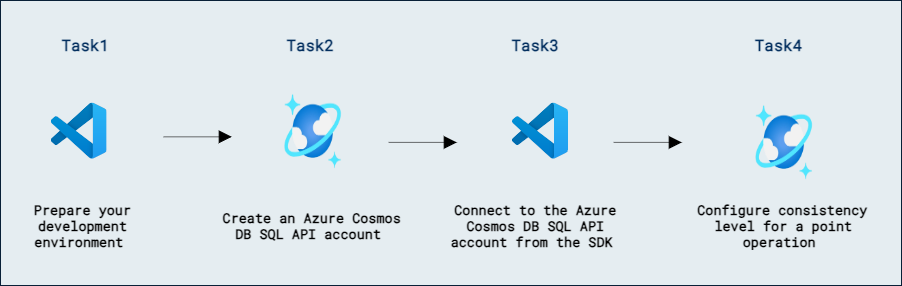

# Lab 09b - Azure Cosmos DB for NoSQL のレプリケーション戦略を設計・実装する

## ラボのシナリオ

新しい Azure Cosmos DB for NoSQL アカウントのデフォルトの一貫性レベルはセッション一貫性です。このデフォルト設定は、すべての今後のリクエストに対して変更できます。個別のリクエスト レベルでは、さらに一歩進めて、その特定のリクエストの一貫性レベルを緩和できます。

このラボでは、Azure Cosmos DB for NoSQL アカウントのデフォルトの一貫性レベルを構成し、SDK を使用して個別の操作の一貫性レベルを構成します。

## ラボの目的

このラボでは、次のタスクを完了します:
- タスク 1: 開発環境を準備する。
- タスク 2: Azure Cosmos DB for NoSQL アカウントを作成する。
- タスク 3: SDK から Azure Cosmos DB for NoSQL アカウントに接続する。
- タスク 4: ポイント操作の一貫性レベルを構成する。

## 推定所要時間: 60 分

## アーキテクチャ図



## 演習 1: ポータルと Azure Cosmos DB for NoSQL SDK で一貫性モデルを構成する

### タスク 1: 開発環境を準備する

1. Visual Studio Code を起動します（プログラムのアイコンはデスクトップにピン留めされています）。

2. 左側のペインから **Extension (1)** アイコンを選択します。検索バーに **C# (2)** と入力し、表示された **extension (3)** を選択して最後に **Install (4)** をクリックします。

    

3. 画面左上の **file** オプションを選択し、ペインオプションから **Open Folder** を選択して **C:\AllFiles** に移動します。

4. フォルダー **dp-420-cosmos-db-dev** を選択し、**Select Folder** をクリックします。

### タスク 2: Azure Cosmos DB for NoSQL アカウントを作成する

Azure Cosmos DB は複数の API をサポートするクラウドベースの NoSQL データベース サービスです。Azure Cosmos DB アカウントを初めてプロビジョニングするときは、アカウントでサポートする API を選択します（たとえば **API for MongoDB** や **API for NoSQL**）。Azure Cosmos DB for NoSQL アカウントのプロビジョニングが完了したら、エンドポイントとキーを取得して、Azure SDK for .NET やその他の SDK を使用して接続できます。

1. 新しい Web ブラウザー ウィンドウまたはタブで Azure ポータル（``portal.azure.com``）に移動します。

1. サブスクリプションに関連付けられた Microsoft 資格情報でポータルにサインインします。

1. **Azure services** カテゴリで **Create a resource** を選択し、次に **Azure Cosmos DB** を選択します。

    > 💡 代わりに、**≡** メニューを展開し、**All Services** を選択し、**Databases** カテゴリで **Azure Cosmos DB** を選択して **Create** をクリックしてもかまいません。

1. **Select API option** ペインで、**Azure Cosmos DB for NoSQL** セクションの **Create** オプションを選択します。

1. **Create Azure Cosmos DB Account** ペインで、**Basics** タブを確認します。

    | **設定** | **値** |
    | --- | --- |
    | **Subscription** | *既存の Azure サブスクリプション* |
    | **Resource group** | *DP-420-DeploymentID* |
    | **Account Name** | *グローバルに一意の名前を入力* |
    | **Location** | *利用可能なリージョンを選択* |
    | **Capacity mode** | *Provisioned throughput* |
    | **Apply Free Tier Discount** | *Do Not Apply* |

    > **注意**: DeploymentID は各環境に関連付けられた一意の ID です。環境の詳細ページで値を確認できます。

1. **Next: Global Distribution** をクリックし、ジオ冗長性を **Enable** し、**Review + Create** をクリックして検証が成功したら **Create** をクリックします。

1. このタスクを続行する前に、デプロイメント タスクが完了するまで待ちます。

1. 新しく作成した **Azure Cosmos DB** アカウント リソースに移動し、**Replicate data globally** ペインに移動します。

1. **Replicate data globally** ペインで、アカウントに追加の 2 つの読み取りリージョンを追加し、変更を **Save** します。

1. このタスクを続行する前に、レプリケーション タスクが完了するまで待ちます。

    > **注意:** この操作には約 5〜10 分かかる場合があります。その後 **Default consistency** ペインに移動します。

1. リソース ブレードで、**Default consistency** ペインに移動します。

1. **Default consistency** ペインで、**Strong** オプションを選択し、変更を **Save** します。

1. このタスクを続行する前に、デフォルト一貫性レベルの変更が適用されるまで待ちます。

1. リソース ブレードで、**Data Explorer** ペインに移動します。

1. **Data Explorer** ペインで **New Container** を選択します。

1. **New Container** のポップアップで、各設定に次の値を入力し、**OK** を選択します。

    | **設定** | **値** |
    | --- | --- |
    | **Database id** | *Create new* | *cosmicworks* |
    | **Share throughput across containers** | *Do not select* |
    | **Container id** | *products* |
    | **Partition key** | */categoryId* |
    | **Container throughput** | *Manual* | *400* |

1. **Data Explorer** ペインに戻り、**cosmicworks** データベース ノードを展開して、階層内の **products** コンテナー ノードを確認します。

1. **Data Explorer** ペインで、**cosmicworks** データベース ノードを展開し、**products** コンテナー ノードを展開してから、**Items** を選択します。

1. 引き続き **Data Explorer** ペインで、コマンド バーから **New Item** を選択します。エディターでプレースホルダーの JSON アイテムを次の内容に置き換えます。

    ```
    {
      "id": "7d9273d9-5d91-404c-bb2d-126abb6e4833",
      "categoryId": "78d204a2-7d64-4f4a-ac29-9bfc437ae959",
      "categoryName": "Components, Pedals",
      "sku": "PD-R563",
      "name": "ML Road Pedal",
      "price": 62.09
    }
    ```

1. コマンド バーから **Save** を選択し、JSON アイテムを追加します。

1. **Items** タブで、**Items** ペインに新しいアイテムが表示されていることを確認します。

1. リソース ブレードで、**Keys** ペインに移動します。

1. このペインには、SDK からアカウントに接続するために必要な接続情報と資格情報が含まれています。具体的には:

    1. **URI** フィールドの値を記録します。この **endpoint** 値は後でこの演習で使用します。

    1. **PRIMARY KEY** フィールドの値を記録します。この **key** 値は後でこの演習で使用します。

1. Web ブラウザー ウィンドウまたはタブを閉じます。

### タスク 3: SDK から Azure Cosmos DB for NoSQL アカウントに接続する

新しく作成したアカウントの資格情報を使用して、SDK クラスに接続し、新しいデータベースとコンテナー インスタンスを作成します。次に、Data Explorer を使用して、これらのインスタンスが Azure ポータルに存在することを確認します。

1. **Visual Studio Code** の **Explorer** ペインで、**21-sdk-consistency-model** フォルダーに移動します。

1. **21-sdk-consistency-model** フォルダーのコンテキスト メニューを開き、**Open in Integrated Terminal** を選択して新しいターミナル インスタンスを開きます。

    > **注意:** このコマンドは、開始ディレクトリが **21-sdk-consistency-model** フォルダーに設定された状態でターミナルを開きます。

1. [dotnet build][docs.microsoft.com/dotnet/core/tools/dotnet-build] コマンドを使用してプロジェクトをビルドします:

    ```
    dotnet build
    ```

    > **注意:** **endpoint** および **key** 変数が現在未使用であるというコンパイラー警告が表示される場合があります。この警告は、このタスクでこれらの変数を使用するため、無視しても問題ありません。

1. 統合ターミナルを閉じます。

1. **product.cs** コード ファイルを開きます。

1. **Product** レコードとその対応するプロパティを確認します。このラボでは特に **id**、**name**、**categoryId** プロパティを使用します。

1. **Visual Studio Code** の **Explorer** ペインに戻り、**script.cs** コード ファイルを開きます。

    > **注意:** **[Microsoft.Azure.Cosmos][nuget.org/packages/microsoft.azure.cosmos/3.22.1]** ライブラリは、NuGet から既に事前にインポートされています。

1. **endpoint** という名前の **string** 変数を見つけます。これを、先ほど作成した Azure Cosmos DB アカウントの **endpoint** に設定します。
  
    ```
    string endpoint = "<cosmos-endpoint>";
    ```

    > **注意:** たとえば、エンドポイントが **https&shy;://dp420.documents.azure.com:443/** の場合、C# の文は **string endpoint = "https&shy;://dp420.documents.azure.com:443/";** となります。

1. **key** という名前の **string** 変数を見つけます。これを、先ほど作成した Azure Cosmos DB アカウントの **key** に設定します。

    ```
    string key = "<cosmos-key>";
    ```

    > **注意:** たとえば、キーが **fDR2ci9QgkdkvERTQ==** の場合、C# の文は **string key = "fDR2ci9QgkdkvERTQ==";** となります。

1. **script.cs** コード ファイルを **Save** します。

### タスク 4: ポイント操作の一貫性レベルを構成する

**ItemRequestOptions** クラスには、リクエストごとの構成プロパティが含まれています。このクラスを使用して、現在のデフォルト値の強い一貫性から結果整合性に一貫性レベルを緩和します。

1. **id** という名前の文字列変数を作成し、値を **7d9273d9-5d91-404c-bb2d-126abb6e4833** に設定します:

    ```
    string id = "7d9273d9-5d91-404c-bb2d-126abb6e4833";
    ```

1. **categoryId** という名前の文字列変数を作成し、値を **78d204a2-7d64-4f4a-ac29-9bfc437ae959** に設定します:

    ```
    string categoryId = "78d204a2-7d64-4f4a-ac29-9bfc437ae959";
    ```

1. **PartitionKey** 型の **partitionKey** という名前の変数を作成し、コンストラクター パラメーターとして **categoryId** 変数を渡します:

    ```
    PartitionKey partitionKey = new (categoryId);
    ```

1. **container** 変数のジェネリック **ReadItemAsync\<\>** メソッドを非同期で呼び出し、メソッド パラメーターとして **id** および **partitionkey** 変数を渡し、ジェネリック型として **Product** を使用し、結果を **ItemResponse\<Product\>** 型の **response** という名前の変数に格納します:

    ```
    ItemResponse<Product> response = await container.ReadItemAsync<Product>(id, partitionKey);
    ```

1. 静的な **Console.WriteLine** メソッドを呼び出して、フォーマット済み出力文字列を使用してリクエスト チャージを出力します:

    ```
    Console.WriteLine($"STRONG Request Charge:\t{response.RequestCharge:0.00} RUs");
    ```

1. 実行が完了すると、コード ファイルには次の内容が含まれているはずです:

    ```
    using Microsoft.Azure.Cosmos;

    string endpoint = "<cosmos-endpoint>";
    string key = "<cosmos-key>";

    CosmosClient client = new CosmosClient(endpoint, key);
    
    Container container = client.GetContainer("cosmicworks", "products");
    
    string id = "7d9273d9-5d91-404c-bb2d-126abb6e4833";
    
    string categoryId = "78d204a2-7d64-4f4a-ac29-9bfc437ae959";
    PartitionKey partitionKey = new (categoryId);
    
    ItemResponse<Product> response = await container.ReadItemAsync<Product>(id, partitionKey);
    
    Console.WriteLine($"STRONG Request Charge:\t{response.RequestCharge:0.00} RUs");
    ```

1. **script.cs** コード ファイルを **Save** します。

1. **Visual Studio Code** で **21-sdk-consistency-model** フォルダーのコンテキスト メニューを開き、**Open in Integrated Terminal** を選択して新しいターミナル インスタンスを開きます。

1. **[dotnet run][docs.microsoft.com/dotnet/core/tools/dotnet-run]** コマンドを使用してプロジェクトをビルドして実行します:

    ```
    dotnet run
    ```

1. ターミナルの出力を確認します。リクエスト チャージ（RU）がコンソールに出力されるはずです。

    > **注意:** 現在のリクエスト チャージは **2 RU** になるはずです。これは、強い一貫性が最新の書き込みを確認するために少なくとも 2 つのレプリカからの読み取りが必要になるためです。

1. 統合ターミナルを閉じます。

1. **script.cs** コード ファイルの エディター タブに戻ります。

1. 次のコード行を削除します:

    ```
    ItemResponse<Product> response = await container.ReadItemAsync<Product>(id, partitionKey);
    
    Console.WriteLine($"Request Charge:\t{response.RequestCharge:0.00} RUs");
    ```

1. [ItemRequestOptions][docs.microsoft.com/dotnet/api/microsoft.azure.cosmos.itemrequestoptions] 型の **options** という名前の新しい変数を作成し、[ConsistencyLevel][docs.microsoft.com/dotnet/api/microsoft.azure.cosmos.itemrequestoptions.consistencylevel] プロパティを [ConsistencyLevel.Eventual][docs.microsoft.com/dotnet/api/microsoft.azure.cosmos.consistencylevel] 列挙値に設定します:

    ```
    ItemRequestOptions options = new()
    { 
        ConsistencyLevel = ConsistencyLevel.Eventual 
    };
    ```

1. **container** 変数のジェネリック **ReadItemAsync\<\>** メソッドを非同期で呼び出し、メソッド パラメーターとして **id**、**partitionKey**、**options** 変数を渡し、ジェネリック型として **Product** を使用し、結果を **ItemResponse\<Product\>** 型の **response** という名前の変数に格納します:

    ```
    ItemResponse<Product> response = await container.ReadItemAsync<Product>(id, partitionKey, requestOptions: options);
    ```

1. 静的な **Console.WriteLine** メソッドを呼び出して、フォーマット済み出力文字列を使用してリクエスト チャージを出力します:

    ```
    Console.WriteLine($"EVENTUAL Request Charge:\t{response.RequestCharge:0.00} RUs");
    ```

1. 実行が完了すると、コード ファイルには次の内容が含まれているはずです:

    ```
    using Microsoft.Azure.Cosmos;

    string endpoint = "<cosmos-endpoint>";
    string key = "<cosmos-key>";

    CosmosClient client = new CosmosClient(endpoint, key);
    
    Container container = client.GetContainer("cosmicworks", "products");
    
    string id = "7d9273d9-5d91-404c-bb2d-126abb6e4833";
    
    string categoryId = "78d204a2-7d64-4f4a-ac29-9bfc437ae959";
    PartitionKey partitionKey = new (categoryId);

    ItemRequestOptions options = new()
    { 
        ConsistencyLevel = ConsistencyLevel.Eventual 
    };
    
    ItemResponse<Product> response = await container.ReadItemAsync<Product>(id, partitionKey, requestOptions: options);
    
    Console.WriteLine($"EVENTUAL Request Charge:\t{response.RequestCharge:0.00} RUs");
    ```

1. **script.cs** コード ファイルを **Save** します。

1. **Visual Studio Code** で **21-sdk-consistency-model** フォルダーのコンテキスト メニューを開き、**Open in Integrated Terminal** を選択して新しいターミナル インスタンスを開きます。

1. **[dotnet run][docs.microsoft.com/dotnet/core/tools/dotnet-run]** コマンドを使用してプロジェクトをビルドして実行します:

    ```
    dotnet run
    ```

1. ターミナルの出力を確認します。リクエスト チャージ（RU）がコンソールに出力されるはずです。

    > **注意:** 現在のリクエスト チャージは **1 RU** になるはずです。これは、結果整合性が単一のレプリカからの読み取りのみを必要とするためです。

1. 統合ターミナルを閉じます。

1. **Visual Studio Code** を閉じます。


## クリーンアップ

1. このラボで作成した Azure Cosmos DB アカウントを削除します。

### レビュー

このラボで完了したこと:

- 開発環境を準備しました。
- Azure Cosmos DB for NoSQL アカウントを作成しました。
- SDK から Azure Cosmos DB for NoSQL アカウントに接続しました。
- ポイント操作の一貫性レベルを構成しました。

### ラボを正常に完了しました
