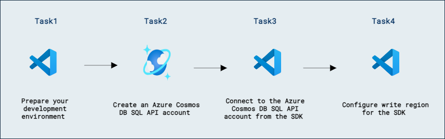

# Lab 09c - Azure Cosmos DB SQL API のレプリケーション戦略を設計・実装する

## ラボのシナリオ

**CosmosClientBuilder** クラスは、SDK クライアントを構築してコンテナーに接続し、操作を実行するように設計されたフルエント クラスです。ビルダーを使用すると、Azure Cosmos DB SQL API アカウントが既にマルチリージョン書き込み用に構成されている場合、書き込み操作の優先アプリケーション リージョンを構成できます。

このラボでは、複数のリージョンで Azure Cosmos DB SQL API アカウントを構成し、マルチリージョン書き込みを有効にします。その後、SDK を使用して特定のリージョンに対する操作を実行します。

## ラボの目的

このラボでは、次のタスクを完了します:
- タスク 1: 開発環境を準備する。
- タスク 2: Azure Cosmos DB SQL API アカウントを作成する。
- タスク 3: SDK から Azure Cosmos DB SQL API アカウントに接続する。
- タスク 4: SDK の書き込みリージョンを構成する。

## 推定所要時間: 60 分

## アーキテクチャ図



## 演習 1: Azure Cosmos DB SQL API SDK でマルチリージョン書き込みアカウントに接続する

### タスク 1: 開発環境を準備する

1. Visual Studio Code を起動します（プログラムのアイコンはデスクトップにピン留めされています）。

2. 左側のペインから **Extension (1)** アイコンを選択します。検索バーに **C# (2)** と入力し、表示された **extension (3)** を選択して最後に **Install (4)** をクリックします。

    

3. 画面左上の **file** オプションを選択し、ペインオプションから **Open Folder** を選択して **C:\AllFiles** に移動します。

4. フォルダー **dp-420-cosmos-db-dev** を選択し、**Select Folder** をクリックします。

### タスク 2: Azure Cosmos DB SQL API アカウントを作成する

Azure Cosmos DB は複数の API をサポートするクラウドベースの NoSQL データベース サービスです。Azure Cosmos DB アカウントを初めてプロビジョニングするときは、アカウントでサポートする API を選択します（たとえば **Mongo API** や **SQL API**）。Azure Cosmos DB SQL API アカウントのプロビジョニングが完了したら、エンドポイントとキーを取得して、Azure SDK for .NET やその他の SDK を使用して接続できます。

1. 新しい Web ブラウザー ウィンドウまたはタブで Azure ポータル（``portal.azure.com``）に移動します。

1. サブスクリプションに関連付けられた Microsoft 資格情報でポータルにサインインします。

1. **Azure services** カテゴリで **Create a resource** を選択し、次に **Azure Cosmos DB** を選択します。

    > 💡 代わりに、**≡** メニューを展開し、**All Services** を選択し、**Databases** カテゴリで **Azure Cosmos DB** を選択して **Create** をクリックしてもかまいません。

1. **Select API option** ペインで、**Azure Cosmos DB for NoSQL** セクションの **Create** オプションを選択します。

1. **Create Azure Cosmos DB Account** ペインで、**Basics** タブを確認します。

    | **設定** | **値** |
    | --- | --- |
    | **Subscription** | *既存の Azure サブスクリプション* |
    | **Resource group** | *DP-420-DeploymentID* |
    | **Account Name** | *グローバルに一意の名前を入力* |
    | **Location** | *利用可能なリージョンを選択* |
    | **Capacity mode** | *Provisioned throughput* |
    | **Apply Free Tier Discount** | *Do Not Apply* |

    > **注意**: DeploymentID は各環境に関連付けられた一意の ID です。環境の詳細ページで値を確認できます。

1. **Review + Create** をクリックし、検証が成功したら **Create** をクリックします。

1. このタスクを続行する前に、デプロイメント タスクが完了するまで待ちます。

1. 新しく作成した **Azure Cosmos DB** アカウント リソースに移動し、**Replicate data globally** ペインに移動します。

1. **Replicate data globally** ペインで、アカウントに少なくとも 1 つの追加リージョンを追加します。

1. 引き続き **Replicate data globally** ペイン内で、**Multi-region writes** を有効にして、変更を **Save** します。

1. このタスクを続行する前に、レプリケーション タスクが完了するまで待ちます。

    > **注意:** この操作には約 5〜10 分かかる場合があります。

1. 作成した追加リージョンの名前を少なくとも 1 つ記録します。この値は後でこの演習で使用します。

1. リソース ブレードで、**Data Explorer** ペインに移動します。

1. **Data Explorer** ペインで **New Container** を選択します。

1. **New Container** のポップアップで、各設定に次の値を入力し、**OK** を選択します。

    | **設定** | **値** |
    | --- | --- |
    | **Database id** | *Create new* | *cosmicworks* |
    | **Share throughput across containers** | *Do not select* |
    | **Container id** | *products* |
    | **Partition key** | */categoryId* |
    | **Container throughput** | *Manual* | *400* |

1. **Data Explorer** ペインに戻り、**cosmicworks** データベース ノードを展開して、階層内の **products** コンテナー ノードを確認します。

1. リソース ブレードで、**Keys** ペインに移動します。

1. このペインには、SDK からアカウントに接続するために必要な接続情報と資格情報が含まれています。具体的には:

    1. **URI** フィールドの値を記録します。この **endpoint** 値は後でこの演習で使用します。

    1. **PRIMARY KEY** フィールドの値を記録します。この **key** 値は後でこの演習で使用します。

1. Web ブラウザー ウィンドウまたはタブを閉じます。

### タスク 3: SDK から Azure Cosmos DB SQL API アカウントに接続する

新しく作成したアカウントの資格情報を使用して、SDK クラスに接続し、新しいデータベースとコンテナー インスタンスを作成します。次に、Data Explorer を使用して、これらのインスタンスが Azure ポータルに存在することを確認します。

1. **Visual Studio Code** の **Explorer** ペインで、**22-sdk-multi-region** フォルダーに移動します。

1. **22-sdk-multi-region** フォルダーのコンテキスト メニューを開き、**Open in Integrated Terminal** を選択して新しいターミナル インスタンスを開きます。

    > **注意:** このコマンドは、開始ディレクトリが **22-sdk-multi-region** フォルダーに設定された状態でターミナルを開きます。

1. [dotnet build][docs.microsoft.com/dotnet/core/tools/dotnet-build] コマンドを使用してプロジェクトをビルドします:

    ```
    dotnet build
    ```

    > **注意:** **endpoint** および **key** 変数が現在未使用であるというコンパイラー警告が表示される場合があります。この警告は、このタスクでこれらの変数を使用するため、無視しても問題ありません。

1. 統合ターミナルを閉じます。

1. **product.cs** コード ファイルを開きます。

1. **Product** レコードとその対応するプロパティを確認します。このラボでは特に **id**、**name**、**categoryId** プロパティを使用します。

1. **Visual Studio Code** の **Explorer** ペインに戻り、**script.cs** コード ファイルを開きます。

    > **注意:** **[Microsoft.Azure.Cosmos][nuget.org/packages/microsoft.azure.cosmos/3.22.1]** ライブラリは、NuGet から既に事前にインポートされています。

1. **endpoint** という名前の **string** 変数を見つけます。これを、先ほど作成した Azure Cosmos DB アカウントの **endpoint** に設定します。
  
    ```
    string endpoint = "<cosmos-endpoint>";
    ```

    > **注意:** たとえば、エンドポイントが **https&shy;://dp420.documents.azure.com:443/** の場合、C# の文は **string endpoint = "https&shy;://dp420.documents.azure.com:443/";** となります。

1. **key** という名前の **string** 変数を見つけます。これを、先ほど作成した Azure Cosmos DB アカウントの **key** に設定します。

    ```
    string key = "<cosmos-key>";
    ```

    > **注意:** たとえば、キーが **fDR2ci9QgkdkvERTQ==** の場合、C# の文は **string key = "fDR2ci9QgkdkvERTQ==";** となります。

1. **script.cs** コード ファイルを **Save** します。

### タスク 4: SDK の書き込みリージョンを構成する

フルエント **WithApplicationRegion** メソッドは、ビルダー クラスを使用して後続の操作の優先リージョンを構成するために使用されます。

1. Create a new instance of the [CosmosClientBuilder][docs.microsoft.com/dotnet/api/microsoft.azure.cosmos.fluent.cosmosclientbuilder] class named **builder** passing in the **endpoint** and **key** variables as constructor parameters:

    ```
    CosmosClientBuilder builder = new (endpoint, key);
    ```

1. Create a new variable named **region** of type **string** with the name of the extra region you created earlier in the lab. For example, if you created your Azure Cosmos DB SQL API account in the **East US** region, and then added **Brazil South**; then your string variable would contain:

    ```
    string region = "Brazil South"; 
    ```

    > **Note:** Alternatively; you can use the [Microsoft.Azure.Cosmos.Regions][docs.microsoft.com/dotnet/api/microsoft.azure.cosmos.regions] static class which includes built-in string properties for various Azure regions.

1. Invoke the [WithApplicationRegion][docs.microsoft.com/dotnet/api/microsoft.azure.cosmos.fluent.cosmosclientbuilder.withapplicationregion] method with a parameter of **region** and the [Build][docs.microsoft.com/dotnet/api/microsoft.azure.cosmos.fluent.cosmosclientbuilder.build] method fluently on the **builder** variable storing the result in a variable named **client** of type **CosmosClient** that is encapsulated within a using statement:

    ```
    using CosmosClient client = builder
        .WithApplicationRegion(region)
        .Build();
    ```

1. Use the **GetContainer** method of the **client** variable to retrieve the existing container using the name of the database (*cosmicworks*) and the name of the container (*products*):

    ```
    Container container = client.GetContainer("cosmicworks", "products");
    ```

1. Create two **string** variables named **id** and **categoryId** by generating a new **Guid** value and then storing the result as a string:

    ```
    string id = $"{Guid.NewGuid()}";
    string categoryId = $"{Guid.NewGuid()}";
    ```

1. Create a new variable named **item** of type **Product** passing in the **id** variable, a string value of **Polished Bike Frame**, and the **categoryId** variable as constructor parameters:

    ```
    Product item = new (id, "Polished Bike Frame", categoryId);
    ```

1. Asynchronously invoke the **CreateItemAsync\<\>** method of the **container** variable passing in the **item** variable as a parameter and storing the result in a variable named **response**:

    ```
    var response = await container.CreateItemAsync<Product>(item);
    ```

1. Invoke the static **Console.WriteLine** method to print the response's HTTP status code and request charge (in request units):

    ```
    Console.WriteLine($"Status Code:\t{response.StatusCode}");
    Console.WriteLine($"Charge (RU):\t{response.RequestCharge:0.00}");
    ```

1. Once you are done, your code file should now include:

    ```
    using Microsoft.Azure.Cosmos;
    using Microsoft.Azure.Cosmos.Fluent;

    string endpoint = "<cosmos-endpoint>";
    string key = "<cosmos-key>";    

    CosmosClientBuilder builder = new (endpoint, key);            
    
    string region = "West Europe";
    
    using CosmosClient client = builder
        .WithApplicationRegion(region)
        .Build();
    
    Container container = client.GetContainer("cosmicworks", "products");
    
    string id = $"{Guid.NewGuid()}";
    string categoryId = $"{Guid.NewGuid()}";
    Product item = new (id, "Polished Bike Frame", categoryId);
    
    var response = await container.CreateItemAsync<Product>(item);
    
    Console.WriteLine($"Status Code:\t{response.StatusCode}");
    Console.WriteLine($"Charge (RU):\t{response.RequestCharge:0.00}");
    ```

1. **Save** the **script.cs** code file.

1. In **Visual Studio Code**, open the context menu for the **22-sdk-multi-region** folder and then select **Open in Integrated Terminal** to open a new terminal instance.

1. Build and run the project using the **[dotnet run][docs.microsoft.com/dotnet/core/tools/dotnet-run]** command:

    ```
    dotnet run
    ```

1. Observe the output from the terminal. The HTTP status code and request charge (in RUs) should be printed to the console.

1. Close the integrated terminal.

1. Close **Visual Studio Code**.

### Review

In this lab, you have completed:

- Prepared your development environment.
- Created an Azure Cosmos DB SQL API account.
- Connected to the Azure Cosmos DB SQL API account from the SDK.
- Configured write region for the SDK.

### You have successfully completed the lab
