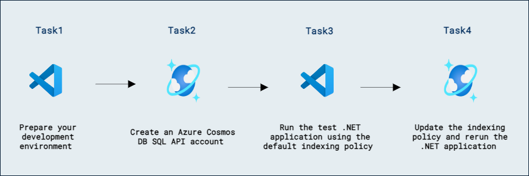
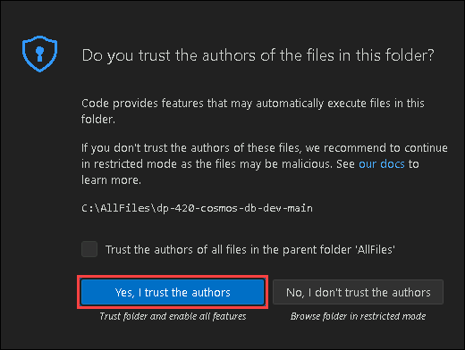
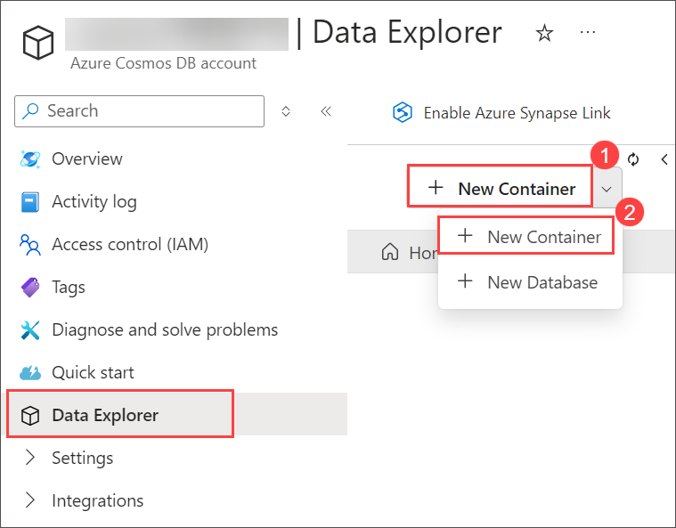
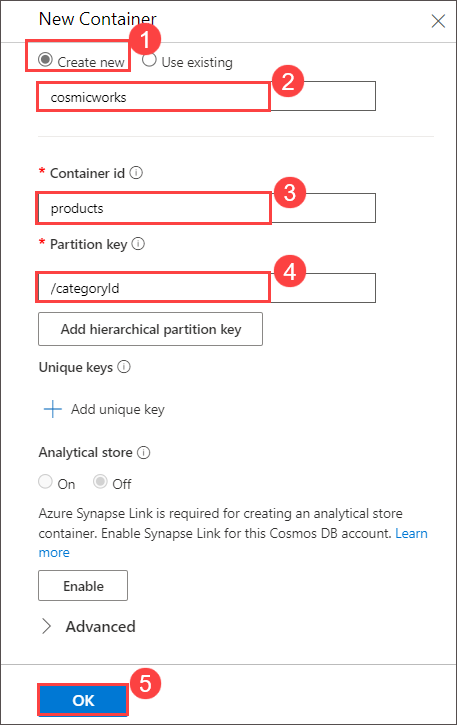
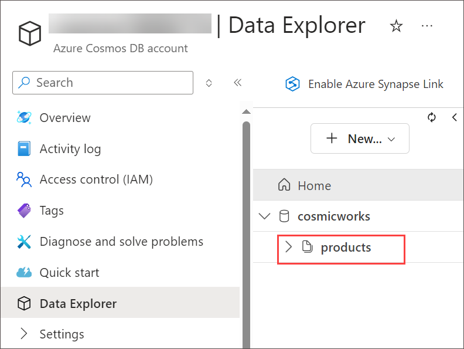

# Optimize an Azure Cosmos DB for NoSQL container's indexing policy for common operations

## Lab scenario

For write-heavy workloads or workloads with large JSON objects, it can be advantageous to optimize the indexing policy to only index properties that you know you will want to use in your queries.

In this lab, we will use a test .NET application to insert a large JSON item into an Azure Cosmos DB SQL API container using the default indexing policy and then using an indexing policy that has been tuned slightly.

## Lab objectives

In this lab, you will complete the following tasks:
- Task 1: Prepare your development environment.
- Task 2: Create an Azure Cosmos DB for NoSQL account.
- Task 3: Run the test .NET application using the default indexing policy.
- Task 4: Update the indexing policy and rerun the .NET application.

### Estimated Timing: 60 minutes

## Architecture Diagram



### Task 1: Prepare your development environment

In this task, you will prepare your development environment for working with Azure Cosmos DB by setting up Visual Studio Code.

1. Start Visual Studio Code (the program icon is pinned to the Desktop).

    

2. Select the **Extensions** blade from the left panel. Search with **C#** and select **Install** to install the extension.

    

3. Select the **file** option on the top left of the screen, from the pane options, select **Open Folder**. navigate to **C:\AllFiles\dp-420-cosmos-db-dev**.

    

4. Navigate to **C:\AllFiles\dp-420-cosmos-db-dev** select **dp-420-cosmos-db-dev** and click on **Select Folder**.

    

5. If when **Do you trust the author of the files in this folder** click on **Yes, I trust the authors**.

    

### Task 2: Create an Azure Cosmos DB for NoSQL account

In this task, you will provision an Azure Cosmos DB SQL account, configuring essential settings and retrieving the necessary connection details for future development.

Azure Cosmos DB is a cloud-based NoSQL database service that supports multiple APIs. When provisioning an Azure Cosmos DB account for the first time, you will select which of the APIs you want the account to support (for example, **Mongo API** or **NoSQL API**). Once the Azure Cosmos DB for NoSQL account is done provisioning, you can retrieve the endpoint and key and use them to connect to the Azure Cosmos DB for NoSQL account using the Azure SDK for .NET or any other SDK of your choice.

1. On **Azure Portal** page, in Search resources, services and docs (G+/) box at the top of the portal, enter **Azure Cosmos DB**, and then select **Azure Cosmos DB** under services.

    
   
1. Select **+ Create** under **Azure Cosmos DB for NoSQL** click on **Create** to create **Azure Cosmos DB for NoSQL** account.

    

    
   
1. Specify the following settings, leaving all remaining settings to their default values, and select **Review + create**:

    | **Setting** | **Value** |
    | :--- | :--- |
    | **Subscription** | *Your existing Azure subscription* |
    | **Resource group** | **DP-420-<inject key="DeploymentID" enableCopy="false"/>** |
    | **Account Name** | *Enter a globally unique name* |
    | **Location** | *Choose any available region* |
    | **Capacity mode** | *Serverless* |

1. After validation get Success click on **Create**.
   
1. Wait for the deployment task to complete before continuing with this task.

1. Go to the newly created **Azure Cosmos DB** account resource and navigate to the **Data Explorer** pane.

1. In the **Data Explorer** pane, select **+ New Container** > **+ New Container**.

    

1. In the **New Container** popup, enter the following values for each setting, and then select **OK**:

    | **Setting** | **Value** |
    | :-- | :-- |
    | **Database id** | *Create new* &vert; *``cosmicworks``* |
    | **Container id** | *``products``* |
    | **Partition key** | *``/categoryId``* |

    

1. Back in the **Data Explorer** pane, expand the **cosmicworks** database node and then observe the **products** container node within the hierarchy.

    

1. From the left navigation menu under **Settings** section, navigate to the **Keys** pane.

    

1. This pane contains the connection details and credentials necessary to connect to the account from the SDK. Specifically:

    1. Record the value of the **URI** field. You will use this **endpoint** value later in this exercise.

    1. Record the value of the **PRIMARY KEY** field. You will use this **key** value later in this exercise.

        

1. Return to **Visual Studio Code**.

    > **Congratulations** on completing the lab! Now, it's time to validate it. Here are the steps:
    > - Hit the Validate button for the corresponding task. If you receive a success message, you have successfully validated the lab. 
    > - If not, carefully read the error message and retry the step, following the instructions in the lab guide.
    > - If you need any assistance, please contact us at labs-support@spektrasystems.com. 

    <validation step="0e380f12-d3fe-4670-a788-3fa3a3687768" />
    
### Task 3: Run the test .NET application using the default indexing policy

This lab has a pre-built test .NET application that will take a large JSON object and create a new item in the Azure Cosmos DB for NoSQL container. Once the single write operation is complete, the application will output the item’s unique identifier and RU charge to the console window.

1. In the **Explorer** pane, browse to the **23-index-optimization** folder.

1. Right-click on the **23-index-optimization** folder and then select **Open in Integrated Terminal** to open a new terminal instance.

    > **Note:** This command will open the terminal with the starting directory already set to the **23-index-optimization** folder.

1. Build the project using the [dotnet build][docs.microsoft.com/dotnet/core/tools/dotnet-build] command:

    ```
    dotnet build
    ```

    > **Note:** You may see a compiler warning that the **endpoint** and **key** variables are current unused. You can safely ignore this warning as you will use these variables in this task.

1. Close the integrated terminal.

1. Open the **script.cs** code file.

1. Locate the **string** variable named **endpoint**. Set its value to the **endpoint** of the Azure Cosmos DB account you created earlier.
  
    ```
    string endpoint = "<cosmos-endpoint>";
    ```
    > **For example:** if your endpoint is: **https&shy;://dp420.documents.azure.com:443/**, then the C# statement would be: **string endpoint = "https&shy;://dp420.documents.azure.com:443/";**.

1. Locate the **string** variable named **key**. Set its value to the **key** of the Azure Cosmos DB account you created earlier.

    ```
    string key = "<cosmos-key>";
    ```
    > **For example:** if your key is: **fDR2ci9QgkdkvERTQ==**, then the C# statement would be: **string key = "fDR2ci9QgkdkvERTQ==";**.

1. **Save** the **script.cs** code file.

1. In **Visual Studio Code**, right-click on the **23-index-optimization** folder and then select **Open in Integrated Terminal** to open a new terminal instance.

1. Build and run the project using the **[dotnet run][docs.microsoft.com/dotnet/core/tools/dotnet-run]** command:

    ```
    dotnet run
    ```

1. Observe the output from the terminal. The item's unique identifier and the operation's request charge (in RUs) should be printed to the console.

1. Build and run the project at least two more times using the **[dotnet run][docs.microsoft.com/dotnet/core/tools/dotnet-run]** command. Observe the RU charge in the console output:

    ```
    dotnet run
    ```

1. Leave the integrated terminal open.

    > **Note:** You will re-use this terminal later in this exercise. It's important to leave the terminal open so you can compare the original and updated RU charges.
    
    > **Congratulations** on completing the lab! Now, it's time to validate it. Here are the steps:
    > - Hit the Validate button for the corresponding task. If you receive a success message, you have successfully validated the lab. 
    > - If not, carefully read the error message and retry the step, following the instructions in the lab guide.
    > - If you need any assistance, please contact us at labs-support@spektrasystems.com. 

    <validation step="e487cd8b-7edb-4b80-a103-3036d37a92b4" />
    
### Task 4: Update the indexing policy and rerun the .NET application

This lab scenario will assume that our future queries focus primarily on the name and categoryName properties. To optimize for our large JSON item, you will exclude all other fields from the index by creating an indexing policy that starts by excluding all paths. Then the policy will selectively include specific paths.

1. Return to your web browser.

1. Within the **Azure Cosmos DB** account resource, navigate to the **Data Explorer** pane.

1. In the **Data Explorer**, expand the **cosmicworks** database node, expand the **products** container node, and then select **Settings**.

1. In the **Settings** tab, navigate to the **Indexing Policy** section.

1. Observe the default indexing policy:

    ```
     {
        "indexingMode": "consistent",
        "automatic": true,
        "includedPaths": [
          {
            "path": "/*"
          }
        ],
        "excludedPaths": [
          {
            "path": "/\"_etag\"/?"
          }
        ]
      }    
    ```

1. Replace the indexing policy with this modified JSON object and then **Save** the changes:

    ```
      {
         "indexingMode": "consistent",
         "automatic": true,
         "includedPaths": [
           {
             "path": "/name/?"
           },
           {
             "path": "/categoryName/?"
           }
         ],
         "excludedPaths": [
           {
             "path": "/*"
           },
           {
             "path": "/\"_etag\"/?"
           }
         ]
      }
      ```
      
1. Return to **Visual Studio Code**. Return to the open terminal.

1. Build and run the project at least two more times using the **[dotnet run][docs.microsoft.com/dotnet/core/tools/dotnet-run]** command. Observe the new RU charge in the console output, which should be significantly less than the original charge. Since you are not indexing all the item properties, your writes' cost is significantly lower when updating the index. This, however, can cost you greatly if your reads will need to query on properties that are not indexed.  

    ```
    dotnet run
    ```

    > **Note:** If you are not seeing an updated RU charge, you may need to wait a couple of minutes.

1. Return to your web browser.

    >**Note:** If the **Indexing Policy** page is not open, go to **Data Explorer**, expand the **cosmicworks** database node, expand the **products** container node, select **Settings** and navigate to the **Indexing Policy** section.

1. Replace the indexing policy with this modified JSON object and then **Save** the changes:

    ```
    {
      "indexingMode": "none"
    }
    ```

1. Close your web browser window or tab.

1. Return to **Visual Studio Code**. Return to the open terminal.

1. Build and run the project at least two more times using the **[dotnet run][docs.microsoft.com/dotnet/core/tools/dotnet-run]** command. Observe the new RU charge in the console output, which should be much less than the original charge.  How can this be? Since this script measures the RUs when you write the item, by choosing to have no index, there is no overhead in maintaining that index. The flip side to this is that while your writes will generate fewer RUs, your reads will be very costly.

    ```
    dotnet run
    ```

     > **Note:** If you are not seeing an updated RU charge, you may need to wait a couple of minutes.

1. Close **Visual Studio Code**.

### Review

In this lab, you have completed:

- Prepared your development environment.
- Created an Azure Cosmos DB for NoSQL account.
- Ran the test .NET application using the default indexing policy.
- Updated the indexing policy and rerun the .NET application.

### You have successfully completed the lab
