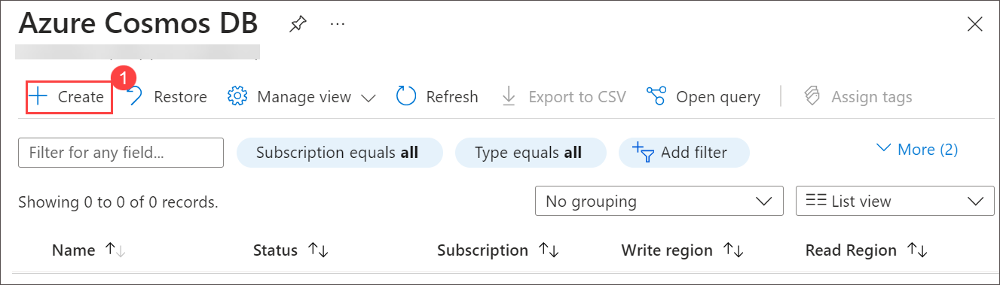
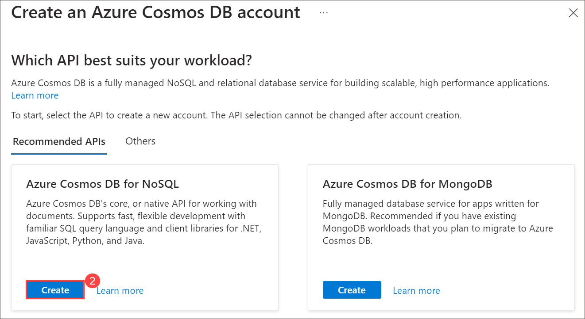
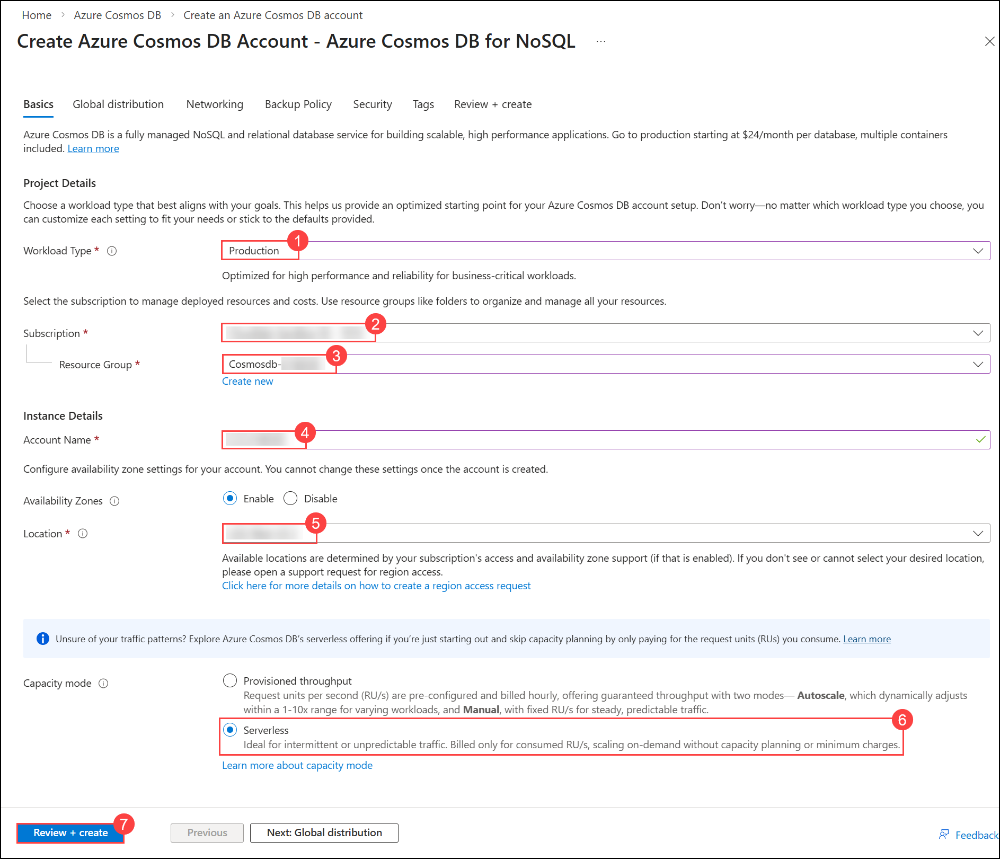
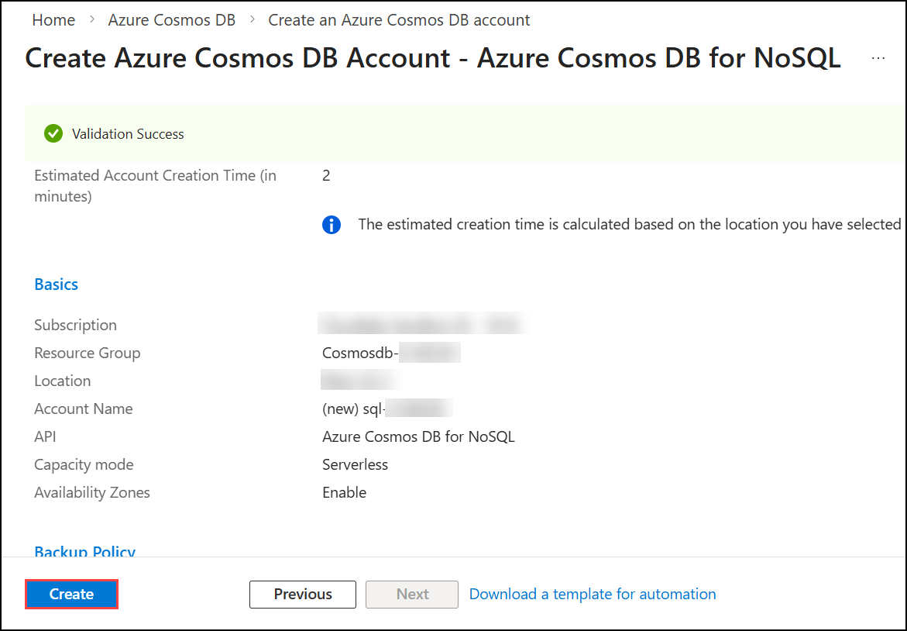
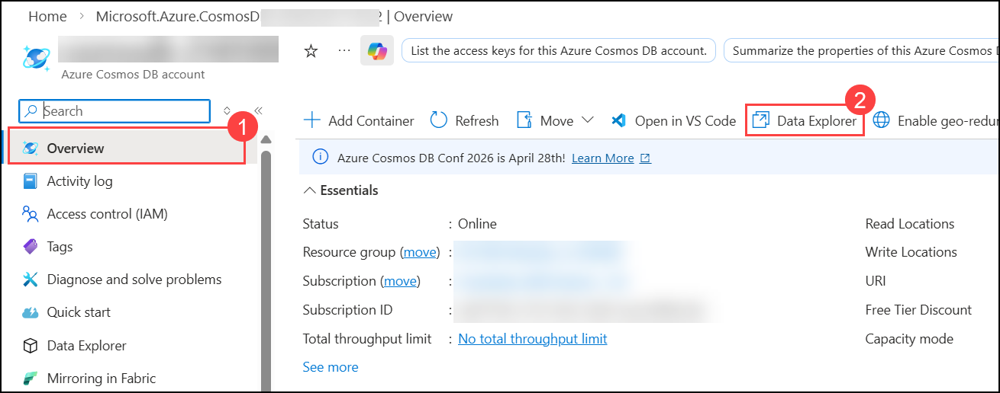
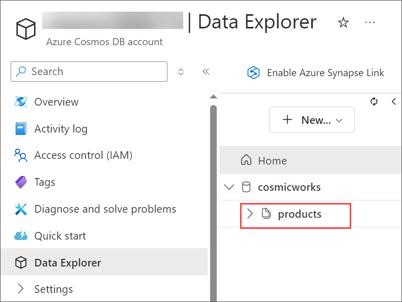
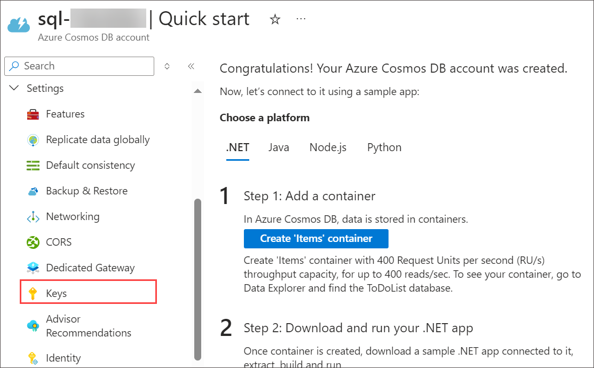
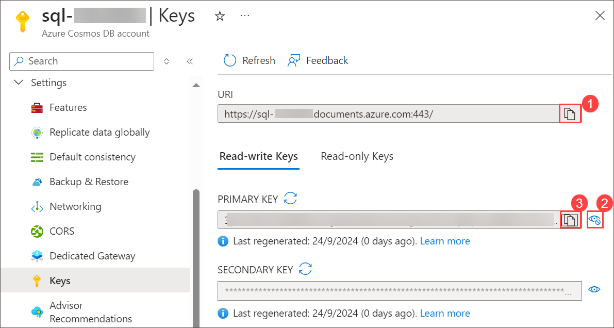

# 一般的な操作のために Azure Cosmos DB for NoSQL コンテナーのインデックス ポリシーを最適化する

## ラボのシナリオ

書き込みが多いワークロードや大きな JSON オブジェクトを扱うワークロードでは、クエリで使用することが確実なプロパティのみをインデックスするようにインデックス ポリシーを最適化することが有利になる場合があります。

このラボでは、テスト .NET アプリケーションを使用して、デフォルトのインデックス ポリシーを利用した場合と、わずかに調整したインデックス ポリシーを利用した場合に、Azure Cosmos DB for NoSQL コンテナーに大きな JSON アイテムを挿入する方法を学習します。

## ラボの目的

このラボでは、次のタスクを完了します:
- タスク 1: 開発環境を準備します。
- タスク 2: Azure Cosmos DB for NoSQL アカウントを作成します。
- タスク 3: デフォルトのインデックス ポリシーを使用してテスト .NET アプリケーションを実行します。
- タスク 4: インデックス ポリシーを更新し、.NET アプリケーションを再実行します。

### 推定所要時間: 60 分

## アーキテクチャ図


### タスク 1: 開発環境を準備する

このタスクでは、Visual Studio Code を設定して Azure Cosmos DB の作業に必要な開発環境を準備します。

1. Visual Studio Code を起動します（プログラム アイコンがデスクトップにピン留めされています）。

   

2. 左側のペインから **Extensions** ブレードを選択します。**C#** で検索し、**Install** を選択して拡張機能をインストールします。

   

3. 画面左上の **file** オプションを選択し、ペインのオプションから **Open Folder** を選択します。**C:\AllFiles\dp-420-cosmos-db-dev** に移動します。

   

4. **C:\AllFiles\dp-420-cosmos-db-dev** に移動し、**dp-420-cosmos-db-dev** を選択して **Select Folder** をクリックします。

    

5. 「**Do you trust the author of the files in this folder**」が表示された場合は、**Yes, I trust the authors** をクリックします。

   

### タスク 2: Azure Cosmos DB for NoSQL アカウントを作成する

このタスクでは、Azure Cosmos DB SQL アカウントをプロビジョニングし、必須の設定を構成し、今後の開発で必要になる接続情報を取得します。

Azure Cosmos DB は複数の API をサポートするクラウドベースの NoSQL データベース サービスです。Azure Cosmos DB アカウントを初めてプロビジョニングする際には、アカウントでサポートする API を選択します（たとえば **API for MongoDB** や **API for NoSQL**）。Azure Cosmos DB for NoSQL アカウントのプロビジョニングが完了したら、エンドポイントとキーを取得し、Azure SDK for .NET または他の任意の SDK を使用して Azure Cosmos DB for NoSQL アカウントに接続できます。

1. **Azure Portal** ページで、ポータル上部の「Search resources, services and docs (G+/)」ボックスに **Azure Cosmos DB** と入力し、サービスの下に表示される **Azure Cosmos DB** を選択します。

   

1. **Azure Cosmos DB for NoSQL** の下で **+ Create** を選択し、**Create** をクリックして **Azure Cosmos DB for NoSQL** アカウントを作成します。

   

   
   
1. 以下の設定でリソースを作成し、残りの設定はすべて既定値のままにして、**Review + create** **(7)** を選択します:

    | **設定** | **値** |
    | :--- | :--- |
    | **Workload Type** | Production **(1)** |
    | **Subscription** | ご自身の Azure サブスクリプションを選択します **(2)** |
    | **Resource Group** | 既存のリソース グループ **DP-420-<inject key="DeploymentID" enableCopy="false"/>** を選択します **(3)** |
    | **Account Name** | **sql-<inject key="DeploymentID" enableCopy="false"/>** と入力します **(4)** |
    | **Location** | 使用可能な任意のリージョンを選択します **(5)** |
    | **Capacity mode** | Serverless **(6)** |

      

1. 構成を確認し、**Create** をクリックします。

     

1. このタスクを続行する前に、デプロイメント タスクが完了するまで待ちます。

1. **Azure Cosmos DB** アカウント リソースの **overview page (1)** で、**Data Explorer (2)** ペインに移動します。

    

1. **Data Explorer** ペインで **+ New Container** **(1)** を選択し、**+ New Container (2)** を選択します。

   

1. **New Container** ポップアップで、各設定に次の値を入力し、**OK** を選択します:

   | **設定** | **値** |
   | :-- | :-- |
   | **Database id** | *Create new* &vert; *``cosmicworks``* |
   | **Container id** | *``products``* |
   | **Partition key** | *``/categoryId``* |

   

1. **Data Explorer** ペインに戻り、**cosmicworks** データベース ノードを展開し、階層内の **products** コンテナー ノードを確認します。

   

1. 左側のナビゲーション メニューで **Settings** セクションの **Keys** ペインに移動します。

   

1. このペインには、SDK からアカウントに接続するために必要な接続情報と資格情報が含まれています。具体的には:

   - **URI** フィールドの値を記録します。後でこの演習でこの **endpoint** 値を使用します。

   - **PRIMARY KEY** フィールドの値を記録します。後でこの演習でこの **key** 値を使用します。

     

1. **Visual Studio Code** に戻ります。

   > **おめでとうございます**。ラボが完了しました。次は検証です。手順は次のとおりです:
   > - 対応するタスクの Validate ボタンを押します。成功メッセージが表示されたら、ラボの検証に成功しています。
   > - そうでない場合は、エラーメッセージを注意深く読み、ラボ ガイドの手順に従って再試行してください。
   > - サポートが必要な場合は cloudlabs-support@spektrasystems.com までご連絡ください。24 時間 365 日対応しています。

   <validation step="0e380f12-d3fe-4670-a788-3fa3a3687768" />

### タスク 3: デフォルトのインデックス ポリシーを使用してテスト .NET アプリケーションを実行する

このタスクでは、Azure Cosmos DB for NoSQL コンテナーに大きな JSON オブジェクトを挿入する事前ビルド済みの .NET アプリケーションを実行します。

1. **Explorer** ペインで **23-index-optimization** フォルダーに移動します。

1. **23-index-optimization** フォルダーを右クリックし、**Open in Integrated Terminal** を選択して新しいターミナル インスタンスを開きます。

   > **注意:** このコマンドは、開始ディレクトリが既に **23-index-optimization** フォルダーに設定された状態でターミナルを開きます。

1. [dotnet build][docs.microsoft.com/dotnet/core/tools/dotnet-build] コマンドを使用してプロジェクトをビルドします:

   ```
   dotnet build
   ```

   > **注意:** **endpoint** と **key** 変数が現在未使用であるというコンパイラー警告が表示される場合があります。この警告は、このタスクでこれらの変数を使用するため、無視しても問題ありません。

1. 統合ターミナルを閉じます。

1. **script.cs** コード ファイルを開きます。

1. **endpoint** という名前の **string** 変数を探します。値を、先に作成した Azure Cosmos DB アカウントの **endpoint** に設定します。

   ```
   string endpoint = "<cosmos-endpoint>";
   ```

   > **例:** エンドポイントが **https&shy;://dp420.documents.azure.com:443/** の場合、C# の文は **string endpoint = "https&shy;://dp420.documents.azure.com:443/";** になります。

1. **key** という名前の **string** 変数を探します。値を、先に作成した Azure Cosmos DB アカウントの **key** に設定します。

   ```
   string key = "<cosmos-key>";
   ```

   > **例:** キーが **fDR2ci9QgkdkvERTQ==** の場合、C# の文は **string key = "fDR2ci9QgkdkvERTQ==";** になります。

1. **script.cs** コード ファイルを **Save** します。

1. **Visual Studio Code** で **23-index-optimization** フォルダーを右クリックし、**Open in Integrated Terminal** を選択して新しいターミナル インスタンスを開きます。

1. **[dotnet run][docs.microsoft.com/dotnet/core/tools/dotnet-run]** コマンドを使用してプロジェクトをビルドし、実行します:

   ```
   dotnet run
   ```
1. ターミナルの出力を確認します。アイテムの一意の識別子と操作の要求課金（RU）がコンソールに表示されるはずです。

1. **[dotnet run][docs.microsoft.com/dotnet/core/tools/dotnet-run]** コマンドを少なくとも 2 回以上繰り返し、プロジェクトをビルドして実行します。コンソール出力の RU 料金を確認します:

   ```
   dotnet run
   ```
1. 統合ターミナルを開いたままにします。

   > **おめでとうございます**。ラボを完了しました。次は検証です。手順は次のとおりです:
   > - 対応するタスクの Validate ボタンを押します。成功メッセージが表示されたら、ラボの検証に成功しています。
   > - そうでない場合は、エラーメッセージを注意深く読み、ラボ ガイドの指示に従って手順を再試行してください。
   > - サポートが必要な場合は cloudlabs-support@spektrasystems.com までご連絡ください。24 時間 365 日対応しています。

   <validation step="e487cd8b-7edb-4b80-a103-3036d37a92b4" />

### タスク 4: インデックス ポリシーを更新し、.NET アプリケーションを再実行する

このタスクでは、今後のクエリが主に name および categoryName プロパティに焦点を当てると想定します。大きな JSON アイテムを最適化するために、最初にすべてのパスを除外するインデックス ポリシーを作成し、必要なパスのみを選択的に含めます。

1. Web ブラウザーに戻ります。

1. **Azure Cosmos DB** アカウント リソース内で、**Data Explorer** ペインに移動します。

1. **Data Explorer** で **cosmicworks** データベース ノードを展開し、**products** コンテナー ノードを展開してから **Settings** を選択します。

1. **Settings** タブで **Indexing Policy** セクションに移動します。

1. Observe the default indexing policy:

   ```
     {
        "indexingMode": "consistent",
        "automatic": true,
        "includedPaths": [
          {
            "path": "/*"
          }
        ],
        "excludedPaths": [
          {
            "path": "/\"_etag\"/?"
          }
        ]
      }    
   ```

1. Replace the indexing policy with this modified JSON object and then **Save** the changes:

   ```
      {
         "indexingMode": "consistent",
         "automatic": true,
         "includedPaths": [
           {
             "path": "/name/?"
           },
           {
             "path": "/categoryName/?"
           }
         ],
         "excludedPaths": [
           {
             "path": "/*"
           },
           {
             "path": "/\"_etag\"/?"
           }
         ]
      }
   ```

1. **Visual Studio Code** に戻り、開いているターミナルに戻ります。

1. **[dotnet run][docs.microsoft.com/dotnet/core/tools/dotnet-run]** コマンドを使用してプロジェクトを少なくともさらに 2 回実行します。コンソール出力の新しい RU 料金を確認します。元の料金よりもかなり少なくなるはずです。すべてのアイテム プロパティをインデックスしていないため、インデックスを更新すると書き込みのコストが大幅に低くなります。ただし、インデックスされていないプロパティで読み取りクエリを実行する必要がある場合、コストが大きくなる可能性があります。

   ```
   dotnet run
   ```

   > **注意:** RU 料金が更新されない場合は、数分待つ必要があるかもしれません。

1. Web ブラウザーに戻ります。

   > **注意:** **Indexing Policy** ページが開いていない場合は、**Data Explorer** に移動し、**cosmicworks** データベース ノードを展開し、**products** コンテナー ノードを展開して、**Settings** を選択し、**Indexing Policy** セクションに移動してください。

1. インデックス ポリシーを次の修正された JSON オブジェクトに置き換え、変更を **Save** します:

   ```
    {
      "indexingMode": "none"
    }
   ```

1. Web ブラウザー ウィンドウまたはタブを閉じます。

1. **Visual Studio Code** に戻り、開いているターミナルに戻ります。

1. **[dotnet run][docs.microsoft.com/dotnet/core/tools/dotnet-run]** コマンドを使用してプロジェクトを少なくともさらに 2 回実行します。コンソール出力の新しい RU 料金を確認します。元の料金よりもはるかに少なくなるはずです。これはどういうことでしょうか。 このスクリプトはアイテムを書き込んだときの RU を測定するため、インデックスを無効にすると、そのインデックスを維持するオーバーヘッドがなくなります。その反面、書き込みの RU は少なくなりますが、読み取りは非常に高コストになる可能性があります。

   ```
   dotnet run
   ```

    > **注意:** RU 料金が更新されない場合は、数分待つ必要があるかもしれません。

1. **Visual Studio Code** を閉じます。

### サマリー

このラボでは、特に大きな JSON オブジェクトを扱う書き込み重視のワークロードに対して、Azure Cosmos DB for NoSQL コンテナーのインデックス ポリシーを最適化する方法を学習しました。目的は、インデックスされるフィールドを制限してパフォーマンスを向上させ、書き込み操作時の RU（Request Unit）料金を削減することでした。

### レビュー

このラボでは、次の作業を完了しました:

- 開発環境を準備しました。
- Azure Cosmos DB for NoSQL アカウントを作成しました。
- デフォルトのインデックス ポリシーを使用してテスト .NET アプリケーションを実行しました。
- インデックス ポリシーを更新し、.NET アプリケーションを再実行しました。

### このラボは正常に完了しました
