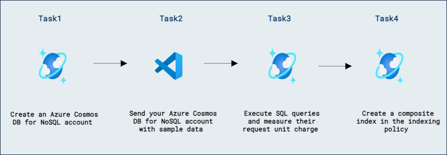

# Lab 10b - Azure Cosmos DB SQL API でクエリのパフォーマンスを最適化する

## ラボのシナリオ

Azure Cosmos DB SQL API アカウントを計画するとき、最もよく使用されるクエリを把握することで、クエリのパフォーマンスを最大化するためにインデックス ポリシーを調整できます。

このラボでは、Data Explorer を使用して、デフォルトのインデックス ポリシーと複合インデックスを含むインデックス ポリシーの両方で SQL クエリをテストします。

## ラボの目的

このラボでは、次のタスクを完了します:
- タスク 1: Azure Cosmos DB SQL API アカウントを作成します。
- タスク 2: Azure Cosmos DB SQL API アカウントにサンプル データをシードします。
- タスク 3: SQL クエリを実行し、要求単位料金を測定します。
- タスク 4: インデックス ポリシーに複合インデックスを作成します。

## 推定所要時間: 60 分

## アーキテクチャ図



## 演習 1: クエリのために Azure Cosmos DB SQL API コンテナーのインデックス ポリシーを最適化する

### タスク 1: Azure Cosmos DB SQL API アカウントを作成する

Azure Cosmos DB は複数の API をサポートするクラウドベースの NoSQL データベース サービスです。Azure Cosmos DB アカウントを初めてプロビジョニングするときは、アカウントでサポートする API を選択します（たとえば **Mongo API** または **SQL API**）。Azure Cosmos DB SQL API アカウントのプロビジョニングが完了したら、エンドポイントとキーを取得し、Azure SDK for .NET または他の任意の SDK を使用して Azure Cosmos DB SQL API アカウントに接続できます。

1. 新しい Web ブラウザー ウィンドウまたはタブで Azure ポータル（``portal.azure.com``）に移動します。

1. サブスクリプションに関連付けられた Microsoft 資格情報を使用してポータルにサインインします。

1. **Azure services** カテゴリで **Create a resource** を選択し、次に **Azure Cosmos DB** を選択します。

    > 💡 代わりに **≡** メニューを展開し、**All Services** を選択し、**Databases** カテゴリの **Azure Cosmos DB** を選択してから **Create** を選択することもできます。

1. **Select API option** ペインで、**Azure Cosmos DB for NoSQL** セクションの **Create** オプションを選択します。

1. **Create Azure Cosmos DB Account** ペインで、**Basics** タブを確認します。

    | **設定** | **値** |
    | --- | --- |
    | **Subscription** | *Your existing Azure subscription* |
    | **Resource group** | *DP-420-DeploymentID* |
    | **Account Name** | *Enter a globally unique name* |
    | **Location** | *Choose any available region* |
    | **Capacity mode** | *Serverless* |


    > **注意**: DeploymentID は各環境に関連付けられた一意の ID です。環境の詳細ページで値を確認できます。

1. **Review + Create** をクリックし、検証が成功したら **Create** をクリックします。

1. このタスクを続行する前に、デプロイメント タスクが完了するまで待ちます。

1. 新しく作成した **Azure Cosmos DB** アカウント リソースに移動し、**Data Explorer** ペインに移動します。

1. **Data Explorer** ペインで **New Container** を選択します。

1. **New Container** ポップアップで、各設定に次の値を入力し、**OK** を選択します:

    | **設定** | **値** |
    | --- | --- |
    | **Database id** | *Create new* &vert; *cosmicworks* |
    | **Container id** | *products* |
    | **Partition key** | */categoryId* |

1. **Data Explorer** ペインに戻り、**cosmicworks** データベース ノードを展開して、階層内の **products** コンテナー ノードを確認します。

1. リソース ブレードで **Keys** ペインに移動します。

1. このペインには、SDK からアカウントに接続するために必要な接続情報と資格情報が含まれています。具体的には:

    1. **URI** フィールドの値を記録します。後でこの演習でこの **endpoint** 値を使用します。

    1. **PRIMARY KEY** フィールドの値を記録します。後でこの演習でこの **key** 値を使用します。

1. Web ブラウザー ウィンドウまたはタブを閉じます。

### タスク 2: Azure Cosmos DB SQL API アカウントにサンプルデータをシードする

**cosmicworks** データベースと **products** コンテナーを作成するコマンドライン ユーティリティを使用します。このツールは、その後ターミナル ウィンドウで実行されている変更フィード プロセッサで確認できる一連のアイテムを作成します。

1. **Visual Studio Code** で **Terminal** メニューを開き、**Split Terminal** を選択して、既存のインスタンスと並列表示される新しいターミナルを開きます。

1. マシンでグローバルに使用するために [cosmicworks][nuget.org/packages/cosmicworks] コマンドライン ツールをインストールします。

    ```
    dotnet tool install --global cosmicworks
    ```

    > **注意:** このコマンドには数分かかる場合があります。以前にこのツールの最新バージョンをインストールしている場合は、(*Tool 'cosmicworks' is already installed*) という警告メッセージが表示されることがあります。

1. 次のコマンド ライン オプションを使用して cosmicworks を実行し、Azure Cosmos DB アカウントにデータベース、コンテナー、およびアイテムをシードします:

    | **Option** | **Value** |
    | --- | --- |
    | **--endpoint** | *このラボの前の手順でコピーした endpoint の値* |
    | **--key** | *このラボの前の手順でコピーした key の値* |
    | **--datasets** | *product* |

    ```
    cosmicworks --endpoint <cosmos-endpoint> --key <cosmos-key> --datasets product
    ```

    > **注意:** たとえば、エンドポイントが **https&shy;://dp420.documents.azure.com:443/**、キーが **fDR2ci9QgkdkvERTQ==** の場合、コマンドは次のようになります:
    > ``cosmicworks --endpoint https://dp420.documents.azure.com:443/ --key fDR2ci9QgkdkvERTQ== --datasets product``

1. **cosmicworks** コマンドがアカウントにデータベース、コンテナー、およびアイテムの作成を完了するまで待ちます。

1. 統合ターミナルを閉じます。

1. **Visual Studio Code** を閉じます。

### タスク 3: SQL クエリを実行し、要求単位料金を測定する

インデックス ポリシーを変更する前に、まずいくつかのサンプル SQL クエリを実行して、RU で表される基準となる要求単位料金を取得します。

1. 新しい Web ブラウザー ウィンドウまたはタブで Azure ポータル（``portal.azure.com``）に移動します。

1. サブスクリプションに関連付けられた Microsoft 資格情報でポータルにサインインします。

1. **Resource groups** を選択し、このラボで作成または表示したリソース グループを選択し、次にこのラボで作成した **Azure Cosmos DB アカウント** リソースを選択します。

1. **Azure Cosmos DB** アカウント リソース内で、**Data Explorer** ペインに移動します。

1. **Data Explorer** で **cosmicworks** データベース ノードを展開し、**products** コンテナー ノードを選択して、**New SQL Query** を選択します。

1. **Execute Query** を選択して、既定のクエリを実行します:

    ```
    SELECT * FROM c
    ```

1. クエリの結果を確認します。**Query Stats** を選択して RU での要求単位料金を表示します。

1. エディター領域の内容を削除します。

1. **name** が **HL Headset** と等しいすべてのドキュメントを返す新しい SQL クエリを作成します:

    ```
    SELECT 
        p.name,
        p.categoryName,
        p.price
    FROM
        products p    
    ```

1. **Execute Query** を選択します。

1. クエリの結果と統計を確認します。要求単位料金は最初のクエリとほぼ同じです。

1. エディター領域の内容を削除します。

1. **name** が **HL Headset** と等しいすべてのドキュメントを返す新しい SQL クエリを作成します:

    ```
    SELECT 
        p.name,
        p.categoryName,
        p.price
    FROM
        products p
    ORDER BY
        p.categoryName DESC
    ```

1. **Execute Query** を選択します。

1. クエリの結果と統計を確認します。**ORDER BY** 句のために要求単位料金が増加しています。

### タスク 4: インデックス ポリシーに複合インデックスを作成する

複数のプロパティでアイテムを並べ替える場合は、複合インデックスを作成する必要があります。このタスクでは、まず **categoryName** で並べ替え、次に **name** で並べ替える複合インデックスを作成します。

1. **Data Explorer** で **cosmicworks** データベース ノードを展開し、**products** コンテナー ノードを選択して、**New SQL Query** を選択します。

1. エディター領域の内容を削除します。

1. 結果をまず **categoryName** の降順で、次に **price** の昇順で並べ替える新しい SQL クエリを作成します:

    ```
    SELECT 
        p.name,
        p.categoryName,
        p.price
    FROM
        products p
    ORDER BY
        p.categoryName DESC,
        p.price ASC
    ```

1. **Execute Query** を選択します。

1. クエリは **The order by query does not have a corresponding composite index that it can be served from** というエラーで失敗するはずです。

1. **Data Explorer** で **cosmicworks** データベース ノードを展開し、**products** コンテナー ノードを展開してから **Settings** を選択します。

1. **Settings** タブで **Indexing Policy** セクションに移動します。

1. 既定のインデックス ポリシーを確認します:

    ```
    {
      "indexingMode": "consistent",
      "automatic": true,
      "includedPaths": [
        {
          "path": "/*"
        }
      ],
      "excludedPaths": [
        {
          "path": "/\"_etag\"/?"
        }
      ]
    }    
    ```

1. インデックス ポリシーを次の修正された JSON オブジェクトに置き換え、変更を **Save** します:

    ```
    {
      "indexingMode": "consistent",
      "automatic": true,
      "includedPaths": [
        {
          "path": "/*"
        }
      ],
      "excludedPaths": [],
      "compositeIndexes": [
        [
          {
            "path": "/categoryName",
            "order": "descending"
          },
          {
            "path": "/price",
            "order": "ascending"
          }
        ]
      ]
    }
    ```

1. **Data Explorer** で **cosmicworks** データベース ノードを展開し、**products** コンテナー ノードを選択して、**New SQL Query** を選択します。

1. エディター領域の内容を削除します。

1. 結果をまず **categoryName** の降順で、次に **price** の昇順で並べ替える新しい SQL クエリを作成します:

    ```
    SELECT 
        p.name,
        p.categoryName,
        p.price
    FROM
        products p
    ORDER BY
        p.categoryName DESC,
        p.price ASC
    ```

1. **Execute Query** を選択します。

1. クエリの結果と統計を確認します。複合インデックスが適用されているため、要求単位料金は小さくなるはずです。

1. エディター領域の内容を削除します。

1. 結果をまず **categoryName** の降順で、次に **name** の昇順で、最後に **price** の昇順で並べ替える新しい SQL クエリを作成します:

    ```
    SELECT 
        p.name,
        p.categoryName,
        p.price
    FROM
        products p
    ORDER BY
        p.categoryName DESC,
        p.name ASC,
        p.price ASC
    ```

1. **Execute Query** を選択します。

1. クエリは **The order by query does not have a corresponding composite index that it can be served from** というエラーで失敗するはずです。

1. **Data Explorer** で **cosmicworks** データベース ノードを展開し、**products** コンテナー ノードを展開してから **Settings** を再度選択します。

1. **Settings** タブで **Indexing Policy** セクションに移動します。

1. インデックス ポリシーを次の修正された JSON オブジェクトに置き換え、変更を **Save** します:

    ```
    {
      "indexingMode": "consistent",
      "automatic": true,
      "includedPaths": [
        {
          "path": "/*"
        }
      ],
      "excludedPaths": [],
      "compositeIndexes": [
        [
          {
            "path": "/categoryName",
            "order": "descending"
          },
          {
            "path": "/price",
            "order": "ascending"
          }
        ],
        [
          {
            "path": "/categoryName",
            "order": "descending"
          },
          {
            "path": "/name",
            "order": "ascending"
          },
          {
            "path": "/price",
            "order": "ascending"
          }
        ]
      ]
    }
    ```

1. **Data Explorer** で **cosmicworks** データベース ノードを展開し、**products** コンテナー ノードを選択して、**New SQL Query** を選択します。

1. エディター領域の内容を削除します。

1. 結果をまず **categoryName** の降順で、次に **name** の昇順で、最後に **price** の昇順で並べ替える新しい SQL クエリを作成します:

    ```
    SELECT 
        p.name,
        p.categoryName,
        p.price
    FROM
        products p
    ORDER BY
        p.categoryName DESC,
        p.name ASC,
        p.price ASC
    ```

1. **Execute Query** を選択します。

1. クエリの結果と統計を確認します。複合インデックスが適用されているため、要求単位料金は低くなるはずです。

1. Web ブラウザー ウィンドウまたはタブを閉じます。

### レビュー

このラボでは、次の作業を完了しました:

- Azure Cosmos DB SQL API アカウントを作成しました。
- Azure Cosmos DB SQL API アカウントにサンプル データをシードしました。
- SQL クエリを実行し、要求単位料金を測定しました。
- インデックス ポリシーに複合インデックスを作成しました。

### このラボは正常に完了しました
