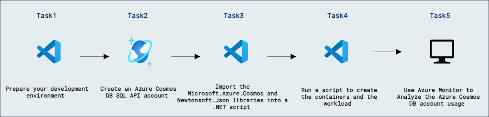
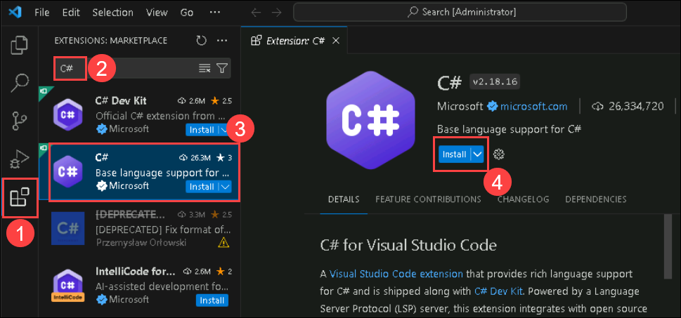
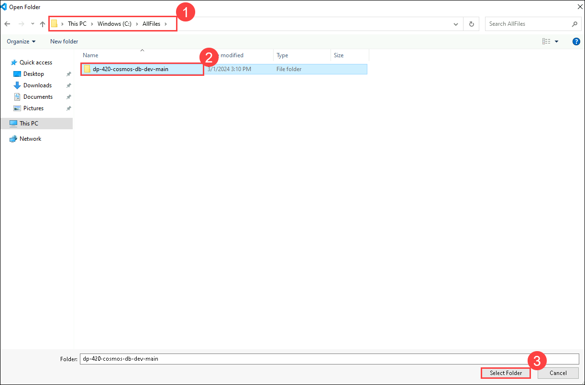
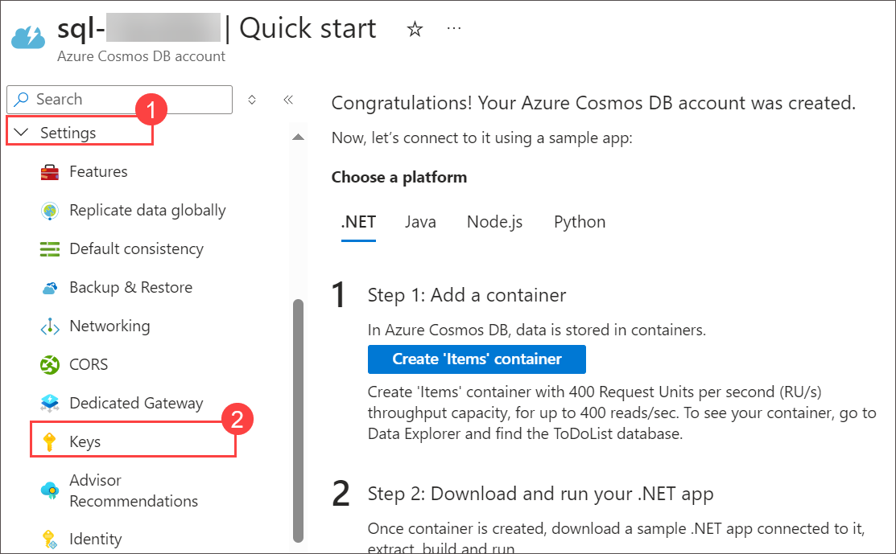

# Azure Monitor を使用して Azure Cosmos DB for NoSQL アカウントを分析する

## ラボのシナリオ

Azure Monitor は、Azure リソースを監視するための機能をフルスタックで提供する監視サービスです。Azure Cosmos DB は Azure Monitor を使用して監視データを生成します。Azure Monitor は Cosmos DB のメトリックとテレメトリ データをキャプチャします。

このラボでは、Azure Cosmos DB コンテナーに対してシミュレートされたワークロードを実行し、そのワークロードが Azure Cosmos DB アカウントに与える影響を分析します。

## ラボの目的

このラボでは、次のタスクを完了します:
- タスク 1: 開発環境を準備します。
- タスク 2: Azure Cosmos DB for NoSQL アカウントを作成します。
- タスク 3: Microsoft.Azure.Cosmos と Newtonsoft.Json ライブラリを .NET スクリプトにインポートします。
- タスク 4: コンテナーとワークロードを作成するスクリプトを実行します。
- タスク 5: Azure Monitor を使用して Azure Cosmos DB アカウントの使用状況を分析します

## 推定所要時間: 30 分

## アーキテクチャ図



### タスク 1: 開発環境を準備する

このタスクでは、Visual Studio Code で開発環境をセットアップします。

1. Visual Studio Code を起動します（プログラム アイコンがデスクトップにピン留めされています）。

   

2. 左側のペインから **Extension (1)** アイコンを選択します。検索バーに **C# (2)** を入力し、表示された **extension (3)** を選択して、最後に拡張機能の **Install (4)** を選択します。

    

3. 画面左上の **file** オプションを選択し、ペインのオプションから **Open Folder** を選択し、**C:\AllFiles** に移動します。

4. **dp-420-cosmos-db-dev-main** フォルダーを選択し、**Select Folder** をクリックします。

    

    > **注意:** 「**Do you trust the authors of the files in this folder?**」のポップアップが表示されたら、**Yes, I trust the authors** を選択します。

      

### タスク 2: Azure Cosmos DB for NoSQL アカウントを作成する

このタスクでは、API for NoSQL を使用して Azure Cosmos DB アカウントを作成します。アカウントのプロビジョニング後に、エンドポイント (URI) とプライマリ キーなどの必要な接続情報を取得します。

Azure Cosmos DB は複数の API をサポートするクラウドベースの NoSQL データベース サービスです。Azure Cosmos DB アカウントを初めてプロビジョニングするときは、アカウントでサポートする API を選択します（たとえば **API for MongoDB** や **API for NoSQL**）。Azure Cosmos DB for NoSQL アカウントのプロビジョニングが完了したら、エンドポイントとキーを取得し、Azure SDK for .NET または任意の他の SDK を使用して Azure Cosmos DB for NoSQL アカウントに接続できます。

1. **Azure Portal** に戻ります。

1. *Azure Cosmos DB (1)* を検索し、**Azure Cosmos DB (2)** を選択します。

   
   
1. Select **+ Create** under **Azure Cosmos DB for NoSQL** click on **Create** to create **Azure Cosmos DB for NoSQL** account.

    

    


1. 次の設定を指定し、その他の設定はすべて既定値のままにして、**Review + create (9)** を選択します:

    | **設定** | **値** |
    | :--- | :--- |
    | **Workload Type** | *Learning* **(1)** |    
    | **Subscription** | *Your existing Azure subscription* **(2)** |
    | **Resource group** | *Select an existing Cosmosdb-<inject key="DeploymentID" enableCopy="false"/>* **(3)** |
    | **Account Name** | *sql-<inject key="DeploymentID" enableCopy="false"/>* **(4)** |
    | **Location** | *Choose any available region* **(5)** |
    | **Capacity mode** | *Provisioned throughput* **(6)** |
    | **Apply Free Tier Discount** | *Do Not Apply* **(7)** |
    | **Limit total account throughput** | *Disable* **(8)** |        

     
            
   
1. Once after validation passed click on **Create**.

     

1. Wait for the deployment task to complete before continuing with this task.

1. **Go to resources** を選択します。新しく作成された **Azure Cosmos DB** アカウントの **Settings (1)** の下にある **Keys (2)** ペインに移動します。

    

    

1. このペインには、SDK からアカウントに接続するために必要な接続情報と資格情報が含まれています。具体的には:

    - **URI (1)** フィールドの値を記録します。後でこの演習でこの **endpoint** 値を使用します。

    - **PRIMARY KEY (2)** フィールドの値を記録します。後でこの演習でこの **key** 値を使用します。

        

    > **おめでとうございます**。ラボを完了しました。次は検証です。手順は次のとおりです:
    > - 対応するタスクの Validate ボタンを押します。成功メッセージが表示されたら、ラボの検証に成功しています。
    > - そうでない場合は、エラーメッセージを注意深く読み、ラボ ガイドの手順に従って再試行してください。
    > - サポートが必要な場合は cloudlabs-support@spektrasystems.com までご連絡ください。24 時間 365 日対応しています。
    
    <validation step="f7d09acb-1ee3-4b09-97b4-04f9af7a3aa9" />

### タスク 3: Microsoft.Azure.Cosmos と Newtonsoft.Json ライブラリを .NET スクリプトにインポートする

このタスクでは、.NET CLI の [add package][docs.microsoft.com/dotnet/core/tools/dotnet-add-package] コマンドを使用して、事前構成されたパッケージフィードからパッケージをインポートします。.NET のインストールでは、NuGet がデフォルトのパッケージフィードとして使用されます。

1. **Visual Studio Code** で、**Explorer** ペインから **25-monitor** フォルダーに移動します。

1. **25-monitor** フォルダーを右クリックし、**Open in Integrated Terminal** を選択して新しいターミナルを開きます。

    >**注意:** このコマンドは、開始ディレクトリが既に **25-monitor** フォルダーに設定された状態でターミナルを開きます。

1. 次のコマンドを実行して、NuGet から [Microsoft.Azure.Cosmos][nuget.org/packages/microsoft.azure.cosmos/3.22.1] パッケージを追加します。

    ```
    dotnet add package Microsoft.Azure.Cosmos --version 3.22.1
    ```

1. 次のコマンドを実行して、NuGet から [Newtonsoft.Json][nuget.org/packages/Newtonsoft.Json/13.0.1] パッケージを追加します。

    ```
    dotnet add package Newtonsoft.Json --version 13.0.1
    ```

### タスク 4: コンテナーとワークロードを作成するスクリプトを実行する

このタスクでは、Azure Cosmos DB アカウントを使用してワークロードを作成および監視するスクリプトを実行します。スクリプトは 3 つのコンテナーをセットアップし、データを読み込み、複数のユーザーアプリケーションが SQL クエリでデータベースにアクセスするシミュレーションを行います。これにより、Azure Cosmos DB の使用状況とパフォーマンス指標を監視できます。

これで、Azure Cosmos DB アカウントの使用状況を監視するためのワークロードを実行する準備が整いました。これから実行するスクリプトは、裏で 3 つのコンテナーを作成し、それらのコンテナーにデータを読み込みます。次に、このスクリプトはランダムにいくつかの SQL クエリを実行し、複数のユーザーアプリケーションが Azure Cosmos DB アカウントにアクセスしているかのようにシミュレートします。

1. **Visual Studio Code** で、**Explorer** ペインから **25-monitor** フォルダーに移動します。

1. **Program.cs** コード ファイルを開きます。

1. 既存の **endpoint** という名前の変数を、前に作成した Azure Cosmos DB アカウントの **endpoint** に設定します。
  
    ```
    private static readonly string endpoint = "<cosmos-endpoint>";
    ```

    > &#128221; たとえば、endpoint が **https&shy;://dp420.documents.azure.com:443/** の場合、C# の文は次のようになります: **private static readonly string endpoint = "https&shy;://dp420.documents.azure.com:443/";**.

1. 既存の **key** という名前の変数を、前に作成した Azure Cosmos DB アカウントの **key** に設定します。

    ```
    private static readonly string key = "<cosmos-key>";
    ```

    > &#128221; たとえば、key が **fDR2ci9QgkdkvERTQ==** の場合、C# の文は次のようになります: **private static readonly string key = "fDR2ci9QgkdkvERTQ==";**.

1. **Program.cs** ファイルを保存します。

1. *Integrated Terminal* に戻ります。

1. [dotnet run][docs.microsoft.com/dotnet/core/tools/dotnet-run] コマンドを使用してプロジェクトをビルドして実行します。

    ```
    dotnet run
    ```
    > &#128221; このスクリプトの最初の部分では、3 つのコンテナーが作成され、データがそれらに読み込まれます。これには約 2 分かかります。レート制限イベントをシミュレートするために、スクリプトはプロビジョニングされたスループットを 400 RU/s に設定します。その後、***Creating simulated background workload, wait 5-10 minutes and go to the next step of the exercise.*** というメッセージが表示されるはずです。Azure リソースは監視データを Azure Monitor に非同期にアップロードするため、Azure Monitor Metrics と Insights で診断データが取得され始めるまで少し待つ必要があります。5-10 分後に次のステップに進んでください。追加の診断データを収集したい場合は、5-10 分後にスクリプトを停止する必要はなく、ラボの終了までそのまま待機してもかまいません。

    > &#128221; コンパイラーは、スクリプトが多くの操作を同期的に実行し、操作の応答を待機しないことを検出するため、黄色の警告がいくつか表示される場合があります。これらの警告は、複数の SQL スクリプトを同時に実行するための想定される動作であるため、無視して構いません。

    >**注意**: 上記のコマンドを実行した後に Visual Studio Code がクラッシュすることがあります。コマンドを再実行し、次のタスクに進んでください。Visual Studio Code が 2 回以上クラッシュする場合は、以下の手順で Visual Studio Code をアンインストールして再インストールしてください。

      - スタート メニューで **Control Panel** を検索して選択します。
      - **Programs** の下で **Uninstall a program** を選択し、**Microsoft visual studio code (user)** を探して右クリックし、**Uninstall** を選択します。
      - **Microsoft edge** を開き、アドレスバーに https://code.visualstudio.com/download を入力して、**Windows** の下のダウンロード アイコンをクリックします。
      - ダウンロードが完了したら、ダウンロードしたファイルを開き、Visual Studio Code をインストールします。
      - インストールが完了したら Visual Studio Code を開き、手順 7 を再実行します。
          
    > **おめでとうございます**。ラボが完了しました。次に検証を行います。手順は次のとおりです:
    > - 対応するタスクの Validate ボタンを押します。成功メッセージが表示されたら、ラボの検証に成功しています。
    > - そうでない場合は、エラーメッセージを注意深く読み、ラボ ガイドの手順に従って再試行してください。
    > - サポートが必要な場合は cloudlabs-support@spektrasystems.com までご連絡ください。24 時間 365 日対応しています。
    
    <validation step="ff1fcfa9-5e37-4665-85cc-9628e4ffb657" />


### タスク 5: Azure Monitor を使用して Azure Cosmos DB アカウントの使用状況を分析する

このタスクでは、ブラウザーに戻り、Azure Monitor の Insights と Metrics のレポートのいくつかを確認します。

#### サブタスク 1: Azure Monitor Metrics レポート

1. 先ほど最小化したブラウザー ウィンドウに戻ります。閉じてしまった場合は、新しく開いて [Azure Portal](portal.azure.com) で Azure Cosmos DB アカウントページに移動します。

1. Azure Cosmos DB の左側メニューで、*Monitoring* の下にある **Metrics** を選択します。**Scope** と **Metric Namespace** のフィールドには正しい情報が自動入力されています。次の手順では、いくつかの **Metric** オプションと *Add filter* および *Apply splitting* 機能を確認します。

1. 既定では、*Metrics* セクションは過去 24 時間の診断情報を表示します。前のステップで作成したワークロードのメトリックを確認するには、より詳細な期間に切り替える必要があります。右上隅にある ***Local time: Last 24 hours (Automatic)*** と表示されたボタンを選択します。すると複数のラジオボタンによる時間範囲オプションが表示されます。**Last 30 minutes** のラジオボタンを選択し、**Apply** ボタンをクリックします。必要に応じて、*Custom* ラジオボタンを選択して開始日時と終了日時を指定できます。

1. 診断チャートの適切な時間範囲が設定できたので、いくつかのメトリックを確認しましょう。まず一般的なメトリックから始めます。*Metric* プルダウンから **Total Request Units** を選択します。既定では、このメトリックは RU の合計として表示されます。Aggregation プルダウンを *Average* や *Max* に変更することもできます。これらの集計を確認したら、次の手順のために *Sum* に戻します。

1. このメトリックは、Azure Cosmos DB アカウントで使用されたリクエスト単位数の概要を示します。しかし、現在のチャートでは、アカウントに複数のデータベースやコンテナーがある場合、問題の特定に役立たない可能性があります。そこで、RU の消費がデータベースごとにどのように行われたかを確認します。チャートタイトルの下にあるメニューで **Apply splitting** を選択し、**Values** プルダウンで **DatabaseName** を選択して、チャート内の任意の場所をクリックして変更を適用します。チャートの上部に **Split by = DatabaseName** ボタンが表示されます。

1. これで、どのデータベースが主に処理を行っているかがわかりました。ただし、この情報だけでは、どのコンテナーが処理を行っているかはわかりません。**Split by = DatabaseName** ボタンを選択して分割条件を変更し、*Values* プルダウンから **CollectionName** を選択します。これで、**customer** と **salesOrder** のコレクションのデータが表示されるはずです。ただし、1 つ問題があります。**salesOrder** コレクションは **database-v2** と **database-v3** の 2 つのデータベースに存在するため、このチャートでは両方のデータベースの値が集計された状態になります。

1. 簡単に修正できます。**Add filter** ボタンを選択し、*Property* プルダウンで **DatabaseName** を選択し、*Values* で **database-V3** を選択します。

1. さらに 2 つのメトリックを見てみましょう。既存のチャートを編集しますが、新しいチャートを作成しても構いません。チャートの上部で、*Azure Cosmos DB account name* と **Total Request Unit** ラベルが表示されたボタンを選択します。*Metric* プルダウンから **Total Requests** を選択します。利用可能なのは *Count* のみの集計です。

1. この先では、2 つの主要なフィルターがさまざまな種類の問題のトラブルシューティングに役立ちます。*Property* に **StatusCode** を追加し、*Values* で **200** と **429** を選択します。Split を **StatusCode** に変更します。成功しているリクエストであるステータス 200 に対し、429 のレート制限要求が非常に多いことに注意してください。429 例外は、スクリプトが毎秒数千件の要求を送信し、プロビジョニングされたスループットを 400 RU/s に設定したために発生しました。*このように成功リクエストに比べて 429 例外の数が多い状態は、本番環境では正常ではありません。健全な Azure Cosmos DB アカウントでは、本番環境で 429 例外は稀に発生するはずです。* 同じトラブルシューティングの考え方を **StatusCode** または **Status** の *Properties* を使用して **Total Request Units** に対しても適用できます。

1. 引き続き **Total Request** を確認しますが、Split を **OperationType** に変更しましょう。このプロパティは、読み取りまたは書き込みのどちらの操作が大きな負荷を生んでいるかを判断するのに役立ちます。同じプロパティは **Total Request Units** に対しても同様に使用できます。

1. **Total Request Units** と同様に、さまざまなフィルターと分割オプションを試してみてください。

1. この演習で最後に確認するメトリックは、**normalised RU Consumption** です。Split を **PartitionKeyRangeId** に変更します。このメトリックは、どのパーティションキー範囲の使用量が高いかを識別するのに役立ちます。特定のパーティションキー範囲へのスループットの偏りを示します。*Metric* プルダウンからこのメトリックを選択してください。このチャートでは、常に 100% の **Normalied RU Consumption** が表示される非常に不健康なシステムが示されるはずです。

> &#128221; 複数のチャートを同時に表示したい場合は、チャート名の上にある **+ New Chart** オプションをクリックします。

> &#128221; メトリックを直接保存することはできませんが、チャートの右上隅にある **Pin to dashboard** ボタンをクリックして、このチャートを既存のダッシュボードに追加するか、新しいダッシュボードを作成できます。ボタンをクリックし、**Create new** タブを選択し、名前を *DP-420 labs* にして **Create and pin** をクリックします。プライベートダッシュボードを表示するには、ポータルの左上隅にあるメニューから Dashboard を選択します。ダッシュボードは初回表示まで数分かかる場合があります。

> &#128221; チャートを共有するもう 1 つの方法として、Share プルダウンをクリックし、Excel ファイルとしてダウンロードするか、Copy link オプションを使用できます。

#### サブタスク 2: Azure Monitor Insights レポート

Azure Monitor Metrics の診断レポートをさらに調整する必要があるかもしれません。Cosmos DB Insights は、Azure Cosmos DB リソースの全体的なパフォーマンス、障害、運用の健全性を確認できるビューを提供します。これらの Insights チャートは、Metrics のチャートと同様の事前構築済みチャートです。いくつか見てみましょう。

1. Azure Cosmos DB の左側メニューで、*Monitoring* の下にある **Insights** を選択します。Overview から Management Options まで複数のタブが表示されます。ここではいくつかの **Insight** チャートを確認します。最初のタブである Overview タブは、よく使われるチャートの概要を提供します。たとえば、Total Request、Data and Index usage、429 例外、Normalized RU consumption などのチャートです。前のセクションでこれらのチャートの多くを確認しました。

1. チャートの上部にある **Time Range** で、今回の演習のワークロードを評価するために *15* 分または *30* 分を選択します。

1. 各チャートの右上隅に ***Open Metric Explorer*** オプションがあります。**Total Requests** チャートで **Open Metric Explorer** オプションを選択します。このオプションを選択すると、前に確認した Metrics レポートに移動します。Metric Explorer を開く利点は、チャートの大部分がすでに構成されていることです。

1. Metric チャートの右上の **X** を選択して Insights ページに戻ります。

1. **Throughput** タブを選択します。これらのチャートはスループットの問題を特定するのに適しています。**Normalized RU Consumption (%) By PartitionKeyRangeID** チャートに特に注意してください。ホットパーティションを検出するのに役立ちます。

1. **Requests** タブを選択します。これらのチャートは、アカウントが経験した制限イベントの数 (429 対 200) と、操作タイプ別のリクエスト数の分析に適しています。

1. **Storage** タブを選択します。これらのチャートは、コレクションの成長とデータおよびインデックスの使用状況を示します。

1. **System** タブを選択します。アプリケーションがアカウントのメタデータを頻繁に作成、削除、クエリしている場合、429 例外が発生する可能性があります。これらのチャートは、頻繁なメタデータアクセスが 429 例外の原因かどうかを判断するのに役立ちます。さらに、メタデータ要求のステータスも確認できます。

#### サブタスク 3: Azure Monitor Insights レポート

1. プログラムがまだ実行中の場合は、Visual Studio Code のコマンドターミナルに戻ります。

1. 統合ターミナルを閉じます。

1. **Visual Studio Code** を閉じます。

### まとめ

このラボでは、Azure Monitor が Azure Cosmos DB for NoSQL と統合して詳細な監視とパフォーマンスの洞察を提供する方法を学びました。シミュレーションされたワークロードを Cosmos DB のコンテナーに対して実行することで、さまざまなメトリックとテレメトリ データが Azure Monitor によって収集され、分析される様子を確認しました。

### レビュー

このラボで完了した内容:

- 開発環境を準備しました。
- Azure Cosmos DB for NoSQL アカウントを作成しました。
- Microsoft.Azure.Cosmos と Newtonsoft.Json ライブラリを .NET スクリプトにインポートしました。
- コンテナーとワークロードを作成するスクリプトを実行しました。
- Azure Monitor を使用して Azure Cosmos DB アカウントの使用状況を分析しました。

### ラボを正常に完了しました
