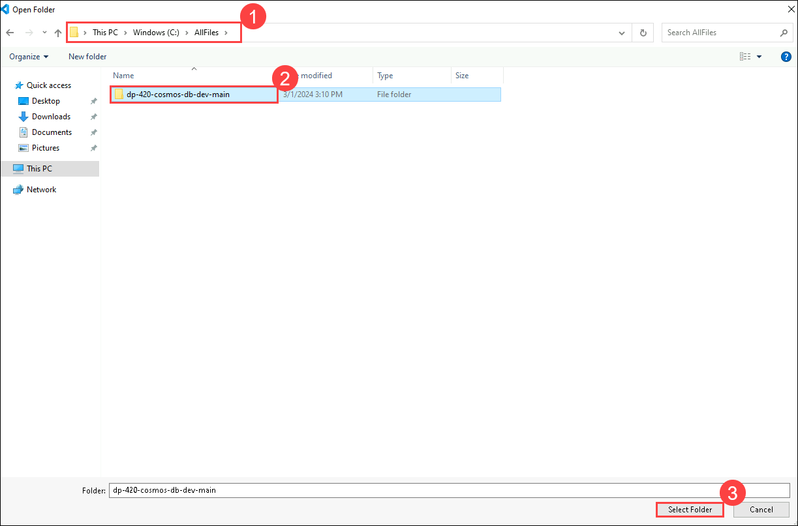
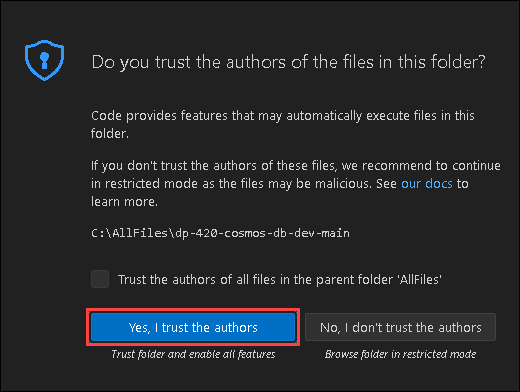
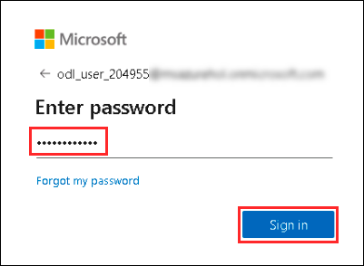
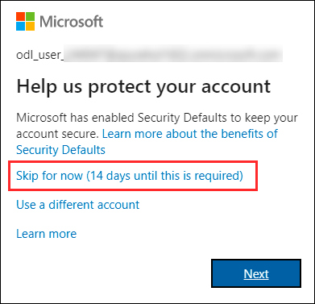
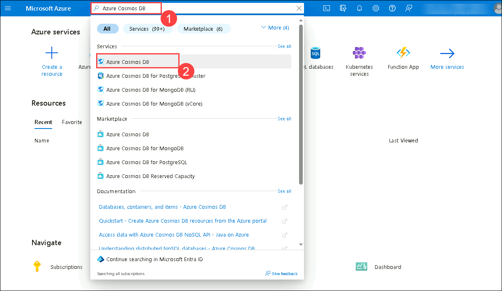
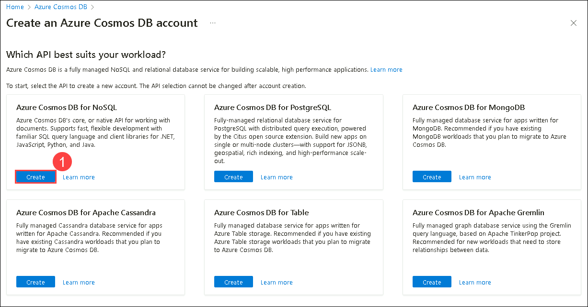
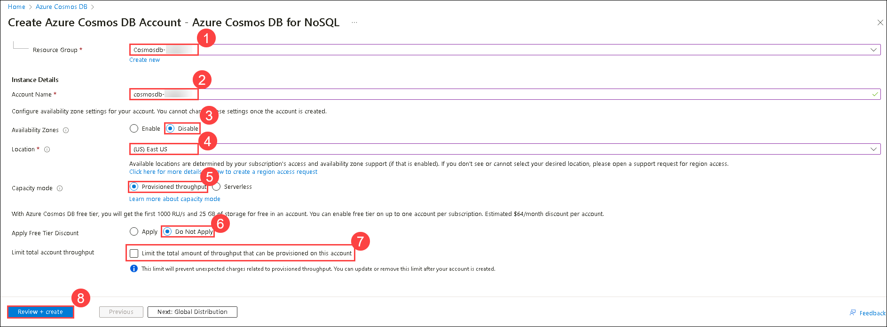

# Use Azure Monitor to analyze an Azure Cosmos DB for NoSQL account

## Lab scenario

Azure Monitor is a full-stack monitoring service in Azure that provides a complete set of features to monitor Azure resources. Azure Cosmos DB creates monitoring data using Azure Monitor. Azure Monitor captures Cosmos DB's metrics and telemetry data.

In this lab, you'll run a simulated workload against Azure Cosmos DB containers and analyze how that workload affects the Azure Cosmos DB account.

## Lab objectives

In this lab, you will complete the following tasks:
- Task 1: Prepare your development environment.
- Task 2: Create an Azure Cosmos DB for NoSQL account.
- Task 3: Import the Microsoft.Azure.Cosmos and Newtonsoft.Json libraries into a .NET script.
- Task 4: Run a script to create the containers and the workload.
- Task 5: Use Azure Monitor to Analyze the Azure Cosmos DB account usage

## Estimated Timing: 30 minutes

## Exercise 1: Use Azure Monitor to analyze an Azure Cosmos DB SQL API account

### Task 1: Prepare your development environment

1. Start Visual Studio Code (the program icon is pinned to the Desktop).

   

2. Select the **Extension (1)** icon from the left pane. Enter **C# (2)** in the search bar select the **extension (3)** that shows up and finally select **Install (4)** on the extension. 

    

3. Select the **file** option on the top left of the screen, from the pane options, select **Open Folder** and navigate to **C:\AllFiles**.

4. Select the folder **dp-420-cosmos-db-dev-main** and click on **Select Folder**.

    

    >**Note:** On **Do you trust the authors of the files in this folder?** pop-up, select **Yes, I trust the authors**.

      

### Task 2: Create an Azure Cosmos DB for NoSQL account

Azure Cosmos DB is a cloud-based NoSQL database service that supports multiple APIs. When provisioning an Azure Cosmos DB account for the first time, you will select which of the APIs you want the account to support (for example, **Mongo API** or **NoSQL API**). Once the Azure Cosmos DB for NoSQL account is done provisioning, you can retrieve the endpoint and key and use them to connect to the Azure Cosmos DB for NoSQL account using the Azure SDK for .NET or any other SDK of your choice.

1. Inside the LabVM, double-click on the **Azure Portal** shortcut.

    

1. On the **Sign-in into Microsoft Azure** tab you will see the login screen, in that enter the following email/username and then click on **Next**. 
   * Email/Username: <inject key="AzureAdUserEmail"></inject>
   
     
     
1. Now enter the following password and click on **Sign in**.
   * Password: <inject key="AzureAdUserPassword"></inject>
   
     
     
        >**Note:** If you see the **Help us protect your account** dialog box, then select the **Skip for now** option.

        
  
1. If you see the pop-up **Stay Signed in?**, click No

1. If you see the pop-up **You have free Azure Advisor recommendations!**, close the window to continue the lab.

1. If a **Welcome to Microsoft Azure** popup window appears, click **Cancel** to skip the tour.

1. Search for *Azure Cosmos DB (1)*, select **Azure Cosmos DB (2)**.

     

1. Select **+ Create** in **Azure Cosmos DB** page.

     

1. In the Create an Azure Cosmos DB account page, select **Create** under the **Azure Cosmos DB for NoSQL** tab.

     

1. Within the **Create Azure Cosmos DB Account** pane, observe the **Basics** tab:

    | **Setting** | **Value** |
    | :--- | :--- |
    | **Subscription** | *Your existing Azure subscription* |
    | **Resource group** | **cosmosdb-<inject key="DeploymentID" enableCopy="false"/>** |
    | **Account Name** | **cosmosdb-<inject key="DeploymentID" enableCopy="false"/>** |
    | **Location** | *Choose any available region* |
    | **Capacity mode** | *Provisioned throughput* |
    | **Apply Free Tier Discount** | *`Do Not Apply`* |
    | **Limit the total amount of throughput that can be provisioned on this account** | *Uncheck* |

     

1. Click on **Review + Create** and after validation get Success click on **Create**.

1. Wait for the deployment task to complete before continuing with this task.

1. Click on **Go to resource** to go to the newly created **Azure Cosmos DB** account resource and navigate to the **Keys** pane under settings from the left menu.

1. This pane contains the connection details and credentials necessary to connect to the account from the SDK. Specifically:

    1. Record the value of the **URI** field. You'll use this **endpoint** value later in this exercise.

    1. Record the value of the **PRIMARY KEY** field by selecting the show primary key icon. You'll use this **key** value later in this exercise.

1. Minimize, but don't close your browser window. We'll come back to the Azure portal a few minutes after we start a background workload in the next steps.


### Task 3: Import the Microsoft.Azure.Cosmos and Newtonsoft.Json libraries into a .NET script

The .NET CLI includes an [add package][docs.microsoft.com/dotnet/core/tools/dotnet-add-package] command to import packages from a pre-configured package feed. A .NET installation uses NuGet as its default package feed.

1. In **Visual Studio Code**, in the **Explorer** pane, browse to the **25-monitor** folder.

1. Right-click on the **25-monitor** folder and then select **Open in Integrated Terminal** to open a new terminal instance.

    >**Note:** This command will open the terminal with the starting directory already set to the **25-monitor** folder.

1. Add the [Microsoft.Azure.Cosmos][nuget.org/packages/microsoft.azure.cosmos/3.22.1] package from NuGet by running the following command:

    ```
    dotnet add package Microsoft.Azure.Cosmos --version 3.22.1
    ```

1. Add the [Newtonsoft.Json][nuget.org/packages/Newtonsoft.Json/13.0.1] package from NuGet by running the following command:

    ```
    dotnet add package Newtonsoft.Json --version 13.0.1
    ```

### Task 4: Run a script to create the containers and the workload

We're now ready to run a workload to monitor its usage of the Azure Cosmos DB Account.  The script we'll be running, behind the scenes. This script will create three containers and load some data into those containers. The script will then run some SQL queries randomly to emulate multiple user applications hitting the Azure Cosmos DB account. 

1. In **Visual Studio Code**, in the **Explorer** pane, browse to the **25-monitor** folder.

1. Open the **Program.cs** code file.

1. Update the existing variable named **endpoint** with its value set to the **endpoint** of the Azure Cosmos DB account you created earlier.
  
    ```
    private static readonly string endpoint = "<cosmos-endpoint>";
    ```

    > &#128221; For example, if your endpoint is: **https&shy;://dp420.documents.azure.com:443/**, then the C# statement would be: **private static readonly string endpoint = "https&shy;://dp420.documents.azure.com:443/";**.

1. Update the existing variable named **key** with its value set to the **key** of the Azure Cosmos DB account you created earlier.

    ```
    private static readonly string key = "<cosmos-key>";
    ```

    > &#128221; For example, if your key is: **fDR2ci9QgkdkvERTQ==**, then the C# statement would be: **private static readonly string key = "fDR2ci9QgkdkvERTQ==";**.

1. Save the **Program.cs** file.

1. Return to the *Integrated Terminal*.

1. Build and run the project using the [dotnet run][docs.microsoft.com/dotnet/core/tools/dotnet-run] command:

    ```
    dotnet run
    ```
    > &#128221; The first part of this script will create the three containers, and load the data into them, this should take around 2 minutes. To emulate some rate-limiting events, the script then sets the provisioned throughput to 400 RU/s. You should then get the message ***Creating simulated background workload, wait 5-10 minutes and go to the next step of the exercise.***. Because Azure resources upload monitoring data to Azure monitor asynchronously, we need to wait a short period to start getting some diagnostics data in the Azure Monitor Metrics and Insights. After 5-10 minutes go to the next step. If you want, to collect additional diagnostic data, you do not have to stop the script after 5-10 minutes and just wait until the end of the lab to do so.

    > &#128221; You will notice a couple of warnings in yellow since the compiler detects that the script runs many operations synchronously and does not wait for a reply of the operations. You can ignore these warnings since that is the expected behaviour to run multiple SQL scripts simultaneously.

    >**Note**: Visual Studio Code might crash after running the above command, you can rerun the command and continue to the next task.

### Task 5: Use Azure Monitor to Analyze the Azure Cosmos DB account usage

In this part of the exercise, we'll go back to the browser and review some of the Azure Monitor Insight and Metric reports.

#### Subtask 1: Azure Monitor Metrics's reports

1. Go back to the opened browser window we minimized earlier. If you closed it, open a new one and go to your Azure Cosmos DB account page under [Azure Portal](portal.azure.com).

1. In the Azure Cosmos DB left-hand menu, under *Monitoring*, select **Metrics**. You'll notice that the **Scope** and **Metric Namespace** fields are prepopulated with the correct information. In the following steps, we'll take a look at a few **Metric** options and the *Add filter* and *Apply splitting* features.

1. By default, the *Metrics* section will show us diagnostic information for the last 24 hours. We need to get more granular to look at the metrics during the workload we created in the previous step. On the upper right-hand corner, select the button labeled ***Local time: Last 24 hours (Automatic)***, we'll then get a window with multiple radio button time range options.  Choose the radio button labeled **Last 30 minutes** and select the **Apply** button. If needed, you can get much more granular by choosing the *Custom* radio button and picking a start and end date and time. 

1. Now that we have a good time range for our diagnostic charts, let's take a look at some Metrics. We'll start with a common metric. From the *Metric* pulldown, choose **Total Request Units**. By default, this metric will be displayed as the total sum of RUs. Or, you can change the Aggregation pulldown to average or max. Once you check out those two aggregations, set it back to *Sum* for the following steps.

1. This metric gives us a good idea of how many request units have been used in our Azure Cosmos DB Account. However, our current chart, might not help us home in on an issue when we have multiple databases or containers in our account. Let's change that, let's review how our RU consumption was done by Database. In the menu under the char title, select **Apply splitting**, under the **Values** pulldown choose **DatabaseName**, and select anywhere on the chart to accept the changes. A **Split by = DatabaseName** button will now be placed right above the chart. 

1. Much better, now we know which database is doing most of the work. While this information is good, we have no idea which container is doing all the work.  Select the **Split by = DatabaseName** button to change the Split condition and choose **CollectionName** from the *Values* pulldown. Great, we now should have data for our **customer** and **salesOrder** collections. There's only one problem with this chart, the **salesOrder** collection exists in two databases **database-v2** and **database-v3**, so this value is an aggregation of that collection name in both databases.

1. It should be an easy fix, select the **Add filter** button, under the *Property* Pulldown choose **DatabaseName**, and under *Values* choose **database-V3**.

1. Let's look at two more metrics. We'll edit the existing chart, you can also create a new chart if you like. Above the chart, select the button with the *Azure Cosmos DB account name* and the **Total Request Unit** label. Choose **Total Requests** from the *Metric* pulldown, notice that the only aggregation available is *Count*.

1. Two key filters here can help us troubleshoot different types of issues. Let's add a filter with the Property **StatusCode** (notice that a similar filter with a different type of detail would be **Status**), for *Values* pick **200** and **429**. Change the Split to use StatusCode. Notice that there's a huge amount of 429, or rate limiting requests compared to status 200, successful requests. The 429 exceptions happened because the script was sending thousands of requests per second while we set the provisioned throughput to 400 RU/s. *This large number of 429 exceptions compared to successful requests, shouldn't be normal in a production environment. In a production environment, 429 exceptions should happen infrequently in a healthy Azure Cosmos DB account*.  You can also use **StautusCode** or **Status** *Properties* in a similar troubleshooting fashion against **Total Request Units**.

1. Let's keep on looking ot the **Total Request**, but lets change the split to **OperationType**.  This property will help us determine which read or write operations are doing the bulk of the work. Again, this property could be also used similarly against **Total Request Units**

1. Like we did with the **Total Request Units**, experiment with choosing different filters and splitting options. 

1. The final metric we'll look at in this exercise is the **normalised RU Consumption** metric. Change your split to **PartitionKeyRangeId**. This metric helps us identify which partition key range usage is warmer. The metric gives us the skew of throughput towards a partition key range. Go ahead and choose that Metric from the *Metric* pulldown. This chart should now show us a very unhealthy system, hitting a constant 100% **Normalied RU Consumption**.

> &#128221; If you would like to look at more than one chart at a time, click on the **+ New Chart** option above the chart name. 

> &#128221; While we can not directly save our metrics, you can create or use an existing dashboard and add this chart to it by clicking on the **Pin to dashboard** button on the upper right-hand corner of the chart.  Click on the button and choose the **Create new** tab, give it the name *DP-420 labs* and click on **Create and pin**. To view your private dashboards, you should go to the Portal Menu in the upper left-hand corner, and choose Dashboard from your Azure Resource options. The dashboard could take a few minutes to appear the first time.

> &#128221; One more way to share your chart is by clicking on the Share pulldown and downloading it as an Excel file or the Copy link option.

#### Subtask 2: Azure Monitor Insights reports

We might need to spend some time fine-tuning our Azure Monitor Metrics diagnostics reports.  Cosmos DB Insights provides a view of the overall performance, failures, and operational health of your Azure Cosmos DB resources. These Insight charts will be pre-built charts similar to the Metric ones. Let's take a look at some of them.

1. In the Azure Cosmos DB left-hand menu, under *Monitoring*, select **Insights**. You'll notice that there are multiple tabs from Overview to Management Options. We'll look at a few of these **Insight** charts. The first tab, the Overview tab, provides a summary of the most common charts you might use. For example, charts like, total request, Data and Index usage, 429 exceptions and Normalized RU consumption.  We saw most of these charts in the previous section.

1. Note on the top of the charts, on the **Time Range**, select either *15* or *30* minutes to evaluate the workload in this exercise.

1. On the upper right-hand corner of *each* chart, you'll notice an option to ***Open Metric Explorer***. Let's go ahead and select the  **Open Metric Explorer** option for the **Total Requests** chart. You'll notice that when you select this option will take you to the Metric reports we reviewed earlier. The advantage of opening the Metric Explorer is that a good portion of the chart has already been built for us.

1. Let's get back to the Insights page by selecting the **X** on the upper right of the Metric chart.

1. Select the Throughput Tab. These charts are good for pinpoint throughput issues. Pay close attention to the **Normalized RU Consumption (%) By PartitionKeyRangeID** chart, which can be used to detect hot partitions.

1. Select the Requests Tab. These charts are great for both analysing the number of limiting events the account has experienced (429 vs. 200) and reviewing the number of requests per operation type.  

1. Select the Storage Tab. These charts show us both the growth of our collections and the data and index usage.  

1. Select the System Tab. If your application was creating, deleting, or querying the account metadata frequently, it's possible to have 429 exceptions. These charts help us determine if frequent metadata access is the cause of our 429 exceptions. Additionally, we can determine the status of our metadata requests.  

#### Subtask 3: Azure Monitor Insights reports

1. If the Program is still running, go back to the Visual Studio Code Command Terminal.

1. Close the integrated terminal.

1. Close **Visual Studio Code**.

### Review

In this lab, you have completed:

- Prepared your development environment.
- Created an Azure Cosmos DB NoSQL API account.
- Imported the Microsoft.Azure.Cosmos and Newtonsoft.Json libraries into a .NET script.
- Ran a script to create the containers and the workload.
- Used Azure Monitor to Analyze the Azure Cosmos DB account usage

### You have successfully completed the lab
