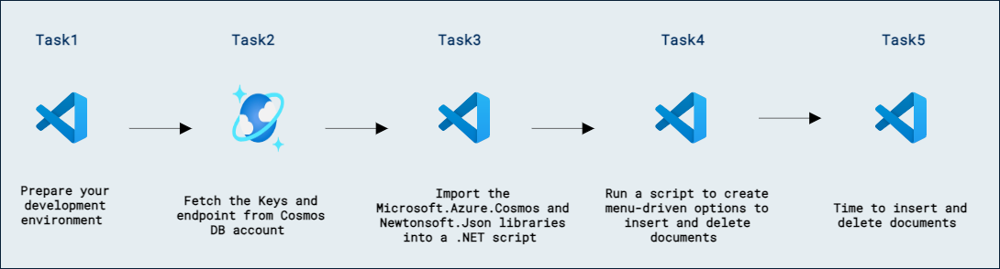

# Lab 11b - Azure Cosmos DB SQL API ソリューションを監視およびトラブルシューティングする

## ラボのシナリオ

Azure Cosmos DB は、さまざまな操作タイプで発生する可能性がある問題のトラブルシューティングに役立つ豊富なレスポンス コードを提供します。ポイントは、Azure Cosmos DB 向けのアプリを作成するときに適切なエラー処理を実装することです。

このラボでは、2 つのドキュメントのいずれかを挿入または削除できるメニュー形式のプログラムを作成します。このラボの主な目的は、一般的なレスポンス コードのいくつかをどのように使用し、それらをアプリのエラー処理コードでどのように扱うかを紹介することです。複数のレスポンス コードのエラー処理を実装しますが、実際に発生させる条件は 2 種類のみになります。また、エラー処理は複雑な動作を行わず、レスポンス コードに応じて画面にメッセージを表示するか、10 秒待機して操作をもう一度実行します。

## ラボの目標

このラボでは、次のタスクを完了します:
- タスク 1: 開発環境を準備します。
- タスク 2: Cosmos DB アカウントからキーとエンドポイントを取得します。
- タスク 3: Microsoft.Azure.Cosmos ライブラリを .NET スクリプトにインポートします。
- タスク 4: ドキュメントの挿入と削除を行うメニュー形式のオプションを作成するスクリプトを実行します。
- タスク 5: ドキュメントを挿入および削除します。

## 推定所要時間: 30 分

## アーキテクチャ図



## Exercise 1: Azure Cosmos DB SQL API SDK を使用してアプリケーションをトラブルシューティングする

### タスク 1: 開発環境を準備する

1. Visual Studio Code を起動します（プログラム アイコンがデスクトップにピン留めされています）。

2. 左側のペインから **Extension (1)** アイコンを選択します。検索バーに **C# (2)** と入力し、表示された **extension (3)** を選択して、最後に拡張機能の **Install (4)** をクリックします。

    

3. 画面左上の **file** オプションを選択し、ペインのオプションから **Open Folder** を選択して **C:\AllFiles** に移動します。

4. **dp-420-cosmos-db-dev** フォルダーを選択し、**Select Folder** をクリックします。


### タスク 2: Cosmos DB アカウントからキーとエンドポイントを取得する

Azure Cosmos DB SQL API アカウントでは、エンドポイントとキーを取得して、Azure SDK for .NET や任意の SDK を使用してアカウントに接続できます。

1. 新しい Web ブラウザー ウィンドウまたはタブで、Azure ポータル (``portal.azure.com``) に移動します。

1. まだサインインしていない場合は、サブスクリプションに関連付けられた Microsoft 資格情報でポータルにサインインします。

1. リソース グループ **DP-420-DeploymentID** を選択し、ラボ 1 で作成した **Cosmos DB** アカウントを選択します。

1. **Keys** ペインに移動します。

1. このペインには、SDK からアカウントに接続するために必要な接続情報と資格情報が含まれています。具体的には:

1. **URI** フィールドの値を記録します。この **endpoint** 値を後でこの演習で使用します。
    
1. **PRIMARY KEY** フィールドの値を記録します。この **key** 値を後でこの演習で使用します。

1. Web ブラウザー ウィンドウまたはタブを閉じます。


### タスク 3: Microsoft.Azure.Cosmos ライブラリを .NET スクリプトにインポートする

.NET CLI には、事前構成されたパッケージ フィードからパッケージをインポートするための [add package][docs.microsoft.com/dotnet/core/tools/dotnet-add-package] コマンドが含まれています。.NET のインストールでは、NuGet がデフォルトのパッケージ フィードとして使用されます。

1. **Visual Studio Code** の **Explorer** ペインで **26-sdk-troubleshoot** フォルダーに移動します。

1. **26-sdk-troubleshoot** フォルダーのコンテキスト メニューを開き、**Open in Integrated Terminal** を選択して新しいターミナルを開きます。

    > &#128221; このコマンドは、開始ディレクトリが既に **26-sdk-troubleshoot** フォルダーに設定された状態でターミナルを開きます。

1. 次のコマンドを実行して、NuGet から [Microsoft.Azure.Cosmos][nuget.org/packages/microsoft.azure.cosmos/3.22.1] パッケージを追加します。

    ```
    dotnet add package Microsoft.Azure.Cosmos --version 3.22.1
    ```

### タスク 4: ドキュメントの挿入および削除オプションを作成するメニューを実現するスクリプトを実行する

アプリケーションを実行する前に、Azure Cosmos DB アカウントへの接続を設定する必要があります。

1. **Visual Studio Code** の **Explorer** ペインで **26-sdk-troubleshoot** フォルダーに移動します。

1. **Program.cs** コード ファイルを開きます。

1. 既存の **endpoint** という名前の変数を、前に作成した Azure Cosmos DB アカウントの **endpoint** に設定します。
  
    ```
    private static readonly string endpoint = "<cosmos-endpoint>";
    ```

    > &#128221; たとえば、endpoint が **https&shy;://dp420.documents.azure.com:443/** の場合、C# の文は次のようになります: **private static readonly string endpoint = "https&shy;://dp420.documents.azure.com:443/";**.

1. 既存の **key** という名前の変数を、前に作成した Azure Cosmos DB アカウントの **key** に設定します。

    ```
    private static readonly string key = "<cosmos-key>";
    ```

    > &#128221; たとえば、key が **fDR2ci9QgkdkvERTQ==** の場合、C# の文は次のようになります: **private static readonly string key = "fDR2ci9QgkdkvERTQ==";**.

1. [dotnet run][docs.microsoft.com/dotnet/core/tools/dotnet-run] コマンドを使用してプロジェクトをビルドして実行します:

    ```
    dotnet run
    ```
    > &#128221; これは非常にシンプルなプログラムです。以下のように、あらかじめ定義されたドキュメントを挿入する 2 つのオプション、あらかじめ定義されたドキュメントを削除する 2 つのオプション、およびプログラムを終了するオプションの 5 つのオプションを表示します。

    >```
    >1) Add Document 1 with id = '0C297972-BE1B-4A34-8AE1-F39E6AA3D828'
    >2) Add Document 2 with id = 'AAFF2225-A5DD-4318-A6EC-B056F96B94B7'
    >3) Delete Document 1 with id = '0C297972-BE1B-4A34-8AE1-F39E6AA3D828'
    >4) Delete Document 2 with id = 'AAFF2225-A5DD-4318-A6EC-B056F96B94B7'
    >5) Exit
    >Select an option:
    >```

### タスク 5: ドキュメントを挿入および削除する時間

1. **1** を選択して **ENTER** を押し、最初のドキュメントを挿入します。プログラムは最初のドキュメントを挿入し、次のメッセージを返します。

    ```
    Insert Successful.
    Document for customer with id = '0C297972-BE1B-4A34-8AE1-F39E6AA3D828' Inserted.
    Press [ENTER] to continue
    ```

1. 再度 **1** を選択して **ENTER** を押し、最初のドキュメントを挿入します。今回は、プログラムは例外でクラッシュします。エラー スタックを確認すると、プログラムの失敗理由がわかります。エラー スタックから抽出したメッセージを見ると、処理されていない例外「Conflict (409)」が発生していることがわかります。

    ```
    Unhandled exception. Microsoft.Azure.Cosmos.CosmosException : Response status code does not indicate success: Conflict (409);
    ```

1. ドキュメントを挿入しているので、ドキュメント作成時に返される一般的な [create document status codes][/rest/api/cosmos-db/create-a-document#status-codes] の一覧を確認する必要があります。このコードの説明は、*新しいドキュメントに指定された ID が既存のドキュメントによって使用されている* です。これは、先ほど同じドキュメントを作成するメニュー オプションを実行したため、明らかです。

1. スタックをさらに掘り下げると、この例外は行 100 から呼び出され、さらにその行 100 は行 64 から呼び出されていることがわかります。

    ```
    at Program.CreateDocument1(Container Customer) in C:\Git\dp-420-cosmos-db-dev\26-sdk-troubleshoot\Program.cs:line 100   
   at Program.CompleteTaskOnCosmosDB(String consoleinputcharacter, Container container) in C:\Git\dp-420-cosmos-db-dev\26-sdk-troubleshoot\Program.cs:line 64
    ```

1. 行 100 を確認すると、予想どおりエラーは *CreateItemAsync* 操作によって発生していました。

    ```C#
        ItemResponse<customerInfo> response = await Customer.CreateItemAsync<customerInfo>(customer, new PartitionKey(customerID));
    ```

1. さらに行 100 から 103 を確認すると、このコードにエラー処理がまったくないことが明らかです。これを修正する必要があります。

    ```C#
        ItemResponse<customerInfo> response = await Customer.CreateItemAsync<customerInfo>(customer, new PartitionKey(customerID));
        Console.WriteLine("Insert Successful.");
        Console.WriteLine("Document for customer with id = '" + customerID + "' Inserted.");
    ```

1. エラー処理コードで何を行うべきかを決める必要があります。[create document status codes][/rest/api/cosmos-db/create-a-document#status-codes] を確認すると、この操作に対して考えられるすべてのステータス コードに対するエラー処理コードを作成できます。このラボでは、この一覧から 403 と 409 のステータス コードのみを考慮します。他のすべてのステータス コードは、システムのエラーメッセージを表示するだけにします。

    > &#128221; ここでは 403 の例外に対するエラー処理コードも実装しますが、このラボでは 403 の例外は発生させません。

1. **CompleteTaskOnCosmosDB** という名前の関数にエラー処理を追加しましょう。**Main** 関数の行 **45** にある **while** ループを見つけ、**CompleteTaskOnCosmosDB** の呼び出しをエラー処理コードで囲みます。行 **47** の **CompleteTaskOnCosmosDB** 文を以下のコードに置き換えます。この新しいコードで最初に注目すべき点は、**catch** で **CosmosException** 型の例外をキャッチしていることです。このクラスには **StatusCode** プロパティがあり、Azure Cosmos DB サービスからの要求完了ステータス コードを返します。**StatusCode** プロパティは **System.Net.HttpStatusCode** 型であり、この値を使用して .NET の [HTTP Status Code][dotnet/api/system.net.httpstatuscode] のフィールド名と比較できます。

    ```C#
        try
        {
            await CompleteTaskOnCosmosDB(consoleinputcharacter, CustomersDB_Customer_container);
        }
        catch (CosmosException e)
        {
                    switch (e.StatusCode.ToString())
                    {
                        case ("Conflict"):
                            Console.WriteLine("Insert Failed. Response Code (409).");
                            Console.WriteLine("Can not insert a duplicate partition key, customer with the same ID already exists."); 
                            break;
                        case ("Forbidden"):
                            Console.WriteLine("Response Code (403).");
                            Console.WriteLine("The request was forbidden to complete. Some possible reasons for this exception are:");
                            Console.WriteLine("Firewall blocking requests.");
                            Console.WriteLine("Partition key exceeding storage.");
                            Console.WriteLine("Non-data operations are not allowed.");
                            break;
                        default:
                            Console.WriteLine(e.Message);
                            break;
                    }

        }

    ```

1. ファイルを保存し、クラッシュしたのでメニュー プログラムを再度実行します。次のコマンドを実行してください:

    ```
    dotnet run
    ```
 
1. 再度 **1** を選択して **ENTER** を押し、最初のドキュメントを挿入します。今度はクラッシュせず、何が起きたのかがよりユーザー向けに表示されます。

    ```
    Insert Failed. 
    Response Code (409).
    Can not insert a duplicate partition key, customer with the same ID already exists.
    ```

1. このコードでは *403* と *409* の例外に対するエラー処理を追加しました。次に、一般的な通信系の例外に対するコードも追加します。一般的な通信系の例外には、*429*、*503*、*408* の 3 つがあります。これはそれぞれ Too Many Requests、Service Unavailable、Request Timeout に対応します。行 *66* 付近には **default** 文があるはずなので、前の **break;** の直後、**default** 文の直前に次のコードを追加します。このコードは通信例外を検出した場合に 10 秒待機し、もう一度ドキュメントの挿入を試行します。次のコードを追加します:

    ```C#
                        case ("TooManyRequests"):
                        case ("ServiceUnavailable"):
                        case ("RequestTimeout"):
                            // Check if the issues are related to connectivity and if so, wait 10 seconds to retry.
                            await Task.Delay(10000); // Wait 10 seconds
                            try
                            {
                                Console.WriteLine("Try one more time...");
                                await CompleteTaskOnCosmosDB(consoleinputcharacter, CustomersDB_Customer_container);
                            }
                            catch (CosmosException e2)
                            {
                                Console.WriteLine("Insert Failed. " + e2.Message);
                                Console.WriteLine("Can not insert a duplicate partition key, Connectivity issues encountered.");
                                break;
                            }
                            break;
    ```

    > &#128221; ここでは 429、503、408 の例外に対処するコードを追加しますが、このラボではこれらのタイプの例外を実際に発生させません。

1. **Main** 関数は次のようになります。

    ```C#
        public static async Task Main(string[] args)
        {

            CosmosClient client = new CosmosClient(connectionString,new CosmosClientOptions() { AllowBulkExecution = true, MaxRetryAttemptsOnRateLimitedRequests = 50, MaxRetryWaitTimeOnRateLimitedRequests = new TimeSpan(0,1,30)});

            Console.WriteLine("Creating Azure Cosmos DB Databases and containers");

            Database CustomersDB = await client.CreateDatabaseIfNotExistsAsync("CustomersDB");
            Container CustomersDB_Customer_container = await CustomersDB.CreateContainerIfNotExistsAsync(id: "Customer", partitionKeyPath: "/id", throughput: 400);

            Console.Clear();
            Console.WriteLine("1) Add Document 1 with id = '0C297972-BE1B-4A34-8AE1-F39E6AA3D828'");
            Console.WriteLine("2) Add Document 2 with id = 'AAFF2225-A5DD-4318-A6EC-B056F96B94B7'");
            Console.WriteLine("3) Delete Document 1 with id = '0C297972-BE1B-4A34-8AE1-F39E6AA3D828'");
            Console.WriteLine("4) Delete Document 2 with id = 'AAFF2225-A5DD-4318-A6EC-B056F96B94B7'");
            Console.WriteLine("5) Exit");
            Console.Write("\r\nSelect an option: ");
    
            string consoleinputcharacter;
        
            while((consoleinputcharacter = Console.ReadLine()) != "5") 
            {
                 try
                 {
                     await CompleteTaskOnCosmosDB(consoleinputcharacter, CustomersDB_Customer_container);
                 }
                 catch (CosmosException e)
                 {
                     switch (e.StatusCode.ToString())
                     {
                        case ("Conflict"):
                            Console.WriteLine("Insert Failed. Response Code (409).");
                            Console.WriteLine("Can not insert a duplicate partition key, customer with the same ID already exists."); 
                            break;
                        case ("Forbidden"):
                            Console.WriteLine("Response Code (403).");
                            Console.WriteLine("The request was forbidden to complete. Some possible reasons for this exception are:");
                            Console.WriteLine("Firewall blocking requests.");
                            Console.WriteLine("Partition key exceeding storage.");
                            Console.WriteLine("Non-data operations are not allowed.");
                            break;
                        case ("TooManyRequests"):
                        case ("ServiceUnavailable"):
                        case ("RequestTimeout"):
                            // Check if the issues are related to connectivity and if so, wait 10 seconds to retry.
                            await Task.Delay(10000); // Wait 10 seconds
                            try
                            {
                                Console.WriteLine("Try one more time...");
                                await CompleteTaskOnCosmosDB(consoleinputcharacter, CustomersDB_Customer_container);
                            }
                            catch (CosmosException e2)
                            {
                                Console.WriteLine("Insert Failed. " + e2.Message);
                                Console.WriteLine("Can not insert a duplicate partition key, Connectivity issues encountered.");
                                break;
                            }
                            break;
                        default:
                            Console.WriteLine(e.Message);
                            break;
                     }
                }
                

                Console.WriteLine("Choose an action:");
                Console.WriteLine("1) Add Document 1 with id = '0C297972-BE1B-4A34-8AE1-F39E6AA3D828'");
                Console.WriteLine("2) Add Document 2 with id = 'AAFF2225-A5DD-4318-A6EC-B056F96B94B7'");
                Console.WriteLine("3) Delete Document 1 with id = '0C297972-BE1B-4A34-8AE1-F39E6AA3D828'");
                Console.WriteLine("4) Delete Document 2 with id = 'AAFF2225-A5DD-4318-A6EC-B056F96B94B7'");
                Console.WriteLine("5) Exit");
                Console.Write("\r\nSelect an option: ");
            }
        }
    ```

1. **CreateDocument2** 関数も上記の変更によって修正されることに注意してください。

1. 最後に、**DeleteDocument1** と **DeleteDocument2** の関数も、**CreateDocument1** 関数と同様のエラー処理コードに置き換える必要があります。これらの関数の唯一の違いは、**CreateItemAsync** の代わりに **DeleteItemAsync** を使用している点であり、[deletes status codes][/rest/api/cosmos-db/delete-a-document] は挿入時のステータス コードとは異なる点です。削除では、ドキュメントが見つからないことを示す **404** ステータス コードのみが重要です。**Main** 関数の **default** ケースの上に、次のコードを追加して **CompleteTaskOnCosmosDB** のエラー処理を更新します:

    ```C#
                    case ("NotFound"):
                        Console.WriteLine("Delete Failed. Response Code (404).");
                        Console.WriteLine("Can not delete customer, customer not found.");
                        break;         
    ```

1. すべての関数の修正が完了したら、メニューのすべてのオプションを何度かテストし、例外が発生したときにクラッシュせずメッセージを返すことを確認します。アプリがクラッシュする場合は、エラーを修正して次のコマンドを再実行します:

    ```
    dotnet run
    ```


1. 覗かないでください。修正が完了したら、`Main` のコードは次のようになっているはずです。

    ```C#
        public static async Task Main(string[] args)
        {
            CosmosClient client = new CosmosClient(connectionString,new CosmosClientOptions() { AllowBulkExecution = true, MaxRetryAttemptsOnRateLimitedRequests = 50, MaxRetryWaitTimeOnRateLimitedRequests = new TimeSpan(0,1,30)});

            Console.WriteLine("Creating Azure Cosmos DB Databases and containers");

            Database CustomersDB = await client.CreateDatabaseIfNotExistsAsync("CustomersDB");
            Container CustomersDB_Customer_container = await CustomersDB.CreateContainerIfNotExistsAsync(id: "Customer", partitionKeyPath: "/id", throughput: 400);

            Console.Clear();
            Console.WriteLine("1) Add Document 1 with id = '0C297972-BE1B-4A34-8AE1-F39E6AA3D828'");
            Console.WriteLine("2) Add Document 2 with id = 'AAFF2225-A5DD-4318-A6EC-B056F96B94B7'");
            Console.WriteLine("3) Delete Document 1 with id = '0C297972-BE1B-4A34-8AE1-F39E6AA3D828'");
            Console.WriteLine("4) Delete Document 2 with id = 'AAFF2225-A5DD-4318-A6EC-B056F96B94B7'");
            Console.WriteLine("5) Exit");
            Console.Write("\r\nSelect an option: ");
    
            string consoleinputcharacter;
        
            while((consoleinputcharacter = Console.ReadLine()) != "5") 
            {
                    try
                    {
                        await CompleteTaskOnCosmosDB(consoleinputcharacter, CustomersDB_Customer_container);
                    }
                    catch (CosmosException e)
                    {
                        switch (e.StatusCode.ToString())
                        {
                            case ("Conflict"):
                                Console.WriteLine("Insert Failed. Response Code (409).");
                                Console.WriteLine("Can not insert a duplicate partition key, customer with the same ID already exists."); 
                                break;
                            case ("Forbidden"):
                                Console.WriteLine("Response Code (403).");
                                Console.WriteLine("The request was forbidden to complete. Some possible reasons for this exception are:");
                                Console.WriteLine("Firewall blocking requests.");
                                Console.WriteLine("Partition key exceeding storage.");
                                Console.WriteLine("Non-data operations are not allowed.");
                                break;
                            case ("TooManyRequests"):
                            case ("ServiceUnavailable"):
                            case ("RequestTimeout"):
                                // Check if the issues are related to connectivity and if so, wait 10 seconds to retry.
                                await Task.Delay(10000); // Wait 10 seconds
                                try
                                {
                                    Console.WriteLine("Try one more time...");
                                    await CompleteTaskOnCosmosDB(consoleinputcharacter, CustomersDB_Customer_container);
                                }
                                catch (CosmosException e2)
                                {
                                    Console.WriteLine("Insert Failed. " + e2.Message);
                                    Console.WriteLine("Can not insert a duplicate partition key, Connectivity issues encountered.");
                                    break;
                                }
                                break;    
                            case ("NotFound"):
                                Console.WriteLine("Delete Failed. Response Code (404).");
                                Console.WriteLine("Can not delete customer, customer not found.");
                                break; 
                            default:
                                Console.WriteLine(e.Message);
                                break;
                        }

                    }

                Console.WriteLine("Choose an action:");
                Console.WriteLine("1) Add Document 1 with id = '0C297972-BE1B-4A34-8AE1-F39E6AA3D828'");
                Console.WriteLine("2) Add Document 2 with id = 'AAFF2225-A5DD-4318-A6EC-B056F96B94B7'");
                Console.WriteLine("3) Delete Document 1 with id = '0C297972-BE1B-4A34-8AE1-F39E6AA3D828'");
                Console.WriteLine("4) Delete Document 2 with id = 'AAFF2225-A5DD-4318-A6EC-B056F96B94B7'");
                Console.WriteLine("5) Exit");
                Console.Write("\r\nSelect an option: ");
            }
        }
    ```

## 結論

最も経験の浅い開発者でも、すべてのコードに適切なエラー処理を追加する必要があることは知っています。このコードのエラー処理はシンプルですが、Azure Cosmos DB の例外コンポーネントについて基本を理解し、堅牢なエラー処理ソリューションを作成するための土台になったはずです。


[code.visualstudio.com/docs/getstarted]: https://code.visualstudio.com/docs/getstarted/tips-and-tricks
[docs.microsoft.com/dotnet/core/tools/dotnet-add-package]: https://docs.microsoft.com/dotnet/core/tools/dotnet-add-package
[docs.microsoft.com/dotnet/core/tools/dotnet-run]: https://docs.microsoft.com/dotnet/core/tools/dotnet-run
[nuget.org/packages/microsoft.azure.cosmos/3.22.1]: https://www.nuget.org/packages/Microsoft.Azure.Cosmos/3.22.1
[/rest/api/cosmos-db/create-a-document#status-codes]:https://docs.microsoft.com/rest/api/cosmos-db/create-a-document#status-codes
[dotnet/api/system.net.httpstatuscode]:https://docs.microsoft.com/dotnet/api/system.net.httpstatuscode?view=net-6.0
[/rest/api/cosmos-db/delete-a-document]:https://docs.microsoft.com/rest/api/cosmos-db/delete-a-document#status-codes

### レビュー

このラボでは、次のことを完了しました:

- 開発環境を準備しました。
- Cosmos DB アカウントからキーとエンドポイントを取得しました。
- Microsoft.Azure.Cosmos ライブラリを .NET スクリプトにインポートしました。
- ドキュメントの挿入と削除を行うメニュー形式のオプションを作成するスクリプトを実行しました。
- ドキュメントを挿入および削除しました。

### ラボを正常に完了しました
