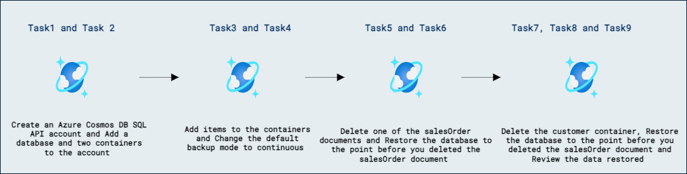

# Lab 11c - Azure Cosmos DB SQL API ソリューションを監視およびトラブルシューティングする

## ラボのシナリオ

Azure はデータの暗号化バックアップを自動的に取得します。これらのバックアップは **定期バックアップ (Periodic)** と **継続バックアップ (Continuous)** の 2 つのモードで取得されます。

このラボでは、継続バックアップ モードを使用して `バックアップ` と `リストア` を行います。最初に Azure Cosmos DB アカウントを作成します。次に 2 つのコンテナーを作成し、いくつかのドキュメントを追加します。その後、これらのコンテナー内のいくつかのドキュメントを更新します。最後に、各削除前のポイントまでアカウントをリストアします。

## ラボの目的

このラボでは、次のタスクを完了します:
- タスク 1: Azure Cosmos DB SQL API アカウントを作成します。
- タスク 2: アカウントにデータベースと 2 つのコンテナーを追加します。
- タスク 3: コンテナーにアイテムを追加します。
- タスク 4: デフォルトのバックアップ モードを継続に変更します。
- タスク 5: salesOrder ドキュメントの 1 つを削除します。
- タスク 6: salesOrder ドキュメントを削除する前のポイントまでデータベースを復元します。
- タスク 7: customer コンテナーを削除します。
- タスク 8: salesOrder ドキュメントを削除する前のポイントまでデータベースを復元します。
- タスク 9: 復元されたデータを確認します。

## 所要時間の目安: 30 分

## アーキテクチャ図



## 演習 1: リカバリ ポイントからデータベースまたはコンテナーを復元する

### タスク 1: Azure Cosmos DB SQL API アカウントを作成する

Azure Cosmos DB は、複数の API をサポートするクラウドベースの NoSQL データベース サービスです。Azure Cosmos DB アカウントを初めて作成するときは、サポートする API（たとえば **Mongo API** または **SQL API**）を選択します。Azure Cosmos DB SQL API アカウントのプロビジョニングが完了したら、エンドポイントとキーを取得できます。エンドポイントとキーを使用して Azure Cosmos DB SQL API アカウントにプログラムから接続します。Azure SDK for .NET や他の SDK の接続文字列にエンドポイントとキーを使用します。

1. 新しい Web ブラウザー ウィンドウまたはタブで Azure ポータル (``portal.azure.com``) に移動します。

1. サブスクリプションに関連付けられた Microsoft 資格情報を使用してポータルにサインインします。

1. **Azure サービス** カテゴリで **Create a resource** を選択し、**Azure Cosmos DB** を選択します。

    > &#128161; 代替方法として、**&#8801;** メニューを展開し、**すべてのサービス** を選択します。**データベース** カテゴリで **Azure Cosmos DB** を選択し、**Create** を選択します。

1. **Select API option** ペインで、**Azure Cosmos DB for NoSQL** セクションの **Create** オプションを選択します。

1. **Create Azure Cosmos DB Account** ペインで、**Basics** タブを確認します。

    | **設定** | **値** |
    | --- | --- |
    | **Subscription** | *既存の Azure サブスクリプション* |
    | **Resource group** | *DP-420-DeploymentID* |
    | **Account Name** | *グローバルに一意の名前を入力* |
    | **Location** | *使用可能なリージョンを選択* |
    | **Capacity mode** | *プロビジョニングされたスループット* |
    | **Apply Free Tier Discount** | *適用しない* |
    | **Global Distribution** TAB | マルチリージョン書き込みを無効にする |

    >**注**: DeploymentID は各環境に関連付けられた一意の ID です。環境の詳細ページで値を確認できます。
    
    >&#128221;**注**: Azure Cosmos DB アカウントの作成時に、**Backup Policy** タブで **Continuous** モードを有効にできます。このラボでは、アカウント作成時に機能を有効にするか、作成後に以下のオプション セクションで有効にするかを選択できます。**アカウント作成後に機能を有効にすると、5 分以上かかる場合があります。**
    
    > &#128221;**注**: *[マルチリージョン書き込みアカウントは現在、継続バックアップではサポートされていません][/azure/cosmos-db/continuous-backup-restore-introduction]*。
    
    > &#128221; **注**: ラボ環境では新規リソース グループの作成が制限されている場合があります。その場合は、既存の事前作成されたリソース グループを使用してください。
   
1. **Next: Networking** をクリックし、Networking ブレードは既定のままにします。**Next: Backup Policy** をクリックします。

1. Backup Policy ブレードで Backup policy を **Continuous (7 days)** に選択します。

1. **Review + Create** をクリックし、検証が成功したら **Create** をクリックします。

### タスク 2: アカウントにデータベースと 2 つのコンテナーを追加する

データベースとコンテナーを作成しましょう。

1. Azure ポータルで Azure Cosmos DB アカウント ページに移動します。

1. **Data Explorer** ペインで **New Container** を展開し、**New Database** を選択します。

1. **New Database** ポップアップで、次の設定値を入力し、**OK** を選択します。

    | **設定** | **値** |
    | --- | --- |
    | **Database id** | *`Sales`* |
    | **Provision throughput** | *選択しない* |

1. **Data Explorer** ペインで **New Container** を選択します。

1. **New Container** ポップアップで、次の設定値を入力し、**OK** を選択します。

    | **設定** | **値** |
    | --- | --- |
    | **Database id** | *既存を使用* 名前: *Sales* |
    | **Container id** | *`customer`* |
    | **Partition key** | *`/id`* |
    | **Container throughput (400 - unlimited RU/s)** | *手動* スループット: *400* |

1. **Data Explorer** ペインで **New Container** を選択します。

1. **New Container** ポップアップで、次の設定値を入力し、**OK** を選択します。

    | **設定** | **値** |
    | --- | --- |
    | **Database id** | *既存を使用* 名前: *Sales* |
    | **Container id** | *`salesOrder`* |
    | **Partition key** | *`/id`* |
    | **Container throughput (400 - unlimited RU/s)** | *手動* スループット: *400* |

### タスク 3: コンテナーにアイテムを追加する

これらのコンテナーにドキュメントを追加します。

1. Azure ポータルで Azure Cosmos DB アカウント ページに移動します。

2. **Data Explorer** で、**customer** コンテナーに次の 2 つのドキュメントを追加します。

3. **customer** コンテナーで **Items** を選択し、**New Items** をクリックしてから **Save** をクリックします。

```
  {
    "id": "0012D555-C7DE-4C4B-B4A4-2E8A6B8E1161",
    "title": "",
    "firstName": "Franklin",
    "lastName": "Ye",
    "emailAddress": "franklin9@adventure-works.com",
    "phoneNumber": "1 (11) 500 555-0139",
    "creationDate": "2014-02-05T00:00:00",
    "addresses": [
      {
        "addressLine1": "1796 Westbury Dr.",
        "addressLine2": "",
        "city": "Melton",
        "state": "VIC",
        "country": "AU",
        "zipCode": "3337"
      }
    ],
    "password": {
      "hash": "GQF7qjEgMl3LUppoPfDDnPtHp1tXmhQBw0GboOjB8bk=",
      "salt": "12C0F5A5"
    }
  }
```

4. **Items** を選択し、**New Items** をクリックしてから **Save** をクリックします。

```
  {
    "id": "001C8C0B-9B91-47A5-A198-8770E60CFF38",
    "title": "",
    "firstName": "Victor",
    "lastName": "Moreno",
    "emailAddress": "victor8@adventure-works.com",
    "phoneNumber": "1 (11) 500 555-0134",
    "creationDate": "2011-10-09T00:00:00",
    "addresses": [
      {
        "addressLine1": "Parkstr 42",
        "addressLine2": "",
        "city": "Hamburg",
        "state": "HH ",
        "country": "DE",
        "zipCode": "20354"
      }
    ],
    "password": {
      "hash": "n8l+wY/klP/hwTC3wSr8BLMA9tm3tGTyDsCgG/Q9EYI=",
      "salt": "AC22BC8C"
    }
  }
```
5. **Data Explorer** で、**salesOrder** コンテナーに次の 3 つのドキュメントを追加します。

6. **Items** を選択し、**New Items** をクリックしてから **Save** をクリックします。

```
  {
    "id": "000C23D8-B8BC-432E-9213-6473DFDA2BC5",
    "customerId": "0012D555-C7DE-4C4B-B4A4-2E8A6B8E1161",
    "orderDate": "2014-02-16T00:00:00",
    "shipDate": "2014-02-23T00:00:00",
    "details": [
      {
        "sku": "BK-R64Y-42",
        "name": "Road-550-W Yellow, 42",
        "price": 1120.49,
        "quantity": 1
      },
      {
        "sku": "HL-U509-B",
        "name": "Sport-100 Helmet, Blue",
        "price": 34.99,
        "quantity": 1
      }
    ]
  }
  ```

7. **Items** を選択し、**New Items** をクリックしてから **Save** をクリックします。

  ```
  {
    "id": "001676F7-0B70-400B-9B7D-24BA37B97F70",
    "customerId": "001C8C0B-9B91-47A5-A198-8770E60CFF38",
    "orderDate": "2013-06-02T00:00:00",
    "shipDate": "2013-06-09T00:00:00",
    "details": [
      {
        "sku": "HL-U509-R",
        "name": "Sport-100 Helmet, Red",
        "price": 34.99,
        "quantity": 1
      },
      {
        "sku": "BK-T79Y-50",
        "name": "Touring-1000 Yellow, 50",
        "price": 2384.07,
        "quantity": 1
      }
    ]
  }
  ```

8. **Items** を選択し、**New Items** をクリックしてから **Save** をクリックします。

  ```
  {
    "id": "0019092E-BD25-48F5-8050-7051B2655BC5",
    "customerId": "0012D555-C7DE-4C4B-B4A4-2E8A6B8E1161",
    "orderDate": "2013-09-14T00:00:00",
    "shipDate": "2013-09-21T00:00:00",
    "details": [
      {
        "sku": "TI-T723",
        "name": "Touring Tire",
        "price": 28.99,
        "quantity": 1
      },
      {
        "sku": "BK-T79Y-50",
        "name": "Touring-1000 Yellow, 50",
        "price": 2384.07,
        "quantity": 1
      },
      {
        "sku": "TT-T092",
        "name": "Touring Tire Tube",
        "price": 4.99,
        "quantity": 1
      }
    ]
  }
```

### タスク 4: デフォルトのバックアップ モードを継続に変更する（アカウント作成時に有効にしていない場合）

*Azure Cosmos DB アカウントの作成時にこの機能を有効にしていない場合は、ここで有効にする必要があります。* バックアップ モードの変更は簡単で、1 つの設定を **On** にするだけです。今すぐ変更しましょう。

1. Azure ポータルで Azure Cosmos DB アカウント ページに移動します。

1. **Settings** セクションで **Features** を選択します。

1. **Continuous Backup** オプションを選択して機能を有効にします。このオプションを選択するとウィンドウが表示されるので、**Enable** ボタンを選択します。機能の有効化には 5 分以上かかる場合があります。

    > &#128221; *[マルチリージョン書き込みアカウントは現在、継続バックアップではサポートされていません][/azure/cosmos-db/continuous-backup-restore-introduction]*。Azure Cosmos DB アカウントを作成したときにマルチリージョン書き込みを無効にしていない場合は、今すぐ無効にする必要があります。さもないと継続バックアップ機能の有効化に失敗します。**Replicate data globally** の *Settings* セクションでマルチリージョン書き込みを無効にできます。

### タスク 5: salesOrder ドキュメントの 1 つを削除する

1. **Data Explorer** で次のクエリを実行して現在の日付と時刻を取得します。そのタイムスタンプをメモ帳にコピーします。このタイムスタンプは UTC である必要があります。

    ```
    SELECT GetCurrentDateTime ()
    ```

1. **Data Explorer** で **id** が `0019092E-BD25-48F5-8050-7051B2655BC5` の **salesOrder** ドキュメントを見つけます。ドキュメントを削除し、そのドキュメントが存在しなくなったことを確認します。

### タスク 6: salesOrder ドキュメントを削除する前のポイントまでデータベースを復元する

1. Azure ポータルで Azure Cosmos DB アカウント ページに移動します。

1. **Settings** セクションで **Point in Time Restore** を選択します。次の設定を使用し、**Submit** をクリックします。

    | **設定** | **値** |
    | --- | --- |
    | **Restore Point (UTC)** | 日付と時刻を適切に変換します。時刻は AM/PM 形式で指定する必要があります |
    | **Location** | *使用可能な場所を選択* |
    | **復元するリソースを選択します** | *復元するデータベース/コンテナーを選択* |
    | **復元するリソース** | *salesOrder* |
    | **Resource Group** | _DP-420-DeploymentID_ |
    | **復元先アカウント** | *新しい* Azure Cosmos DB アカウント名を選択 |

    > &#128221; Azure Cosmos DB の復元では、既存のアカウントに上書きして復元することは ***決して*** なく、常に新しい Azure Cosmos DB アカウントを作成する必要があります。

    > &#128221; データベース全体やアカウント全体を復元することもできますが、本番環境ではデータベースが非常に大きくなる可能性があります。多くの場合、必要なコンテナーやデータベースだけを復元した方が速い場合があります。

1. この復元には 15 分以上かかる場合があります。次のセクションに進み、この復元をバックグラウンドで実行したままにします。

### タスク 7: customer コンテナーを削除する

1. **Data Explorer** で次のクエリを実行して現在の日付と時刻を取得します。そのタイムスタンプをメモ帳にコピーします。

    ```
    SELECT GetCurrentDateTime ()
    ```

1. **customer** コンテナーを削除します。

### タスク 8: salesOrder ドキュメントを削除する前のポイントまでデータベースを復元する

1. Azure ポータルで Azure Cosmos DB アカウント ページに移動します。

1. **Settings** セクションで **Point in Time Restore** を選択します。次の設定を使用します。

    | **設定** | **値** |
    | --- | --- |
    | **Location** | *使用可能な場所を選択* |
    | **Restore Point (UTC)** | 日付と時刻を適切に変換します。時刻は AM/PM 形式で指定する必要があります |
    | **復元するリソースを選択します** | *復元するデータベース/コンテナーを選択* |
    | **復元するリソース** | *`customer`* |
    | **復元先アカウント** | *新しい* Azure Cosmos DB アカウント名を選択 |

    > &#128221; Azure Cosmos DB の復元では、既存のアカウントに上書きして復元することは ***決して*** なく、常に新しい Azure Cosmos DB アカウントを作成する必要があります。

    > &#128221; データベース全体やアカウント全体を復元することもできますが、本番環境ではデータベースが非常に大きくなる可能性があります。多くの場合、必要なコンテナーやデータベースだけを復元した方が速い場合があります。

1. この復元には 15 分以上かかる場合があります。次のセクションに進み、この復元をバックグラウンドで実行したままにします。

### タスク 9: 復元されたデータを確認する

復元には、データベースのサイズやその他の要因に応じて時間がかかる場合があります。Azure Cosmos DB アカウントの復元が完了したら:

1. 最初の復元では、3 番目のドキュメントが回復されていることを確認します。

1. 2 番目の復元では、customer テーブルが復元されているはずです。

## クリーンアップ

1. アカウント復元によって作成された 2 つの新しい Azure Cosmos DB アカウントを削除します。

1. Sales データベースを削除し、必要に応じて元の Azure Cosmos DB アカウントを削除します。

### レビュー

このラボでは、次のことを完了しました:

- Azure Cosmos DB SQL API アカウントを作成しました。
- アカウントにデータベースと 2 つのコンテナーを追加しました。
- コンテナーにアイテムを追加しました。
- デフォルトのバックアップ モードを継続に変更しました。
- salesOrder ドキュメントの 1 つを削除しました。
- salesOrder ドキュメントを削除する前のポイントまでデータベースを復元しました。
- customer コンテナーを削除しました。
- salesOrder ドキュメントを削除する前のポイントまでデータベースを復元しました。
- 復元されたデータを確認しました。

### ラボを正常に完了しました
