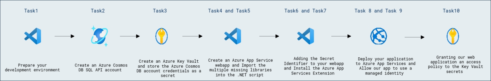
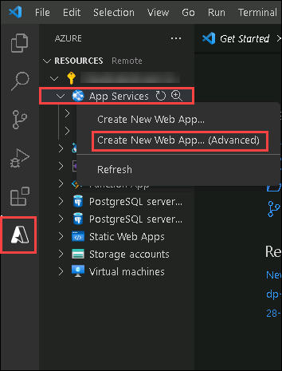

# Lab 11d - Azure Cosmos DB for NoSQL ソリューションの監視とトラブルシューティング

## ラボシナリオ

Azure Cosmos DB アカウントの接続コードをアプリケーションに追加するのは、アカウントの URI とキーを指定するだけで簡単です。この機密情報はアプリケーション コードにハードコーディングされることがあります。しかし、アプリケーションを Azure App Service にデプロイする場合、接続情報を Azure Key Vault に保存できます。

このラボでは、Azure Cosmos DB アカウントの接続文字列を Azure Key Vault に暗号化して保存します。その後、Azure Key Vault から資格情報を取得する Azure App Service Web アプリを作成します。アプリケーションはこれらの資格情報を使用して Azure Cosmos DB アカウントに接続し、Cosmos DB アカウントのコンテナーにドキュメントを作成し、そのステータスを Web ページに返します。

## ラボの目的

このラボでは、以下のタスクを完了します:
- Task 1: 開発環境を準備します。
- Task 2: Azure Cosmos DB for NoSQL アカウントを作成します。
- Task 3: Azure Key Vault を作成し、Azure Cosmos DB アカウントの資格情報をシークレットとして保存します。
- Task 4: Azure App Service Web アプリを作成します。
- Task 5: .NET スクリプトに不足している複数のライブラリをインポートします。
- Task 6: Web アプリに Secret Identifier を追加します。
- Task 7: (オプション) Azure App Services 拡張機能をインストールします。
- Task 8: アプリケーションを Azure App Services にデプロイします。
- Task 9: アプリがマネージド ID を使用できるようにします。
- Task 10: Web アプリに Key Vault シークレットへのアクセス ポリシーを付与します。

## 所要時間: 30 分

## アーキテクチャ図



## 演習 1: Azure Cosmos DB for NoSQL アカウントのキーを Azure Key Vault に保存する

### タスク 1: 開発環境を準備する

1. Visual Studio Code を起動します（プログラム アイコンはデスクトップにピン留めされています）。

2. 左ペインの **Extensions (1)** アイコンを選択します。検索バーに **C# (2)** と入力し、表示された **拡張機能 (3)** を選択してから、**Install (4)** をクリックします。

    

3. 画面左上の **File** オプションを選択し、ペインのオプションから **Open Folder** を選択して **C:\AllFiles** に移動します。

4. **dp-420-cosmos-db-dev** フォルダーを選択し、**Select Folder** をクリックします。

### タスク 2: Azure Cosmos DB for NoSQL アカウントを作成する

Azure Cosmos DB は、複数の API をサポートするクラウドベースの NoSQL データベース サービスです。Azure Cosmos DB アカウントを初めてプロビジョニングする際には、サポートする API を選択します（たとえば、**API for MongoDB** や **API for NoSQL**）。Azure Cosmos DB for NoSQL アカウントのプロビジョニングが完了したら、エンドポイントとキーを取得できます。これらのエンドポイントとキーを使用して、Azure Cosmos DB for NoSQL アカウントにプログラムから接続します。.NET 用 Azure SDK やその他の SDK の接続文字列にエンドポイントとキーを使用します。

1. 新しい Web ブラウザー ウィンドウまたはタブで Azure ポータル（``portal.azure.com``）に移動します。

1. サブスクリプションに関連付けられた Microsoft 資格情報でポータルにサインインします。

1. **Azure services** カテゴリで **Create a resource** を選択し、**Azure Cosmos DB** を選択します。

    > &#128161; 代替手順: **≡** メニューを展開し、**All Services** を選択します。**Databases** カテゴリで **Azure Cosmos DB** を選択し、**Create** を選択します。

1. **Select API option** ペインで、**Azure Cosmos DB for NoSQL** セクション内の **Create** オプションを選択します。

1. **Create Azure Cosmos DB Account** ペインで、**Basics** タブを確認します

    | **Setting** | **Value** |
    | --- | --- |
    | **Subscription** | *Your existing Azure subscription* |
    | **Resource group** | *DP-420-DeploymentID* |
    | **Account Name** | *Enter a globally unique name* |
    | **Location** | *Choose any available region* |
    | **Capacity mode** | *Provisioned throughput* |
    | **Apply Free Tier Discount** | *Do Not Apply* |

    >**注意** : DeploymentID は各環境に関連付けられた一意の ID です。環境の詳細ページで値を確認できます。

1. **Review + Create** をクリックし、検証が成功したら **Create** をクリックします。

1. 展開タスクが完了するまで待ちます。

1. 新しく作成した **Azure Cosmos DB** アカウント リソースに移動し、**Keys** ペインに移動します。

1. このペインには SDK からアカウントに接続するために必要な接続情報と資格情報が含まれています。具体的には:

    1. **PRIMARY CONNECTION STRING** フィールドの値を記録します。この **接続文字列** の値は、この演習で後ほど使用します。

### タスク 3: Azure Key Vault を作成し、Azure Cosmos DB アカウントの資格情報をシークレットとして保存する

Web アプリを作成する前に、Azure Cosmos DB アカウントの接続文字列を Azure Key Vault の暗号化されたシークレットにコピーして保護します。さあ、これを行いましょう。

1. Azure ポータルで **Key vaults** ページに移動します。

1. ***+ Create*** ボタンを選択してボールトを追加し、次の設定を入力して（残りの設定はすべて既定値のままにします）、ボールトを作成します:

    | **Setting** | **Value** |
    | --- | --- |
    | **Subscription** | *Your existing Azure subscription* |
    | **Resource group** | *Select an existing or create a new resource group* |
    | **Key vault name** | *Enter a globally unique name* |
    | **Region** | *Choose any available region* |

1. **Review + Create** をクリックし、検証が成功したら **Create** をクリックします。

1. ボールトが作成されたら、そのボールトに移動します。

1. *Settings* セクションで **Secrets** を選択します。

1. **+ Generate/Import** を選択して接続文字列を暗号化し、次の設定で *secret* の値を入力し、残りの設定はすべて既定値のままにしてからシークレットを作成します:

    | **Setting** | **Value** |
    | --- | --- |
    | **Upload options** | *Manual* |
    | **Name** | *シークレットに付ける名前* |
    | **Value** | *このフィールドは入力する最も重要なフィールドです。この値には、Azure Cosmos DB アカウントのキー セクションから以前にコピーした PRIMARY CONNECTION STRING を使用します。この値はシークレットに変換されます。* |
    | **Enabled** | *Yes* |

1. **Create** をクリックします。

1. **Secrets** の下に新しいシークレットが一覧表示されているはずです。Web アプリのコードに追加する *secret identifier* を取得する必要があります。作成した **secret** を選択します。

1. Azure Key Vault ではシークレットの複数バージョンを作成できますが、このラボでは 1 つのバージョンだけが必要です。**Current version** を選択します。

1. **Secret Identifier** フィールドの値を記録します。この値をアプリケーションのコードで使用して Key Vault からシークレットを取得します。この値は URL であることに注意してください。シークレットを正しく動作させるにはもう 1 つ手順が必要ですが、それは後で行います。

### タスク 4: Azure App Service Web アプリを作成する

Web アプリを作成し、Azure Cosmos DB アカウントに接続していくつかのコンテナーとドキュメントを作成します。このアプリでは Azure Cosmos DB の *資格情報* をハードコードせず、代わりに Key Vault から取得した **Secret Identifier** をハードコードします。この識別子は、Web アプリに適切な権限が Azure 側で付与されていなければ無意味になります。コードを開始しましょう。

1. **Visual Studio Code** を開きます。**File->Open folder** で **28-key-vault** フォルダーを開きます。

    > &#128221; エクスプローラー ツリーに **28-key-vault** フォルダーとそのファイルとサブフォルダーだけが表示されていることを確認します。クローンした GitHub リポジトリ全体が表示されている場合、Web アプリは正しく動作しない可能性があります。

1. **28-key-vault** フォルダーを右クリックして **Open in Integrated Terminal** を選択し、新しいターミナル インスタンスを開きます。

    > &#128221; このコマンドは、開始ディレクトリが **28-key-vault** フォルダーに設定された状態でターミナルを開きます。

1. MVC Web アプリのシェルを作成します。あとで生成されたファイルのうちいくつかを置き換えます。次のコマンドを実行して Web アプリを作成します:

    ```
    dotnet new mvc
    ```

1. このコマンドにより Web アプリのシェルが作成され、いくつかのファイルとディレクトリが追加されます。すでに必要なコードが含まれたファイルがいくつかあります。**.\Controllers\HomeController.cs** と **.\Views\Home\Index.cshtml** を **.\KeyvaultFiles** ディレクトリ内のそれぞれのファイルで置き換えます。

1. ファイルを置き換えたら、**.\KeyvaultFiles** ディレクトリを***削除***します。

### タスク 5: .NET スクリプトに不足している複数のライブラリをインポートする

.NET CLI には、事前構成されたパッケージ フィードからパッケージをインポートするための [add package][docs.microsoft.com/dotnet/core/tools/dotnet-add-package] コマンドが含まれています。.NET のインストールでは NuGet がデフォルトのパッケージ フィードとして使用されます。

1. まだ行っていない場合は、**Visual Studio Code** の **Explorer** ペインで **28-key-vault** フォルダーを参照してください。

1. まだ行っていない場合は、**28-key-vault** フォルダーを右クリックしてコンテキスト メニューを開き、**Open in Integrated Terminal** を選択して新しいターミナルを開きます。

    > &#128221; このコマンドにより、開始ディレクトリが **28-key-vault** フォルダーに設定された状態でターミナルが開きます。

1. 次のコマンドを実行して NuGet から [Microsoft.Azure.Cosmos][nuget.org/packages/microsoft.azure.cosmos/3.22.1] パッケージを追加します:

    ```
    dotnet add package Microsoft.Azure.Cosmos --version 3.22.1
    ```

1. 次のコマンドを実行して NuGet から [Newtonsoft.Json][nuget.org/packages/Newtonsoft.Json/13.0.1] パッケージを追加します:

    ```
    dotnet add package Newtonsoft.Json --version 13.0.1
    ```

1. 次のコマンドを実行して NuGet から [Microsoft.Azure.KeyVault][nuget.org/packages/Microsoft.Azure.KeyVault] パッケージを追加します:

    ```
    dotnet add package Microsoft.Azure.KeyVault
    ```

1. 次のコマンドを実行して NuGet から [Microsoft.Azure.Services.AppAuthentication][nuget.org/packages/Microsoft.Azure.Services.AppAuthentication] パッケージを追加します:

    ```
    dotnet add package Microsoft.Azure.Services.AppAuthentication
    ```

### タスク 6: Web アプリに Secret Identifier を追加する

1. Visual Studio で `.\\Controllers\\HomeControler.cs` ファイルを開きます。

1. **GetKeyVaultSecret** というユーザー定義関数は、Azure Cosmos DB アカウントのシークレットを取得します。この関数は *98 行目* 付近から始まり、以下のスクリプトのようになっているはずです。

```
        private static async Task<Tuple<bool,string>>  GetKeyVaultSecret()
        {
            AzureServiceTokenProvider azureServiceTokenProvider = new AzureServiceTokenProvider("RunAs=App;");

            try
            {
                var KVClient = new KeyVaultClient(
                    new KeyVaultClient.AuthenticationCallback(azureServiceTokenProvider.KeyVaultTokenCallback));

                var KeyVaultSecret = await KVClient.GetSecretAsync("<Key Vault Secret Identifier>")
                    .ConfigureAwait(false);

                return new Tuple<bool,string>(true, KeyVaultSecret.Value.ToString());

            }
            catch (Exception exp)
            {
                return new Tuple<bool,string>(false, exp.Message);
            }

        }
```

3. この関数が行う重要な呼び出しを確認します。

    - *100 行目* では、現在の Web アプリのトークンを定義します。このトークンは Azure Key Vault に渡され、どのアプリがボールトにアクセスしようとしているかを識別します。
    - *104–105 行目* では、Azure Key Vault に接続する *Key Vault Client* を準備します。Web アプリのトークンをパラメーターとして渡している点に注意してください。
    - *107–108 行目* では、Key Vault Client に **Secret Identifier** の URL を指定し、その URL から Key Vault に格納されたシークレットを取得します。

1. Web アプリをデプロイする前に、**Secret Identifier** の URL を設定する必要があります。*107 行目* の文字列 ***<Key Vault Secret Identifier>*** を、シークレット セクションで記録した **Secret Identifier** の URL に置き換えてファイルを保存してください。

```
        var KeyVaultSecret = await KVClient.GetSecretAsync("<Key Vault Secret Identifier>")
```

### タスク 7: (オプション) Azure App Services 拡張機能をインストールする

Visual Studio でコマンド パレット（**CTRL+SHIFT+P**）を開き、Azure App Resource コマンドを検索して何も表示されない場合は、拡張機能をインストールする必要があります。

1. Visual Studio Code の左側メニューで **Extensions** を選択します。

1. 検索バーで「Azure App Service」を検索し、それを選択します。

1. **Install** ボタンを選択してインストールします。

1. **Extensions** タブを閉じて、コードに戻ります。

### タスク 8: アプリケーションを Azure App Services にデプロイする

残りのコードは単純です。接続文字列を取得し、Azure Cosmos DB に接続し、いくつかのドキュメントを追加します。アプリケーションは問題がある場合にフィードバックも提供するはずです。デプロイ後にこれ以上変更する必要はないはずです。さあ始めましょう。

> &#128221; 以下のほとんどの手順は、Visual Studio 画面上部中央のコマンド パレットで実行されます。

1. Visual Studio Code で左側ペインから **Azure(shift+alt+a)** をクリックし、***App Service*** を右クリックして ***Create New Web App ... (Advanced)*** を選択します。

    
    
1. ***Sign-in to Azure...*** を選択します。このオプションは Web ブラウザー ウィンドウを開きますので、サインイン プロセスを完了し、終了後にブラウザーを閉じます。

1. （オプション）サブスクリプションを選択するよう求められた場合は、サブスクリプションを選択します。

1. Web アプリ用のグローバルに一意の名前を入力します。

1. 必要に応じて既存のリソース グループを選択するか、新しいリソース グループを作成します。

1. **.NET 6 (LTS)** を選択します。

1. **Windows** を選択します。

1. 利用可能なロケーションを選択します。

1. **+ Create a new App Service Plan** を選択します。

1. App Service プランの既定名を受け入れるか（Web アプリ名と同じになるはずです）、別の名前を選択します。

1. **Free (F1) Try out Azure at no cost** を選択します。

1. Application Insights では **Skip for now** を選択します。

1. 右下隅にステータス バーが表示され、デプロイが実行中であるはずです。

1. プロンプトが表示されたら **Deploy** を選択します。

1. **Browse** を選択し、**28-key-vault** フォルダー内にいることを確認して、そのフォルダーを選択します。

1. **Required configuration to deploy is missing from "28-key-vault"** というメッセージのポップアップが表示されたら、**Add Config** ボタンを選択します。このオプションにより、欠落している `.vscode` フォルダーが作成されます。

    > &#128221; このポップアップが最初のデプロイ時に表示されない場合、Azure App Services へのアップロードにファイルが欠落します。デプロイは成功しますが、Web サイトは常に *You do not have permission to view this directory or page.* というメッセージを返します。この問題の最も可能性の高い原因は、Visual Studio Code が GitHub クローン リポジトリ全体ではなく **28-key-vault** フォルダーだけを開いていないことです。

1. そのワークスペースに常にデプロイするように促されたら、**Yes** を選択します。

1. プロンプトが表示されたら **Browse Website** を選択します。あるいはブラウザーを開いて **`https://<yourwebappname>.azurewebsites.net`** にアクセスします。どちらの場合でも問題があります。Web ページにユーザー定義のメッセージが表示されるはずですが、表示されません。表示されるべきメッセージは **Key Vault was not accessible** で、拡張エラーメッセージが付くはずです。これを修正しましょう。

### タスク 9: アプリがマネージド ID を使用できるようにする

最初に修正すべき問題は、アプリがマネージド ID を使用できるようにすることです。マネージド ID を使用すると、アプリは Azure Key Vault などの Azure サービスを使用できるようになります。

1. ブラウザーを開き、Azure ポータルにサインインします。

1. **App Services** ページを開きます。Web アプリ名が一覧に表示されているはずです。選択します。

1. *Settings* セクションで **Identity** を選択します。

1. **Status** を **On** にし、**Save** をクリックします。*Assigned Managed Identity* を有効にするように求められたら **Yes** を選択します。

1. Web アプリを再度試してみます。ブラウザーで **`https://<yourwebappname>.azurewebsites.net`** にアクセスします。

1. まだ問題があります。最初のメッセージはプログラムが送信しているユーザー定義メッセージですが、2 番目のメッセージはシステム生成のものです。2 番目のメッセージは、Key Vault への接続権限は付与されたが、Vault 内のシークレットを表示する権限は付与されていないことを意味します。この問題を修正する最後の設定を行いましょう。

### タスク 10: Web アプリに Key Vault シークレットへのアクセス ポリシーを付与する

このラボの元々の目的は、Azure Cosmos DB アカウントをアプリケーションにハードコーディングするのを防ぐことでした。しかし、**Secret Identifier** URL を誰でも見られるようにハードコーディングしてしまいました。では、資格情報をどのように保護できるでしょうか？良いニュースは、Secret Identifier 自体は無意味であるということです。**Secret Identifier** は Azure Key Vault の入り口までしか導きません。Vault が入り口で誰を許可するかを判断します。つまり、アプリがその Vault 内のシークレットを見ることができるように、Key Vault のアクセス ポリシーを作成する必要があります。それでは、その手順を見ていきます。

1. （オプション）ポリシーを作成する前に、現在の Azure Cosmos DB データベースの内容を確認しましょう。Azure ポータルで Azure Cosmos DB アカウントに移動し、**GlobalCustomers** データベースが存在するか確認します。存在しない場合は、Web アプリの正常な実行で作成されます。存在する場合は、データベース内のアイテム数を確認します。Web アプリを正常に実行すると、さらにアイテムが追加されます。

1. Azure ポータルで、以前に作成した Key vault に移動します。

1. *Settings* セクションで **Access policies** を選択します。

1. **+ Create** を選択します。

1. 以下の設定で *Access policy* の値を入力し、残りの設定はすべて既定値のままにしてからポリシーを追加します:

    | **Setting** | **Value** |
    | --- | --- |
    | **Key permissions** | *Get* |
    | **Secret permissions** | *Get* |
  
    > &#128221; Authorized application は選択しないでください。

1. **principal** ブレードで **Next** をクリックし、アプリケーション名を検索して選択し、**Next** をクリックします。
    
1. **Application (optional)** ブレードでは既定のままにして **Next** をクリックします。
    
1. **Create** で新しいポリシーを作成します。

1. Web アプリをもう一度試します。ブラウザーで **`https://<yourwebappname>.azurewebsites.net`** にアクセスします。

1. 成功です！Web ページには、customer コンテナーに新しいアイテムを挿入したことが表示されるはずです。また、実際のシークレットが表示される場合もあります。

    > &#128221; 本番環境では **決して** シークレットを表示しないでください。これは説明のためだけに行っています。

1. Azure Cosmos DB アカウントに移動し、新しい **GlobalCustomers** データベースにデータがあるか、既存のデータベースにアイテムが追加されているかを確認します。

これで Azure Key Vault を使用して Azure Cosmos DB アカウントのキーを保護することに成功しました。

## クリーンアップ

1. このラボで作成された Azure Cosmos DB アカウントを削除します。

1. 元の Azure Cosmos DB アカウントを削除します。

### レビュー

このラボでは、次のことを完了しました:

- 開発環境を準備しました。
- Azure Cosmos DB for NoSQL アカウントを作成しました。
- Azure Key Vault を作成し、Azure Cosmos DB アカウントの資格情報をシークレットとして保存しました。
- Azure App Service Web アプリを作成しました。
- .NET スクリプトに不足している複数のライブラリをインポートしました。
- Web アプリに Secret Identifier を追加しました。
- (オプション) Azure App Services 拡張機能をインストールしました。
- アプリケーションを Azure App Services にデプロイしました。
- アプリがマネージド ID を使用できるようにしました。
- Web アプリに Key Vault シークレットへのアクセス ポリシーを付与しました。

### ラボを正常に完了しました
