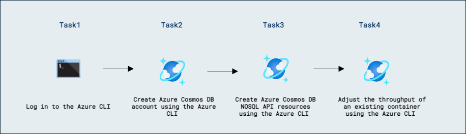

# Lab 12a - DevOps プラクティスを使用して Azure Cosmos DB for NoSQL ソリューションを管理する

## ラボ シナリオ

Azure CLI は、Azure 全体のさまざまなリソースを管理するために使用できるコマンド群です。Azure Cosmos DB には豊富なコマンド グループが用意されており、選択した API に関係なく、Cosmos DB アカウントの多くの側面を管理できます。

このラボでは、Azure CLI を使用して Azure Cosmos DB アカウント、データベース、およびコンテナーを作成します。続いて、Azure CLI でプロビジョニングされたスループット（throughput）を調整します。

## ラボの目的

このラボでは、次のタスクを完了します:
- タスク 1: Azure CLI にログインする。
- タスク 2: Azure CLI を使用して Azure Cosmos DB アカウントを作成する。
- タスク 3: Azure CLI を使用して Azure Cosmos DB for NoSQL リソースを作成する。
- タスク 4: Azure CLI を使用して既存コンテナーのスループットを調整する。

## 所要時間: 30 分

## アーキテクチャ図



## 演習 1: Azure CLI スクリプトを使用してプロビジョニング済みスループットを調整する

### タスク 1: Azure CLI にログインする

Azure CLI を使用する前に、CLI のバージョンを確認し、Azure の資格情報でログインする必要があります。

1. **Visual Studio Code** を起動します。

1. **Terminal** メニューを開き、**New Terminal** を選択して新しいターミナル インスタンスを開きます。

1. 次のコマンドで Azure CLI のバージョンを確認します:

    ```
    az --version
    ```

1. 次のコマンドで、よく使われる Azure CLI コマンド グループを確認します:

    ```
    az --help
    ```

1. 次のコマンドで Azure CLI の対話型ログインを開始します:

    ```
    az login
    ```

1. Azure CLI は自動的に Web ブラウザーのウィンドウまたはタブを開きます。表示されたブラウザーで、サブスクリプションに関連付けられた Microsoft の資格情報でサインインしてください。

1. ブラウザー ウィンドウまたはタブを閉じます。

1. ラボプロバイダーがリソース グループを作成しているか確認し、作成済みであれば次のセクションで使用するためにその名前を記録してください。

    ```
    az group list --query "[].{ResourceGroupName:name}" -o table
    ```

    このコマンドは複数のリソース グループ名を返すことがあります。

### タスク 2: Azure CLI を使用して Azure Cosmos DB アカウントを作成する

`cosmosdb` コマンド グループには、CLI を使用して Azure Cosmos DB アカウントを作成および管理するための基本コマンドが含まれています。Azure Cosmos DB アカウントにはアドレス可能な URI があるため、スクリプト経由で作成する場合でも、グローバルに一意な名前を付けることが重要です。

1. **Visual Studio Code** で既に開いているターミナルに戻ります。

1. 次のコマンドで、Azure Cosmos DB に関連する主要な CLI コマンドを確認します:

    ```
    az cosmosdb --help
    ```

1. 次のコマンドで、[Get-Random][docs.microsoft.com/powershell/module/microsoft.powershell.utility/get-random] PowerShell コマンドレットを使用して **suffix** という新しい変数を作成します:

    ```
    $suffix=Get-Random -Maximum 1000000
    ```

    >**注意**: Get-Random は 0 から 1,000,000 の間のランダムな整数を生成します。これにより、サービスにグローバルに一意な名前を付けるのに役立ちます。

1. 次のコマンドで、固定文字列 **csms** と `$suffix` の値を連結して **accountName** 変数を作成します:

    ```
    $accountName="csms$suffix"
    ```

1. 次のコマンドで、前に作成または確認したリソース グループ名を使用して **resourceGroup** 変数を作成します:

    ```
    $resourceGroup="<resource-group-name>"
    ```

    >**注意**: 例えば、リソース グループ名が **DP-420-xxxxx** の場合、コマンドは **$resourceGroup="DP-420-xxxxx"** になります。

1. 次のコマンドで、`$accountName` と `$resourceGroup` の値をターミナルに表示します:

    ```
    echo $accountName
    echo $resourceGroup
    ```

1. 次のコマンドで **az cosmosdb create** のオプションを確認します:

    ```
    az cosmosdb create --help
    ```

1. 定義済みの変数を使用して新しい Azure Cosmos DB アカウントを作成します:

    ```
    az cosmosdb create --name $accountName --resource-group $resourceGroup
    ```

1. **create** コマンドが完了して戻るまで待ちます。

    >**注意**: **create** コマンドは通常 2～12 分ほどかかる場合があります。

### タスク 3: Azure CLI を使用して Azure Cosmos DB for NoSQL リソースを作成する

`cosmosdb sql` コマンド グループには、Azure Cosmos DB の API for NoSQL に特有のリソースを管理するコマンドが含まれています。各コマンド グループのオプションは常に `--help` フラグで確認できます。

1. **Visual Studio Code** の既存のターミナルに戻ります。

1. 次のコマンドで、API for NoSQL に関連する CLI コマンドを確認します:

    ```
    az cosmosdb sql --help
    ```

1. 次のコマンドで、API for NoSQL 用のデータベース管理コマンドを確認します:

    ```
    az cosmosdb sql database --help
    ```

1. 定義済みの変数とデータベース名 **cosmicworks** を使ってデータベースを作成します:

    ```
    az cosmosdb sql database create --name "cosmicworks" --account-name $accountName --resource-group $resourceGroup
    ```

1. **create** コマンドが完了して戻るまで待ちます。

1. 次のコマンドで、API for NoSQL 用のコンテナー管理コマンドを確認します:

    ```
    az cosmosdb sql container --help
    ```

1. 定義済みの変数を使い、データベース名 **cosmicworks**、コンテナー名 **products** で次のコマンドによりコンテナーを作成します:

    ```
    az cosmosdb sql container create --name "products" --throughput 400 --partition-key-path "/categoryId" --database-name "cosmicworks" --account-name $accountName --resource-group $resourceGroup
    ```

1. **create** コマンドが完了して戻るまで待ちます。

1. 新しい Web ブラウザー ウィンドウまたはタブで Azure ポータル（``portal.azure.com``）に移動します。

1. サブスクリプションに関連する Microsoft 資格情報でポータルにサインインします。

1. **Resource groups** を選択し、先ほど作成または確認したリソース グループを選択し、**csms** プレフィックスで作成した Azure Cosmos DB アカウント リソースを選択します。

1. Azure Cosmos DB アカウント内で **Data Explorer** ペインに移動します。

1. **Data Explorer** で **cosmicworks** データベース ノードを展開し、API for NoSQL ナビゲーション ツリーに表示されている **products** コンテナーを確認します。

1. **products** コンテナー ノードを選択し、**Scale & Settings** を選択します。

1. **Scale** タブの値を確認します。特に **Throughput** セクションで **Manual** が選択され、プロビジョニングされたスループットが **400** RU/s に設定されていることを確認します。

1. ブラウザー ウィンドウまたはタブを閉じます。

### タスク 4: Azure CLI を使用して既存コンテナーのスループットを調整する

Azure CLI を使用すると、コンテナーを手動プロビジョニングとオートスケールの間で移行できます。コンテナーがオートスケールを使用している場合は、CLI で最大スループット値を動的に調整できます。

1. **Visual Studio Code** の既存のターミナルに戻ります。

1. 次のコマンドで、コンテナーのスループットを管理するための CLI コマンドを確認します:

    ```
    az cosmosdb sql container throughput --help
    ```

1. 次のコマンドで **products** コンテナーのスループットを手動プロビジョニングからオートスケールに移行します:

    ```
    az cosmosdb sql container throughput migrate --name "products" --throughput-type autoscale --database-name "cosmicworks" --account-name $accountName --resource-group $resourceGroup
    ```

1. **migrate** コマンドが完了して戻るまで待ちます。

1. 次のコマンドで、**products** コンテナーの最小可能スループット値を確認します:

    ```
    az cosmosdb sql container throughput show --name "products" --query "resource.minimumThroughput" --output "tsv" --database-name "cosmicworks" --account-name $accountName --resource-group $resourceGroup
    ```

1. 次のコマンドで、**products** コンテナーのオートスケール最大スループットを既定の **4,000** から **5,000** に更新します:

    ```
    az cosmosdb sql container throughput update --name "products" --max-throughput 5000 --database-name "cosmicworks" --account-name $accountName --resource-group $resourceGroup
    ```

1. **update** コマンドが完了して戻るまで待ちます。

1. **Visual Studio Code** を閉じます。

1. 新しい Web ブラウザー ウィンドウまたはタブで Azure ポータル（``portal.azure.com``）に移動します。

1. サブスクリプションに関連する Microsoft 資格情報でポータルにサインインします。

1. **Resource groups** を選択し、先ほど作成または確認したリソース グループを選択し、**csms** プレフィックスで作成した Azure Cosmos DB アカウント リソースを選択します。

1. Azure Cosmos DB アカウント内で **Data Explorer** ペインに移動します。

1. **Data Explorer** で **cosmicworks** データベース ノードを展開し、API for NoSQL ナビゲーション ツリー内の **products** コンテナーを確認します。

1. **products** コンテナー ノードを選択し、**Scale & Settings** を選択します。

1. **Scale** タブの値を確認します。特に **Throughput** セクションで **Autoscale** が選択され、プロビジョニングされたスループットが **5,000** RU/s に設定されていることを確認します。

1. ブラウザー ウィンドウまたはタブを閉じます。

[docs.microsoft.com/powershell/module/microsoft.powershell.utility/get-random]: https://docs.microsoft.com/powershell/module/microsoft.powershell.utility/get-random

### レビュー

このラボで完了した項目:

- Azure CLI にログインしました。
- Azure CLI を使用して Azure Cosmos DB アカウントを作成しました。
- Azure CLI を使用して Azure Cosmos DB for NoSQL リソースを作成しました。
- Azure CLI を使用して既存コンテナーのスループットを調整しました。

### ラボを正常に完了しました
