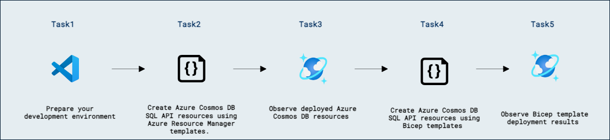

# ラボ 12b - DevOps プラクティスを使って Azure Cosmos DB SQL API ソリューションを管理する

## ラボ シナリオ

Azure Resource Manager（ARM）テンプレートは、Azure にデプロイするインフラストラクチャを宣言的に定義する JSON ファイルです。ARM テンプレートは Azure リソースをデプロイするための一般的なインフラストラクチャをコードとして扱うソリューションです。Bicep はこれをさらに発展させ、JSON テンプレートを生成するための読みやすいドメイン固有言語を提供します。

このラボでは、Azure Resource Manager テンプレートを使用して新しい Azure Cosmos DB アカウント、データベース、およびコンテナーを作成します。最初に生の JSON からテンプレートを作成し、その後 Bicep を使って同じテンプレートを作成します。

## ラボの目的

このラボでは、次のタスクを完了します:
- タスク 1: 開発環境を準備する。
- タスク 2: Azure Resource Manager テンプレートを使用して Azure Cosmos DB SQL API リソースを作成する。
- タスク 3: デプロイされた Azure Cosmos DB リソースを確認する。
- タスク 4: Bicep テンプレートを使用して Azure Cosmos DB SQL API リソースを作成する。
- タスク 5: Bicep テンプレートのデプロイ結果を確認する。

## 想定所要時間: 30 分

## アーキテクチャ図



## 演習 1: Azure Resource Manager テンプレートを使用して Azure Cosmos DB SQL API コンテナーを作成する

### タスク 1: 開発環境を準備する

1. Visual Studio Code を起動します（プログラムアイコンがデスクトップにピン留めされています）。

2. 左ペインの **拡張機能 (1)** アイコンを選択します。検索バーに **C# (2)** を入力し、表示された **拡張機能 (3)** を選択して **インストール (4)** をクリックします。

    

3. 画面左上の **ファイル** メニューから **フォルダーを開く** を選択し、**C:\AllFiles** に移動します。

4. フォルダー **dp-420-cosmos-db-dev** を選択し、**フォルダーの選択** をクリックします。

### タスク 2: Azure Resource Manager テンプレートを使用して Azure Cosmos DB SQL API リソースを作成する

Azure Resource Manager の **Microsoft.DocumentDB** リソースプロバイダーを使用すると、JSON ファイルを使ってアカウント、データベース、コンテナーをデプロイできます。ファイルは複雑になる場合がありますが、予測可能な形式に従っており、Visual Studio Code の拡張機能を使って作成できます。

> **注意** : テンプレートの構文エラーが解決できない場合は、参考としてこの [サンプル ARM テンプレート][github.com/arm-template-guide] を参照してください。

1. Visual Studio Code の **エクスプローラー** ペインで **31-create-container-arm-template** フォルダーに移動します。

1. **deploy.json** ファイルを開きます。

1. 空の ARM テンプレートを確認します:

    ```
    {
        "$schema": "https://schema.management.azure.com/schemas/2019-04-01/deploymentTemplate.json#",
        "contentVersion": "1.0.0.0",
        "resources": [
        ]
    }
    ```

1. **resources** 配列の中に、新しい Azure Cosmos DB アカウントを作成する JSON オブジェクトを追加します:

    ```
    {
        "type": "Microsoft.DocumentDB/databaseAccounts",
        "apiVersion": "2021-05-15",
        "name": "[concat('csmsarm', uniqueString(resourceGroup().id))]",
        "location": "[resourceGroup().location]",
        "properties": {
            "databaseAccountOfferType": "Standard",
            "locations": [
                {
                    "locationName": "westus"
                }
            ]
        }
    }
    ```

    オブジェクトは次の設定で構成されています:

    | **設定** | **値** |
    | --- | --- |
    | **リソースの種類** | *Microsoft.DocumentDB/databaseAccounts* |
    | **API バージョン** | *2021-05-15* |
    | **アカウント名** | *csmsarm* とアカウント名から生成された一意の文字列 |
    | **ロケーション** | *リソースグループの現在のロケーション* |
    | **アカウントのオファー種別** | *Standard* |
    | **ロケーション** | *West US のみ* |

1. **deploy.json** ファイルを保存します。

1. **31-create-container-arm-template** フォルダーのコンテキストメニューを開き、**統合ターミナルで開く** を選択して新しいターミナルを開きます。

    > **注意** : この操作により、ターミナルの開始ディレクトリが **31-create-container-arm-template** フォルダーに設定されます。

1. 次のコマンドを使用して Azure CLI の対話型ログインを開始します:

    ```
    az login
    ```

1. Azure CLI が自動的に Web ブラウザーウィンドウまたはタブを開きます。ブラウザーでサブスクリプションに紐づく Microsoft アカウントでサインインしてください。

1. ブラウザーのウィンドウまたはタブを閉じます。

1. ラボプロバイダーによってリソースグループが作成されているか確認し、作成済みであればその名前を控えてください。次のコマンドを使用します:

    ```
    az group list --query "[].{ResourceGroupName:name}" -o table
    ```
    
    このコマンドは複数のリソースグループ名を返す場合があります。

1. （オプション）***ラボ用のリソースグループが作成されていない場合***、リソースグループ名を決めて作成します。*一部のラボ環境ではロックダウンされており、リソースグループの作成に管理者が必要な場合があります。*

    i. 次の一覧から最寄りのロケーション名を取得します

    ```
    az account list-locations --query "sort_by([].{YOURLOCATION:name, DisplayName:regionalDisplayName}, &YOURLOCATION)" --output table
    ```

    ii. リソースグループを作成します。*ラボ環境によっては管理者が必要な場合があります。*
    ```
    az group create --name YOURRESOURCEGROUPNAME --location YOURLOCATION
    ```

1. 次のコマンドを使って、先ほど作成または確認したリソースグループ名を `resourceGroup` 変数に設定します:

    ```
    $resourceGroup="<resource-group-name>"
    ```

    > **注意** : 例: リソースグループ名が **DP-420-xxxxxx** の場合、コマンドは **$resourceGroup="DP-420-xxxxxx"** になります。

1. 次のコマンドで `echo` を使用して `resourceGroup` 変数の値を出力します:

    ```
    echo $resourceGroup
    ```

1. 次のコマンドを使用して ARM テンプレートをデプロイします:

    ```
    az deployment group create --name "arm-deploy-account" --resource-group $resourceGroup --template-file .\\deploy.json
    ```

1. 統合ターミナルを開いたまま、エディターに戻り **deploy.json** を編集します。

1. **resources** 配列内に、Azure Cosmos DB SQL API データベースを作成する JSON オブジェクトを追加します:

    ```
    ,
    {
        "type": "Microsoft.DocumentDB/databaseAccounts/sqlDatabases",
        "apiVersion": "2021-05-15",
        "name": "[concat('csmsarm', uniqueString(resourceGroup().id), '/cosmicworks')]",
        "dependsOn": [
            "[resourceId('Microsoft.DocumentDB/databaseAccounts', concat('csmsarm', uniqueString(resourceGroup().id)))]"
        ],
        "properties": {
            "resource": {
                "id": "cosmicworks"
            }
        }
    }
    ```

    オブジェクトは次の設定で構成されています:

    | **設定** | **値** |
    | --- | --- |
    | **リソースの種類** | *Microsoft.DocumentDB/databaseAccounts/sqlDatabases* |
    | **API バージョン** | *2021-05-15* |
    | **アカウント名** | *csmsarm* とアカウント名から生成された一意の文字列 と */cosmicworks* |
    | **リソース ID** | *cosmicworks* |
    | **依存関係** | *テンプレート内で先に作成した databaseAccount* |

1. **deploy.json** ファイルを保存します。

1. 統合ターミナルに戻ります。

1. 次のコマンドを使って ARM テンプレートをデプロイします:

    ```
    az deployment group create --name "arm-deploy-database" --resource-group $resourceGroup --template-file .\\deploy.json
    ```

1. 統合ターミナルを開いたまま、**deploy.json** ファイルに戻ります。

1. **resources** 配列内に、Azure Cosmos DB SQL API コンテナーを作成する JSON オブジェクトを追加します:
``` 
    ```
    ,
    {
        "type": "Microsoft.DocumentDB/databaseAccounts/sqlDatabases/containers",
        "apiVersion": "2021-05-15",
        "name": "[concat('csmsarm', uniqueString(resourceGroup().id), '/cosmicworks/products')]",
        "dependsOn": [
            "[resourceId('Microsoft.DocumentDB/databaseAccounts', concat('csmsarm', uniqueString(resourceGroup().id)))]",
            "[resourceId('Microsoft.DocumentDB/databaseAccounts/sqlDatabases', concat('csmsarm', uniqueString(resourceGroup().id)), 'cosmicworks')]"
        ],
        "properties": {
            "options": {
                "throughput": 400
            },
            "resource": {
                "id": "products",
                "partitionKey": {
                    "paths": [
                        "/categoryId"
                    ]
                }
            }
        }
    }
    ```

    オブジェクトは次の設定で構成されています:

    | **設定** | **値** |
    | --- | --- |
    | **リソースの種類** | *Microsoft.DocumentDB/databaseAccounts/sqlDatabases/containers* |
    | **API バージョン** | *2021-05-15* |
    | **アカウント名** | *csmsarm* とアカウント名から生成された一意の文字列 と */cosmicworks/products* |
    | **リソース ID** | *products* |
    | **スループット** | *400* |
    | **パーティションキー** | */categoryId* |
    | **依存関係** | *テンプレート内で先に作成したアカウントとデータベース* |

1. **deploy.json** ファイルを保存します。

1. 統合ターミナルに戻ります。

1. 次の **az deployment group create** コマンドを使用して、最後の Azure Resource Manager テンプレートをデプロイします:

    ```
    az deployment group create --name "arm-deploy-container" --resource-group $resourceGroup --template-file .\\deploy.json
    ```

1. 統合ターミナルを閉じます。

### タスク 3: デプロイされた Azure Cosmos DB リソースを確認する

Azure Cosmos DB SQL API リソースがデプロイされたら、Azure ポータルでリソースを確認できます。Data Explorer を使用して、アカウント、データベース、およびコンテナーがすべて正常にデプロイされ、正しく構成されていることを確認します。

1. 新しい Web ブラウザーのウィンドウまたはタブで Azure ポータル（``portal.azure.com``）に移動します。

1. サブスクリプションに関連付けられた Microsoft の資格情報でポータルにサインインします。

1. **リソース グループ** を選択し、このラボで作成または確認したリソース グループを選択し、このラボで **csmsarm** プレフィックスを付けて作成した **Azure Cosmos DB アカウント** リソースを選択します。

1. **Azure Cosmos DB** アカウント リソース内で **Data Explorer** ペインに移動します。

1. **Data Explorer** で **cosmicworks** データベース ノードを展開し、**NOSQL API** ナビゲーション ツリー内にある新しい **products** コンテナー ノードを確認します。

1. **NOSQL API** ナビゲーション ツリー内の **products** コンテナー ノードを選択し、**Scale & Settings** を選択します。

1. **Scale** セクションの値を確認します。特に、**Throughput** セクションで **Manual** オプションが選択されており、プロビジョニングされたスループットが **400** RU/s に設定されていることを確認します。

1. **Settings** セクションの値を確認します。特に、**Partition key** の値が **/categoryId** に設定されていることを確認します。

1. ブラウザーのウィンドウまたはタブを閉じます。

### タスク 4: Bicep テンプレートを使用して Azure Cosmos DB SQL API リソースを作成する

Bicep は、Azure Resource Manager テンプレートよりも簡単かつ効率的に Azure リソースを展開できるドメイン固有言語です。Bicep を使って同じリソースを別名でデプロイし、両者の違いを示します。

> **注意** : テンプレートの構文エラーが解決できない場合は、参考としてこの [サンプル Bicep テンプレート][github.com/bicep-template-guide] を参照してください。

1. Visual Studio Code の **エクスプローラー** ペインで **31-create-container-arm-template** フォルダーに移動します。

1. 空の **deploy.bicep** ファイルを開きます。

1. ファイル内に、Azure Cosmos DB アカウントを作成する新しいオブジェクトを追加します:

    ```
    resource Account 'Microsoft.DocumentDB/databaseAccounts@2021-05-15' = {
      name: 'csmsbicep${uniqueString(resourceGroup().id)}'
      location: resourceGroup().location
      properties: {
        databaseAccountOfferType: 'Standard'
        locations: [
          { 
            locationName: 'westus' 
          }
        ]
      }
    }
    ```

    オブジェクトは次の設定で構成されています:

    | **設定** | **値** |
    | --- | --- |
    | **エイリアス** | *Account* |
    | **名前** | *csmsarm* とアカウント名から生成された一意の文字列 |
    | **リソースの種類** | *Microsoft.DocumentDB/databaseAccounts/sqlDatabases* |
    | **API バージョン** | *2021-05-15* |
    | **ロケーション** | *リソース グループの現在のロケーション* |
    | **アカウントのオファー種別** | *Standard* |
    | **ロケーション** | *West US のみ* |

1. **deploy.bicep** ファイルを保存します。

1. **31-create-container-arm-template** フォルダーのコンテキストメニューを開き、**統合ターミナルで開く** を選択して新しいターミナルを開きます。

1. 次のコマンドを使用して、このラボで作成または確認したリソース グループ名を **resourceGroup** 変数に設定します:

    ```
    $resourceGroup="<resource-group-name>"
    ```

    > **注意** : 例: リソース グループ名が **DP-420-xxxxxx** の場合、コマンドは **$resourceGroup="DP-420-xxxxxx"** になります。

1. 次の **az deployment group create** コマンドを使用して Bicep テンプレートをデプロイします:

    ```
    az deployment group create --name "bicep-deploy-account" --resource-group $resourceGroup --template-file .\\deploy.bicep
    ```

1. 統合ターミナルを開いたまま、**deploy.bicep** ファイルに戻ります。

1. ファイル内に、Azure Cosmos DB データベースを作成する新しいオブジェクトを追加します:

    ```
    resource Database 'Microsoft.DocumentDB/databaseAccounts/sqlDatabases@2021-05-15' = {
      parent: Account
      name: 'cosmicworks'
      properties: {
        resource: {
            id: 'cosmicworks'
        }
      }
    }
    ```

    オブジェクトは次の設定で構成されています:

    | **設定** | **値** |
    | --- | --- |
    | **親** | *テンプレート内で先に作成した Account* |
    | **エイリアス** | *Database* |
    | **名前** | *cosmicworks* |
    | **リソースの種類** | *Microsoft.DocumentDB/databaseAccounts/sqlDatabases* |
    | **API バージョン** | *2021-05-15* |
    | **リソース ID** | *cosmicworks* |

1. **deploy.bicep** ファイルを保存します。

1. 統合ターミナルに戻ります。

1. 次の **az deployment group create** コマンドを使用して Bicep テンプレートをデプロイします:

    ```
    az deployment group create --name "bicep-deploy-database" --resource-group $resourceGroup --template-file .\\deploy.bicep
    ```

1. 統合ターミナルを開いたまま、**deploy.bicep** ファイルに戻ります。

1. ファイル内に、Azure Cosmos DB コンテナーを作成する新しいオブジェクトを追加します:

    ```
    resource Container 'Microsoft.DocumentDB/databaseAccounts/sqlDatabases/containers@2021-05-15' = {
      parent: Database
      name: 'products'
      properties: {
        options: {
          throughput: 400
        }
        resource: {
          id: 'products'
          partitionKey: {
            paths: [
              '/categoryId'
            ]
          }
        }
      }
    }
    ```

    オブジェクトは次の設定で構成されています:

    | **設定** | **値** |
    | --- | --- |
    | **親** | *テンプレート内で先に作成した Database* |
    | **エイリアス** | *Container* |
    | **名前** | *products* |
    | **リソース ID** | *products* |
    | **スループット** | *400* |
    | **パーティションキーのパス** | */categoryId* |

1. **deploy.bicep** ファイルを保存します。

1. 統合ターミナルに戻ります。

1. 次の **az deployment group create** コマンドを使用して、最後の Bicep テンプレートをデプロイします:

    ```
    az deployment group create --name "bicep-deploy-container" --resource-group $resourceGroup --template-file .\\deploy.bicep
    ```

1. 統合ターミナルを閉じます。

1. **Visual Studio Code** を閉じます。

### タスク 5: Bicep テンプレートのデプロイ結果を確認する

Bicep のデプロイは Azure Resource Manager デプロイと同じ方法で検証できます。アカウント、データベース、およびコンテナーが正常にデプロイされたことを確認し、6 回のデプロイ履歴も表示します。

1. 新しい Web ブラウザーのウィンドウまたはタブで Azure ポータル（``portal.azure.com``）に移動します。

1. サブスクリプションに関連付けられた Microsoft アカウントでポータルにサインインします。

1. **リソース グループ** を選択し、このラボで作成または確認したリソース グループを選択します。

1. リソース グループ内で **デプロイメント** ペインに移動します。

1. Azure Resource Manager テンプレートと Bicep ファイルからの 6 つのデプロイを確認します。

1. 引き続きリソース グループ内で、**概要** ペインに移動します。

1. 引き続きリソース グループ内で、このラボで **csmsbicep** プレフィックスを使って作成した **Azure Cosmos DB アカウント** リソースを選択します。

1. **Azure Cosmos DB** アカウント リソース内で **Data Explorer** ペインに移動します。

1. **Data Explorer** で **cosmicworks** データベース ノードを展開し、**NOSQL API** ナビゲーション ツリー内にある新しい **products** コンテナー ノードを確認します。

1. **NOSQL API** ナビゲーション ツリー内の **products** コンテナー ノードを選択し、**Scale & Settings** を選択します。

1. **Scale** セクションの値を確認します。特に、**Throughput** セクションで **Manual** オプションが選択され、プロビジョニング済みのスループットが **400** RU/s に設定されていることを確認します。

1. **Settings** セクションの値を確認します。特に、**Partition key** の値が **/categoryId** に設定されていることを確認します。

1. ブラウザーのウィンドウまたはタブを閉じます。

### レビュー

このラボでは、次の操作を完了しました:

- 開発環境を準備しました。
- Azure Resource Manager テンプレートを使用して Azure Cosmos DB SQL API リソースを作成しました。
- デプロイされた Azure Cosmos DB リソースを確認しました。
- Bicep テンプレートを使用して Azure Cosmos DB SQL API リソースを作成しました。
- Bicep テンプレートのデプロイ結果を確認しました。

### ラボを正常に完了しました
