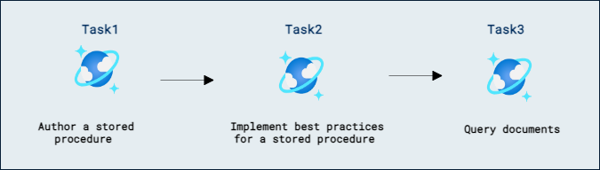
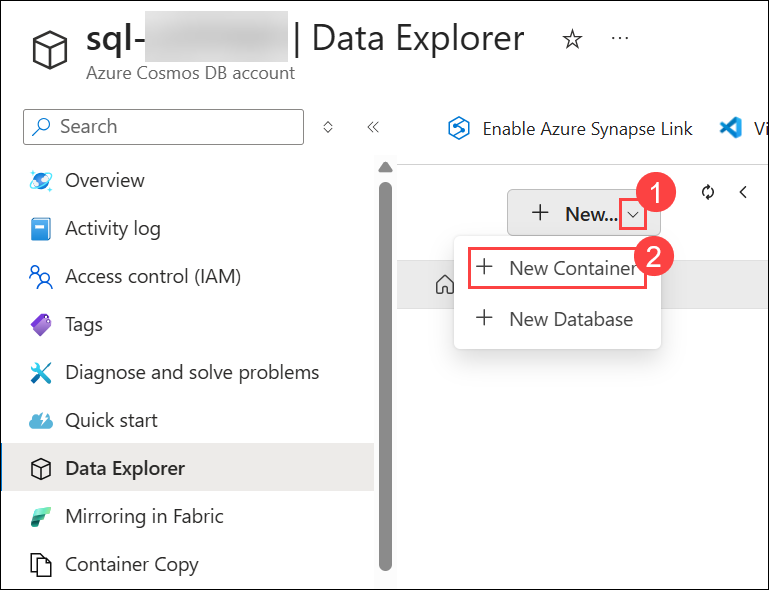
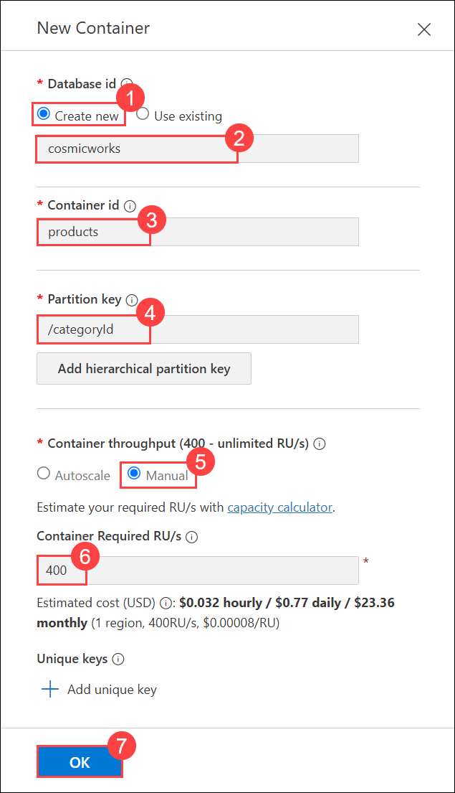
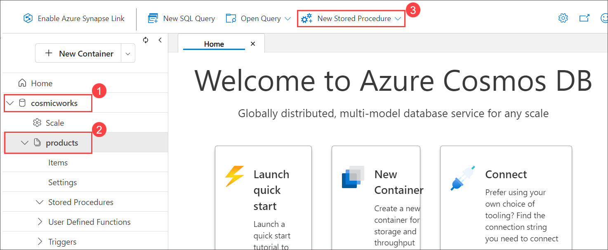
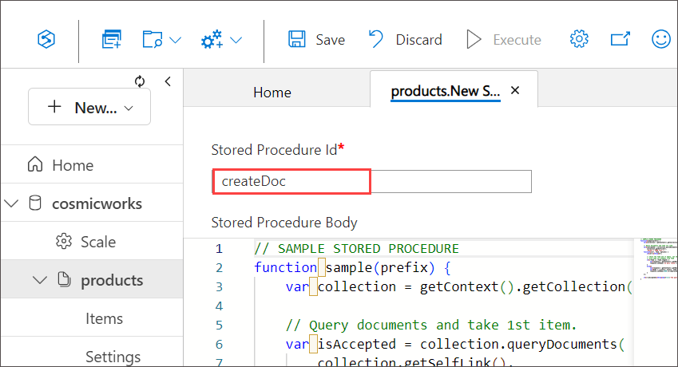
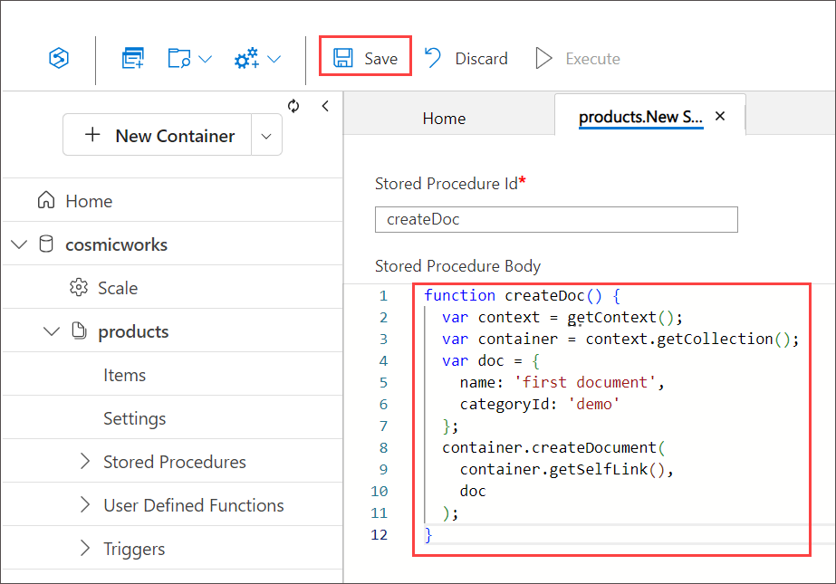

# Azure ポータルでストアド プロシージャを作成する

## ラボ シナリオ

ストアド プロシージャは、Azure Cosmos DB でサーバー側のビジネス ロジックを実行する方法の一つです。ストアド プロシージャを使用すると、単一のトランザクション スコープ内で複数のドキュメントに対してコンテナー内の基本的な CRUD（作成、読み取り、更新、削除）操作を実行できます。

このラボでは、コンテナー内にドキュメントを作成するストアド プロシージャを作成します。その後、SQL クエリを使用してストアド プロシージャの結果を検証します。

## ラボの目的

このラボでは、次のタスクを完了します:
- タスク 1: ストアド プロシージャを作成します。
- タスク 2: ストアド プロシージャのベストプラクティスを実装します。
- タスク 3: ドキュメントをクエリします。

## 想定所要時間: 30 分

## アーキテクチャ図



## 演習 1:

### タスク 1: ストアド プロシージャを作成する

このタスクでは、Azure Cosmos DB for NoSQL アカウントをプロビジョニングします。

ストアド プロシージャは言語統合された JavaScript で作成され、データベース エンジン内で基本的な CRUD 操作を実行できます。データベース エンジン内で JavaScript を実行するには、Azure Cosmos DB 用のサーバー側 JavaScript SDK と一連のヘルパーメソッドが使用されます。

1. Azure ポータルのページに戻り、ポータル上部の「Search resources, services and docs (G+/)」ボックスに **Azure Cosmos DB (1)** と入力し、サービスの下に表示される **Azure Cosmos DB (2)** を選択します。

   
   
1. **Azure Cosmos DB for NoSQL** の下で **+ Create** を選択し、**Create** をクリックして **Azure Cosmos DB for NoSQL** アカウントを作成します。

    

    

1. 以下の設定を指定し、残りの設定はすべて既定値のままにして、**Review + create (9)** を選択します:

    | **設定** | **値** |
    | :--- | :--- |
    | **ワークロードの種類** | *Learning* **(1)** |
    | **サブスクリプション** | *既存の Azure サブスクリプション* **(2)** |
    | **リソース グループ** | *既存の Cosmosdb-<inject key="DeploymentID" enableCopy="false"/> を選択* **(3)** |
    | **アカウント名** | *sql-<inject key="DeploymentID" enableCopy="false"/>* **(4)** |
    | **ロケーション** | *利用可能なリージョンを選択* **(5)** |
    | **容量モード** | *Provisioned throughput* **(6)** |
    | **無料利用枠割引の適用** | *Do Not Apply* **(7)** |
    | **アカウントの合計スループットを制限する** | *Disable* **(8)** |

     
            
   
1. 検証が成功したら **Create** をクリックします。

     

1. このタスクを続行する前に、デプロイが完了するまで待ちます。

1. **Go to resources** を選択します。新しく作成された **Azure Cosmos DB** アカウントに移動します。

    

1. Within the **Azure Cosmos DB** account resource **overview page (1)** , navigate to the **Data Explorer (2)** pane. 

    

1. **Data Explorer** ページで、**New Container (1)** をクリックし、ドロップダウン メニューから **New Container (2)** を選択します。

     

 1. **New Container** ダイアログで、以下の設定を構成し、**OK (7)** をクリックします。

    | Setting | Value |
    |----------|----------|
    | **Database id** | **Create new (1)** を選択し、`cosmicworks` **(2)** と入力 |
    | **Container id** | `products` **(3)** |
    | **Partition key** | `/categoryId` **(4)** |
    | **Container throughput** | **Manual (5)** を選択 |
    | **Container Required RU/s** | `400` **(6)** |

       

1. **Data Explorer** で **cosmicworks (1)** データベースを展開し、**products (2)** コンテナーを選択します。次に、ツールバーから **New Stored Procedure (3)** をクリックします。

   

1. **Stored Procedure Id** フィールドに **createDoc** と入力します。

    

1. エディター領域の内容を削除します。

1. 入力パラメーターなしで、**createDoc** という名前の新しい JavaScript 関数を作成します:

    ```
    function createDoc() {
        
    }
    ```

1. **createDoc** 関数内で、組み込みの [getContext][azure.github.io/azure-cosmosdb-js-server/global.html] メソッドを呼び出し、その結果を **context** という変数に格納します:

    ```
    var context = getContext();
    ```

1. context オブジェクトの [getCollection][azure.github.io/azure-cosmosdb-js-server/context.html] メソッドを呼び出し、その結果を **container** という変数に格納します:

    ```
    var container = context.getCollection();
    ```

1. 2 つのプロパティを持つ新しいオブジェクト **doc** を作成します:

    | **プロパティ** | **値** |
    | :--- | :--- |
    | **Name** | *first document* |
    | **Category ID** | *demo* |

    ```
    var doc = {
        name: 'first document',
        categoryId: 'demo'
    };
    ```

1. container オブジェクトの **createDocument** メソッドを呼び出し、container オブジェクトの **getSelfLink** メソッドの結果と新しいドキュメントをパラメーターとして渡します:

    ```
    container.createDocument(
      container.getSelfLink(),
      doc
    );
    ```

1. 完了すると、ストアド プロシージャのコードは次のようになります:

    ```
    function createDoc() {
      var context = getContext();
      var container = context.getCollection();
      var doc = {
        name: 'first document',
        categoryId: 'demo'
      };
      container.createDocument(
        container.getSelfLink(),
        doc
      );
    }
    ```

1. **Save** を選択して、ストアド プロシージャへの変更を保存します。

    

1. **Execute** を選択し、次の入力パラメーターを使用してストアド プロシージャを実行します:

    | **設定** | **キー** | **値** |
    | :--- | :--- | :--- |
    | **Partition key value** | *String* | *demo* |

1. 空の結果を確認します。ストアド プロシージャは正常に実行されましたが、JavaScript コードは人間が読みやすい応答を返しませんでした。


> **おめでとうございます**。ラボを完了しました。次は検証です。手順は次のとおりです:
> - 対応するタスクの「Validate」ボタンを押します。成功メッセージが表示された場合、ラボの検証に成功しています。
> - そうでない場合は、エラーメッセージを注意深く読み、ラボ ガイドの指示に従って手順をやり直します。
> - 支援が必要な場合は、cloudlabs-support@spektrasystems.com までご連絡ください。24 時間 365 日対応しています。
    
<validation step="f6406f6b-cf21-4093-a8e1-512fadade041" />

### タスク 2: ストアド プロシージャのベストプラクティスを実装する

このタスクでは、エラー処理、応答処理、およびパラメーター管理を改善するベストプラクティスを実装して、ストアド プロシージャを強化します。

このラボで前に作成したストアド プロシージャは基本的な機能を備えていますが、すべてのストアド プロシージャに実装すべき一般的なエラー処理の手法が不足しています。まず、ストアド プロシージャは操作を完了する時間が常にあると想定しており、createDocument メソッドの戻り値を確認して十分な時間があるかどうかを判断していません。次に、すべてのドキュメントが正常に挿入されたと仮定しており、潜在的なエラーメッセージを確認またはスローしていません。最後に、ストアド プロシージャは、元の HTTP リクエストに対する応答として新しく作成されたドキュメントを返していません。これら 3 つの変更をストアド プロシージャに実装して、一般的なベストプラクティスを適用します。

1. **createDoc** ストアド プロシージャのエディターに戻ります。

1. **createDoc** 関数を定義しているコードの 1 行目を見つけます:

    ```
    function createDoc() {
    ```

    そして、**title** というパラメーターを含むようにコード行を更新します:

    ```
    function createDoc(title) {
    ```

1. **doc** オブジェクトの **name** プロパティを設定しているコードの 5 行目を見つけます:

    ```
    name: 'first document',
    ```

    そして、コード行を **title** パラメーターの値を使用するように更新します:

    ```
    name: title,
    ```

1. **createDocument** メソッドを呼び出しているコードの 8 行目を見つけます:

    ```
    container.createDocument(
    ```

    そして、メソッド呼び出しの結果を **accepted** という名前の変数に格納するようにコード行を更新します:

    ```
    var accepted = container.createDocument(
    ```

1. **createDocument** メソッド呼び出しの後に新しいコード行を追加し、**accepted** 変数の値を確認して true でない場合はメソッドを返します:

    ```
    if (!accepted) return;
    ```

1. 最後に、**createDocument** メソッド呼び出しに 3 番目の引数を追加します。この引数は **error** と **newDoc** という 2 つのパラメーターを受け取り、エラーが null かどうかを確認し、新しいドキュメントをストアド プロシージャのレスポンス本文に設定する関数です:

    ```
    (error, newDoc) => {
      if (error) throw new Error(error.message);
      context.getResponse().setBody(newDoc);
    }
    ```

1. 完了すると、ストアド プロシージャのコードは次のようになります:

    ```
    function createDoc(title) {
      var context = getContext();
      var container = context.getCollection();
      var doc = {
        name: title,
        categoryId: 'demo'
      }
      var accepted = container.createDocument(
        container.getSelfLink(),
        doc,
        (error, newDoc) => {
          if (error) throw new Error(error.message);
          context.getResponse().setBody(newDoc);
        }
      );
      if (!accepted) return;
    }
    ```

1. **Update** を選択して、ストアド プロシージャへの変更を保存します。

1. **Execute** を選択し、次の入力パラメーターを使用してストアド プロシージャを実行します:

    | **設定** | **キー** | **値** |
    | :--- | :--- | :--- |
    | **Partition key value** | *String* | *demo* |
    | **Input parameters** | *String* | *second document* |

1. JSON 結果を確認します。ストアド プロシージャが正常に実行された後、作成されたドキュメントが元の HTTP リクエストへの応答として返されました。

### タスク 3: ドキュメントをクエリする

このタスクでは、Data Explorer を使用して SQL クエリを発行し、このラボで作成した 2 つのドキュメントを返します。

1. **Data Explorer** で **cosmicworks** データベース ノードを展開し、**API for NoSQL** ナビゲーション ツリー内の **products** コンテナー ノードを選択します。

1. **New SQL Query** を選択します。

1. エディター領域の内容を削除します。

1. **categoryId** が **demo** と等しいすべてのドキュメントを返す新しい SQL クエリを作成します:

    ```
    SELECT * FROM docs WHERE docs.categoryId = 'demo'
    ```

1. **Execute Query** を選択します。

1. このクエリを実行した結果として、ラボで作成した 2 つのドキュメントが表示されることを確認します。


### サマリー

このラボでは、Azure Cosmos DB for NoSQL でストアド プロシージャを作成し、エラー処理のベストプラクティスを実装し、SQL クエリを使って手順を検証する方法を学びました。ストアド プロシージャを使用すると、複数のドキュメントに対して単一のトランザクション スコープ内でサーバー側のロジックを実行でき、Azure Cosmos DB の CRUD 操作に便利です。

### レビュー

このラボでは、次の操作を完了しました:

- タスク 1: ストアド プロシージャを作成しました。
- タスク 2: ストアド プロシージャのベストプラクティスを実装しました。
- タスク 3: ドキュメントをクエリしました。


### ラボを正常に完了しました
