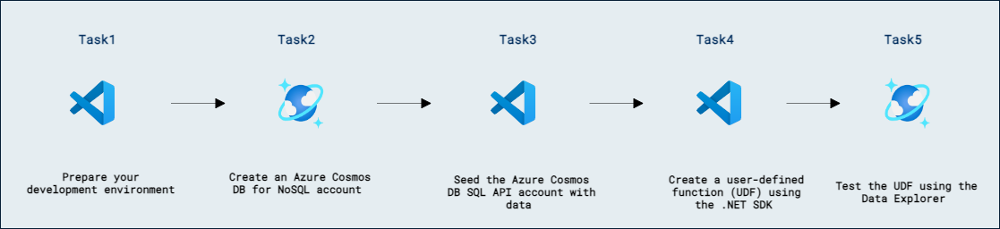
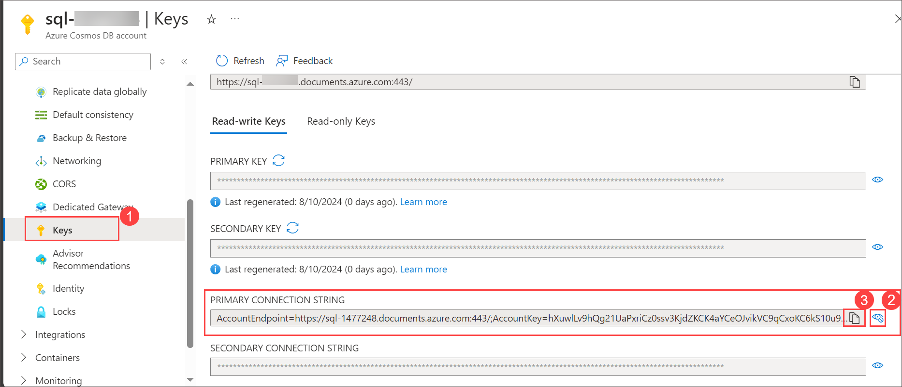

# SDK を使ってユーザー定義関数を実装し、その後使用する

## ラボ シナリオ

Azure Cosmos DB SQL API 用の .NET SDK を使用すると、コンテナーからサーバー側のプログラミング構造を直接管理および呼び出すことができます。新しいコンテナーを準備する際、Data Explorer を使って手作業で操作する代わりに、.NET SDK を使って UDF をコンテナーに直接公開する方が適している場合があります。

このラボでは、.NET SDK を使用して新しい UDF を作成し、Data Explorer を使用して UDF が正しく動作していることを検証します。

## ラボの目的

このラボでは、次のタスクを完了します:
- タスク 1: 開発環境を準備します。
- タスク 2: Azure Cosmos DB for NoSQL アカウントを作成します。
- タスク 3: Azure Cosmos DB for NoSQL アカウントにデータを投入します。
- タスク 4: .NET SDK を使用してユーザー定義関数 (UDF) を作成します。
- タスク 5: Data Explorer を使用して UDF をテストします。

## 想定所要時間: 30 分

## アーキテクチャ図



### タスク 1: 開発環境を準備する

このタスクでは、Visual Studio Code をセットアップして Azure Cosmos DB の作業に備えます。

1. Visual Studio Code を起動します（プログラムアイコンがデスクトップにピン留めされています）。

   

2. 左ペインの **拡張機能 (1)** アイコンを選択します。検索バーに **C# (2)** と入力し、表示される **拡張機能 (3)** を選択して、**Install (4)** をクリックします。

    

3. 画面左上の **ファイル** オプションを選択し、**Open Folder** を選択して **C:\AllFiles** に移動します。

4. **dp-420-cosmos-db-dev-main** フォルダーを選択し、**Select Folder** をクリックします。

   

    >**注意:** **Do you trust the authors of the files in this folder?** のポップアップが表示されたら、**Yes, I trust authors** を選択します。

    


### タスク 2: Azure Cosmos DB for NoSQL アカウントを作成する

このタスクでは、Azure Cosmos DB SQL アカウントをプロビジョニングし、今後の開発に必要な基本設定と接続情報を取得します。

Azure Cosmos DB は複数の API をサポートするクラウドベースの NoSQL データベース サービスです。Azure Cosmos DB アカウントを初めてプロビジョニングする際に、サポートする API（例: **Mongo API** や **NoSQL API**）を選択します。Azure Cosmos DB for NoSQL アカウントのプロビジョニングが完了したら、エンドポイントとキーを取得して、Azure SDK for .NET や任意の SDK から Azure Cosmos DB for NoSQL アカウントに接続できます。

1. Azure ポータルのページに戻り、ポータル上部の「Search resources, services and docs (G+/)」ボックスに **Azure Cosmos DB** と入力し、サービスの下に表示される **Azure Cosmos DB** を選択します。

   
   
1. **Azure Cosmos DB for NoSQL** の下で **+ Create** を選択し、**Create** をクリックして **Azure Cosmos DB for NoSQL** アカウントを作成します。

    

    

1. 以下の設定を指定し、残りの設定はすべて既定値のままにして、**Review + create** を選択します:

    | **設定** | **値** |
    | --- | :--- |
    | **サブスクリプション** | *既存の Azure サブスクリプション* |
    | **リソース グループ** | **Cosmosdb-<inject key="DeploymentID" enableCopy="false"/>** |
    | **アカウント名** | *グローバルに一意の名前を入力* |
    | **ロケーション** | *利用可能なリージョンを選択* |
    | **容量モード** | *Provisioned throughput* |
    | **無料利用枠割引の適用** | *Do Not Apply* |

1. 検証が成功したら **Create** をクリックします。

1. このタスクを続行する前に、デプロイが完了するまで待ちます。

1. **Go to resources** を選択します。新しく作成した **Azure Cosmos DB** アカウントで、**Settings** の下にある **Keys** ペインに移動します。

    

    

1. このペインには、SDK からアカウントに接続するために必要な接続情報と資格情報が表示されます。具体的には:

    1. **URI** フィールドの値を控えます。この **endpoint** 値は後で本演習で使用します。

    1. **PRIMARY KEY** フィールドの値を控えます。この **key** 値は後で本演習で使用します。

        

1. ブラウザーのウィンドウを閉じずに、**Visual Studio Code** を開きます。

    > **おめでとうございます**。ラボを完了しました。次は検証です。手順は次のとおりです:
    > - 対応するタスクの「Validate」ボタンを押します。成功メッセージが表示された場合、ラボの検証に成功しています。
    > - そうでない場合は、エラーメッセージを注意深く読み、ラボ ガイドの指示に従って手順をやり直します。
    > - 支援が必要な場合は、cloudlabs-support@spektrasystems.com までご連絡ください。24 時間 365 日対応しています。
    
    <validation step="74eda0bf-4b7b-47d2-9d83-0bb7e6bc8ffa" />

### タスク 3: Azure Cosmos DB SQL API アカウントにデータを投入する

このタスクでは、cosmicworks コマンドライン ツールを使用して Azure Cosmos DB SQL API アカウントにサンプル データを展開します。このツールは NuGet を通じてインストールされ、製品データなどの事前定義されたデータ セットでデータベースを迅速に埋めることができます。

[cosmicworks][nuget.org/packages/cosmicworks] コマンドライン ツールは、任意の Azure Cosmos DB SQL API アカウントにサンプル データをデプロイします。このツールはオープンソースで NuGet から利用できます。Azure Cloud Shell にこのツールをインストールし、データベースのシードに使用します。

1. **Visual Studio Code** で、**Terminal** メニューを開き、**... (ellipses) (1)** > **Terminal (2)** > **New Terminal (3)** を選択して、既存のインスタンスで新しいターミナルを開きます。

    

1. [cosmicworks][nuget.org/packages/cosmicworks] コマンドライン ツールをマシンでグローバルに使用するためにインストールします。

    ```
    dotnet tool install --global cosmicworks
    ```

    >**注意:** このコマンドは完了まで数分かかる場合があります。最新バージョンをすでにインストール済みの場合は、警告メッセージ (*Tool 'cosmicworks' is already installed*) が出力されます。

1. インストールが完了したら、**Visual Studio Code** を閉じて再度開き、次のコマンドを実行します。

1. Azure Cosmos DB アカウントにサンプル データを投入するために、次のコマンド ライン オプションを使用して cosmicworks を実行します:

    | **オプション** | **値** |
    | --- | --- |
    | **--endpoint** | *このラボの前の手順でコピーしたエンドポイントの値* |
    | **--key** | *このラボの前の手順でコピーしたキーの値* |
    | **--datasets** | *product* |

    ```
    cosmicworks --endpoint <cosmos-endpoint> --key <cosmos-key> --datasets product
    ```

    >**例:** エンドポイントが **https&shy;://dp420.documents.azure.com:443/** で、キーが **fDR2ci9QgkdkvERTQ==** の場合、コマンドは次のようになります:
    > ``cosmicworks --endpoint https://dp420.documents.azure.com:443/ --key fDR2ci9QgkdkvERTQ== --datasets product``
    
    >**注意:** **What is your connection string** と表示された場合は、左側のナビゲーション ペインで Azure Cosmos DB を再度選択し、**Key** を選択して **primary connection string** をコピーし、Visual Studio の入力欄に貼り付けてください。

     
    
1. **cosmicworks** コマンドが、データベース、コンテナー、およびアイテムの作成を完了するまで待ちます。
   
   >**注意:** エラーが発生した場合は、Visual Studio Code を閉じて再度開き、もう一度コマンドを実行してください。

1. 統合ターミナルを閉じます。

    > **おめでとうございます**。ラボを完了しました。次は検証です。手順は次のとおりです:
    > - 対応するタスクの **Validate** ボタンを押します。成功メッセージが表示された場合、ラボの検証に成功しています。
    > - 成功しない場合は、エラーメッセージを注意深く読み、ラボ ガイドの指示に従って手順を再試行してください。
    > - 支援が必要な場合は、cloudlabs-support@spektrasystems.com までご連絡ください。24 時間年中無休で対応しています。
    
    <validation step="dd92f2ca-c14f-4181-8374-d60868d94589" />

### タスク 4: .NET SDK を使用してユーザー定義関数 (UDF) を作成する

このタスクでは、Azure Cosmos DB .NET SDK を使用して、製品価格に税金を加算する UDF を作成します。このタスクでは、C# スクリプトを記述して UDF を定義し、Azure Cosmos DB SQL API コンテナーにデプロイします。これにより、製品の価格に税金を適用したクエリを実行できるようになります。

.NET SDK の [Container][docs.microsoft.com/dotnet/api/microsoft.azure.cosmos.container] クラスには、Stored Procedures、UDF、Triggers に対して CRUD 操作を直接実行するための [Scripts][docs.microsoft.com/dotnet/api/microsoft.azure.cosmos.container.scripts] プロパティがあります。このプロパティを使用して新しい UDF を作成し、その UDF を Azure Cosmos DB SQL API コンテナーに公開します。SDK で作成する UDF は、税金を含めた製品価格を計算し、その結果を使って SQL クエリを実行できるようにします。

1. **Visual Studio Code** の **Explorer** ペインで、**33-create-use-udf-sdk** フォルダーに移動します。

1. **script.cs** コード ファイルを開きます。

1. [Microsoft.Azure.Cosmos.Scripts][docs.microsoft.com/dotnet/api/microsoft.azure.cosmos.scripts] 名前空間の using ブロックを追加します:

    ```
    using Microsoft.Azure.Cosmos.Scripts;
    ```

1. 既存の **endpoint** 変数を、前の手順で作成した Azure Cosmos DB アカウントの **endpoint** に更新します。
  
    ```
    string endpoint = "<cosmos-endpoint>";
    ```

    > **例:** エンドポイントが **https&shy;://dp420.documents.azure.com:443/** の場合、C# のステートメントは次のようになります: **string endpoint = "https&shy;://dp420.documents.azure.com:443/";**。

1. 既存の **key** 変数を、前の手順で作成した Azure Cosmos DB アカウントの **key** に更新します。

    ```
    string key = "<cosmos-key>";
    ```

    > **例:** キーが **fDR2ci9QgkdkvERTQ==** の場合、C# のステートメントは次のようになります: **string key = "fDR2ci9QgkdkvERTQ==";**。

1. [UserDefinedFunctionProperties][docs.microsoft.com/dotnet/api/microsoft.azure.cosmos.scripts.userdefinedfunctionproperties] 型の新しい変数 **props** を、デフォルト コンストラクターで作成します:

    ```
    UserDefinedFunctionProperties props = new ();
    ```

1. **props** 変数の [Id][docs.microsoft.com/dotnet/api/microsoft.azure.cosmos.scripts.userdefinedfunctionproperties.id] プロパティに **tax** を設定します:

    ```
    props.Id = "tax";
    ```

1. **props** 変数の [Body][docs.microsoft.com/dotnet/api/microsoft.azure.cosmos.scripts.userdefinedfunctionproperties.body] プロパティに次の値を設定します: **props.Body = "function tax(i) { return i * 1.25; }";**

    ```
    props.Body = "function tax(i) { return i * 1.25; }";
    ```

1. **container** 変数の [Scripts.CreateUserDefinedFunctionAsync][docs.microsoft.com/dotnet/api/microsoft.azure.cosmos.container.scripts] メソッドを非同期で呼び出し、**props** 変数をパラメーターとして渡し、その結果を [UserDefinedFunctionResponse][docs.microsoft.com/dotnet/api/microsoft.azure.cosmos.scripts.userdefinedfunctionresponse] 型の **udf** 変数に保存します:

    ```
    UserDefinedFunctionResponse udf = await container.Scripts.CreateUserDefinedFunctionAsync(props);
    ```

1. 組み込みの **Console.WriteLine** 静的メソッドを使用して、UserDefinedFunctionResponse クラスの [Resource.Id][docs.microsoft.com/dotnet/api/microsoft.azure.cosmos.scripts.userdefinedfunctionresponse.resource] プロパティを **Created UDF** という見出し付きで出力します:

    ```
    Console.WriteLine($"Created UDF [{udf.Resource?.Id}]");
    ```

1. 作業が完了したら、コード ファイルは次のようになっているはずです:
  
    ```
    using System;
    using Microsoft.Azure.Cosmos;
    using Microsoft.Azure.Cosmos.Scripts;

    string endpoint = "<cosmos-endpoint>";

    string key = "<cosmos-key>";

    CosmosClient client = new CosmosClient(endpoint, key);

    Database database = await client.CreateDatabaseIfNotExistsAsync("cosmicworks");

    Container container = await database.CreateContainerIfNotExistsAsync("products", "/category/name");

    UserDefinedFunctionProperties props = new ();
    props.Id = "tax";
    props.Body = "function tax(i) { return i * 1.25; }";
    
    UserDefinedFunctionResponse udf = await container.Scripts.CreateUserDefinedFunctionAsync(props);
    
    Console.WriteLine($"Created UDF [{udf.Resource?.Id}]");
    ```

1. **script.cs** ファイルを保存します。

1. **Visual Studio Code** で、**33-create-use-udf-sdk** フォルダーを右クリックし、**Open in Integrated Terminal** を選択して新しいターミナル インスタンスを開きます。

1. [dotnet run][docs.microsoft.com/dotnet/core/tools/dotnet-run] コマンドを使用してプロジェクトをビルドして実行します:

    ```
    dotnet run
    ```

1. スクリプトは、作成された新しい UDF の名前を出力します:

    ```
    Created UDF [tax]
    ```

1. 統合ターミナルを閉じます。

1. **Visual Studio Code** を閉じます。

    > **おめでとうございます**。ラボを完了しました。次は検証です。手順は次のとおりです:
    > - 対応するタスクの **Validate** ボタンを押します。成功メッセージが表示された場合、ラボの検証に成功しています。
    > - 成功しない場合は、エラーメッセージを注意深く読み、ラボ ガイドの指示に従って手順を再試行してください。
    > - 支援が必要な場合は、cloudlabs-support@spektrasystems.com までご連絡ください。24 時間年中無休で対応しています。
    
    <validation step="01aa9434-9775-4fd0-baa1-1dcfc60bdba6" />

### タスク 5: Data Explorer を使用して UDF をテストする

このタスクでは、Data Explorer で SQL クエリを実行し、先ほど作成したユーザー定義関数 (UDF) を検証します。

1. ブラウザーに戻ります。

1. **Azure Cosmos DB** アカウント リソース内で、**Data Explorer** ペインに移動します。

1. **Data Explorer** で **cosmicworks** データベース ノードを展開し、**NOSQL API** ナビゲーション ツリー内に新しく作成された **products** コンテナー ノードがあることを確認します。

1. **NOSQL API** ナビゲーション ツリー内の **products** コンテナー ノード (**...**) を選択し、**New SQL Query** を選択します。

1. クエリ タブで **Execute Query** を選択して、すべてのアイテムをフィルターなしで選択する標準クエリを表示します。

1. エディター領域の内容を削除します。

1. すべてのドキュメントを返し、2 つの価格値を投影する新しい SQL クエリを作成します。最初の値はコンテナー内の元の価格値で、2 番目の値は UDF で計算された価格です:

    ```
    SELECT p.id, p.price, udf.tax(p.price) AS priceWithTax FROM products p
    ```

1. **Execute Query** を選択します。

1. ドキュメントを確認し、**price** と **priceWithTax** のフィールドを比較します。

    >**注意:** **priceWithTax** フィールドの値は、**price** フィールドの値より 25% 大きくなるはずです。

1. ブラウザーのウィンドウまたはタブを閉じます。

### サマリー

このラボでは、.NET SDK を使用して Azure Cosmos DB でユーザー定義関数 (UDF) を実装およびテストしました。主な目的は、開発環境に慣れ、Azure Cosmos DB for NoSQL アカウントを作成および構成し、データをシードし、税金を含めた製品価格を計算する UDF を作成することでした。

### レビュー

このラボで完了した内容:

- 開発環境を準備しました。
- Azure Cosmos DB for NoSQL アカウントを作成しました。
- Azure Cosmos DB SQL API アカウントにデータを投入しました。
- .NET SDK を使用してユーザー定義関数 (UDF) を作成しました。
- Data Explorer を使用して UDF をテストしました。

### このラボを正常に完了しました
