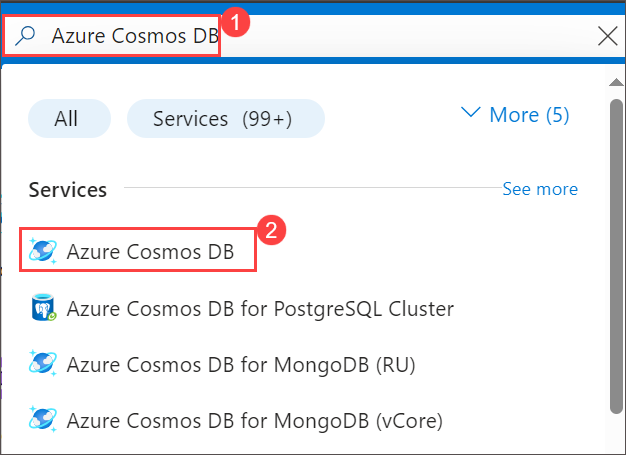
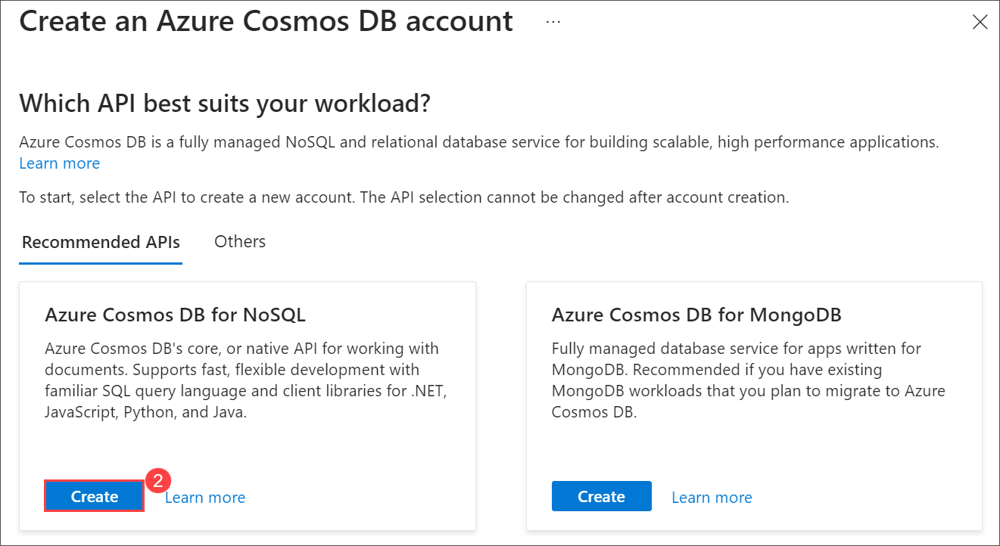
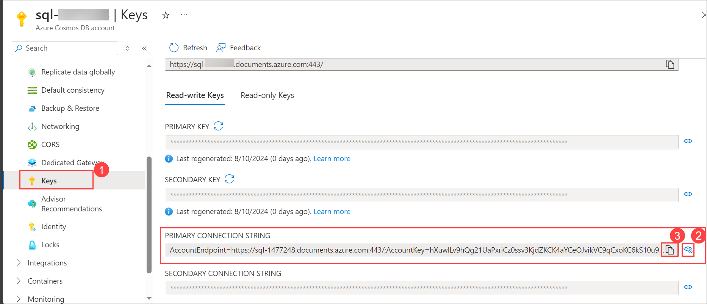

# Implement and then use user-defined functions with the SDK

## Lab scenario

The .NET SDK for Azure Cosmos DB SQL API can be used to manage and invoke server-side programming constructs directly from a container. When preparing a new container, it may make sense to use the .NET SDK to publish UDFs directly to a container instead of performing the tasks manually using the Data Explorer.

In this lab, you'll create a new UDF using the .NET SDK and then use the Data Explorer to validate that the UDF is working correctly.

## Lab objectives

In this lab, you will complete the following tasks:
- Task 1: Prepare your development environment.
- Task 2: Create an Azure Cosmos DB for NoSQL account.
- Task 3: Send the Azure Cosmos DB for NoSQL account with data.
- Task 4: Create a user-defined function (UDF) using the .NET SDK.
- Task 5: Test the UDF using the Data Explorer.

## Estimated Timing: 30 minutes

## Architecture Diagram


### Task 1: Prepare your development environment

In this task, you will prepare your development environment for working with Azure Cosmos DB by setting up Visual Studio Code.

1. Start Visual Studio Code (the program icon is pinned to the Desktop).

   

2. Select the **Extension (1)** icon from the left pane. Enter **C# (2)** in the search bar and select the **extension (3)** that shows up and finally **Install (4)** on the extension. 

    

3. Select the **file** option on the top left of the screen, from the pane options, select **Open Folder** and navigate to **C:\AllFiles**.

4. Select the folder **dp-420-cosmos-db-dev-main** and click on **Select Folder**.

   

    >**Note:** On **Do you trust the authors of the files in this folder?** pop-up, select **Yes, I trust authors**.

    


### Task 2: Create an Azure Cosmos DB for NoSQL account

In this task, you will provision an Azure Cosmos DB SQL account, configuring essential settings and retrieving the necessary connection details for future development.

Azure Cosmos DB is a cloud-based NoSQL database service that supports multiple APIs. When provisioning an Azure Cosmos DB account for the first time, you will select which of the APIs you want the account to support (for example, **Mongo API** or **NoSQL API**). Once the Azure Cosmos DB for NoSQL account is done provisioning, you can retrieve the endpoint and key and use them to connect to the Azure Cosmos DB for NoSQL account using the Azure SDK for .NET or any other SDK of your choice.

1. Navigate back to  Azure Portal page, in Search resources, services and docs (G+/) box at the top of the portal, enter **Azure Cosmos DB**, and then select **Azure 
   Cosmos DB** under services.

   
   
1. Select **+ Create** under **Azure Cosmos DB for NoSQL** click on **Create** to create **Azure Cosmos DB for NoSQL** account.

    

    

1. Specify the following settings, leaving all remaining settings to their default values, and select **Review + create**:

    | **Setting** | **Value** |
    | ---: | :--- |
    | **Subscription** | *Your existing Azure subscription* |
    | **Resource group** | **Cosmosdb-<inject key="DeploymentID" enableCopy="false"/>** |
    | **Account Name** | *Enter a globally unique name* |
    | **Location** | *Choose any available region* |
    | **Capacity mode** | *Provisioned throughput* |
    | **Apply Free Tier Discount** | *Do Not Apply* |

1. Once after validation get Success click on **Create**.

1. Wait for the deployment task to complete before continuing with this task.

1. Select **Go to resources**. On the newly created **Azure Cosmos DB** account under **Settings** navigate to the **Keys** pane.

    

    

1. This pane contains the connection details and credentials necessary to connect to the account from the SDK. Specifically:

    1. Record the value of the **URI** field. You will use this **endpoint** value later in this exercise.

    1. Record the value of the **PRIMARY KEY** field. You will use this **key** value later in this exercise.

        

1. Without closing the browser window, open **Visual Studio Code**.

    > **Congratulations** on completing the lab! Now, it's time to validate it. Here are the steps:
    > - Hit the Validate button for the corresponding task. If you receive a success message, you have successfully validated the lab. 
    > - If not, carefully read the error message and retry the step, following the instructions in the lab guide.
    > - If you need any assistance, please contact us at cloudlabs-support@spektrasystems.com. We are available 24/7 to help you out.
    
    <validation step="74eda0bf-4b7b-47d2-9d83-0bb7e6bc8ffa" />

### Task 3: Seed the Azure Cosmos DB SQL API account with data

In this task, you will use the cosmicworks command-line tool to deploy sample data into your Azure Cosmos DB SQL API account. This tool is installed via NuGet and allows you to quickly populate the database with predefined datasets, such as product data, to facilitate testing and development.

The [cosmicworks][nuget.org/packages/cosmicworks] command-line tool deploys sample data to any Azure Cosmos DB SQL API account. The tool is open-source and available through NuGet. You will install this tool to the Azure Cloud Shell and then use it to seed your database.

1. In **Visual Studio Code**, open the **Terminal** menu by selecting **... (ellipses) (1)** > **Terminal (2)** > **New Terminal (3)** to open a new terminal with your existing instance.

    

1. Install the [cosmicworks][nuget.org/packages/cosmicworks] command-line tool for global use on your machine.

    ```
    dotnet tool install --global cosmicworks
    ```

    >**Note:** This command may take a couple of minutes to complete. This command will output the warning message (*Tool 'cosmicworks' is already installed') if you have already installed the latest version of this tool in the past.

1. Once the Installation is completed, make sure to close the **Visual Studio Code** and re-open it to perform the below command.

1. Run cosmicworks to seed your Azure Cosmos DB account with the following command-line options:

    | **Option** | **Value** |
    | --- | --- |
    | **--endpoint** | *The endpoint value you copied earlier in this lab* |
    | **--key** | *The key value you coped earlier in this lab* |
    | **--datasets** | *product* |

    ```
    cosmicworks --endpoint <cosmos-endpoint> --key <cosmos-key> --datasets product
    ```

    >**For example:** if your endpoint is: **https&shy;://dp420.documents.azure.com:443/** and your key is: **fDR2ci9QgkdkvERTQ==**, then the command would be:
    > ``cosmicworks --endpoint https://dp420.documents.azure.com:443/ --key fDR2ci9QgkdkvERTQ== --datasets product``
    
    >**Note**: If ask for **What is your connection string** then navigate back to Azure cosmos db in left navigation pane select **Key** copy the **primary connection 
     string** and right-click on the mouse to enter the primary string inside Visual Studio.

     
    
1. Wait for the **cosmicworks** command to finish populating the account with a database, container, and items.
   
   >**Note**: If you're getting an error, close the visual studio code reopen it and try to run the command once again.

1. Close the integrated terminal.

    > **Congratulations** on completing the lab! Now, it's time to validate it. Here are the steps:
    > - Hit the Validate button for the corresponding task. If you receive a success message, you have successfully validated the lab. 
    > - If not, carefully read the error message and retry the step, following the instructions in the lab guide.
    > - If you need any assistance, please contact us at cloudlabs-support@spektrasystems.com. We are available 24/7 to help you out.
    
    <validation step="dd92f2ca-c14f-4181-8374-d60868d94589" />

### Task 4: Create a user-defined function (UDF) using the .NET SDK

In this task, you will use the Azure Cosmos DB .NET SDK to create a UDF that calculates the product price with tax. This task involves writing a C# script to define and deploy the UDF to an Azure Cosmos DB SQL API container, enabling tax-based queries on product prices.

The [Container][docs.microsoft.com/dotnet/api/microsoft.azure.cosmos.container] class in the .NET SDK includes a [Scripts][docs.microsoft.com/dotnet/api/microsoft.azure.cosmos.container.scripts] property that is used to perform CRUD operations against Stored Procedures, UDFs, and Triggers directly from the SDK. You will use this property to create a new UDF and then push that UDF to an Azure Cosmos DB SQL API container. The UDF that we will create using the SDK, will compute the price of the product with the tax, which will let us run SQL queries on the products using their price with the tax.

1. In **Visual Studio Code**, in the **Explorer** pane, browse to the **33-create-use-udf-sdk** folder.

1. Open the **script.cs** code file.

1. Add a using block for the [Microsoft.Azure.Cosmos.Scripts][docs.microsoft.com/dotnet/api/microsoft.azure.cosmos.scripts] namespace:

    ```
    using Microsoft.Azure.Cosmos.Scripts;
    ```

1. Update the existing variable named **endpoint** with its value set to the **endpoint** of the Azure Cosmos DB account you created earlier.
  
    ```
    string endpoint = "<cosmos-endpoint>";
    ```

    > **For example:** if your endpoint is: **https&shy;://dp420.documents.azure.com:443/**, then the C# statement would be: **string endpoint = "https&shy;://dp420.documents.azure.com:443/";**.

1. Update the existing variable named **key** with its value set to the **key** of the Azure Cosmos DB account you created earlier.

    ```
    string key = "<cosmos-key>";
    ```

    > **For example:** if your key is: **fDR2ci9QgkdkvERTQ==**, then the C# statement would be: **string key = "fDR2ci9QgkdkvERTQ==";**.

1. Create a new variable of type [UserDefinedFunctionProperties][docs.microsoft.com/dotnet/api/microsoft.azure.cosmos.scripts.userdefinedfunctionproperties] named props using the default empty constructor:

    ```
    UserDefinedFunctionProperties props = new ();
    ```

1. Set the [Id][docs.microsoft.com/dotnet/api/microsoft.azure.cosmos.scripts.userdefinedfunctionproperties.id] property of the **props** variable to a value of **tax**:

    ```
    props.Id = "tax";
    ```

1. Set the [Body][docs.microsoft.com/dotnet/api/microsoft.azure.cosmos.scripts.userdefinedfunctionproperties.body] property of the **props** variable to a value of **props.Body = "function tax(i) { return i * 1.25; }";**:

    ```
    props.Body = "function tax(i) { return i * 1.25; }";
    ```

1. Asynchronously call the **container** variable's [Scripts.CreateUserDefinedFunctionAsync][docs.microsoft.com/dotnet/api/microsoft.azure.cosmos.container.scripts] method passing in the **props** variable as a parameter and saving the result in a variable named **udf** of type [UserDefinedFunctionResponse][docs.microsoft.com/dotnet/api/microsoft.azure.cosmos.scripts.userdefinedfunctionresponse]:

    ```
    UserDefinedFunctionResponse udf = await container.Scripts.CreateUserDefinedFunctionAsync(props);
    ```

1. Use the built-in **Console.WriteLine** static method to print the [Resource.Id][docs.microsoft.com/dotnet/api/microsoft.azure.cosmos.scripts.userdefinedfunctionresponse.resource] property of the UserDefinedFunctionResponse class with a header titled **Created UDF**:

    ```
    Console.WriteLine($"Created UDF [{udf.Resource?.Id}]");
    ```

1. Once you are done, your code file should now include:
  
    ```
    using System;
    using Microsoft.Azure.Cosmos;
    using Microsoft.Azure.Cosmos.Scripts;

    string endpoint = "<cosmos-endpoint>";

    string key = "<cosmos-key>";

    CosmosClient client = new CosmosClient(endpoint, key);

    Database database = await client.CreateDatabaseIfNotExistsAsync("cosmicworks");

    Container container = await database.CreateContainerIfNotExistsAsync("products", "/category/name");

    UserDefinedFunctionProperties props = new ();
    props.Id = "tax";
    props.Body = "function tax(i) { return i * 1.25; }";
    
    UserDefinedFunctionResponse udf = await container.Scripts.CreateUserDefinedFunctionAsync(props);
    
    Console.WriteLine($"Created UDF [{udf.Resource?.Id}]");
    ```

1. **Save** the **script.cs** file.

1. In **Visual Studio Code**, right-click on the **33-create-use-udf-sdk** folder and then select **Open in Integrated Terminal** to open a new terminal instance.

1. Build and run the project using the [dotnet run][docs.microsoft.com/dotnet/core/tools/dotnet-run] command:

    ```
    dotnet run
    ```

1. The script will now output the name of the newly created UDF:

    ```
    Created UDF [tax]
    ```

1. Close the integrated terminal.

1. Close **Visual Studio Code**.

    > **Congratulations** on completing the lab! Now, it's time to validate it. Here are the steps:
    > - Hit the Validate button for the corresponding task. If you receive a success message, you have successfully validated the lab. 
    > - If not, carefully read the error message and retry the step, following the instructions in the lab guide.
    > - If you need any assistance, please contact us at cloudlabs-support@spektrasystems.com. We are available 24/7 to help you out.
    
    <validation step="01aa9434-9775-4fd0-baa1-1dcfc60bdba6" />

### Task 5: Test the UDF using the Data Explorer

In this task, you will validate the user-defined function (UDF) created earlier in Azure Cosmos DB by running a SQL query in the Data Explorer.

1. Return to your web browser.

1. Within the **Azure Cosmos DB** account resource, navigate to the **Data Explorer** pane.

1. In the **Data Explorer**, expand the **cosmicworks** database node, then observe the new **products** container node within the **NOSQL API** navigation tree.

1. Select the **products** container node (**...**) within the **NOSQL API** navigation tree, and then select **New SQL Query**.

1. In the query tab, select **Execute Query** to view a standard query that selects all items without any filters.

1. Delete the contents of the editor area.

1. Create a new SQL query that will return all documents with two price values projected. The first value is the raw price value from the container, and the second value is the price value as calculated by the UDF:

    ```
    SELECT p.id, p.price, udf.tax(p.price) AS priceWithTax FROM products p
    ```

1. Select **Execute Query**.

1. Observe the documents and compare their **price** and **priceWithTax** fields.

    >**Note:** The **priceWithTax** field should have a value that is 25% larger than the **price** field.

1. Close your web browser window or tab.

### Summary

In this lab, you successfully implemented and tested user-defined functions (UDFs) in Azure Cosmos DB using the .NET SDK. The main objectives were to familiarize yourself with the development environment, create and configure an Azure Cosmos DB for NoSQL account, seed it with data, and develop a UDF that computes the price of products with tax.

### Review

In this lab, you have completed:

- Prepared your development environment.
- Create an Azure Cosmos DB for NoSQL account.
- Seeded the Azure Cosmos DB SQL API account with data.
- Created a user-defined function (UDF) using the .NET SDK.
- Tested the UDF using the Data Explorer.

### You have successfully completed the lab
