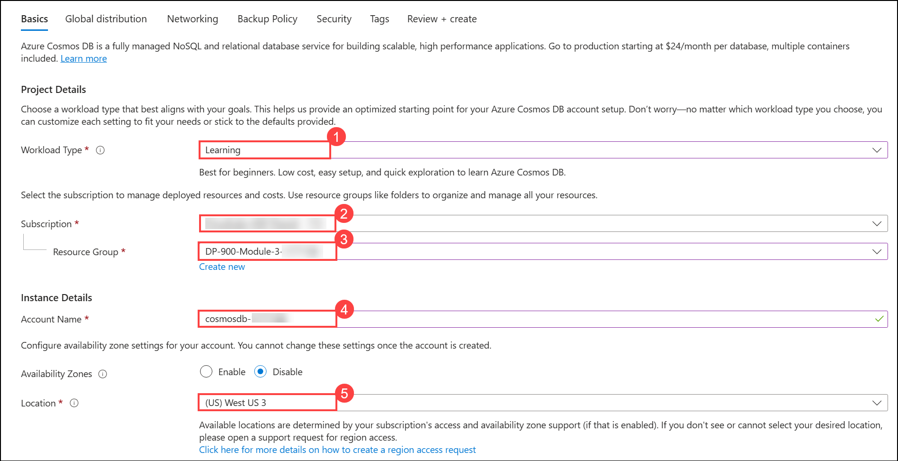
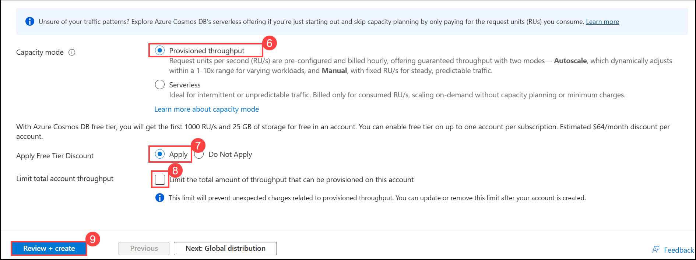
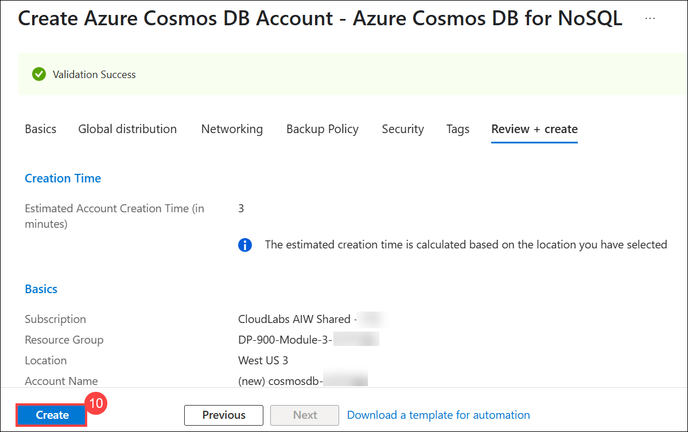
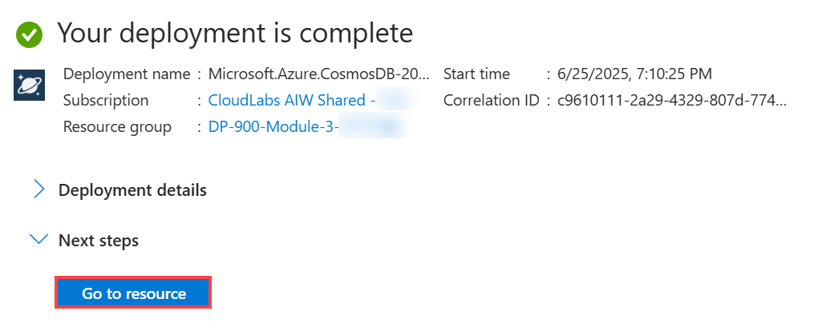
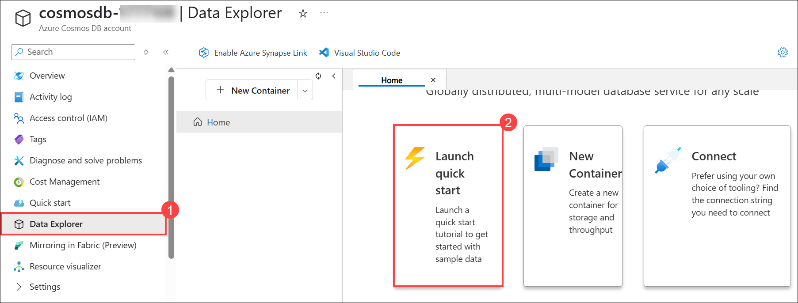
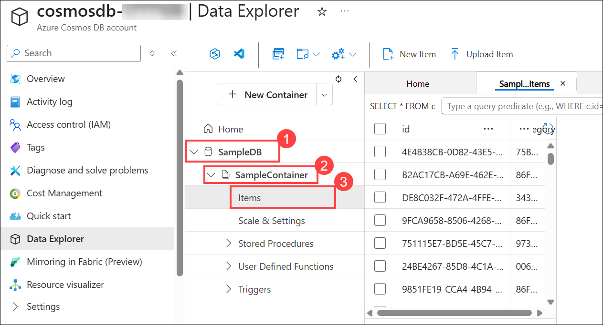
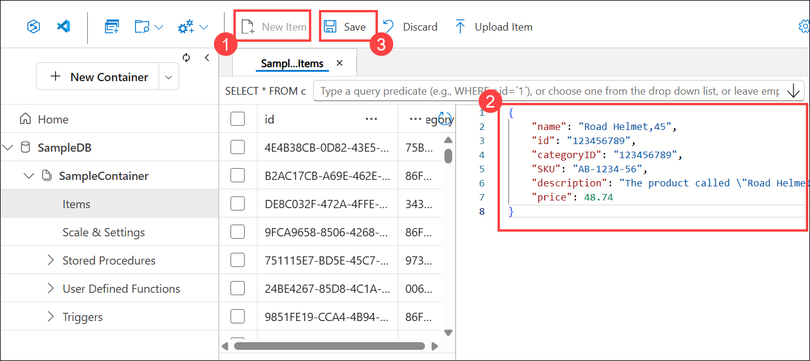
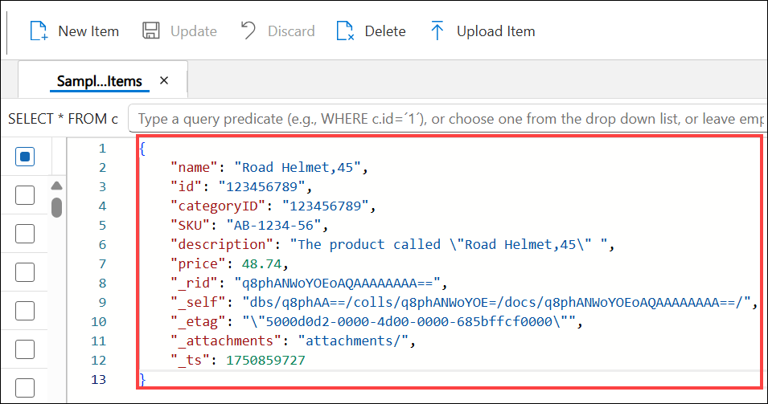
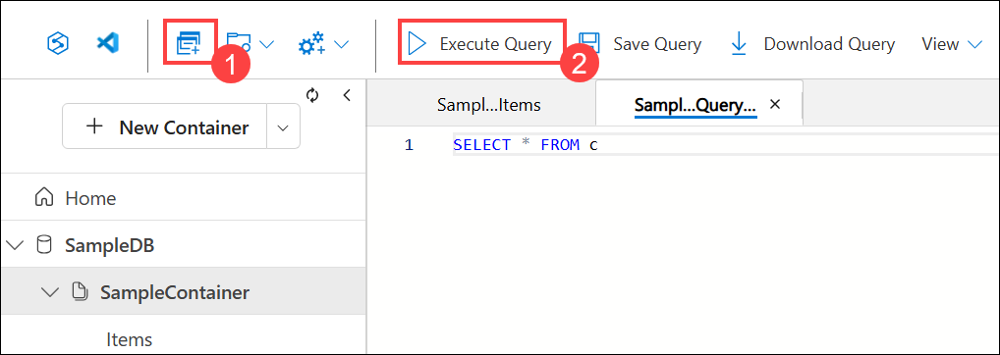
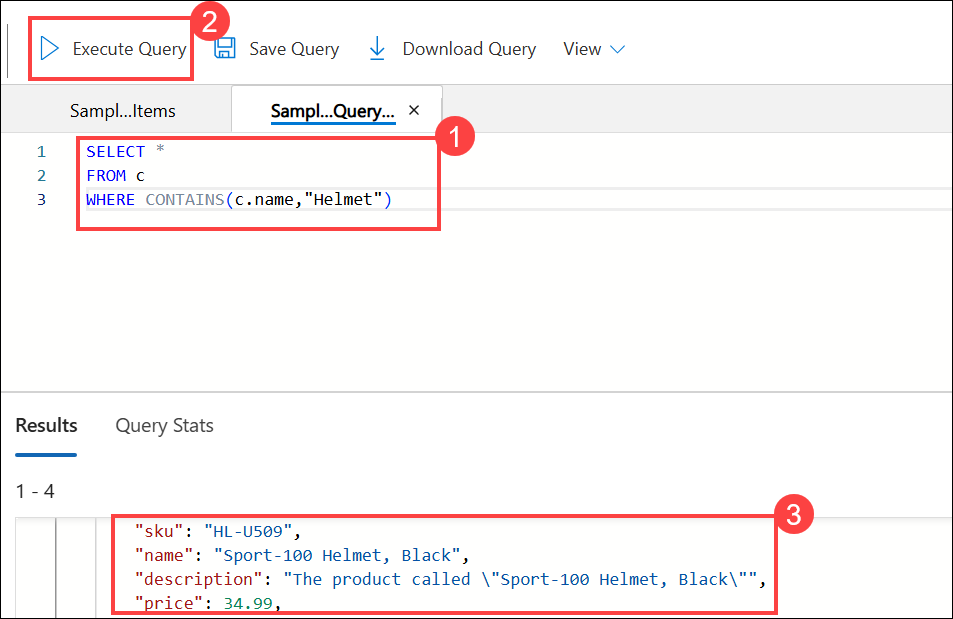

# Lab 01: Explore Azure Cosmos DB

## Lab scenario
In this lab, you'll provision an Azure Cosmos DB database in your Azure subscription and explore the various ways you can use it to store non-relational data.

## Lab objectives

In this lab, you will perform the following tasks:

+ Task 1: Create a Cosmos DB account
+ Task 2: Create a sample database
+ Task 3: View and create items
+ Task 4: Query the database

### Exercise 1: Explore Azure Cosmos DB

To use Cosmos DB, you must provision a Cosmos DB account in your Azure subscription. In this exercise, you'll provision a Cosmos DB account that uses the core (SQL) API.

### Task 1: Create a Cosmos DB account
In this task, you will provision an Azure Cosmos DB SQL account, configure essential settings, and retrieve the necessary connection details for future development.

1. On the **Azure Portal** page, in the **Search resources, services and docs (G+/)** box at the top of the portal, enter **Azure Cosmos DB (1)**, and then select **Azure Cosmos DB (2)** under services.

   
   
1. Select **+ Create (1)** in the Azure Cosmos DB panel, then under **Azure Cosmos DB for NoSQL**, click **Create (2)** to initiate the creation of a NoSQL account.

    

    

1.  Enter the following details, and then select  **Review + Create (9)**:
    -   **Workload Type (1)**: Learning
    -   **Subscription (2)**: Select your **Azure subscription.**
    -   **Resource group (3)**: Select existing resource group **DP-900-Module-3-<inject key="DeploymentID" enableCopy="false"/>**
    -   **Account Name (4)**: Enter **cosmosdb-<inject key="DeploymentID" enableCopy="false"/>**
    -   **Location (5)**: Choose any available location
    -   **Capacity mode (6)**: Provisioned throughput
    -   **Apply Free-Tier Discount (7)**: Select Apply
    -   **Limit total account throughput (8)**: Unselected

        

        

1.  When the configuration has been validated, select  **Create (10)**.

    

1.  Once the deployment is complete, click **Go to resource** to access the deployed Azure Cosmos DB account.

    

### Task 2: Create a sample database

This task involves reviewing pre-configured settings and observing the creation process of the SampleDB database and its container.
*Throughout this procedure, close any tabs that are displayed in the portal.*

1. On the page for your new Cosmos DB account, in the pane on the left, select **Data Explorer (1)**.
   
1. In the **Data Explorer** page, select **Launch quick start (2)**.

   

1. In the **New container** tab, review the pre-populated settings for the sample database, and then select **OK**.

1. Observe the status in the panel at the bottom of the screen until the **SampleDB** database and its **SampleContainer** container have been created (which may take a minute or so).

### Task 3: View and create items

1. In the **Data Explorer** page, expand the  **SampleDB (1)**  database and the **SampleContainer (2)**, and select  **Items (3)**  to see a list of items in the container. The items represent people, each with a unique ID, a first name, an age, and other properties.

   

1.  Select any of the items in the list to see a JSON representation of the item data, then unselect and proceed with the next step to create a blank item.

1.  At the top of the page, select  **New Item (1)**  to create a new blank item.

1.  **Modify the JSON for the new item as follows  (2)**, and then select  **Save (3)**.

    
    
    ```json
    {
        "name": "Road Helmet,45",
        "id": "123456789",
        "categoryID": "123456789",
        "SKU": "AB-1234-56",
        "description": "The product called \"Road Helmet,45\" ",
        "price": 48.74
    }
    ```
    
1.  After saving the new item, notice that additional metadata properties are added automatically.

    

### Task 4: Query the database

This task demonstrates how to create, view, and query items in a Cosmos DB container using the Data Explorer interface, simulating how developers would interact with the database using SDKs in real-world applications.

1. In the  **Data Explorer**  page, select the  **New SQL Query (1)**  icon.

1. In the SQL Query editor, review the default query (`SELECT * FROM c`) and use the  **Execute Query (2)**  button to run it.

   

1.  Review the results, which include the full JSON representation of all items.

1.  Modify the query as follows:
   
    ```sql
    SELECT *
    FROM c
    WHERE CONTAINS(c.name,"Helmet")
    ```

1. Use the **Execute Query (2)** button to run the revised query and review the **Result (3)**, which includes JSON entities for any items with a **name** field containing the text "Helmet".

   
    
1.  Close the SQL Query editor, discarding your changes.
    
    >**Note**: You've seen how to create and query JSON entities in a Cosmos DB database by using the data explorer interface in the Azure portal. In a real scenario, an application developer would use one of the many programming language-specific software development kits (SDKs) to call the core (SQL) API and work with data in the database.
    
    > **Congratulations** on completing the lab! Now, it's time to validate it. Here are the steps:
    > - Hit the Validate button for the corresponding task. If you receive a success message, you have successfully validated the lab. 
    > - If not, carefully read the error message and retry the step, following the instructions in the lab guide.
    > - If you need any assistance, please contact us at cloudlabs-support@spektrasystems.com. We are available 24/7 to help you out. 

    <validation step="0c506d8c-06e7-4eb7-aa88-fed3d24ffcfc" />

## Summary 

In this lab, you gained hands-on experience with creating, viewing, modifying, and querying data in Azure Cosmos DB, which is valuable for storing non-relational data in real-world applications.

## Review
In this lab, you have completed:
- Create a Cosmos DB account
- Create a sample database
- View and create items
- Query the database
  
## You have successfully completed this lab

