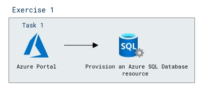
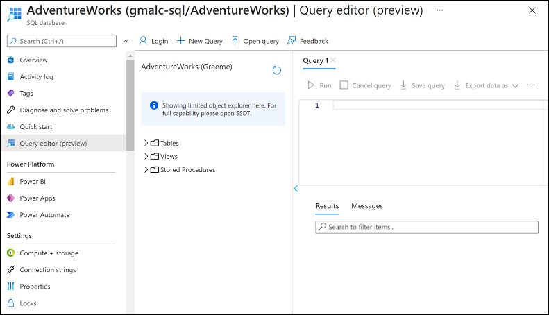

# Lab 01: Explore Azure SQL Database

## Lab scenario

In this lab, you'll provision an Azure SQL Database resource in your Azure subscription, and then use SQL to query the tables in a relational database. 

## Lab objective

In this lab, you will perform:

+ Task 1: Provision an Azure SQL Database resource

## Estimated timing: 30 minutes

## Architecture diagram



### Exercise 1: Provision Azure relational database services

In this exercise, you'll provision and test an Azure SQL Database resource.

#### Task 1: Provision an Azure SQL Database resource

1. In the Azure portal, select  **＋ Create a resource**.

1. On the **Create a resource** page, search and select **Azure SQL**.

     

1. Then in the resulting  **Azure SQL**  page, select  **Create > Azure SQl**.

      

1. Review the Azure SQL options that are available, and then in the  **SQL databases** (1)  tile, ensure  **Single database** (2)  is selected and select  **Create** (3).
    
     
    
1. Enter the following values on the  **Create SQL Database**  page:
    
    -   **Subscription**: select your Azure subscription.
    -   **Resource group**: select existing resource group with a name **Dp900-module1-<inject key="DeploymentID" enableCopy="false"/>**.
    -   **Database name**:  _AdventureWorks_
    -   **Server**: Select  **Create new**  and create a new server with a unique name in any available location. In the Authentication method **Use SQL authentication**  and specify any name as the server admin login and a suitably complex password (remember the password - you'll need it later!), and select **OK**.
    -   **Want to use SQL elastic pool?**:  _No_
    -   **Compute + storage**: Leave unchanged
    -   **Backup storage redundancy**:  _Locally-redundant backup storage_

1. On the  **Create SQL Database**  page, select  **Next :Networking >**.

1. On the **Networking**  page, in the  **Network connectivity**  section, select  **Public endpoint**. Select  **Yes**  for both options in the  **Firewall rules**  
   section to allow access to your database server from Azure services and your current client IP address. Then select  **Next: Security >**

     

1. On the **Security** tab set the  **Enable Microsoft Defender for SQL**  option to  **Not now** and click **Next: Additional Settings >**  

    

1. On the **Additional settings**  tab, set the  **Use existing data**  option to  **Sample**  (this will create a sample database that you can explore later) then 
   select **OK**. Then click on **Review + Create**.

    

1. Select  **Create**  to create your Azure SQL database.
    
1. Wait for deployment to complete. Then go to the resource that was deployed, which should look like this
    
    
    
1. In the pane on the left side of the page, select  **Query editor (preview)**, and then sign in using the administrator login and password you specified for your server, then select **OK**.
    
    >**Note:** _If an error message stating that the client IP address isn't allowed is displayed, select the  **Allowlist IP ...**  link at the end of the message to allow access and try to sign in again (you previously added you own computer's client IP address to the firewall rules, but the query editor may connect from a different address depending on your network configuration.)_
    
   The query editor looks like this:
    
   
    
1. Expand the  **Tables**  folder to see the tables in the database.
    
1. In the  **Query 1**  pane, enter the following SQL code:

    ```sql
    SELECT * FROM SalesLT.Product;
    ```
    
1. Select  **▷ Run**  above the query to run it and view the results, which should include all columns for all rows in the  **SalesLT.Product**  table as shown here:
    
     
     
1. Replace the existing code with the following code, and then select **&#9655; Run** to run the new query and review the results (which includes only the **ProductID**, **Name**, **ListPrice**, **ProductCategoryID** columns):

    ```sql
    SELECT ProductID, Name, ListPrice, ProductCategoryID
    FROM SalesLT.Product;
    ```

    

1. Now try the following query, replace the existing query, and then select **&#9655; Run** to run the new query which uses a JOIN to get the category name from the **SalesLT.ProductCategory** table:

    ```sql
    SELECT p.ProductID, p.Name AS ProductName,
            c.Name AS Category, p.ListPrice
    FROM SalesLT.Product AS p
    JOIN [SalesLT].[ProductCategory] AS c
        ON p.ProductCategoryID = c.ProductCategoryID;
    ```

    

1. Close the query editor pane, discarding your edits.
  
    > **Congratulations** on completing the task! Now, it's time to validate it.

    <validation step="8741822c-1290-45d5-9c7d-adb15c3dc8f5" />

## Review
In this lab, you have completed:
- Provision an Azure SQL Database resource
  
## You have successfully completed this lab
