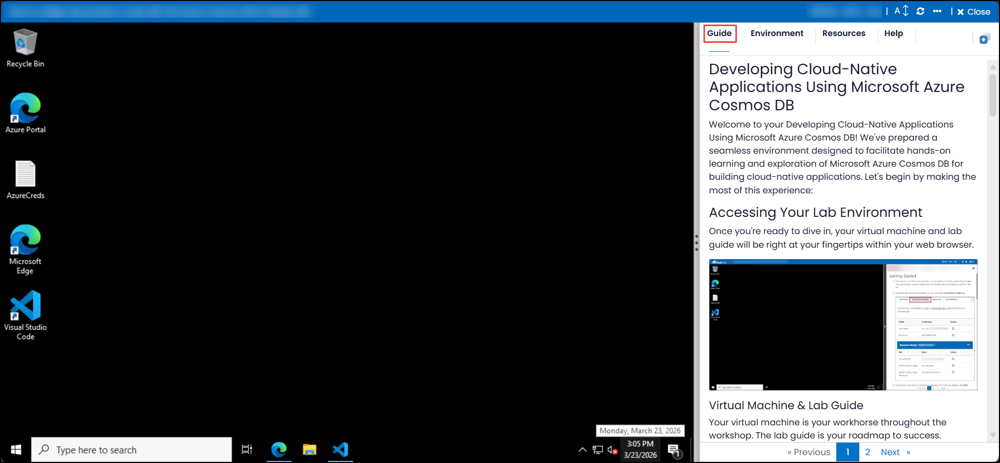
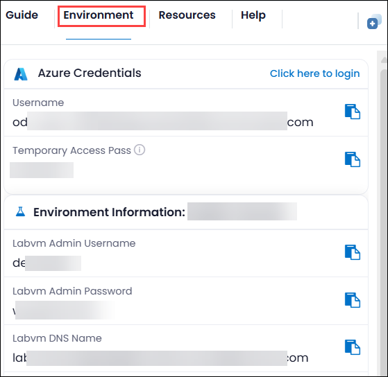
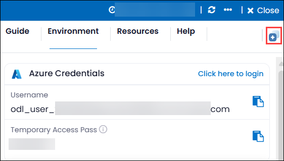
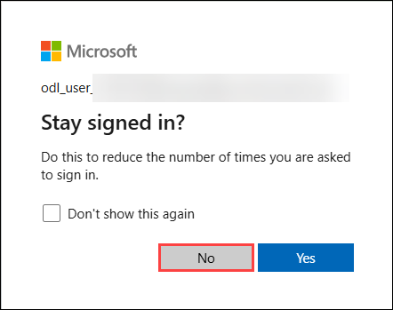
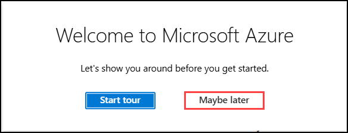

# Microsoft Azure Cosmos DB を使用したクラウド ネイティブ アプリケーションの開発

Microsoft Azure Cosmos DB を使用したクラウド ネイティブ アプリケーションの開発へようこそ！クラウド ネイティブ アプリケーションを構築するための Microsoft Azure Cosmos DB について、実践的な学習と探求を促進するシームレスな環境をご用意しました。それでは、この体験を最大限に活用するために始めましょう。

## ラボ環境へのアクセス

準備ができたら、仮想マシンとラボ ガイドは Web ブラウザー内ですぐにご利用いただけます。

### 仮想マシンとラボ ガイド

仮想マシンは、ワークショップを通してあなたの作業環境となります。ラボ ガイドは、成功への道しるべです。

## ラボ リソースの確認

ラボのリソースと資格情報について理解を深めるには、**Environment Details** タブに移動してください。

## Split Window 機能の利用

便利な機能として、右上隅にある **Split Window** ボタンを選択することで、ラボ ガイドを別のウィンドウで開くことができます。

## 仮想マシンの管理

**Resources** タブから、必要に応じて仮想マシンの開始、停止、再起動を自由に行ってください。操作はすべてあなた次第です！

## ラボ ガイドのズームイン / ズームアウト

タイマーの隣にある **A↕ : 100%** アイコンを使用して、ズーム レベルを調整できます。

## Azure Portal を使い始めましょう

1. 仮想マシン上で、以下のように Azure Portal アイコンをクリックします。

   

1. Azure Portal にログインします。

1. **Sign into Microsoft Azure** タブが表示されます。ここに資格情報を入力します。

   - **Email/Username:** <inject key="AzureAdUserEmail"></inject>

     

1. 次に、パスワードを入力します。

   - **Password:** <inject key="AzureAdUserPassword"></inject>

     

1. サインインを維持するかどうか確認されたら、**No** をクリックして構いません。

   

1. **Welcome to Microsoft Azure** というポップアップ ウィンドウが表示された場合は、**Maybe later** をクリックしてツアーをスキップします。

   

## サポートへのお問い合わせ

CloudLabs サポート チームは、年中無休 24 時間体制で、メールおよびライブ チャットを通じて、いつでもシームレスなサポートを提供しています。受講者とインストラクターの双方に向けた専用のサポート チャネルをご用意しており、あらゆるご要望に迅速かつ効率的に対応いたします。

受講者向けサポート窓口:

- メール サポート: cloudlabs-support@spektrasystems.com

- ライブ チャット サポート: https://cloudlabs.ai/labs-support

それでは、右下の Next をクリックして次のページに進んでください。

### Happy Learning!!
