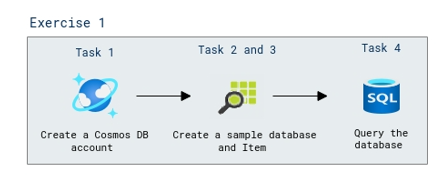
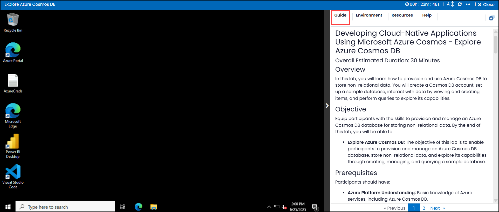
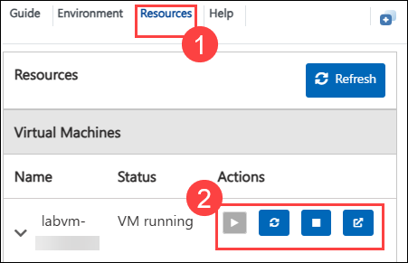
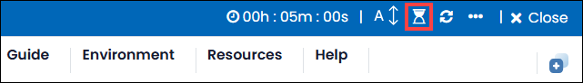
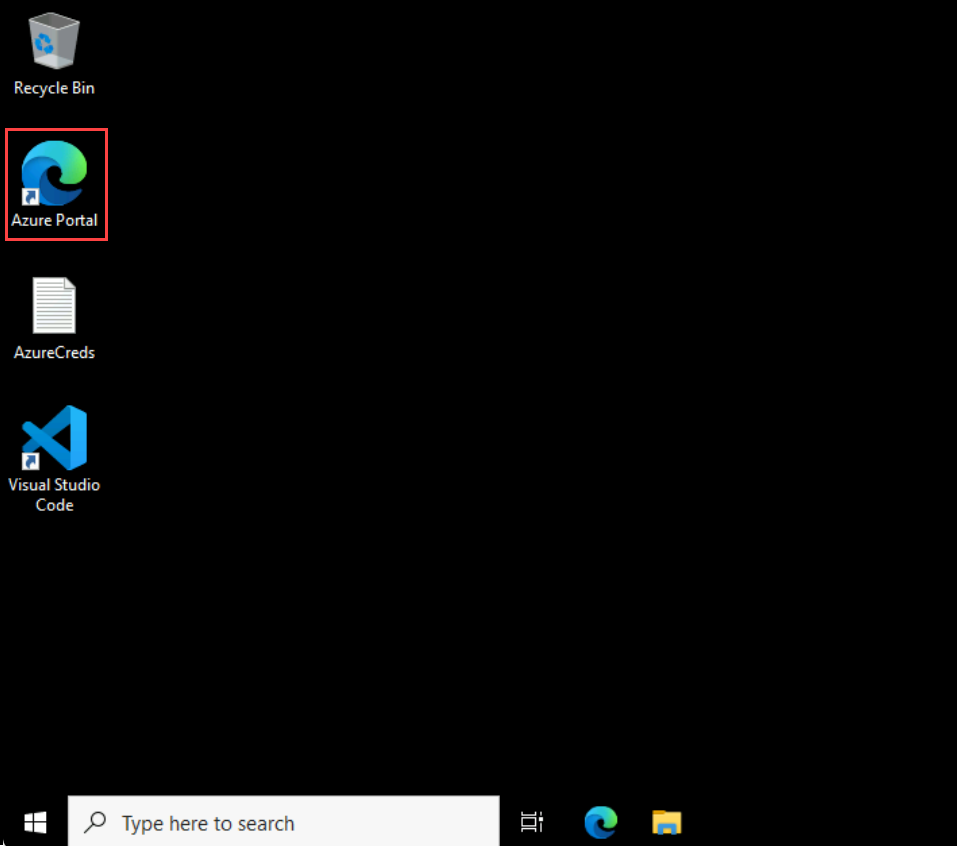
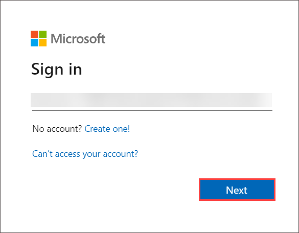
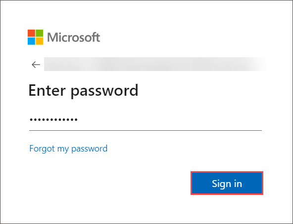
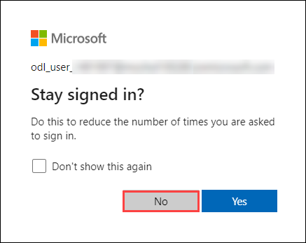

# Developing Cloud-Native Applications Using Microsoft Azure Cosmos - Explore Azure Cosmos DB   

### Overall Estimated Duration: 30 Minutes

## Overview

In this lab, you will learn how to provision and use Azure Cosmos DB to store non-relational data. You will create a Cosmos DB account, set up a sample database, interact with data by viewing and creating items, and perform queries to explore its capabilities.

## Objective

Equip participants with the skills to provision and manage an Azure Cosmos DB database for storing non-relational data. By the end of this lab, you will be able to:

- **Explore Azure Cosmos DB:** The objective of this lab is to enable participants to provision and manage an Azure Cosmos DB database, store non-relational data, and explore its capabilities through creating, managing, and querying a sample database.

## Prerequisites

Participants should have:

- **Azure Platform Understanding:** Basic knowledge of Azure services, including Azure Cosmos DB.

## Architechture

This architecture illustrates the process of provisioning and using Azure Cosmos DB for managing non-relational data. In this lab, the user will walk through creating a Cosmos DB account, setting up a sample database, interacting with data by viewing and creating items, and performing queries to explore its capabilities. This lab provides a foundational understanding of using Azure Cosmos DB to store and manage non-relational data efficiently.

## Architecture Diagram
   
   

## Explanation of Components

- **Azure Cosmos DB:** A globally distributed, multi-model database service that supports the MongoDB API for seamless integration. Cosmos DB provides scalability, high availability, and low latency. 

## Getting started with the lab

Welcome to your Developing Cloud-Native Applications Using Microsoft Azure Cosmos DB! We've prepared a seamless environment designed to facilitate hands-on learning and exploration of Microsoft Azure Cosmos DB for building cloud-native applications. Let's begin by making the most of this experience:
 
## Accessing Your Lab Environment
 
Once you're ready to dive in, your virtual machine and guide will be right at your fingertips within your web browser.
 

### Virtual Machine & Guide
 
In the integrated environment, the lab VM serves as the designated workspace, while the guide is accessible on the right side of the screen.

**Note**: Kindly ensure that you are following the instructions carefully to ensure the lab runs smoothly and provides an optimal user experience.
 
## Exploring Your Lab Resources
 
To get a better understanding of your lab resources and credentials, navigate to the **Environment** tab.

## Utilizing the Split Window Feature
 
For convenience, you can open the guide in a separate window by selecting the **Split Window** button from the Top right corner.
 

## Managing Your Virtual Machine
 
Feel free to **start, stop, or restart** your virtual machine as needed from the **Resources** tab. Your experience is in your hands!
 

## Lab Guide Zoom In/Zoom Out

To adjust the zoom level for the environment page, click the **A↕: 100%** icon located next to the timer in the lab environment.

 
## **Lab Duration Extension**

1. To extend the duration of the lab, kindly click the **Hourglass** icon in the top right corner of the lab environment. 

      

   >**Note:** You will get the **Hourglass** icon when 10 minutes are remaining in the lab.

1. Click **OK** to extend your lab duration.
 
   

1. If you have not extended the duration prior to when the lab is about to end, a pop-up will appear, giving you the option to extend. Click **OK** to proceed.

## Let's Get Started with Azure Portal
 
1. In the **JumpVM**, click on the **Azure portal shortcut** of the Microsoft Edge browser, which is created on the desktop.

   

1. On the **Sign in to Microsoft Azure** tab, you will see the login screen, in that enter the following email/username, and click on **Next**.
 
   - **Email/Username:** <inject key="AzureAdUserEmail"></inject>

     

1. Now enter the following password and click on **Sign in**.
 
   - **Password:** <inject key="AzureAdUserPassword"></inject>

     

1. If prompted to stay signed in, you can click **No**

   
 
1. If a **Welcome to Microsoft Azure** pop-up window appears, simply click "cancel" to skip the tour.

## Support Contact

The CloudLabs support team is available 24/7, 365 days a year, via email and live chat to ensure seamless assistance at any time. We offer dedicated support channels tailored specifically for both learners and instructors, ensuring that all your needs are promptly and efficiently addressed.

Learner Support Contacts:

- Email Support: cloudlabs-support@spektrasystems.com

- Live Chat Support: https://cloudlabs.ai/labs-support
   
Now, click on Next from the lower right corner to move to the next page.

### Happy Learning!!
