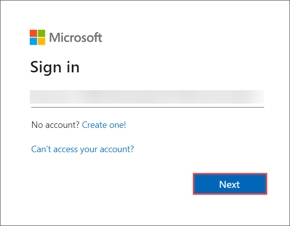

# Developing Cloud-Native Applications Using Microsoft Azure Cosmos DB - Migrate existing data using Azure Data Factory

### Overall Estimated Duration: 90 Minutes

## Overview

This lab focuses on integrating Azure Cosmos DB with Azure Data Factory to manage and transform data efficiently. The process involves creating and seeding an Azure Cosmos DB SQL API account, followed by setting up an Azure Data Factory resource. Participants will populate a Cosmos DB container using a command-line utility and use Azure Data Factory to move a subset of data from one container to another, showcasing the capabilities of these Azure services for data ingestion and transformation.

## Objective

Equip participants with the skills to integrate Azure Cosmos DB with Azure Data Factory for efficient data management and transformation. By the end of this lab, you will be able to:

- **Migrate existing data using Azure Data Factory:** The objective of this lab is to enable participants to integrate Azure Cosmos DB with Azure Data Factory, populate a Cosmos DB container, and move data between containers using Azure Data Factory for efficient data management and transformation.

## Prerequisites

Participants should have:

- **Azure Platform Understanding:** Basic knowledge of Azure services, including Azure Cosmos DB.

- **Data Integration Knowledge:** A basic understanding of data movement and transformation concepts.

## Architechture

This architecture illustrates the process of integrating Azure Cosmos DB with Azure Data Factory for data management and transformation. In this lab, the user will create a Cosmos DB account, set up a sample database, and use Azure Data Factory to move data between containers. The lab provides a practical understanding of how to use these services to efficiently manage, populate, and transform non-relational data in the cloud.

## Architechture Diagram

## Explanation of Components

- **Azure Cosmos DB:** A globally distributed, multi-model database service that supports MongoDB API for seamless integration. Cosmos DB provides scalability, high availability, and low latency. 

- **Azure Data Factory:** A cloud-based data integration service that enables users to create, schedule, and orchestrate data workflows. It supports data movement and transformation across various sources, both on-premises and in the cloud, and is designed for building scalable data pipelines.

## Getting started with the lab

Welcome to your Developing Cloud-Native Applications Using Microsoft Azure Cosmos DB! We've prepared a seamless environment designed to facilitate hands-on learning and exploration of Microsoft Azure Cosmos DB for building cloud-native applications. Let's begin by making the most of this experience:
 
## Accessing Your Lab Environment
 
Once you're ready to dive in, your virtual machine and lab guide will be right at your fingertips within your web browser.
 

### Virtual Machine & Lab Guide
 
Your virtual machine is your workhorse throughout the workshop. The lab guide is your roadmap to success.
 
## Exploring Your Lab Resources
 
To get a better understanding of your lab resources and credentials, navigate to the **Environment Details** tab.
 

## Utilizing the Split Window Feature
 
For convenience, you can open the lab guide in a separate window by selecting the **Split Window** button from the Top right corner.
 

 
## **Lab Duration Extension**

1. To extend the duration of the lab, kindly click the **Hourglass** icon in the top right corner of the lab environment. 

      

   >**Note:** You will get the **Hourglass** icon when 10 minutes are remaining in the lab.

3. Click **OK** to extend your lab duration.
 
   

4. If you have not extended the duration prior to when the lab is about to end, a pop-up will appear, giving you the option to extend. Click **OK** to proceed.

## Managing Your Virtual Machine
 
Feel free to start, stop, or restart your virtual machine as needed from the **Resources** tab. Your experience is in your hands!
 

## Let's Get Started with Azure Portal
 
1. On your virtual machine, click on the Azure Portal icon as shown below:
   

1. Log in to Azure Portal.

1. You'll see the **Sign into Microsoft Azure** tab. Here, enter your credentials:
 
   - **Email/Username:** <inject key="AzureAdUserEmail"></inject>

     

1. Next, provide your password:
 
   - **Password:** <inject key="AzureAdUserPassword"></inject>

     

1. If prompted to stay signed in, you can click "No."
 
1. If a **Welcome to Microsoft Azure** pop-up window appears, simply click "cancel" to skip the tour.

## Support Contact

The CloudLabs support team is available 24/7, 365 days a year, via email and live chat to ensure seamless assistance at any time. We offer dedicated support channels tailored specifically for both learners and instructors, ensuring that all your needs are promptly and efficiently addressed.

Learner Support Contacts:

- Email Support: cloudlabs-support@spektrasystems.com

- Live Chat Support: https://cloudlabs.ai/labs-support
   
Now, click on Next from the lower right corner to move to the next page.

### Happy Learning!!
