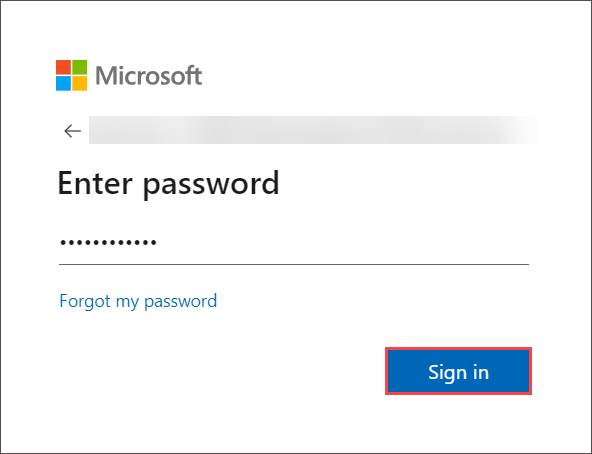

# Developing Cloud-Native Applications Using Microsoft Azure Cosmos DB - Review the default index policy for an Azure Cosmos DB for NoSQL container with the portal

### Overall Estimated Duration: 30 Minutes

## Overview

In this lab, you will explore how to observe and modify the default indexing policy in Azure Cosmos DB for NoSQL using the Data Explorer. Indexing policies play a crucial role in optimizing query performance and controlling storage usage in Cosmos DB. Through hands-on tasks, you will learn how to configure and manage indexing settings to meet specific application requirements.

## Objective

Learn how to observe and modify the default indexing policy in Azure Cosmos DB for NoSQL using the Data Explorer. By the end of this lab, you will be able to:

- **Review the default index policy for an Azure Cosmos DB for NoSQL container with the portal:** The objective of this lab is to provide a comprehensive understanding of how to observe and manipulate the default indexing policy in Azure Cosmos DB for NoSQL using the Data Explorer. You will learn to inspect and modify indexing policies for optimal query performance. By the end of the lab, you will have the skills to manage indexing efficiently in Azure Cosmos DB, ensuring your non-relational data is indexed and queried with maximum efficiency for scalable applications.

## Prerequisites

Participants should have:

- **Azure Platform Understanding:** Basic knowledge of Azure services, including Azure Cosmos DB.

- **Basic Programming Skills:** Familiarity with .NET development and C# programming.

## Architechture

This diagram illustrates the process of managing indexing policies in Azure Cosmos DB for NoSQL using the Data Explorer. It begins with creating an Azure Cosmos DB account and seeding it with sample data. Then, it demonstrates how to view and manipulate the default indexing policy for containers, optimizing query performance and ensuring efficient data management within the Cosmos DB environment.

## Architechture Diagram

## Explanation of Components

- **Azure Cosmos DB:** A globally distributed, multi-model database service that supports MongoDB API for seamless integration. Cosmos DB provides scalability, high availability, and low latency. 

- **Visual Studio Code (VS Code):** A lightweight, versatile, and open-source code editor developed by Microsoft. It supports multiple programming languages, features extensions for enhanced functionality, and offers debugging, Git integration, and intelligent code completion.

## Getting started with the lab

Welcome to your Developing Cloud-Native Applications Using Microsoft Azure Cosmos DB! We've prepared a seamless environment designed to facilitate hands-on learning and exploration of Microsoft Azure Cosmos DB for building cloud-native applications. Let's begin by making the most of this experience:
 
## Accessing Your Lab Environment
 
Once you're ready to dive in, your virtual machine and lab guide will be right at your fingertips within your web browser.
 

### Virtual Machine & Lab Guide
 
Your virtual machine is your workhorse throughout the workshop. The lab guide is your roadmap to success.
 
## Exploring Your Lab Resources
 
To get a better understanding of your lab resources and credentials, navigate to the **Environment Details** tab.
 

## Utilizing the Split Window Feature
 
For convenience, you can open the lab guide in a separate window by selecting the **Split Window** button from the Top right corner.
 

 
## **Lab Duration Extension**

1. To extend the duration of the lab, kindly click the **Hourglass** icon in the top right corner of the lab environment. 

      

   >**Note:** You will get the **Hourglass** icon when 10 minutes are remaining in the lab.

3. Click **OK** to extend your lab duration.
 
   

4. If you have not extended the duration prior to when the lab is about to end, a pop-up will appear, giving you the option to extend. Click **OK** to proceed.

## Managing Your Virtual Machine
 
Feel free to start, stop, or restart your virtual machine as needed from the **Resources** tab. Your experience is in your hands!
 

## Let's Get Started with Azure Portal
 
1. On your virtual machine, click on the Azure Portal icon as shown below:
   

1. Log in to Azure Portal.

1. You'll see the **Sign into Microsoft Azure** tab. Here, enter your credentials:
 
   - **Email/Username:** <inject key="AzureAdUserEmail"></inject>

     

1. Next, provide your password:
 
   - **Password:** <inject key="AzureAdUserPassword"></inject>

     

1. If prompted to stay signed in, you can click "No."
 
1. If a **Welcome to Microsoft Azure** pop-up window appears, simply click "cancel" to skip the tour.

## Support Contact

The CloudLabs support team is available 24/7, 365 days a year, via email and live chat to ensure seamless assistance at any time. We offer dedicated support channels tailored specifically for both learners and instructors, ensuring that all your needs are promptly and efficiently addressed.

Learner Support Contacts:

- Email Support: cloudlabs-support@spektrasystems.com

- Live Chat Support: https://cloudlabs.ai/labs-support
   
Now, click on Next from the lower right corner to move to the next page.

### Happy Learning!!
